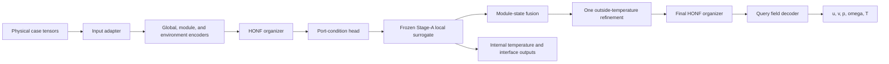

# Model comparison: formal adaptive sparse additive HONF versus classic pairwise HONF

## Technical summary

This document compares the following two ThermalChannel forward runs:

- **New/formal:** `Run_1101_20260819_094525_adaptive_sparse_additive_formal`, launched from `adaptive_sparse_additive.json`, 5,000 requested epochs, and still running when this document was prepared.
- **Classic/old:** `Run_1000_20260817_214356_enhanced_honf_pairwise`, launched from `enhanced_honf_pairwise.json`, completed at epoch 10,000.

The comparison is structurally well controlled in its dataset, physical inputs, output schema, loss, hidden width, environment grid, pairwise kernel, and frozen local-coupling workflow. The central model change is:

\[
\boxed{
\text{fixed, dense, context-fused HONF}
\quad\longrightarrow\quad
\text{exchangeable, sparse, exactly additive HONF}
}
\]

More concretely, the classic run uses six fixed learned edge channels, dense softmax assignment/routing, the raw organizer latent as mechanism state, dense pairwise execution, and a single context-fusion prediction head. The formal run uses eight anonymous candidate slots, viability-filtered quality/coverage selection, exact 1.5-entmax assignments, bounded Gaussian environment and query locality, descriptor-first mechanism states, gathered top-route execution, and an exact background-plus-edge field decomposition.

Two qualifications matter when interpreting a future outcome comparison:

1. Run 1101 is the **base adaptive profile**, not the scheduled Stage-3 overlay. Its entmax and gathered execution are active from the outset; selection uses a 200-epoch all-viable warmup followed by hard quality/coverage selection. It does not use the gradual selection, normalizer, or execution schedules from `stage3_scheduled_adaptive_sparse.json`.
2. The frozen Stage-A checkpoints differ: Run 1101 uses `best_model.pt`, whereas Run 1000 used `latest_model.pt`. Their SHA-256 hashes differ, so this is not a perfectly isolated HONF-only experiment.

No final accuracy or convergence conclusion is made here because Run 1101 is still in progress. This is an architecture, configuration, provenance, and tensor-flow comparison.

## 1. Scope, evidence, and reproducibility

### 1.1 Authoritative artifacts

The comparison uses, in order of authority:

1. each run's `run_manifest.json` for launch provenance;
2. each run's `config_resolved.json` for effective runtime settings;
3. each run's saved `best_model.pt` for actual state-dictionary structure;
4. the current conditional implementation in `src/honf_forward_core` and `Case_ThermalChannel/src/channelthermal`.

| Property | Run 1101 | Run 1000 |
|---|---:|---:|
| Status at preparation | Running | Completed |
| Requested/completed epochs | 5,000 requested | 10,000 completed |
| Core configuration | `adaptive_sparse_additive.json` | `enhanced_honf_pairwise.json` |
| Experiment overlay | None | None |
| Source commit | `cc7d97035314f92418ae8ba621193ade86ab180f` | `2afa84759858931a236321e0086750734466dcec` |
| Source worktree | Clean, 0 changed paths | Dirty, 51 changed paths |
| Dataset fingerprint | `4224093c...b36da05` | Same |
| Cases and split | 690 total; 600 train, 90 test | Same |
| Saved initialization checkpoint | None recorded | None recorded |
| Frozen Stage-A checkpoint | `best_model.pt`, epoch 5050 | `latest_model.pt`, epoch 6357 |
| Stage-A SHA-256 | `1981fac0...297988a` | `44f5cb48...767dbaf` |

Run 1101 is exactly tied to a clean commit. Run 1000 is not exactly reconstructible from Git alone because its 51-path uncommitted diff was not archived in the run directory. Its resolved configuration and checkpoint still determine the model that actually ran, but line-by-line claims about the uncommitted historical source cannot be made. The “exact code differences” sections below therefore separate:

- exact serialized configuration and state-dictionary evidence;
- exact current conditional code paths corresponding to those settings;
- the irrecoverable portion of Run 1000's dirty source provenance.

### 1.2 Outcome scope

Run 1000's completed manifest records a best validation field MSE of \(1.438475\times10^{-3}\) and a best validation temperature MSE of \(1.734409\times10^{-3}\). Comparable Run 1101 values are intentionally omitted until the run completes and a common evaluation checkpoint/split is selected. An early, changing checkpoint is not a scientifically valid final comparison.

## 2. General mathematical problem

### 2.1 ThermalChannel physics and learned operator

For a steady incompressible channel flow in the fluid domain \(\Omega_f\), the underlying fields are described schematically by

\[
\nabla\!\cdot\mathbf{u}=0,
\]

\[
\rho(\mathbf{u}\!\cdot\!\nabla)\mathbf{u}
=-\nabla p+\mu\nabla^2\mathbf{u},
\]

\[
\rho c_p(\mathbf{u}\!\cdot\!\nabla)T_f
=\nabla\!\cdot(k_f\nabla T_f),
\]

while each heated solid module \(\Omega_{s,m}\) obeys a conduction equation of the form

\[
-\nabla\!\cdot(k_s\nabla T_{s,m})=q_m'''.
\]

At a fluid-solid interface \(\Gamma_m\), conjugate heat transfer requires temperature and normal-flux compatibility,

\[
T_f=T_{s,m},
\qquad
k_f\nabla T_f\!\cdot\mathbf{n}
=k_s\nabla T_{s,m}\!\cdot\mathbf{n}.
\]

The global target at query coordinate \(\mathbf{x}\) has five channels,

\[
\mathbf{y}(\mathbf{x})
=\begin{bmatrix}u(\mathbf{x})&v(\mathbf{x})&p(\mathbf{x})&
\omega(\mathbf{x})&T(\mathbf{x})\end{bmatrix}^{\!\top},
\qquad
\omega=\frac{\partial v}{\partial x}-\frac{\partial u}{\partial y}.
\]

The learned problem is supervised operator approximation rather than direct PDE-residual minimization:

\[
\widehat{\mathcal F}_{\theta}:
\left(
Re,u_{\mathrm{in}},
\{\mathbf{c}_m,q_m,\chi_m,\boldsymbol{\kappa}_m\}_{m=1}^{M},
\Omega,\mathbf{x}
\right)
\mapsto
\widehat{\mathbf y}(\mathbf{x}),
\]

where \(\mathbf c_m\) is a module center, \(q_m\) is its scaled heat input, \(\chi_m\) is the active/padding mask, and \(\boldsymbol\kappa_m\) denotes material and geometry descriptors. A frozen Stage-A local surrogate also predicts module-internal temperature and interface response from learned port conditions.

### 2.2 Shared training objective

Both runs use the same normalized targets and the same composite objective. In compact form,

\[
\begin{aligned}
\mathcal L ={}&
w_f\mathcal L_{\mathrm{field}}
+w_i\mathcal L_{\mathrm{internal}}
+w_{\Gamma}\mathcal L_{\mathrm{interface}}
+w_p\mathcal L_{\mathrm{port}}\\
&+w_s\mathcal L_{\mathrm{port\ smooth}}
+w_g\mathcal L_{\mathrm{port/global}}
+w_c\mathcal L_{\mathrm{predicted\ consistency}}
+\mathcal L_{\mathrm{organizer}}.
\end{aligned}
\]

The configured weights are

\[
(w_f,w_i,w_{\Gamma},w_p,w_s,w_g,w_c)
=(1.0,1.0,0.2,0.3,0.01,0.2,0.05).
\]

The predicted-consistency weight ramps to 0.05 over 100 epochs. The port mode is `predicted` with no teacher-to-predicted schedule, so the local internal/interface terms use their full configured weights. The organizer-regularization block is present in the JSON but `enabled=false`; consequently it contributes zero and neither run is trained with an edge-count, entropy, load-balancing, or duplicate-edge penalty.

## 3. Shared end-to-end model

Both runs retain the same outer ThermalChannel computation:

The common tensor flow is:

| Stage | Tensor | Shape | Meaning |
|---|---|---:|---|
| Physical input | module centers | \([B,M,2]\) | Dynamically padded module locations |
| Physical input | module-present mask | \([B,M]\) | Active/padded module indicator |
| Input adapter | module features | \([B,M,10]\) | Heat, relative heat, activity, material, and radius features |
| Input adapter | global context | \([B,18]\) | Padding-invariant Reynolds, inlet, count/density, heat, domain, and material features |
| Environment builder | coordinates | \([B,192,2]\) | Cell-centered \(24\times8\) channel grid |
| Environment builder | features | \([B,192,7]\) | Position, wall, inlet/outlet, and centerline descriptors |
| Query builder | query features | \([B,Q,6]\) | Normalized position and rectangular-boundary distances |
| Core encoders | module tokens | \([B,M,256]\) | Module feature and Fourier-position embedding |
| Core encoders | environment tokens | \([B,192,256]\) | Environment feature/position embedding plus global token |
| Organizer | module incidence | \(A^{M}\in\mathbb R^{B\times M\times K}\) | Module-to-edge assignment |
| Organizer | environment incidence | \(A^{E}\in\mathbb R^{B\times192\times K}\) | Environment-to-edge assignment |
| Organizer | mechanism state | \([B,K,256]\) | Edge-local latent or descriptor-first state |
| Local coupling | port tokens | \([B,M,P,5]\), normally \(P=64\) | Port coordinate/direction plus \(T_{env}\) and \(h\) |
| Local coupling | local outputs | case dependent | Internal temperature, interface state, response latent |
| Decoder | sampled queries | \([B,Q,2]\), \(Q=1024\) in training | Global field locations |
| Decoder | prediction | \([B,Q,5]\) | \(u,v,p,\omega,T\) |

Both runs also share:

- hidden width 256, dropout 0, LayerNorm enabled;
- nonperiodic \(12\times6\) domain and module radius approximately 0.45;
- learned module and query routing;
- a 4-frequency Fourier query encoder;
- a four-layer, width-256 query-module pair MLP with four Fourier frequencies;
- module token and raw module features in the pair MLP;
- edge-mass normalization before pairwise reduction;
- query-to-edge learned geometry bias;
- a frozen 128-dimensional Stage-A local surrogate;
- corrected-physics local flux with blend 0.5;
- one local/global interaction-refinement pass;
- 32 port/global consistency points at radius offset 0.05;
- Adam-family training settings represented by learning rate \(3\times10^{-4}\), weight decay \(10^{-5}\), gradient clipping at 1.0, no AMP, and seed 0;
- batch size 48, 1,024 sampled points per case, input/target normalization, and the same dataset fingerprint.

## 4. Classic Run 1000 model

### 4.1 Fixed organizer

The classic organizer has \(K=6\) parameter-indexed edge channels. Given module tokens \(\mathbf m_i\) and environment tokens \(\mathbf e_j\), it computes

\[
A^M_{ik}=\operatorname{softmax}_{k}\!\left(W_M\mathbf m_i+b_M\right)_k,
\]

\[
A^E_{jk}=\operatorname{softmax}_{k}\!\left(
(W_E\mathbf e_j+b_E)_k
-\frac{\|\mathbf x_j^E-\mathbf s_k\|_2}{0.25\sqrt{L_x^2+L_y^2}}
\right),
\]

where the source centroid of edge \(k\) is

\[
\mathbf s_k=
\frac{\sum_i A^M_{ik}\mathbf c_i}{\sum_i A^M_{ik}}.
\]

The edge state is a learned fusion of normalized module and environment summaries:

\[
\widetilde{\mathbf m}_k=
\frac{\sum_i A^M_{ik}\,\phi_M(\mathbf m_i)}{\sum_i A^M_{ik}},
\qquad
\widetilde{\mathbf e}_k=
\frac{\sum_j A^E_{jk}\,\phi_E(\mathbf e_j)}{\sum_j A^E_{jk}},
\]

\[
\mathbf h_k=\operatorname{MLP}_{mix}
\left(\widetilde{\mathbf m}_k+\widetilde{\mathbf e}_k\right).
\]

All six edges are active. Their identities are tied to the six output coordinates of `module_score` and `env_score`; permuting edge labels requires permuting parameter rows and downstream state consistently.

### 4.2 Dense query and pairwise decoding

For encoded query \(\mathbf q_x\), the dense learned edge distribution is

\[
\alpha_{xk}=\operatorname{softmax}_k\left(
\frac{(W_q\mathbf q_x)^\top(W_k\mathbf h_k)}{\sqrt H}
+b_{geom}(x,k)
\right).
\]

There is no query top-(k) limit and no module gather limit. Every query evaluates every active module pair embedding \(\psi(x,i)\). With normalized edge-module weights

\[
\bar A^M_{ik}=\frac{A^M_{ik}}{\sum_{i'}A^M_{i'k}},
\]

the pairwise edge context and reduced pair context are

\[
\mathbf c^{pair}_{xk}=\sum_i\bar A^M_{ik}\psi(x,i),
\qquad
\mathbf c^{pair}_{x}=\sum_k\alpha_{xk}\mathbf c^{pair}_{xk}.
\]

The pair branch has a learned scalar gate \(g_p=\sigma(\gamma_p)\), initialized to 0.1. The `enhanced_honf_pairwise` decoder combines the hyper-value, pairwise, global, and near-module branches:

\[
\mathbf c_x=
\underbrace{\sum_k\alpha_{xk}W_v\mathbf h_k}_{\text{hyper value}}
+g_p\mathbf c^{pair}_x
+W_g\mathbf g
+W_n\mathbf c^{near}_x,
\]

\[
\widehat{\mathbf y}_{old}(x)
=\operatorname{Head}_{pred}\!\left(\operatorname{LayerNorm}(\mathbf c_x)\right).
\]

This is **context fusion**: the model does not expose an exact decomposition of the final five-channel field into background and individual edge fields.

## 5. Formal Run 1101 model

### 5.1 Exchangeable candidate organizer

Run 1101 has runtime candidate capacity \(K_{cap}=8\). Candidate identity comes from deterministic centered sinusoidal codes \(\mathbf z_k\), while all learned maps are shared across slots. A case-conditioned initialization has the form

\[
\mathbf s_k^{(0)}=
\phi_{base}(\mathbf p)
+\phi_{scale}(\mathbf p)\odot\mathbf z_k,
\]

where \(\mathbf p\) pools active module and environment tokens. Two shared GRU refinement iterations update candidates using candidate-normalized module and environment summaries.

At each refinement, module assignment is exact 1.5-entmax:

\[
A^{M,c}_{ik}=\operatorname{entmax}_{1.5,k}\left(
\frac{\phi_q^M(\mathbf m_i)^\top\phi_k^M(\mathbf s_k)}{\sqrt H}
\right).
\]

Environment assignment adds bounded Gaussian locality:

\[
A^{E,c}_{jk}=\operatorname{entmax}_{1.5,k}\left(
\frac{\phi_q^E(\mathbf e_j)^\top\phi_k^E(\mathbf s_k)}{\sqrt H}
+b^{loc}_{jk}
\right),
\]

\[
b^{loc}_{jk}
=-\frac12\,\min\!\left(r_{jk}^2,R^2\right),
\qquad R=3,
\]

so the locality bias is bounded below by (-4.5). The normalized anisotropic radius uses each candidate region scale with a minimum scale of (0.05(L_x,L_y)).

Candidate mass fractions are

\[
m_k^M=\frac{\sum_iA^{M,c}_{ik}}{\sum_{k'}\sum_iA^{M,c}_{ik'}},
\qquad
m_k^E=\frac{\sum_jA^{E,c}_{jk}}{\sum_{k'}\sum_jA^{E,c}_{jk'}}.
\]

A candidate is viable only if

\[
m_k^M>0.01
\quad\land\quad
m_k^E>0.01.
\]

If none is viable, exactly one candidate—the largest \(\sqrt{m_k^Mm_k^E}\)—is promoted as a safety fallback. Candidate quality is the geometric mean of module and environment purity, attenuated only below the two viability floors. Nonviable candidates are excluded from quality ordering, novelty, and selection.

### 5.2 Actual selection phase used by Run 1101

The resolved settings are `selection_warmup_epochs=200`, `selection_warmup_mode=legacy`, `selection_start_epoch=-1`, and `selection_transition_epochs=0`. Therefore:

\[
\mathcal S_t=
\begin{cases}
\{k:k\text{ viable}\}, & t<200,\\
\operatorname{QualityCoverageNovelty}(A^{M,c},A^{E,c}), & t\ge 200.
\end{cases}
\]

After warmup, the detached selector walks candidates in quality order, accepts novel candidates or enough candidates to meet the minimum count, and stops once module and environment coverage each reach 0.95 at token threshold 0.5. Maximum tolerated module/environment cosine redundancy is 0.85; the configured minimum active count is one.

This is a hard warmup-to-selection change at epoch 200. `initial_active_edges=6` validates the configuration and supplies an initial-count reference, but the current selector does not enforce six selected edges: warmup activates every viable candidate, potentially all eight, and post-warmup selection is coverage-driven.

Selected incidences are masked and row-renormalized. If an active module or environment token has zero selected support, a detached one-hot fallback assigns it to its highest-probability selected viable candidate. Thus active selected assignment rows remain mass-conserving:

\[
\sum_{k\in\mathcal S}A^M_{ik}=1
\quad(\chi_i=1),
\qquad
\sum_{k\in\mathcal S}A^E_{jk}=1.
\]

### 5.3 Descriptor-first mechanism state

The organizer exports source centroid/scale, environment-region centroid/scale, displacement, normalized distance, module/environment mass, both purities, and the active gate. These form a 16-component descriptor \(\mathbf d_k\). The decoder state is

\[
\widehat{\mathbf h}_k=
\operatorname{LayerNorm}\left(
\phi_d(\mathbf d_k)+0.35\,\phi_c(\mathbf h_k)
\right).
\]

This makes explicit source-region mechanism geometry primary while retaining a bounded content residual. In contrast, Run 1000 sends the organizer latent directly to the decoder because its mechanism encoder is disabled.

### 5.4 Sparse query and module execution

The query logits include the learned ten-feature geometry bias and an inherited bounded-Gaussian locality bias. Exact 1.5-entmax is applied over selected viable edges:

\[
\widetilde\alpha_{xk}
=\operatorname{entmax}_{1.5,k}
\left(\ell_{xk}^{content}+\ell_{xk}^{geometry}+b_{xk}^{loc}\right).
\]

Gathered execution is active from epoch 1. The decoder retains at most the top three query-edge routes and renormalizes once:

\[
\alpha_{xk}=
\frac{\widetilde\alpha_{xk}\,\mathbf 1[k\in\operatorname{Top3}(x)]}
{\sum_l\widetilde\alpha_{xl}\,\mathbf 1[l\in\operatorname{Top3}(x)]}.
\]

The same \(\alpha\) is used by both pairwise and edge-field paths. The retained-mass floor is 0.0, so the decoder does not expand beyond three routes merely to preserve additional query probability.

For pairwise execution, module importance is

\[
\beta_{xi}=\sum_k\alpha_{xk}\bar A^M_{ik}.
\]

The top eight active modules under \(\beta_{xi}\) are gathered for each query. Edge-specific module weights are then renormalized over those gathered modules before the pair MLP reduction. Again, the retained-mass floor is 0.0, so no extra modules are added to reach a mass target.

### 5.5 Exact additive output

The background branch attends densely over environment tokens and receives normalized query, global, and environment context:

\[
\mathbf b(x)=
\operatorname{Head}_{bg}\!\left(
\operatorname{Norm}_{bg}
[\mathbf q_x,\mathbf g,\mathbf c_x^E]
\right).
\]

For each routed edge, the edge head receives query state, descriptor-first mechanism state, ten geometry features, and edge-local pair context:

\[
\widetilde{\mathbf f}_k(x)=
\operatorname{Head}_{edge}\!\left(
\operatorname{Norm}_{edge}
[\mathbf q_x,\widehat{\mathbf h}_k,\boldsymbol\gamma(x,k),\mathbf c^{pair}_{xk}]
\right).
\]

With learned scalar (g_e=\sigma(\gamma_e)), initialized to 0.1, the exported edge contribution is

\[
\mathbf f_k(x)=
g_e\,a_k\,\alpha_{xk}\,\widetilde{\mathbf f}_k(x),
\]

where (a_k) is the effective selected-and-viable edge gate. The prediction has exact additive closure:

\[
\boxed{
\widehat{\mathbf y}_{new}(x)
=\mathbf b(x)+\sum_{k=1}^{K_{cap}}\mathbf f_k(x)
}
\]

The final linear layers of both output heads were initialized with standard deviation 0.001 and zero bias. Unlike context fusion, the edge gate is inside each exported `pred_field_by_edge`, so summing the exported background and edge tensors reconstructs `pred_field` numerically.

## 6. Concrete setting comparison

### 6.1 Scientifically important differences

| Setting | Run 1101 | Run 1000 | Behavioral consequence |
|---|---|---|---|
| Organizer | `exchangeable_slots` | `fixed_projection` | Shared anonymous slots vs. six parameter-indexed edge channels |
| Candidate capacity | 8 | Fixed 6 (`edge_capacity=0`, `num_hyperedges=6`) | New model can organize/select from eight candidates |
| Edge selection | `quality_coverage` | `all` | New topology is viability- and coverage-selected; old topology is always six |
| Selection phase | 200-epoch legacy warmup, then hard | Not applicable | New run has no continuous transition |
| Viability floors | 0.01 module and environment mass | Not applicable | Empty/near-empty candidates cannot contribute in new model |
| Module assignment | exact `entmax15` | `softmax` | Sparse candidate incidence vs. dense incidence |
| Environment assignment | exact `entmax15` | `softmax` | Sparse environment support vs. dense support |
| Environment locality | bounded Gaussian, strength 1, radius 3 | `none` in generic setting; fixed organizer still adds its built-in source-distance bias | New exchangeable slots have bounded region locality |
| Query assignment | exact `entmax15` | `softmax` | Sparse vs. dense query-edge probabilities |
| Query locality | inherits bounded Gaussian | No explicit query locality | New query routing has additional bounded locality |
| Mechanism state | `descriptor_first`, residual scale 0.35 | `residual_concat` with encoder disabled | Explicit geometry/mass/purity state vs. raw organizer latent |
| Field assembly | `edge_additive` | `context_fusion` | Exact field decomposition vs. latent context combination |
| Edge-output gate | sigmoid, initialized 0.1 | None | Stabilizes additive branch scale |
| Output-head initialization | final std 0.001, zero bias | ordinary `pred_head` initialization | Smaller initial additive field scale |
| Routing execution | `gathered` from outset | `dense` | New run avoids most query-edge/module evaluations |
| Query edge limit | 3, retained-mass floor 0 | Unlimited | New run truncates and renormalizes to at most three routes |
| Query module limit | 8, retained-mass floor 0 | Unlimited | New run truncates and renormalizes gathered module incidence |
| Topology signature | Enabled | Disabled | New run can export permutation/topology diagnostics |
| Hyper mechanism encoder | Enabled, descriptor-first | Disabled | Adds learned descriptor/content encoder only to new model |

### 6.2 Resolved fields present only in the new profile

The following Run 1101 values have no serialized counterpart in Run 1000's older resolved schema:

- `additive_edge_gate_init=0.1`, `additive_output_init_std=0.001`;
- candidate module/environment viability floors `0.01`;
- selection module/environment floors `0.01`;
- `selection_start_epoch=-1`, `selection_transition_epochs=0`, `selection_warmup_mode=legacy`;
- module/environment/query sparsity starts `-1` and transitions `0`;
- `gathered_execution_start_epoch=-1`;
- `query_locality_mode=inherit_environment`, `locality_radius_cap=3.0`;
- `query_edge_retained_mass_floor=0.0` and `module_incidence_retained_mass_floor=0.0`.

These absent old fields do not imply unknown old behavior. The classic compatibility defaults in the current configuration loader are fixed projection, residual-concat mechanism state, context fusion, softmax for all three assignments, and dense routing.

### 6.3 Shared settings

All other effective scientific and training settings relevant to this comparison are equal, including field dimension 5, environment grid (24\times8), `num_hyperedges=6`, hidden dimension 256, Fourier settings, pairwise kernel construction and gate initialization, geometry mode, auxiliary module-environment attention, global and near decoder components, dataset sampling and normalization, all loss settings, and local-coupling/physical-correction settings.

The requested epoch budget differs: 5,000 for Run 1101 versus 10,000 for Run 1000.

## 7. Exact current-repository block differences

The current repository chooses the two paths by strict configuration branches. The relevant files and functions are:

| Code location | Run 1101 path | Run 1000 path |
|---|---|---|
| `src/honf_forward_core/config.py` | Explicit adaptive values from JSON | Classic values, also preserved by `_FORWARD_MODE_DEFAULTS` |
| `src/honf_forward_core/model.py` | Common encoders, then exchangeable organizer and additive decoder | Same encoders, then fixed organizer and context decoder |
| `src/honf_forward_core/organizer.py::HypergraphOrganizerCore.__init__` | Instantiates `ExchangeableSlotOrganizer` | Instantiates fixed score/projection/mix layers |
| `ExchangeableSlotOrganizer._candidate_assignments` | Shared dot-product slots, entmax, bounded locality | Not executed |
| `ExchangeableSlotOrganizer._select_active_edges` | Viability, warmup, quality/coverage/novelty | Not executed; six ones exported |
| `ExchangeableSlotOrganizer._mask_and_renormalize` | Selection mask, detached fallback, row normalization | Not executed |
| fixed organizer `forward` | Not executed | Linear module/env scores, softmax, built-in distance bias, six-edge summaries |
| `src/honf_forward_core/decoder.py::HypergraphFieldDecoder.__init__` | Constructs descriptor encoder, background head, edge head, two input norms, additive gate | Constructs context projections, context norm, and `pred_head` |
| decoder query routing | Effective-edge masking, entmax, query top-3 | Unmasked dense softmax over six edges |
| `HypergraphGatedPairwiseKernel.forward` | Gathered module execution, top 8, post-gather renormalization | Dense query-module execution |
| `_edge_additive_output` | Executed; exact background-plus-edge sum | Not constructed or executed |
| context-fusion tail | Not constructed or executed | Hyper + pair + global + near, LayerNorm, `pred_head` |
| `Case_ThermalChannel/src/channelthermal/model.py` | Same local-coupling workflow; `final_only_selection` is **false** for this base profile because warmup mode is `legacy` and start is `-1` | Same workflow; fixed organizer ignores selection overrides |
| `Case_ThermalChannel/src/channelthermal/workflows/train_forward.py` | Same composite loss; expanded sparse/additive diagnostics | Same composite loss; classic-compatible diagnostics |

The `final_only_selection` detail is important. Run 1101 does **not** use the Stage-3 final-organizer-only selection ownership rule. Its base and provisional organizer calls follow the same configured adaptive organizer behavior as the final call. The Stage-3 override activates only for `selection_warmup_mode=all_viable` with a nonnegative scheduled start.

### 7.1 Serialized model structure

Loading the two actual `best_model.pt` files through the evaluation loader gives:

| Checkpoint structure | Run 1101 | Run 1000 |
|---|---:|---:|
| Model parameters, including frozen Stage-A | 4,830,902 | 3,508,649 |
| Trainable parameters | 3,795,763 | 2,473,510 |
| Model state keys | 261 | 237 |
| Common names with identical shapes | 200 | 200 |
| Common names with different shapes | 0 | 0 |
| Keys unique to this checkpoint | 61 | 37 |

Thus the adaptive model adds 1,322,253 trainable parameters, about 53.5% relative to the classic trainable count. Capacity itself does not create per-slot parameter rows in the exchangeable organizer; the additional parameters come from shared slot refinement, descriptor encoding, and the additive heads.

The 61 Run 1101-only keys consist of:

- 30 exchangeable-organizer keys: shared module/environment query/key/value projections, case-conditioned slot base/scale, GRU update, slot norm, auxiliary module-environment maps, and two serialized progress buffers;
- 10 descriptor-first mechanism-encoder keys;
- 21 additive-output keys: background attention/global projections, background and edge input norms/heads, and `additive_edge_gate`.

The 37 Run 1000-only keys consist of:

- 20 fixed-organizer keys: `module_score`, `env_score`, module/environment projections, `hyper_mix`, and auxiliary module-environment maps;
- 17 context-fusion decoder keys: nonhyper/direct/global/near projections, direct gate, context norm, and `pred_head`.

The 200 exact-name-and-shape common keys cover the shared global/module/environment encoders, query/hyper projections, geometry bias, pairwise kernel, ThermalChannel port/local-coupling layers, and embedded frozen local surrogate. “Common” here means structurally compatible, not numerically equal after separate training.

## 8. Similarity and difference interpretation

### 8.1 What the comparison isolates reasonably well

Because both models use the same data, normalization, loss, encoders, pairwise feature construction, local/global coupling logic, and physical output channels, a final matched-budget evaluation primarily probes whether the new organizer and additive decoder can preserve or improve the classic model's field representation while exposing sparse, interpretable mechanisms.

The pairwise kernel is not removed in the new model. It changes from a globally reduced context feeding one head to an edge-local context feeding each additive edge head. Therefore a performance difference should not be described simply as “pairwise versus additive”; both are pairwise. The distinction is **where and how pairwise information enters the field assembly**.

### 8.2 Main scientific differences

The classic model has persistent learned edge identities and can hide edge interactions inside one fused latent vector. The formal model instead asks anonymous candidates to discover source-region mechanisms and requires their observable field effect to add exactly. That improves decomposition semantics, but imposes three stronger bottlenecks:

1. support must survive entmax and viability filtering;
2. quality/coverage selection may remove candidates after epoch 200;
3. every query is limited to three edges and eight modules with no retained-mass expansion floor.

The formal run therefore tests organizer exchangeability, hard adaptive cardinality, sparse support, truncated execution, descriptor-first state, and additive closure simultaneously. It is not an ablation that isolates only one of those effects.

### 8.3 Confounds and limitations

- **Different Stage-A local checkpoints:** `best_model.pt` and `latest_model.pt` have different hashes and epochs. The outer HONF sees a different frozen local response model.
- **Different budgets:** 5,000 requested epochs versus 10,000 completed epochs. Compare matched epochs or matched optimizer steps before comparing final checkpoints.
- **Run 1000 dirty source:** its exact 51-file uncommitted launch diff is unavailable. The saved model/config is recoverable; the full historical source tree is not.
- **Run 1101 is not scheduled Stage 3:** conclusions about the gradual Stage-3 schedule cannot be drawn from this formal base-profile run.
- **No initialization bridge:** neither manifest/checkpoint records `--initialize-checkpoint`; Run 1101 should be treated as an independently optimized forward model coupled to its Stage-A checkpoint.
- **Running status:** Run 1101's best checkpoint and metrics can change while this file remains static.

## 9. Recommended final comparison after Run 1101 completes

For a defensible outcome comparison, evaluate selected checkpoints from both runs with the same current evaluation command, complete test split, query chunking, and routing-map setting. Report at least:

- total, five-channel field, and temperature MSE;
- per-channel MSE in physical channel order;
- internal and interface losses;
- candidate, selected, viable-selected, and functional edge counts;
- empty selected edges and pre/post-fallback zero-support rows;
- effective query-edge count;
- environment mass entropy and maximum mass fraction;
- routed-only query-edge and module retained-mass mean/p05/min;
- additive closure error and background/edge contribution norms for Run 1101;
- wall-clock and evaluated route counts, with hardware and query chunk size fixed.

Use both a matched-progress comparison (for example, Run 1000 at epoch 5,000 versus Run 1101 at epoch 5,000) and each run's selected best checkpoint. If the goal is a strictly controlled architecture comparison, repeat one side so both runs use the same frozen Stage-A checkpoint hash.

## 10. Repository references

- New profile: [`src/config_core/forward/adaptive_sparse_additive.json`](src/config_core/forward/adaptive_sparse_additive.json)
- Classic profile: [`src/config_core/forward/enhanced_honf_pairwise.json`](src/config_core/forward/enhanced_honf_pairwise.json)
- Unified configuration and decoder components: [`src/honf_forward_core/config.py`](src/honf_forward_core/config.py)
- Common encoders/core tensor flow: [`src/honf_forward_core/model.py`](src/honf_forward_core/model.py)
- Fixed and exchangeable organizers: [`src/honf_forward_core/organizer.py`](src/honf_forward_core/organizer.py)
- Softmax/entmax/locality functions: [`src/honf_forward_core/routing.py`](src/honf_forward_core/routing.py)
- Context-fusion and additive decoders: [`src/honf_forward_core/decoder.py`](src/honf_forward_core/decoder.py)
- ThermalChannel input schema: [`Case_ThermalChannel/src/channelthermal/input_adapter.py`](Case_ThermalChannel/src/channelthermal/input_adapter.py)
- Environment and query features: [`Case_ThermalChannel/src/channelthermal/environment.py`](Case_ThermalChannel/src/channelthermal/environment.py)
- Coupled forward flow: [`Case_ThermalChannel/src/channelthermal/model.py`](Case_ThermalChannel/src/channelthermal/model.py)
- Training loss assembly: [`Case_ThermalChannel/src/channelthermal/workflows/train_forward.py`](Case_ThermalChannel/src/channelthermal/workflows/train_forward.py)
- Run 1101 resolved configuration: [`Trained_Results/ThermalChannel/HONF_Forward_Runs/Run_1101_20260819_094525_adaptive_sparse_additive_formal/config_resolved.json`](Trained_Results/ThermalChannel/HONF_Forward_Runs/Run_1101_20260819_094525_adaptive_sparse_additive_formal/config_resolved.json)
- Run 1000 resolved configuration: [`Trained_Results/ThermalChannel/HONF_Forward_Runs/Run_1000_20260817_214356_enhanced_honf_pairwise/config_resolved.json`](Trained_Results/ThermalChannel/HONF_Forward_Runs/Run_1000_20260817_214356_enhanced_honf_pairwise/config_resolved.json)

---

Prepared from the repository and run artifacts on 2026-08-19. The document describes the configuration actually resolved for each run, not behavior inferred from run names.
