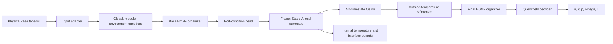

# Model comparison: Run 1102 adaptive additive HONF versus Run 1000 classic pairwise HONF

## Technical summary

This document compares the latest formal ThermalChannel run with the classic reference:

- **New/formal:** `Run_1102_20260820_002237_adaptive_sparse_additive_formal`, launched from `adaptive_sparse_additive.json` for 5,000 epochs and still running at the analysis cutoff.
- **Classic/old:** `Run_1000_20260817_214356_enhanced_honf_pairwise`, launched from `enhanced_honf_pairwise.json` and completed at epoch 10,000.

The central architectural change is

\[
\boxed{
\text{fixed, dense, context-fused HONF}
\quad\longrightarrow\quad
\text{exchangeable, curriculum-sparsified, exactly additive HONF}
}
\]

Run 1000 uses six parameter-indexed edge channels, dense softmax assignments, the organizer latent as mechanism state, dense query-module pairwise execution, and one context-fusion output head. Run 1102 uses eight anonymous candidates, viability-aware scheduled selection, scheduled softmax-to-entmax assignments, bounded environment locality, descriptor-first mechanism states, and an exact background-plus-edge field decomposition.

The most important interpretation is that **Run 1102 is a dense correctness run, not a sparse-execution benchmark**. Its query/module limits and retained-mass fallbacks are configured for later deployment overlays, but `routing_execution=dense` keeps all effective routes in both training and validation. Therefore Run 1102 tests whether the adaptive additive representation is scientifically stable before execution is approximated; it does not yet test the intended gathered speed or memory benefit.

At the fixed live snapshot through epoch 2,891:

- Run 1102 has remained numerically and topologically safe: no selected empty edge and no post-fallback zero-support module or environment row is recorded.
- Its scheduled transitions do not create a sustained validation-loss discontinuity. The 25-epoch post/pre boundary median ratios are at or below 1.045 for field, temperature, and total loss at epochs 150, 250, 350, 400, 500, and 650.
- The topology briefly contracted to about one or two edges around epochs 594–731, then recovered. Over epochs 2,792–2,891, the median validation selected count is 5.56 of 8, entropy-derived query effective-edge count is 5.25, normalized environment-mass entropy is 0.569, and environment maximum mass is 0.584.
- Convergence remains slower than Run 1000. At matched epoch 2,875, the centered-25 validation field MSE is \(8.303\times10^{-3}\) versus \(2.466\times10^{-3}\), a 3.37-fold gap. Run 1102 first crosses a centered field MSE of 0.01 at epoch 2,200; Run 1000 does so at epoch 996.
- The observed average epoch time is approximately 9.17 seconds for Run 1102 versus 7.30 seconds for Run 1000, about 25.6% slower. Because Run 1102 deliberately executes densely and has 53.5% more trainable parameters, this is consistent with the resolved configuration rather than evidence that gathered sparsity failed.

The comparison is strongly controlled in dataset, split, target schema, losses, hidden width, environment grid, pairwise kernel, batch/query sampling, and the frozen-local-surrogate workflow. It is not a perfect architecture-only experiment because the learning rates and Stage-A checkpoints differ, and Run 1000 was launched from a dirty historical worktree.

## 1. Scope, evidence, and metric definitions

### 1.1 Authoritative artifacts

The evidence order is:

1. each run's `run_manifest.json` for launch provenance;
2. each run's `config_resolved.json` for effective settings;
3. each run's saved `best_model.pt` for serialized structure;
4. `metrics.csv` for epoch-level training and validation measurements;
5. the current conditional implementation in `src/honf_forward_core` and `Case_ThermalChannel/src/channelthermal`.

| Property | Run 1102 | Run 1000 |
|---|---:|---:|
| Status at snapshot | Running | Completed |
| Metrics window used here | Epochs 1–2,891 | Epochs 1–10,000 |
| Requested/completed budget | 5,000 requested | 10,000 completed |
| Core configuration | `adaptive_sparse_additive.json` | `enhanced_honf_pairwise.json` |
| Experiment overlay | None | None |
| Source commit | `590aaa3971e23d1d08a8e73a7e564756750b483f` | `2afa84759858931a236321e0086750734466dcec` |
| Source worktree at launch | Dirty, 1 changed path | Dirty, 51 changed paths |
| Dataset SHA-256 | `4224093c...b36da05` | Same |
| Cases and split | 690 total; 600 train, 90 test | Same |
| Forward initialization checkpoint | None recorded | None recorded |
| Frozen Stage-A checkpoint | `best_model.pt`, epoch 5,050 | `latest_model.pt`, epoch 6,357 |
| Stage-A SHA-256 | `1981fac0...297988a` | `44f5cb48...767dbaf` |

Run 1102 is tied to the formal-training hardening commit, but its manifest records one dirty path. The currently visible one-path worktree difference is `.gitignore`, not model code; the manifest itself stores only the launch-time count, so the commit plus resolved config and checkpoint remain the authoritative reconstruction artifacts. Run 1000 is less reproducible from Git alone because its 51-path uncommitted launch diff was not archived. Its resolved configuration and checkpoint determine the serialized model, but exact claims about its uncommitted historical implementation cannot be recovered.

### 1.2 Fixed live cutoff and comparison basis

Run 1102 is active, so this report fixes the quantitative cutoff at epoch 2,891 even if `metrics.csv` later grows. The selected Run 1102 window contains 2,891 unique consecutive epochs, 220 columns, and no missing, non-finite, or duplicated metric rows. Run 1000 contains 10,000 consecutive rows and 74 columns.

Two outcome bases are used:

- **Matched progress:** a centered 25-epoch validation median at the same epoch in both runs. This suppresses isolated validation-sampling spikes while preserving schedule-scale behavior.
- **Within-run best:** the minimum raw logged metric in the available window. This is useful for checkpoint selection but is not a budget-matched comparison.

Topology metrics are interpreted as follows:

- `candidate_edge_count`: organizer capacity;
- `hard_selected_edge_count`: detached quality/coverage target;
- `selected_edge_count`: candidates with a positive effective transition gate;
- `viable_selected_edge_count`: selected candidates meeting both mass floors;
- `functional_edge_count`: effective edges whose strength exceeds the configured threshold;
- `effective_query_edge_count`: selected viable candidates available to query routing;
- `query_attention_effective_edges`: entropy-derived effective number of query routes.

During the selection transition, a hard-rejected candidate retains a positive continuous gate, so ordinary selected count need not fall until the transition reaches its hard endpoint.

## 2. General mathematical problem

### 2.1 ThermalChannel physics and learned operator

For steady incompressible channel flow in the fluid domain \(\Omega_f\), the governing fields are represented schematically by

\[
\nabla\!\cdot\mathbf u=0,
\]

\[
\rho(\mathbf u\!\cdot\!\nabla)\mathbf u
=-\nabla p+\mu\nabla^2\mathbf u,
\]

\[
\rho c_p(\mathbf u\!\cdot\!\nabla)T_f
=\nabla\!\cdot(k_f\nabla T_f),
\]

while heated solid module \(m\), with domain \(\Omega_{s,m}\), obeys

\[
-\nabla\!\cdot(k_s\nabla T_{s,m})=q_m'''.
\]

At the fluid-solid interface \(\Gamma_m\), conjugate heat transfer requires

\[
T_f=T_{s,m},
\qquad
k_f\nabla T_f\!\cdot\mathbf n
=k_s\nabla T_{s,m}\!\cdot\mathbf n.
\]

The five-channel global target at query coordinate \(\mathbf x\) is

\[
\mathbf y(\mathbf x)
=\begin{bmatrix}
u(\mathbf x)&v(\mathbf x)&p(\mathbf x)&\omega(\mathbf x)&T(\mathbf x)
\end{bmatrix}^{\!\top},
\qquad
\omega=\frac{\partial v}{\partial x}-\frac{\partial u}{\partial y}.
\]

The learned task is supervised operator approximation rather than direct PDE-residual minimization:

\[
\widehat{\mathcal F}_{\theta}:
\left(
Re,u_{in},
\{\mathbf c_m,q_m,\chi_m,\boldsymbol\kappa_m\}_{m=1}^{M},
\Omega,\mathbf x
\right)
\mapsto
\widehat{\mathbf y}(\mathbf x),
\]

where \(\mathbf c_m\) is a module center, \(q_m\) is heat input, \(\chi_m\) is the active/padding mask, and \(\boldsymbol\kappa_m\) contains material and geometry descriptors. A frozen Stage-A surrogate predicts module-internal temperature and interface response from learned port conditions.

### 2.2 Shared training objective

Both runs optimize the same normalized composite objective:

\[
\begin{aligned}
\mathcal L={}&
w_f\mathcal L_{field}
+w_i\mathcal L_{internal}
+w_{\Gamma}\mathcal L_{interface}
+w_p\mathcal L_{port}\\
&+w_s\mathcal L_{port\ smooth}
+w_g\mathcal L_{port/global}
+w_c\mathcal L_{predicted\ consistency}
+\mathcal L_{organizer}.
\end{aligned}
\]

The configured weights are

\[
(w_f,w_i,w_{\Gamma},w_p,w_s,w_g,w_c)
=(1.0,1.0,0.2,0.3,0.01,0.2,0.05).
\]

Predicted consistency ramps to 0.05 over 100 epochs. Port mode is `predicted` with no teacher-to-predicted schedule. The organizer-regularization block is serialized but `enabled=false`, so neither run uses edge-count, entropy, diversity, load-balancing, maximum-mass, or duplicate-edge loss terms.

## 3. Shared end-to-end computation

Both runs retain the same outer ThermalChannel workflow:

The common tensor flow is:

| Stage | Tensor | Shape | Meaning |
|---|---|---:|---|
| Physical input | module centers | \([B,M,2]\) | Dynamically padded module locations |
| Physical input | module-present mask | \([B,M]\) | Active/padded module indicator |
| Input adapter | module features | \([B,M,10]\) | Heat, relative heat, activity, material, and radius features |
| Input adapter | global context | \([B,18]\) | Padding-invariant Reynolds, inlet, count/density, heat, domain, and material features |
| Environment builder | coordinates | \([B,192,2]\) | Cell-centered \(24\times8\) grid |
| Environment builder | features | \([B,192,7]\) | Position, wall, inlet/outlet, and centerline descriptors |
| Query builder | query features | \([B,Q,6]\) | Normalized position and rectangular-boundary distances |
| Core encoders | module tokens | \([B,M,256]\) | Module-feature and Fourier-position embedding |
| Core encoders | environment tokens | \([B,192,256]\) | Environment embedding plus global token |
| Organizer | module incidence | \(A^M\in\mathbb R^{B\times M\times K}\) | Module-to-edge assignment |
| Organizer | environment incidence | \(A^E\in\mathbb R^{B\times192\times K}\) | Environment-to-edge assignment |
| Organizer | mechanism state | \([B,K,256]\) | Edge-local latent or descriptor-first state |
| Local coupling | port tokens | \([B,M,P,5]\), normally \(P=64\) | Port geometry plus \(T_{env}\) and \(h\) |
| Local coupling | local outputs | Case dependent | Internal temperature, interface state, response latent |
| Decoder | sampled queries | \([B,Q,2]\), \(Q=1024\) in training | Global field coordinates |
| Decoder | prediction | \([B,Q,5]\) | \(u,v,p,\omega,T\) |

Shared implementation settings include hidden width 256, dropout 0, LayerNorm, nonperiodic \(12\times6\) geometry, four Fourier frequencies, a four-layer width-256 query-module pair MLP, module tokens and raw module features in the pair kernel, edge-mass normalization, learned ten-feature query geometry bias, one local/global refinement step, batch size 48, 1,024 sampled points per case, normalized inputs/targets, gradient clipping at 1.0, no AMP, and seed 0.

The learning rate is not shared: Run 1102 uses \(10^{-4}\), while Run 1000 uses \(3\times10^{-4}\). Both use weight decay \(10^{-5}\).

## 4. Classic Run 1000 model

### 4.1 Fixed organizer

Run 1000 has \(K=6\) parameter-indexed edge channels. For module tokens \(\mathbf m_i\) and environment tokens \(\mathbf e_j\),

\[
A^M_{ik}=\operatorname{softmax}_{k}(W_M\mathbf m_i+b_M)_k,
\]

\[
A^E_{jk}=\operatorname{softmax}_{k}\!\left(
(W_E\mathbf e_j+b_E)_k
-\frac{\lVert\mathbf x_j^E-\mathbf s_k\rVert_2}
{0.25\sqrt{L_x^2+L_y^2}}
\right),
\]

where the edge source centroid is

\[
\mathbf s_k=
\frac{\sum_i A^M_{ik}\mathbf c_i}{\sum_i A^M_{ik}}.
\]

Normalized module and environment summaries are

\[
\widetilde{\mathbf m}_k=
\frac{\sum_i A^M_{ik}\phi_M(\mathbf m_i)}{\sum_i A^M_{ik}},
\qquad
\widetilde{\mathbf e}_k=
\frac{\sum_j A^E_{jk}\phi_E(\mathbf e_j)}{\sum_j A^E_{jk}},
\]

\[
\mathbf h_k=\operatorname{MLP}_{mix}
(\widetilde{\mathbf m}_k+\widetilde{\mathbf e}_k).
\]

All six edges are active. Their identities are bound to rows of `module_score` and `env_score`; they are not anonymous runtime slots.

### 4.2 Dense pairwise context fusion

For encoded query \(\mathbf q_x\), Run 1000 uses

\[
\alpha_{xk}=\operatorname{softmax}_k\!\left(
\frac{(W_q\mathbf q_x)^\top(W_k\mathbf h_k)}{\sqrt H}
+b_{geom}(x,k)
\right).
\]

There is no query-edge or query-module truncation. With

\[
\bar A^M_{ik}=\frac{A^M_{ik}}{\sum_{i'}A^M_{i'k}},
\]

the edge-local and reduced pair contexts are

\[
\mathbf c^{pair}_{xk}=\sum_i\bar A^M_{ik}\psi(x,i),
\qquad
\mathbf c^{pair}_x=\sum_k\alpha_{xk}\mathbf c^{pair}_{xk}.
\]

The pair branch has \(g_p=\sigma(\gamma_p)\), initialized to 0.1. The final context is

\[
\mathbf c_x=
\sum_k\alpha_{xk}W_v\mathbf h_k
+g_p\mathbf c^{pair}_x
+W_g\mathbf g
+W_n\mathbf c^{near}_x,
\]

\[
\widehat{\mathbf y}_{1000}(x)
=\operatorname{Head}_{pred}(\operatorname{LayerNorm}(\mathbf c_x)).
\]

This is **context fusion**: the five-channel prediction has no exact exported decomposition into background and individual edge fields.

## 5. Run 1102 scheduled adaptive additive model

### 5.1 Exchangeable candidates and protected scheduled assignments

Run 1102 has runtime capacity \(K_{\mathrm{cap}}=8\). Candidate identity comes from deterministic centered sinusoidal codes \(\mathbf z_k\), while all learned slot maps are shared:

\[
\mathbf s_k^{(0)}=
\phi_{base}(\mathbf p)
+\phi_{scale}(\mathbf p)\odot\mathbf z_k,
\]

where \(\mathbf p\) pools active module and environment tokens. Two shared GRU refinement iterations update the slots.

For assignment family \(r\in\{M,E,Q\}\), define the scheduled sparsity fraction

\[
\mu_r(t)=
\operatorname{clip}\!\left(
\frac{t-t_r^{\mathrm{start}}}{T_r},0,1
\right).
\]

The resolved schedules are

\[
(t_M^{\mathrm{start}},T_M)=(350,300),
\quad
(t_E^{\mathrm{start}},T_E)=(350,300),
\quad
(t_Q^{\mathrm{start}},T_Q)=(250,250).
\]

For module and environment assignments, the scheduled normalizer is

\[
P_r(t)=(1-\mu_r(t))P_r^{\mathrm{stable\ softmax}}
+\mu_r(t)\operatorname{entmax}_{1.5}(\ell_r),
\]

followed by row normalization. At \(\mu=0\), the stabilized softmax component protects anonymous candidates so their aggregate mass stays above the configured 0.01 floor. At \(\mu=1\), the result is exact entmax with no artificial probability floor and exact zeros are allowed.

Environment logits also include smooth bounded Gaussian locality:

\[
b^{loc}_{jk}
=-\frac12(0.25)\min(r_{jk}^2,3),
\]

with minimum normalized region scale 0.10. Query locality is explicitly `none`; query routing retains the learned ten-feature geometry bias but does not inherit environment locality.

### 5.2 Viability and continuous selection

Candidate mass fractions are

\[
m_k^M=
\frac{\sum_i A^{M,c}_{ik}}
{\sum_{k'}\sum_i A^{M,c}_{ik'}},
\qquad
m_k^E=
\frac{\sum_j A^{E,c}_{jk}}
{\sum_{k'}\sum_j A^{E,c}_{jk'}}.
\]

A candidate is viable only when

\[
m_k^M>0.01
\quad\land\quad
m_k^E>0.01.
\]

If none is viable, exactly the candidate with largest \(\sqrt{m_k^Mm_k^E}\) is retained. Nonviable candidates are excluded from quality ordering, novelty, and active selection.

The scheduled selection fraction is

\[
\lambda(t)=
\operatorname{clip}\!\left(\frac{t-150}{250},0,1\right).
\]

Thus \(\lambda(150)=0\), \(\lambda(275)=0.5\), and \(\lambda(400)=1\). Before selection starts, all viable candidates are used without invoking the greedy selector. When selection is required, the detached quality/coverage/novelty algorithm chooses a hard target \(h_k\in\{0,1\}\) that seeks 99% module and environment token coverage at probability threshold 0.5, subject to viability, novelty, and minimum-count rules.

During the transition,

\[
g_k^{\mathrm{sel}}(t)=(1-\lambda(t))+\lambda(t)h_k.
\]

At the endpoint this equals the hard mask exactly. The effective decoder gate is selection **and** viability. Selected incidences are row-normalized; if an active token has zero selected support, a detached one-hot fallback assigns it to the highest-probability selected viable candidate:

\[
\sum_k A^M_{ik}=1\quad(\chi_i=1),
\qquad
\sum_k A^E_{jk}=1.
\]

### 5.3 Final-organizer-only ownership

ThermalChannel calls the organizer more than once because outside-port temperature is refined through the local surrogate. In Run 1102:

- the base encode/organize pass uses `selection_override="all"`;
- the provisional organizer used for outside-temperature refinement also uses all candidates;
- only the final post-fusion organizer applies the configured scheduled adaptive selection.

This prevents intermediate coupling passes from making independent hard topology decisions. Run 1000 follows the same outer call sequence, but its fixed organizer ignores adaptive selection overrides and always exports six edges.

### 5.4 Descriptor-first mechanism state

For each candidate, the organizer exports source centroid and scale, region centroid and scale, displacement, normalized distance, module/environment mass, both purities, and the active gate. These form a 16-component descriptor \(\mathbf d_k\). The decoder state is

\[
\widehat{\mathbf h}_k=
\operatorname{LayerNorm}\!\left(
\phi_d(\mathbf d_k)+0.35\,\phi_c(\mathbf h_k)
\right).
\]

Explicit source-region geometry is therefore primary, while learned content remains a bounded residual. Run 1000 passes the organizer latent directly because its mechanism encoder is disabled.

### 5.5 Scheduled sparse probabilities with dense execution

Run 1102 query probabilities transition from softmax to exact 1.5-entmax between epochs 250 and 500:

\[
\alpha_{xk}(t)=
\operatorname{Normalize}\!\left[
(1-\mu_Q(t))\operatorname{softmax}(\ell_{xk})
+\mu_Q(t)\operatorname{entmax}_{1.5}(\ell_{xk})
\right],
\]

where logits include content and learned geometry bias, then exclude ineffective candidates.

Although `query_edge_limit=3`, `query_module_limit=8`, and retained-mass floors 0.98/0.95 are serialized, they are dormant because `routing_execution=dense`. Every effective query-edge route and every active query-module pair remains in the executed reference path. `gathered_execution_start_epoch=650` matters only when `routing_execution="scheduled"`; it does not override explicit dense mode.

Consequently, recorded routed query-edge and module retained masses are numerically one in this run, and `routing_execution_gathered` remains zero. These values confirm dense reference execution; they do not measure top-3/top-8 approximation quality.

### 5.6 Exact additive output

The background branch attends over environment tokens:

\[
\mathbf b(x)=
\operatorname{Head}_{bg}\!\left(
\operatorname{Norm}_{bg}
[\mathbf q_x,\mathbf g,\mathbf c_x^E]
\right).
\]

Each effective edge receives query state, descriptor-first mechanism state, ten geometry features, and edge-local pair context:

\[
\widetilde{\mathbf f}_k(x)=
\operatorname{Head}_{edge}\!\left(
\operatorname{Norm}_{edge}
[\mathbf q_x,\widehat{\mathbf h}_k,
\boldsymbol\gamma(x,k),\mathbf c^{pair}_{xk}]
\right).
\]

With learned scalar \(g_e=\sigma(\gamma_e)\), initialized to 0.1,

\[
\mathbf f_k(x)=
g_e\,g_k^{\mathrm{eff}}\,\alpha_{xk}\,
\widetilde{\mathbf f}_k(x),
\]

and

\[
\boxed{
\widehat{\mathbf y}_{1102}(x)
=\mathbf b(x)+\sum_{k=1}^{8}\mathbf f_k(x)
}.
\]

The gate is inside exported `pred_field_by_edge`, so background plus the exported edge tensors reconstructs `pred_field` numerically. Background and edge heads have explicit input normalization; their final linear layers start with standard deviation 0.001 and zero bias. In additive mode, unused final context-fusion reductions and hyper-value output context are skipped without deleting their checkpoint-compatible parameters.

## 6. Concrete resolved-setting comparison

| Setting | Run 1102 | Run 1000 | Behavioral consequence |
|---|---|---|---|
| Organizer | `exchangeable_slots` | `fixed_projection` | Anonymous shared slots vs parameter-indexed channels |
| Candidate/edge capacity | 8 | 6 | New organizer can form and later reject from eight candidates |
| Initial/minimum active | 8 / 2 | 6 / 1 | Run 1102 begins fully populated; minimum never overrides viability |
| Edge selection | scheduled `quality_coverage` | `all` | Continuous final-organizer gating vs six always active edges |
| Selection schedule | 150 to 400 | Not applicable | Soft transition reaches exact hard mask at 400 |
| Coverage target | 0.99 | Not applicable | Stringent module/environment coverage, not a count objective |
| Viability floors | 0.01 module and environment | Not applicable | Empty/near-empty new candidates cannot generate fields |
| Module assignment | scheduled; softmax to entmax, 350–650 | softmax | Protected dense formation, then exact sparse support |
| Environment assignment | scheduled; softmax to entmax, 350–650 | softmax | Same curriculum for region support |
| Query assignment | scheduled; softmax to entmax, 250–500 | softmax | Query probabilities sparsify earlier |
| Environment locality | `gaussian_bounded`, strength 0.25, cap 3 | no generic locality; fixed organizer has built-in source-distance bias | Smooth bounded slot-region bias |
| Minimum region scale | 0.10 | 0.05 | Wider lower bound during exchangeable organization |
| Query locality | `none` | no explicit query locality | Run 1102 relies on learned query geometry bias |
| Mechanism state | `descriptor_first`, content residual 0.35 | raw organizer latent | Explicit geometry/mass/purity state |
| Field assembly | `edge_additive` | `context_fusion` | Exact field decomposition vs fused latent output |
| Routing execution | dense | dense | Neither run truncates execution in this comparison |
| Configured gathered limits | edge 3, module 8; dormant | unlimited | Run 1102 remains deployment-ready but does not exercise limits |
| Learning rate | \(10^{-4}\) | \(3\times10^{-4}\) | Run 1102 takes smaller optimization steps |
| Weight decay / AMP | \(10^{-5}\) / false | Same | Controlled |
| Frozen Stage-A | `best_model.pt` | `latest_model.pt` | Different local surrogate state is a confound |

All major data and objective settings are equal: field dimension 5, environment grid \(24\times8\), hidden dimension 256, pairwise construction, geometry dimensions, batch size 48, 1,024 train and validation query points per case, normalization, loss weights, predicted port mode, corrected-physics flux, one-pass coupling, and dataset fingerprint.

## 7. Current outcome comparison

### 7.1 Run 1102 follows the intended curriculum, with a temporary topology contraction

The table reports validation medians within each curriculum region. `Query eff.` is `query_attention_effective_edges`.

| Epoch region | Selected | Hard selected | Gate mean | Query eff. | Env entropy | Env max |
|---|---:|---:|---:|---:|---:|---:|
| 1–150 | 8.00 | 8.00 | 1.000 | 2.13 | 0.535 | 0.611 |
| 151–249 | 8.00 | 6.28 | 0.959 | 2.35 | 0.554 | 0.613 |
| 250–349 | 8.00 | 5.43 | 0.809 | 2.25 | 0.531 | 0.640 |
| 350–399 | 7.77 | 3.04 | 0.429 | 1.62 | 0.334 | 0.773 |
| 400–499 | 2.50 | 2.50 | 0.313 | 1.41 | 0.213 | 0.827 |
| 500–649 | 2.07 | 2.07 | 0.258 | 1.30 | 0.135 | 0.890 |
| 650–999 | 1.57 | 1.57 | 0.197 | 1.38 | 0.100 | 0.912 |
| 1,000–2,891 | 4.79 | 4.79 | 0.599 | 4.45 | 0.572 | 0.516 |
| 2,792–2,891 | 5.56 | 5.56 | 0.695 | 5.25 | 0.569 | 0.584 |

All eight candidates remain selected and viable through epoch 350. Before module/environment sparsification starts, the minimum recorded validation candidate masses are 0.0100106 for modules and 0.0100100 for environment, confirming the stabilized-softmax protection.

The contraction is real but not permanent. Validation selected count is at most 1.5 for 172 epochs; the longest consecutive interval is epochs 623–686. It is at most 2.0 for 385 epochs; the longest consecutive interval is epochs 594–731. The later recovery to a median 5.56 selected edges means Run 1102 did not settle into the scientifically undesirable one-edge state.

### 7.2 Late topology is safe and differentiated, but only partially sparse

Over epochs 2,792–2,891, validation medians are:

| Diagnostic | Median | Interpretation |
|---|---:|---|
| Candidate / selected / viable-selected edges | 8.00 / 5.56 / 5.56 | Adaptive cardinality, with several mechanisms retained |
| Functional / soft-functional edges | 5.27 / 5.00 | Activity is not pinned at one or two |
| Empty selected edges | 0.00 | Safety criterion satisfied |
| Post-fallback zero-support module/env rows | 0.00 / 0.00 | Mass conservation safety criterion satisfied |
| Query effective edges | 5.25 | Query routing is broader than the original target band 1.5–3.5 |
| Query entropy / max probability | 1.644 / 0.293 | No single query edge dominates |
| Module nonzero fraction | 1.000 | Module assignment remains mathematically dense |
| Environment nonzero fraction | 0.430 | Environment support is substantially sparse |
| Module mass entropy / maximum | 0.801 / 0.251 | Module mass remains distributed |
| Environment mass entropy / maximum | 0.569 / 0.584 | Healthy aggregate environment balance |
| Additive edge gate | 0.1278 | Edge branch is learned and nonzero |
| Background / summed-edge norm | 0.227 / 2.585 | Prediction energy is primarily edge-additive |
| Edge field fraction | 0.967 | Edge contribution is nontrivial, not shut off |
| Background/edge cancellation ratio | 0.0497 | No large destructive cancellation |
| Gathered execution flag | 0.000 | Dense reference path confirmed |

The minimum candidate environment mass is often exactly zero after exact entmax, and the median maximum candidate environment mass is 0.881. This is compatible with nonviable candidates being excluded. The selected/effective aggregate environment distribution is less concentrated (`env_mass_max` 0.584), which is the relevant decoder-facing statistic.

### 7.3 Schedule boundaries do not produce sustained validation jumps

The values below are the median of epochs \(t+1:t+25\) divided by the median of \(t-24:t\).

| Boundary epoch | Field ratio | Temperature ratio | Total-loss ratio |
|---:|---:|---:|---:|
| 150 | 0.897 | 0.784 | 0.864 |
| 250 | 0.971 | 0.971 | 0.967 |
| 350 | 0.811 | 0.832 | 0.841 |
| 400 | 0.918 | 0.961 | 0.917 |
| 500 | 0.947 | 0.908 | 0.979 |
| 650 | 0.927 | 1.044 | 0.928 |

There is no boundary-level order-of-magnitude discontinuity. Temperature has a small 4.4% median rise across epoch 650, while field and total loss continue downward. This supports the intended continuous curriculum behavior.

### 7.4 Run 1000 still converges materially faster

Centered 25-epoch validation medians at matched optimizer progress are:

| Epoch | Field MSE 1102 | Field MSE 1000 | Ratio | Temperature MSE 1102 | Temperature MSE 1000 | Ratio | Total loss ratio |
|---:|---:|---:|---:|---:|---:|---:|---:|
| 100 | 0.27565 | 0.12856 | 2.14 | 0.26197 | 0.07387 | 3.55 | 2.41 |
| 400 | 0.07575 | 0.03102 | 2.44 | 0.03735 | 0.01928 | 1.94 | 2.26 |
| 650 | 0.04301 | 0.01568 | 2.74 | 0.03139 | 0.01255 | 2.50 | 2.57 |
| 1,000 | 0.02618 | 0.00950 | 2.76 | 0.01816 | 0.00788 | 2.30 | 2.15 |
| 1,500 | 0.01647 | 0.00628 | 2.62 | 0.01276 | 0.00669 | 1.91 | 1.91 |
| 2,000 | 0.01162 | 0.00357 | 3.25 | 0.00940 | 0.00425 | 2.21 | 1.74 |
| 2,500 | 0.00861 | 0.00286 | 3.01 | 0.00824 | 0.00352 | 2.34 | 1.48 |
| 2,875 | 0.00830 | 0.00247 | 3.37 | 0.00742 | 0.00301 | 2.47 | 1.55 |

Run 1102 reaches centered field-MSE thresholds 0.1, 0.05, 0.03, 0.02, and 0.01 at epochs 347, 536, 865, 1,242, and 2,200. Run 1000 reaches the same thresholds at epochs 120, 243, 414, 542, and 996. Run 1000 also reaches 0.005 at epoch 1,589 and 0.003 at epoch 2,497; Run 1102 has not reached either by epoch 2,891.

The best raw Run 1102 validation field MSE through the cutoff is \(6.7069\times10^{-3}\) at epoch 2,877. Run 1000's completed best is \(1.4385\times10^{-3}\) at epoch 9,655. Those best values are not budget matched and should not be used alone to attribute the gap to architecture.

### 7.5 Runtime and model size explain why this formal run is not yet lighter

| Structure/runtime measure | Run 1102 | Run 1000 | Difference |
|---|---:|---:|---:|
| Model parameters, including frozen Stage-A | 4,830,902 | 3,508,649 | +37.7% |
| Trainable parameters | 3,795,763 | 2,473,510 | +53.5% |
| State-dictionary keys | 261 | 237 | +24 |
| Best-checkpoint file size | 48.59 MB | 31.62 MB | +53.7% |
| Approximate seconds per epoch | 9.17 | 7.30 | +25.6% |

Run 1102 requires about 5.60 elapsed hours to reach its first centered field MSE below 0.01, compared with about 2.02 hours for Run 1000, approximately 2.77 times longer. This combines a 2.21-fold epoch-count delay with a 1.26-fold per-epoch cost.

No historical peak-GPU-memory log exists for Run 1000, so a precise memory ratio cannot be reconstructed. Run 1102's dense execution, eight candidates, exchangeable refinement, descriptor encoder, and two additive heads all remain active; mathematical entmax zeros do not automatically reduce dense tensor allocation or kernel work.

## 8. Exact current-repository path differences

The current repository selects the two behaviors through strict configuration branches:

| Code location | Run 1102 path | Run 1000 path |
|---|---|---|
| `src/honf_forward_core/config.py` | Explicit scheduled adaptive values | Classic compatibility defaults and fixed values |
| `src/honf_forward_core/model.py` | Shared encoders, exchangeable organizer, additive decoder | Shared encoders, fixed organizer, context decoder |
| `organizer.py::HypergraphOrganizerCore.__init__` | Instantiates `ExchangeableSlotOrganizer` | Instantiates fixed score/projection/mix layers |
| `_candidate_assignments` | Shared slot dot products; stabilized-softmax/entmax schedule; bounded environment locality | Not executed |
| `_select_active_edges` | Viability plus CPU quality/coverage/novelty when selection is required | Not executed; six ones exported |
| `_mask_and_renormalize` | Continuous gate, effective viability mask, detached fallback, row normalization | Not executed |
| Fixed organizer `forward` | Not executed | Linear module/env scores, softmax, built-in source-distance bias |
| `decoder.py::HypergraphFieldDecoder.__init__` | Descriptor encoder, background/edge heads, input norms, additive gate | Context projections, context norm, `pred_head` |
| Decoder query normalization | Scheduled softmax-to-entmax over effective edges | Dense softmax over six edges |
| Pairwise kernel execution | Dense because Run 1102 explicitly requests dense | Dense |
| `_edge_additive_output` | Executed; exact background-plus-edge sum | Not constructed/executed |
| Context-fusion tail | Skipped in additive mode | Hyper + pair + global + near, normalization, `pred_head` |
| `channelthermal/model.py` organizer ownership | Base/provisional `all`; final scheduled adaptive | Fixed organizer always six |
| `train_forward.py` | Same losses; expanded topology/additive diagnostics | Same losses; classic diagnostic schema |

Run 1102's `final_only_selection` behavior is a critical difference from the obsolete base-adaptive behavior: greedy selection is not called in base/provisional passes, and at scheduled fraction zero the final organizer also uses eligible viable candidates directly. When greedy selection becomes necessary, detached \(B\times K\) candidate arrays are transferred to CPU once and one mask is returned, avoiding repeated CUDA scalar synchronization inside the selection loop.

### 8.1 Serialized model structure

Loading both actual `best_model.pt` files through the current evaluation loader gives:

| Checkpoint structure | Run 1102 | Run 1000 |
|---|---:|---:|
| Model parameters, including frozen Stage-A | 4,830,902 | 3,508,649 |
| Trainable parameters | 3,795,763 | 2,473,510 |
| Model state keys | 261 | 237 |
| Common names with identical shapes | 200 | 200 |
| Common names with different shapes | 0 | 0 |
| Keys unique to this checkpoint | 61 | 37 |

The 61 Run 1102-only keys comprise:

- 30 exchangeable-organizer keys, including shared module/environment projections, slot base/scale, GRU update, auxiliary attention, and two persisted progress buffers;
- 10 descriptor-first mechanism-encoder keys;
- 21 additive-output keys for background attention/global projections, input norms, background/edge heads, and `additive_edge_gate`.

The 37 Run 1000-only keys comprise:

- 20 fixed-organizer keys for module/environment scoring, projections, `hyper_mix`, and auxiliary attention;
- 17 context-fusion decoder keys for nonhyper/direct/global/near projections, direct gate, context norm, and `pred_head`.

The 200 common exact-name-and-shape keys cover shared encoders, query/hyper projections, geometry bias, pairwise kernel, port/local-coupling layers, and the embedded frozen local-surrogate structure. “Common” means structurally compatible, not numerically equal after independent training.

The two persisted Run 1102 selection-progress buffers and checkpoint `selection_state` make training, validation, resume, prepared decoding, and evaluation use explicit saved progress rather than an unsaved Python attribute. Run 1000 predates that adaptive state but does not need it because its topology is fixed.

## 9. What the comparison does and does not isolate

### 9.1 Strongly controlled similarities

Both models see the same cases, train/test split, normalized physical inputs, five output channels, query sampling, loss weights, local/global coupling pattern, field hidden width, pairwise feature construction, and evaluation chunk size. Both are dense in this formal comparison. Therefore the result primarily compares fixed context fusion against the combined effect of exchangeable organization, scheduled support sparsity, descriptor-first state, and exact additive assembly.

The pairwise kernel is retained in Run 1102. It changes from a globally reduced context feeding one fused head to an edge-local context feeding each additive edge head. The scientific distinction is not “pairwise versus no pairwise,” but **where pairwise information enters the field construction and whether edge contributions close additively**.

### 9.2 Material confounds

- **Learning rate:** \(10^{-4}\) for Run 1102 versus \(3\times10^{-4}\) for Run 1000. The similar late log-log convergence slopes previously observed alongside a persistent early gap make optimization speed a plausible contributor, not a proven sole cause.
- **Different Stage-A checkpoints:** the frozen local models have different epochs and hashes, so the outer HONF receives different local response states.
- **Different total budgets:** Run 1102 is incomplete at this snapshot; Run 1000 completed 10,000 epochs.
- **Run 1000 dirty source:** its 51-path launch diff is unavailable, limiting historical line-by-line reproducibility.
- **Multiple scientific changes:** organizer exchangeability, scheduled sparsity, descriptor-first state, and additive output are combined. This comparison cannot attribute the accuracy gap to one component.
- **No gathered benchmark:** dense mode prevents conclusions about deployment speed, route approximation, or memory savings.
- **Live-run uncertainty:** Run 1102 best values and late topology may change after epoch 2,891.

### 9.3 Current scientific interpretation

Run 1102 has passed the more fundamental structural tests: candidates are protected during role formation, schedule boundaries are smooth, support fallbacks are safe, a temporary topology collapse recovers, multiple functional mechanisms persist, and additive field energy is nonzero without destructive background cancellation.

It has not matched Run 1000's convergence efficiency. The current evidence does not point to insufficient edge count: late Run 1102 uses roughly 5.6 selected edges and 5.25 effective query routes. More plausible bottlenecks are the smaller learning rate, the harder exact-additive decomposition, the cost of shared slot refinement and expanded heads, and the fact that exact entmax support sparsity is not converted into sparse execution.

The late representation is also less sparse than the original query target band. Module support remains fully nonzero, query routing remains broad, and approximately 5–6 edges survive. Because there is intentionally no count or entropy penalty, this is a valid coverage-driven solution rather than a configuration failure, but it limits immediate gathered-execution acceleration.

## 10. Recommended next comparisons

After Run 1102 completes, use the same current evaluator, full test split, query chunk size, and checkpoint policy for both runs. Report:

- total, five-channel field, temperature, and per-channel MSE;
- internal, interface, port, and consistency terms;
- candidate, hard-selected, selected, viable-selected, functional, and empty-edge counts;
- pre/post-fallback zero-support module and environment rows;
- query effective-edge count and module/environment entropy and maximum mass;
- source/region scales, purities, contribution fractions, and topology signatures;
- exact additive closure and background/edge norms for Run 1102;
- route counts and routed-only retained mass under a separate gathered overlay;
- wall time and peak allocated/reserved GPU memory under controlled hardware and diagnostic cadence.

Use both matched progress and each run's selected best checkpoint. For causal isolation, the highest-value follow-ups are:

1. a short learning-rate sweep for the Run 1102 architecture at \(10^{-4}\), \(2\times10^{-4}\), and \(3\times10^{-4}\), holding Stage-A and seed fixed;
2. a same-Stage-A rerun or checkpoint evaluation to remove the `best_model.pt` versus `latest_model.pt` confound;
3. a deployment-only gathered overlay using the accepted checkpoint, comparing dense and gathered outputs, retained masses, speed, and memory without retraining;
4. if the accuracy gap persists after optimizer control, fixed-additive and exchangeable-soft ablations to separate additive-decomposition cost from organizer/sparsity cost.

Do not infer that top-3/top-8 gathered execution will be fast from the formal run alone. The late query distribution uses about 5.25 effective edges and module support is dense, so retained-mass floors may expand beyond nominal limits. Measure actual gathered route counts and kernels.

## 11. Repository references

- New formal profile: [`src/config_core/forward/adaptive_sparse_additive.json`](src/config_core/forward/adaptive_sparse_additive.json)
- Classic profile: [`src/config_core/forward/enhanced_honf_pairwise.json`](src/config_core/forward/enhanced_honf_pairwise.json)
- Unified configuration: [`src/honf_forward_core/config.py`](src/honf_forward_core/config.py)
- Shared encoders/core flow: [`src/honf_forward_core/model.py`](src/honf_forward_core/model.py)
- Fixed and exchangeable organizers: [`src/honf_forward_core/organizer.py`](src/honf_forward_core/organizer.py)
- Softmax/entmax/locality functions: [`src/honf_forward_core/routing.py`](src/honf_forward_core/routing.py)
- Context-fusion and additive decoders: [`src/honf_forward_core/decoder.py`](src/honf_forward_core/decoder.py)
- Scalar diagnostics: [`src/honf_forward_core/training/diagnostics.py`](src/honf_forward_core/training/diagnostics.py)
- ThermalChannel input schema: [`Case_ThermalChannel/src/channelthermal/input_adapter.py`](Case_ThermalChannel/src/channelthermal/input_adapter.py)
- Environment/query features: [`Case_ThermalChannel/src/channelthermal/environment.py`](Case_ThermalChannel/src/channelthermal/environment.py)
- Coupled forward flow: [`Case_ThermalChannel/src/channelthermal/model.py`](Case_ThermalChannel/src/channelthermal/model.py)
- Training/loss assembly: [`Case_ThermalChannel/src/channelthermal/workflows/train_forward.py`](Case_ThermalChannel/src/channelthermal/workflows/train_forward.py)
- Run 1102 resolved configuration: [`Trained_Results/ThermalChannel/HONF_Forward_Runs/Run_1102_20260820_002237_adaptive_sparse_additive_formal/config_resolved.json`](Trained_Results/ThermalChannel/HONF_Forward_Runs/Run_1102_20260820_002237_adaptive_sparse_additive_formal/config_resolved.json)
- Run 1102 live metrics: [`Trained_Results/ThermalChannel/HONF_Forward_Runs/Run_1102_20260820_002237_adaptive_sparse_additive_formal/metrics.csv`](Trained_Results/ThermalChannel/HONF_Forward_Runs/Run_1102_20260820_002237_adaptive_sparse_additive_formal/metrics.csv)
- Run 1000 resolved configuration: [`Trained_Results/ThermalChannel/HONF_Forward_Runs/Run_1000_20260817_214356_enhanced_honf_pairwise/config_resolved.json`](Trained_Results/ThermalChannel/HONF_Forward_Runs/Run_1000_20260817_214356_enhanced_honf_pairwise/config_resolved.json)
- Run 1000 completed metrics: [`Trained_Results/ThermalChannel/HONF_Forward_Runs/Run_1000_20260817_214356_enhanced_honf_pairwise/metrics.csv`](Trained_Results/ThermalChannel/HONF_Forward_Runs/Run_1000_20260817_214356_enhanced_honf_pairwise/metrics.csv)

---

Prepared from repository and run artifacts on 2026-08-20. Quantitative Run 1102 claims are frozen at epoch 2,891; later rows are intentionally outside this comparison snapshot.
