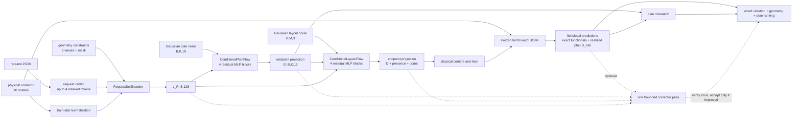

# Mathematical and data definition of HONF and the ThermalChannel case

This document defines the Hypergraph Operator Neural Field (HONF) as a neural surrogate for modular physical designs, specifies the ThermalChannel prediction problem and its packed datasets, and explains how the case-neutral forward and initial hierarchical inverse cores are adapted to that problem in `HONF_Proj`.

The project now has two explicit ownership levels.
Code under `src/honf_forward_core` implements the reusable set-to-field operator and must not import a physical case.
Code under `Case_ThermalChannel/src/channelthermal` defines the thermal data schema, physical features, local solid operator, coupling, losses, and visualizations.
The top-level `train.py` and `evaluate.py` load this case through the configured plugin instead of importing it directly.

The presentation follows the implementation in:

- `src/honf_forward_core/model.py`, `src/honf_forward_core/organizer.py`, and
  `src/honf_forward_core/decoder.py` for the reusable HONF;
- `Case_ThermalChannel/src/channelthermal/data/datasets.py` for the training
  data contract;
- `Case_ThermalChannel/src/channelthermal/input_adapter.py`,
  `Case_ThermalChannel/src/channelthermal/environment.py`,
  `Case_ThermalChannel/src/channelthermal/local_coupling.py`, and
  `Case_ThermalChannel/src/channelthermal/model.py` for the thermal-channel
  adaptation;
- `Case_ThermalChannel/src/channelthermal/local_surrogate/model.py` for the
  Stage-A single-module surrogate and `local_surrogate/spec.py` for its stable
  lifecycle/schema contract; and
- `Case_ThermalChannel/src/channelthermal/training_tools/losses.py` and
  `Case_ThermalChannel/src/channelthermal/workflows/train_forward.py` for the
  physical loss policy and coupled objective, with
  `src/honf_forward_core/training/losses.py` providing only the generic
  explicit-channel weighted reduction.

The reusable implementation preserves every reference decoder mode:
`hyper_only`, `hyper_plus_global`, `hyper_plus_direct_residual`,
`hyper_plus_near_module`, `hyper_plus_global_near`,
`hyper_plus_global_direct`, `hyper_plus_near_direct`,
`no_hyper_global_near`, `no_hyper_current_like_direct`, `current_like`,
`enhanced_honf_pairwise`, and `enhanced_honf_pairwise_only`.
The mathematical discussion below concentrates on the two modes used by the maintained reruns:

1. `hyper_plus_global_near`, used here as the base HONF formulation; and
2. `enhanced_honf_pairwise`, the real default in `src/config_core/forward/enhanced_honf_pairwise.json`.

Configuration is split without changing these equations.
A core profile owns the decoder/capacity and generic optimization settings; the referenced case profile owns thermal features, datasets, local coupling, and physical losses.
The runtime saves both sources plus their deterministic resolved composition in every run, so evaluation reconstructs the exact model rather than consulting a mutable default.

## Table of contents

- [0. Architecture at a glance: from files and tensors to the equations](#0-architecture-at-a-glance-from-files-and-tensors-to-the-equations)
  - [0.1 Forward model: one-batch execution graph](#01-forward-model-one-batch-execution-graph)
  - [0.2 Inverse model: generation and verification graph](#02-inverse-model-generation-and-verification-graph)
  - [0.3 Default dimensions and where they are controlled](#03-default-dimensions-and-where-they-are-controlled)
  - [0.4 Which knobs change capacity, resolution, or runtime?](#04-which-knobs-change-capacity-resolution-or-runtime)
- [1. General mathematical definition of HONF](#1-general-mathematical-definition-of-honf)
  - [1.1 Modular operator-learning problem](#11-modular-operator-learning-problem)
  - [1.2 Tensor notation and primary data contract](#12-tensor-notation-and-primary-data-contract)
  - [1.3 Fourier coordinate representation and input encoders](#13-fourier-coordinate-representation-and-input-encoders)
  - [1.4 Learned hypergraph organizer](#14-learned-hypergraph-organizer)
    - [Module-to-environment context](#module-to-environment-context)
    - [Module-to-hyperedge incidence](#module-to-hyperedge-incidence)
    - [Environment-to-hyperedge incidence](#environment-to-hyperedge-incidence)
    - [Hyperedge state](#hyperedge-state)
  - [1.5 Query state and hyperedge routing](#15-query-state-and-hyperedge-routing)
  - [1.6 Base mode: `hyper_plus_global_near`](#16-base-mode-hyper_plus_global_near)
  - [1.7 Default mode: `enhanced_honf_pairwise`](#17-default-mode-enhanced_honf_pairwise)
  - [1.8 Intermediate and output structure](#18-intermediate-and-output-structure)
- [2. ChannelThermal problem and datasets](#2-channelthermal-problem-and-datasets)
  - [2.1 Design domain and prediction targets](#21-design-domain-and-prediction-targets)
  - [2.2 Physical interpretation and fidelity of the supplied labels](#22-physical-interpretation-and-fidelity-of-the-supplied-labels)
  - [2.3 Packed global dataset](#23-packed-global-dataset)
  - [2.4 Packed Stage-A local dataset](#24-packed-stage-a-local-dataset)
  - [2.5 Normalization](#25-normalization)
- [3. Adaptation of HONF to ChannelThermal](#3-adaptation-of-honf-to-channelthermal)
  - [3.1 Physical design to generic HONF features](#31-physical-design-to-generic-honf-features)
  - [3.2 Stage-A single-module operator](#32-stage-a-single-module-operator)
  - [3.3 Predicted port conditions](#33-predicted-port-conditions)
  - [3.4 Physics-anchored interface response](#34-physics-anchored-interface-response)
  - [3.5 Local response fused into the global modular state](#35-local-response-fused-into-the-global-modular-state)
  - [3.6 One local/global interaction-refinement pass](#36-one-localglobal-interaction-refinement-pass)
  - [3.7 Complete default forward map](#37-complete-default-forward-map)
  - [3.8 Coupled training objective](#38-coupled-training-objective)
  - [3.9 Concrete forward neural blocks and tensor flow](#39-concrete-forward-neural-blocks-and-tensor-flow)
    - [3.9.1 Dataset row to generic HONF tensors](#391-dataset-row-to-generic-honf-tensors)
    - [3.9.2 Core input encoders](#392-core-input-encoders)
    - [3.9.3 Organizer blocks](#393-organizer-blocks)
    - [3.9.4 Port head, Stage-A attention, and local decoders](#394-port-head-stage-a-attention-and-local-decoders)
    - [3.9.5 Physics correction, fusion, and the one refinement pass](#395-physics-correction-fusion-and-the-one-refinement-pass)
    - [3.9.6 Query decoder and the enhanced pairwise path](#396-query-decoder-and-the-enhanced-pairwise-path)
    - [3.9.7 A literal pseudocode bridge from equations to source](#397-a-literal-pseudocode-bridge-from-equations-to-source)
- [4. Code-to-mathematics index](#4-code-to-mathematics-index)
- [5. Initial hierarchical inverse-design problem](#5-initial-hierarchical-inverse-design-problem)
  - [5.1 Scope and status](#51-scope-and-status)
  - [5.2 Physical design D and operating context c](#52-physical-design-d-and-operating-context-c)
- [6. Structured request R](#6-structured-request-r)
  - [6.1 Token and geometry contracts](#61-token-and-geometry-contracts)
  - [6.2 Exact ThermalChannel functionals](#62-exact-thermalchannel-functionals)
- [7. Compact mechanism plan G and realized plan G-hat](#7-compact-mechanism-plan-g-and-realized-plan-widehat-g)
  - [7.1 Fixed-edge schema](#71-fixed-edge-schema)
  - [7.2 Normalization, order, and planned/realized distance](#72-normalization-order-and-plannedrealized-distance)
- [8. Inverse dataset contract](#8-inverse-dataset-contract)
- [9. Hierarchical conditional rectified flows](#9-hierarchical-conditional-rectified-flows)
  - [9.1 Request-set encoder](#91-request-set-encoder)
  - [9.2 Rectified-flow objective](#92-rectified-flow-objective)
  - [9.3 Plan flow](#93-plan-flow)
  - [9.4 Layout flow](#94-layout-flow)
  - [9.5 Concrete inverse neural blocks and tensor flow](#95-concrete-inverse-neural-blocks-and-tensor-flow)
    - [9.5.1 Request-set encoder](#951-request-set-encoder)
    - [9.5.2 Plan velocity network](#952-plan-velocity-network)
    - [9.5.3 Layout velocity network](#953-layout-velocity-network)
    - [9.5.4 Optional corrector block](#954-optional-corrector-block)
    - [9.5.5 Literal sampling pseudocode](#955-literal-sampling-pseudocode)
- [10. Staged training and optional correction](#10-staged-training-and-optional-correction)
- [11. Frozen verification, sampling, and ranking](#11-frozen-verification-sampling-and-ranking)
- [12. Inverse implementation index and current limitations](#12-inverse-implementation-index-and-current-limitations)

## 0. Architecture at a glance: from files and tensors to the equations

This section is the concrete reading guide for the mathematical sections that follow. The maintained forward launch is composed from two files:

- `src/config_core/forward/enhanced_honf_pairwise.json` selects the reusable
  HONF architecture and generic training settings; and
- `Case_ThermalChannel/configs/case_default.json` supplies the dataset,
  ChannelThermal adapter, Stage-A dependency, coupling, and physical losses.

`src/honf_runtime/config_loader.py::load_config_bundle` merges those namespaces.
Fields marked `"auto"` are resolved from the packed dataset by
`Case_ThermalChannel/src/channelthermal/workflows/train_forward.py::build_model_config`.
The resolved configuration, rather than either source file in isolation, is the authoritative description of a trained checkpoint.

### 0.1 Forward model: one-batch execution graph

The following is the actual order in `ChannelThermalHONFModel.forward`. Solid arrows are the deployed autonomous path under the maintained `local_port_condition_mode="predicted"`; the dashed teacher path is available during training but is not required at inference.

```mermaid
flowchart LR
    H5[(global HDF5 case)] --> DS[GlobalChannelThermalDataset<br/>sample Q field points]
    DS --> B[DataLoader batch<br/>physical structure + targets]
    B --> AD[ChannelThermalInputAdapter<br/>S: B,M,10; c: B,14]
    B --> EB[EnvironmentBuilder<br/>Y: B,E,2; R: B,E,7]
    AD --> ENC[Core input encoders<br/>module/global tokens]
    EB --> ENC
    ENC --> ORG0[Base organizer<br/>A_me, A_mh, A_eh, h]
    ORG0 --> PH[PortConditionHead<br/>predicted T_env and h]
    B -. teacher ports .-> SEL{predicted / teacher / mixed}
    PH --> SEL
    SEL --> LA[Stage-A local surrogate<br/>cross-attention over P ports]
    LA --> PC[Robin flux + residual correction]
    PC --> FUSE[Local latent/statistic fusion<br/>refined module tokens]
    FUSE --> PORG[Provisional organizer]
    PORG --> PROBE[Decode T just outside all ports]
    PROBE --> PR[PortRefinementHead<br/>one residual update]
    PR --> LA2[Stage A rerun]
    LA2 --> FUSE2[Final local-response fusion]
    FUSE2 --> ORG1[Final organizer<br/>query-independent case state]
    B --> QENC[Query features + Fourier MLP]
    ORG1 --> QATTN[query-to-hyperedge attention]
    QENC --> QATTN
    ORG1 --> PAIR[query-module pairwise MLP]
    QENC --> PAIR
    QATTN --> SUM[hyper + pairwise + global + near]
    PAIR --> SUM
    SUM --> HEAD[LayerNorm + field MLP]
    HEAD --> UF[pred_field: B,Q,5]
    LA2 --> LOCAL[pred_internal_temperature<br/>pred_interface]
```



The corresponding call chain is:

```text
GlobalChannelThermalDataset.__getitem__
  -> train_forward.make_model_inputs
  -> ChannelThermalHONFModel.forward
       -> ChannelThermalInputAdapter.__call__
       -> ChannelThermalEnvironmentBuilder.__call__
       -> HONFNeuralField.encode_and_organize
            -> four input MLPs
            -> HypergraphOrganizerCore.forward
       -> PortConditionHead.forward
       -> LocalModuleSurrogate.forward                 # active modules only
       -> FluxCorrectionHead / fuse_module_state
       -> organizer + global port probe + PortRefinementHead
       -> LocalModuleSurrogate.forward                 # second pass by default
       -> HypergraphOrganizerCore.forward               # final organizer
       -> HONFNeuralField.decode_queries
            -> HypergraphFieldDecoder.forward
            -> HypergraphGatedPairwiseKernel.forward
```

This separates three different kinds of "attention" that should not be
conflated:

| Attention/assignment | Queries, keys, values | Normalization axis | Concrete block | Mathematical symbol |
|---|---|---|---|---|
| module-to-environment | module token, environment token, environment token | $E$ | three `nn.Linear(H,H)` projections and an explicit dot product in `HypergraphOrganizerCore.forward` | $A^{ME}_{bme}$ |
| module-to-hyperedge | one learned `nn.Linear(H,K)` score per module; no Q/K/V | $K$ | `module_score` plus masked softmax | $A^{MH}_{bmk}$ |
| environment-to-hyperedge | one learned `nn.Linear(H,K)` score plus source-distance bias; no Q/K/V | $K$ | `env_score` plus geometry bias | $A^{EH}_{bek}$ |
| query-to-hyperedge | query token, hyperedge state, hyperedge state | $K$ | `query_to_hyper`, `hyper_key`, `hyper_value` | $\alpha_{bqk}$ |
| Stage-A latent-to-port | 16 learned latent queries and 64 encoded port tokens | $P$ independently in each of 4 heads | PyTorch `nn.MultiheadAttention`, followed by a residual FFN | latent update in Section 3.2 |

Only the last row uses PyTorch multi-head attention. The core HONF attentions are intentionally small explicit tensor operations, which makes the reported incidences directly inspectable.

### 0.2 Inverse model: generation and verification graph

The inverse model does not reverse the layers of the forward network. It is a separate conditional generative hierarchy whose candidates are scored by a frozen copy of the complete forward model.



There is no transformer or cross-attention block in either rectified-flow velocity network.
The request encoder uses shared token MLPs plus masked mean/max pooling; fixed edge embeddings and fixed slot embeddings give the two flows their ordered positions. Randomness enters through independent Gaussian plan and layout states, not through dropout at inference.

### 0.3 Default dimensions and where they are controlled

The table below is the shortest route from a tensor dimension seen in code to the setting that controls it. Values are those of the maintained profiles; `auto -> ...` means the reader resolves the value from the packed dataset.

| Quantity | Maintained value | Configuration key or schema owner |
|---|---:|---|
| batch size $B$ | 48 forward; 16 inverse | `case_default.json::dataset.batch_size`; inverse template `batch_size` |
| runtime forward module width $M$ | batch-local; packed data currently stores at most 12 | `module_present.shape[1]`; case collation policy and dataset metadata, not forward model identity |
| sampled global queries $Q$ | 1024 | `case_default.json::dataset.points_per_case` |
| environment tokens $E$ | $24\times8=192$ | `core_honf.num_env_tokens_x/y` |
| hyperedges $K$ | 6 | `core_honf.num_hyperedges`; copied into the inverse dataset/model |
| core token width $H$ | 256 | `core_honf.hidden_dim` |
| output channels $F$ | `auto -> 5` | `core_honf.field_dim`; packed `channel_order` |
| angular ports $P$ | `auto -> 64` | `local_coupling.default_num_interface_points` |
| local disk queries $Q_l$ | 3096 | packed disk mask, not a neural-network width |
| Stage-A width/latent | 128 / 128 | `local_modules.thermal_disk.model.hidden_dim/latent_dim` |
| Stage-A latent queries | 16 | `local_modules.thermal_disk.model.num_port_latents` |
| Stage-A attention | 4 heads, 4 blocks | `local_modules.thermal_disk.model.num_heads/num_layers` |
| inverse request width | 128 | inverse template `model.request_hidden_dim` |
| inverse plan/layout width | 256 / 256 | `model.plan_hidden_dim/layout_hidden_dim` |
| inverse flow depth | 4 / 4 residual blocks | `model.plan_layers/layout_layers` |
| inverse integration | 24 Heun steps | `model.plan_sampling_steps/layout_sampling_steps` |
| sampled candidates | $8\times4=32$ | evaluation request `num_plans` and `layouts_per_plan` defaults |

The profile paths above are relative to `HONF_Proj`. A saved run's `configs/resolved_config.json` or inverse `config_resolved.json` should be used when auditing a specific checkpoint, because command-line overrides and dataset-resolved `auto` values may differ from these source defaults.

### 0.4 Which knobs change capacity, resolution, or runtime?

| Knob | What changes in the graph | Main cost/behavior consequence |
|---|---|---|
| `hidden_dim` | widths of core encoders, organizer projections, port/coupling heads, query decoder | dominant forward parameter and activation width; many dense costs grow approximately as $H^2$ |
| `num_hyperedges=K` | columns of $A^{MH},A^{EH},\alpha$ and number of `hyper_state` tokens | mechanism capacity and query-routing cost grow linearly with $K$; inverse plan shape and checkpoint ABI must agree |
| `num_env_tokens_x/y` | number $E$ of fixed environment tokens | finer boundary/domain context; $A^{ME}$ storage grows as $BME$ and environment-to-edge work as $BEK$ |
| `points_per_case=Q` | field queries trained per case | changes query-decoder activation memory and field supervision density, but not the static organizer size |
| runtime module width $M$ | number of module rows processed in a batch | changes module/attention activation memory but no forward parameter shape; dynamic collation uses $M_{batch}=\max_b N_b$ and an optional case-owned memory cap |
| `query_batch_size` | evaluation chunk size only | trades device memory for more decoder calls; `PreparedChannelThermalCase` avoids repeating the organizer |
| position/query/pairwise Fourier frequencies | coordinate or relative-geometry input widths | exposes higher spatial frequencies while increasing the first MLP layer only |
| `hyper_attention_topk` / `temperature` | support/sharpness of $\alpha$ | zero means dense routing; positive top-$k$ makes routing sparse after logits are computed |
| `local_context_scale` | Gaussian width of near-module pooling | changes locality of $\mathbf c^N$ without adding parameters |
| Stage-A `num_port_latents`, `num_heads`, `num_layers` | latent bottleneck and cross-attention stack | controls how richly the $P$ boundary ports are summarized; head count must divide Stage-A `hidden_dim` |
| `interaction_refinement_steps` | whether provisional organize/decode and a second Stage-A call occur | zero is cheaper; one is the maintained coupled path; values above one are rejected |
| inverse `*_hidden_dim`, `*_layers` | widths/depths of plan/layout residual MLPs | changes inverse generator capacity but not frozen-HONF verification cost |
| inverse `*_sampling_steps` | ODE integration steps | Heun uses two velocity evaluations per step; more steps increase sampling time linearly |
| `num_plans`, `layouts_per_plan` | number of independent noise lineages | multiplies both candidate diversity and expensive frozen-HONF verification calls |

## 1. General mathematical definition of HONF

### 1.1 Modular operator-learning problem

Let a design contain a variable-size set of modules

$$
\mathcal{M}
=
\left\{
  \left(\mathbf{x}_m,\mathbf{s}_m\right)
\right\}_{m=1}^{N_M},
$$

where $\mathbf{x}_m\in\Omega\subset\mathbb{R}^{d_x}$ is a module position and $\mathbf{s}_m\in\mathbb{R}^{F_M}$ contains module properties. Let $\mathbf{c}\in\mathbb{R}^{F_G}$ contain case-level/global properties, and let

$$
\mathcal{E}
=
\left\{
  \left(\mathbf{y}_e,\mathbf{r}_e\right)
\right\}_{e=1}^{N_E}
$$

be environment samples that describe the domain and boundary context.

The desired physical solution is a field-valued operator

$$
\mathcal{G}^{\star}:
(\mathcal{M},\mathcal{E},\mathbf{c})
\longmapsto
\mathbf{u}(\cdot),
\qquad
\mathbf{u}:\Omega\rightarrow\mathbb{R}^{F}.
$$

HONF approximates this operator by

$$
\widehat{\mathbf{u}}_{\Theta}(\mathbf{q})
=
\mathcal{G}_{\Theta}
\left(\mathcal{M},\mathcal{E},\mathbf{c};\mathbf{q}\right),
\qquad \mathbf{q}\in\Omega.
$$

The design is encoded once, while any number of continuous query coordinates $\mathbf{q}$ can subsequently be decoded. Within one batch, module tensors share a runtime width $M$ and are accompanied by a mask $a_m\in\{0,1\}$. The forward model does not store a maximum $M$: case-owned collation may pad each batch to $M_{batch}=\max_b N_b$, and inactive slots contribute neither to hyperedge aggregation nor to local context.

Because module encoders are shared and module contributions are reduced by masked weighted sums, the field prediction is invariant to a consistent permutation of module slots and to appending any number of zero-valued inactive slots. Module-indexed intermediate tensors are correspondingly permutation-equivariant, and active rows are unchanged by extra trailing padding.

The compatibility name `query_xy` denotes generic two-dimensional coordinates. Other cases may provide `query_features` to inject arbitrary boundary, region, or material descriptors. The built-in `rectangular` boundary feature mode is a geometry helper; legacy checkpoints using its former `channel` alias remain numerically identical.
Likewise, `local_context_scale` can replace the circular-module-radius compatibility default for non-thermal cases. New configs express geometry normalization as the vector `coordinate_scale=[s_x,s_y]` and periodicity as axis indices in `periodic_axes`; historical `domain_length_x/y` and all-axis `geometry_mode="periodic"` remain compatibility fallbacks.

### 1.2 Tensor notation and primary data contract

| Symbol | Code tensor | Shape | Meaning |
|---|---|---:|---|
| $B$ | — | scalar | batch size |
| $M$ | — | scalar | runtime module width of this batch; not a parameterized maximum |
| $E$ | — | scalar | environment-token count |
| $K$ | — | scalar | latent hyperedge count |
| $Q$ | — | scalar | global query count |
| $H$ | — | scalar | hidden/token dimension |
| $F$ | — | scalar | output-field dimension |
| $\mathbf{X}$ | `module_centers` | $[B,M,2]$ | module centers |
| $\mathbf{S}$ | `module_features` | $[B,M,F_M]$ | module properties |
| $\mathbf{a}$ | `module_present` | $[B,M]$ | active-slot mask |
| $\mathbf{c}$ | `global_context` | $[B,F_G]$ | case-level properties |
| $\mathbf{Y}$ | `env_coords` | $[B,E,2]$ or $[E,2]$ | environment coordinates |
| $\mathbf{R}$ | `env_features` | $[B,E,F_E]$ | environment properties |
| $\mathbf{Q}$ | `query_xy` | $[B,Q,2]$ | coordinates to predict |
| $\mathbf{F}^{q}$ | `query_features` | optional $[B,Q,F_Q]$ | case-supplied query descriptors |
| $\widehat{\mathbf{U}}$ | `pred_field` | $[B,Q,F]$ | predicted field values |

These tensors are held by `honf_forward_core.config.BatchData`. The organizer state is case-dependent but query-independent; only the decoder scales with $Q$.

### 1.3 Fourier coordinate representation and input encoders

For a coordinate vector $\mathbf{x}\in\mathbb{R}^{d}$ and $J$ frequency bands, the implemented Fourier map appends powers-of-two sinusoidal features:

$$
\gamma_J(\mathbf{x})
=
\left[
  \mathbf{x},
  \left\{
    \sin(2^j\pi\mathbf{x}),
    \cos(2^j\pi\mathbf{x})
  \right\}_{j=0}^{J-1}
\right].
$$

Coordinates are normalized by the domain lengths before encoding. With learned MLPs $f_M$, $f_X$, $f_E$, and $f_G$, the initial states are

$$
\begin{aligned}
\mathbf{g}_b
&=f_G(\mathbf{c}_b)
&&\in\mathbb{R}^{H},\\
\mathbf{z}^{(0)}_{bm}
&=a_{bm}\left[
f_M(\mathbf{S}_{bm})
+f_X\!\left(\gamma_J(\bar{\mathbf{X}}_{bm})\right)
\right]
&&\in\mathbb{R}^{H},\\
\mathbf{e}_{be}
&=f_E\!\left(
  [\gamma_J(\bar{\mathbf{Y}}_{be}),\mathbf{R}_{be}]
\right)+\mathbf{g}_b
&&\in\mathbb{R}^{H}.
\end{aligned}
$$

The addition of $\mathbf{g}_b$ to environment tokens occurs in both requested modes because both enable global context. The global token is also added later as a distinct decoder context; these are separate learned pathways.

### 1.4 Learned hypergraph organizer

HONF introduces $K$ latent hyperedges. It does not require a predefined graph or module adjacency matrix.

#### Module-to-environment context

When `use_A_me_auxiliary=true`, module/environment attention is

$$
\ell^{ME}_{bme}
=
\frac{
  (W_Q^M\mathbf{z}^{(0)}_{bm})^{\mathsf T}
  (W_K^E\mathbf{e}_{be})
}{\sqrt{H}},
$$

$$
A^{ME}_{bme}
=a_{bm}\operatorname{softmax}_{e}(\ell^{ME}_{bme}),
\qquad
\mathbf{c}^{ME}_{bm}
=\sum_e A^{ME}_{bme}\mathbf{e}_{be}.
$$

The state assigned to hyperedges is

$$
\widetilde{\mathbf{z}}_{bm}
=a_{bm}\left(
\mathbf{z}^{(0)}_{bm}
+0.25\,W_{ME}\mathbf{c}^{ME}_{bm}
\right).
$$

Thus $A^{ME}\in\mathbb{R}^{B\times M\times E}$ describes which environment tokens provide context to each module. It is an auxiliary organizer relation, not the final query-routing map.

#### Module-to-hyperedge incidence

For learned assignment,

$$
A^{MH}_{bmk}
=
a_{bm}\operatorname{softmax}_{k}
\left([W_{MH}\widetilde{\mathbf{z}}_{bm}]_k\right),
$$

so every active module distributes unit mass over $K$ hyperedges and inactive rows are zero. Define the raw module mass and normalized source weights as

$$
s^M_{bk}=\sum_m A^{MH}_{bmk},
\qquad
\bar A^{MH}_{bmk}
=\frac{A^{MH}_{bmk}}{s^M_{bk}+\varepsilon}.
$$

The physical source centroid of hyperedge $k$ is

$$
\boldsymbol{\mu}^{S}_{bk}
=\sum_m \bar A^{MH}_{bmk}\mathbf{X}_{bm}.
$$

#### Environment-to-hyperedge incidence

Each environment token receives learned logits plus a distance bias to each source centroid:

$$
\ell^{EH}_{bek}
=
[W_{EH}\mathbf{e}_{be}]_k
-\frac{\|\mathbf{Y}_{be}-\boldsymbol{\mu}^{S}_{bk}\|_2}{
0.25\sqrt{L_x^2+L_y^2}},
$$

$$
A^{EH}_{bek}=\operatorname{softmax}_{k}(\ell^{EH}_{bek}).
$$

The environment mass, normalized weights, and region centroid are

$$
s^E_{bk}=\sum_e A^{EH}_{bek},
\qquad
\bar A^{EH}_{bek}=\frac{A^{EH}_{bek}}{s^E_{bk}+\varepsilon},
\qquad
\boldsymbol{\mu}^{R}_{bk}
=\sum_e \bar A^{EH}_{bek}\mathbf{Y}_{be}.
$$

The organizer also reports normalized module/environment masses and

$$
\operatorname{strength}_{bk}
=
\sqrt{
  \frac{s^M_{bk}}{\sum_j s^M_{bj}}
  \frac{s^E_{bk}}{\sum_j s^E_{bj}}
  +\varepsilon
}.
$$

#### Hyperedge state

Module and environment messages are aggregated separately:

$$
\mathbf{h}^{M}_{bk}
=\sum_m\bar A^{MH}_{bmk}W_M\widetilde{\mathbf{z}}_{bm},
\qquad
\mathbf{h}^{E}_{bk}
=\sum_e\bar A^{EH}_{bek}W_E\mathbf{e}_{be}.
$$

The latent hyperedge state is

$$
\mathbf{h}_{bk}
=f_H\left(\mathbf{h}^{M}_{bk}+\mathbf{h}^{E}_{bk}\right)
\in\mathbb{R}^{H}.
$$

The code additionally builds generic source-region geometry and mass descriptors. The maintained default has `use_hyper_mechanism_encoder=false`, so these descriptors remain available for diagnostics but do not alter $\mathbf{h}_{bk}$.

### 1.5 Query state and hyperedge routing

Let $\bar{\mathbf{q}}=(q_x/L_x,q_y/L_y)$. The query feature vector includes normalized coordinates, a constant no-time encoding, Fourier features, and—in this problem—six normalized rectangular position/boundary features injected by the ThermalChannel case adapter through `BatchData.query_features`.
Historical checkpoints whose config uses `boundary_feature_mode="channel"` or `"rectangular"` reproduce the same six values through a compatibility path in the decoder. A query MLP produces

$$
\mathbf{d}_{bq}=f_Q(\phi_Q(\mathbf{q}_{bq}))\in\mathbb{R}^{H}.
$$

For each query/hyperedge pair, the decoder constructs ten relative-geometry features $\boldsymbol{\psi}_{bqk}$ from offsets and distances to $\boldsymbol{\mu}^{S}_{bk}$ and $\boldsymbol{\mu}^{R}_{bk}$. The routing logits are

$$
\ell^{QH}_{bqk}
=
\frac{
  (W_Q\mathbf{d}_{bq})^{\mathsf T}(W_K\mathbf{h}_{bk})
}{\sqrt H}
+\beta\,w_G^{\mathsf T}\boldsymbol{\psi}_{bqk},
$$

and the default dense learned routing is

$$
\alpha_{bqk}
=
\operatorname{softmax}_{k}
\left(\ell^{QH}_{bqk}/\tau\right).
$$

The implementation also supports top-$k$ sparsification, but the maintained default uses `hyper_attention_topk=0`, hence all $K$ hyperedges participate. The hyperedge value context is

$$
\mathbf{c}^{H}_{bq}
=\sum_k\alpha_{bqk}W_V\mathbf{h}_{bk}.
$$

### 1.6 Base mode: `hyper_plus_global_near`

The global context is

$$
\mathbf{c}^{G}_{bq}=W_G\mathbf{g}_b.
$$

For local geometric context, the module weights are

$$
w^{N}_{bqm}
=
\frac{
  a_{bm}\exp\left(-\|\mathbf{q}_{bq}-\mathbf{X}_{bm}\|_2^2/(2r^2)\right)
}{
  \sum_j a_{bj}\exp\left(-\|\mathbf{q}_{bq}-\mathbf{X}_{bj}\|_2^2/(2r^2)\right)
  +\varepsilon
},
$$

where $r$ is `module_radius`. The near-module context is

$$
\mathbf{c}^{N}_{bq}
=W_N\sum_m w^N_{bqm}\mathbf{z}_{bm}.
$$

Therefore the base-mode decoder is

$$
\mathbf{c}^{\text{base}}_{bq}
=
\operatorname{LayerNorm}
\left(
\mathbf{c}^{H}_{bq}
+\mathbf{c}^{G}_{bq}
+\mathbf{c}^{N}_{bq}
\right),
$$

$$
\widehat{\mathbf{u}}_{bq}
=f_{\mathrm{out}}(\mathbf{c}^{\text{base}}_{bq})
\in\mathbb{R}^{F}.
$$

This mode combines a nonlocal latent mechanism ($\mathbf{c}^{H}$), a single case-level state ($\mathbf{c}^{G}$), and explicit local geometry ($\mathbf{c}^{N}$).

### 1.7 Default mode: `enhanced_honf_pairwise`

The real default adds an explicit query-module interaction before reducing through the same hypergraph.

For query $q$ and module $m$, define the six relative features

$$
\boldsymbol{\rho}_{bqm}
=
\left[
\frac{\Delta x}{L_x},
\frac{\Delta y}{L_y},
\frac{\sqrt{\Delta x^2+\Delta y^2}}{\sqrt{L_x^2+L_y^2}},
\frac{\max(\Delta x,0)}{L_x},
\frac{\max(-\Delta x,0)}{L_x},
\frac{|\Delta y|}{L_y}
\right],
$$

where $\Delta\mathbf{x}=\mathbf{q}_{bq}-\mathbf{X}_{bm}$. The pair embedding is

$$
\mathbf{p}_{bqm}
=
a_{bm}f_P\left(
  [\gamma(\boldsymbol{\rho}_{bqm}),a_{bm},
   \mathbf{z}_{bm},\mathbf{S}_{bm}]
\right)
\in\mathbb{R}^{H}.
$$

The module-to-hyperedge incidence first pools pair embeddings:

$$
\mathbf{r}_{bqk}
=\sum_m\bar A^{MH}_{bmk}\mathbf{p}_{bqm}.
$$

The query-to-hyperedge routing then selects among those edge-specific pair responses:

$$
\mathbf{c}^{P}_{bq}
=
\sigma(\eta)\sum_k\alpha_{bqk}\mathbf{r}_{bqk},
$$

where $\eta$ is a learned scalar logit and the maintained configuration initializes $\sigma(\eta)=0.1$. The default context and output are therefore

$$
\boxed{
\mathbf{c}^{\text{enh}}_{bq}
=
\operatorname{LayerNorm}
\left(
\mathbf{c}^{H}_{bq}
+\mathbf{c}^{P}_{bq}
+\mathbf{c}^{G}_{bq}
+\mathbf{c}^{N}_{bq}
\right)
},
$$

$$
\boxed{
\widehat{\mathbf{u}}_{bq}
=f_{\mathrm{out}}(\mathbf{c}^{\text{enh}}_{bq})
}.
$$

Compared with `hyper_plus_global_near`, the pairwise term preserves detailed query-to-module geometry until after hyperedge aggregation.
This is valuable when the field at a point depends not only on a hyperedge-level summary, but on the point's distinct relative position to each contributing module.

### 1.8 Intermediate and output structure

| Output key | Shape | Mathematical role |
|---|---:|---|
| `A_me` | $[B,M,E]$ | $A^{ME}$, module/environment attention |
| `module_env_context` | $[B,M,H]$ | $\mathbf{c}^{ME}$ |
| `A_mh` | $[B,M,K]$ | $A^{MH}$, module/hyperedge incidence |
| `A_eh` | $[B,E,K]$ | $A^{EH}$, environment/hyperedge incidence |
| `hyper_state` | $[B,K,H]$ | latent hyperedge state $\mathbf{h}$ |
| `hyper_source_coords` | $[B,K,2]$ | source centroids $\boldsymbol{\mu}^{S}$ |
| `hyper_region_coords` | $[B,K,2]$ | region centroids $\boldsymbol{\mu}^{R}$ |
| `hyper_module_mass`, `hyper_env_mass` | $[B,K]$ | normalized incidence masses |
| `hyper_strength` | $[B,K]$ | joint module/environment participation |
| `module_tokens` | $[B,M,H]$ | encoded or domain-refined module state |
| `env_tokens` | $[B,E,H]$ | encoded environment state |
| `global_token` | $[B,H]$ | encoded case-level state |
| `query_hyper_attention` | $[B,Q,K]$ | $\alpha$, returned only on request |
| `pairwise_edge_contribution` | $[B,Q,K]$ | edge-wise pair-context magnitude, optional |
| `pred_field` | $[B,Q,F]$ | continuous field prediction |

Static organizer tensors do not depend on the query set. Evaluation can retain them in `PreparedChannelThermalCase` and decode a large grid in chunks without re-encoding the design.

For the maintained training template and the current packed dataset, the resolved dimensions are

| Quantity | Current value |
|---|---:|
| packed-dataset storage maximum | 12 |
| runtime training width $M_{batch}$ | maximum active count in the current batch |
| environment tokens $E$ | $24\times 8=192$ |
| hyperedges $K$ | 6 |
| hidden dimension $H$ | 256 |
| global output channels $F$ | 5 |
| interface points $P$ | 64 |
| sampled global queries per case $Q$ | 1024 |
| local disk queries $Q_l$ | 3096 |

The domain and radius fields are resolved from the dataset rather than hard coded by the template; the inspected cases use $L_x=12$, $L_y=6$, and $r=0.45$.

## 2. ChannelThermal problem and datasets

### 2.1 Design domain and prediction targets

For a rectangular channel

$$
\Omega=[0,L_x]\times[0,L_y],
$$

let the $m$-th circular module occupy

$$
\Omega_m^s
=
\left\{
\mathbf{x}:\|\mathbf{x}-\mathbf{X}_m\|_2\le r_m
\right\},
$$

and let the fluid region be

$$
\Omega^f=\Omega\setminus\bigcup_{m=1}^{N_M}\Omega_m^s.
$$

A design/case is represented by

$$
\mathcal{D}
=
\left(
Re,U_{in},L_x,L_y,
\nu,\alpha_s,\alpha_f,k_s,k_f,r,
\{\mathbf{X}_m,Q_m\}_{m=1}^{N_M}
\right).
$$

The global prediction target is the five-channel steady field

$$
\mathbf{u}(\mathbf{x};\mathcal{D})
=
\left[
u(\mathbf{x}),v(\mathbf{x}),p(\mathbf{x}),
\omega(\mathbf{x}),T(\mathbf{x})
\right],
$$

with two-dimensional vorticity

$$
\omega=\frac{\partial v}{\partial x}-\frac{\partial u}{\partial y}.
$$

For each solid module, the model also predicts

$$
T_m^s(\boldsymbol{\xi}),
\qquad \boldsymbol{\xi}\in[-1,1]^2,
\quad \|\boldsymbol{\xi}\|_2\le 1,
$$

and the angular interface response

$$
\mathbf{b}_m(\theta)
=
\left[T_{m,\Gamma}(\theta),q_{m,n}(\theta)\right].
$$

### 2.2 Physical interpretation and fidelity of the supplied labels

A high-fidelity continuum reference for the five predicted global channels would start from the steady incompressible flow equations. With $\mathbf{v}_f=(u,v)$,

$$
\nabla\cdot\mathbf{v}_f=0,
\qquad
(\mathbf{v}_f\cdot\nabla)\mathbf{v}_f
=-\frac{1}{\rho}\nabla p+\nu\nabla^2\mathbf{v}_f
\qquad \text{in }\Omega^f,
$$

$$
\omega=\partial_xv-\partial_yu,
\qquad
Re=\frac{U_{in}L_{ref}}{\nu}.
$$

The thermal part represents conjugate advection/diffusion in the fluid and diffusion with internal heat generation in each solid:

$$
\mathbf{v}_f\cdot\nabla T_f
=\nabla\cdot(\alpha_f\nabla T_f)
\qquad \text{in }\Omega^f,
$$

$$
0=\nabla\cdot(k_s\nabla T_m^s)+Q_m
\qquad \text{in }\Omega_m^s,
$$

with the ideal conjugate interface conditions

$$
T_f=T_m^s,
\qquad
q_{m,n}
=-k_s\nabla T_m^s\cdot\mathbf{n}_m
=-k_f\nabla T_f\cdot\mathbf{n}_m.
$$

The current local/global neural coupling represents that interface through the reduced Robin relation

$$
q_{m,n}\approx h_m(\theta)
\left(T_{m,\Gamma}(\theta)-T_{m,env}(\theta)\right).
$$

The last expression is also the exact Robin anchor used by the current neural coupling. The sign convention in code is positive outward flux when
$T_{surface}>T_{env}$.

It is important not to overstate the fidelity of the current dataset. HONF-CL is trained to emulate this data-generating operator. The variables $Re$, $\nu$, $U_{in}$, $p$, and $\omega$ have their usual fluid-mechanics interpretation, but the present labels should be treated as a reduced-order channel-flow benchmark rather than high-fidelity CFD ground truth.

The observed generator metadata uses cold inlet/walls ($T_{in}=T_{wall}=0$), nonperiodic geometry, circular modules, and steady targets taken after thermal convergence.
The HDF5 root identifies the target as `converged_final` / `steady_final_window`.

### 2.3 Packed global dataset

The current file is

```text
logical dataset ID `thermal_channel_global_v1`
```

It contains 690 cases: 600 training and 90 test cases. The packed constants are $M=12$ maximum module slots, $P=64$ interface points, a $64\times128$ global grid, and a $64\times64$ local module grid.

At the root:

| HDF5 item | Shape | Meaning |
|---|---:|---|
| `case_ids`, `splits` | $[690]$ | case identity and train/test split |
| `channel_order` | $[5]$ | `u, v, p, omega, temperature` |
| `sampled_point_feature_names` | $[7]$ | `x, y` plus five field channels |
| `interface_condition_feature_names` | $[8]$ | interface input/diagnostic schema |
| `interface_target_names` | $[2]$ | `T_surface, q_normal` |
| `normalization/*` | per-channel vectors | global input/target mean and standard deviation |
| `cases/<case_id>` | group | arrays for one modular design |

Each case group contains:

| HDF5 item | Shape | Role |
|---|---:|---|
| `module_centers` | $[12,2]$ | padded module centers |
| `heat_powers` | $[12]$ | padded module heat inputs |
| `module_present` | $[12]$ | active-module mask |
| `material_parameters` | attributes | $Re,U_{in},\nu,\alpha_s,\alpha_f,k_s,k_f,r$ |
| `sampled_points` | $[4096,7]$ | `[x,y,u,v,p,omega,T]` training pool |
| `sampled_point_weights` | $[4096]$ | loss weights, stored separately for compatibility |
| `sampled_point_group` | $[4096]$ | uniform/near-module/boundary/gradient source label |
| `steady_field` | $[64,128,5]$ | full steady evaluation grid |
| `rms_field` | $[64,128,5]$ | RMS field retained by preprocessing |
| `x_grid`, `y_grid` | $[64,128]$ | global grid coordinates |
| `module_mask` | $[64,128]$ | solid occupancy on the global grid |
| `interface_condition` | $[12,64,8]$ | angular outside-flow/thermal conditions |
| `interface_condition_valid_mask` | $[12,64]$ | valid $h_{effective}$ supervision |
| `interface_response` | $[12,64,9]$ | full sampled interface diagnostic record |
| `interface_target` | $[12,64,2]$ | $T_{surface},q_n$ targets |
| `module_internal_temperature` | $[12,64,64]$ | solid temperature grids |
| `module_internal_mask` | $[64,64]$ | normalized disk mask |
| `structure_env_token_coords` | $[288,2]$ | solved-structure supervision grid |
| `env_module_influence_target` | $[288,12]$ | optional organizer target |
| `env_region_label` | $[288]$ | optional discrete environment-region label |
| `module_affinity_target` | $[12,12]$ | optional module-affinity target |
| `active_edge_count_target` | $[1]$ | optional active-hyperedge target |
| `selected_frame_ids`, `selected_times` | $[1]$, $[1]$ | source snapshot provenance |
| `steady_time` | $[1]$ | time associated with the steady target |
| `case_config_json` | scalar string | generator configuration and fidelity metadata |

The eight interface-condition channels are

$$
[\theta,n_x,n_y,T_{outside},u_n,u_t,h_{proxy},h_{effective}],
$$

while the teacher port tensor used by Stage A selects

$$
[\theta,n_x,n_y,T_{outside},h_{effective}].
$$

The packed file excludes module interiors from global sampled points. The default training reader selects $Q=1024$ of the 4096 points without replacement for each case and changes the deterministic subset with the epoch. Full grids and organizer targets are loaded only when explicitly requested.

`GlobalChannelThermalDataset.__getitem__` exposes the following model-facing
sample before `DataLoader` adds the batch dimension:

| Dictionary entry | Shape |
|---|---:|
| `structure.module_centers` | $[M,2]$ |
| `structure.heat_powers` | $[M]$ |
| `structure.module_present` | $[M]$ |
| `structure.material_params` | $[6]$ |
| `structure.re`, `structure.u_in` | $[1]$, $[1]$ |
| `structure.domain_length_x/y` | $[1]$, $[1]$ |
| `query_xy` | $[Q,2]$ |
| `field_targets` | $[Q,5]$ |
| `point_weights`, `point_group` | $[Q]$, $[Q]$ |
| `interface_condition` | $[M,P,8]$ |
| `interface_target` | $[M,P,2]$ |
| `teacher_port_tokens` | $[M,P,5]$ |
| `local_module_params` | $[M,7]$ |
| `module_internal_query_points` | $[Q_l,2]$ |
| `module_internal_temperature_points` | $[M,Q_l]$ |

Here $Q_l=3096$ for the current $64\times64$ disk mask.

### 2.4 Packed Stage-A local dataset

The standalone local dataset is

```text
logical dataset ID `thermal_disk_local_v1`
```

It contains 1034 single-module cases: 919 training and 115 test cases. Its target kind is `steady_robin_conduction`.

| HDF5 item | Shape | Meaning |
|---|---:|---|
| `module_params` | $[1034,7]$ | module scalar descriptors |
| `port_tokens` | $[1034,64,5]$ | angular Robin conditions |
| `internal_query_points` | $[1034,3096,2]$ | points inside normalized disk |
| `internal_temperature_targets` | $[1034,3096]$ | solid temperatures |
| `interface_targets` | $[1034,64,2]$ | surface temperature and normal flux |
| `local_grid` | $[1034,64,64,2]$ | local coordinate grid |
| `local_mask` | $[1034,64,64]$ | disk mask |
| `local_target_stats` | $[1034,4]$ | $T$ mean/max/min/standard deviation diagnostics |
| `local_target_roughness` | $[1034,4]$ | interface roughness/high-frequency diagnostics |
| `normalization/*` | vectors | Stage-A input/target statistics |

The seven module parameters are

$$
[Q_m,k_s,\alpha_s,\mu_h,\sigma_h,\mu_{T_{env}},\sigma_{T_{env}}],
$$

and every port is

$$
[\theta,\cos\theta,\sin\theta,T_{env}(\theta),h(\theta)].
$$

`GlobalModuleAlignmentDataset` supplies a second Stage-A view by extracting every active module from the global HDF5 and converting it to exactly this schema.
In mixed Stage-A training, one normalizer is fitted over all raw training samples from both sources, then reused by validation and stored in the checkpoint.

### 2.5 Normalization

For every supported tensor group, the reader applies component-wise z-score normalization

$$
\widetilde{x}_j=\frac{x_j-\mu_j}{\max(\sigma_j,\varepsilon)}.
$$

The global HDF5 stores statistics for field channels, heat power, interface conditions, interface targets, and internal temperature. Stage-A checkpoints store statistics for module parameters, port tokens, interface targets, and internal temperature.
At coupled inference, Stage-A inputs are mapped into its own normalized space; its outputs are returned to physical units and then, if needed, mapped into the global target-normalization space. This prevents the same physical temperature or flux from acquiring incompatible meanings across the two stages.

## 3. Adaptation of HONF to ChannelThermal

### 3.1 Physical design to generic HONF features

`ChannelThermalInputAdapter` transforms the problem-specific design into the generic $(\mathbf{X},\mathbf{S},\mathbf{a},\mathbf{c})$ contract.

Let $Q_m$ denote physical heat power. With the maintained `normalize_inputs=true` setting, the value received by the global adapter is

$$
\widetilde Q_m=\frac{Q_m-\mu_Q}{\max(\sigma_Q,\varepsilon)}.
$$

If input normalization is disabled, simply take $\widetilde Q_m=Q_m$. For each module, the ten global-HONF features are

$$
\mathbf{S}_m=
[\widetilde Q_m,|\widetilde Q_m|,
\widetilde Q_m/\widetilde Q_{max},
|\widetilde Q_m/\widetilde Q_{max}|,a_m,
\alpha_s,\alpha_f,k_s,k_f,r],
$$

where

$$
\widetilde Q_{max}=\max_{m:a_m=1}|\widetilde Q_m|.
$$

For the maintained `padding_invariant_v2` schema, define $N_M=\sum_m a_m$ and the two-dimensional channel area $A_\Omega=L_xL_y$. The 18-dimensional global vector is

$$
\mathbf{c}=
[Re,U_{in},N_M,\log(1+N_M),N_M/A_\Omega,
N_M\pi r^2/A_\Omega,
\sum_m a_m\widetilde Q_m,
(\sum_m a_m\widetilde Q_m)/A_\Omega,
\operatorname{mean}_{a_m=1}\widetilde Q_m,
\widetilde Q_{max},L_x,L_y,
\nu,\alpha_s,\alpha_f,k_s,k_f,r].
$$

Every entry depends on active physical modules and domain geometry, not on the padded tensor width. The count, `log1p` count, number density, occupied-area fraction, and source-density terms let the global encoder distinguish physically different module populations without leaking a collation choice into the model input.

Legacy forward checkpoints used a 14-dimensional vector with an active-module fraction. During checkpoint reconstruction, a saved historical `core_honf.max_num_modules=M_{ref}` is removed from the core configuration and converted into the case-only `legacy_active_fraction_reference_slots=M_{ref}` compatibility transform. That transform evaluates the old feature as $N_M/M_{ref}$ rather than `active.mean(dim=1)`, exactly reproducing the original value at the training width while remaining unchanged if the same design is padded to another runtime $M$. New training uses `padding_invariant_v2` and does not serialize a maximum module count in the forward ABI.

This scaling distinction is intentional in the existing data path:
`local_module_params` is assembled before global input normalization, so the Stage-A descriptor below retains physical $Q_m$, while the generic global HONF and port head use $\widetilde Q_m$.

The environment builder places a cell-centered $n_x\times n_y$ grid in the channel.
The maintained default uses $24\times8$, hence $E=192$. Each token has seven features:

$$
[x/L_x,y/L_y,y/L_y,(L_y-y)/L_y,x/L_x,(L_x-x)/L_x,
1-|y-L_y/2|/(L_y/2)].
$$

These explicitly expose bottom/top wall, inlet/outlet, and centerline context without embedding ChannelThermal semantics in the reusable core.

### 3.2 Stage-A single-module operator

For module $m$, let

$$
\mathbf{d}_m
=[Q_m,k_s,\alpha_s,\mu_h,\sigma_h,
\mu_{T_{env}},\sigma_{T_{env}}]
\in\mathbb{R}^{7},
$$

and let $\mathbf{p}_{mj}\in\mathbb{R}^{5}$ be its $j$-th port token. Stage A encodes

$$
\mathbf{a}_m=f_d(\mathbf{d}_m),
\qquad
\mathbf{t}_{mj}=f_p(\mathbf{p}_{mj}).
$$

Learned latent queries $\boldsymbol{\lambda}_{ml}$ are conditioned on $\mathbf{a}_m$ and repeatedly cross-attend to all port states:

$$
\boldsymbol{\lambda}^{(0)}_{ml}
=\boldsymbol{\lambda}^{learned}_{l}+W_a\mathbf{a}_m,
$$

$$
\boldsymbol{\lambda}^{(r+1)}_m
=
\operatorname{CrossAttentionBlock}
(\boldsymbol{\lambda}^{(r)}_m,\mathbf{t}_m).
$$

The response latent is

$$
\mathbf{z}^{loc}_m
=f_z\left(
[\operatorname{mean}_l\boldsymbol{\lambda}_{ml},\mathbf{a}_m]
\right).
$$

The continuous solid field and port response are decoded as

$$
\widehat T_m^s(\boldsymbol{\xi})
=f_T([\gamma(\boldsymbol{\xi}),\mathbf{z}^{loc}_m]),
$$

$$
[\widehat T_{m,\Gamma,j},\widehat q^{sur}_{m,n,j}]
=f_{\Gamma}([\mathbf{t}_{mj},\mathbf{z}^{loc}_m]).
$$

Only active padded modules are gathered and evaluated; results are scattered back to $[B,M,\ldots]$ tensors with zero-filled inactive slots.

### 3.3 Predicted port conditions

The global model must operate autonomously without solved interface conditions.
For fixed angles $\theta_j=2\pi j/P$, `PortConditionHead` predicts

$$
[\widehat T^{env}_{bmj},\widehat h_{bmj}^{raw}]
=f_{port}
\left([
\mathbf{z}^{(0)}_{bm},\mathbf{c}^{ME}_{bm},\mathbf{g}_b,
\gamma(\theta_j,\cos\theta_j,\sin\theta_j),
\widetilde Q_{bm},a_{bm}
]\right),
$$

$$
\widehat h_{bmj}
=\operatorname{softplus}(\widehat h_{bmj}^{raw})+10^{-4}.
$$

Hence the autonomous port tensor is

$$
\widehat{\mathbf{p}}_{bmj}
=
[\theta_j,\cos\theta_j,\sin\theta_j,
\widehat T^{env}_{bmj},\widehat h_{bmj}].
$$

Training can use teacher, predicted, or convexly mixed ports. The maintained configuration uses predicted ports directly, so the deployed forward path does not require solved interface inputs.

When `local_module_params_from_used_ports=true`, the four statistical entries of $\mathbf{d}_m$ are recomputed from the selected $T_{env}$ and $h$ ports before Stage A is called.

### 3.4 Physics-anchored interface response

The default `corrected_physics` mode first forms the Robin flux

$$
q^{phys}_{bmj}
=
\widehat h_{bmj}
\left(
\widehat T_{bmj}^{surface}-\widehat T_{bmj}^{env}
\right).
$$

A residual head receives the global module state, local response latent, $T_{surface}$, $T_{env}$, $\log(1+h)$, and Stage-A raw flux:

$$
\Delta q_{bmj}
=f_{\Delta q}
\left([
\mathbf{z}^{(0)}_{bm},\mathbf{z}^{loc}_{bm},
\widehat T^{surface}_{bmj},\widehat T^{env}_{bmj},
\log(1+\widehat h_{bmj}),\widehat q^{sur}_{bmj}
]\right).
$$

The final interface prediction is

$$
\widehat{\mathbf{b}}_{bmj}
=
\left[
\widehat T^{surface}_{bmj},
q^{phys}_{bmj}+\Delta q_{bmj}
\right].
$$

The last residual layer is initialized at zero, so the initial coupled model is exactly anchored at the Robin expression and learns only a correction.

### 3.5 Local response fused into the global modular state

The local fields are reduced to six physical statistics:

$$
\mathbf{r}_m=
[\operatorname{mean}T_{surface},\max T_{surface},
\operatorname{mean}q_n,\max q_n,
\operatorname{mean}T_s,\max T_s].
$$

The global module token is updated by

$$
\mathbf{z}^{(1)}_{bm}
=a_{bm}\left[
\mathbf{z}^{(0)}_{bm}
+f_L([\mathbf{z}^{(0)}_{bm},\mathbf{z}^{loc}_{bm}])
+f_R(\mathbf{r}_{bm})
\right].
$$

The organizer is then recomputed with $\mathbf{z}^{(1)}$, which means the final hyperedges depend on predicted solid/interface behavior rather than only on the original geometric and heat descriptors.

### 3.6 One local/global interaction-refinement pass

The maintained configuration uses `interaction_refinement_steps=1`. After the first Stage-A response is fused, the model builds a provisional organizer and queries the global temperature just outside every module port:

$$
\mathbf{x}^{out}_{bmj}
=
\mathbf{X}_{bm}
+(r+\delta_r)
[\cos\theta_j,\sin\theta_j],
$$

where $\delta_r$ is `port_global_consistency_radius_offset` (default $0.05$).
The provisional HONF yields $\widehat T^G(\mathbf{x}^{out}_{bmj})$.

A zero-initialized residual head updates $T_{env}$ and $\log(1+h)$ using the current port, provisional outside temperature, module state, angular features, and local-response summary. Stage A is then evaluated once more, its response is fused with the original base module token, and the final organizer and global decoder are evaluated. This is a fixed one-pass learned coupling, not an iterative convergence loop.

### 3.7 Complete default forward map

The real default computation can be summarized as

$$
\mathcal{D}
\xrightarrow{\text{physical adapter}}
(\mathbf{S},\mathbf{X},\mathbf{a},\mathbf{R},\mathbf{Y},\mathbf{c})
\xrightarrow{\text{base HONF organizer}}
(\mathbf{z}^{(0)},\mathbf{h}^{(0)},A^{(0)})
$$

$$
\xrightarrow{\text{port head}}
(\widehat T_{env},\widehat h)
\xrightarrow{\text{Stage A + Robin correction}}
(\widehat T_s,\widehat T_{surface},\widehat q_n,\mathbf{z}^{loc})
$$

$$
\xrightarrow{\text{response fusion + one refinement}}
\mathbf{z}^{(1)}
\xrightarrow{\text{final organizer}}
(\mathbf{h},A^{MH},A^{EH})
\xrightarrow{\text{enhanced pairwise decoder at }\mathbf{q}}
\widehat{[u,v,p,\omega,T]}(\mathbf{q}).
$$

The primary output dictionary is:

| Key | Shape | Meaning |
|---|---:|---|
| `pred_field` | $[B,Q,5]$ | global `[u,v,p,omega,T]` |
| `pred_internal_temperature` | $[B,M,Q_l,1]$ | solid temperature at local disk points |
| `pred_interface` | $[B,M,P,2]$ | corrected `[T_surface,q_normal]` |
| `pred_port_condition` | $[B,M,P,5]$ | final autonomous port conditions |
| `module_response_latent` | $[B,M,D_{loc}]$ | Stage-A response encoding |
| `organizer_aux` | dictionary | final incidences, centroids, masses, and tokens |
| `base_organizer_aux` | dictionary | pre-local-response organizer state |
| `routing_aux` | dictionary | query routing and pairwise diagnostics |

### 3.8 Coupled training objective

Let $w_q$ be the packed point weight and $\lambda_f$ the optional field-channel weight. The global field term is

$$
\mathcal{L}_{field}
=
\frac{
\sum_{b,q,f}w_{bq}\lambda_f\,
(\widehat U_{bqf}-U_{bqf})^2
}{F\sum_{b,q}w_{bq}}.
$$

The ownership boundary in this equation is explicit in the implementation. `channelthermal_field_channel_weights` reads the ordered `field_names`, assigns `temperature_weight` to the entry whose name is `temperature`, and produces all $F$ values of $\lambda_f$. If `field_channel_weights` is configured, it must contain exactly $F$ entries in that same order and replaces the derived vector. The case then passes the complete vector to `honf_forward_core.training.weighted_channel_mse`, which knows only that the final tensor axis contains $F$ channels; it does not know physical names or reserve index 4 for temperature.

The coupled objective has the form

$$
\mathcal{L}
=
\lambda_{field}\mathcal{L}_{field}
+\lambda_{int}\mathcal{L}_{int}
+\lambda_{\Gamma}\mathcal{L}_{\Gamma}
+\lambda_{port}\mathcal{L}_{port}
+\lambda_{smooth}\mathcal{L}_{smooth}
+\lambda_{G\Gamma}\mathcal{L}_{G\Gamma}
+\lambda_{pred}\mathcal{L}_{pred}
+\mathcal{L}_{org}.
$$

For the maintained template:

$$
(\lambda_{field},\lambda_{int},\lambda_{\Gamma},
\lambda_{port},\lambda_{smooth},\lambda_{G\Gamma})
=(1.0,1.0,0.2,0.3,0.01,0.2).
$$

$\mathcal{L}_{port}$ supervises $T_{env}$ after division by a temperature scale of 10 and supervises $h$ in $\log(1+h)$ space. The interface target weights are $[1.0,0.25]$ for $[T_{surface},q_n]$. The predicted-port consistency weight increases linearly to $0.05$ over 100 epochs.
Generic organizer anti-collapse regularization is present in code but disabled in the maintained template, and solved-field structure targets are not required as inference inputs.

### 3.9 Concrete forward neural blocks and tensor flow

This section expands the compact map in Section 3.7 into the actual neural layers. Unless stated otherwise, dimensions use $E=192$, $K=6$, $H=256$, $P=64$, and $F=5$; $M$ is batch-local, while the current packed dataset happens to store up to 12 module slots.

#### 3.9.1 Dataset row to generic HONF tensors

`GlobalChannelThermalDataset.__getitem__` first chooses $Q=1024$ rows from `sampled_points`, splits their first two columns into `query_xy [Q,2]` and the next five into `field_targets [Q,5]`, and reads all module/interface tensors. `ChannelThermalBatchCollator` stably packs active module rows, applies the same permutation to every module-aligned target, and trims the batch to $M_{batch}=\max_b N_b$ before the shapes acquire batch dimension $B$. An optional `ModuleCountBucketBatchSampler` forms batches from nearby counts, and `max_modules_per_batch` can reject a batch before model execution as a memory safeguard. The exact handoff is:

| Dataset output | Wrapper consumer | Transformation | Result |
|---|---|---|---|
| `structure.module_centers [B,M,2]` | `ChannelThermalInputAdapter` and organizer | physical coordinates retained; a normalized Fourier copy is used by the position encoder | $\mathbf X$ and position token input |
| `structure.heat_powers [B,M]` | input adapter, port head, Stage A | z-scored by dataset when enabled; physical copy already exists in `local_module_params` | ten-column $\mathbf S$, port input, and $Q_m$ in $\mathbf d_m$ |
| `structure.module_present [B,M]` | every module block | multiply or masked softmax | $\mathbf a$; padded slots remain zero |
| `re`, `u_in`, `material_params`, domain lengths | input adapter | concatenate padding-invariant count, density, area, heat, flow, material, and geometry summaries | $\mathbf c [B,18]$ for new checkpoints; $[B,14]$ for migrated legacy checkpoints |
| generated environment grid | core environment encoder | normalized coordinate Fourier features concatenated with seven case features | $[B,E,25]$ before its MLP |
| `query_xy [B,Q,2]` | case query-feature builder and core decoder | normalized coordinate/time/Fourier/boundary concatenation | $[B,Q,27]$ before query MLP |
| `teacher_port_tokens [B,M,P,5]` | `choose_local_ports` | selected only for teacher/mixed modes | optional Stage-A boundary input |
| `local_module_params [B,M,7]` | Stage A | four port-statistic columns are refreshed from whichever ports are used | $\mathbf d [B,M,7]$ |
| `module_internal_query_points [B,Q_l,2]` | Stage A active-module gather | repeated across active modules | local field coordinates $\boldsymbol\xi$ |

The maintained core sets `boundary_feature_mode="none"`; therefore the six rectangular query features come from `ChannelThermalEnvironmentBuilder.query_features` exactly once. With four query Fourier bands, the 27 query inputs are

$$
2\ \text{normalized coordinates}
+3\ \text{time placeholders}
+(2\cdot2\cdot4)\ \text{Fourier values}
+6\ \text{case boundary values}=27.
$$

The corresponding source blocks are `data/datasets.py::GlobalChannelThermalDataset.__getitem__`, `data/collation.py::{ChannelThermalBatchCollator,ModuleCountBucketBatchSampler}`, `input_adapter.py::ChannelThermalInputAdapter.__call__`, `environment.py::ChannelThermalEnvironmentBuilder`, and `model.py::ChannelThermalHONFModel.forward` under the ChannelThermal package.

#### 3.9.2 Core input encoders

`HONFNeuralField.__init__` constructs four independent two-linear-layer `LazyMLP` encoders.
A default `LazyMLP(H)` is `LazyLinear(input,H) -> GELU -> Dropout -> Linear(H,H)`. The input widths are materialized by the first batch.

| Code member | Default layer widths | Output shape | Equation | Key settings |
|---|---|---:|---|---|
| `global_encoder` | $18\to256\to256$ new; $14\to256\to256$ legacy | `[B,256]` | $\mathbf g=f_G(\mathbf c)$ | `global_feature_schema`, `hidden_dim`, `dropout` |
| `module_feature_encoder` | $10\to256\to256$ | `[B,M,256]` | $f_M(\mathbf S_m)$ | same |
| `position_fourier` + `module_position_encoder` | $2\to18$ fixed Fourier, then $18\to256\to256$ | `[B,M,256]` | $f_X(\gamma_4(\bar{\mathbf X}_m))$ | `position_fourier_frequencies=4`, `use_position_fourier_for_modules=true` |
| `env_encoder` | $(18+7)=25\to256\to256$ | `[B,E,256]` | $f_E([\gamma_4(\bar{\mathbf Y}_e),\mathbf R_e])$ | `use_position_fourier_for_env=true` |

The module feature and position branches are added, then multiplied by `module_present`. The global token is added to every environment token because `decoder_mode="enhanced_honf_pairwise"` includes the `global` component. These are the concrete operations behind the three equations in Section 1.3.

#### 3.9.3 Organizer blocks

`HypergraphOrganizerCore` contains no hidden stack of graph convolutions. Its complete learned inventory is small and explicit:

| Member | Layer | Role in the math |
|---|---|---|
| `me_query`, `me_key` | each `Linear(256,256)` | $W_Q^M,W_K^E$ in $A^{ME}$ |
| `me_context_proj` | `Linear(256,256)` | $W_{ME}\mathbf c^{ME}$ before the fixed $0.25$ residual |
| `module_score` | `Linear(256,6)` | the $K$ logits normalized into $A^{MH}$ |
| `env_score` | `Linear(256,6)` | learned part of the $K$ logits for $A^{EH}$ |
| `module_to_hyper`, `env_to_hyper` | each `Linear(256,256)` | $W_M,W_E$ before incidence-weighted pooling |
| `hyper_mix` | `LayerNorm -> Linear(256,256) -> GELU -> Dropout -> Linear(256,256)` | $f_H$ producing `hyper_state [B,6,256]` |

`use_A_me_auxiliary`, `hyper_module_assignment_mode`, `num_hyperedges`, `coordinate_scale`, and `periodic_axes` change the corresponding operations.
The distance scale used in $A^{EH}$ is currently fixed in code to $0.25\sqrt{L_x^2+L_y^2}$ rather than exposed as a configuration key. `use_hyper_mechanism_encoder=false` means the 17 organizer mechanism features (ten geometry plus seven mass features) are reported but do not pass through the optional decoder-side mechanism MLP in the maintained profile.

The base organizer is executed before local coupling only to supply `module_tokens`, `module_env_context`, `env_tokens`, and `global_token`. Once the local response changes module tokens, `ChannelThermalHONFModel.forward` calls the same organizer instance again; weights are shared between all base, provisional, and final organizer calls.

#### 3.9.4 Port head, Stage-A attention, and local decoders

The port head's exact default structure is:

```text
[module_state H,
 module_env_context H,
 global_token H,
 Fourier(theta,cos(theta),sin(theta)) 15,
 heat 1,
 present 1]                                      width 785
    -> MLP(785, 256, 256, 2; 3 linear layers)
    -> split as T_env and raw_h
    -> [theta, cos(theta), sin(theta), T_env, softplus(raw_h)+1e-4]
```

This is `local_coupling.py::PortConditionHead`. Its widths follow the core `hidden_dim`; the angular encoder has two Fourier bands fixed by the constructor. `default_num_interface_points` controls how many times the shared head is evaluated around each module.

After inactive module slots are removed, `local_surrogate/model.py::LocalModuleSurrogate` applies:

| Stage-A member | Maintained default block | Tensor/result | Mathematical correspondence |
|---|---|---|---|
| `module_param_encoder` | MLP $7\to128\to128\to128$ with hidden LayerNorm | `[N_active,128]` | $f_d(\mathbf d_m)$ |
| `port_token_encoder` | shared MLP $5\to128\to128\to128$ | `[N_active,P,128]` | $f_p(\mathbf p_{mj})$ |
| `latent_queries` | learned parameter `[16,128]` plus projected module state | `[N_active,16,128]` | $\boldsymbol\lambda^{(0)}$ |
| `cross_blocks` | 4 blocks; each 4-head MHA (32 values/head), then FFN $128\to512\to128$; both are pre-norm residual updates | `[N_active,16,128]` | repeated latent-to-port cross-attention |
| `module_latent_head` | mean 16 latents, concatenate parameter state, MLP $256\to128\to128$ | `[N_active,128]` | $\mathbf z^{loc}$ |
| `internal_decoder` | local coordinate $2\to26$ Fourier; concatenate latent; MLP $154\to128\to128\to128\to1$ | `[N_active,Q_l,1]` | $\widehat T^s_m(\boldsymbol\xi)$ |
| `interface_decoder` | concatenate encoded port and latent; MLP $256\to128\to128\to2$ | `[N_active,P,2]` | raw $[\widehat T_{surface},\widehat q^{sur}_n]$ |

The relevant keys are under `case_default.json::local_modules.thermal_disk.model`: `hidden_dim`, `latent_dim`, `num_port_latents`, `num_heads`, `num_layers`, `coord_fourier_frequencies`, and `dropout`. Note that `num_layers` here counts cross-attention blocks; the encoder/decoder MLP depths are fixed in the class constructor. The global wrapper's `freeze_local_surrogate=true` freezes all of these Stage-A weights, but the port, flux-correction, refinement, and fusion heads remain part of the trainable coupled model.

There are two checkpoint-stable Fourier conventions. The reusable core's `honf_forward_core.nn.FourierFeatures` uses the Section 1.3 convention with $\pi 2^j$ and grouped sine/cosine values. Stage A and the two angular port heads use the compatibility `honf_runtime.compat.FourierEncoder`, whose basis is $2\pi 2^j$ with sine/cosine pairs interleaved by frequency. Their output width is still $d(1+2J)$, but the numerical encodings are not interchangeable when loading weights.

#### 3.9.5 Physics correction, fusion, and the one refinement pass

The post-Stage-A blocks are ordinary MLPs with deliberately constrained initial behavior:

| Code block | Default structure | Important behavior | Configuration |
|---|---|---|---|
| `FluxCorrectionHead` | $(256+128+4)=388\to256\to1$ | final linear is zero initialized, so training starts at exact Robin flux | `local_surrogate_flux_mode="corrected_physics"` |
| `local_latent_fusion` | $(256+128)=384\to256\to256$ | residual added to the original base module token | core `hidden_dim`, local `latent_dim` |
| `local_response_summary_proj` | $6\to256\to256$ | embeds the six physical statistics in Section 3.5 | core `hidden_dim` |
| `PortRefinementHead` | $(256+15+5+2+6)=284\to256\to2$ | zero-initialized final layer updates $T_{env}$ and $\log(1+h)$ once | `interaction_refinement_steps=1` |

For refinement, all $M\times P$ outside coordinates are flattened to `[B,M*P,2]`, decoded by the provisional HONF, and reshaped back. The offset from the module surface is `port_global_consistency_radius_offset=0.05`.
Stage A is then rerun with the refined ports and the final fusion is always computed relative to `base_module_state`, preventing accidental double addition of the first local response. The implementation accepts only zero or one refinement step.

#### 3.9.6 Query decoder and the enhanced pairwise path

For the default profile, `HypergraphFieldDecoder` has the following concrete blocks:

| Decoder member | Default layer/tensor map | Equation/role | Main keys |
|---|---|---|---|
| `query_fourier` + `query_encoder` | query `[B,Q,2] -> [B,Q,27] -> 256 -> 256` | $\mathbf d_{bq}=f_Q(\phi_Q)$ | `query_fourier_frequencies=4`, `boundary_feature_mode="none"` |
| `query_to_hyper`, `hyper_key` | two `Linear(256,256)` projections and scaled dot product | content term of $\ell^{QH}$ | `hyper_query_attention_mode` |
| `hyper_geometry_bias` | ten relative features `-> Linear(10,1)` | geometry term of $\ell^{QH}$ | `use_hyper_geometry_bias=true`, `hyper_geometry_bias_scale=1` |
| sparse/dense softmax | logits `[B,Q,6] -> alpha [B,Q,6]` | query routing | `hyper_attention_topk=0`, `hyper_attention_temperature=1` |
| `hyper_value` | `Linear(256,256)` and weighted sum over $K$ | $\mathbf c^H$ | `use_hyper_value_context=true` |
| `pair_mlp` | relative six-vector $\to54$ Fourier; concatenate present, 256-token, and 10 raw features: $321\to256\to256\to256\to256$ | $\mathbf p_{bqm}$ | all `pairwise_kernel_*` keys |
| pairwise gate | learned scalar, initialized so sigmoid is 0.1 | scales $\mathbf c^P$ | `pairwise_kernel_gate_init=0.1` |
| `global_proj` | `Linear(256,256)` broadcast across $Q$ | $\mathbf c^G$ | selected by `decoder_mode` |
| `near_proj` | Gaussian pool `[B,Q,M]`, then `Linear(256,256)` | $\mathbf c^N$ | `local_context_scale=0.45` |
| `context_norm` + `pred_head` | sum contexts, LayerNorm, MLP $256\to256\to5$ | $f_{out}$ | `use_layer_norm=true`, `field_dim=5` |

The pairwise branch first produces the large conceptual tensor `pair_embed [B,Q,M,256]`, pools it to `[B,Q,K,256]` with the column-normalized $A^{MH}$, and finally reduces it to `[B,Q,256]` with the same query-to-hyperedge attention $\alpha$ used by the value branch.
It therefore preserves query/module geometry longer than the ordinary hyperedge value path, but does not create a second unrelated routing distribution.

Changing `decoder_mode` changes which context terms are instantiated and added.
In particular, `enhanced_honf_pairwise_only` retains pairwise routing but forces `use_hyper_value_context=false`; despite its name, the mode still includes global and near-module context according to the canonical `DECODER_COMPONENTS` table in `src/honf_forward_core/config.py`.

#### 3.9.7 A literal pseudocode bridge from equations to source

Ignoring diagnostics and normalization bridges, the maintained autonomous
forward is equivalent to:

```python
# ChannelThermalHONFModel.forward
adapter = input_adapter(structure)                 # X, S, a, c
env = environment_builder(...)                    # Y, R
base = core.encode_and_organize(BatchData(...))    # z0, g, e, A0, h0

ports = port_head(z0, base["module_env_context"], heat, g)
local = local_surrogate(d_from(ports), ports, xi)
interface = robin_plus_residual(local, ports, z0)
z1 = fuse(z0, local["module_response_latent"], summarize(local, interface))

provisional = core.organizer(z1, e, X, Y, a)
T_outside = core.decode_queries(outside_port_xy, None, provisional, g)["pred_field"][..., T]
ports = port_refinement_head(z1, ports, T_outside, summarize(local, interface), a)
local = local_surrogate(d_from(ports), ports, xi)
interface = robin_plus_residual(local, ports, z1)
z_final = fuse(z0, local["module_response_latent"], summarize(local, interface))

organized = core.organizer(z_final, e, X, Y, a)
pred_field = core.decode_queries(query_xy, None, organized, g, query_features)["pred_field"]
```

The apparent use of `z1` in the second flux correction and the use of `z0` in the final `fuse` are both intentional and match the current source.

## 4. Code-to-mathematics index

| Mathematical component | Main implementation |
|---|---|
| core/case profile merge and `auto` resolution | `src/honf_runtime/config_loader.py::load_config_bundle`; `Case_ThermalChannel/src/channelthermal/workflows/train_forward.py::build_model_config` |
| maintained forward architecture values | `src/config_core/forward/enhanced_honf_pairwise.json`; `Case_ThermalChannel/configs/case_default.json` |
| generic batch and mode definitions | `src/honf_forward_core/config.py` |
| $\gamma$, input encoders, static encode/decode separation | `src/honf_forward_core/model.py::{HONFNeuralField.__init__,encode_and_organize,decode_queries}` |
| $A^{ME}$, $A^{MH}$, $A^{EH}$, centroids, masses, $\mathbf{h}$ | `src/honf_forward_core/organizer.py::HypergraphOrganizerCore.forward` |
| $\alpha$, $\mathbf{c}^H$, $\mathbf{c}^G$, $\mathbf{c}^N$, output field | `src/honf_forward_core/decoder.py::HypergraphFieldDecoder.forward` |
| $\mathbf p_{bqm}$ and $\mathbf c^P$ | `src/honf_forward_core/decoder.py::HypergraphGatedPairwiseKernel.forward` |
| physical module/global feature definitions | `Case_ThermalChannel/src/channelthermal/input_adapter.py::ChannelThermalInputAdapter.__call__` |
| dynamic module compaction, padding, memory cap, and count bucketing | `Case_ThermalChannel/src/channelthermal/data/collation.py::{ChannelThermalBatchCollator,ModuleCountBucketBatchSampler}` |
| legacy maximum-module config migration | `Case_ThermalChannel/src/channelthermal/config.py::ChannelThermalHONFConfig.from_dict` |
| channel environment and query boundary features | `Case_ThermalChannel/src/channelthermal/environment.py::ChannelThermalEnvironmentBuilder` |
| Stage-A cross-attention and local neural fields | `Case_ThermalChannel/src/channelthermal/local_surrogate/model.py::{CrossAttentionBlock,LocalModuleSurrogate}` |
| port head, normalization bridge, Robin correction, refinement, response fusion | `Case_ThermalChannel/src/channelthermal/local_coupling.py::{PortConditionHead,FluxCorrectionHead,PortRefinementHead,LocalSurrogateCoupling}` |
| full two-stage execution and final output dictionary | `Case_ThermalChannel/src/channelthermal/model.py::ChannelThermalHONFModel.forward` |
| HDF5 schemas, splits, point sampling, local/global alignment, normalization | `Case_ThermalChannel/src/channelthermal/data/datasets.py::GlobalChannelThermalDataset` |
| complete ThermalChannel field-weight policy | `Case_ThermalChannel/src/channelthermal/training_tools/losses.py::{channelthermal_field_channel_weights,channelthermal_field_mse}` |
| generic explicit-channel and point-weighted MSE | `src/honf_forward_core/training/losses.py::weighted_channel_mse` |
| coupled local/interface losses and curriculum application | `Case_ThermalChannel/src/channelthermal/workflows/train_forward.py` |

The reusable HONF therefore defines a continuous set-to-field operator for arbitrary modular designs, while the ChannelThermal layer supplies the exact physical features, local solid surrogate, interface variables, and coupling logic needed for this particular multi-field prediction problem.

## 5. Initial hierarchical inverse-design problem

### 5.1 Scope and status

The inverse implementation is a first version built around the standalone forward HONF described above. Its purpose is to establish explicit data, conditioning, generation, and verification contracts before increasing model capacity or adding other module families. It is not an iterative optimizer and is not yet a mature engineering-design system.

Four objects must remain distinct:

| Symbol | Meaning | ThermalChannel representation |
|---|---|---|
| $D$ | physical modular design | padded module centers, presence, and heat powers |
| $c$ | fixed operating/material context | ten physical scalars |
| $R$ | desired behavior | unordered functional tokens plus separate geometry constraints |
| $G$ | generated compact mechanism plan | fixed $K$ edge tokens with 12 interpretable features |
| $\widehat G$ | realized compact plan | the same schema extracted from frozen HONF for $(D,c)$ |

The requested conditional distribution is factorized as

$$
p_\theta(D,G\mid R,c)
=
p_{\theta_D}(D\mid G,R,c)\,
p_{\theta_G}(G\mid R,c).
$$

This is a distribution rather than a deterministic inverse because many mechanisms may satisfy one request and many layouts may realize one mechanism. The forward model supplies a deterministic verification map

$$
(\widehat{\mathbf u},\widehat{\mathbf T}^{int},
 \widehat{\mathbf b},\widehat G)
=
\mathcal V_{\Phi}(D,c),
$$

where $\Phi$ is frozen. The realized plan is specifically extracted from the final organizer after local-response fusion, under autonomous predicted-port mode. It is not taken from a pre-fusion organizer and is not inferred by the inverse generator itself.

The implemented hierarchy is therefore

$$
(R,c)\xrightarrow{\text{plan RF}}G
\xrightarrow[\ R,c\ ]{\text{layout RF}}D
\xrightarrow{\text{frozen HONF}}(\widehat{\mathbf u},\widehat G)
\xrightarrow{\text{optional one-pass proposal}}(G',D').
$$

### 5.2 Physical design $D$ and operating context $c$

Schema v1 assumes one fixed circular module family and a maximum of $M=12$ slots. A design is

$$
D=\{(a_m,\mathbf x_m,q_m)\}_{m=1}^{M},
\qquad
a_m\in\{0,1\},\quad
\mathbf x_m=(x_m,y_m),
$$

where $a_m$ is presence and $q_m$ is module heat power. Active modules are sorted lexicographically by normalized $x$, normalized $y$, heat, and original index, then packed before zero-valued padding. The model layout state is

$$
\bar D_m=
\left[
\frac{x_m}{L_x},
\frac{y_m}{L_y},
\frac{q_m-\mu_q}{\sigma_q}
\right].
$$

The physical decoder clips centers to the clearance-valid rectangle. If the sampled centers already obey the minimum distance, they pass through. An invalid endpoint receives one deterministic ordered-$x$ fallback, and total heat is scaled once into its requested interval when present. These operations are an endpoint parameterization, not repeated geometric repair.

The context vector has fixed order

$$
c=[Re,u_{in},\nu,\alpha_s,\alpha_f,k_s,k_f,r,L_x,L_y]\in\mathbb R^{10}.
$$

| Component | Physical role |
|---|---|
| $Re,u_{in},\nu$ | flow operating condition and viscosity |
| $\alpha_s,\alpha_f$ | solid/fluid thermal diffusivity |
| $k_s,k_f$ | solid/fluid thermal conductivity |
| $r$ | fixed module radius |
| $L_x,L_y$ | channel length and height |

Context values are standardized using inverse-training statistics before they enter the request encoder. The physical values remain available to geometry, functional evaluation, and the forward input adapter.

## 6. Structured request $R$

### 6.1 Token and geometry contracts

A request is an unordered set of at most four active tokens. Each token carries

$$
r_\ell=(t_\ell,\rho_\ell,y_\ell,\tau_\ell,
[l_\ell,h_\ell],p_\ell,w_\ell,\mathcal B_\ell,a_\ell),
$$

where $t$ is request type, $\rho$ is relation, $y$ is a target, $\tau$ is a tolerance, $[l,h]$ is an optional range, $p\in\{1,2,3\}$ is priority, $w>0$ is weight, $\mathcal B$ is an optional normalized rectangle, and $a$ is the active mask. Relation-specific fields are masked rather than overloaded.

The supported relation set is

$$
\{\texttt{upper\_bound},\texttt{lower\_bound}, \texttt{target\_range},\texttt{minimize}\}.
$$

Only regional-temperature types accept $\mathcal B=[\bar x_0,\bar y_0,\bar x_1,\bar y_1]\subset[0,1]^2$, and schema v1 allows no more than one regional token. Geometry is kept outside the token set:

$$
C_{geo}=[N_{min},N_{max},d_{min},c_w,c_{in},c_{out},Q_{min},Q_{max}],
$$

with a separate mask because the total-heat interval is optional. Counts are normalized by $M$; distances are normalized by the appropriate domain scale; heat bounds use inverse-train total-heat statistics.

Priority and weight are both visible to the encoder. In exact evaluation, priority is reported as request metadata and the materialized `weight` is the sole multiplier, avoiding accidental double weighting. When JSON omits an explicit weight, the codec derives its default from priority.

### 6.2 Exact ThermalChannel functionals

Let $\Omega_f(D)$ be grid points outside the union of active module disks, let $T(\mathbf x)$ and $p(\mathbf x)$ be denormalized frozen-HONF temperature and pressure, and let $T^{int}_{mj}$ be module-$m$ internal temperature at local query $j$. Define inlet and outlet fluid bands

$$
\Omega_{in}=\{\mathbf x\in\Omega_f:x\le0.08L_x\},\qquad
\Omega_{out}=\{\mathbf x\in\Omega_f:x\ge0.92L_x\}.
$$

The seven supported functionals are

$$
\begin{aligned}
f_{T,max}^{env}&=\max_{\mathbf x\in\Omega_f}T(\mathbf x),\\
f_{\Delta p}&=\operatorname{mean}_{\Omega_{in}}p-
               \operatorname{mean}_{\Omega_{out}}p,\\
f_{T,std}^{out}&=\operatorname{std}_{\Omega_{out}}T
\quad(\mathrm{ddof}=0),\\
f_{T,max}^{int}&=\max_{m:a_m=1}\max_j T^{int}_{mj},\\
f_{T,spread}^{int}&=
\max_{m:a_m=1}\max_jT^{int}_{mj}
-\min_{m:a_m=1}\max_jT^{int}_{mj},\\
f_{T,mean}^{\mathcal B}&=
\operatorname{mean}_{\mathbf x\in\Omega_f\cap\mathcal B}T(\mathbf x),\\
f_{T,max}^{\mathcal B}&=
\max_{\mathbf x\in\Omega_f\cap\mathcal B}T(\mathbf x).
\end{aligned}
$$

The internal spread is zero for one active module. Empty selections, absent active modules, and non-finite forward values are validation failures rather than silently assigned scores.

For functional $j$, inverse-train statistics define

$$
z_j(f)=\frac{f-\mu_j}{\sigma_j},
\qquad
\bar\tau_j=\frac{\tau_j}{\sigma_j}.
$$

The signed exact request residual is

$$
e_j=
\begin{cases}
\max(z_j(f)-z_j(y)-\bar\tau_j,0),&\text{upper bound},\\
-\max(z_j(y)-\bar\tau_j-z_j(f),0),&\text{lower bound},\\
\max(z_j(f)-z_j(h)-\bar\tau_j,0)
-\max(z_j(l)-\bar\tau_j-z_j(f),0),&\text{target range},\\
\max(z_j(f),0),&\text{minimize}.
\end{cases}
$$

Thus schema-v1 `minimize` uses the inverse-training mean as its zero-violation reference; it is not an unconstrained promise to find a global optimum. Exact aggregate violation and satisfaction are

$$
V_R=\frac{\sum_jw_j|e_j|}{\sum_jw_j},
\qquad
S_R=\mathbb 1[|e_j|\le10^{-8}\ \forall j].
$$

Stage-four training uses smooth counterparts of these hinges on a smaller differentiable probe grid. Final reported values always come from the exact denormalized verifier.

## 7. Compact mechanism plan $G$ and realized plan $\widehat G$

### 7.1 Fixed-edge schema

For each of the forward model's $K$ canonical hyperedges, schema v1 stores

$$
G_k=[a_k,s_{kx},s_{ky},r_{kx},r_{ky},m_k^M,m_k^E,
\eta_k,\sigma_{kx},\sigma_{ky},h_k,n_k].
$$

| Feature | Physical/organizational interpretation |
|---|---|
| $a_k$ | edge activity indicator |
| $\mathbf s_k$ | module-side source centroid |
| $\mathbf r_k$ | environment-side region centroid |
| $m_k^M,m_k^E$ | normalized module and environment incidence masses |
| $\eta_k$ | mass-derived edge strength |
| $\boldsymbol\sigma_k$ | environment-region spatial scale |
| $h_k$ | fraction of absolute module heat assigned through the edge |
| $n_k$ | fraction of active modules whose strongest assignment is this edge |

The mass and fraction columns are simplexes across $k$. Strength and activity
are derived rather than independent generated variables:

$$
\eta_k=\sqrt{m_k^Mm_k^E+10^{-6}},
\qquad
a_k=\mathbb 1[\eta_k>0.05].
$$

If $A^{EH}_{ek}$ is the dense environment-to-edge incidence and
$\widetilde A^{EH}_{ek}$ its column normalization, then

$$
\boldsymbol\sigma_k=
\sqrt{\sum_e\widetilde A^{EH}_{ek}
(\mathbf y_e-\mathbf r_k)^{\odot2}}.
$$

For absolute active heat $\widetilde q_m=|q_m|a_m$,

$$
h_k=
\frac{\sum_mA^{MH}_{mk}\widetilde q_m}
     {\sum_{k'}\sum_mA^{MH}_{mk'}\widetilde q_m},
$$

with incidence mass used as a defined fallback when total heat is zero. The
hard module/source fraction is

$$
n_k=\frac{1}{N_M}\sum_{m:a_m=1}
\mathbb 1\left[k=\arg\max_jA^{MH}_{mj}\right].
$$

Only ten independent continuous columns are generated:

$$
(s_x,s_y,r_x,r_y,m^M,m^E,\sigma_x,\sigma_y,h,n).
$$

The plan intentionally excludes dense `hyper_state`, query-dependent routing $\alpha_{qk}$, raw module tokens, full $A^{EH}$, and slot-specific $A^{MH}$.
Those tensors are either too dense, query dependent, or tied to a particular padded layout and therefore are not suitable mechanism-level generation targets.

### 7.2 Normalization, order, and planned/realized distance

Source/region $x$ and scale $x$ are divided by $L_x$; their $y$ counterparts are divided by $L_y$. All other plan features are already dimensionless.
Edges are sorted active first, then lexicographically by source, region, and negative strength. The dataset and generator preserve this order by default.

Given normalized, aligned plans $G$ and $\widehat G$, evaluation reports

$$
d_G(G,\widehat G)=
\sqrt{\operatorname{mean}_{k,j\in\mathcal I}
(G_{kj}-\widehat G_{kj})^2}
+0.25\operatorname{mean}_k|a_k-\widehat a_k|,
$$

where $\mathcal I$ contains the ten independent continuous columns. Canonical alignment is the default. Hungarian or Sinkhorn matching can be enabled as an experiment/diagnostic when edge correspondence is empirically unstable; they do not change the compact-plan ABI.

## 8. Inverse dataset contract

Let $N$ be physical cases, $V$ request variants per case (default 16), $L=4$ maximum request slots, $M=12$ module slots, and $K$ the frozen HONF hyperedge count. The HDF5 is case-major:

| Group/array | Leading shape | Meaning |
|---|---:|---|
| `design/source/*` | $[N,M,\ldots]$ | physical source-slot $D$ |
| `design/model/*` | $[N,M,\ldots]$ | canonical normalized $D$ and slot maps |
| `context/vector` | $[N,10]$ | physical $c$ |
| `context/normalized_vector` | $[N,10]$ | standardized model context |
| `plan/compact_raw` | $[N,K,12]$ | physical compact target $G$ |
| `plan/compact_normalized` | $[N,K,12]$ | model target $G$ |
| `plan/full/*` | case-major, optional | canonical forward plan for audit only |
| `functionals/global_raw` | $[N,5]$ | five nonregional exact values |
| `requests/*` | $[N,V,L,\ldots]$ | token values, masks, and realized values |
| `geometry/*` | $[N,V,\ldots]$ | constraints, actuals, margins, validity |
| `normalization/*` | feature dependent | train-only functional/context/heat stats |
| `splits/*` | case indices/hashes | leakage-checkable partitions |

The source test set remains test. Source-training cases are deterministically split into inverse train and validation before any request augmentation, so all variants of one design remain in exactly one partition. For each case the builder:

1. loads $D$ and $c$;
2. runs frozen HONF once;
3. exports the canonical full plan and derives $G$;
4. computes exact nonregional functionals and geometry metadata; and
5. creates request variants around realized values without another HONF call.

Each default variant activates two to four distinct functionals, uses at most one regional term, chooses feasible bounds/ranges and slack, and omits unused metrics. Case IDs, source indices, variant seeds, forward checkpoint identity, schema versions, split hashes, and partial-debug status are stored as provenance. `InverseH5Dataset` exposes one training row per `(case, variant)` while reusing the case-level design and plan.

## 9. Hierarchical conditional rectified flows

### 9.1 Request-set encoder

For each active request token, categorical type/relation embeddings are joined with 13 continuous/mask values: normalized target, target mask, normalized tolerance, two range endpoints, range mask, scaled priority, log weight, four region coordinates, and region mask. A shared residual MLP produces token embedding $\mathbf z_\ell$.

Permutation invariance follows from masked mean and maximum pooling:

$$
\mathbf z_R=
f_R\left[
\frac{\sum_\ell a_\ell\mathbf z_\ell}{\sum_\ell a_\ell},
\max_{\ell:a_\ell=1}\mathbf z_\ell,
f_c(\bar c),
f_g(\bar C_{geo},m_{geo})
\right].
$$

The default global request dimension is 128. Per-token embeddings are retained for future extensions even though the first two flows condition primarily on the global embedding.

### 9.2 Rectified-flow objective

For a data endpoint $x_1$ and independent Gaussian $x_0\sim\mathcal N(0,I)$, the straight interpolation is

$$
x_t=(1-t)x_0+tx_1,
\qquad
v^\star=x_1-x_0,
\qquad t\sim\mathcal U[0,1].
$$

Each conditional velocity field minimizes

$$
\mathcal L_{FM}=
\mathbb E\left\|v_\theta(x_t,t;\text{condition})-v^\star\right\|_2^2.
$$

Sampling starts from new Gaussian noise and integrates $dx/dt=v_\theta$ from 0 to 1 using fixed-step Heun integration (24 steps by default). This occurs once per requested sample and contains no gradient-based design search.

### 9.3 Plan flow

The plan velocity field acts on $[B,K,10]$. It combines the current state, time embedding, global request embedding, and learned fixed-edge embedding in a four-block residual MLP of default width 256.
A separate head predicts edge activity logits. Endpoint projection clamps coordinates/scales, forms gated mass/fraction simplexes, derives strength/activity, retains at least one active edge, and returns canonical $[B,K,12]$ plans.

The default plan loss is

$$
\mathcal L_{plan}=
\mathcal L_{FM}
+0.10\,\mathcal L_{BCE}^{edge}
+0.05\,\mathcal L_{valid}^{G},
$$

where validity penalizes coordinate bounds, negative mass/scale/fraction
values, and mass/fraction simplex errors.

### 9.4 Layout flow

The layout velocity field acts on $[B,M,3]$. Its condition contains both an active-weighted pool of plan tokens and a projection of the entire ordered $K\times12$ plan, plus $\mathbf z_R$. Learned slot and time embeddings let the network produce slotwise velocity and presence logits; a global head predicts module count.

The projected count is clipped to requested count bounds, the top-count slots by presence logit are selected, normalized centers and heat are bounded, and active slots are sorted. The default objective is

$$
\begin{aligned}
\mathcal L_{layout}={}&\mathcal L_{FM}^{slot}
+0.10\mathcal L_{BCE}^{presence}
+0.05\mathcal L_{CE}^{count}\\
&+0.05\mathcal L_{geo}
+0.02\mathcal L_{heat}
+0.05\mathcal L_{plan\text{-}align}.
\end{aligned}
$$

Inactive slots retain flow weight 0.25 rather than disappearing. The geometry term is a differentiable clearance/pair-distance surrogate.
Plan alignment softly assigns module centers to active plan sources and matches edge module fractions; exact realized consistency still belongs to frozen HONF.

### 9.5 Concrete inverse neural blocks and tensor flow

The inverse training reader and public model meet at a simple fixed-shape
contract. `InverseH5Dataset.__getitem__` flattens each `(case, request variant)`
into:

| Batch member | Default shape after collation | First consumer |
|---|---:|---|
| `request.*` | categorical/scalar arrays `[B,L]`, range `[B,L,2]`, region `[B,L,4]` | `RequestSetEncoder` |
| `context` | `[B,10]` | context encoder |
| `geometry_constraints`, mask | each `[B,8]` | geometry encoder and layout endpoint projection |
| `plan` | `[B,K,12]` | plan target or layout condition |
| `layout` | `[B,M,3]` | layout rectified-flow target |
| `module_present` | `[B,M]` | presence target and masked losses |
| `module_count` | `[B]` | count classification target |

The workflow reads $K$ and $M$ from the validated HDF5 and injects them into `HierarchicalInverseDesigner.from_config`; they are not separately typed into the inverse training template. With the maintained forward model they resolve to $K=6$ and $M=12$.

#### 9.5.1 Request-set encoder

For default request width 128, `RequestSetEncoder` is exactly:

```text
type_id     -> Embedding(8,16)  --+       # 7 types + padding
relation_id -> Embedding(5,16)  --+--> concatenate with 13 continuous values
                                           width 45
                                      -> Linear(45,128)
                                      -> 2 x ResidualMLPBlock(128)
                                      -> token embeddings [B,L,128]
                                      -> masked mean [B,128]
                                      -> masked max  [B,128]

normalized context [B,10] -> Linear(10,128) -> SiLU -> LayerNorm
[geometry, mask] [B,16]   -> Linear(16,128) -> SiLU -> LayerNorm

[mean, max, context, geometry] [B,512]
    -> Linear(512,128) -> SiLU -> Dropout -> Linear(128,128) -> LayerNorm
    -> z_R [B,128]
```

Every `ResidualMLPBlock(128)` is `x + Linear(256,128)(Dropout(SiLU(Linear(128,256)(LayerNorm(x)))))`.
The shared token network plus symmetric mean/max reductions implements the permutation invariance in Section 9.1. `request_hidden_dim` and `dropout` control its width and regularization. The number of token residual blocks is currently the constructor default `layers=2`; it is not exposed by `HierarchicalInverseDesigner.from_config`.

The encoder returns per-token embeddings as well as $\mathbf z_R$, but the schema-v1 plan and layout flows use only `global_embedding`. Consequently, there is currently no learned attention from plan edges or layout slots back to individual request tokens.

#### 9.5.2 Plan velocity network

For $K=6$, the independent RF state is `state [B,6,10]`. The plan block performs

$$
\mathbf u_k
=W_x\mathbf x_{t,k}
+\mathbf e_k^{edge}
+f_t(t)
+W_R\mathbf z_R,
$$

then applies four shared residual MLP blocks. In code:

| Member | Default structure | Output |
|---|---|---:|
| `input_projection` | `Linear(10,256)` | `[B,K,256]` |
| `edge_embedding` | `Embedding(K,256)` | `[K,256]`, broadcast over $B$ |
| `time_embedding` | fixed sin/cos vector, then MLP $256\to256\to256$ | `[B,256]`, broadcast over $K$ |
| `condition_projection` | `Linear(128,256)` | `[B,256]`, broadcast over $K$ |
| `blocks` | 4 times `LayerNorm -> Linear(256,512) -> SiLU -> Dropout -> Linear(512,256) + residual` | `[B,K,256]` |
| `velocity_head` | `LayerNorm -> Linear(256,10)` | $v_{\theta_G}[B,K,10]$ |
| `activity_head` | `LayerNorm -> Linear(256,1)` | activity logits `[B,K]` |

This implements the plan velocity field in Section 9.3. The controlled keys are `plan_hidden_dim=256`, `plan_layers=4`, `plan_sampling_steps=24`, and the shared `dropout=0.05`.
The edge embedding means the model is equivariant only to the canonical edge order used by the inverse dataset; it is not intended to be permutation invariant over plan rows.

At training time, `flow_interpolation` supplies $x_t$, $t$, and the target velocity. `InverseTrainer._plan_loss` also estimates an endpoint as $x_t+(1-t)v_\theta$ for the differentiable validity penalty.
At sampling time, `integrate_rectified_flow` instead starts from Gaussian noise and evaluates the same velocity network throughout 24 Heun steps. `project_plan` is applied only after integration to clamp coordinates/scales, normalize simplexes, gate inactive edges, derive strength/activity, retain one edge if all logits are inactive, and canonically sort the result.

#### 9.5.3 Layout velocity network

The layout network first turns $G$ into one global plan condition:

```text
each edge G_k [12] -> Linear(12,256) -> 2 residual MLP blocks
                    -> active-weighted mean [256]
entire ordered G [K*12=72] -> Linear(72,256)
plan_global = pooled path + ordered path
global_condition = plan_global + Linear(z_R:128, 256)
```

The ordered path prevents two plans with the same pooled statistics but different source/region assignments from becoming indistinguishable. The per-edge `tokens [B,K,256]` are returned by `encode_plan` but schema v1 does not cross-attend to them in the slot network.

For each of the $M=12$ slots,

$$
\mathbf v_m^{(0)}
=W_D\mathbf D_{t,m}
+\mathbf e_m^{slot}
+f_t(t)
+\mathbf z_{G,R},
$$

followed by:

| Member | Default structure | Output |
|---|---|---:|
| `state_projection` | `Linear(3,256)` | `[B,M,256]` |
| `slot_embedding` | `Embedding(12,256)` | `[M,256]` |
| `time_embedding` | the same architecture as plan time embedding, separate weights | `[B,256]` |
| `blocks` | 4 residual blocks, each $256\to512\to256$ | `[B,M,256]` |
| `velocity_head` | `LayerNorm -> Linear(256,3)` | $v_{\theta_D}[B,M,3]$ |
| `presence_head` | `LayerNorm -> Linear(256,1)` | `[B,M]` logits |
| `count_head` | concatenate mean slot state and global condition, then $512\to256\to13$ | count logits for $0,\ldots,12$ |

The main keys are `layout_hidden_dim=256`, `layout_layers=4`, `layout_sampling_steps=24`, and `max_modules` from the HDF5. Endpoint projection chooses the argmax count, clips it to requested count bounds, selects the top-presence slots, clamps normalized centers to $[0,1]$ and heat to $[-5,5]$, then packs active slots in lexicographic order.
Physical clearance, minimum pair distance, and total-heat handling occur in the downstream case-owned physical decoder/verifier; the neural endpoint projection alone is not a full feasibility guarantee.

#### 9.5.4 Optional corrector block

For the maintained $K=6,M=12,L=4$, the corrector concatenates

$$
6\cdot12\ (G)
+6\cdot12\ (\widehat G)
+12\cdot3\ (D)
+12\ (a)
+4\ (e_R)
+128\ (z_R)=324
$$

scalars. `JointConsistencyCorrector` maps `324 -> 256 -> two residual blocks -> {60 plan deltas, 36 layout deltas}`. `tanh` and `max_plan_delta=max_layout_delta=0.05` bound the changes. The 60 plan outputs are the ten independent features for each of six edges; activity topology is copied from the sampled plan and the 12-column schema is rebuilt by `ConditionalPlanFlow.project_plan`. Layout deltas are multiplied by `module_present`, so topology cannot change.

This block is not part of the unguided $p(D,G\mid R,c)$ sampling path. It can run only after HONF has supplied $\widehat G$ and exact request residuals, and evaluation makes a second forward call before accepting or rejecting its one proposal.

#### 9.5.5 Literal sampling pseudocode

The public tensor-mode hierarchy in
`HierarchicalInverseDesigner.sample_candidates` reduces to:

```python
encoding = request_encoder(request, normalized_context, geometry, geometry_mask)

plan_noise = gaussian(seed + 104729, shape=[num_plans, K, 10])
plan_state = heun(plan_flow.velocity, plan_noise, steps=24)
plans = project_plan(plan_state, plan_flow.activity_head(plan_state, t=1))

plans = repeat_each(plans, layouts_per_plan)
layout_noise = gaussian(seed + 1000003, shape=[num_plans*layouts_per_plan, M, 3])
layout_state = heun(layout_flow.velocity, layout_noise, steps=24, condition=plans)
layouts, present, count = project_layout(layout_state, geometry_constraints)

# The attached ThermalChannel runtime performs the remainder:
physical_designs = denormalize_and_parameterize(layouts, present, count, context)
verified = frozen_forward_honf(physical_designs, context)
scores = exact_request_and_geometry_scores(verified)
ranked = rank(scores, planned_G=plans, realized_G_hat=verified.compact_plan)
```

With Heun integration, each of 24 steps evaluates a velocity field twice. A final call obtains the activity or presence/count heads, so each plan or layout batch uses 49 network forwards by default. These are inexpensive inverse MLP calls and should not be confused with frozen-HONF verification calls: 8 plans times 4 layouts still produces 32 HONF calls without correction, or 64 when every lineage also receives one proposal.

## 10. Staged training and optional correction

Training is intentionally explicit:

| Stage | Trainable path | Main target |
|---|---|---|
| 1 `stage_plan` | request encoder + plan flow | true compact $G$ |
| 2 `stage_layout_teacher_plan` | layout flow | true $G$ and true $D$ |
| 3 `stage_layout_mixed_plan` | plan/layout hierarchy | linearly mixed true and sampled $G$ |
| 4 `stage_joint_consistency` | selected hierarchy/corrector parameters | request, geometry, and $G$/$\widehat G$ consistency |

The generated-plan probability in stage 3 increases to 0.5 by default. Stage 4 invokes a differentiable frozen-HONF bridge only on the configured subset of batches and candidate samples. Its weighted consistency term is

$$
\mathcal L_{joint}^{raw}=
0.10\mathcal L_R+0.10\mathcal L_{G\widehat G}
+0.05\mathcal L_{geo}+0.02\mathcal L_{\delta}
+0.10\mathcal L_{\delta,target}.
$$

To preserve the learned one-to-many flow rather than turn training into a deterministic optimizer, the applied consistency value is capped at one half of the detached layout-flow reference loss.

When enabled, `JointConsistencyCorrector` receives

$$
(G,D,\widehat G,\mathbf e_R,\mathbf z_R)
$$

and predicts bounded residuals

$$
\Delta G=\epsilon_G\tanh h_G(\cdot),\qquad
\Delta D=\epsilon_D\tanh h_D(\cdot),
$$

with default normalized bounds $\epsilon_G=\epsilon_D=0.05$. It preserves the sampled topology and proposes exactly one corrected pair.
During evaluation, the proposal is run through HONF once and accepted only if exact geometry is valid and $V_R$ is lower than the raw candidate's value. Rejected proposals remain in the proposal-only report so their failures are not hidden.

## 11. Frozen verification, sampling, and ranking

`FrozenThermalChannelVerifier` requires a self-contained forward checkpoint, freezes every parameter, remains in evaluation mode, and forces predicted ports with zero teacher mixing. It uses the maintained forward loader and case adapter, evaluates the complete inherited global/local grids, exports the canonical full plan, derives $\widehat G$, and optionally returns environment, internal, interface, and port outputs. A generated $(D,c)$ is assembled directly; source-case design values are not borrowed.

With $P$ sampled plans and $L$ layouts per plan, there are $PL$ raw lineages.
The default $P=8,L=4$ creates 32 raw candidates. Verification costs are

$$
N_{HONF}=PL\quad\text{without correction},\qquad
N_{HONF}=2PL\quad\text{with one proposal per lineage}.
$$

Four populations are recorded separately: raw unguided candidates, all one-pass proposals, accepted raw-or-corrected lineage representatives, and the final top-$k$. Ranking first minimizes exact normalized request violation, then prefers valid geometry and smaller plan mismatch; diversity is used only to break near ties. Population-level raw and corrected success fractions are reported independently from ranking, so top-$k$ selection is not evidence that the generator itself succeeds.

Every candidate stores its generated $D$, planned $G$, realized full plan and $\widehat G$, exact functionals and request terms, geometry result, correction flag/magnitude, forward-call indices, and source plan/layout indices. Evaluation also records the forward SHA, inverse dataset hash, schema versions, resolved inputs, and an artifact manifest.

## 12. Inverse implementation index and current limitations

| Mathematical component | Main implementation |
|---|---|
| maintained inverse architecture/stage values | `src/config_core/inverse/train_inverse_hierarchical_template.json` |
| request JSON, relations, masks, normalization | `src/honf_inverse_core/request_schema.py`; `Case_ThermalChannel/src/channelthermal/inverse/request.py` |
| training row assembly | `Case_ThermalChannel/src/channelthermal/inverse/dataset_io.py::InverseH5Dataset.__getitem__` |
| request/context/geometry encoder | `src/honf_inverse_core/models/request_encoder.py::RequestSetEncoder.forward` |
| rectified-flow path and integration | `src/honf_inverse_core/models/rectified_flow.py::{flow_interpolation,integrate_rectified_flow}` |
| $p(G\mid R,c)$ and endpoint projection | `src/honf_inverse_core/models/plan_flow.py::ConditionalPlanFlow` |
| $p(D\mid G,R,c)$ and endpoint projection | `src/honf_inverse_core/models/layout_flow.py::ConditionalLayoutFlow` |
| one-pass residual proposal | `src/honf_inverse_core/models/joint_corrector.py::JointConsistencyCorrector` |
| public hierarchy, seeded sampling, and checkpoint loader | `src/honf_inverse_core/models/hierarchical_inverse.py::HierarchicalInverseDesigner` |
| stage freeze policy | `src/honf_inverse_core/training/stages.py::configure_stage` |
| flow and auxiliary losses | `src/honf_inverse_core/training/losses.py` |
| staged optimization/data flow | `src/honf_inverse_core/training/trainer.py::InverseTrainer` |
| ThermalChannel vocabulary/context | `Case_ThermalChannel/src/channelthermal/inverse/{vocabulary,context,request}.py` |
| exact functionals and geometry | `Case_ThermalChannel/src/channelthermal/inverse/{functionals,geometry}.py` |
| $G$ extraction and validation | `Case_ThermalChannel/src/channelthermal/inverse/compact_plan.py` |
| frozen HONF verification | `Case_ThermalChannel/src/channelthermal/inverse/verifier.py` |
| dataset assembly/HDF5 | `Case_ThermalChannel/src/channelthermal/inverse/{dataset_builder,dataset_io}.py` |
| exact candidate evaluation/artifacts | `Case_ThermalChannel/src/channelthermal/inverse/evaluation/` |
| build/train/evaluate/audit entry points | `Case_ThermalChannel/src/channelthermal/workflows/*inverse*.py` |

Important first-version limits are fixed $K$, at most 12 modules, one module family, center/heat generation only, and an intentionally small request vocabulary. The differentiable joint-stage probes are coarser smooth training surrogates, whereas final metrics are exact frozen-HONF grid evaluations.
The current evaluator expects forward calls to succeed rather than serializing failed lineages. It provides no iterative correction, no gradient-based layout optimization, no guarantee of feasibility for an arbitrary request, and no claim of physical accuracy beyond that of the frozen forward surrogate.
