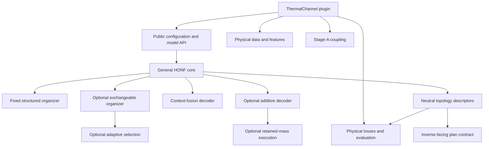
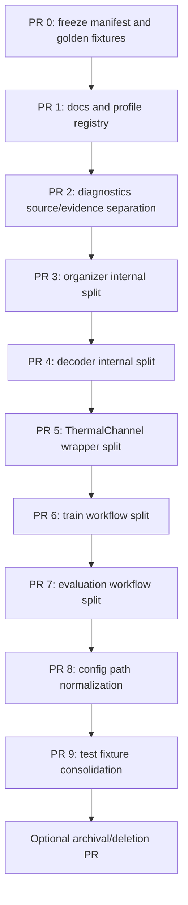

# Stage 7 Repository Cleanup Plan

## Status

**Plan only. No cleanup, move, deletion, model edit, checkpoint rewrite, or training action has been executed.**

The cleanup should begin only after the Stage 1–6 research state is frozen and Run 1401 has reached the evaluation point chosen by the project owner. The first cleanup pull requests must be prediction-neutral and checkpoint-neutral.

## Table of contents

1. [Purpose and constraints](#1-purpose-and-constraints)
2. [Current complexity audit](#2-current-complexity-audit)
3. [Target repository architecture](#3-target-repository-architecture)
4. [Freeze manifest before cleanup](#4-freeze-manifest-before-cleanup)
5. [Detailed cleanup phases](#5-detailed-cleanup-phases)
6. [File-level action plan](#6-file-level-action-plan)
7. [Compatibility strategy](#7-compatibility-strategy)
8. [Validation gates](#8-validation-gates)
9. [Archival and deletion policy](#9-archival-and-deletion-policy)
10. [Git and pull-request sequence](#10-git-and-pull-request-sequence)
11. [Risks and rollback](#11-risks-and-rollback)
12. [Definition of done](#12-definition-of-done)

## 1. Purpose and constraints

### 1.1 Goal

The goal is to make the repository easy to understand and extend around two explicit surfaces:

1. a reusable, application-neutral HONF forward core;
2. a ThermalChannel plugin that owns physical features, data, coupling, losses, evaluation, and inverse integration.

The cleanup should reduce navigation cost and mode entanglement without erasing the staged research record or invalidating any accepted checkpoint.

### 1.2 Binding constraints

- Preserve numerical predictions for every existing checkpoint/config pair.
- Preserve state-dict key names and tensor shapes.
- Preserve the Run-1000 fixed/context-fusion path exactly.
- Preserve the Stage-1/2/3 additive, exchangeable, adaptive, and gathered implementations as loadable historical/research modes until an explicit later retirement decision.
- Preserve current Stage-A behavior, data schema, normalization, and dataset fingerprint checks.
- Preserve inverse-facing source/region/scale/mass/purity descriptors.
- Keep ThermalChannel assumptions out of `src/honf_forward_core`.
- Do not mix cleanup with a new scientific model change.
- Do not rewrite checkpoints merely to accommodate a new module layout.
- Do not remove historical run directories as part of code cleanup.

### 1.3 Non-goals

This plan does not:

- redesign HONF;
- add losses, selection rules, sparsity, or new backgrounds;
- optimize GPU kernels;
- alter Run 1401 while it is active;
- simplify or rewrite inverse algorithms;
- retrain Stage A;
- delete Stage 1–6 evidence before it is frozen and indexed.

## 2. Current complexity audit

### 2.1 Code and artifact inventory

The current working tree contains the following approximate source footprint:

| Area | Python files | Python lines | Main concentration |
|---|---:|---:|---|
| `src/honf_forward_core` | 13 | 5,501 | organizer, decoder, topology evaluation |
| `src/honf_inverse_core` | 22 | 3,684 | intentionally outside the main cleanup |
| `src/honf_runtime` | 13 | 1,465 | config, provenance, artifact layout |
| ThermalChannel package total | 52 | 15,783 | forward, local, evaluation, inverse, workflows |
| ThermalChannel workflows | 10 | 6,065 | training, evaluation, compare, inverse workflows |
| ThermalChannel data | 3 | 1,222 | packed HDF5 readers and dynamic collation |
| ThermalChannel evaluation tools | 5 | 1,423 | physical, organization, routing, topology plots |
| ThermalChannel inverse package | 20 | 4,043 | preserve; contract-check only |
| Root tests | 31 test modules | 4,436 | general/runtime/core coverage |
| ThermalChannel tests | 16 test modules | 2,085 | case and workflow coverage |

The largest single files are:

| File | Lines | Why it is difficult to maintain |
|---|---:|---|
| `workflows/train_forward.py` | 1,945 | epoch logic, optimizer, checkpoints, plots, resume, diagnostics, CLI behavior |
| `organizer.py` | 1,604 | fixed and exchangeable organizers, schedules, selection, viability, descriptors |
| `decoder.py` | 1,367 | context and additive decoders, routing, gathered execution, pairwise kernel |
| `workflows/evaluate_forward.py` | 1,063 | loading, chunking, physical metrics, all figure/export families |
| `data/datasets.py` | 1,061 | global, local, alignment datasets and normalization |
| `workflows/compare_models.py` | 962 | evaluation orchestration and reporting |
| `channelthermal/model.py` | 774 | physical adaptation, three organizer passes, Stage-A coupling, decoding |
| `evaluation/topology_signature.py` | 772 | extraction, canonicalization, summaries, validation |
| `local_coupling.py` | 636 | port heads, Stage-A invocation, response fusion, flux handling |

There are 19 forward JSON profiles/overlays and 47 maintained test modules. The `diagnostics` tree currently contains reports, scripts, generated figures, JSON, and multi-megabyte CSV evidence together. That tree is scientifically valuable but not a clean source package.

### 2.2 Main sources of complexity

#### A. Multiple scientific modes share monolithic files

`organizer.py` and `decoder.py` intentionally accumulated mutually exclusive paths:

```text
fixed_projection | exchangeable_slots
context_fusion   | edge_additive
softmax          | entmax15 | scheduled
dense            | gathered | scheduled
all              | quality_coverage
```

The modes must remain, but their implementation does not need to remain in two very large files.

#### B. Workflow policy and mechanics are interleaved

`train_forward.py` owns model invocation, loss assembly, optimizer grouping, resume/initialization, progress state, diagnostic extraction, plotting, checkpoint cadence, and command lifecycle. A change to one concern requires reading most of the file.

#### C. Historical and current configuration intentions are not visually separated

The profile directory contains primary profiles, staged experiments, controls, and one-off ablations. Strict parsing is good, but a new developer cannot quickly identify:

- the recommended current profile;
- a supported compatibility profile;
- a frozen historical experiment;
- an evaluation-only overlay.

#### D. Source tools and generated evidence share one directory

`diagnostics/` contains maintained Python evaluators beside large generated CSV/JSON/PNG outputs. This obscures which files are executable source and which are regenerable or archival evidence.

#### E. Compatibility behavior is necessary but scattered

Historical config aliases, old artifact names, state-dict loading, evaluation path fallback, and current canonical outputs are individually justified. Their policies are distributed across config, runtime, workflow, and plotting modules rather than indexed in one compatibility contract.

#### F. Historical run layouts remain visually noisy

New runs use canonical directories:

```text
checkpoints/
metrics/
plots/training/
plots/diagnostics/
evaluations/
comparisons/
logs/
environment/
configs/
```

Older runs retain root-level checkpoint/plot aliases, `diagnostic_plots`, and `eval_global`. These should remain read-only historical artifacts; trying to rewrite all old runs would add risk without improving current producers.

## 3. Target repository architecture

### 3.1 Design principle

The target should separate **stable public façade**, **current scientific path**, **optional research modes**, **case implementation**, and **offline evidence**.



The fixed/context path should be obvious and short. Optional research modes should remain accessible without dominating the primary path.

### 3.2 Proposed source tree

This is a target shape, not an instruction to move everything at once:

```text
HONF_Proj/
├── docs/
│   ├── architecture/
│   │   ├── forward_core.md
│   │   ├── thermalchannel.md
│   │   └── compatibility.md
│   ├── experiments/
│   │   ├── stage1_6_index.md
│   │   └── stage7.md
│   └── history/
├── src/
│   ├── honf_forward_core/
│   │   ├── config.py
│   │   ├── model.py
│   │   ├── organization/
│   │   │   ├── facade.py
│   │   │   ├── fixed.py
│   │   │   ├── exchangeable.py
│   │   │   ├── assignments.py
│   │   │   ├── selection.py
│   │   │   └── descriptors.py
│   │   ├── decoding/
│   │   │   ├── facade.py
│   │   │   ├── context_fusion.py
│   │   │   ├── edge_additive.py
│   │   │   ├── pairwise.py
│   │   │   └── route_limits.py
│   │   ├── training/
│   │   └── evaluation/
│   ├── honf_runtime/
│   └── config_core/
│       └── forward/
│           ├── current/
│           ├── compatibility/
│           └── experiments/
├── Case_ThermalChannel/
│   ├── configs/
│   ├── Dataset/
│   └── src/channelthermal/
│       ├── model.py
│       ├── data/
│       ├── coupling/
│       ├── training/
│       ├── evaluation/
│       ├── workflows/
│       └── inverse/
├── tools/
│   └── diagnostics/
├── tests/
└── diagnostics/
    └── published_evidence/
```

The final exact names can be adjusted during implementation. The important feature is the dependency direction, not directory aesthetics.

### 3.3 Public façades must remain stable

Existing imports and state ownership should continue through thin façades:

```python
from honf_forward_core.model import HONFNeuralField
from honf_forward_core.organizer import HypergraphOrganizerCore
from honf_forward_core.decoder import HypergraphFieldDecoder
```

Internal implementations may move behind those symbols. Checkpoint-facing attributes must remain:

```text
core.global_encoder
core.module_feature_encoder
core.position_fourier
core.module_position_encoder
core.env_encoder
core.organizer
core.decoder
local_coupling
fallback_heads
```

Moving a Python class is safe only if the instantiated attribute hierarchy and registered parameter names remain unchanged.

## 4. Freeze manifest before cleanup

### 4.1 Create a research freeze tag and branch

After the user declares Stage 1–6 frozen:

1. make the working tree intentional and review all uncommitted files;
2. create a signed or annotated tag such as `honf-stage1-6-freeze`;
3. create a long-lived archival branch such as `archive/honf-stage1-6`;
4. record the exact source SHA in the freeze manifest;
5. do not rewrite that tag or branch.

These are future actions; this document does not execute them.

### 4.2 Freeze the scientific assets

The manifest should include SHA-256, epoch, state-key count, config hash, dataset hash, and Stage-A hash for at least:

- Run 1000 best field;
- Run 1005 best field;
- Run 1007 best field;
- Run 1102 best and latest;
- Run 1202 best field;
- Run 1301 best field;
- Run 1302 best field;
- Run 1304 best and latest;
- Run 1401 milestone/best checkpoint selected for the modern structured reference.

Do not duplicate the checkpoint bytes in Git. Store paths, hashes, metadata, and storage location.

### 4.3 Freeze golden numerical cases

Record compact deterministic inputs and expected outputs for:

- Run 1000 case `0653`;
- Stage-1 fixed additive case `0653`;
- Stage-2 exchangeable case `0653` with a fixed candidate code order;
- Stage-3 gathered/full-limit parity fixture;
- Run 1401 case `0653` once an accepted checkpoint exists.

For each, retain:

```text
pred_field digest
selected organizer arrays
routing summary
state_dict key/shape inventory
resolved config
normalization digest
dataset/query digest
```

Golden outputs should be small test fixtures, not copies of complete evaluation trees.

### 4.4 Freeze public schemas

Create machine-readable snapshots of:

- `UnifiedForwardConfig` public fields and defaults;
- `BatchData` fields;
- `PreparedChannelThermalCase` fields;
- checkpoint top-level keys;
- hypergraph plan and topology-signature schema versions;
- run/evaluation manifest schema versions;
- ThermalChannel HDF5 feature-name arrays and channel order.

## 5. Detailed cleanup phases

### Phase 0 — freeze and baseline

**Purpose:** make every later cleanup measurable and reversible.

Actions:

- create the freeze manifest described above;
- run the complete root and ThermalChannel suites;
- save test collection inventory;
- save Run-1000 and Run-1401 golden replay results;
- save state-key inventories for every maintained mode;
- save import/API smoke tests;
- record current file and line counts.

Exit gate: no cleanup starts until all baseline artifacts are versioned and reproducible.

### Phase 1 — documentation and profile catalog

**Purpose:** make the current path discoverable before moving code.

Actions:

- promote this stage summary into the architecture documentation index;
- create one profile registry table with columns `status`, `base`, `mode`, `checkpoint families`, and `owner`;
- label profiles as `current`, `compatibility`, `frozen_experiment`, or `evaluation_only`;
- document Stage 7 as the current formal forward profile;
- add a compatibility document explaining which historical paths remain supported and why;
- link each published evaluation report to its machine-readable evidence.

Do not move config files in this phase. Labels and an index provide most of the navigation gain with almost no risk.

Exit gate: a new contributor can find the recommended training profile and identify every experimental profile without reading source code.

### Phase 2 — separate generated evidence from diagnostic source

**Purpose:** stop mixing executable tools with large generated artifacts.

Actions:

- move maintained evaluators from `diagnostics/*.py` to `tools/diagnostics/` or a case evaluation package;
- keep thin command wrappers at old paths for one compatibility release if external commands depend on them;
- place curated Markdown reports and small summary JSON under `diagnostics/published_evidence/` or `docs/experiments/`;
- add a generated-output root to `.gitignore` for large CSV, NPZ, and figure trees;
- store one `evidence_manifest.json` per published report with commands, source hashes, and external artifact paths;
- do not discard the current Stage-5/6 raw evidence until its manifest has been verified.

Exit gate: `diagnostics/` no longer acts simultaneously as source tree, report library, and scratch disk.

### Phase 3 — split the organizer behind a compatibility façade

**Purpose:** make the primary fixed organizer readable without removing optional modes.

Proposed extraction order:

1. pure geometry and assignment helpers;
2. descriptor construction;
3. CPU quality/coverage selection;
4. exchangeable organizer class;
5. fixed organizer class;
6. thin `HypergraphOrganizerCore` dispatcher.

Rules:

- keep `HypergraphOrganizerCore` import path unchanged;
- keep fixed attributes `module_score`, `env_score`, `module_to_hyper`, `env_to_hyper`, `hyper_mix`, `me_query`, `me_key`, and `me_context_proj` registered at the same state-dict path;
- keep exchangeable attributes beneath `organizer.exchangeable.*`;
- do not wrap fixed parameters in an extra `fixed` submodule unless custom state-dict translation is proven unnecessary—the safer approach is composition through non-module helpers or explicit property forwarding;
- move code without algebraic edits in the same pull request.

Exit gate: Run-1000 predictions, all state-key inventories, permutation tests, selection tests, and full suites match the baseline.

### Phase 4 — split the decoder behind a compatibility façade

**Purpose:** separate the accepted context-fusion path from optional additive and gathered machinery.

Proposed extraction order:

1. route limiting and retained-mass helpers;
2. pairwise kernel implementation;
3. additive output helper;
4. context-fusion execution helper;
5. common query encoding/routing orchestration.

Rules:

- keep `HypergraphFieldDecoder` import path and registered parameter names;
- do not nest `pred_head`, `background_head`, `edge_head`, or routing projections under new parameter-bearing containers;
- allow helper objects to be plain functions or non-registering classes when that protects key paths;
- retain conditional construction so fixed/context checkpoints do not gain additive state keys;
- preserve exact dense arithmetic order on the context-fusion path;
- preserve exact additive closure and gathered/full-limit parity.

Exit gate: bitwise or established numerical parity for Run 1000, Stage 1, Stage 2, and Stage 3 golden fixtures; unchanged state-key structure.

### Phase 5 — simplify the ThermalChannel model wrapper

**Purpose:** expose the physical coupling sequence without changing it.

Extract from `channelthermal/model.py` into case-owned helpers:

- physical input preparation;
- base organizer pass;
- local Stage-A response pass;
- outside-temperature refinement pass;
- final organizer pass;
- output packaging and compatibility aliases;
- prepared-state decoding.

The public `ChannelThermalHONFModel.forward` signature remains unchanged. The helper boundary should follow the existing vertical data flow rather than create a generic abstraction for one case.

Exit gate: identical predictions, local outputs, organizer-pass outputs, and prepared decoding for teacher, mixed, and predicted port modes.

### Phase 6 — split training and evaluation workflows

**Purpose:** separate CLI/lifecycle from numerical epoch logic.

For `train_forward.py`, create focused modules for:

```text
training/epoch.py          model call and loss assembly
training/optimizer.py      parameter grouping and inventory
training/checkpoints.py    resume, initialize, save, milestones
training/progress.py       explicit schedule state
training/metrics.py        aggregation and CSV schema
training/plots.py          live/static plot generation
workflows/train_forward.py CLI orchestration only
```

For `evaluate_forward.py`, create:

```text
evaluation/loading.py      checkpoint/config/normalization
evaluation/prepared.py     chunked field collection
evaluation/metrics.py      physical metrics
evaluation/exports.py      arrays/plans/signatures
evaluation/render.py       category-oriented plotting
workflows/evaluate_forward.py CLI orchestration only
```

Do not change command-line interfaces or default artifact paths during the same extraction pull request.

Exit gate: dry-run, resume, partial initialization, checkpoint selection, single-case evaluation, full-split evaluation, and manifest inventories match baseline.

### Phase 7 — normalize configurations without losing provenance

**Purpose:** make configuration intent explicit while preserving historical resolution.

Actions:

- keep `stage7_structured_context.json` as the primary formal profile;
- retain `enhanced_honf_pairwise.json` as Run-1000 compatibility/reference;
- retain `adaptive_sparse_additive.json` as a supported research profile, not the default;
- add metadata to experiment overlays: `status`, `stage`, `scientific_question`, `expected_base_profile`, `checkpoint_compatibility`;
- validate overlays against their declared base profile;
- create a command that prints the fully resolved model-mode matrix before launch;
- avoid moving frozen overlays until all documentation and external scripts use the registry;
- if files are later moved, support old paths through a resolver alias table and test both paths.

Exit gate: every historical resolved config reconstructs its original model and every current launch has one unambiguous source profile.

### Phase 8 — consolidate tests around contracts

**Purpose:** reduce duplicate fixture construction while strengthening mode coverage.

Create shared fixtures for:

- fixed/context Run-1000-shaped model;
- fixed/additive Stage-1-shaped model;
- exchangeable/all-soft Stage-2-shaped model;
- exchangeable/scheduled/gathered Stage-3-shaped model;
- variable-module ThermalChannel case;
- fake checkpoint/config bundle with normalization and progress state.

Organize tests by contract:

```text
tests/forward_core/test_fixed_context.py
tests/forward_core/test_additive.py
tests/forward_core/test_exchangeable.py
tests/forward_core/test_adaptive_selection.py
tests/forward_core/test_gathered.py
tests/runtime/test_checkpoint_compatibility.py
tests/runtime/test_artifact_layout.py
Case_ThermalChannel/tests/test_model_coupling.py
Case_ThermalChannel/tests/test_prepared_evaluation.py
```

Do not reduce coverage merely to reduce file count. Consolidate duplicated setup, not independent invariants.

Exit gate: fewer redundant fixtures, unchanged or increased assertions, full suites pass.

### Phase 9 — archive or retire only after a compatibility window

Candidates for archival are listed in Section 9. No file is deleted merely because Stage 7 does not use it.

Exit gate: at least one release or explicit project milestone has used the cleaned structure, old-path warnings have been observed, and the owner approves retirement.

## 6. File-level action plan

| Current path | Proposed action | Risk | Required gate |
|---|---|---:|---|
| `src/honf_forward_core/config.py` | Keep public dataclasses; move mode-specific validators only if defaults/schema snapshot remains exact | High | config snapshot + all profile resolution |
| `src/honf_forward_core/model.py` | Keep as stable façade; only shorten orchestration after parity | High | all four mode fixtures |
| `src/honf_forward_core/organizer.py` | Split fixed/exchangeable/helpers behind same class/API | Very high | Run-1000 exact replay + state keys + selection tests |
| `src/honf_forward_core/decoder.py` | Split context/additive/pairwise/routing helpers without parameter reparenting | Very high | fixed/additive/gathered numerical parity |
| `src/honf_forward_core/routing.py` | Keep pure normalization; merge only duplicate helper logic after endpoint tests | Medium | softmax/entmax endpoint suite |
| `training/diagnostics.py` | Separate metric definitions, aggregation, and plot schema | Medium | CSV schema and numeric regression |
| `evaluation/topology_signature.py` | Separate schema, extraction, canonicalization, and summaries | High | saved signature compatibility |
| `channelthermal/model.py` | Extract physical pass helpers; keep forward signature and output keys | Very high | coupled forward/prepared parity |
| `channelthermal/local_coupling.py` | Split heads, Stage-A adapter, and fusion only after wrapper cleanup | High | Stage-A checkpoint and port-mode tests |
| `data/datasets.py` | Split normalizer, local dataset, and global dataset | Medium | sample digests and multiprocessing loader tests |
| `workflows/train_forward.py` | Reduce to orchestration by extracting epoch/checkpoint/plot modules | High | dry-run, short correctness run, resume parity |
| `workflows/evaluate_forward.py` | Extract collection/export/render layers | High | exact Run-1000 case replay and artifact manifest |
| `workflows/compare_models.py` | Reuse evaluation collection rather than duplicate it | Medium | comparison summaries unchanged |
| `diagnostics/*.py` | Move maintained tools to a source/tools package with wrappers | Low/medium | commands and imports remain valid |
| `diagnostics/*.{csv,npz,png,json}` | Manifest, then externalize/archive generated bulk outputs | Data risk | hashes and published report links verified |
| `src/config_core/forward/experiments/*.json` | Add status metadata/index first; move only later with aliases | Medium | historical resolution |
| historical run directories | Leave read-only; do not mass-migrate | High | not applicable |
| `src/honf_inverse_core` and `channelthermal/inverse` | No structural cleanup in this program; validate forward-plan contracts only | Very high | inverse plan contract test |

## 7. Compatibility strategy

### 7.1 State-dict invariants

For each maintained model family, capture a sorted table:

```text
parameter_or_buffer_name, shape, dtype
```

Every cleanup pull request compares that table before and after. The test must fail on:

- a renamed key;
- an added key in a mode that previously did not instantiate it;
- a removed key;
- a shape change;
- parameter reordering that changes optimizer resume semantics.

Do not solve accidental reparenting with a broad `strict=False` loader. Preserve the structure instead.

### 7.2 Prediction invariants

Use two levels:

1. bitwise equality when the operation order is unchanged;
2. a predeclared tolerance only when extraction changes harmless kernel scheduling.

The tolerance must never be widened after seeing a failure. Run-1000 current-code replay is already exact and should remain exact.

### 7.3 Config invariants

All saved configs must retain these historical defaults when fields are absent:

```text
organizer_mode=fixed_projection
mechanism_state_mode=residual_concat
field_assembly_mode=context_fusion
module/environment/query normalizer=softmax
routing_execution=dense
```

New metadata keys should begin with `_` if the strict core parser is not meant to consume them, or be handled by the profile registry before core dataclass construction.

### 7.4 Artifact invariants

New producers use one canonical location. Old readers may search aliases. The policy should be:

\[
\text{one producer path} + \text{many read-compatible aliases},
\]

not multiple producers writing duplicate files.

Do not rewrite old `eval_global` trees. Provide an index or migration utility that can read them and optionally create a manifest without copying large artifacts.

### 7.5 Inverse-facing invariants

The cleanup must preserve:

- hyperedge source and region coordinates;
- source and region scales;
- module/environment mass and purity;
- active/effective masks;
- hyperedge state and descriptor tensors;
- hypergraph plan schema and topology signature schema;
- canonical edge permutation behavior.

The inverse package may be reorganized only in a separate project after forward cleanup is complete.

## 8. Validation gates

### 8.1 Gate matrix

| Gate | Minimum evidence | Applies after |
|---|---|---|
| Config resolution | All 19 forward profiles resolve; invalid combinations still fail | every config change |
| Run-1000 compatibility | `237/237` keys and exact case-0653 replay | organizer, decoder, wrapper, evaluation changes |
| Stage-1 additive | exact closure and unchanged fixed/additive prediction | decoder changes |
| Stage-2 exchangeability | code permutation equivariance and capacity 6/8 parameter-shape equality | organizer changes |
| Stage-3 selection | progress parity, viability, fallback, CPU selector match | organizer changes |
| Gathered routing | retained-mass diagnostics and full-limit dense parity | decoder changes |
| Thermal coupling | predicted/teacher/mixed ports, Stage-A response, refinement, prepared parity | case changes |
| Checkpoint lifecycle | resume and partial initialization inventories | training workflow changes |
| Artifact lifecycle | canonical paths, manifests, no duplicate producer output | runtime/evaluation changes |
| Inverse contract | plan extraction and descriptor shapes unchanged | organizer/wrapper changes |
| Full tests | complete root and ThermalChannel suites | every cleanup PR |

### 8.2 Bounded runtime validation

Cleanup does not justify a long training run. If training mechanics change, use at most:

- one epoch;
- two training batches;
- one validation batch;
- a temporary run directory;
- no overwrite of formal artifacts.

The goal is lifecycle correctness, not convergence evidence.

### 8.3 Performance guardrail

Refactoring must not materially regress:

- prepared decoder latency;
- full-forward latency;
- peak allocated memory;
- data-loader throughput;
- epoch wall time excluding plots/checkpoints.

Use the same fixed checkpoint, case, query count, warmup, and synchronized iterations. Treat changes below ordinary benchmark noise as neutral; investigate reproducible regressions above 5%.

## 9. Archival and deletion policy

### 9.1 Keep permanently in active source

- Stage-7 fixed/context implementation and profile;
- Run-1000 compatibility loader and profile;
- current ThermalChannel data/coupling code;
- current provenance, artifact, evaluation, and checkpoint infrastructure;
- neutral topology/plan schemas;
- tests for every checkpoint-compatible mode.

### 9.2 Keep as optional research modules

- exchangeable slots;
- adaptive selection and viability;
- entmax and schedules;
- additive field assembly;
- retained-mass gathered execution;
- alternative additive backgrounds.

These may move out of the primary reading path, but should not be deleted while Stage-1–6 checkpoints are expected to load.

### 9.3 Archive from the active documentation/config surface

After the profile registry and frozen manifests exist, archive:

- superseded stage drafts;
- one-off launch notes;
- rejected Stage-4/6 overlays from the recommended profile list;
- duplicated narrative reports whose conclusions are incorporated into the stage summary;
- old plotting screenshots duplicated by machine-readable evaluations.

Archived files should remain addressable by commit/tag and an index. “Archived” does not mean silently removed.

### 9.4 Externalize generated bulk evidence

Large per-case CSV, NPZ, and figure trees should live in a versioned artifact store or the relevant run/evaluation directory, not beside maintained scripts. Keep in Git or the documentation tree only:

- concise Markdown conclusions;
- small summary JSON;
- hashes and commands;
- selected publication figures;
- an artifact-location manifest.

### 9.5 Delete only after explicit approval

Potential deletion candidates after the compatibility window are:

- stale duplicated plot aliases generated by no current producer;
- empty experimental directories;
- exact duplicate reports confirmed by hash/content;
- obsolete command wrappers after all callers migrate;
- scratch evaluations with no cited report and no unique checkpoint evidence.

Before deletion, resolve exact targets, record an inventory, prefer a recoverable archive, and obtain project-owner approval.

## 10. Git and pull-request sequence

Use small, reviewable behavior-neutral pull requests:



Each PR should contain:

- one stated structural objective;
- a before/after file map;
- state-key diff result;
- numerical golden result;
- exact focused and full test commands;
- any timing result relevant to touched code;
- rollback instructions;
- no unrelated scientific setting change.

Do not squash the archival freeze tag. Cleanup PRs may be squashed according to repository policy, but their validation evidence should remain in the PR description or committed manifest.

## 11. Risks and rollback

### 11.1 Primary risks

| Risk | Failure mode | Prevention |
|---|---|---|
| Parameter reparenting | historical checkpoints no longer load strictly | preserve registered attribute hierarchy; state-key snapshot |
| Arithmetic reordering | Run-1000 exact replay changes | extract helpers without equation edits; golden replay |
| Hidden config drift | absent historical fields resolve to modern modes | schema/default snapshot and historical config tests |
| Artifact link breakage | reports or run manifests point to moved files | manifest-based migration and compatibility readers |
| Diagnostic semantic drift | same CSV column name gains a new denominator | metric definition registry and regression fixture |
| Data-loader drift | dynamic compaction permutes module tensors inconsistently | per-sample digest and permutation tests |
| Inverse breakage | descriptor key/shape changes | explicit inverse plan contract test |
| Cleanup/training overlap | active Run 1401 provenance becomes ambiguous | wait for checkpoint boundary; never edit active run files |

### 11.2 Rollback strategy

For every phase:

1. retain the pre-cleanup tag;
2. keep each PR independently revertible;
3. avoid data migrations that require destructive overwrite;
4. write new manifests beside old artifacts before any archival move;
5. if a parity gate fails, revert the structural extraction rather than adding permissive loading;
6. do not continue to the next phase with an unresolved discrepancy.

## 12. Definition of done

The cleanup is complete when:

- one page identifies the current Stage-7 profile, compatibility profiles, and frozen experiments;
- the fixed/context path can be understood without reading exchangeable/additive selection internals;
- optional research modes remain strictly checkpoint-compatible;
- general core and ThermalChannel ownership are explicit in code and documentation;
- training and evaluation workflow entry points are orchestration-sized rather than policy monoliths;
- maintained diagnostic scripts are separate from generated evidence;
- new runs and evaluations produce only canonical artifact locations;
- historical artifacts remain readable without mass duplication;
- state-dict inventories are unchanged for maintained modes;
- Run-1000 and accepted Run-1401 golden predictions pass;
- complete root and ThermalChannel suites pass;
- inverse plan contracts pass;
- no long training run was required for cleanup;
- every deletion, if any, occurred only in a separately approved archival PR.

The intended end state is a smaller **active mental model**, not a repository that forgets its experiments. Stage 1–6 should remain reproducible history and optional capability; Stage 7 should become the clear default path for the next scientific development cycle.
