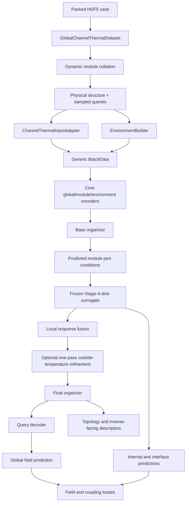
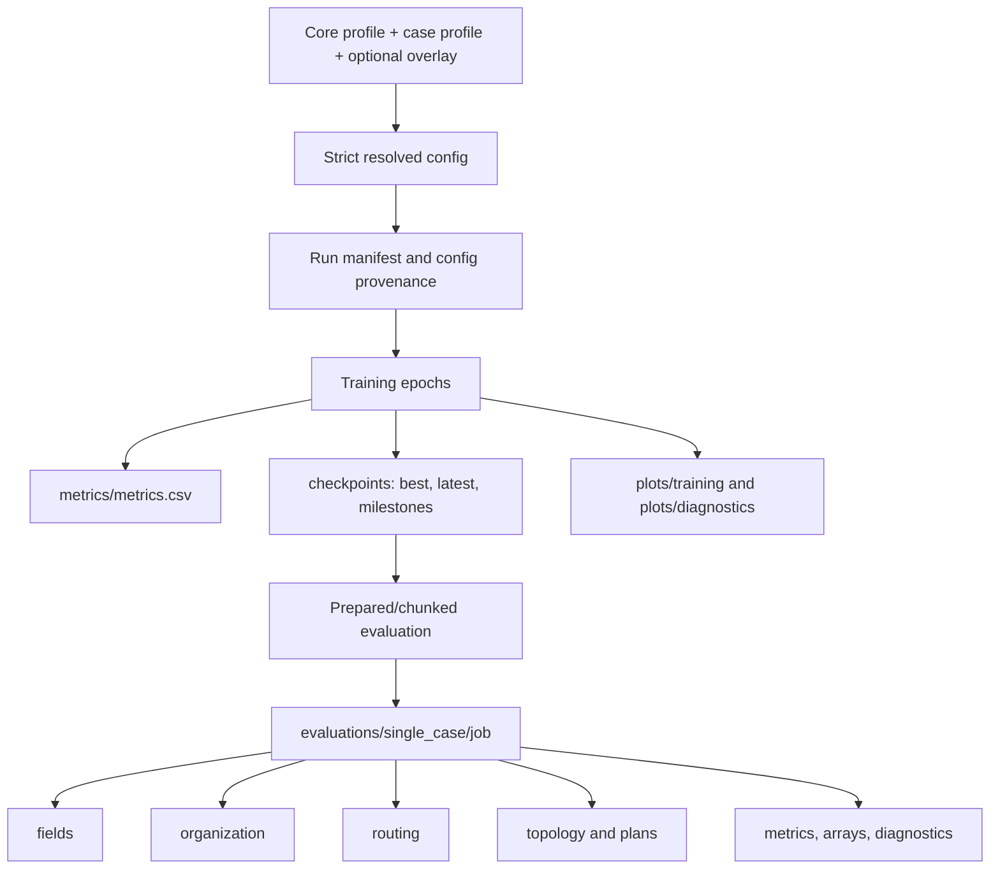
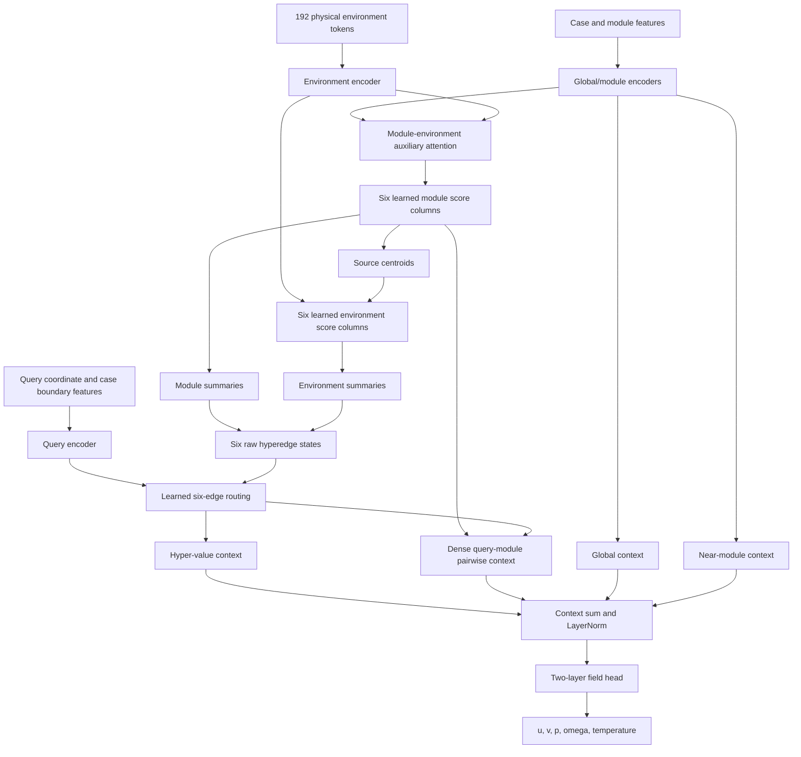

# HONF Stages 1–7: Mathematical, Architectural, and Scientific Summary

## Technical summary

The HONF forward project predicts a continuous multiphysics field from a variable-size set of physical modules, a case-level operating condition, and arbitrary query coordinates. In the ThermalChannel case, it couples a global neural field for

\[
\mathbf{y}(\mathbf{x})=[u(\mathbf{x}),v(\mathbf{x}),p(\mathbf{x}),\omega(\mathbf{x}),T(\mathbf{x})]
\]

to a frozen Stage-A local disk surrogate that predicts solid temperature and interface response for every heated module.

Stages 1–6 built and tested a substantially more ambitious model family: exact edge-additive output, anonymous exchangeable slots, viability-aware adaptive selection, scheduled entmax sparsity, retained-mass gathered execution, richer topology diagnostics, and modern provenance. These revisions produced useful engineering infrastructure and showed that the additive family has enough predictive capacity. They did **not** produce a consistently better scientific organizer. The strongest modern additive predictor, Run 1304, reached complete-split normalized MSE `0.0009521`, only `1.30×` Run 1000, but its query, pairwise, and edge-field representations became nearly rank one.

Stage 7 therefore consolidates rather than adds another architecture. Run 1401 returns to the verified Run-1000 structural bottleneck—fixed six-edge softmax organization, residual-concat mechanism state, and context fusion—while retaining the later engineering improvements. The historical Run-1000 checkpoint and accepted Run-1401 checkpoint both strict-load all `237/237` state keys and reproduce their deterministic case-`0653` golden fixtures exactly. Run 1401 best-by-field at epoch 4585 passed the formal 5K decision point and is the current scientific forward baseline.

## Table of contents

1. [Scope and evidence](#1-scope-and-evidence)
2. [General HONF forward problem](#2-general-honf-forward-problem)
3. [ThermalChannel demonstration problem](#3-thermalchannel-demonstration-problem)
4. [Current data contract and tensor structure](#4-current-data-contract-and-tensor-structure)
5. [Current code ownership and data flow](#5-current-code-ownership-and-data-flow)
6. [Classic Run 1000 model](#6-classic-run-1000-model)
7. [Stages 1–7: changes, evidence, and disposition](#7-stages-17-changes-evidence-and-disposition)
8. [Cross-stage quantitative evidence](#8-cross-stage-quantitative-evidence)
9. [What is retained, deferred, and excluded](#9-what-is-retained-deferred-and-excluded)
10. [Current scientific position](#10-current-scientific-position)
11. [Limitations and next phase](#11-limitations-and-next-phase)

## 1. Scope and evidence

This summary is grounded in:

- the current source code and resolved profiles;
- the historical Run-1000 source revision `2afa84759858931a236321e0086750734466dcec`;
- complete-split evaluations in [Stage5_Runs_1301_1304_vs_1000_Evaluation.md](../diagnostics/Stage5_Runs_1301_1304_vs_1000_Evaluation.md);
- the Stage-6 frozen-screen and closeout reports;
- the executable compatibility evidence in [Stage7_Run1000_Compatibility_Audit.md](../diagnostics/Stage7_Run1000_Compatibility_Audit.md);
- the dataset contract in [PHYSICS_AND_DATA.md](../Case_ThermalChannel/Dataset/PHYSICS_AND_DATA.md).

Unless stated otherwise, accuracy is pooled normalized mean squared error over all fluid points and all five output channels on the complete 90-case test split. Topology statistics are structural diagnostics, not loss terms. Runs from different stages do not always have matched training budgets or identical Stage-A checkpoint provenance; those comparisons are directional unless explicitly described as controlled.

## 2. General HONF forward problem

### 2.1 Operator-learning statement

For case $b$, define:

- a variable-size active module set

  \[
  \mathcal{M}_b=\{(\mathbf{x}_{bm},\mathbf{s}_{bm})\}_{m=1}^{N_b},
  \]

  where $\mathbf{x}_{bm}\in\mathbb{R}^{d_x}$ is a module location and $\mathbf{s}_{bm}$ contains module attributes;

- an environment-token set

  \[
  \mathcal{E}_b=\{(\mathbf{r}_{be},\mathbf{e}_{be})\}_{e=1}^{E_b};
  \]

- a global case descriptor $\mathbf{g}_b$;
- query coordinates $\mathbf{q}_{bq}\in\Omega_b$;
- target fields $\mathbf{y}_b(\mathbf{q}_{bq})\in\mathbb{R}^{F}$.

The learned forward operator is

\[
\widehat{\mathbf{y}}_b(\mathbf{q})
=
\mathcal{G}_{\Theta}
\left(
\mathcal{M}_b,
\mathcal{E}_b,
\mathbf{g}_b;
\mathbf{q}
\right).
\]

The central HONF hypothesis is that the set-to-field map can be mediated by $K$ latent hyperedges. Each hyperedge summarizes a relation between some modules, some environment tokens, and some query locations. A good representation must be:

- permutation-safe with respect to padded module slots;
- continuous in the query coordinate;
- able to express long-range and local interactions;
- diagnostically interpretable as module-to-edge, environment-to-edge, and query-to-edge relationships.

### 2.2 Generic tokenization

The reusable core encodes the input as

\[
\begin{aligned}
\mathbf{z}^{M}_{bm} &= f_M([\mathbf{s}_{bm},\phi(\mathbf{x}_{bm})]),\\
\mathbf{z}^{E}_{be} &= f_E([\mathbf{e}_{be},\phi(\mathbf{r}_{be})]) + \mathbf{1}_{\text{global}}f_G(\mathbf{g}_b),\\
\mathbf{z}^{Q}_{bq} &= f_Q([\phi(\mathbf{q}_{bq}),\mathbf{q}^{\text{case}}_{bq}]),\\
\mathbf{z}^{G}_b &= f_G(\mathbf{g}_b),
\end{aligned}
\]

where $\phi$ denotes Fourier coordinate features and $\mathbf{q}^{\text{case}}$ contains case-owned boundary descriptors when supplied.

Padded module slots are masked by $z_{bm}\in\{0,1\}$:

\[
\mathbf{z}^{M}_{bm}\leftarrow z_{bm}\mathbf{z}^{M}_{bm}.
\]

### 2.3 Hypergraph organization

The common organizer output contains:

\[
A^{ME}\in\mathbb{R}^{B\times M\times E},\qquad
A^{MH}\in\mathbb{R}^{B\times M\times K},\qquad
A^{EH}\in\mathbb{R}^{B\times E\times K},
\]

and hyperedge states

\[
H\in\mathbb{R}^{B\times K\times D}.
\]

For the fixed organizer, module-environment context is

\[
A^{ME}_{bme}
=
\operatorname{softmax}_{e}
\left(
\frac{Q_M(\mathbf{z}^{M}_{bm})^{\top}K_E(\mathbf{z}^{E}_{be})}{\sqrt D}
\right),
\]

\[
\widetilde{\mathbf{z}}^{M}_{bm}
=
\mathbf{z}^{M}_{bm}
+0.25P_{ME}\sum_e A^{ME}_{bme}\mathbf{z}^{E}_{be}.
\]

The two incidence matrices are row-normalized over edges:

\[
A^{MH}_{bmk}=\operatorname{softmax}_{k}(W_M\widetilde{\mathbf{z}}^{M}_{bm}),
\]

\[
A^{EH}_{bek}
=
\operatorname{softmax}_{k}
\left(
W_E\mathbf{z}^{E}_{be}
-\frac{\lVert\mathbf{r}_{be}-\mathbf{c}^{S}_{bk}\rVert_2}
{0.25\sqrt{L_x^2+L_y^2}}
\right).
\]

The source and region centroids are

\[
\mathbf{c}^{S}_{bk}
=
\frac{\sum_m A^{MH}_{bmk}\mathbf{x}_{bm}}
{\sum_m A^{MH}_{bmk}+\varepsilon},
\qquad
\mathbf{c}^{R}_{bk}
=
\frac{\sum_e A^{EH}_{bek}\mathbf{r}_{be}}
{\sum_e A^{EH}_{bek}+\varepsilon}.
\]

The fixed hyperedge state is

\[
\mathbf{h}_{bk}
=
f_H\left(
\frac{\sum_m A^{MH}_{bmk}P_M\widetilde{\mathbf{z}}^{M}_{bm}}
{\sum_m A^{MH}_{bmk}+\varepsilon}
+
\frac{\sum_e A^{EH}_{bek}P_E\mathbf{z}^{E}_{be}}
{\sum_e A^{EH}_{bek}+\varepsilon}
\right).
\]

The exchangeable organizer added later replaces $W_M:\mathbb{R}^{D}\rightarrow\mathbb{R}^{K}$ and $W_E:\mathbb{R}^{D}\rightarrow\mathbb{R}^{K}$ with shared token-slot compatibility and iterative shared slot updates. That makes learned parameter shapes independent of runtime capacity, but it also admits a symmetric, weakly identified solution.

### 2.4 Query routing and decoding

The learned query-to-edge distribution is

\[
\alpha_{bqk}
=
\operatorname{Norm}_{k}
\left(
\frac{Q_Q(\mathbf{z}^{Q}_{bq})^{\top}K_H(\mathbf{h}_{bk})}{\sqrt D}
+b_{\mathrm{geom}}(\mathbf{q}_{bq},k)
\right).
\]

`Norm` is softmax in Run 1000 and Stage 7. The staged sparse family can use entmax or a scheduled softmax-entmax blend.

The classic context-fusion decoder forms

\[
\mathbf{c}_{H}(\mathbf{q})
=
\sum_k \alpha_k(\mathbf{q})V_H(\mathbf{h}_k),
\]

plus a hypergraph-gated module-pair context $\mathbf{c}_{P}$, a global context $\mathbf{c}_{G}$, and a near-module context $\mathbf{c}_{N}$:

\[
\mathbf{c}(\mathbf{q})
=
\mathbf{c}_{H}(\mathbf{q})
+\mathbf{c}_{P}(\mathbf{q})
+\mathbf{c}_{G}(\mathbf{q})
+\mathbf{c}_{N}(\mathbf{q}),
\]

\[
\widehat{\mathbf{y}}(\mathbf{q})
=
f_{\mathrm{pred}}\!\left(\operatorname{LayerNorm}(\mathbf{c}(\mathbf{q}))\right).
\]

The alternative exact-additive decoder introduced in Stage 1 is

\[
\widehat{\mathbf{y}}(\mathbf{q})
=
\widehat{\mathbf{y}}_{\mathrm{bg}}(\mathbf{q})
+\sum_{k=1}^{K}
\widehat{\mathbf{y}}_{k}(\mathbf{q}),
\]

with

\[
\widehat{\mathbf{y}}_{k}(\mathbf{q})
=
\sigma(g)\,\alpha_k(\mathbf{q})
f_{\mathrm{edge}}(\mathbf{z}^{Q},\mathbf{h}_k,\boldsymbol{\gamma}_{qk},\mathbf{c}_{P,qk}).
\]

This exact closure is retained as a supported mode, but it is not the Stage-7 primary prediction path.

### 2.5 Training objective

The case wrapper supplies a weighted field error and local-coupling terms:

\[
\mathcal{L}
=
\lambda_F\mathcal{L}_{F}
+\lambda_I\mathcal{L}_{\mathrm{internal}}
+\lambda_{\Gamma}\mathcal{L}_{\mathrm{interface}}
+\lambda_P\mathcal{L}_{\mathrm{port}}
+\lambda_S\mathcal{L}_{\mathrm{port\ smooth}}
+\lambda_C\mathcal{L}_{\mathrm{global/port}}
+\lambda_A\mathcal{L}_{\mathrm{autonomous}}.
\]

For field-channel weights $w_f$ and optional point weights $w_q$,

\[
\mathcal{L}_{F}
=
\frac{\sum_{b,q,f}w_qw_f
\left(\widehat y_{bqf}-y_{bqf}\right)^2}
{\sum_{b,q,f}w_qw_f}.
\]

The formal Stage-7 profile keeps organizer regularization disabled. No edge-count, entropy, diversity, or load-balancing term is part of Run 1401.

## 3. ThermalChannel demonstration problem

### 3.1 Physical system

Each case is a steady two-dimensional incompressible channel containing a variable number of circular heated solid modules. A schematic fluid model is

\[
\nabla\cdot\mathbf{u}=0,
\]

\[
\rho(\mathbf{u}\cdot\nabla)\mathbf{u}
=
-\nabla p+\mu\nabla^2\mathbf{u},
\]

\[
\omega
=
\frac{\partial v}{\partial x}-\frac{\partial u}{\partial y},
\]

\[
\mathbf{u}\cdot\nabla T_f
=
\alpha_f\nabla^2T_f.
\]

Inside solid module $m$, the steady conduction problem is represented schematically by

\[
-\nabla\cdot(k_{s,m}\nabla T_{s,m})=\dot q_m,
\qquad \mathbf{x}\in\Omega_{s,m}.
\]

At module boundary $\Gamma_m$, the coupled solution is governed by temperature and heat-flux exchange. The local Stage-A interface contract exports

\[
[T_{\mathrm{surface}},q_{\mathrm{normal}}],
\]

and receives a Robin-like port sequence

\[
[\theta,\cos\theta,\sin\theta,T_{\mathrm{env}},h_{\mathrm{effective}}].
\]

The precise simulation boundary conditions and normalization are dataset-owned; the equations above state the modeled conservation structure rather than redefining the generator.

### 3.2 Coupled learned problem

The global forward model predicts

\[
\widehat{\mathbf{y}}(x,y)
=
[\widehat u,\widehat v,\widehat p,\widehat\omega,\widehat T_f].
\]

For each active module, the frozen local surrogate predicts

\[
\widehat T_{s,m}(\boldsymbol{\xi}),
\qquad
[\widehat T_{\Gamma,m}(\theta),\widehat q_{n,m}(\theta)].
\]

The ChannelThermal wrapper predicts port conditions, invokes Stage A, fuses its response into the module tokens, performs one provisional outside-temperature refinement when configured, and then constructs the final organizer state used by the global decoder.

## 4. Current data contract and tensor structure

### 4.1 Dataset identity

The maintained global dataset is `thermal_channel_global_v1`:

- 690 cases: 600 train and 90 test;
- maximum stored module slots: 12;
- 64 interface points per module;
- $64\times128=8192$ full-grid query points for complete evaluation;
- output channel order: `[u, v, p, omega, temperature]`;
- dataset SHA-256: `4224093c22a67af4adfecc8b21d53548e4263ec2254c230dc83c89526b36da05`.

The Stage-A dataset is `thermal_disk_local_v1`, with 1,034 samples: 919 train and 115 test.

### 4.2 Stored and runtime tensors

| Object | Stored/runtime shape | Meaning and owner |
|---|---:|---|
| `sampled_points` | `[N,7]` | `[x,y,u,v,p,omega,T]`; global HDF5 case |
| `module_centers` | `[M_store,2]` | Physical centers; dataset/case |
| `heat_powers` | `[M_store]` | Module heat descriptors; dataset/case |
| `module_present` | `[M_store]` | Active-slot mask; dataset/case |
| `interface_condition` | `[M_store,P,8]` | `theta,nx,ny,T_out,u_n,u_t,h_proxy,h_effective`; case |
| `interface_target` | `[M_store,P,2]` | Surface temperature and normal flux; case |
| internal temperature/mask | `[M_store,G,G]` | Solid-module supervision; case |
| training `query_xy` | `[B,Q,2]` | Sampled global field coordinates |
| training `field_targets` | `[B,Q,5]` | Normalized global targets |
| compact module axis | `[B,M,\cdot]` | Active modules compacted and padded to batch maximum |
| environment coordinates | `[B,192,2]` | $24\times8$ cell-centered grid |
| environment features | `[B,192,7]` | Wall, inlet, outlet, and centerline descriptors |
| generic module features | `[B,M,10]` | Heat, active flag, material, and radius descriptors |
| generic global context | `[B,18]` | Flow, count/density, heat, domain, and material summaries |
| module/environment tokens | `[B,M,256]`, `[B,192,256]` | Core encoded state |
| incidences | `[B,M,K]`, `[B,192,K]` | Module/environment assignment to hyperedges |
| hyperedge state | `[B,K,256]` | Organized latent mechanisms |
| field output | `[B,Q,5]` | Continuous normalized prediction |

The runtime $M$ is the largest active module count in the batch, not always the stored width 12. Every module-indexed tensor is compacted with the same permutation. Inactive slots must contribute zero to assignments, local inference, loss, and diagnostics.

### 4.3 Runtime sample structure

```text
sample
├── structure
│   ├── re, u_in
│   ├── module_centers
│   ├── heat_powers
│   ├── module_present
│   ├── material_params
│   └── domain_length_x, domain_length_y
├── query_xy
├── field_targets
├── point_weights, point_group
├── module_internal_temperature_points
├── module_internal_query_points
├── interface_condition, interface_target
├── teacher_port_tokens, local_module_params
├── optional structure_targets
└── case_id
```

Normalization is fit or loaded by the dataset workflow and embedded in checkpoints. Evaluation uses checkpoint-owned channel order and normalization; it must not refit statistics on the selected split.

## 5. Current code ownership and data flow

### 5.1 General core versus case-specific ownership

| Responsibility | General HONF code | ThermalChannel-specific code |
|---|---|---|
| Generic tensor/config contract | [`src/honf_forward_core/config.py`](../src/honf_forward_core/config.py) | [`channelthermal/config.py`](../Case_ThermalChannel/src/channelthermal/config.py) resolves physical settings |
| Generic encoders and prepared state | [`src/honf_forward_core/model.py`](../src/honf_forward_core/model.py) | [`channelthermal/model.py`](../Case_ThermalChannel/src/channelthermal/model.py) orchestrates coupling |
| Fixed and exchangeable organizers | [`src/honf_forward_core/organizer.py`](../src/honf_forward_core/organizer.py) | Case supplies module/environment tensors only |
| Context/additive decoding and routing | [`src/honf_forward_core/decoder.py`](../src/honf_forward_core/decoder.py), [`routing.py`](../src/honf_forward_core/routing.py) | Case supplies query boundary features and interprets five channels |
| Generic diagnostics/loss primitive | [`training/diagnostics.py`](../src/honf_forward_core/training/diagnostics.py), [`training/losses.py`](../src/honf_forward_core/training/losses.py) | [`training_tools/losses.py`](../Case_ThermalChannel/src/channelthermal/training_tools/losses.py) owns channel semantics |
| Physical input features | None | [`input_adapter.py`](../Case_ThermalChannel/src/channelthermal/input_adapter.py) |
| Environment grid/features | Core has a neutral fallback grid | [`environment.py`](../Case_ThermalChannel/src/channelthermal/environment.py) owns channel geometry |
| HDF5 and dynamic padding | None | [`data/datasets.py`](../Case_ThermalChannel/src/channelthermal/data/datasets.py), [`data/collation.py`](../Case_ThermalChannel/src/channelthermal/data/collation.py) |
| Stage-A local physics coupling | None | [`local_coupling.py`](../Case_ThermalChannel/src/channelthermal/local_coupling.py), [`local_surrogate/model.py`](../Case_ThermalChannel/src/channelthermal/local_surrogate/model.py) |
| Train/evaluate/compare workflows | Runtime utilities only | [`workflows/`](../Case_ThermalChannel/src/channelthermal/workflows) |
| Physical plots/topology presentation | Core exports neutral arrays/plans | [`evaluation_tools/`](../Case_ThermalChannel/src/channelthermal/evaluation_tools) |

This boundary is important: the core knows modules, environment tokens, hyperedges, and fields; it does not know Reynolds number, temperature, walls, heated disks, or HDF5 keys.

### 5.2 End-to-end flow



The diagram is vertical because the dominant dependency is sequential. Prepared evaluation cuts the graph at the final organizer: `PreparedChannelThermalCase` stores the organizer and global token, after which arbitrary query chunks reuse the same case state.

### 5.3 Training and evaluation artifact flow



Historical root-level aliases remain readable, but current producers use the canonical category-oriented layout.

## 6. Classic Run 1000 model

### 6.1 Authoritative configuration

Run 1000 used:

| Component | Run-1000 setting |
|---|---|
| Organizer | `fixed_projection` |
| Hyperedges | $K=6$ |
| Module assignment | learned softmax |
| Environment assignment | learned softmax plus fixed source-centered distance bias |
| Query routing | learned softmax plus ten-feature geometry bias |
| Mechanism state | `residual_concat` |
| Hyper mechanism encoder | disabled |
| Decoder | `enhanced_honf_pairwise` |
| Field assembly | `context_fusion` |
| Execution | dense, no top-$k$ limits |
| Optimizer | one AdamW parameter group |
| Learning rate | $3\times10^{-4}$ |
| Stage-A use | frozen local surrogate, predicted port mode, one refinement pass |

Its fixed organizer has explicit learned output columns:

```python
self.module_score = nn.Linear(hidden_dim, num_hyperedges)
self.env_score = nn.Linear(hidden_dim, num_hyperedges)
```

Those columns are stable learned roles. The later current fixed branch preserves this same physical organization logic.

### 6.2 Run-1000 forward structure



The critical scientific bottleneck is that the six organized contexts must combine before one shared field head. There is no independent physical-output head per hyperedge and no additive branch that can reproduce the whole field redundantly six times.

### 6.3 Current-code compatibility

The Stage-7 audit classifies current differences as:

- **A — mathematically preserved:** fixed organizer, source geometry, raw hyper state, query routing, pairwise context, context fusion, and prediction head;
- **B — engineering-only:** prepared/chunked decoding, added diagnostics, checkpoint manifests, dynamic collation, and host-side efficiency work;
- **C — intentional modern physical difference:** Run 1401 uses the current Stage-A `best_model.pt` at epoch 5050 instead of the historical `latest_model.pt` at epoch 6357;
- **D — unexplained contaminating difference:** none found.

Executable evidence:

- Run-1000 best-field checkpoint epoch: 9655;
- checkpoint state keys: `237/237`, no missing or unexpected keys;
- deterministic case `0653`: exactly zero difference across 131 compared numeric values from field, topology, hypergraph, and routing summaries.

No organizer or decoder source change was needed to prepare Stage 7.

## 7. Stages 1–7: changes, evidence, and disposition

### 7.1 Stage map

| Stage | Main scientific question | Principal additions or experiment | Main evidence | Present disposition |
|---|---|---|---|---|
| Phase 0 foundation | Are edge semantics, selection, viability, and gathered execution correct? | Unambiguous edge counts; explicit progress; viability masks; support fallback; mass-conserving selection; gathered/full parity; corrected routed-only retention diagnostics | Focused and full regression suites; prediction/state preservation checks | **Retain** as correctness infrastructure |
| 1 | Can a fixed organizer train with exact additive output? | Descriptor-first state; normalized background/edge heads; small output initialization; scalar edge gate; exact closure; provenance-safe partial initialization | Run 1005 remained structured; closure numerical zero; additive branch trained | **Retain supported mode**, not Stage-7 primary |
| 2 | Can anonymous slots form roles while all six remain soft? | Exchangeable shared slots; capacity-independent parameters; all-soft softmax; permutation-equivariance diagnostics | Run 1007 was differentiated and not rank one, but weaker than fixed Stage 1 | **Retain research mode**; not formal default |
| 3 | Can sparsity and execution be introduced continuously? | Soft-to-hard edge gates; staggered softmax-to-entmax schedules; bounded Gaussian locality; final-only selection; retained-mass gathered routing | Correctness/safety passed; Run 1102 trained safely; later evidence showed concentration and schedule-sensitive topology | **Keep implementation**, defer scientific use |
| 4 | Is the convergence gap optimizer/background related? | Uniform versus split optimizer; dense versus pooled additive background; data/diagnostic host-efficiency improvements | Run 1202 split LR best; pooled background saved little and hurt accuracy; topology later shown nearly rank one | Keep optimizer lesson and engineering; **reject pooled background as default** |
| 5 | Exchangeable soft versus fixed soft organization | Runs 1301/1302; residual-concat 1303; uniform organizer LR 1304; complete-split topology and pruning evaluation | Run 1304 best modern accuracy; Run 1301 best modern mechanism specialization; neither reproduced Run-1000 combined structure | Fixed organizer is practical base; exchangeable remains research branch |
| 6 | Can cheap frozen role interventions repair additive collapse? | Descriptor residual scale and query-locality screens; inverse descriptor readiness | Larger descriptor residual nearly doubled MSE; locality changed topology too little and worsened best-checkpoint MSE | **No-go**; S0 control only |
| 7 | Can modern code recover Run-1000 organization and accuracy? | Dedicated fixed $K=6$, residual-concat, context-fusion profile; shared $3\times10^{-4}$ optimizer; modern infrastructure retained | Run 1401 e4585: pooled MSE `9.5379e-4`, environment/query effective rank `4.73/3.72`, matched-5K trajectory `0.974×` Run 1000 | **Accepted current baseline** |

### 7.2 Stage 1 — fixed organizer plus exact additive field

Stage 1 deliberately changed only the primary mechanism state and output decomposition relative to the fixed organizer:

\[
\text{residual-concat}\rightarrow\text{descriptor-first},
\qquad
\text{context-fusion}\rightarrow\text{edge-additive}.
\]

It added:

- explicit input normalization for additive heads;
- a learned scalar gate initialized with $\sigma(g)=0.1$;
- small $10^{-3}$ final-layer initialization and zero bias;
- exact per-edge field export;
- additive closure and branch-energy diagnostics;
- `--initialize-checkpoint`, which loads only exact name-and-shape matches and never imports optimizer, epoch, metric, scaler, or RNG state.

Run 1005 established that the additive decomposition itself is trainable and that the fixed organizer can remain structured under it. The later complete-split structural evaluation reported environment profile cosine `0.0815`, environment rank `3.805`, query rank `4.707`, and temperature edge-field cosine `0.0992`. Stage 1 is therefore a useful bridge and compatibility mode, not a failed experiment.

### 7.3 Stage 2 — exchangeable organizer with all edges soft

Stage 2 changed only the organizer identity:

\[
\text{fixed learned edge columns}
\rightarrow
\text{shared exchangeable candidate slots}.
\]

All six candidates remained selected; module, environment, and query assignments remained softmax; execution remained dense. Parameter shapes were made independent of runtime edge capacity and code permutations were required to permute edge outputs without changing the total field.

Run 1007 showed genuine differentiation: query rank `4.347`, pairwise cosine `0.241`, and temperature edge-field cosine `0.175`. Its environment organization was weaker than Stage 1: cosine `0.586` and effective rank `1.921`. This demonstrated that exchangeability is possible, but it did not demonstrate that it is a stronger inductive bias than fixed roles.

### 7.4 Stage 3 — scheduled adaptive sparsity and gathered execution

Stage 3 introduced a curriculum:

\[
g_k(\lambda)=(1-\lambda)+\lambda z_k,
\qquad 0\leq\lambda\leq1,
\]

and scheduled probability normalization

\[
P(\mu)
=(1-\mu)P_{\mathrm{stabilized\ softmax}}
+\mu P_{\mathrm{entmax15}}.
\]

The accepted schedule formed all eight candidates first, began selection at epoch 150, completed hard selection at epoch 400, completed query entmax at epoch 500, completed module/environment entmax at epoch 650, and optionally began gathered execution at epoch 650.

The implementation achieved important correctness properties:

- identical train/evaluation selection for identical explicit progress;
- checkpoint-owned selection state;
- nonviable candidates excluded from field generation;
- no zero-support rows after fallback;
- selected incidence and query routes renormalized;
- gathered full-limit parity with dense execution;
- routed-only retained-mass aggregation across query chunks.

Run 1102 showed that the architecture could train safely under the curriculum, but later complete-split analysis exposed environment reconcentration and a broad/global dominant edge. Run 1103 showed that a higher learning rate greatly reduced optimization delay while making early concentration and boundary sensitivity worse. Stage 3 therefore proved a technically correct sparse machinery, not a scientifically superior organizer.

### 7.5 Stage 4 — optimization and additive-background experiments

Stage 4 compared:

- Run 1201: shared $2\times10^{-4}$, dense background;
- Run 1202: prediction $3\times10^{-4}$, organizer $1\times10^{-4}$, dense background;
- Run 1203: the Run-1202 optimizer split with pooled background.

Run 1202 reached a centered validation field MSE of `0.01` at epoch 1117, close to Run 1000 at epoch 996. Run 1203 did not justify pooled background: its complete-split best MSE was 63% worse than Run 1202, while the controlled decoder saving was about 1.1% time and 2.3% incremental allocation.

The first Stage-4 report treated Run 1202's aggregate edge counts and mass entropy as promising. A later conditional topology analysis corrected that interpretation: the selected edges were nearly interchangeable, query routing was almost spatially constant, and additive fields were scaled copies. This correction is an important methodological achievement: selected count and global mass entropy are safety statistics, not evidence of mechanism specialization.

### 7.6 Stage 5 — controlled soft-organization comparison

Stage 5 removed adaptive selection and sparsity schedules from training and compared:

- Run 1301: exchangeable, all-soft, descriptor-first, additive;
- Run 1302: fixed, all-soft, descriptor-first, additive;
- Run 1303: Run 1302 with residual-concat mechanism state;
- Run 1304: Run 1303 with organizer LR increased from $10^{-4}$ to $3\times10^{-4}$.

The results separated predictive and structural quality:

- Run 1304 best reached `0.0009521`, demonstrating adequate additive-model capacity;
- Run 1301 had the best modern query and per-edge specialization and removed 20.7% of query-edge routes under the common retained-mass rule;
- Run 1000 remained much better in environment organization and overall accuracy;
- Run 1304's query rank fell to `1.16` and temperature-edge rank to `1.22` by epoch 5000 even as its field accuracy improved.

Thus optimizer allocation was part of the convergence problem, but the additive/shared-head objective still permitted a redundant decomposition.

### 7.7 Stage 6 — frozen role-consistency screen

Stage 6 tested whether minimal inference-side changes could repair Run-1302-style role collapse without retraining:

- S1 increased descriptor latent residual scale from `0.35` to `0.70`;
- S2 added bounded Gaussian query locality at strength `0.25`;
- S3 would have combined them only if both were promising.

S1 nearly doubled pooled MSE. S2 improved some query statistics slightly but worsened complete-split best-checkpoint MSE by 2.59% and `v` MSE by 8.57%. S3 was correctly not run. The selected S0 profile is an exact compatible control, not a role-separation improvement.

Stage 6 also validated that the prepared organizer exports stable inverse-facing source, region, scale, mass, purity, and descriptor tensors without changing checkpoint structure.

### 7.8 Stage 7 — modern structured context consolidation

Stage 7 removes the unsuccessful scientific combination from the formal profile while preserving its implementation:

\[
\boxed{
\text{fixed }K=6
+\text{ softmax roles}
+\text{ residual-concat}
+\text{ context fusion}
+\text{ one shared }3\times10^{-4}\text{ AdamW}
}
\]

The profile is [`stage7_structured_context.json`](../src/config_core/forward/stage7_structured_context.json). It is a full profile, not an overlay on the adaptive additive profile. It explicitly excludes exchangeable slots, adaptive selection, entmax, scheduled sparsity, descriptor-first primary state, additive output, additive background, gathered training, and topology regularization.

The scientific question is narrow: can the modern codebase recover Run-1000-like natural organization and accuracy while retaining variable module counts, modern Stage-A coupling, prepared decoding, provenance, diagnostics, and artifact management?

## 8. Cross-stage quantitative evidence

### 8.1 Complete-split predictive accuracy

| Model/checkpoint | Primary structure | Pooled MSE | Relative to Run 1000 |
|---|---|---:|---:|
| Run 1000 best, epoch 9655 | fixed + residual + context fusion | **0.0007310** | 1.00× |
| Run 1301 best, epoch 2354 | exchangeable + descriptor + additive | 0.0018003 | 2.46× |
| Run 1302 best, epoch 2497 | fixed + descriptor + additive | 0.0017862 | 2.44× |
| Run 1303 best, epoch 2495 | fixed + residual + additive | 0.0014248 | 1.95× |
| Run 1304 best, epoch 4793 | fixed + residual + additive, uniform LR | **0.0009521** | **1.30×** |


The figure shows why the result is not simply “the modern model lacks capacity.” Run 1304 matches or exceeds Run 1000 on some smooth channels, but Run 1000 remains stronger on the more mechanism-rich `v`, vorticity, and temperature fields.

### 8.2 Organizer and routing structure

Lower profile cosine and higher effective rank indicate more distinct roles.

| Metric | Run 1000 | Run 1301 | Run 1302 | Run 1303 | Run 1304 @2500 |
|---|---:|---:|---:|---:|---:|
| Environment profile cosine ↓ | **0.094** | 0.731 | 0.260 | 0.538 | 0.439 |
| Environment effective rank ↑ | **5.244** | 1.354 | 1.479 | 2.004 | 1.415 |
| Region separation ↑ | **0.304** | 0.091 | 0.247 | 0.067 | 0.120 |
| Query profile cosine ↓ | 0.436 | **0.319** | 0.790 | 0.878 | 0.930 |
| Query effective rank ↑ | 3.702 | **4.142** | 1.941 | 1.418 | 1.242 |
| Pairwise-map effective rank ↑ | 2.797 | **3.787** | 2.215 | 1.531 | 1.430 |


The visual evidence confirms two different strengths: Run 1000 has the strongest environment partition; Run 1301 has the strongest modern query/edge specialization. The fixed additive family improves accuracy while its downstream edge roles become increasingly correlated.

### 8.3 Efficiency and sparse-execution evidence

| Metric | Run 1000 | Run 1301 | Run 1304 |
|---|---:|---:|---:|
| Total parameters | **3.509 M** | 4.831 M | 3.913 M |
| Prepared decoder median | **6.55 ms** | 9.31 ms | 9.08 ms |
| Full-forward median | **25.35 ms** | 40.53 ms | 28.80 ms |
| Full-forward incremental allocation | **380.0 MB** | 410.6 MB | 410.2 MB |
| Query routes removed at retained mass 0.98 | not comparable primary mode | **20.71%** | 0.00% |


Gathered execution is a real engineering capability: Stage-1/2 frozen proxies retained accuracy while reducing decoder allocation substantially. It is not automatically useful for every learned representation. Run 1304 had essentially no removable query routes, so sparse kernels could not rescue an intrinsically dense routing distribution.

## 9. What is retained, deferred, and excluded

### 9.1 Retained as proven infrastructure

| Capability | Why it remains |
|---|---|
| Variable module counts and dynamic padding | Correctness and efficiency for physical case variability |
| Per-case environment coordinates/features | Removes the old shared-grid assumption |
| Frozen Stage-A coupling and one-pass refinement | Current physical wrapper and local/global consistency |
| Prepared and chunked decoding | Prediction-parity evaluation at large query counts |
| Strict config validation | Prevents silent mode drift such as Run 1101 |
| Checkpoint provenance, fingerprints, best selectors, milestones | Reproducibility and controlled continuation |
| Partial initialization inventory | Safe cross-mode warm starts when explicitly requested |
| Correct edge semantics and support diagnostics | Distinguishes capacity, selection, viability, and function |
| Routed-only retained-mass aggregation | Correct sparse-execution evaluation |
| Full-split topology metrics | Detects rank-one redundancy missed by aggregate counts |
| Canonical artifact layout | Separates checkpoints, metrics, plots, and evaluation categories |
| Inverse-facing source/region/mass/purity descriptors | Stable plan contract without forcing adaptive training |

### 9.2 Retained in code but inactive in Stage 7

| Feature | Status |
|---|---|
| Exact edge-additive output | Supported for controlled research and checkpoint evaluation |
| Descriptor-first mechanism state | Supported; not the formal primary state |
| Exchangeable slots and runtime capacity | Supported; scientific role formation remains unresolved |
| Adaptive quality/coverage selection | Correctly implemented; not used until organizer roles are trustworthy |
| Scheduled entmax assignments | Supported; schedule-induced concentration remains a concern |
| Bounded Gaussian locality | Supported experimental bias; not a standalone repair |
| Gathered retained-mass execution | Supported for deployment/benchmark overlays after dense correctness |
| Dense and pooled additive backgrounds | Supported for historical checkpoints; pooled mode not promoted |

### 9.3 Excluded from the Stage-7 formal model

- exchangeable slots;
- adaptive edge selection;
- entmax and sparsity schedules;
- descriptor-first primary state;
- exact additive primary prediction;
- additive background branches;
- split organizer/prediction learning rates;
- gathered training/reference execution;
- topology, count, entropy, diversity, or load-balancing regularization;
- staged forward initialization.

“Excluded” means absent from `stage7_structured_context.json`, not deleted from the repository.

## 10. Current scientific position

The stages resolved several initially ambiguous questions:

1. **The additive model has sufficient field capacity.** Run 1304 closed most of the accuracy gap.
2. **Good loss does not imply good hyperedge organization.** Redundant edge maps can reconstruct the field accurately.
3. **Selected edge count is not mechanism count.** Conditional profile similarity, effective rank, spatial variation, and contribution maps are required.
4. **Exchangeability is possible but less stable.** Run 1007 and Run 1301 formed differentiated anonymous routes, but neither matched fixed Run-1000 environment organization.
5. **Sparsity must follow representation quality.** Retained-mass execution is useful only when the learned distribution is actually prunable.
6. **Run-1000 organization was not lost through a fixed-organizer rewrite.** The current fixed implementation preserves the historical equations and checkpoint tensors.
7. **The downstream objective is the likely differentiator.** The same basic fixed organizer can produce strong Run-1000 organization or weak modern additive organization depending on the mechanism state, decoder bottleneck, and optimization demands.

The central goal is now:

\[
\text{accurate field prediction}
+\text{ naturally differentiated mechanisms}
+\text{ modern reproducible engineering},
\]

not simply fewer edges or lower training loss.

## 11. Limitations and next phase

- Run 1401 was formally accepted at the 5K decision point; its best-by-field checkpoint is epoch 4585. Its absolute best complete-split MSE remains 30.5% above Run 1000's epoch-9655 best, while its matched-5K validation trajectory is 2.6% better.
- Run 1000 and Run 1401 use different frozen Stage-A weight files. This intentional provenance difference may affect accuracy.
- Many stage comparisons have unequal epoch budgets or initialization ancestry. Controlled claims are identified separately from staged localization evidence.
- Topology metrics measure representation structure; they do not prove that a learned edge corresponds to a unique causal physical mechanism.

The completed milestone evaluation compared epochs 500, 1000, 2500, and 5000 on the complete split. Run 1401 passed the environment, query/pairwise, accuracy-trajectory, and efficiency gates. The accepted evidence is recorded in `diagnostics/Stage7_Run1000_1304_1401_5K_Evaluation.md`.

\[
\text{environment rank and region separation},
\quad
\text{query/pairwise rank},
\quad
\text{field MSE and stability}.
\]

The next phase may therefore introduce sparse context-fusion execution as an evaluation/deployment optimization while keeping epoch 4585 as the numerical reference.
