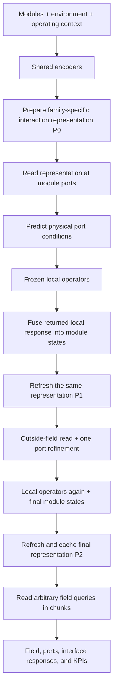
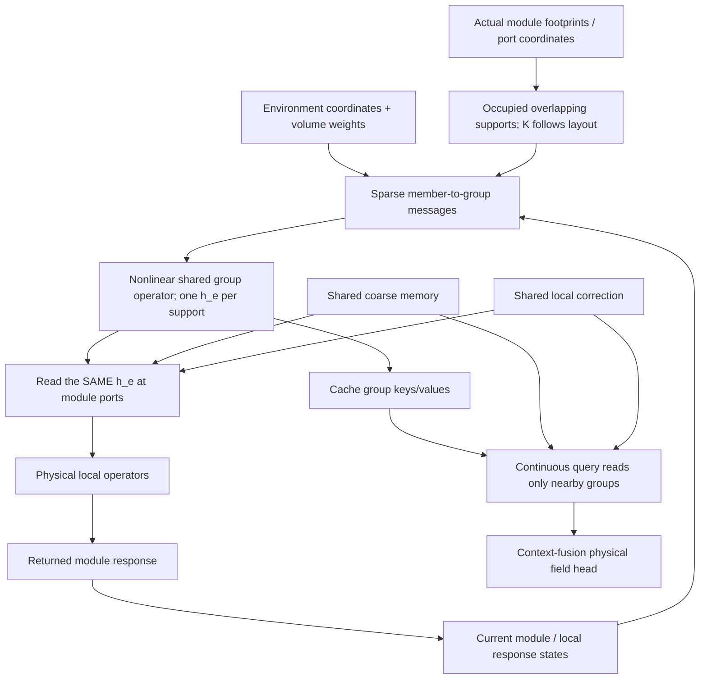

# HONF: Sparse Multi-Entity Interface Operators
## A three-stage research and Codex implementation plan

**Purpose.** Build two credible alternatives and one genuinely interface-centred HONF, then test whether shared sparse interaction groups improve physical accuracy, compositional behaviour, and execution cost. The deliverable is an empirical research comparison—not another mechanism-count estimator and not a production-release framework.

**Repository inspected:** `cosmos2w/ModularDT`, branch `agent/honf-core-next`, at `9239f5bec452d43a76d5e9b266c2f73909dcba63` on 2026-09-05. This is an observation, not a requirement to reset a newer branch or freeze its contents.

**Three primary models:**

1. `dense_pairwise_field`: a contextualized dense pairwise neural-integral field.
2. `geometry_latent_field`: a geometry-aware latent-attention field.
3. `sparse_interface_honf`: spatially supported, nonlinear multi-entity groups reused for module ports and continuous field reconstruction.

**Reference, not a candidate to overwrite:** Run 1401, with its historical checkpoint and efficient fused/gathered executor. Runs 1700 and 1701 remain negative research evidence; neither is resumed or silently reinterpreted.

**Automatic training budget:** two 500-epoch runs in Stage 1 and one 500-epoch run in Stage 2, sequentially on **GPU 0**. Stage 3 normally adds evaluation, not training. One optional support-matched control is specified, but requires an explicit request before launching. No automatic extension to 2.5K, 5K, or 10K. The user launches a long, decisive continuation after reading the comparison.

**Planning IDs, subject to the existing run store:** 1800 = dense baseline; 1801 = latent baseline; 1802 = new HONF. These are proposed labels, not reservations. Use the existing allocation mechanism; never overwrite an occupied run. Report any necessary substitution.

---

## Reading guide and evidence status

- The **common design** below defines inputs, shared coupling, scientific questions, and the implementation boundary.
- **Stage 1** specifies and implements the two baselines, including the common new coupling path.
- **Stage 2** implements the new HONF on that same path and runs one 500-epoch experiment.
- **Stage 3** measures accuracy, collective response, topology-dependent cost/influence, and prepares the user's long-run decision.
- The appendices contain exact command templates, a code/source map, literature, and three copy-ready Codex prompts.

The formulas for the new models are **proposed designs**, not claims that an existing paper or current code already implements them. Paper references identify the relevant architectural principles and the limits of the comparison. Repository observations are tagged `[C#]`; supplied experimental evidence is tagged `[E#]`; outside research is tagged `[R#]`. All references are collected at the end.

### What the evidence establishes—and what it does not

The accepted code computes dense module–environment attention, soft module/environment incidence, nonlinear edge pooling, and query–module pair responses. Its pair context can be contracted through `beta` without changing the mathematical function. The thermal wrapper already executes a frozen local operator and one local/global refinement. `[C1–C6]`

Run 1700 demonstrated variable counts but poor environment organization and substantially worse fluid-field accuracy. Run 1701's closeout reported catastrophic accuracy and K=1; the later user-supplied forensic report localized an enormous gradient excursion between epochs 7–8. These findings do **not** prove that one interaction group is physically sufficient. `[E1–E3]`

The frozen probe selector tested deletion from a co-adapted six-edge model. Failure of that deletion is not a proof that a different, spatially reorganized model requires six edges. Similarly, the old synthetic pair benchmark supplied concentrated random routing; it was a useful kernel benchmark, not evidence that learned physical routing becomes sparse at large module counts. `[C7, E3]`

**Consequent change of research question:**

> Can a sparse group state, constructed once from multiple physical entities, mediate both their interfaces and many field queries more effectively than dense pair interactions or global latent attention?

The question is no longer “Can we make a K histogram vary?”

---

## Research scope and engineering discipline

Use ordinary Git history, the existing run store, existing checkpoint loading, static typing where helpful, and ordinary tests. Do not add a new fingerprint registry, cryptographic digest, frozen baseline snapshot, attestation system, approval state machine, or release contract. Do not weaken existing trusted-checkpoint handling, dataset/resource checks, run-ID uniqueness, or resume validation. Existing metadata may continue to be written by the existing runtime; do not duplicate it.

A metric target in this plan is a **research interpretation aid**, not a blocking gate or an automated eligibility rule. A poor finite result must remain visible. Do not refuse to execute an authorized experiment because an untrained model has an unattractive rank, a timing estimate misses a target, or a heuristic says the architecture will fail. Run the code and measure it.

Standard shape errors, invalid geometry, unavailable required data, non-finite arithmetic, and exhausted memory are ordinary execution errors, not reasons to invent another governance mechanism. Preserve the user's work and report such failures directly. Irreversible deletion, rewriting history, external mutations, and production releases remain outside this task unless separately authorized.

The 500-epoch limits are **compute authorization boundaries**, not scientific performance gates. No adaptive continuation service, polling framework, or automatic experiment search is required.

---

# Common design: the physical problem and fair comparison

## A. Problem and notation

For a case with an unordered module set and a discretized environment, learn

\[
\widehat u(q)=\mathcal F_\theta(q;\mathcal M,\mathcal E,c).
\]

The module and environment sets are

\[
\mathcal M=\{(x_i,s_i)\}_{i=1}^{M},\qquad
\mathcal E=\{(y_j,r_j,\nu_j)\}_{j=1}^{E}.
\]

| Symbol | Meaning |
|---|---|
| \(B\) | Batch size; padded storage must not change the physical case. |
| \(M\), \(E\), \(Q\) | Active modules, environmental samples, and output queries. |
| \(d\), \(F\) | Spatial dimension and number of output channels. ThermalChannel uses 2 and 5. |
| \(x_i,s_i\) | Module centre and attributes, including type, size, material, and forcing where available. |
| \(y_j,r_j\) | Environmental coordinate and local geometry/boundary/material features. |
| \(\nu_j\) | Positive environmental quadrature/volume weight, not an attention score. |
| \(p_{ia},\eta_{ia}\) | Coordinate and quadrature weight of port \(a\) on module \(i\). |
| \(c,g\) | Raw and encoded global operating context. |
| \(m_i,e_j\in\mathbb R^H\) | Shared module and environment encodings. |
| \(z_i^{(t)}\in\mathbb R^H\) | Module state at local/global coupling pass \(t\); includes the current local response. |
| \(\mathcal L_i\) | Reusable local operator for module type \(i\), frozen in this round. |
| \(b_{ia}\) | Predicted physical port condition. In ThermalChannel: outside temperature and effective transfer coefficient. |
| \(\zeta\), \(\Phi(\cdot)\) | A receiver coordinate and its positional/relative-coordinate features. |
| \(G\) | Size of the small shared coarse memory; default 8. Not a physical edge count. |
| \(L\) | Main latent-attention baseline width in tokens; default 16. |
| \(\Delta\) | Fine spatial-support spacing, in physical length units. |
| \(\varphi_e\) | Compact geometric support kernel for group \(e\). |
| \(u_{ie}\), \(v_{je}\) | Geometric module–group and environment–group membership weights. |
| \(K(\mathcal M)\) | Number of instantiated local support groups for a layout. |
| \(h_e^{(t)}\) | Joint nonlinear state of group \(e\) at coupling pass \(t\). |
| \(n_e\), \(a_e\) | Geometric occupancy mass and a smooth occupancy envelope. |
| \(C_f(\zeta)\) | Main interaction context returned by family \(f\). |
| \(C_0(\zeta)\), \(C_n(\zeta)\) | Common coarse and strictly local correction contexts. |

In this document, “group”, “local support”, and “hyperedge” refer to the same new local interaction object. Its cardinality is the number of **distinct physical modules** and environmental samples participating in it. Do not count 64 ports of one module as 64 separate interacting bodies.

The new core mathematics must use generic dimension \(d\). Physical validation in this round remains ThermalChannel, \(d=2\). A tiny synthetic 3-D tensor example is useful for catching hard-coded `x/y` assumptions, but is not evidence of 3-D physical generalization.

## B. Shared encoded inputs

Use the existing feature definitions, Fourier feature utilities, normalizers, and hidden width wherever practical:

\[
m_i=E_M(s_i)+E_X(\Phi(x_i)),\qquad
 e_j=E_E([\Phi(y_j),r_j]),\qquad g=E_G(c).
\]

The three new families share this definition and the same networks' dimensions, but have independent trainable weights. Their environmental encoder does not hide an additional broadcast of the global token: global information enters explicitly through the coarse path and common heads. This differs from the legacy encoder's `e_j + g` operation; leave that legacy operation untouched. Consequently, this is a new matched family study, not an assertion that each new model differs from Run 1401 in only one line.

The adapter supplies real physical scales. `coordinate_scale` normalizes coordinates; it is not a neighbourhood radius or a mesh resolution. \(\Delta\) is separately specified. For the uniform current environmental grid use \(\nu_j=|\Omega|/E\). For an irregular case, require weights from the case adapter or explicitly label equal weights as an empirical point measure. Never infer cell volumes from arbitrary point ordering.

Do not use solved-field organizer targets, teacher ports, ground-truth interface values, or query targets as model inputs in autonomous forward evaluation. Preserve the existing predicted-port mode and the local parameter refresh from the **used predicted ports**, so interface statistics do not leak from targets. `[C3, C5]`

## C. Shared coarse communication and local correction

The sparse model must not silently assert that pressure, transport, or boundary influence is strictly local. Use one explicit coarse route in **all three new families**, so adding a global path is not an advantage awarded only to HONF.

### C.1 Coarse memory

Use \(G=8\) learned seed vectors. Obtain coarse states from separate typed module and environment cross-attentions, followed by one small self-attention/residual block:

\[
B^{(t)}=\operatorname{Block}\left(B_{seed}+
 \operatorname{Attn}_M(B_{seed},z^{(t)})+
 \operatorname{Attn}_E(B_{seed},e;\log\nu)\right).
\]

The environment attention adds \(\log\nu_j\) before normalization. Separate typed attentions prevent an increase in environmental sample count from automatically drowning the module set. Read the coarse field with a continuous receiver query:

\[
C_0^{(t)}(\zeta)=\operatorname{Attn}(Q_0(\Phi(\zeta),g),B^{(t)}).
\]

The equations display a single attention head; the implementation uses ordinary multi-head attention with the per-head scaling. Use standard pre-normalization and stable softmax.

This is an explicitly acknowledged low-rank global communication approximation. It cannot prove accuracy for arbitrarily complicated large-domain nonlocal physics. Its cost and reliance are measured separately. The main latent baseline below has additional main-path latents; report the **total** latent counts, not just its main-path count.

### C.2 Strictly local module correction

All three families receive the same local correction for high-gradient interface detail:

\[
C_n^{(t)}(\zeta)=
\frac{\sum_{i\in\mathcal N_n(\zeta)}k_n(\zeta,x_i)
 \psi_n(z_i^{(t)},\Phi(\zeta-x_i),s_i)}
 {1+\sum_{i\in\mathcal N_n(\zeta)}k_n(\zeta,x_i)}.
\]

Use a smooth compact kernel with support radius \(2.5\) times module radius in ThermalChannel; carry a characteristic module size generically. Evaluate \(\psi_n\) **after** finding neighbours. The denominator includes a fixed null contribution of 1, avoiding a tiny-mass divide and ensuring a disappearing neighbour's contribution vanishes continuously.

This is not a hidden dense query–module residual. No fall-back to all modules is allowed when a local neighbourhood is empty: return zero local context and use the coarse/main paths. Expose neighbour counts and local-context contributions in diagnostics. A local correction dominating the entire model is evidence against the group hypothesis, not a reason to relabel it as group computation.

### C.3 Shared field and port heads

Let

\[
C^{(t)}(\zeta)=C_f^{(t)}(\zeta)+C_0^{(t)}(\zeta)+C_n^{(t)}(\zeta).
\]

Use the same head architecture for each new family:

\[
\widehat u^{(t)}(q)=D_U\big(\Phi(q),\operatorname{LN}(C^{(t)}(q)),g\big),
\]

\[
b_{ia}^{(0)}=D_P\big(z_i^{(0)},\Phi(p_{ia}-x_i),
 C^{(0)}(p_{ia}),g,s_i\big).
\]

Port coordinates and normals come from layout geometry and case metadata, not from target temperature/flux values. The thermal port output remains `[theta, cos(theta), sin(theta), T_env, h]`, with the established positive parameterization for \(h\). The existing port head can accept a per-port interaction context in the new path; retain its old broadcast behaviour and parameter path for legacy runs.

Do not add separate group-specific field predictors. The new model retains latent **context fusion**, not a mandated sum of independently predicted physical edge fields.

## D. Identical physical coupling sequence for the three candidates

The current wrapper already has the essential physical loop. Preserve its frozen Stage-A operator, physical flux correction, local-response fusion, and one refinement. Replace only the source of interaction context and the associated preparation/read operations. `[C2, C3]`

1. Encode the raw case; set \(z_i^{(0)}=m_i\). Build backend preparation \(P^{(0)}\).
2. Read backend contexts at actual port coordinates and predict autonomous initial ports \(b^{(0)}\).
3. Run the frozen local operators with \(b^{(0)}\); form the existing latent/physical summaries and \(z^{(1)}\).
4. Refresh backend states to \(P^{(1)}\) with the new module states. Query outside temperatures at the established refinement points.
5. Use the existing port-refinement head, rerun the local operators once, and form \(z^{(2)}\).
6. Refresh backend states to \(P^{(2)}\). This is the cached final state for all global query chunks.

For HONF, **the same support groups** provide contexts in steps 2, 4, and 6. Their states change when modules return new local responses. Geometry and incidence-index lists are built once per layout and reused across these passes.

Frozen local-operator parameters do not imply `no_grad` around their training calls: gradients must still pass through local-operator inputs to the port predictor. During inference, normal inference/no-grad execution is appropriate.



There is no iterative latent-rank extraction, train/evaluation count discrepancy, or straight-through cardinality estimator in any new model.

## E. Fair-comparison rules

All three new models use the same raw features, channel order, normalizer policy, data/sampling, Stage-A checkpoint, coupling passes, physical losses, optimizer settings, field-query counts, and coarse/local paths. They differ in the **main interaction representation**. Run 1401 is an additional historical reference with its original architecture and heads.

Default hidden width is \(H=256\). Pair/member message MLPs use width 128 and two hidden nonlinear layers unless a reused module has an established compatible implementation. Attention uses four heads. Report actual trainable parameter counts and operation counts; do not enforce artificial parameter equality by adding unused layers. Before any training, one static sizing adjustment to an obviously oversized candidate is acceptable if documented and not selected using held-out errors. No width sweep is authorized.

The existing case config sets `val_split="test"`. That 90-case set has been repeatedly used for development. Call it the **existing development holdout**, not a pristine test of final generalization. Keep it for continuity, and obtain fresh physical perturbations/compositions for stronger claims. Do not silently resplit old checkpoints' data or compare normalizers fitted on different data. `[C5]`

---

# Stage 1 — Implement and train the two natural baselines

**Research question:** how much of the current result can be achieved by dense pairwise processing or geometry-aware latent attention, with the same physical-module coupling?

**Compute:** Run 1800 and Run 1801, 500 epochs each, sequentially on `cuda:0`. No long continuation. Complete both candidates even if one is initially more attractive, unless execution fails or the user changes the budget.

## 1.1 Baseline A: contextualized dense pairwise neural field

This is a purpose-built dense neural-integral/message-passing baseline inspired by Graph Kernel Networks/neural operators and permutation-invariant set processing. It is **not** claimed as an exact reproduction of a published model. `[R1, R2]`

A purely additive independent-source baseline would be too weak. Give this baseline contextualized sources and a nonlinear readout so it can represent collective effects.

### Preparation

Starting from \(z_i^{(t)}\) and \(e_j\), perform one simultaneous dense contextual update:

\[
a_i^M=\frac{1}{1+M}\sum_{\ell\ne i}
 \psi_{MM}(z_i^{(t)},z_\ell^{(t)},\Phi(x_i-x_\ell)),
\]

\[
a_i^E=\frac{\sum_j\nu_j\psi_{ME}(z_i^{(t)},e_j,\Phi(x_i-y_j))}
 {\sum_j\nu_j},
\]

\[
\widetilde z_i=z_i^{(t)}+
 \rho_M\big(z_i^{(t)},a_i^M,a_i^E,g\big),
\]

\[
\widetilde e_j=e_j+
 \rho_E\left(e_j,\frac{1}{1+M}\sum_i
 \psi_{EM}(e_j,z_i^{(t)},\Phi(y_j-x_i)),g\right).
\]

All updates use the pre-update states; do not introduce an order-dependent module loop. These sums retain signed latent content. Use a small number of typed kernels or a shared kernel with a sender/receiver type embedding; avoid a separate network for every module pair.

### Continuous read

For a receiver at \(\zeta\), compute a dense query–module response and a dense environmental read:

\[
C_{\mathrm{DP}}(\zeta)=
W_M^Q\frac{\sum_i\psi_{QM}(\widetilde z_i,\Phi(\zeta-x_i),g)}{1+M}
+
\sum_j a_j^E(\zeta)V_E\widetilde e_j,
\]

\[
a_j^E(\zeta)=\operatorname{softmax}_j\left(
 \frac{Q_E(\Phi(\zeta))^\top K_E(\widetilde e_j)}{\sqrt H}
 +b_E(\Phi(\zeta-y_j))+\log\nu_j\right).
\]

This uses attention as an efficient dense environmental integral read, but has **no small main-path latent bank or hyperedge decomposition**. Its defining expensive path remains explicit pairwise source processing and dense query–module evaluation. The shared coarse branch is disclosed separately.

Use `C_DP` for port reads as well as field reads. Do not keep a hidden Run-1401 organizer to produce this baseline's ports.

### Cost and implementation

Ignoring channel-width constants, preparation includes \(M^2+ME\); reading includes \(QM\) pair-kernel calls and \(QE\) attention scores. This is polynomial, not exponential.

Chunk pair evaluation over receivers/senders; sum before projecting when algebraically valid. Never materialize `[B,Q,M,E,H]`. Activation checkpointing or microbatching is allowed as ordinary memory management, with its real timing reported. Do not handicap the baseline with a needlessly giant broadcast or silently reduce its training points to make it fit.

If case microbatching is needed, keep the effective batch and optimizer-step count aligned across candidates. Accumulate each physical loss using its actual numerator/denominator, not an unweighted mean of microbatch means with different active-module counts.

## 1.2 Baseline B: geometry-aware latent-attention field

This is a Set-Transformer/Perceiver-IO-style adaptation to the modular field problem, with physics-operator context from UPT and Transolver. It is not an exact UPT or Transolver reproduction; do not borrow their published performance numbers as evidence for this implementation. `[R3–R6]`

### Latent bank

Use \(L=16\) learned main-path seed tokens, hidden width 256, four heads, and two latent self-attention blocks. Associate seeds with deterministic reference coordinates \(a_\ell\) covering the domain (a `4 x 4` normalized layout in the current 2-D case). These are geometric reference locations, **not** hard support boundaries.

Read modules and environment separately:

\[
H^0_\ell = s_\ell+
 \operatorname{Attn}_M(s_\ell,z^{(t)};
 b_M(\Phi(a_\ell-x_i)))
+
 \operatorname{Attn}_E(s_\ell,e;
 b_E(\Phi(a_\ell-y_j))+\log\nu_j).
\]

Apply two standard pre-normalized residual attention/MLP blocks over the \(L\) latents to obtain \(H_\ell\). All source tokens remain reachable; no compact-support mask is used in the main path.

### Readout

\[
C_{\mathrm{LA}}(\zeta)=
\operatorname{Attn}\left(Q(\Phi(\zeta),g),H;
 b_Q(\Phi(\zeta-a_\ell))\right).
\]

Use the same latent states to supply port contexts and field queries. This gives the attention baseline a fair reusable interface and collective computation; HONF does not get exclusive access to bidirectional physical coupling.

The main path costs approximately

\[
O((M+E)LH+L^2H+QLH),
\]

apart from projection/MLP costs. It is already a scalable baseline. The new HONF must not claim an asymptotic advantage over this baseline merely because it beats the dense model. Its potential advantage is local compositionality and explicit spatial support at useful accuracy/cost.

## 1.3 Small new code boundary, not another collection of organizer flags

These models change both preparation and readout. Do **not** implement them as fake `organizer_mode` values with invented `A_mh` arrays simply to satisfy old plots.

Add a top-level architecture choice within the forward core configuration:

```text
forward_architecture:
    legacy_honf                 # default for every existing profile/checkpoint
    dense_pairwise_field
    geometry_latent_field
    sparse_interface_honf      # implemented in Stage 2
```

Keep the existing `organizer_mode` and decoder settings owned by `legacy_honf`. New profiles use one small typed `interface_model` configuration block. Do not inject that block into archived resolved configurations when loading old runs.

Suggested focused package:

```text
src/honf_forward_core/interface_fields/
    types.py           # a few dataclasses: encoded case, layout, prepared state
    common.py          # shared encoders, coarse memory, local correction, heads
    dense_pairwise.py  # Baseline A
    latent_attention.py# Baseline B
    core.py            # small architecture factory and encode/prepare/read facade
    supports.py        # Stage 2: sparse geometric incidences
    group_operator.py  # Stage 2: joint group state and group read
```

This is a suggested ownership map, not a requirement to create empty files or a plugin framework. Prefer a smaller layout if it remains readable. The core never imports ThermalChannel.

The new family needs only three conceptual methods:

```python
encoded = core.encode_case(case_inputs)
prepared = core.prepare(encoded, module_states, layout_cache=None)
context_or_field = core.read(prepared, receiver_coordinates, receiver_features)
```

The actual types and signatures should fit the repository. Use ordinary dataclasses/protocols, not a new serialized contract system. `prepare` is a differentiable operation in training and a case-local cache in evaluation. It must not detach module responses or reuse stale states after a layout changes.

### ThermalChannel integration

Keep `ChannelThermalHONFModel` as the loader-facing facade. It selects the historical path by default. Add a focused new-family forward helper, preferably in `channelthermal/interface_field_coupling.py`, rather than filling the historical forward with many conditional branches.

Reuse `LocalSurrogateCoupling` for checkpoint attachment, port conversion, local response, flux correction, and response fusion. Extend `PortConditionHead.forward` to accept a new per-port context `[B,M,P,H]` while leaving the historical `[B,M,H]` broadcast path unchanged. The shared new-family helper implements the sequence in Common D for both baselines and HONF.

`PreparedChannelThermalCase` or a parallel small prepared-state type must dispatch `decode_prepared` correctly without depending on `hyper_state` for a non-hypergraph baseline. Existing checkpoint loaders continue to instantiate the public wrapper from saved configuration. Do not loosen strict state loading.

Old `_global_temperature_for_all_ports`, port consistency, and field-temperature denormalization must call the new-family reader in the new path, not the old decoder. Read the support helpers before modifying them. `[C2–C4]`

### Metrics and visualization

Retain physical output names so existing losses and accuracy evaluators work. Add `interaction_aux` for family-specific data. Baseline topology statistics must be absent/not applicable, not fabricated zeros, K=1 placeholders, or fake hypergraphs. Plot dense influence and latent attention under their correct labels.

Keep old organizer diagnostics for historical modes. The epoch loop already pads missing HONF metric names; change only the new-family reporting path to avoid presenting those defaults as measured baseline topology.

## 1.4 Profiles and training settings

Create exactly these two new profiles in Stage 1:

```text
src/config_core/forward/dense_pairwise_interface_context.json
src/config_core/forward/geometry_latent_interface_context.json
```

Both select the existing `ThermalChannel` case, `honf_forward` workflow family, the current dataset and frozen Stage-A model. Set `training.epochs=500` in the profile, not 5000. Keep the recommended legacy profile unchanged.

Shared defaults:

| Setting | Value |
|---|---:|
| Hidden width | 256 |
| Message MLP width | 128 |
| Attention heads | 4 |
| Coarse latent count / blocks | 8 / 1 |
| Local radius factor | 2.5 module radii |
| Position/query/relative Fourier frequencies | 4 |
| Environment grid | 24 x 8 |
| Dropout / AMP | 0 / false |
| Optimizer | AdamW, shared learning rate |
| Learning rate / weight decay | 3e-4 / 1e-5 |
| Gradient clipping | existing 1.0 convention |
| Effective case batch / sampled field points | 48 / 1024 |
| Seed | 0 |
| Port conditioning / physical refinement | predicted / one refinement |
| Losses | existing case losses; no new topology loss |
| Checkpoint milestones | 10, 50, 100, 250, 500, 1000, 2500, 5000 |

The early 10/50 checkpoints support diagnosis of optimization failures like Run 1701; they use existing checkpointing, not a new snapshot mechanism. Store only the normal milestones, best checkpoints, and latest checkpoint—no duplicate copies for each evaluator.

The eight coarse latents are present in all candidates. Baseline B also has 16 main latents; report `8 + 16`, not “16 total”.

## 1.5 Execution and Stage-1 outputs

Run actual new-family forwards/backwards as soon as they are implemented. Check ordinary finite outputs, coordinate gradients, and actual local-operator input gradients. Verify one case's field read is chunk-independent and that joint permutation of all module-indexed tensors preserves outputs. Run existing relevant tests once after integration; do not make a new combinatorial test matrix or freeze additional numerical fixtures.

During the first 20 epochs, record an occasional **pre-clip gradient norm**, by encoder/backend/head/local-coupling group, along with clipping scale and parameter update norm. Use safe FP64 accumulation for diagnostics; finite losses alone were insufficient in Run 1701. Continue sparse logging at normal reporting intervals after that. This is observation, not a gate that rejects models for large but finite gradients.

Train both baselines once to 500 epochs on GPU 0. An optional already-available low-cost Luna agent may summarize existing logs; do not install orchestration software or claim monitoring that did not occur.

At closeout, compare their 500-epoch histories and a common 20-case development subset with Run 1401 at 500 epochs. Select the 20 cases from physical descriptors, covering available module counts and spacing/clustering ranges; do not automatically repeat only the first twenty cases or select them by model error. Keep cases 0273 and 0653 as two qualitative anchors.

Output a brief Stage-1 report with implementations, exact commands, parameter counts, measured wall time/memory, physical error, and known limitations. No “baseline qualified/not qualified” approval process is needed. Stage 2 can proceed even when a baseline is strong—that is the purpose of the comparison.

---

# Stage 2 — Build the sparse multi-entity interface HONF

**Research question:** can one reusable group computation mediate physical-module interfaces and continuous queries while restricting expensive interactions to spatial supports?

**Compute:** one from-scratch Run 1802 through 500 epochs on GPU 0. No residual-rank variant, learned K head, straight-through count, threshold sweep, or automatic long continuation.

This stage changes the main preparation/read backend—not just an organizer's incidence visualization. It uses all common infrastructure and the physical coupling sequence already exercised by the baselines.

## 2.1 Layout-generated supports, not learned latent-rank truncation

Use an overlapping spatial cover indexed by a regular lattice in physical coordinates. Let

\[
r_e=x_{origin}+\Delta k_e,\qquad k_e\in\mathbb Z^d.
\]

The initial ThermalChannel choice is

\[
\Delta=4a_{ref},
\]

where \(a_{ref}\) is the module radius supplied by the case adapter. This is a starting spatial-resolution hypothesis, not a validated optimum. For another case, a physically meaningful characteristic length must be supplied. Do not substitute the query-grid spacing or the number of environment tokens for it.

Use a tensor-product cubic B-spline support:

\[
\varphi_e(x)=\prod_{\ell=1}^{d}
 B_3\left(\frac{x_\ell-r_{e\ell}}{\Delta}\right),
\]

where, for \(t=|s|\),

\[
B_3(s)=
\begin{cases}
(4-6t^2+3t^3)/6,&0\le t<1,\\
(2-t)^3/6,&1\le t<2,\\
0,&t\ge2.
\end{cases}
\]

At a generic point there are at most \(4^d\) nonzero lattice supports. The full lattice forms a partition of unity; the retained local subset need not. Retain a coarse path for regions without local groups rather than forcing a local partition everywhere.

For module \(i\), average support overlap over its fixed physical port sampling:

\[
u_{ie}=\frac{\sum_a\eta_{ia}\varphi_e(p_{ia})}{\sum_a\eta_{ia}}.
\]

Name this geometric quantity `module_support_weight` in code; it is distinct from the physical output field \(u(q)\).

Instantiate

\[
\mathcal H(\mathcal M)=\{e:\ n_e=\sum_i u_{ie}>0\},
\qquad
K(\mathcal M)=|\mathcal H(\mathcal M)|.
\]

For environment samples, use

\[
v_{je}=\nu_j\varphi_e(y_j),\qquad e\in\mathcal H(\mathcal M).
\]

Thus two layouts with the same module count can have different numbers of supports because their occupied neighbourhoods overlap differently. A crowded layout can have **fewer groups but higher group degree**. Do not demand that K increase with physical difficulty: K here measures spatial cover size, not intrinsic physical rank.

There is no `Linear(H,K)` parameter and no trainable step-specific edge identity. One group operator is shared across all support centres. There remains a support-resolution parameter \(\Delta\), as in any mesh/region method; describe it honestly.

### Sparse construction

Enumerate nearby lattice keys for module port coordinates, coalesce duplicate keys and module–key contributions, and retain the unique occupied supports. Use integer lattice keys and ordinary tensor scatter/reduce/search operations. Geometry keys are not cryptographic hashes or persistent identities.

Join environmental points and queries to nearby lattice keys, then filter against the active group table. Preserve the complete lattice cover at a physical boundary (including a support centre just outside the domain when it overlaps valid samples); the adapter supplies the actual clipped-domain quadrature weights. Do not renormalize the entire lattice differently for each output query chunk. Do not compute a dense all-pairs distance matrix and call the result sparse after masking. For large benchmarks the neighbourhood construction itself must scale with local candidate incidences. A tiny dense reference implementation may be used in a test only.

Port quadrature samples define a physical footprint, not extra neural entities. Coalesce their contributions to one membership weight per `(module, group)` before running a message MLP. The environment grid can be denser without increasing the support count for the same layout and \(\Delta\).

## 2.2 Smooth appearance and disappearance of supports

Dropping a group merely because its last module membership becomes zero can otherwise cause a discontinuity: a normalized group could retain a finite value immediately before deletion. Avoid that with a geometric occupancy envelope:

\[
a_e=1-\exp(-4^d n_e).
\]

Compute the envelope as `-expm1(-4**d * n_e)` to preserve small occupancies numerically. The factor \(4^d\) compensates for the approximate number of overlapping support functions; it is fixed by the chosen support family, not a learned count temperature. The envelope approaches zero smoothly when the last member leaves. It is not a residual-explained-energy score or a mechanism importance label.

Keep group-state construction bounded as membership vanishes, and multiply local read weights by \(a_e\). Do not normalize away this envelope when only one local group remains. The fixed null contribution in the reader below preserves the limit.

Use geometric supports unchanged in training and evaluation. Differentiation through their smooth weights is meaningful away from discrete layout/type/count changes; new support keys enter with zero envelope. This does not make module insertion/deletion differentiable or establish accurate physical design gradients—those require separate tests in Stage 3.

## 2.3 Learned incidences within the admissible geometric support

Geometry defines where a group **may** exchange messages. Learn relative membership strength inside that support:

\[
A^M_{ie}=u_{ie}\,\sigma(f_M(z_i^{(t)},\Phi((x_i-r_e)/\Delta))),
\]

\[
A^E_{je}=v_{je}\,\sigma(f_E(e_j,\Phi((y_j-r_e)/\Delta))).
\]

The scalar score functions are small shared MLPs, not per-edge parameters. Zero biases give neutral initial content weighting. These weights need not sum to one across all groups. Store geometric and learned weights separately so a reader can distinguish the imposed spatial prior from learned participation.

Learned membership calculations return bounded scalar weights but signed vector messages; they are ordinary attention-like weights, not physical correlation measurements. The occupancy \(n_e\) is computed from **geometric** membership, not from the learned scores. Thus the model cannot manufacture K=1 by collapsing a learned tensor. It can still learn to underuse the local group branch; that possibility is measured, not forbidden by a regularizer.

## 2.4 One nonlinear multi-entity computation per group

Precompute source transforms once where possible. For every retained incidence, form relative, signed messages:

\[
\mu_{ie}=\phi_M(z_i^{(t)},s_i,\Phi((x_i-r_e)/\Delta)),
\]

\[
\epsilon_{je}=\phi_E(e_j,r_j,\Phi((y_j-r_e)/\Delta)).
\]

Pool modules and environment **as different types**:

\[
m_e^{(t)}=\frac{\sum_i A^M_{ie}\mu_{ie}}{1+n_e},
\]

\[
e_e=\frac{1}{\Delta^d}\sum_j A^E_{je}\epsilon_{je}.
\]

The fixed reference volume \(\Delta^d\) avoids dividing by a vanishing environmental mass. Supply the actual covered-volume ratio

\[
V_e=\frac{1}{\Delta^d}\sum_jv_{je}
\]

and occupancy separately. For boundary groups, \(V_e\) records the smaller covered region rather than silently changing its scale.

Define the shared group state:

\[
\boxed{
h_e^{(t)}=\rho_\theta\big(m_e^{(t)},e_e,
 \log(1+n_e),V_e,\Phi(r_e),g\big).
}
\]

Use a two-hidden-layer residual MLP with hidden/output width 256. This state is calculated once per group and coupling pass, **after** pooling multiple members. Messages and states are signed; no squared nonnegative interaction tensor, algebraic deflation, or latent reconstruction loss exists.

The nonlinear post-pooling function allows mixed dependence on multiple module states. It does not mathematically guarantee superior many-body modelling over a nonlinear pairwise network. That is why the physical perturbation comparison is included.

## 2.5 Group-to-port and group-to-query reads use the same states

For a receiver \(\zeta\), query only active supports with \(\varphi_e(\zeta)>0\). Let

\[
\ell_e(\zeta)=
\frac{Q_f(\Phi(\zeta),g)^\top K_f(h_e^{(t)})}{\sqrt H}
+b_f(\Phi((\zeta-r_e)/\Delta)).
\]

Use a local normalized read with a fixed null entry:

\[
w_e(\zeta)=a_e\varphi_e(\zeta)\exp(\ell_e(\zeta)),
\]

\[
\boxed{
C_{\mathrm{HG}}^{(t)}(\zeta)=
\frac{\sum_{e\in\mathcal N(\zeta)}w_e(\zeta)V_fh_e^{(t)}}
 {1+\sum_{e\in\mathcal N(\zeta)}w_e(\zeta)}.
}
\]

Compute exponentials stably by subtracting `max(0, max_local_logit)` from both the local terms and the null term. Multiply geometric/occupancy weights explicitly; do not put a `log(clamp(tiny_weight))` into a fragile surrogate backward path. The denominator remains protected by the null term in the equivalent unshifted expression.

For a port, \(\zeta=p_{ia}\); for a field query, \(\zeta=q\). The **same** \(h_e^{(t)}\), keys, values, and geometric supports are used. The physical heads are different because a Robin port and a fluid field have different meanings; the interaction representation is shared.

Precompute `K_f(h_e)` and `V_f(h_e)` during preparation. Each query evaluates a small receiver projection, local logits, and weighted sums. Do not run the four-layer Run-1401 pair MLP across all modules underneath this reader.

The complete new HONF field remains

\[
\widehat u(q)=D_U\big(\Phi(q),
 \operatorname{LN}(C_{\mathrm{HG}}(q)+C_0(q)+C_n(q)),g\big).
\]

**This is the decisive computational change:** group response is calculated once and reused; global query computation does not redo every module interaction.

## 2.6 Reusing topology through physical feedback

The existing local/global workflow gives three group preparations, not a new recurrent solver:

\[
(z^{(0)},e)\to h^{(0)}\to b^{(0)}\to\mathcal L_i
\to z^{(1)}\to h^{(1)}\to\text{one refinement}
\to z^{(2)}\to h^{(2)}\to\widehat u(q).
\]

Cache lattice keys, module memberships, environment memberships, environmental encodings/pools, and port/query-neighbour lookup where coordinates are unchanged. Recompute learned module messages and group states when local responses change. Do not reuse a stale `h^(0)` after the local surrogate has returned a new response.

The coarse memory refreshes from the current module states at the same passes. This explicitly carries long-range feedback. Its use must be measured: a model whose coarse path does all the work has not demonstrated useful sparse group coupling.



## 2.7 Complexity: precise, conditional claims

Let \(L_M\), \(L_E\) be retained module–group and environment–group incidences; let \(r_q\le4^d\) be the number of fine supports at a query; and let \(n_q\) be the number of local-correction modules.

The main group path has approximate interaction cost

\[
O(L_M C_{msg}+L_E C_{msg}+K C_{group})
+
O(Qr_qH).
\]

Add the common coarse cost

\[
O((M+E)GH+G^2H+QGH)
\]

and local correction cost

\[
O\left(\sum_q n_q C_{near}\right).
\]

These are interaction counts; report projection/MLP width constants and actual runtime. For bounded physical density, module size/support scale, and fixed \(G\), this avoids dense \(ME\) or \(QM\) main-path growth. A highly crowded support can still have many members, and a fixed coarse bottleneck may become inaccurate on a much larger domain. Neither issue disappears by calling the model a hypergraph.

For the existing 3–12-module problem, HONF may be slower than Run 1401 or the latent baseline. Do not promise a speedup there. Its intended advantage must be demonstrated in large-layout execution **and** physical compositional tests.

## 2.8 Why this is not simply a mesh replacement with a hypergraph label

The proposed lattice supplies an admissible overlapping spatial cover. It is not a learned physical partition, and its boundaries must be labelled as a prior in figures.

The research contribution being tested is the combination of:

- typed multi-module/environment incidence inside those supports;
- nonlinear joint group state;
- that same state driving physical module ports;
- returned local response updating the group;
- continuous queries reusing the updated response;
- sparse execution following exactly those incidences.

GINO, RIGNO, and multilevel graph neural operators already use regional/latent representations; geometric grouping alone is not novel. `[R7–R9]` The paper-level claim must centre on reusable modular **interface coupling** and measured compositional/compute benefits, not on declaring a sampled spatial mesh a hypergraph.

## 2.9 Code tasks

Implement `supports.py` and `group_operator.py`, and register `sparse_interface_honf` in the new-family factory. Do not route it through `case_adaptive_residual` or `case_adaptive_tensor_residual`.

A sparse prepared state should contain ordinary case-local tensors such as:

```text
lattice_keys [K,d]
centres [K,d]
module_group_indices [2,L_M]
module_geometric_weights [L_M]
environment_group_indices [2,L_E]
environment_geometric_weights [L_E]
occupancy [K]
environment_pool [K,H]
group_state / group_keys / group_values [K,H]
coarse_state [G,H]
module_state [M,H] and local-neighbour index
```

Batching can flatten cases with offsets and a batch-index vector. It must not pad every case to a global maximum K or manufacture a dense `[B,M,E,K,H]` tensor. Source transforms and membership MLPs run on retained incidences. Queries use sparse lookup, not a dense query-by-K mask followed by zeroing.

The common interface-family helper from Stage 1 should already be able to run this backend. Verify that the new port contexts, provisional outside-temperature query, final prepared read, and normalizer application all use it. The legacy wrapper remains available with its original path.

Add:

```text
src/config_core/forward/sparse_interface_honf_context.json
```

Use the Stage-1 shared settings. The additional scientific choice is `support_spacing_factor=4.0`, resolved from the case characteristic module radius. Use the fixed cubic support family and the occupancy envelope above. Do not expose a dozen support temperatures, cutoffs, learned count rules, or fallback selectors.

## 2.10 Actual checks and training

Implement one small dense-reference calculation of the new sparse sums **only in tests**, and compare it with the sparse implementation at the same weights. This tests arithmetic and gradients; it is not a new baseline snapshot. Also execute:

- a module permutation with all module/port tensors permuted together;
- extra inactive storage slots;
- environmental token duplication with divided volume weights;
- query chunking;
- a port/centre displacement across one support boundary, including a directional finite-difference check;
- a local-operator call with nonzero gradients back to the new port read.

For the boundary test, test a location away from other nondifferentiable physical operations first. Report the result rather than assuming compact support guarantees the whole pipeline is smooth.

Profile a real training step and a prepared inference call. Check that the main group read never calls the legacy dense pair kernel and that local correction only processes its actual neighbours. Use ordinary profiler/instrumentation, not a new enforcement framework.

Launch Run 1802 from scratch for 500 epochs on GPU 0. Keep the same data, objective, and optimizer as Stage 1. No warm-start from Run 1401, no distillation, no residual-count loss, and no forced geometry clusters beyond the explicitly defined support prior.

At closeout report the common 20-case physical comparison, early optimization statistics, port/interface errors, K/degree distributions, coarse/fine/local context contributions, and actual operation counts. Show cases 0273 and 0653. An attractive K plot does not compensate for field error or a coarse-path bypass.

Stage 2 ends with the candidate checkpoint and empirical results. It does not automatically launch another model if the result is disappointing, and it does not automatically extend a good result.

---

# Stage 3 — Evaluate the architectural claims and choose the decisive continuation

**Research questions:**

1. Are the new field and physical-interface predictions competitive?
2. Do groups improve collective response and reuse, rather than merely provide a sparse visualization?
3. Does topology govern actual cost and conditional influence?
4. Which existing 500-epoch run, if any, deserves a user-launched long continuation?

**Default compute:** evaluation only on GPU 0; no new neural training. Reuse the three 500-epoch runs and existing Run-1401 checkpoints. A bounded external-solver evaluation is described below. Do not rerun the failed residual organizers.

## 3.1 One comparison matrix and one report

Primary matched-budget comparison:

| Entry | Main representation | Epoch budget |
|---|---|---:|
| Run 1401 @500 | Original six-edge HONF | 500 |
| Run 1800 @500 | Dense contextualized pairwise field | 500 |
| Run 1801 @500 | Geometry-aware latent-attention field | 500 |
| Run 1802 @500 | Sparse multi-entity interface HONF | 500 |

Run 1401 best-field @4585 is a **mature reference**, not an equal-budget competitor to a 500-epoch candidate. Include its already available results with that label. Do not select checkpoints by whichever one makes a narrative look best.

Use the epoch-500 checkpoints for the common full-development-holdout comparison. Show `best_by_field<=500` versus endpoint on the 20-case subset only when it helps explain instability or a late deterioration; do not automatically repeat the full evaluation for every saved milestone.

Produce one evolving report:

```text
HONF_Interface_Study_Report.md
```

Stage-1 and Stage-2 notes may be short handoffs linked from this report. No duplicated field arrays or copied checkpoints in the synthesis directory.

## 3.2 Accuracy and physical interfaces

Evaluate the 90-case development holdout once per primary checkpoint. Reuse already generated predictions where the checkpoint, normalization, query set, and metric definitions agree.

Report:

- pooled fluid-field normalized MSE using raw SSE/value counts;
- equal-case mean, median, p95, and worst case;
- per-channel `u`, `v`, `p`, `omega`, `temperature` errors;
- near-interface and far-field fluid errors using the existing definitions;
- physical-space relative L2, with clear scaling;
- port `T_env` and `h` errors, interface surface temperature/flux, and internal temperature;
- pressure difference at fixed inlet/outlet probe sets, mean outlet temperature, and one stable module-temperature KPI;
- grouped errors by active module count, spacing, wall proximity, and heating heterogeneity.

Keep the existing definition of near-interface fluid (surface distance 0–0.25) and far-field fluid (distance at least 1.0) for ThermalChannel continuity. Whole-domain aggregate error includes regions served by the local surrogate and should not replace the fluid-field discriminator. `[E1, E2]`

The group architecture must not receive credit solely for a lower combined loss if field error is worse. Show the loss components and raw physical metrics separately.

Advisory research interpretation: a candidate within roughly 10–20% of the best matched-budget physical errors, with an evident useful cost/composition tradeoff, deserves consideration for continuation. A large gap is a reason to diagnose, not to install a software “failure gate”. No claimed superiority is based on one seed or on a favourable region alone.

## 3.3 Collective interactions: physical reference, not a latent-rank proxy

A nonconstant K or a high matrix rank is not a measurement of collective physical response. Measure response to coordinated perturbations of multiple modules.

Let \(d_0\) be a valid base design and \(J(d)\) a scalar physical functional or a field restricted to a fixed common fluid region. Let \(\delta_i\) perturb module \(i\), preferably a position/displacement chosen within the valid geometry range.

For two modules:

\[
I_{ij}=J(d_0+\delta_i+\delta_j)-J(d_0+\delta_i)
-J(d_0+\delta_j)+J(d_0).
\]

For three modules:

\[
I_{ijk}=\sum_{S\subseteq\{i,j,k\}}(-1)^{3-|S|}
J\left(d_0+\sum_{s\in S}\delta_s\right).
\]

Compare \(\widehat I\) with the reference \(I\), not just each model's self-generated interaction pattern. Both baselines are nonlinear and may capture these interactions; a higher-order network label is not an expressivity proof.

### Small bounded reference set

Use two pair-perturbation families (one separated, one interacting/crowded) and one triple-perturbation family. Their four/four/eight corner designs require at most **16 reference solves**, fewer when base designs are shared. Reuse trustworthy existing solved cases when they exactly match; never relabel a neighbour from the dataset as an exact perturbation solve.

Start with positional displacements around `0.1 * module_radius`, checking actual nonintersection and boundaries. This is a proposed perturbation scale, not a validated universal choice. Keep operating conditions fixed. Do not use heat-power perturbations as the only higher-order test: in an effectively linear thermal regime a vanishing high-order thermal interaction may be correct physics.

For field comparisons use a common mask that is fluid in **every** perturbed geometry. For interface comparisons use the same module/port parameterization so a moving boundary is compared consistently. For pressure-drop or outlet-temperature functionals use fixed physical probe locations/quadrature and a consistent pressure gauge.

### Solver availability and time

Inspect the local maintained or preserved solver before invoking it. The online portable tree and the materials reviewed here do not establish a ready-to-run physical solver entry point. Do not invent one or replace CFD with a neural prediction.

If an existing trusted solver is available, run a base case first, measure actual runtime/convergence, and execute the planned small batch within **16 solves and about two hours of additional solver wall time**. This is a resource limit, not a physics-performance gate. Preserve all existing solver convergence checks; do not loosen tolerances to finish. Avoid competing with GPU-0 training.

If the solver is unavailable or the budget is exhausted, export the remaining physical case requests and the corresponding model predictions, mark reference verification pending, and finish the rest of Stage 3. No conclusion about validated higher-order physics can then be made.

A predicted/reference interaction smaller than the solver's numerical uncertainty is reported as unresolved. A “large relative error” with a nearly zero reference is not useful. Use absolute error normalized by a training-set physical scale, plus relative error only above the reference noise level. One or two repeated/refined solves may replace planned corner solves within the same budget to estimate noise.

## 3.4 Topology must govern both computation and influence

### Execution measurements

Instrument actual calls and retained tensor rows, not visual weights or estimated FLOPs alone:

- number of distinct local groups and group states actually evaluated;
- number of unique module members per group, separately from ports;
- retained module/environment incidences;
- group reads per field query and per port;
- actual local-correction pair evaluations;
- coarse-memory attention sizes;
- number of physical coupling preparations and reuse of geometry/environment pools.

Demonstrate that new-HONF main-path query cost depends on the local support count, not on all modules. Include layout construction in preparation timing. A dense distance matrix or dense MLP followed by masking is not sparse execution.

### Conditional influence test

For a single prepared group update, hold the coarse/global context fixed and perturb one encoded module state. At receiver locations not connected to that module through any active group or local-correction neighbourhood, the **fine-path** response should be zero up to ordinary arithmetic tolerance. Test a few inside- and outside-support receiver locations using autograd and finite differences.

For the full local/global sequence, consider all message paths through the repeated module/group updates; indirect multi-hop dependence is expected. With the coarse route active, long-range responses are also expected. Do not demand zero full-physics influence outside a local support.

### Functional interventions, not causal proof by heatmap

On four representative cases, make at most three evaluation-only interventions:

1. remove the main group context from port prediction while leaving field reads active;
2. remove the main group field read while retaining group-driven ports;
3. clamp the coarse context during a local perturbation.

Recompute downstream local responses when a port intervention changes them. Report the resulting port, interface, and field changes. These are reliance diagnostics in a trained model, not unbiased estimates of the benefit of training without the branch.

Also compare measured module-to-KPI sensitivities with integrated learned incidence/read weights. Correlation can support an interpretation, but the weights are not derivatives and must not be labelled physical influence without that qualification.

### One optional support-matched control

The two natural baselines test the broad design alternatives. To claim that **nonlinear shared groups**, rather than locality alone, are responsible for a gain, a stronger control may be necessary.

Specify a `sparse_pairwise_control` that uses the **same** support keys, member neighbourhoods, coarse/local paths, and physical heads, but replaces a cached nonlinear group state with direct receiver–source messages on the union of those neighbourhoods. Pool only after computing each receiver–source message; there is no reusable nonlinear group-response state. Deduplicate sources shared by overlapping groups and retain the geometric kernel weighting. This is a sparse pairwise graph/kernel control, not a fourth headline architecture.

Do not silently add this training to the budget. Prepare its concise specification and command only if the main results make attribution important. Launch one 500-epoch Run 1803 only when the user explicitly authorizes it. Without it, use narrower wording such as “advantage of the sparse interface architecture”, not “proved advantage uniquely due to hyperedges over any sparse graph method”.

## 3.5 Gradient quality for future inverse design

Differentiability must be checked at two levels.

**Numerical derivative of the learned model:** on four valid layouts and a few coordinate directions, compare autograd with central finite differences of the **same model**, using two step sizes. Include a smooth interior point and a support-transition case. Rebuild case preparation for the displaced inputs; do not use a stale cached topology. Use fixed physical KPI probes to avoid differentiating through a changing evaluation mask.

**Physical derivative quality:** where the solver batch provides suitable perturbations, compare predicted directional changes with reference changes. Report sign, magnitude error, and noise sensitivity. Agreement with the model's own finite differences proves implementation correctness, not physical sensitivity accuracy.

Module number and type remain discrete decisions for future inverse design. This forward study does not claim to differentiate their creation/deletion or to produce a complete self-assembly algorithm.

## 3.6 Compositional and resolution behaviour

From the existing 90 cases, report physical-stratum results; do not call them out-of-distribution merely because they are hard. The model has already trained on the 600-case distribution.

For fresh reference solves, include layouts with new spatial combinations—separation versus clustering and wall proximity—without leaving the solver's valid parameter regime. These give a small fresh compositional check, not a large OOD benchmark.

For environmental representation, perform one quadrature-consistency test: duplicate/subdivide samples while preserving their total volumes, and compare predicted fields. Exact duplicate splitting should agree when the same features are used; genuinely finer features are a resolution study and need not be identical. Compare all candidates, including the latent baseline's volume-weighted attention.

Formal large-module-count extrapolation and 3-D physics remain later work. If this round only has synthetic large layouts, state that distinction in every scaling figure.

## 3.7 Timing, memory, and scaling with realistic supports

Use GPU 0 with synchronized measurements. On cases 0273 and 0653, report separate medians and a spread measure for:

1. case encoding and neighbourhood construction;
2. all backend preparations plus frozen-local-operator/refinement work;
3. prepared query decoding;
4. full forward;
5. a training step including backward/optimizer;
6. peak/incremental allocated and reserved memory.

Use about 5 warmups and 20 measured repetitions for small real cases. Avoid repeatedly benchmarking every historical checkpoint. Reverse checkpoint order once if results are close enough for allocator/warm-cache effects to matter.

Keep equal query chunks and effective training batches where feasible. Record activation checkpointing, microbatching, or family-specific streaming, and include their overhead. Dense baselines must use competent implementations. A memory error at a large shape is an observed result, not a reason to claim speed relative to a nonexistent timing.

### Bounded synthetic scaling

Use **five distinct shapes**, not a full Cartesian sweep:

- `(M,E,Q) = (8,192,8192)`;
- `(32,768,8192)`;
- `(32,768,65536)`;
- `(32,768,262144)`;
- `(128,3072,262144)`.

Generate valid, nonoverlapping layouts with increasing physical domain area at roughly constant module density and environmental sampling density. Keep physical module size and support spacing meaningful. Include the real support builder and neural preparation. Use a few warmups and approximately five repetitions at the large shapes.

Do not handcraft sparse attention matrices or feed ideal one-hot assignments. Random initialized or trained source features on a synthetic layout are acceptable for **execution** measurements, but no physical-accuracy claim follows from them.

Where inexpensive, verify all-at-once versus chunked evaluation on a small shape. For large shapes report total elapsed decoding over **all** queries, not only the last chunk or a single repeated tile.

The latent baseline may remain faster than HONF because a fixed latent bank has excellent GPU utilization. Report that result honestly. An HONF advantage in compositional fidelity or interface reuse can still be interesting, but must be measured rather than assumed.

## 3.8 Visualization requirements

Produce a compact, matched set for cases 0273, 0653, and one error-relevant larger-module case chosen after the numerical summary:

- ground truth, prediction, and signed error for important field channels;
- predicted versus true physical port/interface quantities;
- dense baseline: module/environment read weights or perturbation influence, labelled correctly;
- latent baseline: latent spatial read maps, not “hyperedge ownership”;
- HONF: actual support footprints, geometric memberships, learned memberships, and unique-module counts;
- HONF: group-to-port and group-to-query routes using the same group IDs;
- local, fine-group, and coarse-context norms and intervention effects;
- query cost or neighbourhood count map;
- available reference-versus-predicted collective-response plots.

Do not use only dominant-edge-sorted matrices: such sorting creates apparent blocks. Show physical-coordinate maps and the geometric support prior alongside learned weights. Do not claim the lattice boundaries were discovered from data.

Dense diagnostic matrices may be materialized for these few figures. Ordinary training/inference must retain sparse arrays. Show all physically relevant groups; when K is large, use a spatial map or paginate rather than silently choosing the six prettiest groups.

## 3.9 Report and user-launched long-run decision

The report should answer the following in order:

1. What code was actually implemented and what differs among the three candidates?
2. What was executed, for how many epochs/updates, with what observed cost?
3. Which architecture best predicts the field and physical interfaces at matched budget?
4. Does the new group path materially participate in ports and field prediction?
5. Does its topology control actual computation and conditional influence?
6. What collective-response and gradient evidence has physical reference support?
7. What is still missing for a stronger novelty/generalization claim?
8. Which single existing candidate, if any, should the user extend first?

End with commands to resume the selected run to a user-chosen budget, normally 2500 or 5000, **without executing them**.

A long HONF continuation compared only with 500-epoch baselines is not a fair final superiority result. It can be the next decisive development run, but a publication-level accuracy claim will eventually require comparable-budget training of the strongest new baseline, or an explicitly cost-budgeted comparison. Do not promise that one long run settles every scientific question.

A reasonable result can be “the latent baseline wins”, “HONF is comparable and composes better”, “HONF is useful only at large layouts”, or “the group branch contributes little”. There is no required positive conclusion.

---

# Implementation map, configuration, and execution notes

## I. Existing files to inspect and extend

| Existing location | Responsibility and intended change |
|---|---|
| `src/honf_forward_core/model.py` | Keep legacy encoding/organizer/decoder state registration intact; expose a small factory for the new family without moving old parameters. |
| `src/honf_forward_core/config.py` | Add architecture selection and a small typed new-family block; preserve legacy defaults and validation. |
| `src/config_core/forward/` and its schema/registry | Add the three profiles and relevant schema entries; leave the recommendation unchanged. |
| `Case_ThermalChannel/src/channelthermal/model.py` | Keep public wrapper and legacy path; delegate new-family execution to a focused helper. |
| `.../local_coupling.py` | Reuse local operator, normalization, flux correction, fusion, and one refinement. Add per-port context support without changing the historical branch. |
| `.../model_support.py` | Dispatch provisional/port field reads and prepared reads; do not assume every family has hyperedge arrays. |
| `.../config.py`, `.../plugin.py` | Recognize the new core configuration through existing composition and loader paths; no new runtime framework. |
| `.../training/epoch.py` | Reuse losses; report architecture-neutral physical metrics and occasional numerical optimization diagnostics. |
| `.../evaluation/loading.py`, `.../evaluation/prepared.py` | Load the saved architecture and use its prepared state. Preserve trusted-loading and normalizer behaviour. |
| `.../evaluation/results.py`, `.../evaluation_tools/` | Family-labelled diagnostics and plotting; keep standard error masks. |
| `tools/diagnostics/evaluate_stage5_accuracy.py` | Reuse for physical accuracy where possible rather than clone it. |
| `tools/diagnostics/benchmark_stage5_checkpoints.py` | Extend with new backend phases and real-support scaling; distinguish historical synthetic test from this study. |
| `tools/diagnostics/` | At most one new study orchestrator for interventions/reference-response aggregation if existing tools do not cover it. |
| `tests/` and case tests | Focused executable tests for new operations and existing backward compatibility. |

New file names are suggestions. Prefer clear responsibility over adhering mechanically to the names. Do not rename established files, delete failed experiments, move checkpoints, or perform a repository-wide cleanup in these stages.

The existing parameter names for legacy models must remain loadable. New families have their own state dictionaries; there is no requirement to force them into the historical 237-key inventory. Existing tests provide compatibility evidence; do not create a new contract-freeze subsystem.

## II. Suggested new configuration shape

Example for the new HONF, to be composed through the existing loader:

```json
{
  "model": {
    "core_honf": {
      "forward_architecture": "sparse_interface_honf",
      "hidden_dim": 256,
      "dropout": 0.0,
      "use_layer_norm": true,
      "coordinate_scale": [12.0, 6.0],
      "position_fourier_frequencies": 4,
      "query_fourier_frequencies": 4,
      "interface_model": {
        "message_hidden_dim": 128,
        "attention_heads": 4,
        "coarse_latents": 8,
        "coarse_layers": 1,
        "local_radius_factor": 2.5,
        "support_spacing_factor": 4.0
      }
    }
  },
  "training": {
    "epochs": 500,
    "seed": 0,
    "learning_rate": 0.0003,
    "weight_decay": 0.00001,
    "amp": false,
    "gradient_clip_norm": 1.0
  },
  "checkpointing": {
    "save_epoch_milestones": [10, 50, 100, 250, 500, 1000, 2500, 5000]
  }
}
```

This is a **partial explanatory example**, not a complete ready-to-launch profile. Codex must create the complete profiles using the existing required top-level case/workflow/run fields.

The latent baseline replaces `support_spacing_factor` with `latent_count=16` and `latent_layers=2`. The dense baseline needs neither field. Fields not applicable to a family should be omitted rather than carry misleading legacy K values. Keep compute chunk sizes in existing runtime/training/evaluation settings where possible, not as purported scientific model capacity.

The new-family config can support generic `spatial_dim` inferred from coordinate scale, while the current case remains 2-D. Existing `UnifiedForwardConfig` currently validates two coordinates: retain that rule for legacy models and make any new-family extension explicit. Do not advertise the old ThermalChannel plugin as a working 3-D case.

## III. Standard launch commands

Use the existing project environment; the commands below assume the local `ModularDT` environment previously used by the user. Correct the environment/path only if local inspection shows it differs. Do not install a second environment or guess GPU remapping.

Run from `HONF_Proj/`. If `CUDA_VISIBLE_DEVICES` remaps devices, report the physical device that `cuda:0` resolves to; do not accidentally use another occupied GPU.

```bash
# Stage 1 — baseline A
conda run --no-capture-output -n ModularDT python train.py \
  --config project://src/config_core/forward/dense_pairwise_interface_context.json \
  --workflow forward --device cuda:0 --epochs 500 \
  --run-id 1800 --run-name interface_dense_pairwise --yes

# Stage 1 — baseline B, after the first process exits
conda run --no-capture-output -n ModularDT python train.py \
  --config project://src/config_core/forward/geometry_latent_interface_context.json \
  --workflow forward --device cuda:0 --epochs 500 \
  --run-id 1801 --run-name interface_geometry_latent --yes

# Stage 2 — new HONF
conda run --no-capture-output -n ModularDT python train.py \
  --config project://src/config_core/forward/sparse_interface_honf_context.json \
  --workflow forward --device cuda:0 --epochs 500 \
  --run-id 1802 --run-name sparse_interface_honf --yes
```

These filenames are to be created in the indicated stages; the CLI flag spellings are supported by the inspected `train.py`. A normal `--dry-run` can reveal composition errors but must not substitute for a real batch execution or empirical timing. Existing run-store collision checks remain authoritative.

For the user's later continuation, print the resolved run path in a command of this form:

```bash
conda run --no-capture-output -n ModularDT python train.py \
  --config project://src/config_core/forward/sparse_interface_honf_context.json \
  --workflow forward --device cuda:0 --epochs 5000 \
  --resume-checkpoint /actual/Run_1802_directory/latest_model.pt --yes
```

Do not execute the continuation. Do not alter the architecture/configuration of a running or completed run under the same ID. Existing managed resume checks already protect that boundary.

## IV. Output hygiene and practical handoff

Use the existing managed run folders and evaluation categories. One coherent study folder, for example

```text
HONF_Proj/diagnostics/generated/interface_operator_study/<job>/
    metrics/
    figures/
    interventions/
    reference_requests/   # only when physical solves/requests are needed
    report.md
```

may contain reduced comparison tables and links to each run's evaluation outputs. Use the existing artifact helpers where they fit. Do not create parallel copies of all predictions, multiple result trees per plotting attempt, or one directory for every tiny diagnostic flag.

`diagnostics/`, `UpgradePlan/`, and checkpoints are intentionally local-only on this branch. Keep the supplied plan there locally if convenient; do not force-add it against the branch's ignore policy. Reusable model/API documentation may go in tracked `docs/`. Use ordinary commits for source/config/test changes. Push the current development branch as requested; do not create/retarget a PR or rewrite the old Stage-7 branch.

At each handoff list: files changed, what actually ran, actual run directories/epochs, principal measurements, unresolved issues, and the next stage command/prompt. Do not claim local physical artifacts were checked merely because an online README references them.

---

# References and source map

## Current repository sources

All code observations below were checked at `9239f5bec452d43a76d5e9b266c2f73909dcba63`. These links identify the inspected implementation, not a new frozen execution contract.

- **[C1] Core encoding/preparation:** `HONF_Proj/src/honf_forward_core/model.py`. `encode_and_organize` and `decode_queries` already separate case preparation and continuous queries. [Source](https://github.com/cosmos2w/ModularDT/blob/9239f5bec452d43a76d5e9b266c2f73909dcba63/HONF_Proj/src/honf_forward_core/model.py).
- **[C2] Physical wrapper:** `Case_ThermalChannel/src/channelthermal/model.py`. Owns base/provisional/final preparation, local coupling, and prepared decoding. [Source](https://github.com/cosmos2w/ModularDT/blob/9239f5bec452d43a76d5e9b266c2f73909dcba63/HONF_Proj/Case_ThermalChannel/src/channelthermal/model.py).
- **[C3] Physical ports and local operators:** `Case_ThermalChannel/src/channelthermal/local_coupling.py`. Current port head accepts a module/environment context; Stage-A input/normalization and physical refinement are case-specific. [Source](https://github.com/cosmos2w/ModularDT/blob/9239f5bec452d43a76d5e9b266c2f73909dcba63/HONF_Proj/Case_ThermalChannel/src/channelthermal/local_coupling.py).
- **[C4] Coupling helper and diagnostics:** `Case_ThermalChannel/src/channelthermal/model_support.py`. Contains legacy organizer exports and temperature/port query helpers. [Source](https://github.com/cosmos2w/ModularDT/blob/9239f5bec452d43a76d5e9b266c2f73909dcba63/HONF_Proj/Case_ThermalChannel/src/channelthermal/model_support.py).
- **[C5] Data/loss/case configuration:** `Case_ThermalChannel/configs/case_default.json`; `Dataset/PHYSICS_AND_DATA.md`; `training/epoch.py`. These define the 600/90 data split, test-as-validation convention, Stage-A use, physical losses and optimizer-step execution. [Config](https://github.com/cosmos2w/ModularDT/blob/9239f5bec452d43a76d5e9b266c2f73909dcba63/HONF_Proj/Case_ThermalChannel/configs/case_default.json) · [Data description](https://github.com/cosmos2w/ModularDT/blob/9239f5bec452d43a76d5e9b266c2f73909dcba63/HONF_Proj/Case_ThermalChannel/Dataset/PHYSICS_AND_DATA.md).
- **[C6] Reuse boundaries and CLI:** `docs/case_plugin.md`, `channelthermal/plugin.py`, `train.py`. Preserve the existing trusted resource/checkpoint loading and managed run/resume paths. [Case boundary](https://github.com/cosmos2w/ModularDT/blob/9239f5bec452d43a76d5e9b266c2f73909dcba63/HONF_Proj/docs/case_plugin.md) · [Training CLI](https://github.com/cosmos2w/ModularDT/blob/9239f5bec452d43a76d5e9b266c2f73909dcba63/HONF_Proj/train.py).
- **[C7] Existing selector and benchmark:** `selection/predictive_rank.py`; `tools/diagnostics/benchmark_stage5_checkpoints.py`. The selector changes final query-edge support, while the old synthetic test supplies random routing rather than a trained physical organizer. [Selector](https://github.com/cosmos2w/ModularDT/blob/9239f5bec452d43a76d5e9b266c2f73909dcba63/HONF_Proj/src/honf_forward_core/selection/predictive_rank.py) · [Benchmark](https://github.com/cosmos2w/ModularDT/blob/9239f5bec452d43a76d5e9b266c2f73909dcba63/HONF_Proj/tools/diagnostics/benchmark_stage5_checkpoints.py).

## Supplied experimental evidence

- **[E1]** `Run_1700_vs_Run_1401_5K_Comparative_Evaluation.md`: user-supplied completed comparative report. It supports the dynamic-count/poor-accuracy distinction and identifies environment organization and preparation cost as limitations.
- **[E2]** `Run_1701_Phase2_500_Evaluation.md`: user-supplied completed closeout. It supports the catastrophic K=1/accuracy outcome and the distinction between software checks and research validity.
- **[E3]** User-supplied Phase-2 restart report, quoted in the conversation: reports the epoch-7/8 numerical pathology and failure of all tested frozen-bank subsets. Its local forensic artifacts are not in the online tracked tree and are not independently re-executed in preparing this plan.
- **[E4]** `Stage7_K_Scaling_Audit_Evaluation.md` and prior Stage-7 summaries supplied by the user: evidence that separately trained K=4 can be competitive in bulk accuracy, without showing that it is a removable subset of K=6.

## Primary research references and their precise roles

**[R1]** Li et al. *Neural Operator: Graph Kernel Network for Partial Differential Equations*. 2020, arXiv:2003.03485. [Paper](https://arxiv.org/abs/2003.03485). Supports learned kernel/message-passing operator construction. Baseline A adapts this principle; it is not a claimed reproduction.

**[R2]** Zaheer et al. *Deep Sets*. NeurIPS 2017. [Paper](https://arxiv.org/abs/1703.06114). Supports permutation-invariant nonlinear pooling. It does not establish that higher-order effects are exclusive to hypergraphs.

**[R3]** Lee et al. *Set Transformer: A Framework for Attention-based Permutation-Invariant Neural Networks*. ICML 2019, PMLR 97:3744–3753. [Paper](https://proceedings.mlr.press/v97/lee19d.html). Supports inducing/latent attention over variable-sized sets.

**[R4]** Jaegle et al. *Perceiver IO: A General Architecture for Structured Inputs & Outputs*. ICLR 2022. [Paper](https://arxiv.org/abs/2107.14795). Supports latent input encoding and flexible output queries. The geometry-biased physical port reader here is our adaptation.

**[R5]** Alkin et al. *Universal Physics Transformers: A Framework For Efficiently Scaling Neural Operators*. NeurIPS 2024. [Paper](https://proceedings.neurips.cc/paper_files/paper/2024/hash/2cd36d327f33d47b372d4711edd08de0-Abstract-Conference.html). Relevant physics-specific latent-space precedent. The baseline does not reproduce its rollout/inverse-encoding training objectives.

**[R6]** Wu et al. *Transolver: A Fast Transformer Solver for PDEs on General Geometries*. ICML 2024. [Paper](https://proceedings.mlr.press/v235/wu24r.html). Establishes that learned physical-state grouping is already an attention-based operator idea; it is a comparison/positioning reference, not a third mandatory baseline run.

**[R7]** Li et al. *Geometry-Informed Neural Operator for Large-Scale 3D PDEs*. NeurIPS 2023. [Paper](https://proceedings.neurips.cc/paper_files/paper/2023/hash/70518ea42831f02afc3a2828993935ad-Abstract-Conference.html). Supports spatial hashing, irregular-to-latent geometry transfer, and the need to distinguish numerical scaling from physical accuracy.

**[R8]** Mousavi et al. *RIGNO: A Graph-based framework for robust and accurate operator learning for PDEs on arbitrary domains*. 2025, arXiv:2501.19205. [Paper](https://arxiv.org/abs/2501.19205). Regional-mesh operator precedent; region-based processing alone is not a new hypergraph claim. No venue claim beyond the verified preprint record is required here.

**[R9]** Li et al. *Multipole Graph Neural Operator for Parametric Partial Differential Equations*. NeurIPS 2020. [Paper](https://arxiv.org/abs/2006.09535). Supports separating local interactions from compressed long-range communication. The eight-token coarse path here is only a first, bounded-capacity approximation, not that multilevel method.

**[R10]** Chien et al. *You are AllSet: A Multiset Function Framework for Hypergraph Neural Networks*. ICLR 2022. [Paper](https://arxiv.org/abs/2106.13264). Supports nonlinear node-to-hyperedge and hyperedge-to-node multiset processing; attention inside a hypergraph is compatible with, not contrary to, the hypergraph interpretation.

**[R11]** Dong, Sawin, and Bengio. *HNHN: Hypergraph Networks with Hyperedge Neurons*. ICML 2020 Graph Representation Learning and Beyond Workshop. [Primary publication page](https://www.microsoft.com/en-us/research/publication/hnhn-hypergraph-networks-with-hyperedge-neurons/). Supports treating hyperedges as nonlinear computational states rather than only visualization labels.

These references support design ingredients. They do not prove the proposed HONF will outperform the baselines, have faithful physical mechanisms, or generalize to the future 3-D datasets.