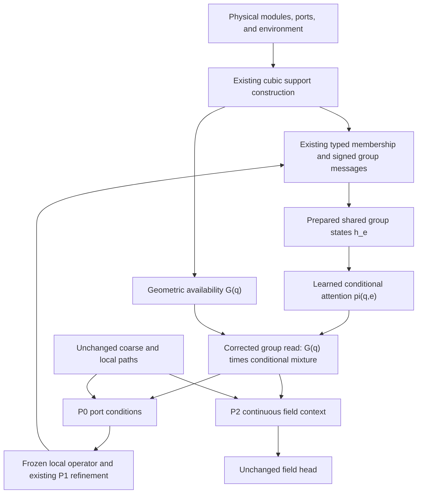

# HONF: Recovering Productive Group-Mediated Communication
## Next-step research and Codex implementation plan

**Central question:** Can a stable group reader make the existing sparse multi-entity representation carry useful information to both physical module interfaces and continuous field queries, rather than allowing the predictor to become an independent coarse/local neural field?

**Immediate experiment:** One reader-only scientific change, one from-scratch run to **500 epochs on physical GPU 0**, and a focused evaluation of accuracy, functional use, gradients, and cost. Do not resume the collapsed Run 1802.

**Longer-term direction:** If the corrected reader exposes useful group states but the independent coarse route remains the dominant alternative, consider routing module-dependent coarse communication through the group representation. This is a subsequent architecture question, not an automatic second experiment in this task.

**Dense reference:** Retain Run 1804 at epoch 500 for the matched comparison. Its continuation to 2500 is not necessary to test the reader hypothesis and is deferred by default. A continuation command is provided as a later research option, not an automatic action.

**Repository inspected:** `cosmos2w/ModularDT`, branch `agent/honf-core-next`, at `116cb22e41b862af911a74942f63056a66b741b4`, following `c412769d303ffdba16b51db7c92683e8c5c5c809`. This records the source used for this plan; it is not a frozen-head requirement. Use the current branch and preserve any newer legitimate work.

---

## 1. Evidence, hypotheses, and scope

### 1.1 What the completed study actually supports

The basis is `docs/reports/HONF_Interface_Study_Report.md`, supplemented by the Stage-2 closeout and the source files listed in Section 13. The report was also supplied as `HONF interface-operator study.md`.

| Observation | Recorded result | Interpretation for this round |
|---|---:|---|
| Matched pooled normalized fluid relative L2, legacy / dense / latent / sparse | 0.11715 / 0.09874 / 0.14533 / 0.17600 | Dense is the strongest existing 500-epoch field predictor. |
| Sparse occupied group count across 90 cases | Mean 44.97, range 28–58 | Layout-dependent support construction works; K is not the failed component to optimize. |
| Sparse field group-context norm fraction | Mean `4.37e-26` | The trained group read is numerically negligible. |
| Sparse port group-context norm fraction | Mean `1.47e-24` | The intended physical-interface route is also negligible. |
| Sparse query coarse / local fractions | 0.8851 / 0.1149 | Other paths carry the prediction. These are magnitude proxies, not causal attribution. |
| Intervention effects from suppressing group paths | Almost no output change | Supports the diagnosis of group-path non-use. Precise intervention scope needs the small correction below. |
| Sparse support degree | At most 16 groups per 2-D receiver | Neural incidence execution is genuinely sparse. |
| Warm full-forward time, case 0273, legacy / dense / latent / sparse | 25.46 / 152.96 / 128.18 / 234.47 ms | These are implementation measurements, not abstract complexity bounds. |
| Mature Run 1401 pooled relative L2 | 0.03210 at epoch 4585 | Separate maturity reference; not an equal-budget competitor to 500-epoch candidates. |
| Physical collective-response requests | 16 pending | Higher-order physical accuracy and physical derivative quality are not yet verified. |

The Stage-2 closeout additionally reports non-negligible learned module/environment memberships, but a final-query nonnull group-read mass of approximately `7.01e-26`. Thus the evidence specifically points to **group-to-receiver routing shutdown**. It does not prove that every stored group state is intrinsically uninformative.

### 1.2 Code-derived interpretation to test

The current sparse reader combines relative attention and whole-branch availability in one null-normalized expression. A common negative shift of all real-group logits can suppress the complete group branch without changing the ranking of groups. The common coarse processor independently reads raw module and environment states, so it can compensate while the group branch receives diminishing gradients.

The algebra is established in Section 3. Its role in the actual learning trajectory remains a hypothesis until the stored-checkpoint audit and the new training experiment are measured. Do not describe it as the uniquely proven cause.

### 1.3 A small correction to intervention attribution

In the inspected `run_stage3_interface_study.py`, `port_main_zero` wraps `_read_port_context`, which is the initial P0 port-context call. In contrast, `field_main_zero` wraps **every** `core.decode_queries` call. That includes the provisional outside-temperature decode that feeds P1 refinement, not only the final P2 field read.

The existing results still support broad group non-use. They do not cleanly separate an isolated final-field effect from a refinement-feedback effect. Preserve the historical results and names, explain this scope in a note, and add phase-explicit interventions for this round. Do not silently relabel old numbers.

### 1.4 One primary model experiment

Keep unchanged the support cover, membership networks, signed group messages, group-state processor, coarse branch, local correction, field head, input encoders, dataset, frozen local operator, physical losses, optimizer, and physical refinement sequence.

Change only **the normalization of the group reader** in the new profile. Small diagnostic and inference-execution changes are allowed, but must be identified separately from scientific architecture changes.

Do not add a count head, residual decomposition, minimum K, membership supervision, diversity/entropy penalty, minimum branch-usage penalty, forced field decomposition, new decoder, or additional neural branch.

---

## 2. Research operating rules and authorized work

Use Git history, ordinary configuration, the existing run store, normal Python/PyTorch interfaces, and ordinary tests. No new cryptographic hashes, checkpoint digests, baseline snapshots, contract-freeze layer, approval framework, or scientific pass/fail gate is proposed.

Preserve the existing trusted checkpoint/resource loading, run-ID handling, saved normalization, resume checks, and security measures. Do not weaken an existing check just because a new profile needs integration. Conversely, do not build additional defensive infrastructure around this experiment.

A numerical observation such as a large error ratio or small branch fraction is a **research result**, not an automatic permission check. Report it and finish the authorized comparison. Actual NaN/Inf, corrupt state, or an unusable execution is an ordinary runtime failure to diagnose, not a reason to replace computation with assertions or fictitious results.

Existing protection around overwriting an occupied run, destructive changes, or unauthorized cross-system actions still applies. Do not force-push, delete referenced local results, change a running process's model, or create a production release.

### Compute envelope

| Work | Default allowance |
|---|---|
| Stored Run-1802 audit | Epochs 10, 50, 500 on four existing anchors and four training cases; one small training batch for gradient diagnostics per checkpoint |
| Unit/integration execution | Focused existing tests plus a few tests of the new formula; ordinary suite once at closeout |
| New training | Exactly one fresh sparse-reader candidate, at most 500 epochs, on GPU 0 |
| Extra short managed trials | None by default; a few real optimizer steps belong to the smoke, not a separate run |
| Accuracy evaluation | One full 90-case endpoint evaluation for the new candidate; reuse existing endpoint tables for the other models |
| Detailed interventions/gradients | Four established anchors; no full 90-case intervention sweep |
| Timing | Two anchors and the largest already defined synthetic shape; no broad tuning sweep |
| Dense continuation | Deferred; no automatic Run-1804 resume in the primary task |
| New physical solves | No new solver implementation; ingest existing requested references if they become available |

Proposed new run label: **1805, `sparse_interface_geometry_read`**. This is not a reservation. Use the existing allocator, never overwrite an occupied run, and report a necessary ID substitution.

---

## 3. Reader correction: mathematics and meaning

### 3.1 Symbols

For one case, omit the batch index for readability.

| Symbol | Meaning |
|---|---|
| \(q\in\mathbb R^d\) | A receiver coordinate: a physical port, an outside-temperature probe, or a field query |
| \(e\) | An occupied support/group index |
| \(r_e\in\mathbb R^d\) | Group support centre |
| \(\Delta\) | Existing support spacing; unchanged in this experiment |
| \(B_e(q)\ge0\) | Tensor-product cubic B-spline support weight |
| \(n_e\ge0\) | Existing geometric occupancy from module-port footprints |
| \(a_e=1-\exp(-4^d n_e)\) | Existing occupancy envelope, in \([0,1]\) |
| \(g_{qe}=a_e B_e(q)\) | Geometric receiver-to-group weight |
| \(G_q=\sum_e g_{qe}\) | Total geometric availability of group support at receiver q |
| \(h_e\in\mathbb R^H\) | Prepared group state |
| \(k_e,v_e\in\mathbb R^H\) | Existing key and value projections of the normalized group state |
| \(\ell_{qe}\in\mathbb R\) | Existing learned query–group compatibility logit |
| \(\pi_{qe}\) | Conditional attention among geometrically available groups |
| \(w_{qe}\) | Final effective group-read weight |
| \(c_G(q)\in\mathbb R^H\) | Group context supplied to the unchanged coarse/local fusion |

Current logits remain unchanged:

\[
\ell_{qe}
=
\frac{Q_\theta(q,g)^\top k_e}{\sqrt H}
+b_\theta\!\left((q-r_e)/\Delta\right).
\]

Here \(g\) inside \(Q_\theta\) is the encoded global case token; it is distinct from the scalar geometric weights \(g_{qe}\).

### 3.2 Historical reader to retain

The current implementation is algebraically

\[
Z_q=\sum_e g_{qe}\exp(\ell_{qe}),
\]

\[
c_G^{\mathrm{old}}(q)
=
\frac{\sum_e g_{qe}\exp(\ell_{qe})v_e}{1+Z_q}.
\]

Equivalently,

\[
c_G^{\mathrm{old}}(q)
=
\frac{Z_q}{1+Z_q}
\sum_e\frac{g_{qe}\exp(\ell_{qe})}{Z_q}v_e.
\]

A common logit shift \(\ell_{qe}\mapsto\ell_{qe}-A\) leaves the conditional group mixture unchanged but replaces \(Z_q\) with \(e^{-A}Z_q\). The whole branch can therefore approach zero through a change that says nothing about which groups are relevant.

Keep this formula under the historical default reader mode for Run 1802 and any other existing sparse checkpoint.

### 3.3 Proposed geometry-envelope conditional reader

For receivers with at least one positive geometric weight, define

\[
\pi_{qe}
=
\frac{g_{qe}\exp(\ell_{qe})}
{\sum_j g_{qj}\exp(\ell_{qj})},
\qquad g_{qe}>0.
\]

Then

\[
\boxed{
 w_{qe}=G_q\pi_{qe},
 \qquad
 c_G^{\mathrm{new}}(q)=\sum_e w_{qe}v_e.
}
\]

For \(G_q=0\), define all group weights and the group context to be exactly zero. This is an ordinary unsupported receiver, not a failure that requires fabricated neighbours.

No learned null entry is present in the new reader. No learned scalar branch gain is added.

### 3.4 Properties and their limits

**Common-offset invariance.** For any finite receiver-wise constant \(A_q\),

\[
c_G^{\mathrm{new}}(q;\ell+A_q)=c_G^{\mathrm{new}}(q;\ell).
\]

**Geometric availability is preserved.**

\[
\sum_e w_{qe}=G_q.
\]

The full cubic lattice is a partition of unity, and active supports are a subset with \(0\le a_e\le1\). Thus \(0\le G_q\le1\) in exact arithmetic. Small floating-point excesses should be treated as numerical observations, not hidden by changing the formula.

**Equal logits give ordinary interpolation.**

\[
\ell_{qe}=\ell_q\ \forall e
\quad\Longrightarrow\quad
c_G^{\mathrm{new}}(q)=\sum_e g_{qe}v_e.
\]

**Disappearing support remains continuous.** With bounded group values,

\[
\|c_G^{\mathrm{new}}(q)\|
\le G_q\max_e\|v_e\|.
\]

Hence the group context vanishes when total support vanishes. With finite logits, a single entering/leaving cubic-support contribution also tends to zero with its geometric weight. Do not turn this into a claim of smoothness across every possible discrete physical change; verify the actual support transition and coordinate gradients.

**Logit gradients retain relative routing semantics.** Let \(\bar v_q=\sum_e\pi_{qe}v_e\). Then

\[
\frac{\partial c_G^{\mathrm{new}}}{\partial\ell_{qe}}
=G_q\pi_{qe}(v_e-\bar v_q).
\]

The common logit-offset direction has zero derivative by design. A shared final scalar bias can consequently have zero gradient; this is not a broken model. Do not demand nonzero gradients for every individual parameter.

**This does not guarantee useful groups.** Group values may still collapse, attention may select unhelpful groups, or the field head may ignore the resulting context. A larger norm or an enforced identity \(\sum w=G\) is not success. Ground-truth accuracy and functional interventions remain decisive.

### 3.5 Numerical implementation

Use a conventional differentiable segmented weighted softmax on the **actual retained positive-weight incidences**. For example, normalize \(\ell_{qe}+\log g_{qe}\) with a per-receiver maximum/log-sum-exp over supported rows. Skip truly empty rows and return zero there.

Do not include zero as a pseudo-logit when calculating the conditional normalizer; that would reintroduce the null anchor. Do not apply `exp` to unshifted logits. Do not add a positive floor to absent incidences, or normalize tiny geometric availability back to a unit-amplitude context. Do not add custom gradients, a straight-through estimator, or a learned temperature.

Keep coordinate derivatives through cubic weights, occupancy, and the supported read. The existing discrete support enumeration stays unchanged. Small scalar-reduction precision adjustments may be used only when an executed numerical example demonstrates they are needed; do not change the entire training precision policy speculatively.

Exercise the formula on normal, tiny-weight, single-group, empty, mixed-batch, and boundary-transition examples. Inspect both values and backward behaviour. A forward-only finite test would repeat a lesson from the earlier experiments.

### 3.6 Unchanged data flow



The coarse bypass deliberately remains in this immediate experiment. Its continued presence makes this a controlled reader test rather than a forced-use architecture.

---

## 4. Work block A — A bounded stored-checkpoint diagnosis

**Purpose:** Distinguish reader shutdown from bad group values, insufficient geometric coverage, or a holdout-specific failure. This work informs interpretation; it is not a numerical threshold that must be passed before real training.

### 4.1 Samples and checkpoints

Use existing Run-1802 checkpoints at epochs **10, 50, and 500**, where available. Do not regenerate missing checkpoints or re-run old training.

Use held-out anchors **0273, 0653, 0298, and 0302**, plus four deterministically selected training cases covering available module counts. Record the training IDs once in the resulting table; no new split or frozen dataset snapshot is needed.

For each checkpoint, use one fixed small training batch for the canonical loss and a backward pass without an optimizer update. There is no need for a large audit over all training cases.

### 4.2 Measurements

At P0 port reads, P1 refinement probes, and P2 field queries, record:

- actual receiver degree and unsupported-receiver fraction;
- geometric availability \(G_q\), including supported-only statistics;
- old \(\log Z_q\) and nonnull mass \(Z_q/(1+Z_q)\);
- mean and within-receiver spread of learned logits;
- dot-product and learned-bias contributions to logits separately;
- key/query norms and group-value norms;
- norm of the conditional mixture before whole-branch attenuation;
- main/coarse/local context norms and their existing magnitude fractions.

Summaries should separate training from holdout and supported from unsupported receivers. A mean over empty far-field receivers is not enough to diagnose the reader.

Split parameter-gradient/update reporting into:

1. group membership/message/state/value preparation;
2. group receiver query/bias/key processing;
3. coarse path;
4. local path;
5. encoders and physical/field heads.

Preserve the old aggregate `backend` metric for old reports, but do not continue using it as evidence that the group operator is learning. It includes coarse and local parameters in the current code.

### 4.3 Minimal diagnostic replay

On one anchor and one stored checkpoint, evaluate the same prepared groups under the old and proposed readers and under a common logit shift. This is a numerical/mechanistic replay, not a trained corrected-model accuracy result.

A frozen reader substitution may make error much worse because the decoder was trained while ignoring those states. Do not use that distribution shift to reject the new from-scratch test, or present a transient improvement as a trained-model result.

Write one reduced diagnosis table and a brief interpretation. Reuse the existing study tool and output tree; do not create a new audit framework.

---

## 5. Work block B — Implement one reader mode and run one experiment

### 5.1 Code ownership

| File or component | Required change |
|---|---|
| `src/honf_forward_core/interface_fields/group_operator.py` | Add a small normalization branch/helper for the new reader. Retain historical null arithmetic. Reuse all learned group parameters. |
| `src/honf_forward_core/interface_fields/core.py` | Pass the reader setting to the sparse backend; propagate optional diagnostic requests rather than always materializing detailed maps. |
| `src/honf_forward_core/config.py`, existing profile schema | Add one sparse reader enum with historical default. Use normal configuration validation. |
| `src/config_core/forward/sparse_interface_geometry_read_context.json` | Add one complete candidate profile based on the Run-1802 settings. |
| `Case_ThermalChannel/src/channelthermal/interface_field_coupling.py` | Preserve P0/P1/P2 physical computation. Distinguish diagnostic read roles so interventions target the intended calls. |
| `Case_ThermalChannel/src/channelthermal/training/epoch.py` | Separate group/coarse/local diagnostic groups; record small observational summaries at existing sampling cadence. |
| `tools/diagnostics/run_stage3_interface_study.py` | Extend existing tasks for reader diagnosis and phase-explicit, ground-truth-scored interventions. |
| `tools/profile_stage2_sparse_inference.py` | Reuse for the small measured-cost comparison. Distinguish training/evaluation chunking and diagnostics settings. |
| Existing sparse support, interface model, and study tests | Extend only the tests relevant to the reader and diagnostic scope. |

Do not create `group_operator_v2.py`, a second physical wrapper, a replacement training entry point, or another architecture family for this change.

### 5.2 Configuration and compatibility

Add under `model.core_honf.interface_model`:

```json
"group_read_mode": "null_softmax"
```

for the historical default. The new profile sets:

```json
"group_read_mode": "geometry_envelope_attention"
```

Use the same `forward_architecture="sparse_interface_honf"` for both. No trainable parameters are added or renamed. Old configs lacking the field must reconstruct `null_softmax`; old parameter names remain unchanged. Do not rewrite old saved profiles or manifests.

Keep `sparse_interface_honf_context.json`, the dense/latent profiles, and `stage7_structured_context` as they are. Register the new profile as an experimental reader test, not as a recommended model or release.

The candidate's only scientific config difference from Run 1802 is `group_read_mode`. Run identity, epoch budget, checkpoint cadence, and observational diagnostic settings may differ and must be reported separately.

### 5.3 Ordinary executed tests

A focused suite should exercise:

- old-mode forward output and ordinary backward compatibility on existing fixtures;
- weighted conditional attention against a tiny dense reference, including gradients;
- invariance to a common finite logit shift, including a shift near `-60`;
- \(\sum_e w_{qe}=G_q\), not a unit-mass fiction;
- zero context for unsupported receivers and the expected single-group limit;
- continuity and finite coordinate gradients as support enters/leaves;
- joint module/port permutation, padding, and query-chunk independence;
- cached environment work reused correctly while group states refresh;
- phase-explicit intervention hooks affecting only their intended read roles.

Run an actual representative training batch with the real frozen Stage-A model and backpropagate the canonical physical losses. A few disposable optimizer steps are enough. Inspect group-specific gradients and parameter updates, not only total finite loss.

Do not add an exhaustive combinatorial test matrix or repeat the whole suite after every small edit. Reuse the ordinary full suite once near closeout. Do not weaken existing trusted loading or compatibility tests.

### 5.4 Exact training choices

| Setting | Choice |
|---|---|
| Architecture | `sparse_interface_honf` |
| Reader | `geometry_envelope_attention` |
| Initialization | From scratch; no Run-1802 warm start |
| Proposed run ID / name | `1805` / `sparse_interface_geometry_read` |
| Device | Physical GPU 0 |
| Epoch endpoint | 500 |
| Seed | 0, matching the study |
| Hidden / message widths | 256 / 128 |
| Support spacing factor | 4.0, unchanged |
| Coarse latents / blocks | 8 / 1, unchanged |
| Local radius factor | 2.5, unchanged |
| Environment token grid | 24 by 8, unchanged |
| Training receiver chunk size | 128, unchanged |
| Optimizer / learning rate | Existing AdamW policy / `3e-4` |
| Weight decay / gradient clipping | `1e-5` / 1.0, unchanged |
| AMP / dropout | false / 0.0, unchanged |
| Physical coupling | Predicted ports, frozen Stage A, one refinement; unchanged |
| Dataset and normalization | Existing 600-train / 90-development split and saved conventions |
| Losses and existing schedules | Inherit unchanged, including any already active loss schedule; add none |
| Checkpoint milestones | 10, 50, 100, 250, 500, 1000, 2500, 5000 |

The later milestones are for an eventual user-authorized continuation, not authorization to exceed 500 in this task.

### 5.5 Launch surface

The profile below does not exist until Codex implements it. Use the existing command parser and environment, correcting machine-specific paths only when necessary.

```bash
cd /home/wanglz/Desktop/src/ModularDT/HONF_Proj

CUDA_VISIBLE_DEVICES=0 PYTHONPATH=src:Case_ThermalChannel/src \
conda run --no-capture-output -n ModularDT python train.py \
  --config project://src/config_core/forward/sparse_interface_geometry_read_context.json \
  --workflow forward --device cuda:0 --epochs 500 \
  --run-id 1805 --run-name sparse_interface_geometry_read --yes
```

Use the existing `--dry-run` once if useful to resolve paths and inspect the launch. It does not replace executing the real batch or training.

Do not resume Run 1802 under the new formula. That would change the meaning of an existing experiment and test recovery from a collapsed optimization state instead of learning under the corrected reader.

Run on GPU 0 without disrupting unrelated jobs. Do not silently kill another process or move the work to another physical GPU.

### 5.6 Observation during training

Reuse the existing sparse diagnostic sampling and stored milestones. A low-cost Luna sub-agent, if available in Codex, may passively summarize epochs 10, 50, 100, 250, and 500. If unavailable, normal logs are sufficient; no new monitoring service is needed.

Record loss, branch read mass/geometry, group-specific gradients and updates, and measured epoch time. Do not adapt losses, alter the model, or restart with tuned parameters in reaction to the summaries.

A finite but disappointing trajectory is still evidence. If a genuine numerical/runtime defect occurs, preserve the failed attempt through the existing run mechanism, fix the demonstrated bug transparently, and report the resulting budget and identity. Do not silently overwrite history or create multiple scientific candidates.

---

## 6. Bounded inference work, separate from model quality

The current sparse implementation performs repeated 128-query loops, reconstructs receiver matching, and creates detailed route arrays even when they will not be returned. Address only the small high-value execution issues in this goal.

### 6.1 Requested outputs should control diagnostic work

Propagate the existing intent to request routing maps down to the sparse reader. Separate no diagnostics, cheap summaries, and detailed maps without creating a new tracing framework.

Ordinary deployment should not sort incidences solely to produce dense local-slot debug arrays, or retain full attention exports that are not consumed. Ordinary training may retain the inexpensive scalar summaries needed to observe learning. Full maps are requested only for selected evaluations/figures.

Apply the same principle to dense and latent attention exports when reporting their updated inference times. Do not create an unfair benchmark by leaving only the baselines burdened with detailed diagnostics.

### 6.2 Distinguish training from inference chunks

Retain 128 during candidate training. For the measured inference comparison, try the existing size and one larger size, **2048**, on the two anchor cases. Use the same size across new-family models when feasible; otherwise report each setting and memory cost.

Treat a larger inference chunk as a runtime option, not a new mathematical model or a parameter sweep. Verify output agreement using the existing numerical tolerances. Do not modify saved checkpoint configs to perform the measurement.

### 6.3 Reuse prepared search data, not stale physical tensors

Prepare reusable active support-key search information once per layout. A conventional sorted-key/search operation is preferable to repeatedly concatenating the active table with all receiver candidates and running `unique` in each chunk.

Keep this change small. Do not build a custom CUDA kernel, distributed cache, or general spatial-database layer now. If the existing profiler shows little benefit or the implementation would be large, document and defer it.

Receiver weights and occupancy depend on differentiable coordinates. Do not cache them across changed geometries or optimizer steps. Scope cache ownership to the existing prepared case/forward call; reuse indices/search metadata only where valid and recompute differentiable quantities as necessary. Never use “same shape” as evidence that physical coordinates are unchanged.

### 6.4 Measurements

Use cases 0273 and 0653, 8192 queries, five warmups, and ten synchronized repetitions for full forward, physical preparation, and prepared decoding. Record peak allocated/reserved memory and diagnostic mode.

Use just the largest existing synthetic shape, `(M,E,Q)=(128,3072,262144)`, with the real support builder and three repetitions for scaling context. No physical-accuracy claim follows from this test.

Show old execution, improved execution of the unchanged old reader, and improved execution of the new trained reader separately where applicable. Never attribute a chunking or debug-export improvement to recovered hypergraph physics.

---

## 7. Work block C — Evaluate usefulness, not merely nonzero activation

### 7.1 Matched accuracy and cost

Evaluate the new exact epoch-500 endpoint on all 90 existing development cases with the report's definitions and checkpoint-owned normalization. Reuse the Stage-3 endpoint tables for:

- Run 1401 at epoch 500;
- Run 1804 at epoch 500;
- Run 1801 at epoch 500;
- Run 1802 at epoch 500.

Recompute an old metric only if its definition or numerical code changes; label that explicitly. Keep Run 1401 at epoch 4585 in a separate maturity table. If Run 1804 has subsequently been extended by the user, keep its saved epoch-500 checkpoint as the matched reference.

Report pooled normalized fluid MSE and relative L2 from raw sums, equal-case median/p95, physical per-channel relative errors, near/far regions, physical port/interface/internal quantities, and existing pressure/outlet/module-temperature KPIs. Retain the predefined module-count/spacing/wall/heat strata.

Do not substitute endpoint total training loss for field quality. Do not average quantities with incompatible physical units. Label the 90 cases as the **existing development holdout**, not a new untouched test set.

### 7.2 Separate availability, activation, and utility

| Question | Measurement | Not sufficient by itself |
|---|---|---|
| Does support exist? | Degree, \(G_q\), occupancy, K | A colourful support map |
| Is the reader numerically active? | Read mass, conditional weights, context/value norms | The new identity \(\sum w=G\) |
| Is the group pathway learning? | Group-only gradients and actual parameter updates over stored stages | Aggregate backend norm |
| Does it influence interfaces/fields? | Phase-specific interventions and connected derivatives | Nonzero activation |
| Does its influence help? | Ground-truth error change under the same interventions | Large output discrepancy |
| Is the physical interaction correct? | Matched solver perturbations | Surrogate/self finite-difference agreement |

### 7.3 Phase-specific interventions on four anchors

Use 0273, 0653, 0298, and 0302. Retain the old intervention outputs for historical comparison. Implement the following new scopes through small diagnostic hooks or explicit caller-role tags; do not identify phases merely by “any decoder call.”

**Initial-interface read only.** Suppress group context at P0 `_read_port_context`. Leave provisional P1 reads and final P2 reads enabled. Recompute the complete local/refinement sequence. This corresponds most closely to the existing `port_main_zero` experiment.

**Interface-feedback route.** Suppress group context both at initial P0 ports and at provisional P1 outside-temperature reads that feed port refinement. Leave the final P2 group read enabled. Recompute Stage A, module responses, refreshed groups, coarse contexts, and final predictions. Label this a broader interface-mediated intervention, not the old port-only measurement.

**Final-field read only.** Run normal P0/P1 physical preparation; suppress group context only at final P2 global field queries. Do not suppress the provisional temperature decoder. This is the isolated field-read intervention missing from the current broad `field_main_zero` hook.

For each scope, record both prediction discrepancy and ground-truth errors for fluid/channel/near/far and port/interface/internal outputs. Let

\[
\Delta\mathcal E=\mathcal E(\text{intervened})-\mathcal E(\text{normal}).
\]

Positive \(\Delta\mathcal E\) suggests the removed pathway helped that metric for that checkpoint; negative values indicate that removing it improved the metric. These are trained-model reliance experiments, not unbiased retraining ablations or proof that no alternative network can fit the same data.

Do not require every intervention to worsen every channel. Report tradeoffs and weak effects honestly.

### 7.4 Conditional connected influence and numerical derivatives

Reuse the existing connected/disconnected incidence experiment on crowded case 0298 and boundary case 0302. Perturb one encoded module state, recompute its group preparation, and read only the main group context while global/coarse/local paths are held fixed or excluded. Preserve the geometry for this conditional test.

Report response magnitudes on connected and disconnected receivers separately. Exact zero on disconnected receivers is useful only together with meaningful connected response where the model uses that interaction. No universal physical lower bound on a connected derivative is assumed.

Reuse the full-model coordinate finite differences at `0.01r` and `0.005r` on the established anchors, including the support-boundary transition. Rebuild the full physical case for every perturbation; never reuse stale prepared geometry. These are checks of the learned computation, not physical derivative validation.

### 7.5 Group-content intervention if activation recovers

On only two anchors, one optional evaluation-only check may replace the group-dependent content with a case-pooled content vector while retaining geometry. If performed, state precisely which values/keys are replaced and recompute downstream physical passes.

This asks whether differentiated group content matters beyond the spatial cover. It is not mandatory, adds no training run, and does not replace the eventual support-matched sparse pairwise control.

### 7.6 Figures

Produce a compact set, not a full new gallery:

1. One collapse/recovery plot across stored stages: supported read mass, geometric availability, group/coarse/local gradients, and field error.
2. For 0273 and 0653, geometry \(G_q\), effective group-read mass, conditional routing, group-context magnitude, and physical error maps using consistent scales where meaningful.
3. For 0302, normal versus phase-intervened error and a connected/disconnected influence view.
4. One accuracy–cost comparison showing measured training and inference cost separately.

Do not claim interpretability merely because the new read mass is nonzero by construction. Captions should distinguish geometry, learned routing, and physical response.

---

## 8. How to interpret the outcome

There are no automatic scientific pass/fail gates. The report should answer these alternatives directly.

**Useful recovery.** Group reads stay active, group-specific learning persists, interventions show helpful information at ports and fields, and error improves relative to Run 1802 without an unacceptable physical tradeoff. Recommend a longer continuation only after inspecting those effects and the learning curve. Dense equality at 500 is desirable but not an arbitrary launch/continuation condition.

**Activation without usefulness.** Read mass and norms increase, but intervention error is unchanged or improves when group information is removed. The normalization defect was corrected, but the group representation or its task allocation remains inadequate. Do not prescribe norm penalties or additional gain constraints.

**Useful locally, weak globally.** Port/interface effects improve while far-field prediction remains dominated by the independent coarse route. This supports considering group-first coarse communication as the next explicit architecture experiment, not immediately increasing K or support width.

**Persistent group non-use.** Values collapse or the downstream head ignores the group context despite the reader correction. Document whether the failure is optimization, representational overlap, or geometry coverage. Do not auto-launch another reader variant.

**Execution improves, science does not.** Retain the justified implementation optimization as such, but do not claim a hypergraph advantage.

For the primary report compare to the observed Run-1802 pooled relative L2 of 0.17600, Run-1401@500 of 0.11715, and Run-1804@500 of 0.09874. Use actual paired errors, not only these rounded headline numbers. One seed and a repeatedly used development set cannot establish final generalization.

---

## 9. Longer-term HONF direction — document now, do not silently implement

### 9.1 The intended dependency structure

The present model offers an independent raw-entity coarse predictor beside the group pathway. A future group-centred model should instead make spatially resolved module-interaction information pass through the shared group representation before both local reads and long-range exchange.

```text
MODULE INTERFACE STATES + ENVIRONMENT
                  |
                  v
         SHARED GROUP STATES
            /            \
           v              v
  LOCAL GROUP READ    COARSE GROUP EXCHANGE
            \            /
             v          v
         PORTS + FIELD QUERIES
                  |
                  v
       LOCAL PHYSICAL RESPONSE
                  |
             refresh groups
```

A minimal mathematical direction is

\[
h_e=\mathcal G_\theta(\text{members and environmental support of }e),
\]

\[
Z_C=\mathcal C_\theta\left(\{(h_e,r_e,\mu_e)\}_e,\ g_{\mathrm{operating}},\ \mathcal E_{\mathrm{background}}\right),
\]

\[
c(q)=c_G(q;\{h_e\})+c_C(q;Z_C)+c_L(q).
\]

Here \(\mu_e\) is a geometric/physical weighting that avoids making coarse aggregation depend arbitrarily on how densely supports are sampled. \(g_{\mathrm{operating}}\) contains legitimate case-wide operating/material information; background environment information may enter directly.

This would **replace the raw-module input of the existing coarse preparation**, not bolt on another independent network. It must address overlap weighting and vanishing-support continuity before claims of quadrature or layout stability.

The current global token includes module-count and heat/layout summaries, so even a group-sourced coarse processor would not make every module-dependent quantity pass exclusively through groups. The claim should concern configuration-resolved interaction content, and diagnostics should account for the allowed global summaries.

### 9.2 Why not make that change simultaneously?

Combining reader normalization and coarse-source replacement would prevent attributing improvement or failure. The reader currently has a demonstrated mathematical route to near-zero output; correct and measure that first.

After the 500-epoch result, a group-first coarse candidate may be specified as one subsequent experiment. It must be compared with the corrected reader, not only with the collapsed Run 1802. If an intervention removes upstream group content, recompute coarse states too; otherwise it is no longer a full group-content intervention.

### 9.3 What not to claim

Making the hypergraph unavoidable by wiring does not demonstrate that hypergraphs are uniquely superior. Shared group computation must earn its value through physical accuracy, transfer to new compositions, and actual cost/influence structure. The support-matched sparse pairwise control remains the appropriate later attribution experiment once there is a functioning useful group model.

No new inverse model is authorized here. The physical ports, shared group states, and differentiable influence tests remain the future inverse-design interface; K and routing weights are not ground-truth mechanism labels.

---

## 10. Physical-reference and portability follow-up

Keep the existing 16 valid pair/triple perturbation requests. Do not regenerate a different set because one model benefits from it.

Ask the dataset producer/collaborator for the trusted simulation outputs and identify the numerical source of the current global labels. The inspected report found no maintained integrated CFD case; it did not establish solely from the ignored predecessor that the active dataset has that predecessor's provenance. Record what is known and what remains unknown.

When references arrive, use the same operating/material conditions, geometry perturbations, query locations, physical units, and KPI definitions. Report mixed two-/three-module response differences and solver uncertainty/convergence context where supplied. Pairwise/triple numerical differences may be small relative to solver error; do not interpret noise as high-order physics.

Do not label model/self finite differences, analytic predecessor fields, or unvalidated OpenFOAM setup as physical verification. Missing reference results do not block the reader research run; they limit the final scientific claims.

Record the environment-weight issue for the next portability task: physical volume/area weights should come from the case adapter, not be inferred generally from `coordinate_scale`. The current exact-duplication result does not test that distinction. Do not silently change quadrature in the reader-only experiment, because it would change another scientific input convention.

---

## 11. Run-1804 continuation and subsequent training budgets

### Default choice in this goal

Do **not** resume Run 1804 automatically. Its 500-epoch checkpoint already provides the matched comparator needed to decide whether group reading has been recovered. Spend the next training budget on the single corrected sparse reader.

After that result, a dense continuation is reasonable when a mature numerical reference would answer a specific unresolved question: for example, whether dense retains its field advantage beyond early convergence, or how its field/KPI tradeoff compares with a genuinely useful corrected HONF.

Continuing dense merely because it is the current winner would not by itself advance the hypergraph research question.

### Documentation-only dense continuation command

```bash
cd /home/wanglz/Desktop/src/ModularDT/HONF_Proj

CUDA_VISIBLE_DEVICES=0 PYTHONPATH=src:Case_ThermalChannel/src \
conda run --no-capture-output -n ModularDT python train.py \
  --config project://src/config_core/forward/dense_pairwise_interface_context.json \
  --workflow forward --device cuda:0 --epochs 2500 \
  --resume-checkpoint Trained_Results/ThermalChannel/HONF_Forward_Runs/Run_1804_20260905_081349_dense_pairwise_field_adaptation/latest_model.pt \
  --yes
```

Use the existing resume procedure. Do not initialize a new model, reset AdamW, or change the dense architecture/loss settings under the old run identity. If the user has already extended it, inspect its actual endpoint and do not duplicate the work.

The corrected sparse run also stops at 500 in this goal. Deliver its actual run-directory-based resume command for later use; do not execute a 2500/5000 continuation or a second group-first model automatically.

---

## 12. Outputs, report, and task closeout

### 12.1 Repository and artifact organization

Keep reusable source/config/test changes tracked. Use the current comparison/evaluation layout for generated tables, limited arrays, and figures. Keep one primary reader-recovery study directory with named subfolders for diagnosis, endpoint evaluation, interventions, and timing.

Use existing run metadata rather than new provenance machinery. Reference old tables and checkpoints; do not copy checkpoints or repeat full-grid arrays to make a report self-contained. No new top-level results folder or stage-script duplicate is needed.

Suggested maintained summary:

```text
docs/reports/HONF_Group_Reader_Recovery_Report.md
```

Suggested new profile:

```text
src/config_core/forward/sparse_interface_geometry_read_context.json
```

Suggested local generated study root, under an existing ignored location:

```text
diagnostics/generated/interface_operator_study/group_reader_recovery/
```

The exact artifact layout should follow the existing runtime rather than introduce another directory convention. Training still belongs in its ordinary `Run_####_*` directory.

### 12.2 Required report sections

1. **Decision and evidence status:** what was learned about productive group use; distinguish numerical diagnosis, matched prediction, and pending physical validation.
2. **Source/code changes:** concise ordinary Git commit references, reader setting, and files changed. Separate scientific and execution-only edits.
3. **Stored-checkpoint diagnosis:** trajectory of geometry, logits, nonnull mass, values, and group-specific gradients on training and holdout cases.
4. **New run:** actual ID, config, budget, endpoint, training curve, branch observations, measured time/memory, and any failed or interrupted attempt.
5. **Matched endpoint accuracy:** all relevant field/channel/region/physical-interface metrics; mature and long-budget comparisons separately labelled.
6. **Functional role:** phase-explicit intervention discrepancies **and error changes**, connected/disconnected influence, and coordinate finite differences.
7. **Execution:** old versus improved settings, diagnostic mode, chunk sizes, preparation/decode/full timings, largest synthetic shape, and operation counts.
8. **Visual explanation:** limited matched figures with separate availability, routing, and usefulness labels.
9. **Limitations and next decision:** reader continuation, group-first coarse proposal, or stopping this candidate; dense continuation remains a reference decision.
10. **Reproduction commands and artifact paths:** use actual completed commands and current run directories, without copied checkpoints or new hashes.

Correct the small Stage-3 reporting typo in a documented note: 47.2% refers to latent's pooled relative-L2 excess over dense, not its pooled MSE excess. Preserve the original measured values.

### 12.3 End of authorized work

End after the old-checkpoint audit, the bounded implementation change, one new run through epoch 500, the endpoint/intervention/timing comparison, and the report.

Do not end merely because tests pass or because group mass is nonzero by construction. Conversely, do not invent more experiments to force a favourable result. A clear negative or mixed result is an acceptable research conclusion.

---

## 13. Source map

All source-derived claims above refer to the inspected branch state. Proposed equations, defaults for the new profile, and future directions are design recommendations, not completed results.

- **[R1]** `docs/reports/HONF_Interface_Study_Report.md`, also supplied as `HONF interface-operator study.md`: matched 90-case results, interventions, timing, physical-reference status, and current recommendation.
- **[R2]** `docs/reports/stage2_sparse_interface_honf/README.md`: Stage-2 memberships, nonnull mass, learning observations, and physical-coupling implementation summary.
- **[C1]** `src/honf_forward_core/interface_fields/group_operator.py`, `SparseInterfaceHONF.prepare/read`: group aggregation, current null-normalized attention, unconditional routing-slot diagnostics.
- **[C2]** `src/honf_forward_core/interface_fields/supports.py`: cubic support, port-footprint occupancy, occupancy envelope, retained incidence construction, receiver key matching.
- **[C3]** `src/honf_forward_core/interface_fields/common.py`: raw-entity coarse attention, local correction, field head.
- **[C4]** `src/honf_forward_core/interface_fields/core.py`: backend factory, shared encode/prepare/read execution, 128-point internal chunks, quadrature construction, auxiliary assembly.
- **[C5]** `tools/diagnostics/run_stage3_interface_study.py`, `sparse_context_intervention`: current intervention scopes and conditional-influence tooling.
- **[C6]** `Case_ThermalChannel/src/channelthermal/interface_field_coupling.py`: P0 initial ports, P1 provisional field/refinement, P2 final preparation/read.
- **[C7]** `Case_ThermalChannel/src/channelthermal/training/epoch.py`: canonical physical losses, existing sampled FP64 gradient/update measurements, aggregate backend grouping.
- **[C8]** `src/honf_forward_core/config.py`, `InterfaceFieldConfig`, and `src/config_core/forward/sparse_interface_honf_context.json`: configuration names and Run-1802 settings.
- **[C9]** `train.py` and the existing runtime/run-store modules: normal launch, identity handling, saved normalization, and resume behaviour.

**Research objective to retain:** groups should not merely exist or light up. They should compute differentiated joint responses that improve module coupling and continuous field reconstruction, with measured consequences for physical error, influence, and execution cost.
