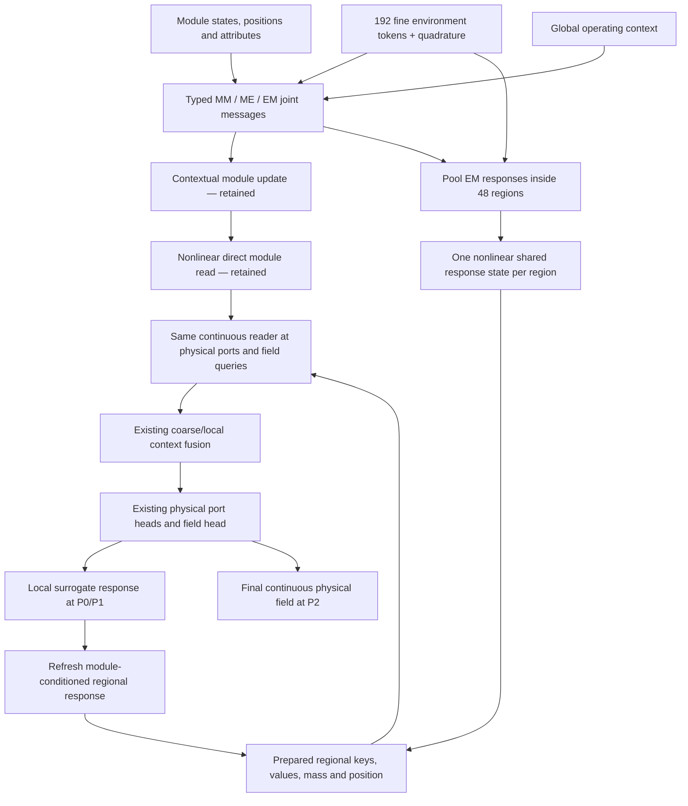

# HONF: Regional Response Compression of the Dense Interface Operator
## Next-step model development, experiments, and Codex Goal-mode instructions

**Research objective:** Preserve the collective-response information learned by Dense Run 1804 while reducing repeated continuous-query interaction work through shared regional response states. Those states must serve both physical module interfaces and field reconstruction. A hypergraph is useful here only if its grouping changes the computation and retains predictive information—not merely because an assignment matrix can be plotted.

**Authorized initial training:** One primary candidate, from scratch, through **500 epochs on physical GPU 0**. Proposed run label: **1806**, subject to the existing run allocator. No automatic longer continuation, baseline retraining, width sweep, support sweep, or second architecture.

**Interpretation of epoch 500:** An early research assessment, not a final ranking or an automatic accuracy gate. The supplied results show that Dense and Legacy reversed their relative ordering between epochs 2,500 and 5,000. A healthy, slower-converging candidate must not be discarded solely because it misses a fixed early error ratio.

**Planning source:** `cosmos2w/ModularDT`, branch `agent/honf-core-next`, inspected at `6cf15f4c274f0dc86f77ca0a6fd3493d760acc05`. This identifies the code examined; it does not freeze the branch or require resetting newer legitimate work.

---

## 1. Evidence, interpretation, and boundaries

### 1.1 Read these sources first

Read the complete current versions of:

- `docs/reports/HONF_Epoch5000_Comparison_Report.md`;
- `docs/reports/HONF_Group_Reader_Recovery_Report.md`;
- `docs/reports/HONF_Interface_Study_Report.md` for comparison definitions and pending physical-reference requests;
- the source files in Section 8.

The first two reports were also supplied as attachments. If a local attachment and tracked report differ, identify the difference and keep measurements associated with their actual checkpoint and protocol; do not silently merge incompatible numbers.

### 1.2 Established observations

The following values are from the exact epoch-5,000 comparison on the established 90-case **development holdout**, not a new untouched test set.

| Quantity | Legacy 1401 | Dense 1804 | Reader 1805 |
|---|---:|---:|---:|
| Pooled normalized fluid MSE | 0.00129505 | **0.00081448** | 0.00401630 |
| Pooled normalized fluid relative L2 | 0.037401 | **0.029661** | 0.065865 |
| Equal-case p95 field relative L2 | 0.060236 | **0.052161** | 0.130381 |
| Near-interface pooled relative L2 | **0.033693** | 0.035086 | 0.047437 |
| Far-fluid pooled relative L2 | 0.041778 | **0.026495** | 0.063757 |
| Interface heat-flux relative L2 | 0.131790 | **0.103487** | 0.105010 |

Dense wins the field comparison against Legacy in 80/90 cases. Reader's group route remains numerically active: its epoch-5,000 main/coarse/local context-norm fractions are approximately 0.4114/0.4926/0.0960. The report does **not** remeasure causal P0/P1/P2 usefulness at epoch 5,000.

The reader-recovery report establishes useful group effects at **epoch 500**, as well as execution improvements from opt-in routing exports and larger inference chunks. Do not report either as a new epoch-5,000 measurement. Earlier large-shape benchmarks are execution-only, not physical-accuracy evidence.

The best logged validation field scores through 5,000 nearly tie Dense and Legacy. Those sampled logged metrics are not interchangeable with the exact endpoint, full-grid, fluid-only metrics above. Keep exact-endpoint and best-selected comparisons separate.

### 1.3 Working hypotheses—not established results

1. Dense's contextualized environmental representation contains useful collective-response information that the current local-support model compresses too early or communicates inadequately.
2. Nearby environmental response tokens may be replaceable by a smaller number of regional response states without requiring a deep MLP or geometry-bias evaluation for every query–environment pair.
3. Computing joint module–environment messages **before regional pooling** is a safer first simplification than separately pooling raw module/environment information or deleting the nonlinear query–module path.
4. A useful regional representation may eventually support sparse or multilevel interaction execution. This first experiment does not establish that final capability.

These hypotheses must be tested through real forward/backward execution and measured prediction errors. Do not turn them into asserted architecture advantages.

### 1.4 Deliberately limited first candidate

The primary candidate reduces the expensive environmental read axis, and the number of nonlinear environmental response updates, from \(E\) fine tokens to \(R\) regions.

It deliberately retains:

- Dense's module–module and fine module–environment messages;
- the nonlinear query–module read;
- the existing eight-token coarse path and compact local correction;
- the physical P0/P1/P2 sequence and frozen Stage-A operator;
- existing loss definitions, data, normalization, widths, and optimizer policy.

This is **partial, interaction-preserving compression**, not a claim of a fully sparse or fully scalable end-state. In particular, \(ME\), \(M^2\), and \(QM\) work remains. Keeping those terms initially avoids throwing away Dense's successful information while changing several mechanisms at once.

The new regional route replaces the old environmental response route; it is not an additional optional group branch beside that same route.

---

## 2. Research execution policy

Use ordinary Git history, existing configuration parsing, existing trusted checkpoint loading, the current run allocator, and standard tests. Do not introduce cryptographic hashes, contract freezes, new baseline snapshots, gate services, approval state machines, watchdog infrastructure, or exhaustive compatibility matrices.

Do not delete or weaken existing security, trusted-loading, authorization, checkpoint, or run-store protections. Existing provenance fields may continue to be written by normal runtime code; this task does not add a new provenance scheme.

Any proposed new defensive constraint must first identify a concrete failure and explain why ordinary software primitives cannot prevent it. None is expected for this task.

A resource authorization such as “one run through epoch 500” limits what Codex is allowed to launch; it is not a scientific acceptance threshold. Numerical trends, diagnostic scores, and frozen approximation errors are **evidence**, not blocking approval gates. A failed test should lead to an ordinary code diagnosis and fix, not a new validation framework. An actually invalid computation, OOM, or non-finite optimization step must be handled and reported honestly; do not pretend a successful dry run replaces physical-batch execution.

Use blocking confirmations only for genuine irreversible or externally mutating actions, critical security boundaries, or a formal release. No release, destructive cleanup, repository-history rewrite, or external solver setup is part of this goal. Preserve unrelated working changes and existing local evidence.

---

## 3. Three work stages and their questions

| Stage | Main question | Work budget |
|---|---|---|
| **I. Preserve the useful computation** | Which mature pathways matter, and what is lost by one fixed regional coarsening? | Bounded stored-checkpoint interventions and one \(192\rightarrow48\) coarsening study; no training. |
| **II. Implement and train one regional candidate** | Can trainable regional response states retain Dense's accuracy while reducing environmental read work? | Focused ordinary tests, two disposable physical optimizer steps, one 500-epoch run on GPU 0. |
| **III. Assess the early result and hand off** | Is the candidate numerically healthy, useful at physical interfaces, and promising in accuracy/cost? | One new-model full 90-case evaluation, bounded interventions and timings, report; no automatic continuation. |

Do not expand these into a long staircase of compulsory pilot runs. Poor frozen coarsening alone is not proof that a learned regional model will fail, so it must not become an automatic stop rule. Conversely, do not conceal severe information loss in order to launch a preferred model. Explain what the diagnostic implies and carry one clearly specified hypothesis into training.

---

## 4. Notation and the Dense computation to preserve

The case/batch index is omitted in equations. Implement batched tensors with module-presence masks and explicit region membership.

| Symbol | Meaning |
|---|---|
| \(M\), \(M_{\mathrm{pack}}\) | active module count and padded module width |
| \(E\) | number of fine environmental quadrature tokens; currently 192 |
| \(R\) | number of response regions; initially 48 on the current grid |
| \(Q\) | number of continuous receiver/query locations |
| \(d\) | spatial dimension; current physical test is 2-D |
| \(H\), \(A\), \(h=H/A\) | hidden width, attention-head count, per-head width |
| \(x_i,s_i,p_i\) | module coordinate, physical attributes, presence mask |
| \(z_i\in\mathbb R^H\) | current module state, refreshed by the physical coupling loop |
| \(y_j,e_j,\nu_j\) | environment coordinate, encoded token, positive quadrature weight |
| \(g\in\mathbb R^H\) | encoded global context |
| \(q\) | a field query or physical port coordinate |
| \(\Phi\) | the existing relative/Fourier coordinate feature map |
| \(W_{jr}\) | environment-to-region membership; one-hot initially |
| \(\mu_r,\xi_r\) | regional quadrature mass and centroid |
| \(\mathcal P_\nu\) | quadrature-weighted region pooling operator |
| \(h_r\in\mathbb R^H\) | contextual regional response state, not attention-head width |

Use superscripts or names to avoid confusing \(h_r\) with per-head width \(h\) in code.

### 4.1 Dense preparation

The inspected `DensePairwiseField.prepare()` makes simultaneous typed updates from the input module states and encoded environment. Schematically, with the actual presence masks understood:

\[
a_i^{MM}=\frac{1}{1+M}\sum_{\ell\ne i}p_\ell\,
\phi_{MM}(z_i,z_\ell,\Phi(x_i-x_\ell)),
\]

\[
a_i^{ME}=\frac{1}{\sum_j\nu_j}\sum_j\nu_j\,
\phi_{ME}(z_i,e_j,\Phi(x_i-y_j)),
\]

\[
a_j^{EM}=\frac{1}{1+M}\sum_i p_i\,
\phi_{EM}(e_j,z_i,\Phi(y_j-x_i)).
\]

Then:

\[
\widetilde z_i=z_i+\rho_M([z_i,a_i^{MM},a_i^{ME},g]),
\]

\[
\widetilde e_j=e_j+\rho_E([e_j,a_j^{EM},g]).
\]

The current implementation uses separate signed MLPs for the three message types and the two updates. **The \(EM\) messages use the current input \(z_i\), not already-updated \(\widetilde z_i\).** Preserve this simultaneous-update ordering in the new model; do not accidentally insert an additional interaction depth.

### 4.2 Dense receiver read

The dense backend returns:

\[
c_D(q)=c_{QM}(q;\{\widetilde z_i\})+c_{QE}(q;\{\widetilde e_j\}).
\]

The query–module term is a nonlinear vector message evaluated for each receiver and active module. The environmental term is geometry- and quadrature-aware multihead attention.

For attention head \(a\), define projected source states:

\[
k_j^a=W_K^a\operatorname{LN}(\widetilde e_j)+b_K^a,
\qquad
v_j^a=W_V^a\operatorname{LN}(\widetilde e_j)+b_V^a.
\]

Let \(u_q^a\) be the existing projected, normalized receiver query. Its environmental score is:

\[
s_{qj}^a=\frac{(u_q^a)^\top k_j^a}{\sqrt h}
+b_\theta^a\!\left(\Phi(q-y_j)\right).
\]

The read is:

\[
c_{QE}^a(q)=
\frac{\sum_j\nu_j\exp(s_{qj}^a)v_j^a}
{\sum_j\nu_j\exp(s_{qj}^a)}.
\]

Apply the existing head concatenation and output projection once. Preserve the bias terms, normalizations, geometric sign convention, and coordinate scaling in the implementation.

The common coarse/local contexts and final field head then remain as in Run 1804.

---

## 5. Stage I — Bounded empirical diagnosis and frozen coarsening

### 5.1 Use the completed checkpoints, not another training ladder

Use exact epoch-5,000 Dense 1804 and Reader 1805 checkpoints. The primary diagnostic anchors are:

```text
0273, 0653, 0298, 0302
```

Add four cases from the already-defined 20-case development subset to represent ordinary as well as difficult layouts. Choose these from the established geometry/module-count strata, not after viewing a favourable coarsening result. Reuse the same eight cases throughout this stage.

Use the existing epoch-5,000 normal predictions/tables where available. Do not rerun every historical checkpoint or duplicate every array.

A one-time same-protocol evaluation of Dense and Legacy best-by-field checkpoints may be useful for the maturity comparison if the local report lacks it. It is secondary to this stage, should reuse existing evidence when possible, and is not a prerequisite for training the new candidate.

### 5.2 Component and phase interventions

For Dense, expose its environmental and module read components separately in an evaluation-only path. The ordinary output remains their sum.

On the four anchors perform:

1. P2-only environmental-read removal;
2. P2-only query–module-read removal;
3. P2-only coarse-read removal;
4. P2-only local-correction removal;
5. environmental-read removal across P0, P1, and P2 with downstream physical responses recomputed.

For Reader 1805 at epoch 5,000, perform group-read removal separately at P0, P1, and P2. Keep P1-only with normal P0 distinct from the old nested P0+P1 intervention. Do not silently reinterpret the old results.

Report both the prediction discrepancy and **intervened-minus-normal ground-truth error** for fluid/near/far fields, thermal ports, internal temperature, surface temperature, and heat flux. A large discrepancy alone establishes reliance, not beneficial physical information.

These are frozen-model reliance studies, not unbiased retraining ablations. Do not automatically delete a branch because one frozen removal improves a metric.

### 5.3 One region layout

The current environment builder uses a cell-centred \(24\times8\) rectangular grid, flattened with x varying fastest. Construct a deterministic \(2\times2\) grouping:

\[
W_{jr}\in\{0,1\},\qquad \sum_rW_{jr}=1,
\]

\[
R=12\times4=48.
\]

Derive memberships from physical coordinates/grid metadata; do not blindly reshape an arbitrary input sequence. Permuting environmental tokens must preserve the physical grouping after the corresponding index permutation. Exact duplicated quadrature samples must map to the same groups.

For nonuniform/irregular future inputs, the generic pooling function should accept an adapter-supplied region-ID vector and weights. This task does not implement a new unstructured mesher, learned clustering algorithm, or 3-D dataset adapter.

Define:

\[
\mu_r=\sum_jW_{jr}\nu_j,
\qquad
\xi_r=\frac{1}{\mu_r}\sum_jW_{jr}\nu_jy_j,
\]

\[
\mathcal P_\nu(X)_r=
\frac{1}{\mu_r}\sum_jW_{jr}\nu_jX_j.
\]

Store membership as region IDs/retained pairs plus reductions, not an unnecessary dense \(E\times R\) matrix in ordinary execution. Omit empty regions. Positive quadrature gives positive mass for every retained region; no trainable occupancy gate, residual rank test, or tiny-mass fallback mechanism is needed.

Preserve supplied boundary/material categories when a case adapter explicitly distinguishes incompatible token types. The current regular-grid trial needs no new category system. Do not claim general boundary/material preservation from the present single-case implementation.

### 5.4 Exact regrouping and its approximation

With any row-partitioned \(W\), the full environmental attention can be written exactly as:

\[
c_{QE}^a(q)=
\frac{\sum_r\sum_jW_{jr}\nu_j\exp(s_{qj}^a)v_j^a}
{\sum_r\sum_jW_{jr}\nu_j\exp(s_{qj}^a)}.
\]

This identity changes notation, not complexity. Computing the inner sum for every original \(j\) does **not** count as compressed execution.

The proposed frozen approximation forms, independently for each head:

\[
\bar k_r^a=\mathcal P_\nu(k^a)_r,
\qquad
\bar v_r^a=\mathcal P_\nu(v^a)_r,
\]

\[
\widehat s_{qr}^a=
\frac{(u_q^a)^\top\bar k_r^a}{\sqrt h}
+b_\theta^a\!\left(\Phi(q-\xi_r)\right),
\]

\[
\boxed{
\widehat c_{QE}^a(q)=
\frac{\sum_r\mu_r\exp(\widehat s_{qr}^a)\bar v_r^a}
{\sum_r\mu_r\exp(\widehat s_{qr}^a)}.
}
\]

Pool the **projected per-head keys and values after the source LayerNorm**. Pooling raw tokens and then applying LayerNorm/projections is a different operation and must not be substituted silently. Include \(\log\mu_r\) once in the softmax; do not double-weight values by regional mass.

The centroid geometry bias is also an approximation. Jensen/nonlinearity effects, within-region value variation, and query-dependent geometry variation can all produce error. No fixed-fourfold token reduction guarantees fidelity.

Singleton groups, with original token ordering restored, recover the original mathematical read. Also test a constant-within-group key/value/geometry-score example with unequal weights, which the weighted compressed formula should reproduce.

### 5.5 Evaluate two distinct uses of the same approximation

**Frozen P2-only:** prepare the physical case with the original Dense model and replace only its final environmental field read. This isolates query-read information loss.

**Frozen full-loop:** use the same projected-key/value coarsening at P0 ports, P1 outside-temperature feedback, and P2 field reads; recompute local responses and all subsequent preparations. This measures amplification or compensation through physical coupling.

Do not report P2-only fidelity as evidence that ports/refinement are preserved. At each refreshed preparation, regenerate projected keys/values from that pass's contextual states. Only geometry and unchanged encoded-environment data may persist across passes.

For both modes report environmental-context discrepancy, field/port/interface errors, and actual read time and memory. Evaluate all fine-grid queries but retain detailed context arrays only for the four anchors or a small fixed probe set.

Use exactly the one \(2\times2\) coarsening and the uncompressed reference. No mask search, rank threshold sweep, or resolution sweep.

### 5.6 Interpretation before training

Write a short result table explaining whether error appears mainly in:

- the environmental read itself;
- physical feedback amplification;
- near-interface regions;
- far-field or difficult-layout responses.

A poor frozen approximation does not automatically reject the trainable candidate: trained grouped computation can compensate, and it is not the same model. But serious information loss must remain visible in the final recommendation. Do not silently change to a more favourable grouping or introduce a second model to hide it.

---

## 6. Stage II — One trainable regional-response candidate

### 6.1 Architecture and scope

Add one new `forward_architecture`, proposed name:

```text
regional_response_honf
```

Suggested backend name:

```text
RegionalResponseField
```

This is a new member of the existing interface-field family, **not** another `organizer_mode` in the historical fixed/adaptive organizer system.

The learned layer families remain those of Dense. The scientific change is **where environmental interaction responses are reduced into shared regional states** and which states receivers read. Do not shrink \(H\), remove the direct module reader, disable the coarse path, or introduce another decoder in the same candidate.

### 6.2 Preserve fine joint messages before grouping

Compute Dense's \(a_i^{MM}\), \(a_i^{ME}\), and \(a_j^{EM}\) as in Section 4. Retain the fine environmental encoding and the same module update:

\[
\widetilde z_i=z_i+\rho_M([z_i,a_i^{MM},a_i^{ME},g]).
\]

Now pool the **joint module-conditioned environmental messages**, not independently pooled module tokens:

\[
\bar e_r=\mathcal P_\nu(e)_r,
\]

\[
\bar a_r^{EM}=\mathcal P_\nu(a^{EM})_r
=\frac{1}{\mu_r(1+M)}
\sum_{j,i}W_{jr}\nu_jp_i\,
\phi_{EM}(e_j,z_i,\Phi(y_j-x_i)).
\]

Build one nonlinear response state per region:

\[
\boxed{
h_r=\bar e_r+\rho_E([\bar e_r,\bar a_r^{EM},g]).
}
\]

Reuse Dense's environmental-update MLP specification for \(\rho_E\). Do not add a new region MLP on top of the old per-token update. The original \(E\) individual `env_update` calls are replaced by \(R\) regional updates.

This has a precise distinction from simply running Dense on a coarser environment grid: fine token features and fine relative module–environment geometry still enter \(\phi_{ME}\) and \(\phi_{EM}\) before pooling. Only the shared response update and receiver read are regionalized. Do not silently replace this with encoding 48 coarse sample points.

It also differs from Run 1805: the jointly conditioned message is calculated before reduction, and response regions cover the environment rather than only source-port neighbourhoods.

### 6.3 The native candidate is not the frozen approximation

The frozen diagnostic averages projected contextual keys/values from:

\[
\widetilde e_j=e_j+\rho_E([e_j,a_j^{EM},g]).
\]

The native model instead learns:

\[
h_r=\bar e_r+\rho_E([\bar e_r,\bar a_r^{EM},g]).
\]

In general:

\[
\mathcal P_\nu\!\left(\rho_E([e,a,g])\right)
\ne
\rho_E([\mathcal P_\nu(e),\mathcal P_\nu(a),g]).
\]

This deliberate difference reduces the number of nonlinear response updates. It is another approximation to be learned under the physical losses, not a claim of frozen-checkpoint equivalence. Singleton groups recover the Dense mathematical computation when weights are aligned.

### 6.4 Regional read

Project the learned native states in the usual attention order:

\[
k_r^a=W_K^a\operatorname{LN}(h_r)+b_K^a,
\qquad
v_r^a=W_V^a\operatorname{LN}(h_r)+b_V^a.
\]

Use the unchanged geometry-bias network at region centroids and regional masses:

\[
\alpha_{qr}^a=
\operatorname{softmax}_r\left[
\frac{(u_q^a)^\top k_r^a}{\sqrt h}
+b_\theta^a(\Phi(q-\xi_r))
+\log\mu_r
\right],
\]

\[
c_{QR}(q)=W_O\operatorname{concat}_a\!\left(\sum_r\alpha_{qr}^a v_r^a\right)+b_O.
\]

Keep the Dense query–module term intact:

\[
c_{\mathrm{backend}}(q)=c_{QM}(q;\{\widetilde z_i\})+c_{QR}(q;\{h_r\}).
\]

Do not introduce null-softmax availability, hard learned group counts, a residual tensor, or a top-k regional mask. All positive-mass response regions are available to receivers in this first candidate. The read scales with \(QR\), not \(Q\) times a bounded local degree; report it that way.

### 6.5 Shared physical-interface sequence

The same preparation and read must be used at:

```text
P0: encode → prepare regional states → read physical ports → predict ports
    ↓
frozen local operator → fuse module responses
    ↓
P1: refresh regional states → read outside temperatures → refine ports
    ↓
frozen local operator → fuse final module responses
    ↓
P2: refresh regional states → prepare keys/values → read the global field
```

Regional geometry, \(W\), masses, centroids, and unchanged base environmental pooling can be reused across passes. Module-conditioned messages, region states, and source keys/values must refresh after module states change.

The independent coarse and local pathways remain unchanged for this controlled experiment. Their potential redundancy is measured by interventions, not addressed by disabling them during training.

### 6.6 What the hyperedges represent

For response region \(r\), define the computational group:

\[
\mathcal H_r=
\{\text{environment samples }j:W_{jr}>0\}
\cup
\{\text{active module interfaces contributing to }\bar a_r^{EM}\}.
\]

In the first candidate all active modules may contribute to each region. Environmental membership is sparse and deterministic; the source-module relation is dense; the learned signed messages encode contribution content. Do not display message magnitude as a probability or call the source incidence learned sparse topology.

The nonlinearity \(\rho_E\) processes the combined response of multiple sources in one region, and the resulting \(h_r\) is reused for ports and field queries. That is the intended shared group computation. It does not prove a unique expressive advantage over attention, nor a learned physical partition.

On the current fixed domain, \(R=48\) is a resolution choice. Do not advertise it as a learned case-specific physical rank. On other domains, the group count can follow an adapter-supplied regional cover, but that extrapolation is not tested by this run.

### 6.7 Vertical architecture diagram



This diagram contains the physical refinement already present in the wrapper; it does not authorize new iterations or a recurrent convergence loop.

### 6.8 Complexity and the honest limit of the first simplification

Let \(C_m\) denote the cost of a typed pair-message evaluation, \(C_u\) the environmental-update cost, and \(C_b\) the query–environment geometry/read cost.

Ignoring common terms, Dense approximately performs:

\[
O(M^2C_m+MEC_m+EC_u+QMC_m+QEC_b).
\]

The native regional candidate performs:

\[
O(M^2C_m+MEC_m+EH+RC_u+QMC_m+QRC_b).
\]

The two typed \(ME/EM\) paths contribute separate constants to the \(ME\) term. The \(EH\) term is regional reduction. Coarse attention and local lookup also remain.

For \(E=192,R=48\), the environmental read interactions are reduced fourfold. Total speedup is **not** necessarily fourfold because preparation, direct module reads, local physics, coarse reads, and memory movement remain. Parameter count may be almost unchanged; “lighter” primarily means fewer expensive evaluations and smaller query-dependent activations.

The first candidate is not the final large-\(M\) solution. Eliminating \(QM\), \(ME\), or \(M^2\) before testing response preservation would repeat the earlier mistake of removing useful interactions too early.

---

## 7. Bounded execution simplifications

Use only the following small, behaviour-preserving opportunities where straightforward:

1. **Prepared source projections.** Cache environmental/regional attention source LayerNorm, keys, and values per prepared state. Reuse across receiver chunks. Never reuse across P0/P1/P2 when sources changed, across optimizer updates, or across physical layouts. Do not detach the cache during training; it must participate in the same computation graph.
2. **Existing runtime controls.** Use summary mode and the existing 2,048-receiver inference override for timing. Retain 128 for matched training and reference accuracy. Do not claim the already measured chunking improvement as a new model gain.
3. **Stream or checkpoint source messages if needed.** Avoid gratuitously retaining all module–environment message arrays when only sums/pools are required. Reuse existing activation checkpointing and batching rather than writing custom GPU kernels.

The algebraic split of a concatenated MLP's first linear layer is a possible later exact optimization, but it is **not a required task** here. Do not expand the goal into compiler work, kernel benchmarking, or a broad caching framework.

If a shared projection-cache refactor changes the execution path of old models, compare independent old/new outputs and backward results under the ordinary numerical tests. Preserve the old default path if that is cleaner. No new golden files or cryptographic replay snapshots are required.

Keep model gains and execution gains in separate columns of the report. Use the same available runtime options when timing Dense and the candidate.

---

## 8. Concrete code ownership and compatibility

### 8.1 Inspect the current owners

All paths below are relative to `HONF_Proj/`:

| Existing file | Relevance |
|---|---|
| `src/honf_forward_core/interface_fields/dense_pairwise.py` | Typed preparation and direct/environmental reads to preserve |
| `src/honf_forward_core/interface_fields/common.py` | Attention projections, coarse/local paths, field head |
| `src/honf_forward_core/interface_fields/core.py` | Architecture factory and encode/prepare/read facade |
| `src/honf_forward_core/interface_fields/types.py` | Encoded and prepared state ownership |
| `src/honf_forward_core/interface_fields/group_operator.py` | Corrected Reader retained as comparator, not rewritten |
| `src/honf_forward_core/config.py` | Architecture/config definitions |
| `Case_ThermalChannel/src/channelthermal/environment.py` | Fine grid and case-specific region metadata |
| `Case_ThermalChannel/src/channelthermal/interface_field_coupling.py` | P0/P1/P2 physical sequence |
| `Case_ThermalChannel/src/channelthermal/training/epoch.py` | Canonical losses and diagnostics |
| `src/config_core/forward/dense_pairwise_interface_context.json` | Candidate's physical/training base |
| `tools/diagnostics/run_stage3_interface_study.py` | Existing intervention/gradient framework |
| `tools/profile_stage2_sparse_inference.py` | Existing timing machinery; retain where reusable |
| `docs/reports/HONF_Epoch5000_Comparison_Report.md` | Current matched accuracy definitions and comparison paths |

Find the existing schemas, registry, history reducer, and reader-recovery intervention helper by following their maintained imports. Do not create guessed parallel infrastructure.

### 8.2 Add only the focused implementation needed

Suggested new file:

```text
src/honf_forward_core/interface_fields/regional_response.py
```

It should contain, or share a small directly related helper for:

- region IDs, mass and centroid reduction;
- the native regional response preparation;
- native receiver reads;
- optional group/message diagnostics.

Prefer reusing Dense's typed neural blocks and query–module read through a small helper/composition/subclass boundary. Avoid copying the entire Dense backend and then allowing two versions to drift. Conversely, do not reorganize all existing modes into a generic plugin framework just for one experiment.

Existing learned parameter ownership must remain unchanged for historical checkpoints. The new backend may instantiate the same layer specification with new weights. It need not introduce additional trainable layers; the regional grouping itself is nonparametric.

Keep frozen projected-key/value coarsening as an explicit **evaluation utility**, not a second trainable architecture or an overloaded hidden switch in the candidate.

### 8.3 Prepared state

A native prepared state needs:

```text
contextual_module_tokens
regional_response_states
regional_coordinates
regional_quadrature_mass
region_ids / sparse environmental membership metadata
optional projected regional keys and values
```

The outer prepared object retains original fine environmental data for the unchanged common coarse path. Do not replace the outer encoded environment silently with 48 tokens: doing so also alters the common path and breaks the one-change comparison.

Maintain explicit source coordinates and source weights next to the source state consumed by each reader. Never read 48 source values with the old 192-coordinate or 192-weight array.

### 8.4 Configuration

Add `regional_response_honf` to the interface-family architecture selector. Use a single complete profile, proposed name:

```text
src/config_core/forward/regional_response_interface_context.json
```

Add only one initial region-resolution setting to the existing interface configuration:

```json
"response_region_block_shape": [2, 2]
```

Its semantics are block extents along physical x/y grid axes for the current case. The adapter supplies membership; the reusable backend pools supplied IDs and weights. Do not use `num_hyperedges`, an adaptive-rank field, learned K, or a new stopping tolerance.

Historical profiles that omit the new field retain their existing architecture and behaviour. Reject only malformed types/shapes with ordinary configuration errors; do not add scientific approval checks to config loading.

### 8.5 Physical quadrature

Pool the quadrature weights used by the existing case and preserve total mass. In the inspected core, uniform weights are derived from `coordinate_scale`; that is an inherited convention, not a general physical-volume guarantee.

Do not silently change it only for the candidate. For the matched experiment, preserve the current numerical weights and state the limitation. Design the pooling helper to accept explicit weights so a later portability task can move weight ownership to the adapter consistently across families. Boundary/material or volume changes are a separate scientific input change, not part of this run.

### 8.6 Keep diagnostics and output clean

Extend the existing evaluation/reporting helpers where appropriate. At most one new orchestration script for this complete regional-response study is reasonable. Do not create a separate evaluator for every branch, phase, or coarsening mode.

Use the existing ignored output root, for example:

```text
diagnostics/generated/interface_operator_study/regional_response/
    diagnosis/
    frozen_coarsening/
    training/
    endpoint500/
    timing/
    figures/
```

This is one study directory, not a new artifact-management system. Formal checkpoints remain in the ordinary managed run. Reuse old tables by reference; do not copy full checkpoints or full-grid arrays into each comparison folder. Save full maps only for selected anchors; scalar tables suffice elsewhere.

Use named-column history handling. Dense's existing resumed CSV schema mismatch must be handled by the maintained reducer; do not parse all continued rows under the original 286-column header. Do not rewrite historical CSVs during this task. For new runs, prepare diagnostic field names before launch or keep optional extended diagnostics in a separate ordinary table.

---

## 9. Ordinary execution checks, not a new gate system

Run focused tests and actual physical-batch execution during implementation. The useful tests are:

- region mass conservation and correct \(2\times2\) assignment on the actual x-fast environment grid;
- module and environment permutation/padding consistency;
- split-weight duplicate quadrature consistency;
- constant-within-region and unequal-mass compressed-attention example;
- singleton native grouping with copied test weights recovers Dense's mathematical forward and backward computation;
- prepared source caching is live in autograd and refreshes after changed module states;
- ordinary versus prepared/chunked reads agree within the existing numerical expectations;
- P0/P1/P2 interventions actually affect only their intended scope;
- existing historical checkpoint modes remain readable and their ordinary regression tests still pass.

Weight copying in a singleton **unit test** is not permission to warm-start the formal candidate. Keep that distinction explicit.

On physical GPU 0, execute two disposable canonical batches, one small-module and one large-module bucket, including real predicted ports, frozen Stage A, all losses, backward, clipping, and an optimizer update. This is important because earlier dense trials failed on a later, larger module bucket. Use the current 48-case/1,024-query policy where memory permits; rely on existing checkpointing/accumulation for a real memory issue and document the runtime adjustment instead of silently changing the scientific batch budget.

Do not claim a static shape inspection, dry run, mocked loss, or synthetic-only backward proves the physical training path works. Likewise, do not spend time building an exhaustive failure-injection test suite.

A CPU double-precision tiny example can establish algebraic identities. Actual GPU repeated/chunked outputs may exhibit the already documented small floating-point variation. Report failures and magnitudes rather than increasing tolerances to relabel them passes or claiming bitwise equality for a reordered reduction.

---

## 10. The single 500-epoch training experiment

### 10.1 Settings

Copy the physical/data/training policy from Dense Run 1804's resolved configuration and its maintained profile. Keep the new profile default at 500 epochs.

| Setting | Initial choice |
|---|---|
| Architecture | `regional_response_honf` |
| Initialization | from scratch; no teacher, distillation, or inherited Dense weights |
| Proposed run ID / name | 1806 / `regional_response_interface` |
| Device | physical GPU 0 |
| Epoch endpoint | 500 |
| Seed | 0 |
| Hidden / message width | 256 / 128 |
| Attention heads | 4 |
| Fine environment | 24 × 8, unchanged |
| Response grouping | 2 × 2 fine cells, yielding 12 × 4 = 48 regions |
| Coarse tokens / blocks | 8 / 1, unchanged |
| Local radius factor | 2.5, unchanged |
| Relative Fourier frequencies | 4, unchanged |
| Training receiver chunk | 128, unchanged |
| Inference timing override | existing 2,048, same for Dense and candidate |
| Activation checkpointing | existing Dense policy enabled |
| Optimizer | AdamW, learning rate 3e-4, weight decay 1e-5 |
| Gradient clipping / AMP / dropout | 1.0 / false / 0 |
| Dataset and physical coupling | unchanged 600/90 development split, predicted ports, frozen Stage A, one refinement |
| Additional losses | none |

Retain the current checkpoint selections and milestones:

```text
10, 50, 100, 250, 500, 1000, 2500, 5000
```

Milestones after 500 support a later user-authorized continuation. They do not authorize Codex to run longer now.

Use the existing run allocator. The proposed ID is not reserved; report a collision and follow the ordinary allocator/user convention without overwriting an occupied run or introducing new locking machinery. Never resume an unrelated run under the candidate profile.

### 10.2 Launch template

From `HONF_Proj/`, using the existing interpreter and environment:

```bash
CUDA_VISIBLE_DEVICES=0 \
PYTHONPATH=src:Case_ThermalChannel/src \
/home/wanglz/miniconda3/envs/ModularDT/bin/python -u train.py \
  --config project://src/config_core/forward/regional_response_interface_context.json \
  --workflow forward \
  --device cuda:0 \
  --epochs 500 \
  --run-id 1806 \
  --run-name regional_response_interface \
  --yes
```

Use the live parser to correct a path/CLI mismatch rather than invent unsupported flags. A dry run is useful for inspecting the resolved configuration, but must not replace actual batch execution or the authorized trial. Existing local `rtk` wrappers may be used; they are not a required new dependency.

Do not extend Run 1804 or Run 1805 in this goal. Their completed checkpoints already supply the required references.

### 10.3 Observe optimization without imposing topology targets

Retain existing metrics, and add only cheap separate read/preparation observations:

- field and temperature losses plus existing physical losses;
- regional-preparation and regional-read gradient/update norms;
- direct module/coarse/local norms as separately labelled groups;
- actual region count and environment/regional read row counts;
- epoch wall time and peak allocated memory.

Do not add a minimum regional-context fraction, entropy target, target rank, source sparsity penalty, or branch-balancing schedule. Magnitude changes should trigger analysis, not a loss modification.

Compact observations at epochs 10, 50, 100, 250, and 500 are enough; reuse existing logs rather than launching a monitoring service. Stop an actually failing process for a concrete computational/resource defect, record it, and fix it normally. Do not silently restart with a changed model under the same scientific label.

---

## 11. Stage III — Endpoint evidence and convergence-aware assessment

### 11.1 Match the scientific comparison

Evaluate the new exact epoch-500 checkpoint once on the same 90 development cases and full grids. Compare with existing exact epoch-500 tables for Dense 1804, Legacy 1401, and Reader 1805. Latent 1801 can remain secondary context; do not retrain or rerun it unnecessarily.

Show the completed epoch-5,000 Dense/Legacy/Reader scores separately as maturity references. Never compare new epoch 500 with Dense epoch 5,000 and call the difference a matched training result.

Retain both:

- logged validation histories using their actual sampling/loss definitions;
- full-grid fluid-only endpoint metrics.

Report pooled and equal-case metrics separately, including all five field channels, near/far masks, port quantities, internal/surface temperatures, flux, existing KPIs, predefined strata, and paired case differences. The near/far definitions remain surface distance 0–0.25 and at least 1.0 in dataset units. Do not mix them with radius-normalized layout strata.

### 11.2 Does the regional path carry useful information?

On the four anchors, remove the regional read separately at P0, P1, and P2 and recompute the appropriate downstream physical sequence. Keep direct query–module, coarse, and local paths intact. Repeat P2-only direct-module and coarse removals if needed to distinguish where the new model obtains its accuracy.

Record error deltas and output discrepancies. A nonzero regional norm is not enough. A large adverse removal effect indicates reliance of this trained checkpoint, not proof that no attention model could reproduce it or that a retrained group-free model must fail.

Use one or two encoded-module perturbation/JVP probes to show that a change can influence regional responses and both receiver types. Because source–region and query–region relations remain globally available in this model, do not expect the exact disconnected derivative zeros of the former compact-support reader. Display actual source support and dependence honestly.

One coordinate-direction AD versus finite-difference check on an ordinary and a difficult anchor is sufficient to detect a broken physical path. Self-consistency is not physical sensitivity validation.

### 11.3 Visualizations

Produce a compact set rather than duplicating every historic panel:

1. Fine environment grid and 48-region cover, including mass/centroid locations.
2. Regional response state/read summaries at a fixed small set of ports and field probes, showing shared region IDs.
3. Four-anchor predictions/errors against reference and Dense for the new endpoint.
4. Convergence at sampled checkpoints and accuracy versus measured compute/memory.

Label deterministic region membership, learned receiver attention, signed message magnitude, and physical error differently. Do not call them all “physical influence.” Do not create sorted block-diagonal plots as the primary evidence for physical organization.

Detailed \(M\times R\) message summaries can be computed on selected cases only. Do not retain every fine \(M\times E\times H\) tensor in routine training or all-grid evaluations for the sake of visualization.

### 11.4 Measured efficiency

Use the existing profiler with summary exports and independent repetitions. On 0273 and 0653 measure:

- encoding/group construction;
- physical preparation including P0/P1/P2;
- prepared 8,192-query decode;
- complete forward;
- peak allocated and reserved memory;
- one small and one large disposable canonical training step.

For scaling, reuse only two existing synthetic shapes in addition to real anchors:

```text
(M,E,Q) = (32,768,65536)
(M,E,Q) = (128,3072,262144)
```

Use the actual rectangular environmental layout and the same 2 × 2 grouping, giving 192 and 768 regions respectively when both fine-grid dimensions are even. Derive counts from the realized layout; do not report a desired count without building it.

Time Dense and the candidate with identical summary mode, outer query batching, receiver-chunk override, and physical-wrapper use. Two warmups and five repeats on anchors, one warmup and three repeats on large shapes are adequate for this research comparison unless measurements are obviously unstable.

Count the actual evaluations of `em_message`, `me_message`, `env_update`, the environmental geometry-bias network, and query–module messages using a bounded hook/profiler invocation. The expected reduction is in regional update/read rows, not all pair rows.

Report source preparation and query execution separately. Peak reserved memory can inherit allocator high-water marks from previously evaluated models; distinguish it from live allocated memory. Do not claim physical accuracy at synthetic extrapolation shapes.

### 11.5 Interpret epoch 500 without a premature final verdict

Use descriptive conclusions, not a rigid 1.10×/1.25× score gate:

**Promising early result:** regional computation is useful, optimization is healthy, error is competitive or closing, and actual costly operations or memory decrease. Recommend a user-launched continuation of the same run.

**Healthy but unresolved:** accuracy is behind at 500 but improving, the group path is productive, and the cost benefit is meaningful. This is not a rejection. Present recent trends, early-versus-late error changes, difficult cases, and the tradeoff. A later 2,500 checkpoint may be needed.

**Serious observed failure:** an unusable numerical computation, an effectively frozen trajectory, or persistent gross error with no learning progress and no useful regional information. Diagnose the specific failure. Do not spend an automatic long continuation merely because one was possible.

**No useful compression:** the model fits but the measured work/memory benefit is negligible or every accuracy gain comes from the untouched bypasses. Report that limitation rather than calling the architecture a hypergraph success.

A finite 20–40% early error gap alone, especially with improvement, is not proof of the third outcome. The supplied Dense/Legacy reversal illustrates why. Do not automate future-budget decisions from one checkpoint or a fitted learning-curve forecast.

Stopping the authorized process at epoch 500 remains mandatory because of the user's compute boundary, regardless of which research interpretation applies. Supply a recommendation and a continuation command; do not launch it.

---

## 12. Report and final handoff

Write one tracked conclusion report, proposed name:

```text
docs/reports/HONF_Regional_Response_Compression_Report.md
```

It should distinguish four evidence levels:

1. **Reported prior results:** from the supplied/maintained studies.
2. **Frozen inference approximation:** Dense weights, no training, P2-only versus full physical loop.
3. **New from-scratch model:** exact epoch-500 performance and learning trajectory.
4. **Unverified physical hypotheses:** independent solver/collective-response validation still pending.

Include:

- actual source revision, architecture/config changes, commands, run ID and paths from existing runtime records;
- the fine-joint-message-before-pooling formulation and exactly which operations were reduced;
- singleton/weighted attention checks and real-batch forward/backward observations;
- mature component/phase diagnosis;
- the one frozen coarsening result, including negative results;
- matched epoch-500 metrics and separate mature reference scores;
- regional usefulness at ports/refinement/field queries;
- execution-only versus model-compression gains;
- convergence-aware recommendation, unresolved limitations, and any deviations from this plan.

Do not add checkpoint hash tables, source snapshots, new contract-lock files, or scientific pass/fail machinery. Existing security and runtime metadata remain intact.

If a longer run is scientifically warranted, provide the actual path in this handoff template:

```bash
CUDA_VISIBLE_DEVICES=0 \
PYTHONPATH=src:Case_ThermalChannel/src \
/home/wanglz/miniconda3/envs/ModularDT/bin/python train.py \
  --config project://src/config_core/forward/regional_response_interface_context.json \
  --workflow forward --device cuda:0 --epochs 2500 \
  --resume-checkpoint <ACTUAL_NEW_RUN_DIR>/latest_model.pt \
  --yes
```

Document but do not execute it. Continue the same managed run and optimizer if the user later authorizes it; never copy a checkpoint into a new run to make the trajectory look continuous.

For a later 2,500/5,000 comparison, reuse exact endpoints, the established holdout, and the same physical metrics. Compare best-by-field checkpoints separately. Reassess whether the cost reduction persists and whether hard cases improve. The mature target is Dense-like response accuracy with lower measured work, not merely a lower early loss than Reader.

---

## 13. Long-term HONF direction—document, do not implement now

This round is a deliberate first step toward a scalable hypergraph interface operator. It does not settle the final source or query topology.

If regional response compression is useful, the next structural questions are:

- Can fine module–environment preparation be replaced by learned module-to-region interactions without losing the information identified in this study?
- Can near/far or multilevel group exchange reduce source/read work while preserving long-range response, instead of treating distance as proof of negligible influence?
- Can the direct query–module route be limited to genuinely local detail after the regional representation is demonstrably sufficient?
- Should module-dependent coarse communication be sourced from the regional group states, replacing the independent raw-entity coarse route rather than adding another branch?

Answer those with targeted evidence later. Do not implement all four in this goal.

Physical verification remains essential: the existing 16 pair/triple requests are still pending. Reuse them when trustworthy solver outputs become available. Do not regenerate a request collection, build an unvalidated CFD solver, treat model self-FD as physical truth, or block the authorized model experiment solely because external solver results have not arrived.

The project should eventually demonstrate three properties together:

\[
\boxed{\text{preserved collective physical response}}
\quad+\quad
\boxed{\text{reusable module/field group interfaces}}
\quad+\quad
\boxed{\text{reduced actual interaction work}}.
\]

A geometric coarsening can be described equivalently using pooling or attention. That does not automatically invalidate it, but it also does not establish a unique hypergraph contribution. Evidence of group-mediated coupling, compositional generalization, and computational reuse—not terminology—must carry the final claim.

---

## 14. Completion checklist

At the end of this goal, leave:

- one coherent implementation of `regional_response_honf` beside established families;
- a bounded mature-checkpoint diagnosis and one frozen projected-key/value coarsening result;
- ordinary test results and real physical-batch optimization evidence;
- one from-scratch GPU-0 run through 500 epochs, or an explicit report of an actual execution failure;
- one matched endpoint evaluation and limited anchor/scaling measurements;
- a concise source report with local evidence references and a convergence-aware recommendation;
- a documentation-only continuation command where appropriate;
- existing profiles, checkpoints, security measures, and historical evidence preserved.

Use normal commits and the existing branch workflow. Do not reset to the planning revision, force-push, rewrite history, publish a release, or begin inverse-model changes. Do not let routine documentation or heuristic pre-flight work displace the actual model, optimization, and measurement tasks.

---

## Source map

**[R1]** `docs/reports/HONF_Epoch5000_Comparison_Report.md` — exact matched endpoints, mature limitations, history-schema warning, and pending physical reference status.

**[R2]** `docs/reports/HONF_Group_Reader_Recovery_Report.md` — reader mathematics, epoch-500 causal scope, execution protocol, numerical repeat caveats, and physical coupling evidence.

**[R3]** `docs/reports/HONF_Interface_Study_Report.md` — original baseline definitions, held-out strata, solver-request scope, and model-family comparisons.

**[C1]** `src/honf_forward_core/interface_fields/dense_pairwise.py` — inspected typed updates and receiver reads.

**[C2]** `src/honf_forward_core/interface_fields/common.py` — source normalization/projections, coarse/local paths, and shared field head.

**[C3]** `src/honf_forward_core/interface_fields/core.py` and `Case_ThermalChannel/src/channelthermal/interface_field_coupling.py` — current prepared-state and P0/P1/P2 interfaces.

**[C4]** `Case_ThermalChannel/src/channelthermal/environment.py` — cell-centred grid, x-fast flattening, and boundary features.

**[C5]** `src/config_core/forward/dense_pairwise_interface_context.json` — starting profile; actual Run-1804 resolved configuration remains the authority for its historical execution.

All new regional equations, task choices, and research recommendations in this plan are proposed development decisions, not outcomes already demonstrated by these sources.
