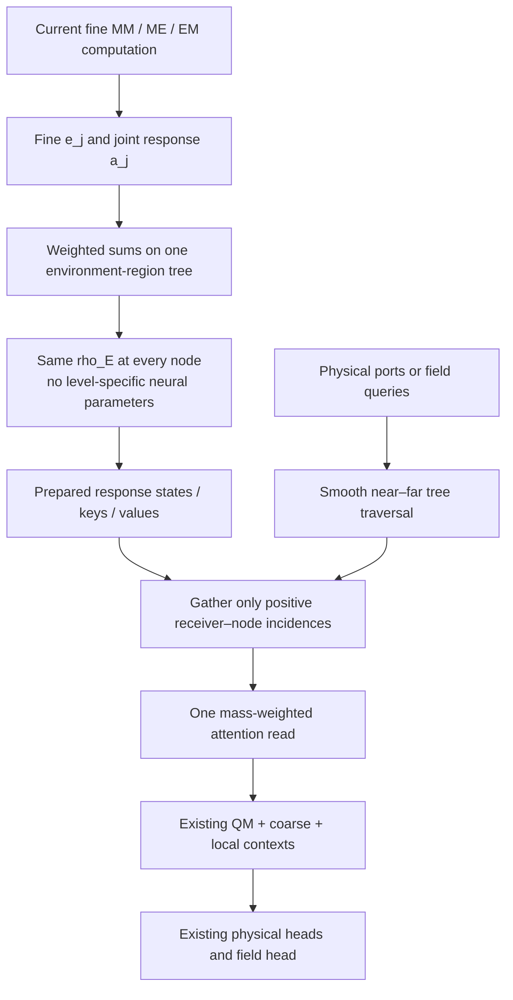
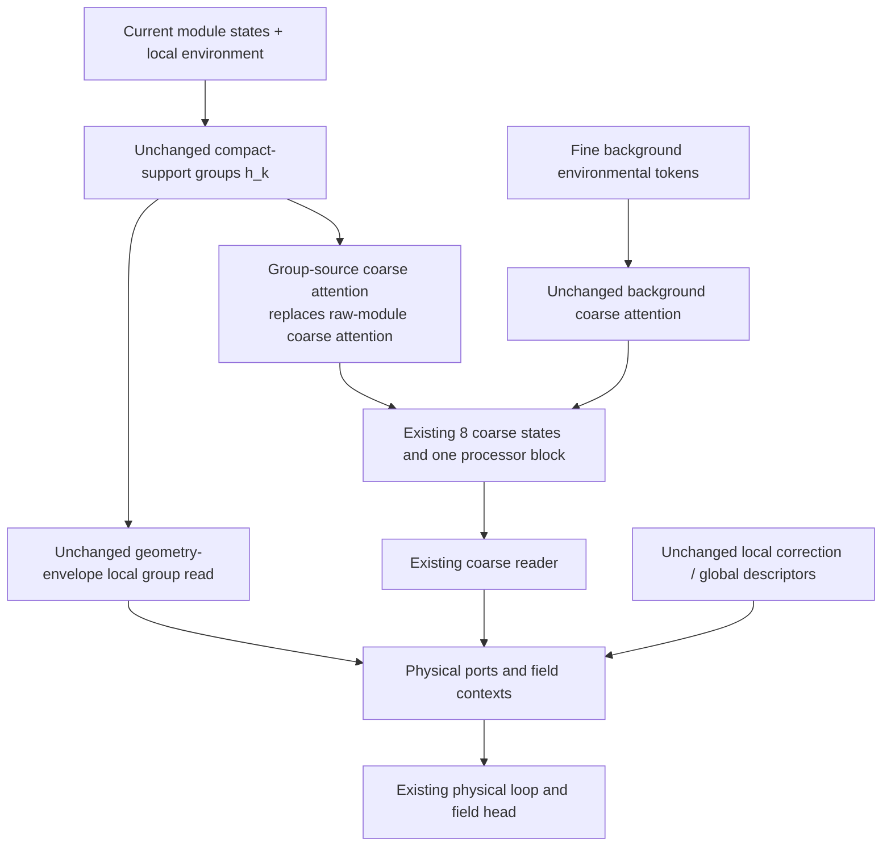

# HONF NStage2 — Multiresolution Response Reading and Group-Mediated Coarse Communication

**Research plan and Codex Goal-mode instructions**  
**Planning date:** 2026-09-12  
**Repository:** `cosmos2w/ModularDT`  
**Working branch:** `agent/honf-core-next`  
**Inspected planning reference:** `b829ca9234f4d676041c35de8d463f88260d8a4f`

The commit above identifies the source inspected for this plan. It is not a branch freeze or a requirement to reset later legitimate work.

## Executive decision

Proceed with **two parallel, independent model experiments**, not a merged architecture and not a sweep:

| Track | Starting computation | Single structural hypothesis | Proposed run | Physical GPU | Authorized endpoint |
|---|---|---|---|---|---|
| **A — Hierarchical Regional HONF** | Regional 1806 | Read shared responses at fine resolution nearby and coarser resolution farther away, with sparse receiver–tree incidences and complete environmental coverage | 1807 | 0 | 500 epochs |
| **B — Group-Mediated Reader HONF** | Reader 1805 | Replace the coarse path's raw-module source with the already-computed group states; retain environmental background input | 1808 | 2 | 500 epochs |

Track A is the main accuracy–efficiency direction. Track B is a bounded, higher-risk test of whether existing useful local groups can supply better long-range module communication. Neither is assumed to succeed.

Both use the existing predicted-port physical loop and are trained **from scratch**, with unchanged losses and optimization policy. Do not combine A and B in this goal. Do not resume the old models, add a third trained candidate, or continue either new run beyond epoch 500 automatically.

The run IDs are proposed labels, not reservations. Use the existing run allocator; never overwrite an occupied run. If a proposed ID is occupied, report the actual newly allocated ID in the profile/run record and commands instead of silently reusing the occupied directory.

**Scientific objective:** establish useful, reusable multi-entity response computation whose topology affects either executed cost or the path of module-to-interface/field communication. A nonzero context, an appealing attention map, or a preferred edge-count histogram is not sufficient evidence.

---

## 1. Evidence that motivates NStage2

### 1.1 What the mature report actually supports

The primary source is `HONF_Five_Model_Epoch5000_Comparison_Report.md` [S1]. Use its terminology and its separation of exact endpoints, validation-selected checkpoints, interventions, geometry, and execution.

| Model | Exact-5000 pooled normalized fluid L2 | Best-by-validation-field L2 through 5000 |
|---|---:|---:|
| Legacy 1401 | 0.037401 | 0.032097 |
| Latent 1801 | 0.090399 | 0.079479 |
| Dense 1804 | 0.029661 | 0.028960 |
| Reader 1805 | 0.065865 | 0.064633 |
| Regional 1806 | 0.031188 | 0.028192 |

Dense and Regional are close, with checkpoint-sensitive ordering. Regional is 5.15% worse in L2 at the exact final epoch, but 2.65% better under the reported saved-best selection policy. This does not establish a robust across-seed winner.

At the exact endpoint, temperature contributes about 63.5% of Regional's net normalized MSE gap to Dense. Under saved-best selection, Regional instead has better field-temperature, far-fluid, and heat-flux scores. Therefore **temperature is a quantity to examine, not proof of a permanent coarse-region bias**.

Reader's groups are useful, not dormant: mature P0/P1/P2 removals generally worsen the measured outputs on the diagnostic anchors. The remaining issue is response quality and communication, not simply activation. Larger ablation effects do not imply a better model.

Regional's actual operation counts expose the remaining cost. On the largest existing execution shape, `(M,E,Q)=(128,3072,262144)`, it still executes approximately:

- 35.65 million direct query–module message rows;
- 213.91 million environmental/regional receiver-geometry rows;
- 1.18 million fine ME rows and 1.18 million fine EM rows over the full physical forward.

The regional environmental read is therefore a substantial remaining target. Making only the model width smaller would not change these pair counts.

Matched large-shape full-forward times are 5.325 s Dense, 2.121 s Regional, 0.456 s Reader, and 0.224 s Latent. These are synthetic-input **execution measurements**, not physical accuracy at those scales. Historical training durations are not controlled speed comparisons.

### 1.2 Inferences to test, not established conclusions

**Hypothesis A.** One fixed response scale may be unnecessarily expensive far from a receiver and too coarse near it. A multiresolution representation may preserve fine response detail while replacing the dense `Q × R` read with a smaller set of receiver–group interactions. The report does not prove that distance predicts attention compressibility.

**Hypothesis B.** Reader's existing group states may be more useful if the coarse module communication is computed from them instead of bypassing them. The report does not prove that the independent coarse route causes Reader's errors; the rewiring could also expose an inadequate local representation.

**Do not infer** that similar attention effective counts imply interchangeable models, that a small regional–dense gap is a robust improvement, or that the latent baseline's result characterizes all attention architectures.

### 1.3 What is deliberately not reopened

Do not revive residual-rank organizers, learned K classifiers, hard top-k training, edge-count objectives, entropy/diversity/balance penalties, staged topology schedules, or the failed factorized pair kernel. NStage2 does not optimize a global integer K.

Do not rerun the completed five-model maturity study. Its existing tables are the evidence base. New execution of a parent is limited to the matched diagnostics/profiling required here.

---

## 2. Research scope and implementation discipline

### 2.1 Research execution, not release engineering

Use ordinary Git history, the existing configuration system, run allocator, trusted checkpoint loader, named-column metrics reader, and standard tests. Preserve existing security and checkpoint protections.

Do not add new cryptographic hashes, contract freezes, baseline snapshots, run-approval services, approval matrices, monitoring daemons, or numeric launch/continuation gates. No such mechanism is justified for this task. If a concrete new cross-system or irreversible-state risk appears, document the actual scenario and first explain why ordinary existing primitives cannot address it; otherwise do not introduce a new control.

Ordinary numerical/input errors should raise ordinary exceptions. Real NaN/Inf, invalid shapes, or an OOM require a direct code/resource response, not pretending the run succeeded. These are execution facts, not scientific score thresholds.

Run real model forwards, backwards, optimizer updates, and empirical measurements. A static check or a toy identity test cannot substitute for the physical wrapper execution. Equally, a poor frozen approximation or an untrained attention map must not veto a trainable model before its authorized experiment.

### 2.2 Keep historical methods distinct

Preserve all existing model families and old profile defaults. Do not rewrite the learned function of Runs 1401/1801/1804/1805/1806 or edit their checkpoint files.

- A gets one new backend family, `hierarchical_regional_honf`.
- B keeps `sparse_interface_honf` and adds one explicit coarse-source option: `coarse_module_source="group_states"`.
- Existing profiles default to `coarse_module_source="module_states"` and keep their old computation.

Changes to shared source must preserve old parameter ownership and default arithmetic. Do not instantiate unused alternative networks in each candidate merely for a convenient factory. Later cleanup should be possible by removing one backend or one explicit coarse-source path and its profile/tests, not by untangling many interacting flags.

### 2.3 Keep the experiments interpretable

For A, keep the direct QM, MM/ME/EM, common coarse, local correction, and physical losses. Change response resolution and its receiver read as one coherent operator.

For B, keep sparse supports, memberships, group preparation, corrected local group read, coarse latent count, background-environment coarse attention, local correction, and physical losses. Change only the source of coarse **module-dependent** communication.

Do not jointly add a learned geometry warp, a new source kernel, larger width, a new solver, distillation, or loss reweighting. These would obscure the two questions being tested.

---

## 3. Common notation, physical loop, and starting equations

Omit batch index when unambiguous.

| Symbol | Meaning |
|---|---|
| `B` | Batch size |
| `M`, `M_pack` | Active modules and packed storage width |
| `E` | Fine environment quadrature samples; 192 in the real case |
| `Q` | Requested field receivers; 8192 for complete-grid evaluation |
| `P` | Physical port samples per module |
| `d` | Coordinate dimension; the experiment remains 2-D |
| `H`, `H_m` | Hidden and message widths: 256 and 128 |
| `F` | Physical field channels: u, v, pressure, vorticity, temperature |
| `z_i`, `x_i` | Current encoded/local-response module state and coordinate |
| `e_j`, `y_j`, `nu_j` | Fine environmental encoding, coordinate, positive quadrature mass |
| `g` | Encoded case-level context |
| `a_j` | Dense fine module-conditioned environmental message |
| `rho_E` | Existing environmental-update MLP |
| `r` | Flat region index in 1806 |
| `n` | Hierarchical response node in A |
| `k` | Occupied compact-support group in B |
| `L_c` | Common coarse latent count, fixed at 8 |

The existing fine response is

\[
a_j=\frac{1}{1+M}\sum_i\phi_{EM}(e_j,z_i,\Phi(y_j-x_i)).
\]

All fine MM/ME/EM messages consume the same input module states of a preparation pass. Do not feed the already-updated module state into EM within that same pass; that would be an additional model change.

In 1806, for membership \(W_{jr}\),

\[
\mu_r=\sum_jW_{jr}\nu_j,\qquad
\bar e_r=\mu_r^{-1}\sum_jW_{jr}\nu_je_j,\qquad
\bar a_r=\mu_r^{-1}\sum_jW_{jr}\nu_ja_j,
\]

\[
h_r=\bar e_r+\rho_E([\bar e_r,\bar a_r,g]).
\]

The current source tensor is `[B,48,H]`, and its projected keys/values are reused within one prepared graph.

The common physical sequence stays:

```text
Layout + physical attributes + environment
                  ↓
                Encode
                  ↓
P0: prepare representation → initial port contexts
                  ↓
Predict ports → frozen local operator → update module states
                  ↓
P1: refresh representation → outside-temperature feedback
                  ↓
Refine ports → frozen local operator → update module states
                  ↓
P2: refresh final representation
                  ↓
Read continuous field queries
```

P0/P1/P2 reuse parameters and geometry, not stale learned states. Source projections must refresh whenever module-dependent response states change. No detached learned cache may persist across optimizer steps or cases.

The inherited physical quadrature convention remains unchanged for comparison. The new tree consumes the supplied positive `env_weights` without inventing another scale. `coordinate_scale` is not generally physical volume; the present uniform-weight convention must not be advertised as a completed irregular-mesh quadrature implementation.

---

# 4. Track A — Hierarchical Regional HONF

## 4.1 Central idea

**Use fine shared response states near a receiver and larger shared response regions farther away. Retain every source region through some scale; do not simply discard far regions.**

This replaces 1806's single fixed `2×2` response resolution with one nested representation. It is not an additional parallel predictor and it does not create a learned network per level.

The hierarchy starts from the *existing fine environment*, not from new simulated data. Near-detail restoration means recovering information lost by fixed pooling, not super-resolving information absent from the environment input.



## 4.2 Geometry and hierarchy ownership

The case adapter supplies an `EnvironmentHierarchy` (or equivalently small typed tensor description) aligned with fine environment samples. The reusable neural backend must not guess that an arbitrary sequence can be reshaped as a rectangular grid.

For ThermalChannel, construct nested `2×2` blocks from physical grid ranks, preserving the existing coordinate-based convention. Starting from `(nx,ny)=(24,8)`, successive level sizes are:

```text
24×8 → 12×4 → 6×2 → 3×1 → 2×1 → 1×1
 192      48      12      3       2       1
```

There are 258 nodes before optional removal of geometrically redundant unary nodes. Report actual counts. Partial boundary blocks must use their actual fine-cell union and actual mass; do not pad them with fictitious physical sources.

Required geometry information is small: fine-sample-to-leaf membership, parent/child indices, node level, positive-mass validity, and physical bounding boxes. Exact duplicate quadrature samples map to the same physical leaf. Tree construction is a geometric operation performed once per encoded case; no learned count or residual loop is involved.

The generic operations should accept a supplied tree in any dimension, but no 3-D case migration is part of NStage2. A tiny 3-D tensor example can test that no new 2-D-only neural formula was introduced.

## 4.3 Form every response state from pre-update sufficient statistics

Let \(\mathcal L(n)\) be the fine environmental samples under node \(n\). Define

\[
\mu_n=\sum_{j\in\mathcal L(n)}\nu_j,\qquad
\xi_n=\frac{1}{\mu_n}\sum_{j\in\mathcal L(n)}\nu_jy_j,
\]

\[
\bar e_n=\frac{1}{\mu_n}\sum_{j\in\mathcal L(n)}\nu_je_j,
\qquad
\bar a_n=\frac{1}{\mu_n}\sum_{j\in\mathcal L(n)}\nu_ja_j,
\]

\[
\boxed{h_n=\bar e_n+\rho_E([\bar e_n,\bar a_n,g]).}
\]

Compute weighted sums bottom-up, then apply the same inherited `env_update` to all valid nodes in one batched/chunked call. Do **not** recursively average already-nonlinear child states:

\[
h_n\ne\sum_{c\in\mathrm{children}(n)}\frac{\mu_c}{\mu_n}h_c
\quad\text{in general}.
\]

The fine leaf limit is Dense's environmental state for the same weights. The fixed first-parent-level limit is 1806's native `2×2` regional state for the same weights. These give meaningful ordinary equivalence tests; mixed-resolution reading itself is a new model, not an exact rewrite of Dense.

Project keys and values once per prepared pass using the existing normalization/projection modules. Keep gradients live. Intermediate node states can be cached for all query chunks of that pass.

## 4.4 Smooth receiver-specific resolution weights

Hard switches between a parent prediction and its children can make coordinate derivatives discontinuous. Use one compact, continuously differentiable geometric blend instead of a learned stopping controller.

Let \(c_n\) be the physical bounding-box centre and \(r_n>0\) its half-diagonal radius. Define squared normalized distance

\[
u_{qn}=\frac{\|q-c_n\|^2}{r_n^2}.
\]

The first candidate uses a fixed near/far distance interval `[1.0, 2.0]` in radius units, hence squared transition endpoints 1 and 4:

\[
t_{qn}=\operatorname{clip}\left(\frac{u_{qn}-1}{3},0,1\right),
\]

\[
\chi_{qn}=1-3t_{qn}^2+2t_{qn}^3.
\]

For internal nodes, \(\chi=1\) means use children, \(\chi=0\) means use this node, and the transition uses both. A leaf always accepts its incoming weight. This is a geometric interpolation basis, not a training/approval gate.

Propagate a scalar carrier \(\zeta\):

\[
\zeta_{q,\mathrm{root}}=1.
\]

For an internal node,

\[
\eta_{qn}=\zeta_{qn}(1-\chi_{qn}),
\qquad
\zeta_{qc}=\zeta_{qn}\chi_{qn}
\quad\text{for every child }c.
\]

For a leaf,

\[
\eta_{qn}=\zeta_{qn}.
\]

**Do not divide the carrier by the number of children.** Child physical masses already partition the parent mass.

Only nodes with positive \(\eta\) are read. Only branches with positive propagated carrier are traversed. Batched loops over tree levels are acceptable; Python loops over individual queries are not.

### Mass accounting

For every fine source \(j\), the weights along its ancestor path telescope:

\[
\sum_{n:\,j\in\mathcal L(n)}\eta_{qn}=1.
\]

Consequently,

\[
\boxed{\sum_n\eta_{qn}\mu_n=\sum_j\nu_j.}
\]

Thus simultaneous parent/child participation in a transition does not duplicate quadrature mass. All environmental regions remain represented at some resolution. This is mass accounting, **not** a theorem that the learned field is conserved or that coarse and fine attention are identical.

The compact blend has zero derivative at its support-switch endpoints. Provided learned states/logits are finite and the attention denominator is positive, changing the set of enumerated zero-weight rows does not introduce a field jump. Test this on actual derivative probes; do not replace the calculation with a verbal smoothness assertion.

## 4.5 The sparse attention read

For each attention head with width \(d_h\), compute on selected receiver–node rows only:

\[
s_{qn}=\frac{Q(q)^\top K(h_n)}{\sqrt{d_h}}
+b_\theta\left(\frac{q-\xi_n}{\text{coordinate scale}}\right),
\]

\[
\alpha_{qn}
=\frac{\eta_{qn}\mu_n\exp(s_{qn})}
{\sum_m\eta_{qm}\mu_m\exp(s_{qm})},
\]

\[
\boxed{c_{\mathrm{tree}}(q)=W_O\operatorname{concat}_{\mathrm{heads}}
\left[\sum_n\alpha_{qn}V(h_n)\right].}
\]

Keep the existing Fourier geometry-bias network and query/key/value/output projections. There is no level-specific MLP, extra null token, learned whole-branch gate, or new response head.

Perform segmented weighted softmax and sums on the retained incidence list. Do not calculate a dense `[B,Q,N_tree,...]` tensor and mask it afterward. Use a stable weighted/log-space implementation; do not floor a true zero geometric weight into a nonzero relation. The existing attention code and numerical tests provide useful primitives, but the current dense `read_projected` call cannot itself supply sparse execution.

Training and inference use the same smooth geometric rule. No straight-through estimator or topology curriculum is needed. Traversal geometry and weights retain coordinate gradients; discrete indices alone do not carry those gradients.

## 4.6 What stays unchanged

The output remains

\[
c(q)=c_{QM}(q)+c_{\mathrm{tree}}(q)+c_{\mathrm{coarse}}(q)+c_{\mathrm{local}}(q).
\]

Do not delete the co-adapted QM or coarse pathways in the same experiment. The mature removals show substantial reliance, though they do not prove those pathways are irreducible after retraining.

A still computes fine MM/ME/EM using all intended sources. It does not yet create sparse module-to-region incidence. Its direct QM and the common local distance lookup remain unchanged. Calling the entire network linear-time would be false.

## 4.7 Expected benefit, cost, and failure modes

Potential accuracy benefit comes from unpooled fine response states near receivers, including physical ports, while distant interaction content is represented by larger states. It is an inductive-bias hypothesis, not a proven explanation of the exact-5000 temperature gap.

For a balanced, quasiuniform spatial tree in fixed dimension, the number of selected nodes per query can grow much more slowly than the number of fine sources; report its measured distribution. Worst-case work and poor geometry can be larger. Do not assert a universal FMM error/complexity theorem for these learned responses.

A deliberately spends **more preparation work** than 1806: approximately 258 environmental updates rather than 48 on the small case. It reduces receiver work only when the selected tree frontier is cheaper than reading all flat regions. Real-case speed may be similar or worse; large-query/large-environment gains are the principal hypothesis.

Far-away learned responses need not be smooth or compressible. Transported fine structure may survive at long range. A mass-preserving approximation can still be inaccurate. Observe that failure directly; do not silently grow a hierarchy of repair networks.

The choice to group by physical scale is not novel by itself. The HONF-specific question is whether shared **module-conditioned** response nodes at multiple scales work as reusable physical-port and field interfaces.

---

# 5. Track B — Group-Mediated Reader HONF

## 5.1 Central idea

**Change where coarse module communication comes from, not how many branches are added.**

Current 1805 computes local group states and, separately, gives the common coarse processor direct access to raw/current module states. NStage2-B replaces only that raw-module input with group states.

Keep the direct environmental-background attention. Removing it would unnecessarily deprive the coarse path of boundary/domain information outside the module-occupied supports and would confound the experiment.



There is no new local group model, no dense fallback, and no additional sum of old and new module-coarse routes.

## 5.2 Preserve Reader's local group computation

Reuse `SparseInterfaceHONF.prepare()` and `group_read_mode="geometry_envelope_attention"` unchanged:

\[
c_G(q)=G(q)\sum_k\pi_{qk}v_k.
\]

Keep support spacing, learned membership functions, signed states, occupancy envelopes, and group geometry. Rebuild learned group states after the same P0/P1/P2 module updates and reuse the existing environmental cache within a case.

## 5.3 Coarse-source measure

Let \(u_{ik}\) be the existing geometric module-footprint support weight, before multiplication by learned membership. In the complete occupied cover,

\[
\sum_ku_{ik}=1
\]

for each active module, up to numerical precision.

Use group occupancy

\[
\omega_k=\sum_{i\in\mathrm{active}}u_{ik}
\]

as the coarse group-source weight. Then \(\sum_k\omega_k=M\).

This is a **module-footprint measure**, not environmental volume, mechanism energy, or a learned importance score. It prevents the mere number of overlapping groups from being treated as independent copies of physical source mass. Normalized learned attention can still assign different relative importance.

Pack positive-occupancy group states per case with a normal mask for batch padding. Use the existing raw `group_state` as source content; the coarse attention's source normalization handles its scale. Do not silently detach the group states or copy them to CPU.

## 5.4 Replace one coarse input, preserve the other

For seed \(s_\ell\), \(\ell=1,\ldots,L_c\), the old coarse state is schematically

\[
z_\ell^{\mathrm{old}}
=s_\ell+\operatorname{Attn}_M(s_\ell,\{z_i\})
+\operatorname{Attn}_E(s_\ell,\{e_j,\nu_j\}).
\]

The new state is

\[
\boxed{
z_\ell^{\mathrm{new}}
=s_\ell+\operatorname{Attn}_G(s_\ell,\{h_k,\omega_k\})
+\operatorname{Attn}_E(s_\ell,\{e_j,\nu_j\}).
}
\]

For one head,

\[
\gamma_{\ell k}
=\operatorname{softmax}_{k\in\mathrm{valid}}
\left[Q(s_\ell)^\top K(h_k)/\sqrt{d_h}+\log\omega_k\right].
\]

Apply the existing single coarse self-attention/MLP block to \(z^{\mathrm{new}}\). Read those eight coarse states at ports and fields with the existing coarse reader.

Use one group-source attention module **instead of** the previous module-source attention module, with the same width/head count. Keep the background environment-source attention, seeds, processor, and output reader. The change need not increase trainable parameter count.

A zero-module case, if supported by the existing case API, uses background-only coarse preparation; do not invent fictitious occupied groups. Do not silently alter the old profile's zero-module handling.

## 5.5 Precise scope of the hypergraph claim

The module-dependent source of the learned coarse attention now follows

\[
z_i\rightarrow h_k\rightarrow z_\ell^{\mathrm{coarse}}
\rightarrow c_{\mathrm{port/field}}.
\]

This can communicate group information beyond compact local read supports. It does not imply that **all** module information in the complete network must flow through groups: the global descriptor and compact local correction remain available, and the physical loop is nonlinear.

For a conditional encoded-module probe with geometry, global token, raw environmental encodings, and local path fixed, however, any module dependence of the new coarse branch must pass through the group states. That is the useful, directly testable structural statement.

## 5.6 Why this might help and why it might fail

The mature 1805 group states already improve ports and fields, but their local support alone does not supply long-range response. Reusing those states for coarse communication could make local and global information more consistent and improve far-fluid/pressure/thermal errors.

Alternatively, the group states may have lost source information through early separate pooling. Routing the coarse source through them could make accuracy worse. The experiment tests this, rather than assuming the bypass was the cause.

If B fails, report that this coarse-source replacement was insufficient. Do not automatically add joint-message branches, another latent pool, group–group Transformer layers, or a return to the old raw-module bypass. A future redesign would need its own evidence and authorization.

---

## 6. Code ownership and concrete tasks

### 6.1 Read before editing

Read the actual latest versions of:

- `docs/reports/HONF_Five_Model_Epoch5000_Comparison_Report.md` and its predecessor reports;
- `src/honf_forward_core/interface_fields/{core,common,types,dense_pairwise,regional_response,group_operator,supports}.py`;
- `src/honf_forward_core/config.py` and the existing JSON schemas/profile registry;
- `Case_ThermalChannel/src/channelthermal/{environment,interface_field_coupling,local_coupling}.py`;
- the current regional/reader tests;
- `tools/diagnostics/run_regional_response_study.py`, `run_stage3_interface_study.py`, `analyze_honf_maturity.py`, and `render_honf_maturity_html.py` as needed.

The latest source inspection confirms that `RegionalResponseField` subclasses Dense and that common coarse preparation still receives raw/current module states. Do not rely on a remembered earlier implementation if these files have legitimately evolved.

### 6.2 A: focused source additions

Suggested files:

```text
src/honf_forward_core/interface_fields/response_hierarchy.py
src/honf_forward_core/interface_fields/hierarchical_regional.py
```

`response_hierarchy.py` owns lightweight hierarchy metadata/reductions and batched geometric traversal. `hierarchical_regional.py` owns the native response-state construction and sparse head-wise reader. Reuse Dense's typed message modules and existing projection parameters rather than clone their implementations.

Specific tasks:

1. Add adapter-owned environmental hierarchy metadata, carried optionally through `BatchData` and `EncodedInterfaceCase` using a small typed structure. Historical callers default to `None`.
2. Add the rectangular ThermalChannel hierarchy builder alongside its current region-ID builder. Use physical ranks/bounds, not input-array order. Preserve duplicate-quadrature identities.
3. Build mass/coordinate statistics once; build live pooled fine-response statistics every preparation pass.
4. Apply one shared `env_update` across valid hierarchy nodes and project their sources once.
5. Implement batched frontier traversal over levels and gather before geometry MLP/attention. Keep differentiable scalar weights live.
6. Add `hierarchical_regional_honf` to the existing core factory and nonlegacy wrapper dispatch. Do not route it through legacy organizer code.
7. Return small scalar/count summaries normally; detailed node IDs/levels/weights only on request.

Do not construct dense source-by-ancestor or query-by-all-node incidence tensors in production just to implement the sparse hierarchy. A tiny dense reference is appropriate inside tests.

### 6.3 B: one explicit coarse-source option

Add `coarse_module_source` with values:

```text
module_states   # historical default
group_states    # NStage2-B
```

In `SharedInterfaceContext` / core preparation, instantiate and call the appropriate single source attention. Keep historical `coarse_module_attention.*` names and arithmetic when the option is absent. The new option may use `coarse_group_attention.*`; it must not instantiate an unused old source attention as well.

Expose a small helper from the sparse backend to return case-packed group states, occupancy weights, and masks. Keep all such tensors in the current graph and refresh them with each `SparseGroupState`.

Keep `coarse_env_attention`, coarse processing/read, local messages, and field head unchanged. Call the same physical port/refinement code. Update diagnostic role labels so “coarse” can be separated into group-source and environmental-source input effects without treating norm fractions as causal percentages.

### 6.4 Shared code and parallel work

Implement shared factory/config/typing changes coherently before the two long-running training processes start. Two workers must not independently edit the same `core.py`, configuration, or registry file while training uses that changing tree.

Parallel **training** is appropriate. Parallel code ownership is acceptable only with disjoint files and ordinary Git integration. No new locking service or task orchestrator is needed. Do not rewrite or force-push history.

### 6.5 Diagnostic tooling size

Reuse the established evaluators/reducers. One thin `run_honf_nstage2.py` study entry point is acceptable if it delegates to reusable helpers. Do not copy the large existing study scripts into two new versions, and do not create a dashboard/monitoring framework.

The report already found no consistent benefit from another Dense projection cache. Do not repeat that optimization exercise. Measure the changed interaction topology rather than attributing old chunking or cache changes to NStage2.

---

## 7. Three-phase execution plan

### Phase I — Implement and execute the two mathematical changes

The mature report already supplies the parent analysis; do not repeat a large forensic study.

For A, execute a small tensor example for mass-preserving traversal and the two flat-cut limiting cases. For B, execute one real-case preparation that verifies the coarse source is group state plus unchanged environmental background.

Run ordinary focused tests and real physical-wrapper backward/update examples side by side. Use one small-module and one largest ordinary training bucket for each candidate, with at most one disposable optimizer step per bucket. Use inherited predicted ports, frozen Stage A, refinement, canonical losses, clipping, and optimizer builder. Do not save or reuse these disposable weights.

Complete the relevant ordinary suite once after integration. Where the environment does not contain an optional artifact, report that limitation rather than manufacture a substitute. Do not generate new golden snapshots or change numerical tolerances to hide a failure.

### Phase II — Two 500-epoch experiments, independently trained

Run A on physical GPU 0 and B on physical GPU 2. Both train from scratch with one seed and the same inherited training policy. They may run concurrently after the integrated source is committed.

There is no separate 50/100/500-epoch pilot, seed sweep, geometric-band sweep, or loss sweep. Each branch gets one managed candidate through 500. Ordinary progress logging is sufficient; do not add a monitoring subsystem.

If a real execution defect occurs, preserve the actual log/run state and fix the defect. Do not silently relabel an altered scientific configuration as the same run. Numerical failure, inability to allocate the required memory, or inability to execute the physical loop are concrete issues to resolve. Mere early inferiority to a parent is not such a failure.

### Phase III — Matched evaluation and research handoff

At 500, evaluate each exact endpoint on the 90 development cases. Reuse existing exact-500 parent/baseline tables. Evaluate each candidate's saved best-by-validation-field checkpoint separately when it differs from the endpoint; label that policy explicitly. Do not use a test-best search over all saved epochs.

Perform the bounded topology/intervention/scaling study below. Write one report with separate A and B conclusions. Provide unexecuted commands to continue the same runs to 2500 or 5000, with a reasoned recommendation rather than an automatic gate.

A finite, improving 500-epoch result is an early observation. The completed report shows that rankings can reverse by 5000. Do not declare an architecture invalid solely because it misses an arbitrary early error ratio. Conversely, an effectively frozen or catastrophically invalid computation should not be disguised as slow convergence.

The goal ends at the two 500-epoch closeouts. There is no automatic third candidate or combined A+B model.

---

## 8. Ordinary tests that exercise the actual changes

### 8.1 A: focused mathematical and execution tests

1. Child masses sum to parent mass; sample permutation and duplicated samples with split weights preserve the hierarchy and pooled response.
2. Flat leaf-only read matches Dense for identical weights/inputs; flat first-parent read matches Regional for identical weights/inputs. Compare forward and relevant parameter/input gradients using existing numerical practice.
3. For the smooth tree, `sum(eta * mu)` equals total source mass for queries inside, outside, and across transition shells. Compare sparse reduction against a small direct dense-tree reference.
4. Constant key/value/bias examples respect the weighted measure; global mass rescaling cancels in normalized attention as expected.
5. Reader output and coordinate derivatives remain finite near support-weight zero and at transition endpoints. Test actual AD versus finite differences, retaining small-step numerical discrepancies rather than changing tolerances to create a pass.
6. Selected geometry/message work is genuinely executed only after gathering; no full query-by-tree neural path runs first.
7. Module/environment permutation, padding, and prepared query chunking are handled. Geometric metadata cannot be detached when it is needed for a coordinate derivative.
8. A tiny supplied 3-D hierarchy can execute the generic reductions; this is not a 3-D physics benchmark.

### 8.2 B: focused dependency tests

1. Historical `module_states` coarse mode preserves the old computation and state ownership.
2. Positive-occupancy group packing respects batches, masks, module permutation, and entry/exit of tiny supports.
3. With groups detached and raw environmental/global inputs fixed, changing the encoded module state has no direct gradient into the new coarse module-source route. With live groups, the route has an executable gradient path.
4. Removing only the group-source attention contribution before the coarse processor preserves background environmental input. Do not zero the entire finished coarse state and call it a group-source intervention.
5. Local group reading remains geometry-envelope attention, including unsupported-receiver behavior.
6. A real predicted-port P0/P1/P2 backward/update works and group gradients are separately reported from coarse/environment/local gradients.

Do not require every individual physical directional derivative to be nonzero; cancellation can be legitimate. Structural-dependence checks and measured response distributions are more informative than a chosen scalar that can cancel.

---

## 9. Candidate configurations and commands

### 9.1 Shared settings

Clone the appropriate maintained parent profile through the existing configuration machinery, then record only intentional scientific differences.

| Setting | A | B |
|---|---|---|
| Parent | Regional 1806 | Reader 1805 |
| Architecture | `hierarchical_regional_honf` | `sparse_interface_honf` |
| Coarse module source | `module_states` | `group_states` |
| Group reader | not applicable | `geometry_envelope_attention` |
| Fine environment | 24×8 | 24×8 |
| Neural widths | H=256, message=128 | same |
| Attention heads / common coarse states / blocks | 4 / 8 / 1 | same |
| Local correction radius factor | 2.5 | 2.5 |
| Support spacing | not the 1805 footprint setting | unchanged parent setting |
| Hierarchy | fine environmental leaves; repeated 2×2 parents | not used |
| Opening interval | distance/radius `[1.0,2.0]` | not used |
| Seed | 0 | 0 |
| Learning rate / weight decay | 3e-4 / 1e-5 | same |
| AMP / dropout / clip norm | false / 0 / 1.0 | same |
| Physical port policy | predicted; no curriculum | same |
| Local surrogate / refinements | existing frozen Stage A / one | same |
| Batch/query sampling | inherited 48 cases / 1024 training field queries | same |
| Training receiver chunk | 128 | 128 |
| Initial epochs | 500 | 500 |
| Initialization | from scratch | from scratch |

Retain A's parent activation-checkpointing setting. Retain B's actual parent setting rather than change it just to make JSONs identical. No new loss terms.

Suggested complete profiles:

```text
src/config_core/forward/nstage2_hierarchical_regional_context.json
src/config_core/forward/nstage2_group_mediated_reader_context.json
```

Only two new conceptual options are needed: A's `response_tree_opening_interval` and B's `coarse_module_source`. Existing `response_region_block_shape=[2,2]` can describe the repeated parent aggregation, but document that the hierarchy includes fine leaves rather than starting and ending at the first pooled level. Avoid exposing every derived tree quantity as a tunable field.

Keep the existing checkpoint milestones `[10,50,100,250,500,1000,2500,5000]`. Their presence does not authorize longer training. Preserve the recommended existing profile; candidates are labelled experimental until evidence is reviewed.

### 9.2 GPU mapping and launches

Commands below are intended from the current project root and must be checked against the live CLI. The interpreter path is the one used in the supplied reports. Adapt only actual environment/path differences; do not change the scientific settings silently.

```bash
cd /home/wanglz/Desktop/src/ModularDT/HONF_Proj
PY=/home/wanglz/miniconda3/envs/ModularDT/bin/python
```

A on physical GPU 0:

```bash
CUDA_VISIBLE_DEVICES=0 PYTHONPATH=src:Case_ThermalChannel/src \
"$PY" -u train.py \
  --config project://src/config_core/forward/nstage2_hierarchical_regional_context.json \
  --workflow forward --device cuda:0 --epochs 500 \
  --run-id 1807 --run-name nstage2_hierarchical_regional --yes
```

B on physical GPU 2:

```bash
CUDA_VISIBLE_DEVICES=2 PYTHONPATH=src:Case_ThermalChannel/src \
"$PY" -u train.py \
  --config project://src/config_core/forward/nstage2_group_mediated_reader_context.json \
  --workflow forward --device cuda:0 --epochs 500 \
  --run-id 1808 --run-name nstage2_group_mediated_reader --yes
```

With `CUDA_VISIBLE_DEVICES=2`, physical GPU 2 is logical `cuda:0` inside that process. Do not combine that mask with `--device cuda:2`.

Use the ordinary non-destructive dry-run option to inspect resolved arguments if helpful; it is not a substitute for real execution. Do not kill unrelated GPU processes. Follow existing allocation/run-collision behavior and report unavailable resources honestly.

---

## 10. NStage2 evaluation: limited cost, explicit questions

### 10.1 Checkpoint and data policies

Use the same established 90 development-holdout cases and canonical masks. At 500, exact endpoints are the primary matched-budget comparison. Saved-best-by-validation-field results form a separate table. For later user-authorized maturity, report both exact 5000 and each run's existing saved-best policy, as in [S1].

Do not compare a candidate's selected checkpoint with a parent's last checkpoint and call it a matched selection result. Avoid rerunning old full-grid tables already present. A missing required parent artifact may be evaluated directly; it is not permission to build new snapshots.

The primary new full-grid work is at most two endpoints plus two distinct selected checkpoints: up to 360 case-model evaluations, not another 810-evaluation maturity reconstruction. Small role/timing/derivative studies are additional and separately labelled.

### 10.2 Accuracy and convergence

Retain pooled normalized fluid MSE and L2, equal-case mean/median/p95/worst, each field channel in normalized and physical coordinates, near-interface/far-fluid masks, physical ports, internal/surface T, heat flux, and existing engineering KPIs.

Follow all predefined geometry/heat strata without redefining them after seeing results. Keep anchor 0283 visible because it is unfavorable for mature Regional, alongside 0273, 0653, 0298, and 0302.

Use named-column training histories. Report endpoint and trailing-window behaviour separately. Track field and temperature, training versus validation gaps, pre-clip norms, and actual parameter updates for the relevant components. Do not turn an initial large finite gradient subject to the inherited clip into an automatic architecture rejection.

**A's research assessment:** does spatially varying response resolution improve or preserve the main field/thermal errors while reducing actual large-query environmental reading cost? A worse small-case latency can coexist with a useful large-shape result; report both.

**B's research assessment:** does sending module information through group states improve ordinary reconstruction and long-range/coupled outputs relative to Reader 1805? Increased group gradients, attention mass, or intervention magnitude alone is not success.

### 10.3 Role-specific useful information

Use the five anchors 0273, 0653, 0283, 0298, 0302. Report these as selected diagnostic cases, not population estimates.

For A, remove only the hierarchical environmental response at P0, P1-only with normal P0, and P2. Preserve QM, coarse, and local contexts. P2 removal cannot retrospectively alter already-computed internal/interface outputs. Add a single fixed-level-1 read intervention on these same prepared weights to see whether the trained multiresolution read is useful; this is an out-of-distribution frozen intervention, not the accuracy of a separately trained flat model.

For B, test three phase-specific removals of group-mediated information. At the affected physical preparation, omit both the local group read and the group-source contribution to coarse preparation while retaining the raw environmental coarse contribution and coarse processor. Recompute downstream physical stages when appropriate. Also separate local-only and coarse-group-only removal at P2 so their effects are not confused.

For every intervention, retain both prediction differences and intervened-minus-normal **ground-truth errors**, including exceptions where removal helps. Do not add effects as percentages of model contribution.

### 10.4 Conditional influence and coordinate sensitivity

Use 0273 and 0298, plus one constructed transition example for A and the existing aligned compact-support example for B when available.

A: perturb one encoded module state with geometry/global context fixed, freshly compute the hierarchical responses, and read the same prepared states at actual port and field locations. All modules can still affect every response node through retained fine EM, so do not expect disconnected-module zero influence. Instead, a node whose receiver weight is identically zero should not be directly read by that receiver. Distinguish these two graph statements.

B: keep geometry, global input, environmental background, and local correction fixed. Compare encoded-module influence through the local group read and through group-mediated coarse communication. The former retains compact conditional connectivity; the latter intentionally permits distant responses. Clamping/detaching group states should remove the latter's module dependence.

Check full physical model coordinate AD/FD on the same scalar temperature and, when inexpensive, a pressure-drop functional. Use the existing fixed steps and show signed values. Check A's resolution-transition weights on both sides and B's support transition. Do not silently tune finite-difference steps to obtain a pass. These tests establish model self-consistency, not physical sensitivity accuracy.

### 10.5 Actual topology-controlled work and timing

Measure inference sequentially on one identified, otherwise available GPU using the existing 2048 inference receiver chunk, original 128 scientific evaluation chunk, no detailed maps for timings, and the established lifetimes. Do not compare A's GPU-0 training speed directly with B's GPU-2 history as an architecture speed ratio.

Use the two real anchors and the two established large shapes:

```text
(M,E,Q) = (32,768,65536)
(M,E,Q) = (128,3072,262144)
```

These are execution-only synthetic layouts using actual builders. Do not construct favorable random attention weights or cite a sparse mask applied after dense neural work as sparse execution.

Measure full physical forward, preparation, prepared decode, allocated/reserved memory, and ordinary disposable physical training steps on one small and one large module bucket. Reuse baseline timing artifacts where the hardware/protocol matches; otherwise rerun only the relevant parent and candidate under the same protocol.

A counters: nodes per level, actual selected receiver–node count, traversal visits, environmental-update rows, gathered geometry-network rows, projected-source rows, unchanged fine MM/ME/EM and QM rows. Include overlap-transition rows. Compare against both `Q × R_1806` and a fine environmental read. Count per-head dot products consistently; do not multiply geometry-MLP rows by head count twice.

B counters: existing compact incidences, group-source coarse attention rows, unchanged environmental coarse rows, and local-read work. Report whether the source replacement improves accuracy at roughly comparable execution cost; no large speedup is assumed.

### 10.6 Physical references and stronger attribution

The 16 independent physical-reference requests remain pending unless actual trusted solver outputs have arrived. Reuse their designs and predictions only as pending hypotheses. Do not launch a new CFD integration or relabel a neural verifier/analytic field as physical truth.

A support-matched pairwise control or seed replication would be useful for a stronger publication claim, but neither is an automatic third run in NStage2. Record the attribution limit: a successful A is not proof that no hierarchical attention model could implement the same structure; a successful B is not proof that group mediation is the only possible route.

---

## 11. Figures and reporting

Create one report:

```text
HONF_NStage2_Comparison_Report.md
```

Its sections should be:

1. What was changed, and what stayed fixed in each track.
2. Matched exact-500 and separately selected results.
3. Learning dynamics and remaining uncertainty at 500.
4. A: multiresolution response use, actual work, accuracy, and transition behaviour.
5. B: local/coarse group mediation, physical role effects, and retained background communication.
6. Error distributions, channels, physical quantities, strata, and unfavorable cases.
7. Matched execution and disposable training profiles, separate from historical logs.
8. Pending external physical evidence and single-seed limitations.
9. Independent A/B continuation recommendations and actual unexecuted same-run commands.

Use existing visualization helpers. Necessary new views are:

- A: one vertical hierarchy view, selected node levels/weights for an ordinary field query and a physical port, and mass/response maps. Separate deterministic resolution weights from learned attention and state norms.
- B: the source-routing diagram and local versus coarse group-mediated influence for one near and one far receiver; show shared group identities.
- Both: matched temperature/pressure error maps for the five anchors, learning curves, and an accuracy-versus-measured-cost plot.

Use comparable scales and preserve unfavorable examples. Do not create a large new dashboard unless reusing the existing renderer is genuinely cheaper. Do not label attention weights as physical influence; use interventions/JVPs for dependence and solver outputs for physical validation.

---

## 12. Artifact hygiene and end state

Use ordinary managed run directories for checkpoints/configs/metrics. Generated study evidence belongs under one ignored root, for example:

```text
diagnostics/generated/interface_operator_study/nstage2/
    track_a/
    track_b/
    comparison/
    figures/
```

Inside each track, retain only needed test, evaluation, timing, and intervention outputs. Existing evaluation manifests and command records may be used as already implemented; do not invent new provenance systems. Reference old tables and checkpoints in place. Do not copy all old arrays, create one result tree per idea, or commit generated plots/arrays.

Maintain source and reusable tests/configs in the normal code tree. Keep the report under the existing `docs/reports/` convention. Named-column metrics must remain readable across continuations; use the established reader and writer behaviour rather than rewriting historical CSVs.

NStage2 is complete when both candidates have reached their authorized 500-epoch endpoints, or an actual unrecoverable execution issue is honestly documented; their bounded comparative evidence and report are complete; and the user receives the next research recommendations. No score threshold is an automatic release/approval decision. No automatic longer training occurs.

A future merger is a separate scientific decision. Do not prebuild a combined architecture. If A succeeds and B fails, retain A without B. If B improves Reader while A loses useful response detail, retain that evidence without forcing a unified model. If both succeed, a later group-first multiresolution design becomes motivated; it is not yet validated by this round.

---

## 13. References and how they are used

### Project sources

**[S1]** `HONF_Five_Model_Epoch5000_Comparison_Report.md`, 2026-09-12. Primary five-model accuracy, selection-sensitivity, intervention, geometry, and cost evidence.

**[S2]** `HONF_Regional_Response_Compression_Report.md`. Native 1806 formulation, negative frozen projected-K/V coarsening, physical-wrapper and singleton comparisons.

**[S3]** `HONF_Group_Reader_Recovery_Report.md`. Null-normalizer failure, corrected local read, phase interventions, support/derivative evidence, and its epoch scope.

**[C1]** Repository at the inspected planning reference, `interface_fields/regional_response.py` and `dense_pairwise.py`: shared fine response messages and pre-update pooling.

**[C2]** Same repository, `interface_fields/common.py` and `core.py`: separate raw-module/raw-environment coarse input and the prepare/read interface.

**[C3]** Same repository, `interface_fields/group_operator.py`, `supports.py`, `types.py`, and the ThermalChannel environment/physical wrapper: current group states, occupancy, geometry, and port/field execution.

### External primary research

**[R1] Greengard, L. and Rokhlin, V. (1987).** *A fast algorithm for particle simulations*. Journal of Computational Physics 73(2), 325–348. DOI: `10.1016/0021-9991(87)90140-9`. The relevant principle is near-detail/far-summary computation while retaining long-range interactions. Its kernel-specific numerical guarantees do not transfer automatically to HONF.

**[R2] Li, Z. et al. (2020).** *Multipole Graph Neural Operator for Parametric Partial Differential Equations*. NeurIPS 2020. arXiv:`2006.09535`. Supports multilevel interaction representations rather than dropping distant physical influence. NStage2 is not an implementation or exact reproduction of MGNO.

**[R3] Chien, E., Pan, C., Peng, J., and Milenkovic, O. (2022).** *You are AllSet: A Multiset Function Framework for Hypergraph Neural Networks*. ICLR 2022. arXiv:`2106.13264`. Supports explicit node–group–node computation and attention inside hypergraph processing; it does not establish physical interpretability or HONF's empirical advantage.

**[R4] Kang, Y., Tran, G., and De Sterck, H. (2023; revised 2025).** *Fast Multipole Attention: A Scalable Multilevel Attention Mechanism for Text and Images*, arXiv:`2310.11960v4`. The current title differs from the earlier “Divide-and-Conquer” title. Relevant to sparse multilevel reads with full-context representation; the reported applications and asymptotic claims are not HONF results.

**[R5] Colagrande, A., Caillon, P., Feillet, E., and Allauzen, A. (2025).** *Linear Attention with Global Context: A Multipole Attention Mechanism for Vision and Physics*, arXiv:`2507.02748`, ECLR Workshop at ICCV 2025. MANO supplies recent context for distance-based multiscale attention and preserving fine details. It is a close conceptual precedent; do not claim that multiscale attention itself is a new HONF invention.

The NStage2 formulation, including its particular smooth mass-partition read and its coarse module-source replacement, is a proposed adaptation for this codebase. These papers motivate design principles, not a guarantee of accuracy or novelty.

---

## 14. Condensed Codex task list

1. Read [S1–S3] and the actual current implementation; preserve evidence scopes and parent behaviour.
2. Implement A's one shared multiresolution response operator, with fine native response leaves, pre-update parent statistics, smooth mass-preserving resolution, and gathered receiver–node neural work.
3. Implement B's one coarse module-source replacement using existing group states/occupancy; retain raw environmental background and the corrected local group read.
4. Execute focused tests and two disposable real-bucket optimizer steps per candidate; use ordinary existing compatibility tests, without creating new approval infrastructure.
5. Commit coherent source/config changes and train two fresh runs to 500 on physical GPUs 0 and 2. Do not launch more candidates or longer runs.
6. Evaluate matched endpoints and selected checkpoints separately; measure useful P0/P1/P2 information, actual work, error distributions, and cost.
7. Deliver the NStage2 report and unexecuted continuation commands. Treat 500 as an early research assessment rather than a universal convergence verdict.
