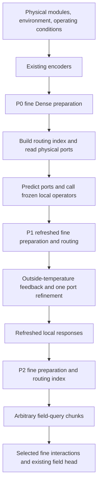

# HONF Runs 2000 / 2100 / 2200 — Mathematical Design
## Dynamic sparse routing with delayed fine interactions

**Status:** proposed research models, not implemented or experimentally validated by this document.  
**Repository:** `cosmos2w/ModularDT`, branch `agent/honf-core-next`.  
**Source inspected:** `9ae17f1eed259976336e4ad2359d95014440783f`, checked September 15, 2026.  
**Companion:** `HONF_Runs_2000_2100_2200_Codex_Implementation_Plan.md`.  
**Authorized initial training:** one fresh run per ID, at most 500 epochs each. Longer training belongs to a later user decision.

---

## 0. Read this interpretation before implementing

The attached `dynamic_sparse_hypergraph_routing.md` is the conceptual basis. Its central distinction is retained:

> A hyperedge supplies an interaction index and routing weights; it must not substitute one pooled hyperedge value for the fine source data read by a receiver.

The three strategies retain the attachment's organization:

| Run | Strategy in the attachment | Concrete proposal here |
|---|---|---|
| 2000 | Module-elected hubs | Actual modules supply a variable-size candidate bank; learned source usage elects active hubs without a separate ReLU birth/death decision. |
| 2100 | Differentiable mean-shift attractors | Three fixed-data mean-shift steps move module-seeded routing candidates; sparse usage selects candidates without discrete mode merging. |
| 2200 | Sparse dictionary / MoE-style routing | A finite 64-entry dictionary supplies virtual routing hubs; exact sparse routing selects usage. There are no 64 separate fine-response networks. |

### 0.1 Evidence, hypotheses, and deliberate changes to the source proposal

Do not silently present the following refinements as statements already established by the attachment or earlier experiments.

**Historical qualification.** Run 1401 already contains `beta(q,i)`-weighted nonlinear query–module interactions, as well as a pooled hyperedge-value path. Its pair branch is not absent. Runs 1805/1808 demonstrate useful group information but weaker reconstruction; they do not prove that pooling irreversibly destroyed particular physical frequencies. Run 1806's mature selected result is competitive with Dense, so a blanket claim that pooling is always harmful is contradicted by the available evidence. The hypothesis tested here is more specific: preserve fine source states and reduce expensive receiver–source evaluations using a cheaper learned index.

**Sparsity qualification.** Sparsemax supplies exact zero probabilities, not an automatic speedup. The previous hierarchy reduced environmental geometry rows by 87.36% at the largest tested shape but was 27.72% slower than Regional. The new executor must measure routing, enumeration, deduplication, neural work, normalization, reduction, and preparation together.

**Differentiability qualification.** The field is intended to be continuous and differentiable almost everywhere with respect to continuous design variables. Integer cardinality, support membership, and exact mode identity are not globally differentiable. No straight-through estimator, soft-training/hard-evaluation mismatch, or discrete module-count optimizer is introduced.

**Three deliberate mathematical refinements.**

1. The attachment's raw `Pi = alpha A^T` is not row-normalized when A is row-stochastic. Straight column normalization also becomes delicate when a hub's source mass vanishes. Sections 4–5 instead derive an occupancy-measure query sparsemax and cancel the potentially singular column denominator analytically. This is a proposed normalization, not a claim that the cited sparsemax paper supplied this particular HONF construction.
2. Run 2100 uses fixed source samples in its mean-shift updates, rather than repeatedly averaging the moving samples themselves. The attachment's latter update is a blurring/consensus variant; a positive broad kernel can make all candidates converge together. Both formulations are legitimate, but this first experiment targets modes of a fixed learned feature distribution.
3. Run 2200 does **not** prepend an external hard Top-C truncation to sparsemax. Such truncation can create finite output jumps at ranking ties. C is measured, not imposed. A top-C variant is deferred and must never be substituted silently.

**Scope of the first models.** All three preserve Dense 1804's fine MM/ME/EM preparation, physical wrapper, fine environmental states, common coarse/local paths, and fine response networks. They replace both expensive QM and QE receiver execution with routed execution. This is sparse receiver execution with dense preparation—not yet a fully subquadratic end-to-end solver.

**Physics qualification.** ThermalChannel currently supplies geometry, material, and operating descriptors, but no validated internal-wall/geodesic routing target. Formal runs use the same known boundary descriptors and a neutral additional barrier resistance. The resistance interface is implemented and numerically tested; a claimed physical barrier advantage requires suitable reference data. No predicted target field may enter the routing inputs as ground truth.

---

## 1. Scientific question and common physical task

For a design case b, let

\[
\mathcal D_b=(\Omega_b,\mathcal M_b,\mathcal E_b,c_b),
\]

with modules

\[
\mathcal M_b=\{(x_{bi},s_{bi},t_{bi})\}_{i=1}^{M_b}
\]

and environmental samples

\[
\mathcal E_b=\{(y_{bj},a_{bj},\nu_{bj})\}_{j=1}^{E_b}.
\]

Locations are in \(\mathbb R^d\); \(s_i\) contains module attributes; \(t_i\) is a module-type label in the general problem; \(a_j\) contains environment/boundary descriptors; \(\nu_j>0\) is a sample measure; and \(c_b\) contains global conditions. The present formal test uses the established ThermalChannel component family, not a newly validated heterogeneous component library.

The forward model predicts

\[
\widehat U_b(q)=F_\theta(q;\mathcal D_b),\qquad q\in\Omega_b,
\]

and coupled module-port, internal-temperature, surface-temperature, and flux outputs through the existing local surrogate. The global ThermalChannel channels are \(u,v,p,\omega,T\).

The question is:

> Can one shared hypergraph index preserve Dense-like fine interactions while reducing the number of expensive receiver–module and receiver–environment evaluations, without destroying useful continuous design gradients?

### 1.1 Symbols and shapes

The case index is omitted below when unambiguous.

| Symbol | Meaning | Typical batched shape |
|---|---|---|
| B | batch size | scalar |
| M, E, Q | active modules, environmental samples, receivers | scalars |
| Mpack | module storage width, not a scientific capacity | scalar |
| H | physical-response width, initially 256 | scalar |
| D | routing descriptor width, initially 32 | scalar |
| P | physical ports per module | scalar |
| Kcand | candidate routing hubs | M for 2000/2100; 64 for 2200 |
| z, e, g | input module state, environment encoding, global encoding | `[B,Mpack,H]`, `[B,E,H]`, `[B,H]` |
| ztilde, etilde | fine contextualized source states | same source shapes |
| sk, vk, rk | hub position, routing descriptor, propensity | `[B,Kcand,d]`, `[B,Kcand,D]`, `[B,Kcand]` |
| A^M, A^E | source-to-hub memberships | `[B,Mpack,Kcand]`, `[B,E,Kcand]` |
| omega^M, omega^E | normalized source measures | `[B,Mpack]`, `[B,E]` |
| mu^M, mu^E | hub measures induced by each source type | `[B,Kcand]` |
| alpha^M, alpha^E | type-specific query-to-hub probabilities | `[B,Qchunk,Kcand]` |
| d^M, d^E | query-to-hub densities relative to mu | same query–hub shape |
| Pi^M, Pi^E | effective receiver-to-source probabilities | conceptual `[B,Q,Ntype]`; production uses packed rows |
| I_M, I_E | unique retained receiver–source pair counts | integers |
| Tpath | raw two-hop path count before pair deduplication | integer |

No latent descriptor \(v_k\) is passed to the physical field head as a hyperedge value.

### 1.2 Physical passes remain P0 / P1 / P2

All three candidates use the same sequence. A router is refreshed after source states change. A prepared index may be reused across chunks of the same pass, but not across different optimizer steps or different P0/P1/P2 source states.

---

## 2. Preserve the successful fine preparation

Use the existing `DensePairwiseField.prepare_fine_messages()` without changing simultaneous update semantics. All three message types consume the input \(z_i\) of that pass:

\[
a_i^{MM}=\frac{1}{1+M}\sum_{l\ne i}\phi_{MM}(z_i,z_l,\Phi(x_i-x_l)),
\]

\[
a_i^{ME}=\frac{\sum_j\nu_j\phi_{ME}(z_i,e_j,\Phi(x_i-y_j))}{\sum_j\nu_j},
\]

\[
a_j^{EM}=\frac{1}{1+M}\sum_i\phi_{EM}(e_j,z_i,\Phi(y_j-x_i)).
\]

Coordinates supplied to \(\Phi\) use the existing coordinate-scale convention. Then

\[
\widetilde z_i=z_i+\rho_M([z_i,a_i^{MM},a_i^{ME},g]),
\]

\[
\widetilde e_j=e_j+\rho_E([e_j,a_j^{EM},g]).
\]

Inactive module outputs retain the existing presence mask. Do not feed \(\widetilde z_i\) back into EM in the same pass.

Fine source states remain separately addressable. No router replaces \(\{\widetilde z_i\}\) or \(\{\widetilde e_j\}\) by one vector per hub. Source encodings and Dense's contextual preparation are still finite-dimensional; the proposal does not claim to eliminate every information bottleneck.

The first experiments do **not** sparsify MM/ME/EM, remove coarse/local context, change Stage A, or add loss terms. These limits make failed routing distinguishable from failed collective preparation.

---

## 3. Routing geometry and lightweight descriptors

### 3.1 Case-owned geometry interface

The generic model receives an ephemeral, reconstructible case-geometry provider with:

- `features(points)`: low-dimensional environment/boundary descriptors at arbitrary coordinates;
- `resistance(a, b, relation_type)`: optional dimensionless nonnegative path-resistance values;
- physical domain bounds and a declared positive routing length scale \(\ell\in\mathbb R_+^d\).

This is a runtime interface, not a pickled callback in checkpoints and not a new service. ThermalChannel owns its wall/inlet/outlet meanings. The generic core owns sparse routing arithmetic.

For the first ThermalChannel profiles, use analytic descriptors already supported by the case's boundary geometry; set extra resistance to zero. Choose \(\ell=4r_{\mathrm{module}}\) in each spatial dimension as a soft routing scale, not a hard interaction cutoff. The multiplier is an explicit proposed hyperparameter, not a learned physical law.

### 3.2 Stable descriptor maps

Let

\[
\mathcal N(v)=\frac{v}{\sqrt{1+\|v\|_2^2}}.
\]

This bounds descriptor norms below one without dividing by a near-zero norm. Define independent shared source/receiver projections:

\[
u_i^M=\mathcal N\!\left(f_M([\widetilde z_i,\kappa(x_i),g])\right),
\]

\[
u_j^E=\mathcal N\!\left(f_E([\widetilde e_j,\kappa(y_j),g])\right),
\]

\[
u_q^Q=\mathcal N\!\left(f_Q([\Phi(q),\kappa(q),g])\right),
\]

where \(\kappa=\texttt{features}\), the f maps are two-layer SiLU MLPs with hidden width 64 and output D=32, and no target observation is used. The decoder's existing receiver Fourier encoding can be reused for \(\Phi(q)\).

Use one routing head shared by the four fine environmental-attention heads. This avoids silently multiplying the pair union by four; head-specific routing is not another experiment in this round.

### 3.3 Shared affinities

For source or receiver location a with routing descriptor u and hub \((s_k,v_k,r_k)\), use

\[
L_t(a,k)=2u^\top v_k
-\tfrac14\log\left(1+\|(a-s_k)\oslash\ell\|_2^2\right)
+\tfrac14 r_k
-\lambda_R R_t(a,s_k),
\tag{1}
\]

where t identifies source-module, source-environment, or query relations, \(\oslash\) is elementwise division, and \(r_k\in[-1,1]\). Source/receiver maps already distinguish types. The initial coefficients and normalizer temperature are fixed and shared across runs; no temperature schedule or learned inverse temperature is introduced.

The logarithmic distance penalty supplies a soft geometric preference without a fixed visibility radius. Long-range selection remains possible. The values 2 and 1/4 are starting design constants, not inferred optimums; do not sweep them inside the authorized goals.

### 3.4 Optional resistance, with physical limits

If an adapter later supplies a trustworthy resistance field \(\rho_t(x)\ge0\), one low-cost approximation is

\[
R_t(a,b)=\frac{\|b-a\|}{\ell_0}\sum_{s=1}^{S}w_s\rho_t(a+t_s(b-a)),
\qquad \sum_s w_s=1,
\tag{2}
\]

with fixed midpoint quadrature \(t_s=(s-1/2)/S\), \(w_s=1/S\), initially S=8; define \(\ell_0=(\prod_a\ell_a)^{1/d}\) and use fixed \(\lambda_R=1\) when a nonzero resistance is supplied. This is O(S) field sampling per tested route, not a sum over all E tokens per query–hub pair.

It is a line-resistance surrogate, not a geodesic or proof of disconnection. Flow can go around an obstacle; thermal and mechanical coupling can cross a material interface. An impermeable boundary is not automatically adiabatic. Module-centre endpoints may lie inside solids and need an adapter-defined interface endpoint or endpoint-body exclusion. Never infer universal zero connectivity from such geometry alone.

A supplied certified disconnected-component relation may be used as a typed eligibility mask. Without it, use finite penalties, not fabricated hard physical constraints. Known geometry tests validate implementation only; model-versus-solver barrier benefit is **Evidence Missing** until suitable data exists.

---

## 4. Source incidence: ordinary sparsemax

For each active source of type t in {M,E}, form logits \(L^t_{ik}\) and apply ordinary sparsemax across valid candidate hubs:

\[
A^t_{i:}=\operatorname{sparsemax}(L^t_{i:}),
\qquad
A^t_{ik}=[L^t_{ik}-\tau_i]_+,
\tag{3}
\]

\[
A^t_{ik}\ge0,\qquad\sum_k A^t_{ik}=1.
\]

Here sparsemax is the Euclidean projection onto the simplex [R1]. Module padding and invalid candidate padding are excluded, not made valid with an epsilon. Every nonempty source row has at least one active candidate.

For support S, its fixed-support Jacobian is

\[
J=\operatorname{Diag}(1_S)-\frac{1_S1_S^\top}{|S|}.
\tag{4}
\]

Inactive coordinates have zero local task gradient. At |S|=1 the **entire logit Jacobian is zero**. Sparsemax therefore does not guarantee exploration or revival. Shared projections and changing geometry can move logits later, but this is not an automatic revival mechanism. Record support turnover and singleton fractions rather than adding a rescue loss by default.

Define normalized source measures

\[
\omega_i^M=\frac{1}{M}\quad(M>0),
\qquad
\omega_j^E=\frac{\nu_j}{\sum_l\nu_l}.
\tag{5}
\]

The measure of hub k, separately for each source type, is

\[
\mu_k^t=\sum_i\omega_i^t A^t_{ik},
\qquad \sum_k\mu_k^t=1.
\tag{6}
\]

This is routing/source measure, not energy, a field state, or source-count occupancy. Also report actual occupancy

\[
D_k^t=\sum_i\mathbf1[A^t_{ik}>0].
\]

Do not substitute \(\sum_iA_{ik}\) for \(D_k\). For uniform assignment over many hubs those two quantities differ dramatically.

---

## 5. Query incidence: a measure-aware sparsemax and a stable two-hop product

### 5.1 Why not normalize almost-empty hub columns directly?

The familiar expression is

\[
\Pi^t_{qi}=\sum_k\alpha^t_{qk}\frac{\omega_i^tA^t_{ik}}{\mu_k^t}.
\]

A hub with \(\mu_k^t\downarrow0\) can remain assigned finite query probability unless query routing knows its source availability. Masking the hub only when its mass becomes exactly zero then creates an avoidable last-member transition. Tiny numerical denominators are also undesirable after Run 1701.

Instead define query probabilities through the same source measure.

### 5.2 Variational definition

Given query–hub logits \(z_{qk}=L_Q(q,k)\), define

\[
\alpha_q^t
=\arg\max_{p\in\Delta,\ p_k=0\text{ if }\mu_k^t=0}
\left[
\sum_k p_k z_{qk}
-\frac12\sum_{k:\mu_k^t>0}\frac{p_k^2}{\mu_k^t}
\right].
\tag{7}
\]

The objective is strictly concave on occupied coordinates. Its KKT conditions give

\[
d_{qk}^t=[z_{qk}-\tau_q^t]_+,
\qquad
\alpha_{qk}^t=\mu_k^t d_{qk}^t,
\tag{8}
\]

with the unique threshold satisfying

\[
\sum_k\mu_k^t[z_{qk}-\tau_q^t]_+=1.
\tag{9}
\]

This is a measure-weighted simplex projection derived for this proposal. With identical measures it reduces to a rescaled ordinary sparsemax. It is not numerically identical to applying ordinary sparsemax to unscaled logits; the distinction must be in the code and documentation.

For sorted occupied logits \(z_{(1)}\ge\cdots\), the active prefix has

\[
\tau_r=\frac{\sum_{k\le r}\mu_{(k)}z_{(k)}-1}{\sum_{k\le r}\mu_{(k)}}.
\tag{10}
\]

Select the largest consistent prefix and use ordinary autograd through the selected sums on a fixed support. Zero-mass coordinates are excluded from prefix arithmetic. Implement without `0 * (-inf)` and without a CPU threshold solve.

### 5.3 Cancel the denominator before execution

Substitute (8) into the two-hop product:

\[
\boxed{
\Pi^t_{qi}=\omega_i^t\sum_k A^t_{ik}d_{qk}^t.
}
\tag{11}
\]

There is **no division by \(\mu_k\)** in the executable expression. Normalization follows:

\[
\sum_i\Pi^t_{qi}
=\sum_k\mu_k^t d_{qk}^t=1.
\tag{12}
\]

Thus the construction retains the attachment's query–hub–source index, but gives it unambiguous probabilistic normalization, source-density consistency, and a non-singular empty-hub limit.

The module and environment distributions have distinct \(\tau_q^M\) and \(\tau_q^E\). One type need not read an empty hub just because the other type uses it. They share hub identity and descriptor logits, not necessarily query probabilities.

### 5.4 Important properties

**Common-shift invariance.** Shifting every query logit by a constant shifts tau by the same constant and leaves d and Pi unchanged. There is no learned null competitor or logit-offset branch-shutdown mechanism.

**Uniform reference.** When all query–hub logits are equal, \(d_{qk}=1\) on occupied hubs and \(\Pi^t_{qi}=\omega_i^t\), regardless of source clustering. This gives an exact Dense read reference in Section 6.

**Source duplication consistency.** Splitting an environmental token into identical copies with split quadrature mass preserves mu and splits Pi in the same proportions. Fine environmental attention then remains invariant within normal floating-point error. Ordinary sparsemax directly over environmental token count would not supply this property automatically.

**Hub splitting consistency.** Duplicating a hub's identical query logits and explicitly splitting its supplied source incidences between the copies preserves the effective Pi. This is a conditional identity of the two-hop operator. Recomputing ordinary source sparsemax after duplicating raw candidate logits need not produce those split incidences and is not claimed invariant. Duplicate candidates still consume execution cost.

**Vanishing hub.** For finite bounded logits, as a hub's source assignments vanish, its contribution to Pi vanishes. No independently renormalized column can retain finite influence after its last membership disappears.

**Single-hub outcome.** If all sources use one hub, Pi becomes the source measure and the fine read becomes Dense-like. This may fail the efficiency objective, but it does not collapse all physical values into one hyperedge embedding. Unlike the residual-organizer failure, K=1 need not imply a rank-one physical content state.

**Bounded threshold conditioning.** If occupied logits have range Rz, active total hub measure is at least \(1/(1+R_z)\): every density is at most \(1+R_z\), while their measure-weighted sum is one. Fixed bounded content scores help avoid tiny active-measure denominators; this is not a global gradient bound for the full network. The same bound limits achievable concentration: modest logit contrast cannot select an arbitrarily tiny fraction of source measure. This deliberate tradeoff must be measured using logit ranges, active hub mass, and actual source support. Do not promise extreme sparsity from these starting coefficients or silently lower the routing temperature to force it.

### 5.5 Gradients and support transitions

For fixed active hub set S and fixed mu,

\[
\frac{\partial\alpha}{\partial z}
=\operatorname{Diag}(\mu_S)
-\frac{\mu_S\mu_S^\top}{\sum_{k\in S}\mu_k}.
\tag{13}
\]

For perturbations in positive active measures,

\[
\frac{\partial\tau}{\partial\mu_k}
=\frac{z_k-\tau}{\sum_{l\in S}\mu_l}.
\tag{14}
\]

Do not detach mu, source incidence, threshold sums, or selected path weights. Only integer indexing is treated as locally fixed during autograd.

The weighted projection and ordinary sparsemax are continuous piecewise-defined maps. Their derivatives can jump at support changes. Adding/removing a **zero-weight** fine pair is consistent with a continuous output; deleting a positive pair because of a hard occupancy budget is a different, discontinuous operation and is not permitted in the canonical model.

An independent float64 toy derivation check during planning verified row mass, common-shift invariance, split-source invariance, an empty-hub limit, and finite-difference gradients of (3)–(11). This is mathematical prototype evidence only, not an executed HONF model, CUDA result, or trained-performance claim.

---

## 6. Delayed fine interaction: both module and environmental reads

Sparsifying QM alone would leave Dense's often dominant QE geometry/read work unchanged. Therefore all three profiles use both typed Pi matrices, with one shared hub construction.

### 6.1 Module read

Only for \((q,i)\) with \(\Pi^M_{qi}>0\), evaluate the unchanged Dense micro-network

\[
p^M_{qi}=\psi_Q([\widetilde z_i,\Phi(q-x_i),g]).
\]

Then

\[
\boxed{
c_M(q)=W_O\left[\frac{M}{1+M}\sum_{i:\Pi^M_{qi}>0}\Pi^M_{qi}p^M_{qi}\right].
}
\tag{15}
\]

`W_O` includes the inherited output bias. When Pi is uniform 1/M this equals Dense's module read, including its `1+M` amplitude convention. Merely replacing the Dense sum by a probability-weighted sum without the factor M/(1+M) would change amplitude unintentionally.

For M=0, keep the inherited zero-message/output-bias semantics explicitly; do not divide by M. The ordinary data has active modules, but the generic numerical test must define the empty-source case.

### 6.2 Environmental read

Preserve every fine contextual environmental key/value. Project them once per physical preparation. For every retained \((q,j)\), calculate the original fine environmental attention score for head h:

\[
s_{qjh}=\frac{Q_h(q)^\top K_h(\widetilde e_j)}{\sqrt{d_h}}
+b_{\theta h}(q-y_j).
\]

The sparse routing prior supplies the measure:

\[
\boxed{
w_{qjh}=\frac{\Pi^E_{qj}e^{s_{qjh}}}{\sum_{l:\Pi^E_{ql}>0}\Pi^E_{ql}e^{s_{qlh}}},
\quad
c_E(q)=W_E\operatorname{concat}_h\sum_{j:\Pi^E_{qj}>0}w_{qjh}V_h(\widetilde e_j).
}
\tag{16}
\]

Do **not** multiply by nu again: Pi already includes environmental quadrature via omega. With equal query–hub logits, Pi=nu/sum(nu), and (16) is Dense environmental attention. The fine geometry MLP and fine query/key products occur only after unique pair selection.

The environmental operator remains the existing attention micro-interaction, not an extra invented QE MLP. Its fine keys/values are not hub-pooled.

For stable execution, use positive priors only and a stable weighted normalization. Keep tiny scalar-weight algebra in sufficient precision; avoid constructing an FP32 `log(Pi)` backward that overflows through `1/Pi` before cancellation. A scalar FP64 reference and dense oracle must distinguish genuine conditioning from implementation overflow. The H-wide messages and values remain in the model dtype.

### 6.3 Complete output and attribution boundary

\[
c(q)=c_M(q)+c_E(q)+c_{\mathrm{coarse}}(q)+c_{\mathrm{local}}(q),
\]

\[
\widehat U(q)=D_\theta([\Phi(q),\operatorname{LN}(c(q)),g,\text{existing query features}]).
\tag{17}
\]

The common eight-token coarse and compact local paths remain exactly as in Dense for all three first tests. Routing hubs have **no value-to-field path**. Existing source preparation and common contexts still contain aggregation; this study targets premature hyperedge substitution, not all useful aggregation.

The hypergraph is not the sole physical information bus. A module can affect another contextual source, global descriptors, local correction, and physical port heads. An omitted fine pair has zero direct fine-read contribution; it does not imply zero total physical derivative of that module.

---

## 7. Run 2000 — Module-elected routing hubs

### 7.1 Candidate construction

Every active module supplies one candidate:

\[
K_{\mathrm{cand},b}=M_b,\quad s_k=x_k,\quad v_k=u_k^M.
\tag{18}
\]

A two-layer SiLU propensity head with hidden width 64, shared across candidates, produces

\[
r_k=\tanh f_{\mathrm{hub}}([v_k,\kappa(s_k),g]).
\tag{19}
\]

All candidates participate in source-affinity scoring. There is no `ReLU(propensity)>0` prefilter and no forced self-edge. Propensity affects (1); sparse source incidence elects the hubs that are actually used.

Build A^M/A^E, mu^M/mu^E, sparse query densities, unique typed pairs, and the reads (15)–(17). Topology is refreshed at every physical preparation.

### 7.2 What dynamic K means here

Report separately:

\[
K_{\mathrm{source}}=|\{k:\mu_k^M+\mu_k^E>0\}|,
\]

\[
K_q^t=|\{k:\alpha^t_{qk}>0\}|,
\qquad N_q^t=|\{i:\Pi^t_{qi}>0\}|.
\]

Ksource is case/preparation-specific and independent of the requested query chunk. Query-union counts depend on the chosen receiver set and must be labelled as such. The model is **module-induced candidate capacity with sparse effective election**, not differentiable integer birth/death of independent physical mechanisms.

For M=0, use one neutral background routing candidate for the E route only, with no module route. This explicitly defined empty-set case introduces no trainable global fallback bank. It is a numerical definition, not an additional learned predictor.

### 7.3 Expected benefit and failure interpretation

Module anchors are permutation-equivariant and move with physical design. No parameter matrix has width M. However, two-hop occupancy can still make Nq=M or E. If so, report loss of computational sparsity rather than forcing more hubs or adding capacity penalties.

This is the principal candidate: the least extra candidate-generation work, one shared propensity function, and a direct relationship between physical modules and routing identity.

---

## 8. Run 2100 — Fixed-data mean-shift routing attractors

### 8.1 Changed component only

The fine executor, source membership, query normalization, and physical loop are identical to Run 2000. Replace only candidate location/descriptor generation.

Let fixed per-pass samples be

\[
b_j=[x_j\oslash\ell,\ u_j^M],
\qquad a_k^{(0)}=b_k.
\]

For exactly T=3 steps,

\[
\log K_{kj}^{(t)}
=-\tfrac12\|a^{x,(t)}_k-x_j\oslash\ell\|^2
-\tfrac{1}{2\sigma_f^2}\|a^{f,(t)}_k-u_j^M\|^2
-\lambda_R R(s_k^{(t)},x_j),
\]

\[
p_{kj}^{(t)}=\operatorname{softmax}_{j\in\mathrm{active}}\log K_{kj}^{(t)},
\qquad
\boxed{a_k^{(t+1)}=\sum_jp_{kj}^{(t)}b_j.}
\tag{20}
\]

Initially \(\sigma_f=1\). The sources \(b_j\) stay fixed during these three steps; they are not detached from gradients. Only the attractor candidates move. Use log-space softmax rather than underflow-prone raw exponent/division.

The final hub position is \(s_k=\ell\odot a_k^{x,(T)}\), the descriptor is \(v_k=a_k^{f,(T)}\), and propensity is (19). Convex combinations keep descriptor norms bounded; no new per-candidate response network is needed.

### 8.2 What is not implemented

Do not run until numerical convergence, merge candidates by coordinate tolerance, compute a union-find clustering in the trainable path, add step embeddings, create learned integer K labels, or use a straight-through deduplication rule.

Retain M candidates. Several may approach the same mode. Ksource is still defined by exact routing use, while minimum pair distance, drift distance, and an explicitly tolerance-labelled *diagnostic* approximate mode count describe attraction. The diagnostic mode count never changes output computation.

Classical mean-shift convergence statements apply under their stated density/kernel assumptions [R4]. The learned embedding, finite iteration count, and optional environment-dependent resistance here do not inherit an unrestricted convergence guarantee. In particular, a strong Gaussian bandwidth can merge mechanisms; that is an observable failure, not something to hide with a diversity penalty.

### 8.3 Scientific question and cost

Does moving routing anchors away from literal module centres improve grouping of response-relevant interactions at the same fine read capacity?

Additional cost is approximately O(T M² D), with three short tensor iterations. This is not the old H-wide sequential residual-extraction algorithm, but it is still extra serial preparation. Any benefit must pay for it in accuracy or measured end-to-end cost.

---

## 9. Run 2200 — Finite sparse routing dictionary

### 9.1 Candidate construction

Use Kmax=64 virtual routing entries:

\[
v_k=\mathcal N(V_k),\qquad
s_k=l+(u-l)\odot\sigma(a_k),
\tag{21}
\]

where l/u are case-owned domain bounds, \(V_k\in\mathbb R^D\) and \(a_k\in\mathbb R^d\) are trainable, and propensity is (19). Initialize anchor fractions to a deterministic space-filling interior cover and V to modest distinct random values using the run seed. Avoid saturated sigmoid endpoints.

This is normalized-domain anchoring; it is not scale/translation equivariance for arbitrary domain expansion. Its transfer limits must be reported. It allows routing centres without a matching physical module, including candidate environmental response locations.

Apply the same source and query projections (3)–(11). Occupied dictionary entries can be compacted in prepared execution after source membership is evaluated. All candidate source logits are recomputed on the next physical pass, so an entry is not permanently deleted.

### 9.2 Why this is MoE-style routing, not an infinite expert model

There is one shared fine module kernel and one shared fine environmental reader. Entries V do not own expert MLPs. This isolates topology generation from response-capacity changes.

Kmax=64 is finite. Dormant entries still occupy parameters and optimizer state; source scoring costs O((M+E)Kmax D), and query scoring still has dictionary cost. Unselected parameters may have zero direct task gradients, but weight decay and stored optimizer moments can still change them. No zero-resource or infinite-capacity claim is allowed.

The reference to MoE concerns conditional routing and dispatch [R6–R7], not an exact implementation of Shazeer-style independent experts.

### 9.3 Why hard Top-C is absent

Consider logits with top entries \((0.8,0.5+\epsilon,0.5)\). Hard top-2 followed by sparsemax assigns approximately 0.35 probability to one of the tied candidates. As epsilon changes sign, that finite weight switches identity, which can produce a finite jump in the output if the corresponding values differ.

Sparsemax alone introduces/removes a coordinate at zero weight and is continuous; the separate hard top-2 preselection is not. Therefore the canonical model uses no Top-C preselection, token dropping, expert-capacity truncation, or straight-through dispatch. Record the realized supports. If they are too dense, the computational hypothesis has failed for this configuration; do not hide that by changing execution support at evaluation.

A future explicit Top-C model would be a separately named approximation with its own continuity and accuracy evidence.

---

## 10. Sparse execution semantics

### 10.1 Two-hop join and pair deduplication

For source type t, build inverted hub-to-source lists once per preparation from positive A rows. At a receiver chunk, retain positive density rows with positive mu. Enumerate paths

\[
\mathcal T^t=\{(b,q,k,i):d^t_{bqk}>0,\ A^t_{bik}>0,\ \mu^t_{bk}>0\}.
\]

The path weight is

\[
\zeta_{bqki}^t=\omega_{bi}^t A^t_{bik}d^t_{bqk}.
\]

Coalesce by unique \((b,q,i)\):

\[
\Pi^t_{bqi}=\sum_{k:(b,q,k,i)\in\mathcal T^t}\zeta^t_{bqki}.
\tag{22}
\]

Only now call the H-wide fine micro-network. Evaluate a pair once even if it has several hub paths. Sorting/grouping may manipulate integer keys; selected weights must remain attached to autograd.

A dense scalar routing implementation is a correctness oracle, not the production path. Production must not create `[B,Q,K,N]` path tensors or compute all fine pairs and mask them afterward.

### 10.2 Occupancy controls the real complexity

Let \(C_q^t\) be positive query hubs and \(D_k^t\) actual source occupancy. Then

\[
N_q^t\le\min\left(N_t,\sum_{k\in C_q^t}D_k^t\right).
\]

This is not bounded by C² unless a separate occupancy bound has been established. No occupancy penalty or cap is included initially.

A fine pair's zero contribution is exact within the model. It is not evidence that the omitted physical source is irrelevant. Test that claim against error and interventions.

### 10.3 Full ledger

Ignoring hidden constants, one prepared field costs

\[
C_{\mathrm{total}}
=C_{\mathrm{Dense\ prep}}(M^2,ME)
+C_{\mathrm{candidate}}
+C_{\mathrm{source\ routing}}((M+E)K D)
\]

\[
+\ C_{\mathrm{query\ routing}}(QK D,\ QK\log K)
+C_{\mathrm{join}}(|\mathcal T^M|+|\mathcal T^E|)
+C_{\mathrm{fine}}(I_M,I_E)
+C_{\mathrm{common}}.
\tag{23}
\]

Run 2100 adds T M² D candidate work. Run 2200 replaces M by a finite Kmax in candidate scoring. The generic scalar route discovery may still be dense even when expensive neural fine work is sparse. This is explicitly permitted and counted; full asymptotic sparsity is not claimed.

Use bounded neural row tiles and receiver chunks, not per-query Python loops. Avoid retaining `[I,H]` intermediates for all paths when tiled weighted reductions suffice. Route exports and profiling are opt-in. Real GPU traces, not row counts, determine whether sparse dispatch pays for itself. Content-based clustering already supplies routing indexes in Routing Transformers [R12]; the intended novelty is therefore the physical interface problem and a demonstrated computation/accuracy advantage, not the existence of a learned index alone. The 2026 CLSA preprint [R13] further highlights routing-index overhead and amortization. Its cross-layer KV-sharing setting does not permit stale index/state reuse across HONF physical preparations: only work with compatible unchanged inputs may be reused here.

---

## 11. Inverse-design and topology claims

The three models provide gradients for positions and continuous attributes through descriptors, selected route weights, direct fine interactions, source contextualization, and the physical loop. They do not solve discrete insertion/deletion or select a globally optimal topology.

Run 2000: candidate positions follow modules.  
Run 2100: candidate positions also drift continuously in a learned joint space.  
Run 2200: dictionary anchors adapt during training but do not become newly instantiated physical entities at inverse inference.

Active-support boundaries need one-sided/central difference tests with recorded membership. Inactive source memberships and singleton sparsemax rows may provide no routing gradient. Entmax can change boundary smoothness [R2–R3], but it does not guarantee revival of a strictly zero route or solve integer cardinality. Do not add noise, a curriculum, gate penalties, or dual dense/sparse training without a later explicit research decision.

A physical module can influence other retained source states through Dense preparation even when its direct QM edge is absent. Conditional direct-edge tests freeze that upstream context; full physical derivatives do not. These must never be conflated.

Field-error accuracy does not imply accurate design gradients. The existing pending solver requests remain pending. Model AD/FD establishes self-consistency only.

---

## 12. Research criteria and what would establish hypergraph value

The first comparison is against Legacy 1401 and Dense 1804 at matched epochs. Regional 1806 and Latent 1801 remain contextual comparators using existing tables.

A promising result needs useful reconstruction and an actual accuracy–latency–memory tradeoff. Specifically inspect p95/worst cases, vorticity, temperature, ports/internal/surface response, flux, and pressure/outlet KPIs—not only aggregate MSE.

The graph claim requires more than nonzero routing activity:

- routing hubs change only the selected paths/weights, not value content directly;
- the same prepared source/routing infrastructure serves physical ports and queries;
- shared hub indexing saves enough routing or fine work to offset dispatch;
- selected fine interactions retain useful collective physical response;
- geometry-conditioned routes remain numerically usable under continuous design perturbations.

This does not establish a uniquely hypergraphic function class. An incidence-graph attention implementation can express the same factorization. A matched trained direct sparse pairwise router remains the clean later control for a stronger claim that hypergraph factorization improves over equally sparse pairwise attention. It is **not** silently added as a fourth run in this round.

No required K histogram, balanced expert use, or minimum fraction of branch norm is a success criterion. Dense collapse may preserve accuracy and fail efficiency; excessive fragmentation may preserve fine detail and fail cost. Report those outcomes directly.

---

## 13. Default configurations shared by the three runs

| Setting | Proposed value |
|---|---|
| `forward_architecture` | `routed_pairwise_honf` |
| `interface_model.routing.strategy` | `module_hubs`, `mean_shift`, or `dictionary` |
| response/message width | inherited 256 / 128 |
| fine environmental heads | inherited 4 |
| route descriptor width | 32 |
| source normalizer | ordinary sparsemax |
| query normalizer | source-measure sparsemax, Section 5 |
| route temperature | 1, fixed |
| candidate propensity | bounded shared tanh scalar |
| routing length | adapter's 4 module radii; no cutoff |
| mean-shift steps / feature bandwidth | 3 / 1, Run 2100 only |
| dictionary capacity | 64, Run 2200 only |
| Top-C / occupancy cap | absent |
| extra barrier mode in ThermalChannel | neutral; boundary descriptors still active |
| fine source preparation | unchanged Dense MM/ME/EM plus fine env update |
| coarse/local paths | unchanged Dense defaults |
| additional losses / ST estimators | none |
| epochs | 500 maximum in each current goal |
| initialization | from scratch; no parent weights or optimizer reused |

These are testable starting settings, not established optimal values. The coding plan gives exact ownership, numerical references, run commands, and evaluation deliverables.

---

## 14. Primary references and their actual support

Each item states the relevant contribution and the limitation of borrowing it. No language-model speedup is treated as an HONF speedup.

**[R1] Martins & Astudillo (ICML 2016), “From Softmax to Sparsemax.”** Exact zeros, simplex projection, support-dependent Jacobian. Supports Equation (3), not a guarantee of correct physical support or sparse execution. https://proceedings.mlr.press/v48/martins16.html

**[R2] Peters, Niculae & Martins (ACL 2019), “Sparse Sequence-to-Sequence Models.”** Entmax family and efficient transforms/gradients. Relevant to a later activation comparison, not an automatic cure for dead routes. https://aclanthology.org/P19-1146/

**[R3] Correia, Niculae & Martins (EMNLP 2019), “Adaptively Sparse Transformers.”** Learned attention sparsity preferences in NLP. It does not establish that attention support is physical causality. https://aclanthology.org/D19-1223/

**[R4] Comaniciu & Meer (TPAMI 2002), “Mean Shift: A Robust Approach Toward Feature Space Analysis.”** Fixed-density mode seeking under stated assumptions. Exact mode merging is a distinct operation. https://doi.org/10.1109/34.1000236

**[R5] Kong & Fowlkes (CVPR 2018), “Recurrent Pixel Embedding for Instance Grouping.”** End-to-end recurrent mean-shift-style grouping in learned embeddings. It is a precedent for differentiable finite iterations, not literal differentiable cluster cardinality. https://openaccess.thecvf.com/content_cvpr_2018/html/Kong_Recurrent_Pixel_Embedding_CVPR_2018_paper.html

**[R6] Shazeer et al. (ICLR 2017), “Outrageously Large Neural Networks: The Sparsely-Gated Mixture-of-Experts Layer.”** Conditional expert execution and routing difficulties. Run 2200 borrows the routing idea, not a large bank of expert networks. https://arxiv.org/abs/1701.06538

**[R7] Gale et al. (MLSys 2023), “MegaBlocks.”** Sparse dispatch, padding/token-dropping tradeoffs, and block-sparse GPU execution. Supports measuring the dispatch ledger rather than assuming zeros imply speed. https://proceedings.mlsys.org/paper_files/paper/2023/hash/5a54f79333768effe7e8927bcccffe40-Abstract-mlsys2023.html

**[R8] Gonçalves, Treviso & Martins (ICML 2025), “AdaSplash: Adaptive Sparse Flash Attention.”** Exact sparse activations need suitable GPU implementations to become fast and memory-efficient. Its kernels target attention, not this nonlinear pair MLP. https://proceedings.mlr.press/v267/goncalves25a.html

**[R9] Yuan et al. (2025), “Native Sparse Attention.”** Coarse selection together with fine token access and hardware-aligned computation. A direct methodological precedent for delayed fine reads; no physical-validity implication. https://arxiv.org/abs/2502.11089

**[R10] Lu et al. (2025), “MoBA: Mixture of Block Attention.”** Routing to groups of original keys/values instead of treating pooled descriptors as final values. A particularly relevant comparison for the routing-not-content-compression thesis. https://arxiv.org/abs/2502.13189

**[R11] Chien et al. (ICLR 2022), “You Are AllSet.”** Hypergraph node–group computations can use set/attention functions. Hypergraph value must lie in relational structure and reuse, not claims that attention cannot implement it. https://arxiv.org/abs/2106.13264

**[R12] Roy, Saffar, Vaswani & Grangier (TACL 2021), “Efficient Content-Based Sparse Attention with Routing Transformers.”** Content-based routing using online clustering is a direct predecessor for learned interaction indexing. Its sequence-model complexity is not a complexity theorem for HONF's dense preparation plus sparse nonlinear pair reads. https://aclanthology.org/2021.tacl-1.4/

**[R13] Sun et al. (2026 preprint), “You Only Index Once: Cross-Layer Sparse Attention with Shared Routing.”** Studies amortizing routing-index work in compatible KV-sharing language-model layers. Relevant to the cost ledger and valid reuse scope, not permission to reuse stale source-dependent HONF routes across P0/P1/P2 or optimizer steps. Preprint status, not claimed peer-reviewed validation of this design. https://arxiv.org/abs/2606.06467

**Repository evidence.** Dense implementation: `src/honf_forward_core/interface_fields/dense_pairwise.py`; core facade and prepared-state types in the same directory; generic configuration in `src/honf_forward_core/config.py`; physical adapter in `Case_ThermalChannel/src/channelthermal/input_adapter.py`; current report `docs/reports/HONF_NStage2_Comparison_Report.md`. The latest inspected commit adds Stage-7 decoder-context ablations (1402/1403 profiles); their existence supplies no new experimental result and they must remain unchanged.

**Input evidence.** `dynamic_sparse_hypergraph_routing.md` supplies the strategy taxonomy and cautions about differentiability/occupancy. `HONF_Five_Model_Epoch5000_Comparison_Report.md` and `HONF_NStage2_Comparison_Report.md` supply the mature numerical conclusions. This document proposes new models; none of their accuracy, sparsity, or speed outcomes is asserted in advance.
