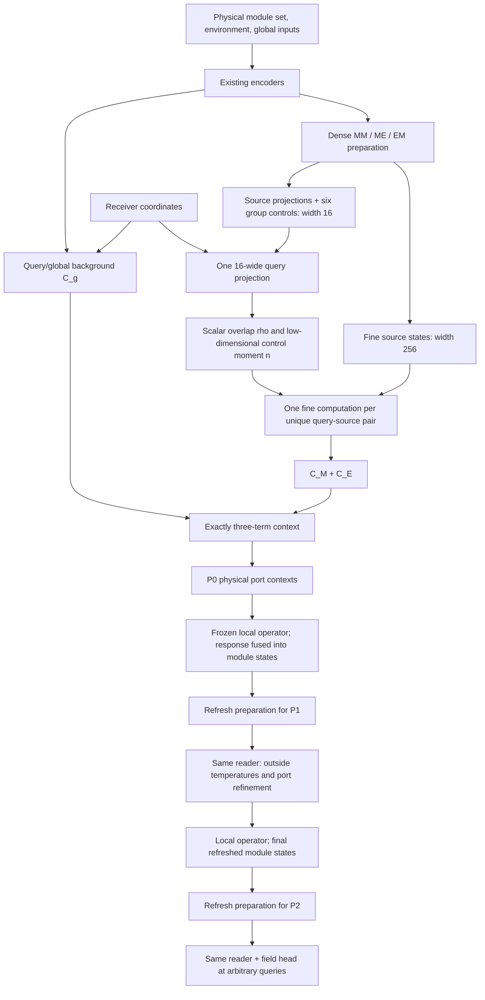

# Run 1406 — Low-Dimensional Group-Control HONF

**A new operator that collapses group logic before evaluating fine physical pairs**  
**Repository:** `cosmos2w/ModularDT` · **branch:** `agent/honf-core-next`  
**Planning-time code inspected:** `085def96dcb349bde264515e115cad79ad43c34f`  
**New architecture:** `group_control_pairwise_honf`  
**Authorized training:** one fresh Run 1406 to epoch 50; conditional continuation of the same run to total epoch 500; nothing beyond 500 without another user instruction.

---

## 0. Executive decision and scope

Run 1405 should remain stopped. Its three-term model trained, but it multiplied expensive physical interaction work across overlapping groups. Run 1406 preserves the useful intent—collective group information changes fine source–receiver interactions—while changing where the group dimension is eliminated.

The defining change is:

\[
\underbrace{\sum_k\gamma_{qsk}\,F(q,s,h_k)}_{\text{1405: expensive function once per group path}}
\quad\longrightarrow\quad
\underbrace{F_{1406}(q,s,\rho_{qs},n_{qs})}_{\text{1406: one expensive function per physical pair}},
\]

where

\[
\gamma_{qsk}=\alpha_{qk}A_{sk},\qquad
\rho_{qs}=\sum_k\gamma_{qsk},\qquad
n_{qs}=\sum_k\gamma_{qsk}h_k.
\]

The group control vector has width **16**, not 256. Fine physical source states retain width **256**. All first-candidate temperatures stay fixed at one; group count stays six.

The complete field still uses exactly

\[
\boxed{C(q)=C_g(q)+C_M(q)+C_E(q),\qquad
\widehat U(q)=D_\theta\!\left(\operatorname{LN}C(q)\right).}
\]

There is no coarse latent bank, near/local correction, direct pooled-group value, extra expert, pair-cost loss, dynamic-count generator, or separate dense-output fallback.

**Two qualifications are essential.**

1. Moving group aggregation through a nonlinear function is generally **not an exact refactor of 1405**. Run 1406 is a new, more economical hypothesis and trains from scratch. It preserves group dependence, not every function available to the 1405 triadic ensemble.
2. At-most-one fine evaluation per physical pair is a structural work bound, **not a wall-clock guarantee**. The learned support may remain dense; control and preparation still cost time. The epoch-50 comparison measures the actual result against Dense 1804.

The three work stages are: **I. implement and execute**, **II. train to 50 and make an empirical budget decision**, **III. continue to 500 only when justified, then stop and wait**.

---

## 1. What is established, and what remains a hypothesis

### 1.1 Source basis

This plan uses the user's Run-1405 closeout summary and the pinned source files listed in Section 23. The local `comparison.json`, profiler traces, checkpoint tensors, and evidence-board PDF were not independently replayed while drafting this document. Codex has access to the local run and should use its existing artifacts rather than duplicate them.

The reported epoch-50 evidence is:

| Quantity | Run 1405 | Dense 1804 |
|---|---:|---:|
| Validation field MSE | 0.271340 | 0.219339 |
| Case-0273 full forward | 209.690 ms | 33.364 ms |
| Case-0273 prepared P2 read | 142.583 ms | 13.358 ms |
| Case-0653 full forward | 178.883 ms | 35.838 ms |
| M12 optimizer step | 5111.777 ms | 2139.864 ms |
| M12 allocated peak | 29746.07 MiB | 26783.75 MiB |
| Case-0273 grouped module work / dense | 3.146 | 1 |
| Case-0273 grouped environment work / dense | 4.730 | 1 |
| Case-0653 grouped module work / dense | 2.093 | 1 |
| Case-0653 grouped environment work / dense | 3.345 | 1 |

The training trajectory improved and required gradients/updates were finite. That does not establish mature accuracy or a physical advantage from conditioning, but it does rule out describing this particular result as another observed numerical shutdown.

### 1.2 The mathematical failure

For one source type, define positive-support indicators

\[
U_{qk}=\mathbf 1[\alpha_{qk}>0],\qquad S_{sk}=\mathbf 1[A_{sk}>0].
\]

Run 1405 executes

\[
P_{\mathrm{triple}}=\sum_{q,s,k}U_{qk}S_{sk}
=\sum_{q,s}m_{qs},\qquad m_{qs}=\sum_kU_{qk}S_{sk}.
\]

The same physical pair can have multiplicity six. These were genuinely different group-conditioned functions, not redundant index entries that could be discarded without changing the model.

Since \(P_{\mathrm{triple}}/(QN)\le s_Q\) and also \(\le s_S\), the reported environmental ratio 4.730 implies that both mean query-group degree and mean environment-group degree are at least 4.730 out of six. Exact zeros did not yield low overlap.

### 1.3 The code-level costs

The current `fixed_group_pairwise.py` additionally:

- computes source/group MLPs on full `[B,M,K,H]` and `[B,E,K,H]` banks before using sparse membership;
- constructs full-width query/group descriptors before selection;
- repeatedly reconstructs support and coordinate order in receiver chunks;
- uses gathered dot products, segmented normalization, and per-head sparse COO matrix multiplication for broad environmental supports.

These are visible execution choices. Their individual shares of the measured latency require a profiler; this plan does not invent those shares.

### 1.4 What 1406 tests

Run 1406 asks whether a **low-dimensional collective control moment** can modulate individually retained fine source states well enough to avoid the expensive group ensemble.

It does not assume that all pooling is harmful, that all group moments are sufficient, that entmax will learn useful sparsity, or that a fixed group count has a unique physical interpretation.

---

## 2. Design boundaries

### Retain

- `InterfaceFieldCore` encoding and prepare/read interface;
- Dense 1804's simultaneous fine MM/ME/EM preparation and environmental update;
- separate fine module and environment states;
- the existing frozen local surrogate and predicted-port physical sequence;
- the 1405 `ThreeTermInterfaceContext`, unchanged;
- six group identities and entmax15 source/query assignments at fixed temperature one;
- existing data, normalization, losses, AdamW policy, seed, output channels, and Fourier conventions.

### Replace

- the H-wide 1405 router with a **16-wide control router**;
- per-group source-value networks with **one source-value bank per source type**;
- per-group fine reads with **one read per unique physical pair**;
- normalized conditional control vectors that divide by small overlap with **unnormalized bounded control moments**;
- repeated group-path construction with small tiled contractions over the six group columns.

### Do not introduce

Additional losses, balance targets, mandatory group occupancy, physical barrier assumptions, top-C pruning, straight-through estimators, temperature schedules, new precision modes, source grouping heuristics, custom CUDA/Triton kernels, or a fourth context branch.

The first candidate tests one coherent factorization. Do not turn a slow smoke test into an architecture sweep.

---

## 3. Symbols and shapes

The batch index is suppressed in equations unless needed.

| Symbol | Meaning / shape |
|---|---|
| \(B\) | Batch size |
| \(M_a\), \(M_p\) | Active and packed module counts |
| \(E\) | Environmental token count; normally 192 |
| \(Q\) | Receiver count for the current read |
| \(K=6\) | Fixed group count |
| \(H=256\) | Fine physical state width |
| \(D=16\) | All group/control/code feature widths |
| \(J=128\) | Fine QM MLP hidden width, as in Dense 1804 |
| \(n_h=4\), \(d_h=H/n_h\) | Environmental attention heads and width |
| \(x_i,f_i,p_i\) | Module coordinate, attributes, and presence mask |
| \(y_j,a_j,\nu_j\) | Environmental coordinate, descriptors, positive quadrature mass |
| \(g\in\mathbb R^H\) | Encoded case-wide information |
| \(z_i^\star,e_j^\star\in\mathbb R^H\) | Dense-contextualized fine source states |
| \(A^M\in\mathbb R^{B\times M_p\times K}\) | Module-to-group memberships |
| \(A^E\in\mathbb R^{B\times E\times K}\) | Environment-to-group memberships |
| \(h\in\mathbb R^{B\times K\times D}\) | Bounded, signed group control states |
| \(\alpha\in\mathbb R^{B\times Q\times K}\) | Shared query-to-group distribution |
| \(\rho^t_{qs}\) | Scalar overlap for source type \(t\in\{M,E\}\) |
| \(n^t_{qs}\in\mathbb R^D\) | Mass-weighted group control moment |
| \(\mathcal S_t(q)\) | Unique sources with positive overlap |
| \(s_q^t\) | Source-measure-weighted total overlap, not a physical energy |

Use `D`, not `R`, for control width to avoid confusing it with a work ratio or regional count.

---

## 4. Encoding and physical preparation: reuse the successful part

Use the current new-family encoders:

\[
g=E_g(c),\quad
z_i=E_f(f_i)+E_x(\Phi(x_i/\ell)),\quad
e_j=E_e([\Phi(y_j/\ell),a_j]).
\]

Here \(\ell\) is the existing coordinate-normalization scale. It is not automatically a physical domain boundary or a quadrature measure. Do not broadcast a second global token into every environmental state.

At each physical preparation pass, use the incoming module states for **all three** message families:

\[
a_i^{MM}=\frac{\sum_{l\ne i}p_l\,\phi_{MM}(z_i,z_l,\Phi((x_i-x_l)/\ell))}{1+M_a},
\]

\[
a_i^{ME}=\frac{\sum_j\nu_j\,\phi_{ME}(z_i,e_j,\Phi((x_i-y_j)/\ell))}{\sum_j\nu_j},
\]

\[
a_j^{EM}=\frac{\sum_i p_i\,\phi_{EM}(e_j,z_i,\Phi((y_j-x_i)/\ell))}{1+M_a}.
\]

Then

\[
z_i^\star=p_i\{z_i+\rho_M([z_i,a_i^{MM},a_i^{ME},g])\},
\qquad
e_j^\star=e_j+\rho_E([e_j,a_j^{EM},g]).
\]

Reuse `DensePairwiseField.prepare_fine_messages()` and its environmental update. In particular, do not feed the newly updated module state into EM in the same pass: that would change the reference preparation.

This still incurs dense \(M_p^2\) and \(M_pE\) preparation work. The read-side structural bound does not remove it. Do not claim otherwise.

---

## 5. A genuinely small control router

### 5.1 Source and global projections, once per prepared state

Compute

\[
g_c=P_g\operatorname{LN}(g)\in\mathbb R^D,
\]

\[
u_i^M=P_M\operatorname{LN}(z_i^\star)+P_x^M\Phi(x_i/\ell)+G_M g_c,
\]

\[
u_j^E=P_E\operatorname{LN}(e_j^\star)+P_x^E\Phi(y_j/\ell)+G_E g_c.
\]

Each projection's output width is 16. The H-to-D projection is applied **once per source**, not once per source/group. Use shared affine maps; do not construct `[B,N,K,H]` inputs.

The source physical values remain \(z_i^\star,e_j^\star\). These control projections do not replace them.

### 5.2 Fixed group identities and source assignment

Maintain learned codes \(c_k\in\mathbb R^D\). Initialize them with ordinary unit-scale independent entries, and use the displayed \(1/\sqrt D\) score scaling. Do not initialize the whole code bank to identical vectors or double-apply a \(1/\sqrt D\) reduction.

\[
L^M_{ik}=\frac{(u_i^M)^\top c_k}{\sqrt D},\qquad
L^E_{jk}=\frac{(u_j^E)^\top c_k}{\sqrt D}.
\]

\[
A^M_{i:}=\operatorname{entmax}_{1.5}(L^M_{i:}),\qquad
A^E_{j:}=\operatorname{entmax}_{1.5}(L^E_{j:}).
\]

Inactive module rows are zero. Valid source rows sum to one. The formal run uses unit temperature for both types and the query distribution.

This version intentionally does **not** use assignment-dependent centroids or fallback anchors inside the predictor. Geometry is supplied through the source encodings and coordinate projections. Source/region centroids are computed only for detached visualization. This removes another potential zero-mass division and hard fallback transition from the learned graph; it is an explicit change from 1405, not a hidden compatibility change.

There is no assertion that these codes must discover six physical clusters. The count is a capacity setting.

### 5.3 Source measures and group moments

Define normalized source measures

\[
\omega_i^M=\frac{p_i}{\max(M_a,1)},\qquad
\omega_j^E=\frac{\nu_j}{\sum_l\nu_l}.
\]

For an empty module set, \(\omega^M=0\). For an ordinary case each nonempty type has total measure one.

Compute

\[
\mu_k^t=\sum_s\omega_s^t A^t_{sk},\qquad
b_k^t=K\sum_s\omega_s^t A^t_{sk}u_s^t.
\]

Construct the shared group control:

\[
\boxed{
h_k=\tanh\,F_D([b_k^M,b_k^E,K\mu_k^M,K\mu_k^E,g_c,c_k]),
\qquad h_k\in[-1,1]^D.
}
\]

`F_D` is one shared two-linear-layer MLP with hidden/output width D. No H-wide hyperedge state is created.

**Do not divide \(b_k^t\) by \(\mu_k^t\).** Group mass is already supplied separately. This makes the learned moments well-defined at zero occupancy without amplifying vanishing-group gradients. These are latent signed moments, not physical energy or physical flux.

### 5.4 Query projection once, not six full-width query networks

\[
v_q=F_Q([\Phi(q/\ell),g_c])\in\mathbb R^D,
\qquad
L^Q_{qk}=\frac{v_q^\top W_Q^h h_k}{\sqrt D},
\]

\[
\boxed{\alpha_{q:}=\operatorname{entmax}_{1.5}(L^Q_{q:}).}
\]

`F_Q` has width D. Its output is computed once per receiver. Query/group scoring is a small matrix product. Never form an H-wide query descriptor on `[B,Q,K]`.

The fixed six candidates stay in this normalization. Do not hard-mask them when their instantaneous occupancy becomes zero. An unused candidate contributes no fine source overlap; removing it from the soft normalization at a hard occupancy event would introduce a separate discontinuity. Report attention wasted on empty candidates, but do not add a hidden fallback to Dense, a count loss, or a new gate to correct it.

One shared \(\alpha\) serves both source types. A type can have no shared source support for a query; Section 8 defines a finite, vanishing response for that case.

---

## 6. Collapse group overlap before fine work

For \(t\in\{M,E\}\),

\[
\gamma^t_{qsk}=\alpha_{qk}A^t_{sk},
\]

\[
\boxed{\rho^t_{qs}=\sum_k\gamma^t_{qsk},\qquad
n^t_{qs}=\sum_k\gamma^t_{qsk}h_k.}
\]

These equations define the operator. They do **not** authorize materializing all `[B,Q,N,K]` paths.

Because the assignments are nonnegative simplex rows,

\[
0\le\rho^t_{qs}\le1,\qquad
\|n^t_{qs}\|_\infty\le\rho^t_{qs}.
\]

Use the mass-weighted moment \(n\), **not** \(n/(\rho+\epsilon)\), inside fine computation. For \(\rho>0\), a conditional mean \(\bar h=n/\rho\) can be defined for interpretation, but it is not evaluated in the predictor.

This deliberately refines the preceding conceptual sketch. It avoids the \(1/\rho\) gradient scale of a conditional average and ensures that control itself vanishes as a connection vanishes. It also changes the control's meaning: magnitude now carries overlap strength as well as collective content.

Define unique source support

\[
\mathcal S_t(q)=\{s:\rho^t_{qs}>0,\ \omega_s^t>0\}.
\]

Since all summands are nonnegative, this is the union of shared-group supports in exact arithmetic. No repeated occurrence of a source through another group creates another fine function call.

### 6.1 Guaranteed work bound

For the logical forward read,

\[
\boxed{
N^{M}_{\mathrm{fine}}=\sum_{b,q}|\mathcal S_M(b,q)|\le\sum_b Q_bM_{a,b},
}
\]

\[
\boxed{
N^{E}_{\mathrm{fine}}=\sum_{b,q}|\mathcal S_E(b,q)|\le\sum_b Q_bE_b.
}
\]

There is no factor K multiplying the expensive fine reader.

Activation checkpointing may replay a fine function in backward. Count this separately; “once per pair” means once in the logical forward, not once across the complete autograd lifetime.

### 6.2 This remains group-conditioned, not only weighted pairwise attention

For fixed \(q,s\), changing a participating group's collective state can change \(n_{qs}\), and therefore the fine response. A different member of that group can influence that response through \(h_k\).

But

\[
F\!\left(q,s,\sum_k\gamma_kh_k\right)
\ne
\sum_k\gamma_k F(q,s,h_k)
\]

in general. The 1406 control moment can lose distinctions between different multimodal group distributions. The first candidate accepts that controlled reduction in expressivity and measures whether it matters.

Dense contextual preparation already creates many-body dependence. A nonzero control gradient alone will not prove a unique hypergraph advantage. Later frozen-control interventions and, ultimately, a matched non-grouped control remain necessary for that stronger claim.

**Execution sparsity is conditional, not complete physical disconnection.** A source with zero direct overlap can still influence a retained source through Dense MM/ME/EM preparation, the physical refinement loop, or global descriptors. Do not assert that its full design-variable Jacobian is zero. Tests of the direct read graph must explicitly hold prepared fine states and other channels fixed.

Entmax's exact zeros also do not guarantee later support recovery. Inactive entries have no direct local gradient through their zero probability, and singleton rows can have zero logit Jacobian. Record support turnover and actually updated control parameters; do not claim fully differentiable discrete self-assembly or automatically introduce a straight-through estimator.

---

## 7. One fine module function per physical pair

Retain Dense's three-layer QM network dimensions: first hidden width J=128, second hidden width J, output H=256. Do not reuse 1405's wider triadic MLP with its two H-wide group-dependent inputs.

Split the first affine computation exactly:

\[
a_i=W_z z_i^\star+W_g g+b_0\in\mathbb R^J,
\]

\[
t_{qi}=\operatorname{GELU}\left[a_i+W_\Delta\Phi((q-x_i)/\ell)\right].
\]

Cache \(a_i\) once per physical preparation. The source/global affine terms are not repeatedly evaluated for every query. Nonlinearity is still applied **after** their sum with the query-relative term; this does not move GELU across an addition.

Introduce only a bias-free control projection \(B_M:\mathbb R^D\to\mathbb R^J\):

\[
\widetilde t_{qi}=t_{qi}\odot\left[1+\tanh(B_M n^M_{qi})\right],
\]

\[
\boxed{\psi_M(q,i)=F_{\mathrm{tail}}(\widetilde t_{qi})\in\mathbb R^H.}
\]

`F_tail` is the inherited remaining Dense QM layers. The gain lies in (0,2); it modulates a fine source/query response instead of adding a standalone group-value vector. Use ordinary initialization, not a zero matrix that temporarily disconnects all group-control gradients.

Compute this only for unique supported module pairs, in bounded tiles. The first affine split must be tested against the unsplit affine path with the same weights. It is an exact algebraic optimization, unlike replacing the full 1405 function.

### 7.1 Module aggregation and amplitude

Define

\[
s_q^M=\sum_i\omega_i^M\rho^M_{qi},\qquad a_M=\frac{M_a}{1+M_a}.
\]

Let Dense's output projection be \(W_O^Mx+b_O^M\). Use

\[
\boxed{
C_M(q)=K a_M W_O^M\!\left(\sum_i\omega_i^M\rho^M_{qi}\psi_M(q,i)\right)
+K s_q^M b_O^M.
}
\]

In this equation \(W_O^M\) denotes the linear matrix, not a second affine application. Apply its bias **exactly once**, multiplied by \(K s_q^M\).

There is no division by \(s_q^M\) in this executed expression. No supported modules gives exactly zero module context. Uniform memberships \(A^M_{ik}=1/K\) with identity modulation recover Dense's module read under the same fine weights, including its output bias.

The factor K is fixed uniform-routing calibration, not a trainable branch gate. It also means aligned routing can change branch amplitude; this is part of the defined model and must be logged rather than silently normalized away.

---

## 8. One fine environment bank and one unique-pair attention

### 8.1 Prepared source values: no environment-by-group K/V bank

Prepare a source-local group descriptor

\[
\bar h_j^E=\sum_k A^E_{jk}h_k\in\mathbb R^D.
\]

Use Dense's normalized environmental source projections once:

\[
K_j=W_K\operatorname{LN}(e_j^\star),\qquad
V_j^0=W_V\operatorname{LN}(e_j^\star),
\]

and a bias-free source-value control map

\[
\boxed{V_j=V_j^0\odot[1+\tanh(B_V\bar h_j^E)].}
\]

Cache `[B,heads,E,head_dim]` K/V, not `[B,K,heads,E,head_dim]`. Fine source states remain distinct. The gain is prepared once per source, not once per source/group or query/source/group.

### 8.2 Pair-specific collective control acts on the fine content score

Use Dense's existing query projection, once per receiver, to obtain \(Q_q\). For each attention head a,

\[
\ell^0_{qj,a}=\frac{Q_{q,a}^\top K_{j,a}}{\sqrt{d_h}},
\qquad
\zeta_{qj,a}=b_a^\top n^E_{qj},
\]

\[
\boxed{
\ell_{qj,a}=\ell^0_{qj,a}[1+\tanh(\zeta_{qj,a})]
+b_{\Delta,a}(\Phi((q-y_j)/\ell)).
}
\]

The matrix with rows \(b_a^\top\) is a small bias-free D-to-head-count projection. The relative-geometry network is Dense's existing one. No H-wide pair-conditioning network is added to QE.

This makes the query/source content interaction depend on shared group content, rather than adding only an unrelated global logit offset.

### 8.3 Stable source-weighted read and absent-support closure

For each receiver/head,

\[
w_{qj,a}=\omega_j^E\rho^E_{qj}\exp(\ell_{qj,a}),\qquad
\mathcal Z_{q,a}=\sum_j w_{qj,a},
\]

\[
p_{qj,a}=\frac{w_{qj,a}}{\mathcal Z_{q,a}},\qquad
s_q^E=\sum_j\omega_j^E\rho^E_{qj}.
\]

Define

\[
\boxed{
C_E(q)=K s_q^E\;O_E\!\left(
\operatorname{concat}_a\sum_jp_{qj,a}V_{j,a}\right),
}
\]

where \(O_E\) is the existing affine output projection. Its bias is also multiplied by \(K s_q^E\). If support is empty, return exactly zero and do not evaluate an all-negative-infinity softmax.

**Why the overlap factor is necessary:** normalizing an almost-empty source set to unit attention can leave a finite branch response when the last route disappears. Multiplying by the actual total overlap gives a continuous zero-support limit for bounded values and logits:

\[
\|C_E(q)\|\le K s_q^E C_{\mathrm{bounded}}\longrightarrow0.
\]

This is an explicit normalization choice, not a learned null gate or a new physical source. It differs from 1405's independently normalized per-group experts. The fixed-K calibration gives the useful uniform-membership limit:

\[
A^E_{jk}=1/K\Rightarrow\rho^E_{qj}=1/K,\quad K s_q^E=1.
\]

With group modulation disabled, this read is then exactly Dense's quadrature-weighted environmental read under identical weights and inputs. This does **not** imply whole-model Dense equivalence, since the global context and final field head differ.

### 8.4 Numerical implementation

Use stable max-subtracted exponentials or an equivalent weighted-softmax implementation. Never add an arbitrary floor to every positive prior; it changes support and source ratios. Guard zero denominators by replacing them with one only on genuinely empty rows, with zero numerators. Do not use `finfo.tiny` as a universal group-mass normalizer.

Use FP32 neural computation and scalar reductions initially, matching the base precision policy. Stress-test vanishing supports against a float64 CPU reference. If a narrowly identified scalar operation needs promotion, document and measure it; do not blanket-convert the entire QE reader to FP64 or silently lower precision.

Continuity of the mathematical empty-support extension is not a blanket guarantee of stable implementation gradients or globally smooth inverse design. Verify coordinate/route transitions empirically. Module insertion/removal remains a discrete design change.

---

## 9. Compute low-dimensional controls without creating another large compiler

### 9.1 Scalar overlap

For one source type,

\[
\rho=\alpha A^\top.
\]

Compute this with tiled matrix products on the six-column axis. A small scalar `[B,Q_tile,N_tile]` array is allowed. It is not equivalent to a huge H-wide dense interaction tensor.

Never enumerate all `(q,k,s)` triples and then deduplicate. Never reuse 1405's six fine group loops, and do not import the 2001/2002 compiler as a mandatory runtime dependency.

### 9.2 Module control

For unique module pairs, compute \(n\) in bounded tiles from the K memberships and D-wide control states. A temporary `[pair_tile,K,D]` is small-dimensional but should still be bounded and included in the memory ledger. No tensor spanning Q, source count, K, and H is allowed.

Apply the D-to-J gain projection once per unique module pair. This is part of the fine function's cost and must not be omitted from the benchmark.

### 9.3 Environmental head-control contraction

QE does not need `[B,Q,E,D]` in production. Project group control to heads once:

\[
v_{ka}=b_a^\top h_k.
\]

Then

\[
\boxed{\zeta_{qj,a}=\sum_k\alpha_{qk}A^E_{jk}v_{ka}.}
\]

Prepare `A_e * v` in `[B,K,E,heads]`, flatten its last two dimensions, and contract it against `[B,Q_tile,K]` with BMM. Alternatively compute only the selected rows from the same formula. Both are exact for this low-dimensional score modulation.

The only receiver/environment dense arrays should be scalar overlaps or per-head scores, in bounded tiles. There is no reason to materialize H-wide query/key rows for the complete-support path.

### 9.4 Complete and partial support are two executions of the same operator

- **Complete valid support:** use regular matrix products and Dense-style environmental attention arithmetic with the learned prior/control. Do not build a sparse COO matrix to represent a dense read.
- **Partial support:** gather each unique positive source pair once, compute geometry and content scores on those rows, normalize by receiver/head, and accumulate the fine value. Use bounded tiles and the existing PyTorch primitives. No per-group or per-head COO construction is required.

Dispatch is based on actual support, not an approximation threshold. Do not silently execute all fine pairs on a partial-support row and then advertise its mask as saved computation. Cheap scalar support/control contractions may examine all candidate sources; log them separately.

Module reads should exclude inactive padded sources before the expensive network. If an optimized rectangular path evaluates padding, report that actual work and do not claim the strict active-pair bound for that execution.

Do not assume sparse execution wins merely because the source union is smaller. Full and sparse execution must be benchmarked as actually called.

---

## 10. Three-term output and physical loop

Reuse `ThreeTermInterfaceContext` without adding extra inputs:

\[
C_g(q)=F_g([\Phi(q/\ell),g]),
\qquad
\widehat U(q)=D_\theta(\operatorname{LN}[C_g(q)+C_M(q)+C_E(q)]).
\]

The global vector can contain layout-derived statistics supplied by the existing adapter. Therefore, restricting this term to global inputs does **not** mathematically guarantee a low-frequency background or prove that it cannot learn module-dependent information. Do not make that claim. Source/control interventions are needed to establish the role learned by each term.

Use the existing `forward_interface_field()` sequence:



Text equivalent: encode → Dense fine preparation → cheap group controls → collapse overlap → one fine read per source → three-term context. Repeat preparation when the local physical response changes module states; reuse only within the same prepared state.

Frozen local-surrogate parameters do not mean its input/output graph may be detached. Gradients for continuous design variables must still pass through the existing physical loop.

---

## 11. Computational ledger and limits

### 11.1 Record distinct quantities

For each physical read role P0, P1, P2, and the optional P2 consistency probe, report:

\[
P_t^{\mathrm{logical}}=\sum_{q,s,k}\mathbf1[\alpha_{qk}>0]\mathbf1[A^t_{sk}>0],
\]

\[
P_t^{\mathrm{unique}}=\sum_{q,s}\mathbf1[\rho^t_{qs}>0],
\qquad
R_t=P_t^{\mathrm{unique}}/(QN_t),
\]

\[
D_t=P_t^{\mathrm{logical}}/\max(P_t^{\mathrm{unique}},1).
\]

For 1406, \(D_t\) measures how many logical paths the **cheap control** combined; it is not the number of expensive calls. Visualizations must not present each path as a fine evaluation.

Also report actual evaluated module-MLP rows, environment geometry-network rows, content-dot rows, scalar control rows, source projections, and checkpoint recomputations. Report valid and padded denominators separately.

### 11.2 Structural guarantees versus measured objectives

Guaranteed by the intended implementation:

- no fine per-group repetition;
- unique fine-pair count at most Dense valid pairs;
- one K/V bank per environmental source;
- one query projection per receiver, rather than K H-wide projections;
- bounded control width and tiled control work.

**Not guaranteed:** \(R_t<1\), cheaper full forward, lower training peak, equal mature accuracy, physical causality, correct design gradients, or useful grouping.

A low-dimensional controller adds operations. Dense preparation remains. At large Q or E, even scalar `rho` and head-control contractions can dominate unless tiled and executed efficiently. The whole forward/backward benchmark is the decision evidence.

---

## 12. Generic code ownership

### 12.1 New opt-in architecture, two focused files

Add:

```text
src/honf_forward_core/interface_fields/group_control_router.py
    LowDimensionalGroupRouter
    PreparedGroupControl                 # ordinary typed dataclass

src/honf_forward_core/interface_fields/group_control_pairwise.py
    GroupControlPairwiseField
```

`GroupControlPairwiseField` may subclass `DensePairwiseField` to reuse the actual MM/ME/EM code and the fine read parameter families. It must **not** subclass `FixedGroupPairwiseField`, instantiate its heavy group-value banks, or delete/change modules on any historical model instance.

Reuse:

- `prepare_fine_messages`, `env_update`, Fourier conventions;
- Dense QM tail, output projection, environmental query/key/value/output and geometry-bias primitives where shape-compatible;
- `ThreeTermInterfaceContext`;
- standard `entmax15` and normal autograd;
- existing local-physics and data interfaces.

New trainable pieces are the small control projections/router and the bias-free multiplicative control maps. Do not add a separate high-dimensional source-code MLP.

### 12.2 Configuration

Add `group_control_pairwise_honf` to the architecture factory/registry. Reuse existing fixed-group fields where their meaning matches; add **one new width field**:

```text
group_control_dim = 16
```

It is read and serialized for the new architecture without changing old models' parameter construction or serialized behavior. The first profile uses:

```text
group_count = 6
source_normalizer = entmax15
query_normalizer = entmax15
module_temperature = environment_temperature = query_temperature = 1.0
group_control_dim = 16
```

The new router uses `group_control_dim` for its codes as well. Do not expose two redundant code/control widths or a new catalogue of interaction modes.

Keep K configurable as an ordinary positive architecture capacity in reusable code; the Run-1406 profile fixes it at six. Do not encode experiment number 1406 in the core's mathematical validation.

### 12.3 Factory integration

For the new architecture only, instantiate `GroupControlPairwiseField` and `ThreeTermInterfaceContext`. Extend the existing two-way construction to a small set membership test; do not globally restructure the common core.

Preserve the existing `prepare/read/decode_queries` signatures. Ordinary `read()` returns `C_M+C_E`; the common context supplies `C_g` and an exact-zero local placeholder. An internal method named `read_coarse` still means C_g for this family; label it correctly in reports rather than calling it a latent coarse operator.

### 12.4 First-affine materialization

The inherited QM MLP begins with `nn.LazyLinear`. After normal dimension materialization, split its existing first-layer weight into source, relative, and global slices. Do not register duplicated trainable weight copies, and do not replace `LazyMLP` globally.

Apply the new multiplicative control after the first GELU. A local helper in the new backend is preferable to changes in the generic neural primitives. The all-control-off fixture must match the unsplit Dense QM calculation with identical layers and inputs.

### 12.5 Prepared state

Retain only:

```text
fine module/environment states required by reads
module first-affine source/global term [B,M,J]
environment K/V [B,heads,E,head_dim]
A_m [B,M,K], A_e [B,E,K]
group controls [B,K,D], source measures/masses
small prepared head-control coefficients
encoded geometry/global references already owned by the core
```

Do not retain per-source/group H-wide codes, full pair activations, old prepared P0/P1 objects beyond their actual autograd needs, or duplicated diagnostic banks.

Cached learned tensors remain attached during training and live only as long as that physical prepared graph. Rebuild after any module-state update or optimizer step. Static geometry may have a longer local cache lifetime when it is actually unchanged.

### 12.6 Diagnostics are opt-in

Return small detached summaries by default. Full memberships, control moments, source-pair maps, and group-centre boards are requested explicitly outside timed runs.

Use a clearly separate prefix such as `group_control_*`. Do not reuse the 1405 `P_M/P_E` triple count as the new fine-pair count.

The core reducer must sum count numerators/denominators across receiver chunks before calculating ratios, preserve full query indexing in optional maps, and keep source-only summaries once per prepared state. Do not average per-chunk ratios of unequal sizes.

---

## 13. ThermalChannel ownership and compatibility

No new ThermalChannel physical model is required. Continue to use the existing non-legacy `forward_interface_field()` path.

The case owns:

- physical meanings of module/global/environment descriptors;
- port locations and local-surrogate inputs;
- P0/P1/P2 and target-normalization conversions;
- physical loss and field-channel weights;
- training batches and report regions.

The generic core owns:

- group/control widths and learned maps;
- typed membership algebra and fine read execution;
- coordinate-normalized neural features;
- empty-support numerics and array shapes.

Use supplied environmental quadrature weights when available; retain the existing fallback otherwise and describe its scope honestly. Do not reinterpret `coordinate_scale` as an obstacle map or introduce a new physical barrier penalty.

The old `fixed_group_pairwise_honf` and all historical architectures must continue to construct the same modules and load their own checkpoints. New 1406 parameter shapes need not match 1405: this is a new model. Do not alter old checkpoints or silently convert them to 1406.

---

## 14. A small, execution-based test set

Use normal tests and one real physical batch. No additional approval system is needed.

### Mathematical and numerical checks

1. Valid memberships and query routes are nonnegative and sum to one; inactive module rows are zero.
2. Compare collapsed moments against an explicit K-loop **in a tiny fixture**. Verify \(\rho\ge0\), \(\|n\|_\infty\le\rho\), and gradients.
3. Verify the head-projection contraction in Section 9.3 against explicitly forming `n @ B_score.T` on a tiny fixture.
4. Unique-pair count never exceeds valid Dense pairs. A fixture in which a pair shares all six groups still calls its fine function once.
5. Uniform memberships plus control disabled reproduce the inherited Dense **main readers**, including output biases, within measured floating-point tolerance. Do not compare entire models with different common/field heads and call that a parity failure.
6. Empty typed overlap returns zero without NaN, fictitious output bias, or a dense fallback. Vanishing-overlap sweeps approach that zero limit.
7. Hold fine states, topology, and query routing fixed; change one participating control vector. Fine responses must be capable of changing. A control-zero intervention should reduce to a routing-only function.
8. Module order, environmental order/weights, batch packing, and receiver chunking preserve outputs within a stated numerical tolerance.
9. Duplicating environmental samples while dividing their quadrature masses preserves the model within tolerance. Do not require physical module duplication invariance.
10. Compare sparse and full-reference executions of the **same 1406 operator**, including gradients to priors, controls, fine states, and coordinates. The reference may evaluate extra rows solely in tiny tests.

Use float64 CPU checks away from support ties and finite-difference checks around selected support transitions. No unsupported claim of universal differentiability follows from these tests.

### Actual runtime checks

- run a real predicted-port P0/P1/P2 forward/backward/update on the selected free GPU;
- inspect loss, preclip gradient norm, and actual update norm;
- distinguish control-router, control-modulation, fine preparation, fine QM, fine QE, global-background, field-head, and local-coupling groups;
- allow genuinely inactive individual groups to have zero gradients; do not demand that every parameter receive a gradient on every batch;
- test a normal checkpoint save/resume using the existing facilities.

Historical compatibility is checked with the relevant ordinary suite and existing available replay fixtures. Do not create new baseline snapshots or require a missing optional artifact to be fabricated. Execute the 1406 model rather than substituting a plan-only script or mock benchmark.

---

## 15. Visualization that separates logic from executed work

Reuse the 1405 renderer's layouts/utilities, but change its meaning explicitly for 1406.

One board for cases 0273 and 0653 is sufficient at epoch 50:

1. **Source memberships:** A_m and A_e, group codes labelled consistently, detached physical centroids only where occupancy is positive. Empty centroids are marked unavailable, not placed at an invented origin.
2. **Query-to-group logic:** alpha for a few selected receivers. Lines denote control dependence, not separately evaluated fine functions.
3. **Unique physical read:** draw a single q-to-source connection per retained source. Annotate its overlap rho; optionally color by the dominant contributing group.
4. **Control and work:** show the D-wide moment for selected pairs, logical multiplicity histogram, actual unique count, padded/valid denominator, and measured prepared-read time.

The central distinction should be visible:

```text
many q -> group -> source logical routes
                  ↓ cheap contraction
one q -> source fine interaction with a collective control moment
```

Do not render every logical route as a separate GPU interaction. Do not label routing magnitude as causal physical influence. No diagram substitutes for accuracy and controlled perturbation evidence.

---

## 16. The single formal configuration

Create:

```text
src/config_core/forward/group_control_pairwise_honf_context.json
```

Copy the case, optimizer, physical losses, normalization and data settings from the 1405/Dense matched setup. New-model values:

| Setting | Value |
|---|---|
| `forward_architecture` | `group_control_pairwise_honf` |
| `hidden_dim` | 256 |
| `interface_model.message_hidden_dim` | 128 |
| `interface_model.attention_heads` | 4 |
| `interface_model.group_count` | 6 |
| `interface_model.group_control_dim` | 16 |
| Source/query normalizers | entmax15 |
| Module/environment/query temperatures | 1.0, fixed |
| Fourier frequencies | 4, current convention |
| Receiver chunk, training/default | 128 |
| Activation checkpointing | true |
| Dropout | 0 |
| Environment tokens | 24 × 8 |
| Seed | 0 |
| AdamW learning rate / weight decay | 3e-4 / 1e-5 |
| Separate router learning rate | none |
| Gradient clip | 1.0, unchanged |
| AMP | false |
| Port policy | predicted, no curriculum |
| Initialization | fresh; no parent weights |
| Profile default epoch limit | **50** |
| Run ID/name | **1406 / low_dimensional_group_control** |

Use the existing checkpoint policy, plus milestones 10, 50, 100, 250, 500, 2500, and 5000. Listing future milestones does not authorize executing them.

The first goal may resume the same run to total epoch 500 only after the epoch-50 research decision. It may not automatically change widths, temperatures, losses, support thresholds, or branch structure.

---

## 17. Three execution stages for Codex Goal mode

### Stage I — implement, test, and execute

Read the pinned files and inspect the actual current branch. Preserve newer compatible work; the planning SHA is a reference, not a requirement to reset Git.

Implement the two focused files, config/factory integration, small diagnostic reducer additions, and visualization changes. Reuse measurements and loaders from the existing 1405 tooling, not its entire hard-coded gate/mandatory-baseline framework.

Run the focused tests and real physical GPU update. Materialize dimensions through normal execution. Record actual errors and fixes. A hypothetical FLOP estimate or a successful `--dry-run` does not complete Stage I.

Use a free physical GPU without preempting existing jobs. Recheck occupancy before launch; the earlier statement that GPU 0 was idle is not a current allocation guarantee. No background daemon or recurring service is required.

One bounded execution-only comparison of complete versus partial read paths is allowed while implementing. Do not launch a managed calibration run, architecture grid, or alternative sparsity model.

### Stage II — train the one managed Run 1406 to epoch 50

Start from scratch on the selected free GPU. Use existing CSVs, checkpoints, and process handling.

Monitor ordinary progress at epochs 10, 25, and 50. Use existing component-gradient scheduling where available. Watch for invalid losses, very large preclip gradients, disappearing updates, widespread empty typed reads, high H-wide allocation, and growth in unique-pair counts. Do not tune the model in the running job.

Actual NaN/OOM/corrupt-run failures justify stopping to avoid meaningless computation. A finite but slower accuracy trajectory does not by itself justify an early numerical-failure label.

### Stage III — measure, decide, and stop at the authorized boundary

At 50, make the actual same-GPU comparison in Section 18. This is a user-authorized research budget decision, not a new model validity test or generic approval mechanism.

If acceleration and healthy learning are established, resume **the same run, weights, optimizer, RNG, and history** to total epoch 500. If not, leave it at 50, explain what was learned, and wait. Do not silently substitute another model or relax the purpose of the experiment.

After epoch 500, verify ordinary completion and provide the checkpoint/run paths and logged health summary. **Do not perform the full 90-case scientific evaluation or extend to 5,000.** Those are explicitly deferred to the next user instruction.

---

## 18. The epoch-50 empirical comparison

### 18.1 Scope and comparators

Primary comparison: Run 1406 versus Dense 1804 on the **same GPU in the same session**, with an explicitly identified Dense checkpoint. Use Dense's epoch-50 checkpoint for matched early accuracy when locally available.

Run 1405's recorded 50-epoch results are historical context. An extra live 1405 benchmark is optional only if useful and inexpensive. Run 1401 is not a mandatory input: lack of a matched checkpoint must not prevent actual 1406/1804 measurement.

Reuse loaders, canonical loss, measurement utilities, and the existing structured output layout. A thin general entry point such as `run_group_control_comparison.py` is acceptable. Do not duplicate the whole 1405 script or introduce a separate evidence-validation framework.

### 18.2 Inference

Use cases 0273 and 0653:

- 8,192 field queries;
- receiver chunk 2,048 for both models;
- two warmups, five synchronized repetitions;
- ordinary predicted-port full forward, and prepared P2 decode separately;
- no profiler and no routing maps during timed calls;
- fresh/disposable model loads as needed to avoid retaining both models' graphs/storage in one peak.

Report medians and spread, allocated and reserved peak, and pre-call allocated baseline. Keep incremental and absolute peaks distinct. Phase timings measured separately must not be added into an invented total.

Reverse model order once if a claimed 5% difference is close to observed variability. This is one short repeat, not an autotuning sweep.

### 18.3 Training-step workload

Reuse the existing fixed real M1 and M12 bucket loader, B=48 and Q=1024, with canonical physical loss, matching optimizer policy, one warmup and three measured forward/backward/clip/update repetitions.

Perform updates only on disposable loaded models and fresh benchmark optimizers, not on the live managed-run object. These are timing measurements, not extra training experiments. If the loader repeats examples to form the bucket, preserve and disclose that behavior for both models. Never invent CFD targets.

Report both M1 and M12. The multi-module M12 workload is the primary continuation comparison; M1 measures fixed overhead and is not silently discarded.

### 18.4 Work and memory

On one untimed debug pass per anchor, calculate the actual count ledger in Section 11. Include P0/P1/P2 receiver roles and padding masks correctly.

Use a short profiler trace only if the measured result needs localization. `record_shapes/profile_memory` adds overhead; repeat timing without it. The absence of forbidden `[B,Q,N,K,H]` structures and the one-bank K/V layout should also be verified from the executed graph, not only source comments.

### 18.5 Learning and modest fidelity checks

Use the first/last ten validation medians, recent slope/variability, channel-specific metrics already logged, real gradient/update statistics, and the two-anchor outputs. No full 90-case endpoint study belongs here.

The previous Dense epoch-50 field MSE is 0.219339. A roughly twofold error ratio (0.438678) is a useful severe-regression flag, **not an automatic verdict about convergence**. Do not confuse a healthy improving trajectory with a failed implementation because one checkpoint is noisy.

### 18.6 Predeclared continuation interpretation

The user's intended “pass” is **real acceleration with stable learning**, not a topology histogram. Use these decision targets:

- at least about **5% lower mean full-forward latency** across the two anchors;
- at least about **5% lower M12 optimizer-step median**;
- allocated peak no more than about **10% above Dense** on the primary controlled workloads;
- finite outputs/parameters/gradients, meaningful parameter updates, and a genuinely improving validation trajectory without unresolved catastrophic behavior;
- exact one-per-unique-pair execution semantics and correct physical loop.

These are a written budget-decision rubric, not a new runtime/CI gate service. Borderline timing requires the bounded repeat above; inconclusive evidence means leave the run at 50 and ask the user to decide later, not manufacture a pass.

Unlike the 1405 rule, **do not require both R_M and R_E to be strictly below one** to authorize continuation. 1406 can eliminate 1405's duplicate work and reduce other execution overhead while still reading all sources. If such a model accelerates, call it an efficient group-controlled reader, not demonstrated learned source sparsity. Conversely, `R<1` with slower wall time is not an acceleration result.

If neither real latency nor training speed improves, do not launch 450 more epochs merely because all unit tests pass. Deliver the 50-epoch result and wait for instruction.

---

## 19. Launch and resume patterns

Use the Conda environment already used successfully for Run 1405. The commands below assume it is `ModularDT`; inspect the existing local environment and `train.py --help` rather than inventing unsupported flags.

From the local `HONF_Proj` directory, choose an actually free physical GPU:

```bash
GPU_ID=<free-physical-device>

CUDA_VISIBLE_DEVICES="$GPU_ID" \
conda run --no-capture-output -n ModularDT \
python train.py \
  --config project://src/config_core/forward/group_control_pairwise_honf_context.json \
  --workflow forward --device cuda:0 --epochs 50 \
  --run-id 1406 --run-name low_dimensional_group_control --yes
```

`GPU_ID` is a shell placeholder to be resolved locally. Physical device selection and process-local CUDA numbering must not be confused.

Use the existing run-ID allocator/uniqueness behavior. If 1406 already exists, do not overwrite it or silently assign a different scientific run number.

After the measured epoch-50 decision supports continuation, use the same profile and the **actual** epoch-50 checkpoint path:

```bash
CUDA_VISIBLE_DEVICES="$GPU_ID" \
conda run --no-capture-output -n ModularDT \
python train.py \
  --config project://src/config_core/forward/group_control_pairwise_honf_context.json \
  --workflow forward --device cuda:0 --epochs 500 \
  --resume-checkpoint <actual-1406-epoch50-checkpoint> --yes
```

Verify the existing trainer resumes the original run directory/optimizer rather than creating another run. No initial-checkpoint/warm-start flag is used for the formal continuation. Do not use the disposable benchmark model or optimizer for resumption.

The profile's model and loss stay constant from epochs 1–500. This is not staged topology training.

---

## 20. Reporting and later scientific evaluation

### Current goal report

Write one maintained/local report following the repository's existing policy:

```text
HONF_Run1406_Group_Control_Development_Report.md
```

Include the source commit, exact profile, actual run/checkpoint paths, executed tests and physical update, short training timeline, same-GPU benchmark details, count/memory ledger, board paths, empirical epoch-50 decision, and every material deviation from this plan.

If continued to 500, append ordinary completion and logged-training information. Do not silently turn this into a full scientific endpoint report.

### Deferred until the user requests initial endpoint evaluation

The eventual evaluation should compare matched endpoints and separately selected checkpoints against 1401/1404/1804 and the completed 1405 early result where relevant. It should cover the full existing 90-case development holdout, physical channels, p95/worst cases, thermal interfaces/ports, and measured cost.

The most important interventions will be:

1. **Control off, topology fixed:** hold prepared memberships, alpha, source states, geometry, and priors fixed. Disable only multiplicative group-control use in QM and QE. Do not zero h before computing alpha and call that a pure control ablation.
2. **Routing changed, controls recomputed consistently:** an explicitly separate test, not conflated with intervention 1.
3. **Three term removals:** C_M, C_E, C_g; report prediction difference and ground-truth error change separately.
4. **Physical phase attribution:** distinguish P0 port contexts, P1-only feedback, and P2 final read. A P2 removal cannot causally change already-computed internal responses.
5. **Source dependence:** test whether a source/group control is used rather than inferred from a nonzero norm. Strong dependence does not itself establish a superior model.

No comparison should imply independent CFD validation where only surrogate/self-consistency evidence exists. Previously pending physical references remain pending unless real results arrive.

---

## 21. Failure interpretations and next decisions

| Observed outcome | Supported conclusion / action |
|---|---|
| Healthy learning; all-source support; lower measured time | Collapsed control removed waste or simplified execution. Useful efficiency result; not learned sparse source selection. |
| Healthy learning; fewer unique pairs; lower time at comparable fidelity | Strongest early support for the intended group-index mechanism. Mature evaluation remains necessary. |
| Low pair counts but poor time | Scalar control, dispatch, or value reductions dominate. Profile once; do not immediately add another sparse compiler or kernel project. |
| Fast but poor or stalled physics | The collective control reduction or removed response routes may be insufficient. Inspect bounded outputs/gradients; do not restore several bypasses automatically. |
| Good fit but control-off intervention later has no effect | Group-conditioned fine computation is not yet justified; routing or Dense preparation may account for the gain. |
| Many empty typed reads or singleton/dead groups | Record actual support/gradient behavior. Do not claim automatic self-assembly or use a hidden Dense fallback. |
| A stronger 1405 ensemble would be needed for certain cases | First-moment control may lose relevant group diversity. This is a legitimate limitation of the new hypothesis, not a reason to pretend the rewrite was exact. |

No immediate additional run, width sweep, top-C schedule, balance loss, or custom kernel is authorized by any row of this table.

---

## 22. Research workflow constraints

Use ordinary Git, config parsing, typing, existing trusted loaders, checkpoint handling, and tests. These are sufficient for the identified compatibility and execution risks.

Do **not** introduce new cryptographic hashes, contract freezes, baseline snapshots, mandatory approvals, monitoring daemons, or generalized gate infrastructure. The pinned Git revision in this document is an ordinary source reference, not a new provenance mechanism.

Do not remove or weaken existing security, safe loading, or repository protections. Existing irreversible operations and cross-system mutation safeguards remain in force.

The epoch-50 decision is the user's requested allocation of further research compute. It must not be encoded as a permanent production/model validity gate, and test assertions must not replace actual learning, GPU measurements, or ground-truth evaluation.

Generated results stay in the existing ignored structured run/evaluation trees. Do not duplicate checkpoints, copy full result arrays into several folders, or commit machine-generated output. Reuse measurement/rendering primitives; do not clone the entire 1405 reporting package.

---

## 23. Sources and interpretation boundaries

### Repository sources inspected

All paths below are under `HONF_Proj/` at planning commit `085def96dcb349bde264515e115cad79ad43c34f` unless later compatible work is explicitly reported:

- `src/honf_forward_core/interface_fields/fixed_group_pairwise.py` — 1405 source/group banks and grouped fine execution.
- `src/honf_forward_core/interface_fields/fixed_group_router.py` — full-width 1405 control/assignment implementation.
- `src/honf_forward_core/interface_fields/dense_pairwise.py` — reference fine preparation and QM/QE computation.
- `src/honf_forward_core/interface_fields/three_term_context.py` — reusable three-term context and field head.
- `src/honf_forward_core/interface_fields/core.py` — architecture factory, prepared-state reuse, and read aggregation.
- `src/honf_forward_core/nn.py` — actual LazyMLP layer order and Fourier convention.
- `src/honf_forward_core/config.py` — current architecture and fixed-group fields.
- `Case_ThermalChannel/src/channelthermal/interface_field_coupling.py` — shared physical sequence.
- `tools/diagnostics/RUN1405_EVIDENCE_API.md` and `run_run1405_epoch50_comparison.py` — existing measurement/data ownership; do not inherit their entire hard-coded approval logic.

The empirical 1405 figures in Section 1 are the user's supplied closeout summary, not a new checkpoint replay. The supplied earlier mathematical plan is design history, not evidence that a feature was implemented or efficient.

### Limited methodological references

- Peters, Niculae & Martins (2019), **Sparse Sequence-to-Sequence Models**, ACL. DOI `10.18653/v1/P19-1146`. Primary source: https://aclanthology.org/P19-1146/ . Supports entmax as an exact-sparse probability transformation with differentiable active-set computation. It does not promise sparse induced pair unions or GPU acceleration in HONF.
- Perez et al. (2018), **FiLM: Visual Reasoning with a General Conditioning Layer**, AAAI. DOI `10.1609/aaai.v32i1.11671`. Primary source: https://ojs.aaai.org/index.php/AAAI/article/view/11671 . Motivates lightweight feature modulation. The present bounded multiplicative, group-moment use is a proposed adaptation, not a claimed reproduction or physical validation.
- PyTorch official sparse-tensor documentation: https://docs.pytorch.org/docs/stable/sparse.html . Relevant to the distinction between logical sparsity, storage overhead, and actual execution. Use the installed runtime's supported APIs; do not upgrade the training environment for this task without a separate need.

The exact 1406 equations, first-moment design, overlap closure, and control/fine separation are this plan's proposal. They are not established results from those papers.

### Small mathematical prototype checked during planning

An independent float64 CPU toy calculation—not a repository model or GPU benchmark—checked:

- collapsed moment versus explicit six-group summation: maximum error about `5.6e-17`;
- projected head-control contraction versus explicit D-vector calculation: about `1.1e-16`;
- uniform-route environmental main-reader limit including output bias: about `4.4e-16`;
- bounded-moment inequality and finite autograd values in that fixture;
- linearly vanishing environmental response when overlap is uniformly reduced to zero.

This confirms basic algebra only. Codex must execute the repository implementation, support transitions, physical backward pass, and real GPU comparison.

---

## 24. Definition of completion

This goal is complete when the new opt-in mode is implemented without altering historical models; its arithmetic and physical gradients have actually been exercised; one Run 1406 has reached 50 or stopped with a documented real failure; and the controlled same-GPU comparison supports a clear budget decision.

If the result supports acceleration with stable learning, continue that same run to total 500 and then stop. Otherwise leave it at 50 and report.

In both cases deliver the report, exact executed commands, normal source/config changes, and current checkpoint paths. Wait for the user's instruction before the full endpoint evaluation or any extension towards 5,000.
