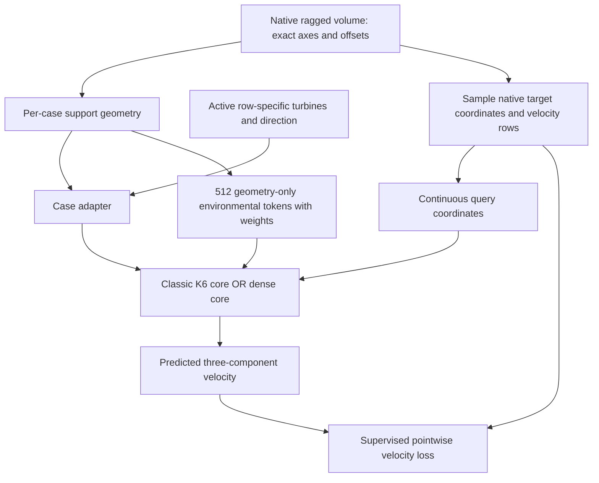

# HONF WindFarm: first variable-domain 3-D forward study

## Detailed implementation, data, training, and evaluation instructions for Codex Goal mode

**Repository:** `cosmos2w/ModularDT`  
**Inspected parent:** `agent/honf-core-next` at `62deb25f04db4b788c50a3017a71c90e2c078562`  
**New development branch:** `agent/honf-windfarm-forward`  
**Scope:** one WindFarm adapter, a minimal 3-D extension of the supported reusable cores, and two controlled from-scratch 500-epoch runs.  
**Primary prediction:** native three-dimensional velocity `[Ux, Uy, Uz]`.  
**Model references:** Run-1401-style fixed-K HONF and Run-1804-style dense pairwise field. These are architecture/configuration adaptations, not reuse of thermal weights or the thermal physical wrapper.

This plan separates **observed repository/data facts [S]**, **proposed experimental choices [P]**, and **external methodological background [R]**. The raw WindFarm arrays are external to Git. The planning review inspected their committed contracts, audit, and reader code, not the arrays themselves. Codex will execute the actual local data and models.

---

# 0. Decision, boundaries, and three work stages

The simplest defensible variable-domain treatment is:

> Keep each simulation's native coordinates and field arrays. Sample supervised queries from that case. Construct a small case-dependent environmental quadrature grid and provide explicit domain geometry. Share the neural weights across all cases without padding every physical field to one global voxel volume.

No learned deformation, new geometry network, adaptive-K organizer, hierarchy, or target-field interpolation is required for the first study.

| Stage | Work | Authorized execution |
|---|---|---|
| **1. Data view and 3-D adapter** | Create the new branch; reuse raw readers and grouped splits; implement geometry, target sampling, normalization, wrapper, and minimal dimensional support | Ordinary tests and disposable real forward/backward execution |
| **2. Two training runs** | Classic K=6 model and dense baseline, same data/features/loss/update policy | A bounded disposable learning probe, then one 500-epoch run per model |
| **3. Evaluation and handoff** | Validation comparison, reserved test evaluation, native-volume/cut-plane checks, geometry and cost diagnostics | No new neural model, sweep, or automatic continuation |

Proposed run IDs: **2100** for classic K=6 and **2101** for dense. Respect the existing allocator; these labels do not reserve an ID. Use physical GPU 0 for classic and physical GPU 2 for dense when both are available. Shared code should be integrated before parallel runs. Never interrupt unrelated processes or create a resource-reservation service.

## 0.1 What is not part of this first experiment

- Do not load the trained ThermalChannel weights into the new model. The dimensionality, input semantics, outputs, and physical problem differ.
- Do not attach the thermal-disk Stage-A surrogate, invent turbine port labels, or create a fictitious turbine-local operator. The WindFarm package currently contains no such trained component or interface supervision. [S1–S4]
- Do not import ThermalChannel's P0/P1/P2 thermal feedback, heat-transfer coefficient, temperature/flux losses, or solid-disk field replacement.
- Do not train pressure, k, epsilon, or wake-loss regression in these two first runs. Preserve access to those targets for a subsequent explicitly designed study. Velocity is enough to establish native 3-D data handling, wake reconstruction, and the two model comparisons without conflating pressure reference or turbulence-target transforms.
- Do not compute an invented turbine power or claim that a velocity-cube proxy equals the supplied `wake_loss_pct`. Its generating formula and calibration are not established by the current schema.
- Do not reshape the 600 ragged solutions into one enormous dense tensor or copy 59.6 GB of raw arrays into a new HDF5/NPZ store merely to imitate ThermalChannel.
- Do not claim fully sparse hypergraph execution, physical-gradient accuracy, unseen-direction generalization, or a universal variable-geometry operator from this first case study.

The outcome will be a real, reusable WindFarm forward problem and two numerical references. It is intentionally a **field-only modular-layout study**. Physical interface coupling is a later capability requiring a meaningful turbine operator or validated interface model.

## 0.2 Software discipline

Use Git history, the existing case protocol, run store, checkpoint loader, ordinary typed configuration, and standard tests. Add no cryptographic hashes, baseline snapshots, contract freezes, approval stages, research-score launch gates, or monitoring framework.

The existing WindFarm manifest/split implementation already records some hashes. Preserve existing metadata and security; do not remove it, regenerate a full-volume checksum, or expand it into new control machinery. Existing trusted loading, `allow_pickle=False`, access restrictions, normal run-ID handling, and overwrite protections remain intact.

No additional defensive mechanism is proposed: no concrete failure has been identified that standard primitives cannot handle here. Any later proposed exception must name the actual failure and explain why the existing primitives are structurally insufficient before adding it.

Numerical tests must run real code. A dry-run summary, shape mock, finite scalar loss, or a pretty plot is not a substitute for physical-array access, model forward/backward, an applied optimizer update, and measured predictions. Poor finite early accuracy is not an automatic execution veto. Handle actual missing data, invalid shapes, NaN/Inf, OOM, or conflicting writes through ordinary errors and debugging. Do not fabricate completion.

---

# 1. Data and code facts that govern the design

## 1.1 Observed dataset

The committed audit describes 600 steady CFD rows corresponding to 200 physical layout groups, each evaluated at 270°, 285°, and 300°. Turbines number 6–30. The supplied constants are rotor diameter 80 m, hub height 70 m, and reference speed 9 m/s. Coordinates stored for the same layout can differ across direction rows. Treat each row's coordinates as authoritative and do not rotate them again without source evidence. The meteorological sign/convention behind the angle labels is not fully documented. [S1, S2]

`family_volume/` contains 2,484,440,512 cell centres and 583 distinct `(nx,ny,nz)` shapes. `nx=197…358`, `ny=114…324`, `nz=64`; case sizes are approximately 1.45–6.91 million cells. Horizontal extents vary; z spacing is nonuniform. The export contains Cartesian axis arrays and C-order reshaping but no finite-volume faces or mesh connectivity. [S1, S2]

The fields are:

| Array | Supplied meaning | Initial use |
|---|---|---|
| `U.npy` | `[Ux,Uy,Uz]`, m/s | Primary supervised target |
| `p.npy` | Kinematic pressure, m²/s² | Retain raw reader, do not train in this round |
| `k.npy` | Turbulent kinetic energy, m²/s² | Retain raw reader |
| `epsilon.npy` | Dissipation rate, m²/s³ | Retain raw reader |
| `wake_loss_pct` in compact metadata | Source-defined scalar percentage | Evaluation metadata/stratification only; no guessed physical conversion |

There is no reason to interpret different `source_time` values as transient observations. They identify selected final-output directories in a steady dataset. Likewise, `completed=1` is an export integrity marker, not a CFD residual-convergence certificate. [S1, S2]

The compact archive is useful for metadata and supplementary cut views. It is not the primary 3-D target: it contains only two horizontal velocity components at hub height and two components on two vertical planes, with padded validity masks and some gap-filled nodes. Invalid compact entries can be finite and nonzero. [S1, S2]

## 1.2 Inspected implementation boundaries

| Current source | Important observed behavior | Required action |
|---|---|---|
| `Case_WindFarm/src/windfarm/io.py` | Read-only mmap arrays, per-run offset slices, `(nz,ny,nx,3)` views | Reuse; add a sampled learning view above it |
| `Case_WindFarm/src/windfarm/splits.py` | Group-disjoint seed-42 70/15/15 split by layout_index | Reuse exactly; do not randomize individual direction rows |
| `Case_WindFarm/configs/case_default.json` | `workflow=preprocessing_only`, `plugin=null` | Keep it; create a separate forward-training case profile |
| `src/honf_runtime/case_protocol.py` | Minimal case methods: validate_config, inspect_launch, train, evaluate | Implement WindFarm's own plugin; thermal local modules are not required by this protocol |
| `Case_ThermalChannel/src/channelthermal/plugin.py` | Case-specific HDF5/resource/local-module requirements and losses | Copy the integration pattern, not these physics assumptions |
| `src/honf_forward_core/config.py` | coordinate_scale currently requires two values; spatial_scale returns two values | Add an explicit dimension setting, historical default 2 |
| `src/honf_forward_core/model.py` | Classic coordinate encoding explicitly stacks x/y; default environment is 2-D | Generalize the selected classic path; require adapter environment for 3-D |
| `organizer.py` and `organization/helpers.py` | Fixed organizer includes two-component scale/descriptor assumptions | Generalize fixed_projection geometry and optional weighted environmental pooling |
| `decoder.py` and `decoding/pairwise.py` | Query encoding/relative features are 2-D; hyper geometry bias takes ten features | Preserve the 2-D branch and extend the chosen 3-D path explicitly |
| `interface_fields/core.py` | Dense interface core largely handles last-axis dimension; currently fabricates weights from coordinate_scale | Use adapter-provided environmental weights when present |
| `interface_fields/common.py` | Local correction already uses Euclidean last-axis distance; field head accepts query_features | Reuse for 3-D, with rotor-radius proximity interpreted geometrically |
| `src/config_core/forward/stage7_structured_context.json` | K=6, H=256, fixed projection, softmax, context fusion, four-layer pair MLP | Starting architecture for classic WindFarm profile |
| `src/config_core/forward/dense_pairwise_interface_context.json` | H=256/message 128/four heads/eight common coarse states, activation checkpointing | Starting architecture for dense WindFarm profile |

These facts explain why changing only `field_dim` and adding a third coordinate will not be enough. They also explain why a new wind-specific physical feedback network is unnecessary for this first comparison. [S3–S9]

---

# 2. Formal forward task and the deliberately simple domain representation

## 2.1 Problem statement and symbols

For case b, define

\[
\mathcal M_b=\{(x_{bi},s_{bi})\}_{i=1}^{M_b},\qquad
\mathcal E_b=\{(y_{bj},r_{bj},\nu_{bj})\}_{j=1}^{E_0},
\]

and query coordinates \(q\) within that case's represented support. Learn

\[
\widehat{\mathbf U}_b(q)
=\mathcal F_\theta(q;\mathcal M_b,\mathcal E_b,c_b),
\qquad\widehat{\mathbf U}\in\mathbb R^3.
\]

- \(M_b\): active turbine count; padded width is storage, not a physical limit.
- \(x_{bi}\): actual 3-D hub location, formed from supplied xy and hub height.
- \(s_{bi}\): known module attributes; initially radius and hub height in D units.
- \(E_0=512\): initial input quadrature-token budget, independent of CFD cell count.
- \(r_{bj}\): geometry/support descriptors, not solved field observations.
- \(c_b\): direction category, turbine count, reference condition, and case-domain geometry.
- \(q\): an arbitrary receiver coordinate; supervised receivers initially lie at native cell centres.

No target velocity, pressure, turbulence field, wake-loss value, case/layout ID, or generator-quality flag is a model input. The only target used by the training loss is native velocity at sampled receivers.

## 2.2 Represented domain versus exact CFD boundary

For each run, take the first/last value of each exact cell-centre axis:

\[
a_b=(x_0,y_0,z_0),\quad b_b=(x_{n_x-1},y_{n_y-1},z_{n_z-1}).
\]

Define the **cell-centre support box**

\[
\Omega_b^{\rm obs}=[a_{b,x},b_{b,x}]\times[a_{b,y},b_{b,y}]\times[a_{b,z},b_{b,z}].
\]

This box contains the supplied sample locations. It is not asserted to be the exact OpenFOAM wall/inlet/outlet boundary: faces and boundary dictionaries are absent from the export. In the initial adapter, geometry distances to these faces are called *support-face distances*, not exact physical boundary conditions.

Do not extrapolate all centres to a guessed common CFD domain, invent no-slip labels, or apply PDE boundary losses on this observation box. The small omitted centre-to-physical-face margins are a documented representation limitation. This avoids guessing outer cell faces while retaining actual size variation.

## 2.3 Two coordinate descriptions, with different roles

Use rotor diameter \(D=80\) m as the physical unit:

\[
q^D=q/D,\qquad x_i^D=x_i/D.
\]

Use a fixed positional scale derived from the documented compact support dimensions:

\[
S=(50,38,6.25)
\]

in rotor-diameter units for both models' Fourier encoders and existing normalized geometry features:

\[
q^{\rm pos}=q^D/S.
\]

This scale is the same for every case. It is **not each case's bounding-box extent**. Therefore the same physical displacement keeps the same numerical meaning across small and large farms. Local Euclidean distances for proximity remain in D units.

Per-case relative position

\[
\eta_b(q)=\frac{q^D-a_b^D}{b_b^D-a_b^D}
\]

is used to place environmental quadrature points and can be exported for visualization. It is not the sole geometric representation. Mapping every case to `[0,1]^3` and discarding its extent would make different physical spacings appear identical.

Supply case-dependent extents explicitly through global/support features. No learned warp or resampled global output cube is introduced.

## 2.4 Initial input features: only known geometry and operating metadata

**Module centres:** `[x_D,y_D,hub_height_m/D]`. Use the row-specific active turbine coordinates. Module padding is sanitized to finite zeros *after* creating the active mask; never feed NaNs through an encoder and hope multiplication by zero removes them.

**Module features:** `[rotor_radius/D, hub_height/D]`, currently `[0.5,0.875]`. These constant attributes are retained as semantically known features; the first dataset does not demonstrate varying turbine diameter/type. Do not infer thrust coefficients, yaw, turbine power, roughness, or induction factors that are not supplied.

**Global features:** three-way one-hot `wd_deg`, `M/30`, `U_ref/9`, the three lower support coordinates `a_b^D/S`, and the three support lengths `(b_b^D-a_b^D)/S`. Total initial width is 11. Fixed divisors come from the documented design envelope, not statistics fitted to held-out target values.

**Environment/query support features:**

\[
r_b(q)=\left[
(q^D-a_b^D)/S,
(b_b^D-q^D)/S,
q_z^D/S_z
\right]\in\mathbb R^7.
\]

These encode six support-face distances and absolute normalized altitude. Query features use the existing public input to both decoders; do not add a special extra network only to one model.

The source says x is downstream in the plotting frame and turbine coordinates are direction-aligned. Use stored coordinates directly and retain direction as a categorical input. Do not impose an additional meteorological rotation or claim interpolation to unseen wind angles. Full-volume/compact correspondence must be checked on a real case before treating the frames as empirically aligned.

## 2.5 Compact environmental quadrature on each different domain

Use a deterministic cell-centred grid of `(16,8,4)` points over each \(\Omega_b^{obs}\). For each dimension:

\[
y_{b,j,d}=a_{b,d}+(b_{b,d}-a_{b,d})\frac{j_d+1/2}{n_d}.
\]

These are **input representation points**, not downsampled velocity labels. Compute only geometry/support features there. Do not read the solved U/p/k/epsilon to construct environmental tokens.

Each equal-volume token carries

\[
\nu^{\rm env}_{bj}=\frac{\operatorname{vol}(\Omega_b^{obs})}{D^3 E_0}.
\]

Weights are in D³ and may differ between cases. Their total is the represented support volume, not `product(coordinate_scale)`. Initially all tokens within one case have equal mass; the optional batch weight field makes later nonuniform quadrature possible without changing the data interface.

This constant E0 is a first-test budget. Its physical density decreases on larger domains; report that tradeoff. It is not a claim that 512 tokens are adequate for every 3-D wind farm. A small post-training resolution audit is specified later; no trained E sweep is authorized.



---

# 3. Data preprocessing and split specification

## 3.1 Reuse the existing layout split

The preprocessing implementation uses seed 42 and 70/15/15 group fractions. Reuse the already generated indices when they correspond to this policy; otherwise generate them once using `windfarm.splits.make_group_split`. Do not reshuffle to obtain attractive balance.

For 200 groups with three direction rows each:

| Partition | Layouts | Simulation rows | Use |
|---|---:|---:|---|
| Train | 140 | 420 | Optimization and target/input statistical fitting |
| Validation | 30 | 90 | Monitoring, checkpoint selection, bounded development diagnostics |
| Test | 30 | 90 | Final selected-model comparison only |

Both models use identical indices. Report M, direction and support-volume distributions for the three partitions. Every direction remains present automatically because each layout carries all three. Domain-size differences between partitions are descriptive; this grouped random split is not an explicit size-extrapolation split.

Existing exploratory preprocessing viewed metadata/targets and some showcases across the population. Describe the new test as *reserved for model selection in this experiment*, not a completely uninspected dataset. Once used at closeout, do not keep using its scores for further architecture decisions while calling it untouched.

No new cryptographic split certificate is needed. Keep the current exact row arrays and metadata, including fields already produced by the existing implementation.

## 3.2 A lightweight learning index, not another full dataset copy

Create one derived, ignored study directory under `Case_WindFarm/Dataset/derived/forward_velocity_v1/` containing:

```text
case_index.csv                 # 600 rows of input geometry/resource references
split_indices.npz              # existing exact split arrays or references to them
normalization.json             # train-only three-channel statistics
sampling_metadata.json         # seeds, measure, target names, and budgets
geometry_metadata.npz           # only small axes/weights/token metadata if helpful
```

A single compact index records the raw row/case/layout IDs, direction, active turbine count, shape, offsets and support bounds. Existing source IDs remain `wind_farm_tensor_v1` and `wind_farm_volume_v1`; do not disguise a sampled view as a different authoritative raw dataset. Ordinary schema names for the new adapter view are documentation, not frozen contracts.

Do not copy raw fields, eagerly allocate `[600,nz,ny,nx,3]`, or preload millions of samples for each case. Use `WindFarmDataset` and mmap-backed native arrays. Opening p/k/epsilon mappings is cheap metadata work, but do not scan them in every velocity-training epoch.

Standard NumPy mmap slicing and PyTorch map-style datasets/collation support this design [R4, R5]. Do not upgrade the working environment merely to match the latest online documentation version.

## 3.3 Native query indexing

For a case with shape `(nx,ny,nz)`, sample native integer indices `(ix,iy,iz)` and form

\[
\ell=i_x+n_x(i_y+n_y i_z).
\]

Then

\[
\mathbf U(q)=U[\text{run_start}+\ell],\quad
q=(x[i_x],y[i_y],z[i_z]).
\]

This uses the exact export order and gives a target at the exact queried coordinate. No target interpolation is needed during training. Never combine a sampled coordinate from one row's axes with another row's field offsets.

Gather only sampled rows. Copy those small arrays into writable CPU tensors before transfer; never mutate a readonly mmap through a Torch view. A random-access batch can be sorted by file offset for I/O efficiency and unsorted afterward, without changing its sampling distribution.

## 3.4 Nonuniform-z quadrature without inventing mesh volumes

Uniformly sampling native indices would overweight the more densely sampled z region. The export does not provide exact cell volumes. Use the following explicit **cell-centre support quadrature**, not an asserted finite-volume volume.

For one increasing axis `x_0…x_(n-1)`, define support partition edges

\[
e_0=x_0,\quad e_n=x_{n-1},\quad
 e_i=(x_{i-1}+x_i)/2\quad (1\le i<n),
\]

and node-associated weights \(\Delta x_i=e_{i+1}-e_i\). Repeat for y and z. Then

\[
w_{i_xi_yi_z}=\Delta x_{i_x}\Delta y_{i_y}\Delta z_{i_z},\qquad
\sum w=\operatorname{vol}(\Omega_b^{obs}).
\]

First/last weights are half adjacent spacing. This integrates over the known centre box, not unknown outer CFD faces. It avoids silently assuming a uniform vertical mesh or guessing boundary faces. Document the approximation and later replace it with actual mesh volumes if provided.

Because the weights factorize, volume sampling uses three one-dimensional categorical CDFs. No full 3-D weight tensor is needed. Full-volume streaming metrics can generate one slab's weights at a time.

## 3.5 One simple spatial-emphasis sampling policy

For each training case and epoch, sample `Q_train=1024` native queries:

- 768 from normalized support-volume quadrature;
- 256 from the same quadrature conditioned on rotor-height band `z in [hub_height-D/2, hub_height+D/2]`, intersected with support.

The band is known from geometry, not target wake deficit. Keep native centres inside that height band and renormalize their existing z quadrature weights; this is a centre-based band quadrature, not exact integration over partially cut mesh cells. Do not use a learned field or wake_loss to select training points. The band sampler is another factorized CDF, not per-turbine rejection sampling or a dense cell–turbine distance array.

The sampled objective is explicitly

\[
\mathcal L=0.75\,\mathbb E_{q\sim p_{\rm vol}}\ell(q)
+0.25\,\mathbb E_{q\sim p_{\rm band}}\ell(q).
\]

It is not the same as an unweighted global cell loss. The emphasis is intended to keep wake-height errors visible despite the large atmospheric volume. Do not claim the training average is a uniform-volume metric. Evaluation reports volume and band quantities separately.

Use reproducible per-case/per-epoch seeds derived by ordinary integer seed composition, for example NumPy SeedSequence from `(seed,epoch,row,stream_id)`. Do not use Python's process-randomized string hash. Both models must see the same query distribution/seeds, independent of worker scheduling. Shuffling may differ only through ordinary model-independent batch handling.

## 3.6 Target transform and loss

First nondimensionalize velocity:

\[
u_c^*=U_c/U_{ref},\qquad c\in\{x,y,z\}.
\]

Estimate one global mean \(m_c\) and standard deviation \(s_c\) **from training rows only**, using an equal number (initially 8192) of deterministic volume-weighted samples per training row. Each layout therefore has equal total statistical weight because it has exactly three rows. Use streaming stable moment accumulation; save only the resulting small statistics and estimation policy.

Define

\[
\widetilde U_c=(U_c/U_{ref}-m_c)/s_c^{safe},\qquad
s_c^{safe}=\max(s_c,10^{-3}).
\]

The small dimensionless floor prevents division by a near-constant channel; it is a numerical target-scaling convention, not a performance gate. Report if it is active. The supplied velocity channels are signed, so use ordinary linear outputs, not positivity transforms.

For each point,

\[
\ell(q)=\frac13\sum_c(\widehat{\widetilde U}_c(q)-\widetilde U_c(q))^2.
\]

Keep additional statistical input normalization disabled initially: the declared geometric/unit scalings already define the input representation. Enable only the specified training-fitted target transform. Use no per-case target centering/standardization and no test-fitted transform. The small Uy/Uz scales should not be hidden behind Ux dominance, which is why channel-standardized loss and physical channel metrics are both needed.

There is no initial PDE residual loss, turbine-power loss, boundary penalty, local-module loss, or topology regularizer. Their absent physical definitions are not filled with guesses.

## 3.7 A cheap non-neural reference against background-only learning

From the same training-only normalization sample, form a 32-bin altitude-conditioned empirical velocity profile \(\mathbf U_{bg}(z/D)\), with interpolation between bin centres. Fit it only from training data and document empty-bin handling by interpolation.

Use it as a diagnostic baseline, not a prescribed inflow boundary, loss input, residual training architecture, or verified no-turbine solution. It includes the training population's average wakes.

Report model improvement over this baseline and, separately, errors of the residual \(U_x-U_{bg,x}(z/D)\). A model that merely reproduces vertical shear can score deceptively well on total-speed relative L2; this reference makes that visible. Do not call its residual the physical power loss or a clean free-stream deficit.

## 3.8 DataLoader behavior

Implement a map-style dataset returning one simulation row plus Q sampled targets. Default logical batch size is 8 with dynamic module padding to the largest M in that batch. Every training epoch visits all 420 rows once; the last batch has four cases. Loss reduction must weight cases correctly in the last batch.

Start with `num_workers=0` for correctness and the first real execution. Move to two workers only after a short measured I/O comparison shows benefit, using process-local mmap opening and deterministic query seeds. Do not transmit all raw memmaps or large cached arrays through multiprocessing queues. Keep prefetch modest; no 59.6-GB process copies.

A dedicated case view plus small `collate_fn` is preferable to copying ThermalChannel's packed-HDF5 dataset class. No full feature/target cache is required. If real measured I/O dominates training, report it and consider one bounded derived cache later; do not silently create many duplicate sampled corpora.

---

# 4. Canonical batch and the two WindFarm model wrappers

## 4.1 Batch tensors

For logical batch B, largest active turbine count in that batch M_pack, E0=512, and Q sampled points:

| Canonical field | Shape | Semantics |
|---|---|---|
| `module_centers` | `[B,M_pack,3]` | Hub coordinates in D units |
| `module_present` | `[B,M_pack]` | Boolean/float active mask |
| `module_features` | `[B,M_pack,2]` | Known radius/height attributes |
| `global_context` | `[B,11]` | Direction category, count, reference speed, support geometry |
| `env_coords` | `[B,512,3]` | Case-specific geometry quadrature locations |
| `env_features` | `[B,512,7]` | Geometry-only support features |
| `env_weights` — new optional field | `[B,512]` | Adapter-owned D³ quadrature measure |
| `query_xy` — historical name retained | `[B,Q,3]` | Native 3-D receiver coordinates in D units |
| `query_features` | `[B,Q,7]` | Known per-query support geometry |
| `target_field` | `[B,Q,3]` | Training-standardized velocity |
| `query_time` | `None` | Steady data; no source_time input |
| `metadata` | small host structure | Case/layout IDs, source indices, units, sampling scope |

Do not rename every public `query_xy` occurrence as part of this task. Document that its final axis now has `spatial_dim` components. Retain old positional argument ordering when appending the optional `env_weights` field to BatchData.

Targets and CPU raw-axis metadata must not be part of the reusable prepared inference state. One prepared state must decode new valid coordinates without receiving their target values or changing the model configuration.

## 4.2 One thin WindFarm wrapper

Provide a shared case facade such as `WindFarmForwardModel` with `prepare_case(batch)` and `decode(prepared, query_coords, query_features)`.

For classic:

```text
WindFarm batch
    ↓
HONFNeuralField.encode_and_organize
    ↓
Prepared module/environment/hyperedge state
    ↓
HONFNeuralField.decode_queries in chunks
    ↓
Standardized velocity → physical velocity
```

For dense:

```text
WindFarm batch
    ↓
InterfaceFieldCore.encode_case
    ↓
InterfaceFieldCore.prepare(encoded, encoded.module_tokens)
    ↓
Prepared dense + common coarse state
    ↓
InterfaceFieldCore.decode_queries in chunks
    ↓
Standardized velocity → physical velocity
```

There is exactly one preparation for an unchanged WindFarm case, not three thermal preparations. No fake local outputs, zero-valued thermal heads, hidden teacher features, P0/P1/P2 ports, or made-up Stage-A checkpoint is needed.

Both wrappers use the same domain metadata, sampling, physical target transform, loss, optimizer family, and evaluation. Their architecture differs in the intended way; they are not claimed to be parameter-matched. Preserve each parent's own near/coarse/global paths instead of adding a new common correction merely for superficial uniformity.

## 4.3 Model A: classic fixed-K HONF, Run-1401-inspired

Use K=6, H=256, fixed projection, softmax memberships and query attention, residual/raw hyperedge state, context fusion, hyperedge-value context, global path, and Gaussian near-module context.

A concise description is

\[
A^{MH}_{ik}=\operatorname{softmax}_k f_M(z_i),\qquad
A^{EH}_{jk}=\operatorname{softmax}_k[f_E(e_j)+b(y_j,s_k)],
\]

\[
h_k=\rho\left(\sum_i\bar A^{MH}_{ik}V_Mz_i+
\sum_j\bar A^{EH,\nu}_{jk}V_Ee_j\right),
\]

\[
\alpha_{qk}=\operatorname{softmax}_k\ell(q,h_k),\qquad
\beta_{qi}=\sum_k\alpha_{qk}\bar A^{MH}_{ik},
\]

\[
c(q)=\sum_k\alpha_{qk}V_Hh_k+
\gamma\sum_i\beta_{qi}\psi(q,i)+c_{global}+c_{near}(q).
\]

`psi` is the established four-layer H=256 legacy pair MLP. Use full-support fused query-module aggregation to avoid the avoidable full edge-context intermediate; this is the accepted exact rearrangement, not a new approximation. Set retained module mass floor 1.0, no top-k or sparse truncation, no residual organizer, and no rank regularizer.

The environmental pooling weights are quadrature-aware when supplied:

\[
\bar A^{EH,\nu}_{jk}=\frac{\nu_j A^{EH}_{jk}}{\sum_l\nu_l A^{EH}_{lk}}.
\]

A_me environmental attention similarly uses relative quadrature weights as a log prior when provided. Uniform within-case masses reduce to the historical equal-weight concept. Keep the exact old arithmetic branch when weights are absent, so historical checkpoint replay is not changed by this new case capability.

This is a 3-D classic architectural baseline, not a claim that it realizes all later hypergraph-interface goals. Its six latent edges, shared states, and beta routing can be inspected, but no target physical edge labels exist.

## 4.4 Model B: dense pairwise field, Run-1804-inspired

Use the existing `DensePairwiseField` rather than reimplement it in the case package. Its main updates are

\[
a_i^{MM}=\frac1{1+M}\sum_{l\ne i}\phi_{MM}(z_i,z_l,x_i-x_l),
\]

\[
a_i^{ME}=\frac{\sum_j\nu_j\phi_{ME}(z_i,e_j,x_i-y_j)}{\sum_j\nu_j},\qquad
a_j^{EM}=\frac1{1+M}\sum_i\phi_{EM}(e_j,z_i,y_j-x_i).
\]

The signed joint messages feed nonlinear module/environment updates, followed by query–module messages and geometry-aware query–environment attention. Preserve its simultaneous fine-message order: EM receives the original current-pass module states, not newly updated modules in the same pass.

Use H=256, message width128, four attention heads, eight common coarse states, one common coarse block, local radius factor2.5, Fourier frequency count4, and activation checkpointing. The configured receiver chunk remains128 during training. A measured larger inference chunk is an execution option, not a change in the fitted model.

Use `module_radius=0.5` in D units for geometric proximity in both baselines. Dense's compact local correction then has radius1.25D. This is a heuristic neighbourhood scale, **not a solid sphere, exact rotor support, or physical boundary condition**. Do not remove target cells inside that sphere or treat the compact `rotor_hub` overlay as a full-volume validity mask.

Run 1804's thermal weights and physical-head losses are not reused. The similarity is its collective response architecture and learning settings. The resulting trainable parameter counts will differ from ThermalChannel because the new encoders/output dimensions and absence of local thermal components differ.

---

# 5. Minimal reusable-core changes needed for genuine 3-D execution

## 5.1 Dimension belongs in core configuration

Add `spatial_dim: int = 2` to `UnifiedForwardConfig` and its current schema. Historical omitted values remain 2. The new profiles use 3 with an explicit three-value coordinate scale.

Generalize scale helpers to the requested dimension. Keep the historical two-dimensional arithmetic/feature order and parameter construction untouched where feasible. A default 2-D config must not acquire larger trained layers or a new implicit geometry path. Follow the existing serialization pattern: keep an omitted/default spatial_dim=2 compatible with old resolved configurations, and explicitly save spatial_dim=3 for new checkpoints. Do not reinterpret an old checkpoint as 3-D because a caller supplied a third coordinate.

Scope the first implemented 3-D support to:

- `legacy_honf` with `fixed_projection`, full-support context fusion and the legacy pair kernel;
- `dense_pairwise_field` through InterfaceFieldCore;
- nonperiodic geometry with adapter-supplied environment coordinates.

Do not silently claim that every residual, periodic, sparse-support, regional, additive, or inverse mode now supports 3-D. Explicit unsupported-mode errors are normal API behavior, not new scientific gating. Do not generalize experimental trees/supports that are not used by these two runs.

## 5.2 Classic path: concrete audit and extension

Audit the actual live source for `range(2)`, `[..., :2]`, x/y unpacking, hard-coded last axes, and fixed geometry feature widths. In particular:

**Encoding (`model.py`).** Normalize all d coordinate components, preserve per-case environmental coordinates, and feed all d components to positional Fourier features. For d=3 with no env_coords, require adapter-provided coordinates rather than silently fabricating a 2-D environment. Target/query arrays must never be used to infer domain geometry for inference.

**Organizer (`organizer.py`, `organization/helpers.py`).** Centroids and variances are vector quantities of width d. Use all d components in distances and geometric normalizers. Extend mechanism descriptors while preserving the historical 2-D construction. No z coordinate may be present only in an input feature while ignored by the organizing geometry.

**Query encoder (`decoder.py`).** Generalize the normalized coordinate prefix to d components, retaining the old time-feature behavior. Nonperiodic boundary mode stays `none`; WindFarm supplies its own seven support features through query_features. Do not use 2-D `rectangular_boundary_features` for 3-D queries.

**Query-to-hyperedge geometry.** A useful dimension-consistent extension of the existing ten features has width `2*d + 6`: source offset vector, region offset vector, two normalized Euclidean distances, two +x/downstream distances, and two transverse distances. For d=2 the existing transverse term is absolute y separation. For d=3, use transverse magnitude over y/z in their declared scales; the signed vector offsets still retain vertical/crosswind distinction. Preserve the exact original 2-D formula/ordering and its `Linear(10,1)` parameters; construct a width12 layer only for new d=3 models.

**Pair kernel (`decoding/pairwise.py`).** Extend both dense and gathered/selected relative-feature helpers consistently. Preserve signed dz and use three-dimensional Euclidean distance. Lazy input projections can materialize the new feature width; do not drop z, fabricate a second xy image, or pad with fake zero channels. No factorized-kernel experiment is included.

**Near context.** Compute 3-D distance to hub coordinates. Its radius is a geometric hyperparameter, not a fluid mask. Keep the established Gaussian or compact form of each corresponding parent.

**Diagnostics.** Support 3-D coordinates in the selected fixed-K summaries and plotting. If an old thermal diagnostic assumes 2-D physical affinity targets, mark it unsupported for WindFarm instead of fabricating zero scores. The existing thermal golden and ordinary tests should still exercise the old path.

## 5.3 Adapter-owned environmental measure

Add optional `BatchData.env_weights=None` at the end of the existing dataclass fields and propagate it through `.to()` and appropriate readers.

In InterfaceFieldCore, when supplied, validate normal tensor shape/positivity and use these weights rather than `product(coordinate_scale)/E`. When absent, preserve the historical default exactly. The coordinate scale controls feature normalization; it must not be confused with the WindFarm volume measure.

In the classic fixed organizer, carry supplied quadrature consistently in A_me source attention, environment-to-edge pooling, centroids, and relevant environmental mass descriptors. A practical normalization is to use relative weights with case mean one where historical statistics use effective token count, while separately retaining raw adapter weights for physical-volume reporting. Document this distinction rather than changing diagnostic mass units implicitly.

The new first-case grids are equal-weight per case, so no elaborate irregular-grid solver is needed. Ordinary duplicate-token/split-mass tests are sufficient to exercise the generic weighted path. Keep train/test target quadrature in the case layer; do not confuse environmental input weights with target-loss weights.

## 5.4 Dense path and shared geometry

Much of InterfaceFieldCore and DensePairwiseField already uses the last coordinate dimension and flexible Fourier features. It still cannot be called with a 3-value scale under the current config validator; fix the configuration alongside execution.

Its coordinate scale remains the fixed `[50,38,6.25]` vector, not a batched per-case scale. Current code contains operations such as `coordinate_scale.reshape(-1)` that would be wrong if silently changed to `[B,1,3]`. Case-varying geometry lives in coordinates/features/global context, avoiding that hidden broadcast hazard.

Do not borrow sparse `build_layout` or module-port-coordinate requirements: the dense factory does not need them. `prepare(encoded,encoded.module_tokens)` is sufficient for this field-only wrapper.

## 5.5 Memory handling and backward correctness

Initial B=8, Q=1024, E=512, M<=30 should be executed and measured rather than assumed safe. Both models decode receiver chunks of128 during training. Dense retains its supported activation checkpointing.

A receiver chunk reduces peak inference tensors but does not automatically release every training graph retained until one final backward. If actual peak memory is excessive, use standard activation checkpointing for the reusable read closure or ordinary microbatch gradient accumulation while preserving the logical batch/loss. Do not detach the prepared representation, rebuild encoders separately for every query, change the scientific point count, or train only a subset of modules to make memory look better.

Microbatch losses must be multiplied by the actual microbatch case count divided by the logical batch count, including the final four-case batch. Add one ordinary small gradient comparison with dropout off if accumulation is introduced.

Any train-time cache remains inside the current forward graph. Inference caches are invalid after weights, turbine layout, operating conditions, support bounds, or environment representation change. Use normal object lifetimes; no persistent disk-cache service is needed.

---

# 6. WindFarm case package and runtime integration

## 6.1 Reuse the runtime, not the thermal physics

Implement `WindFarmPlugin` against `honf_runtime.case_protocol.CasePlugin`. Register/discover it through the existing case mechanism used by the current root `train.py` and `evaluate.py`; inspect the live resolver before choosing an entry-point string. No parallel top-level launcher or generic new plugin registry is required.

The ThermalChannel plugin's need for `local_modules`, thermal losses, and `packed_h5_path` is case-specific. Do not weaken those requirements for ThermalChannel. WindFarm can legitimately expose only the forward/compare workflows with no local module spec.

Reuse the generic path resolver, existing run-store allocation, trusted state-dict loading, standard optimizer/checkpoint helpers, and reporting conventions. Do not force the directory-of-NPY resource through a loader that expects one HDF5 fingerprint. Preserve its current declared resource metadata, including the fact that no whole-volume checksum was computed; do not invent one or disable unrelated trust checks.

## 6.2 Proposed small source organization

Names below are proposed additions; align them with actual repository conventions without duplicating implementations:

```text
Case_WindFarm/
  configs/
    case_default.json                 # existing preprocessing config, unchanged
    forward_velocity.json             # new case-specific scientific settings
    forward_velocity.schema.json      # ordinary schema if needed by current loader
  src/windfarm/
    io.py                             # existing read-only raw access
    splits.py                         # existing grouped split
    geometry.py                       # support boxes, quadrature, tokens, known features
    data.py                           # sampled native-point Dataset/collation
    normalization.py                  # three-channel train-only transform
    model.py                          # thin common wrapper and two-core factory
    plugin.py                         # normal HONF CasePlugin
    workflows/
      train_forward.py                # field-only loop reusing runtime primitives
      evaluate_forward.py             # streaming fields/metrics/cut export
  scripts/
    prepare_forward.py                # small derived view/stats preparation
    inspect_windfarm.py                # existing audit retained
    visualize_windfarm.py              # extend/reuse current cuts
  tests/
    test_windfarm_pipeline.py          # existing preprocessing tests retained
    test_windfarm_forward.py           # focused data/core/case execution tests
```

Do not copy all ThermalChannel training code just to set thermal losses to zero. A short WindFarm loop with the same AdamW/resume/epoch primitives is more readable and truthful. Generic code extraction is justified only for helpers actually used by both cases; avoid an unrelated rewrite of all existing runs.

## 6.3 New root profiles

Create exactly:

```text
src/config_core/forward/windfarm_classic_k6.json
src/config_core/forward/windfarm_dense_pairwise.json
```

Both select `case.id="WindFarm"`, the new forward case configuration, and `case.dataset_id="wind_farm_volume_v1"`. The case resolver also uses compact metadata via its existing logical resource ID.

The shared model fragment is proposed, and its schema must be implemented and actually parsed:

```json
{
  "field_dim": 3,
  "spatial_dim": 3,
  "coordinate_scale": [50.0, 38.0, 6.25],
  "module_radius": 0.5,
  "hidden_dim": 256,
  "dropout": 0.0,
  "geometry_mode": "nonperiodic",
  "periodic_axes": [],
  "query_time_mode": "none",
  "boundary_feature_mode": "none",
  "position_fourier_frequencies": 4,
  "query_fourier_frequencies": 4
}
```

Classic additions retain the Stage-7 architecture:

```json
{
  "forward_architecture": "legacy_honf",
  "num_hyperedges": 6,
  "organizer_mode": "fixed_projection",
  "edge_selection_mode": "all",
  "module_assignment_normalizer": "softmax",
  "environment_assignment_normalizer": "softmax",
  "query_assignment_normalizer": "softmax",
  "field_assembly_mode": "context_fusion",
  "decoder_mode": "enhanced_honf_pairwise",
  "pairwise_kernel_mode": "legacy_mlp",
  "pairwise_kernel_hidden_dim": 256,
  "pairwise_kernel_num_layers": 4,
  "pairwise_aggregation_mode": "fused_query_module",
  "routing_execution": "dense",
  "query_module_retained_mass_floor": 1.0,
  "local_context_scale": 0.5,
  "use_hyper_value_context": true,
  "use_A_me_auxiliary": true,
  "use_hyper_mechanism_encoder": false
}
```

Copy the remaining scientific classic settings from the maintained Stage-7 profile rather than relying on defaults that differ from Run 1401. Dense uses its existing interface_model settings from Run-1804's maintained profile, with no new main latent, sparse support, or hierarchy mode. Remove only thermal-specific training options from the new case profiles; preserve them in historical profiles.

These fragments are not standalone files. Include the current schema_version, workflow, model_family, dataset/case selection, training/checkpointing, and run sections. Codex must produce executable full profiles and show the resolved active settings in its report.

---

# 7. Branch workflow and first-stage execution

## 7.1 New branch from the actual latest parent

Before source changes, use the current repository and ordinary Git operations:

```bash
git fetch origin
git switch -c agent/honf-windfarm-forward origin/agent/honf-core-next
```

The command assumes the destination branch does not already exist and the checkout can switch without discarding work. If it exists, inspect and use the user's existing branch rather than resetting or force-recreating it. If uncommitted work prevents switching, preserve it and report the concrete conflict; do not automatically stash, delete, or overwrite someone else's edits.

Record the actual parent SHA in ordinary commit/report text. Do not pin to the planning SHA if the source legitimately advanced. Keep `agent/honf-core-next` and its PRs unchanged. Push only the new branch through the existing authorized workflow; no merge or force push is part of this task.

## 7.2 Read the actual external data first

Resolve `Dataset/dataset_locations.local.json` or the existing browsing link. Inspect the existing raw headers/axis metadata and obtain one real `RunView` of small, medium, and large grid shape. Do not claim file accessibility from a path string alone.

Check actual native target gathers against direct run slicing, and compare one full-volume hub-like plane with the existing plotting reader. Compact versus volume numeric disagreement may reflect plane selection/resampling/gap filling; record it rather than modifying one source to force equality.

If the external arrays are unavailable, do not fabricate training data and call the task complete. Implement/test isolated code where possible and identify the missing mounted resource precisely. Physical training requires the real data; this is an access limitation, not a new approval gate.

## 7.3 Focused ordinary tests

Extend current tests around the concrete failure scenarios:

1. Per-run flat indices, axes and targets agree for distinct `(nx,ny,nz)` shapes; no x/y/z transpose.
2. Split groups are disjoint, complete and unchanged across the two models; all direction rows stay together.
3. Training-only statistics exclude validation/test rows and compact target metadata.
4. NaN turbine padding never enters either encoder; adding/removing padding and permuting modules preserve predictions with correctly permuted source tensors.
5. Two cases with different bounds can share a batch; evaluating separately versus together produces consistent results. Inspect that `env_coords[0]` is not inadvertently reused.
6. All three coordinates affect the executed geometry. A z query displacement must be visible to Fourier/relative/near features; no hidden 2-D branch remains in the supported paths.
7. Split-weight environmental duplication leaves weighted aggregation consistent. Quadrature sums equal the declared support-box measure; do not equate this test with physical resolution convergence.
8. Different query chunks and permutations retain the same pointwise meaning; show absolute/norm discrepancies under existing numerical conventions.
9. An inference call needs geometry/operating inputs only, never target velocity or target-derived per-case statistics.
10. A normal save/load/resume reconstructs the correct d=3 family and optimizer using existing trusted utilities. Thermal d=2 regressions and available old golden replays still execute unchanged.

Do not add a test hierarchy, new snapshots, or a hash inventory. Tiny synthetic tensors are appropriate for algebra/indexing tests but are not substitutes for the real-data execution below.

## 7.4 Bounded quick learning probe

For each model, use a fresh disposable instance on four actual **training** rows chosen by input geometry to include small/large M and small/large support extent. Use Q=512 fixed native targets per case, the actual E0=512 environmental representation, canonical transform/loss, and at most **60 optimizer steps** on one GPU.

This is an overfit/gradient diagnostic on fixed training samples, not a formal generalization result. Record loss trajectory, predictions, gradient/update norms, and peak memory. Do not launch another managed run, tune support/width repeatedly, or reuse those weights/optimizer states for the formal run.

Lack of rapid overfit is a warning to inspect, not an automatic numeric rejection threshold. Actually zero/broken gradients, wrong targets, unsupported dimensions, or non-finite arithmetic require debugging. Ordinary finite but imperfect predictions do not authorize silent model redesign.

Also execute one complete disposable real batch with B=8, largest actual M, Q=1024 and all channels to measure the true working-memory path. Fix chunk/accumulation execution only if needed, maintaining logical loss semantics. The formal models are reconstructed fresh afterward.

---

# 8. The two formal 500-epoch runs

## 8.1 Shared settings

| Setting | Choice |
|---|---|
| Initial dataset | Full-volume native U targets, compact geometry metadata |
| Split | Existing seed42 layout-grouped 420/90/90 rows |
| Model seed | 0 |
| Physical GPUs | Classic: 0; dense: 2, or sequentially on0 if needed |
| Logical batch | 8; final batch4 |
| Queries per case per epoch | 1024, 75% volume +25% rotor-height band |
| Environment tokens | 512 =16×8×4 per case |
| Receiver chunk | 128 during training |
| Optimizer | AdamW, lr3e-4, weight decay1e-5 |
| Gradient clip | 1.0 |
| AMP/dropout | Off /0 |
| Warm start | None |
| Epoch budget | 500, full 420 rows each epoch |
| Validation cadence | Every5 epochs and final500 |
| Validation queries | Frozen 8192 volume samples plus2048 band samples per row |
| Best selection metric | Mean across validation rows of standardized **volume** MSE, not test loss or training mixture |
| Latest checkpoint | Existing normal policy, initially every10 epochs |
| Milestones | 10,50,100,250,500,1000,2500,5000 |
| Extra scalar loss/model head | None |

At B=8 with no dropped cases there are 53 optimizer updates per epoch, hence approximately26,500 at500. This is not comparable in update count to ThermalChannel's13 updates per epoch; do not present cross-dataset epoch counts as equal work.

Use the same per-case epoch query seeds and same case ordering/batching scheme for the two models. Gradient accumulation, if needed, preserves 53 logical optimizer updates. Record actual update count and measured active training time.

Source-only inputs and nonperiodic geometry are unchanged through training. Do not dynamically change field channels, target transforms, environment resolution, K, loss weights, or batch definition partway through a run.

## 8.2 Intended launch commands

Codex must confirm these against the installed current root CLI after adding the WindFarm plugin. Run from `HONF_Proj`; use the existing Python environment, not a new dependency upgrade campaign.

```bash
CUDA_VISIBLE_DEVICES=0 PYTHONPATH=src:Case_WindFarm/src \
/home/wanglz/miniconda3/envs/ModularDT/bin/python -u train.py \
  --config project://src/config_core/forward/windfarm_classic_k6.json \
  --workflow forward --device cuda:0 --epochs 500 \
  --run-id 2100 --run-name windfarm_classic_k6_velocity --yes
```

```bash
CUDA_VISIBLE_DEVICES=2 PYTHONPATH=src:Case_WindFarm/src \
/home/wanglz/miniconda3/envs/ModularDT/bin/python -u train.py \
  --config project://src/config_core/forward/windfarm_dense_pairwise.json \
  --workflow forward --device cuda:0 --epochs 500 \
  --run-id 2101 --run-name windfarm_dense_velocity --yes
```

With only physical GPU2 exposed, the dense process uses logical `cuda:0`. Do not specify `cuda:2` inside that one-device process. If two devices are unavailable, execute sequentially without killing other work or changing scientific settings.

Use existing managed paths, normally under `Trained_Results/WindFarm/...`; report the actual path rather than inventing a saved artifact. Do not overwrite occupied2100/2101 directories or reuse failed runs as if they had not occurred. Let the ordinary run allocator handle identity.

## 8.3 History and checkpoint contents

Use current checkpoint primitives for model state, optimizer, epoch/update count, RNG state, resolved configuration, input feature order, three-channel normalization, and existing split references. No new binary snapshot format or extra checkpoint digest layer is needed.

Save best-by-field-MSE under the existing naming convention; do not create meaningless best-temperature or best-predicted-port checkpoints. A WindFarm run has no thermal channel. Where root checkpoint settings support those names, the new profiles disable them while leaving historical settings unchanged.

Materialize lazy layers on a real training batch before claiming parameter counts or building an optimizer inventory that would omit them. No parameters may appear later because a different query count or domain size was decoded.

Keep history fields stable within the new run. If extra diagnostic columns are needed, use named-column alignment or a small sidecar rather than appending wider rows under an old CSV header. Existing historical CSVs are not rewritten.

Record finite loss, pre-clip gradient norm, clip scale, sampled actual parameter update, and data/prepare/read/backward time at modest cadence. No expensive per-batch topology SVD or full routing export is needed. A lightweight existing monitor may summarize logs, but no new agent service is required.

## 8.4 Interpreting 500 epochs

The endpoint is a resource boundary, not a universal convergence test. Report trajectories, validation variance, channel-specific errors, wake-height performance, background-baseline improvement, and memory/time together.

A worse early score with healthy improving learning is not automatically rejected. A numerical collapse, no parameter updates, field outputs that reproduce only the empirical background, or severe systematic wrong-domain behavior warrants a precise diagnosis. Do not launch rescue widths/seeds/curricula or extra500-epoch candidates in this goal.

No automatic 2500/5000 extension. Provide a later same-run resume command using the actual checkpoint-owned settings if the evidence warrants it.

---

# 9. Validation, final test, geometry, and cost evidence

## 9.1 Separate selection from final testing

During training, run the 90 validation rows every5 epochs using the same saved sampling seeds/coordinates: 8192 support-volume points plus2048 rotor-height-band points per row. Model selection uses only the standardized volume MSE averaged equally across cases. Band/channel metrics remain visible but do not produce retrospective checkpoint selection.

At epoch500, evaluate the exact endpoint and the saved best-by-validation-field checkpoint on validation with 32768 frozen volume points and8192 band points per row. If they are the same checkpoint, compute once. Record actual saved best epoch; do not pick a new checkpoint by inspecting these denser-grid results.

After selection, evaluate only each model's already-selected checkpoint on the 90 reserved test rows, using the same volume/band sampling budgets. This is one model-selection-free endpoint comparison. Do not use test results to change a model, choose new normalization, or launch another architecture within this goal. Exact-500 test evaluation is not necessary by default; exact-500 validation provides the fixed-budget record.

This limits routine endpoint work to a few million queries per model rather than hundreds of millions of native cells. Keep the sampled nature explicit. Full native-volume reductions on selected validation cases provide a separate accuracy/resolution check.

## 9.2 Metrics: volume weighting and equal-case questions

For case b and volume-sampled points \(q_j\sim p_b\), define for a velocity component c

\[
E_{bc}\approx\frac{V_b}{Q}\sum_j(\widehat U_{bc}(q_j)-U_{bc}(q_j))^2,
\quad
T_{bc}\approx\frac{V_b}{Q}\sum_j U_{bc}(q_j)^2,
\]

where \(V_b=\operatorname{vol}(\Omega_b^{obs})\). These estimate integrals under the documented support-box quadrature.

Report separately:

- Physical per-channel RMSE and MAE in m/s, and RMSE divided by U_ref.
- Per-case vector relative L2, with a clearly defined denominator.
- Equal-case mean/median/p95/worst errors, and layout-level mean over the three directions before reporting independent group counts.
- Volume-pooled vector relative L2 \(\sqrt{\sum_{b,c}E_{bc}/\sum_{b,c}T_{bc}}\); this intentionally gives larger domains more weight.
- Standardized channel-balanced MSE, both volume and rotor-height-band.
- Performance relative to the training-only vertical-profile baseline, including Ux residual error.

Do not average case relative errors and label the result a pooled relative L2. Do not pool metre-per-second errors with pressure or percentage scalars. Uy/Uz target energy can be small; report absolute component errors even when relative ratios are ill-conditioned, and show the denominator rather than using a favourable hidden epsilon.

For finite sampled evaluations, these are Monte Carlo/quadrature estimates. Use the same points for paired model comparisons. On three validation cases, compare with a second independent volume sample once to show sampling sensitivity; do not conduct a point-budget sweep or claim a formal confidence interval from one seed.

## 9.3 Scientifically useful spatial regions

Keep three easily interpreted subsets:

1. the whole represented volume;
2. the rotor-height band from known hub height/diameter;
3. geometry-only downstream envelopes: union over turbines of `0 < (x-x_i)/D <= 10` and `sqrt((y-y_i)^2+(z-z_i)^2)/D <= 1.5` in the documented stored downstream frame.

The third is a diagnostic envelope, not the true wake boundary or an imposed model support. It should neither delete training data nor label a hyperedge's physical truth. Report how many sampled points fall there, and mark a regional metric unavailable if its sample count is inadequate instead of substituting zero.

No compact rotor overlay is used as a full-volume solid mask. Actuator/source regions are not automatically solid turbine interiors. The source lacks a full-volume solid-domain mask, so the primary target includes the supplied volume centres; say so.

Stratify errors by actual M bins, direction, train-defined domain-volume quartiles, horizontal aspect ratio, and documented layout spacing/clustering descriptors. Set bin boundaries from training geometry before looking at model errors. Report sample/layout counts and overlapping strata. This measures geometry dependence within the observed family, not a causal isolation or true extrapolation study.

## 9.4 Native-volume and visualization checks

Select three validation cases by input geometry alone: smallest, median, and largest support volume, breaking ties by case ID. Add a maximum-M case only if none of these exposes high turbine count, for at most four detailed cases.

For each model's selected checkpoint:

- Stream all native velocity rows on these cases in bounded coordinate chunks, preparing the case only once and accumulating actual quadrature-weighted errors on CPU.
- Generate coordinates for each chunk from index arithmetic; do not build full meshgrid tensors on the GPU.
- Reduce target/prediction errors as you go. Full 3-D prediction arrays need not be saved.
- Extract true native hub-like and vertical planes and render reference/prediction/error on the same coordinates with shared physical scales.
- Use nearest available cell-centre planes to z=70m, y=0m, and x=0m, and display the actual chosen coordinate.
- Include the support outline, turbines, direction label, M, and physical extents. Show physical aspect ratio rather than stretching all domains to the same square image.

Compact hub/vertical rasters can be compared only at corresponding valid locations and shared components. Different plane heights, raster preparation and gap-filled entries make these supplementary comparisons, not interchangeable labels. The 3-D-native evaluation remains authoritative for this study.

For classic, show query-to-edge routing on selected slices, source/region centroids in 3-D, and limited module/query routing summaries. For dense, show environmental or module attention/contribution summaries without fabricating hyperedges. Do not retain a `[Q_all,E]` routing map for millions of queries; cap diagnostic receivers, e.g.512.

## 9.5 Does the model actually use turbine layout and domain geometry?

On three validation cases, run bounded frozen-model diagnostics:

**Permutation/padding:** reorder active turbines and vary padding independently; predictions at the same coordinates should remain consistent.

**Batch composition:** predict one case alone and together with another case having different physical bounds and native shape. This directly tests per-case environmental coordinates and masks.

**Vertical dependence:** read multiple physical z values at fixed xy and compare with true native vertical profiles. A 3-D tensor shape is not enough if the model ignored z.

**Layout reliance:** shuffle module-state/location associations or mute the architecture's interaction route using an explicitly evaluation-only hook, and measure reference-error changes. Do not train shuffled-layout baselines or equate a large removal effect with hypergraph superiority. Moving turbines creates an unlabelled physical counterfactual, so do not compare that moved-layout prediction against the original solved field as if it were ground truth.

**Domain reliance:** retaining the true physical layout/queries but corrupting support features is a fitted-model reliance test only; it is not a physical domain-change accuracy test. Actual accuracy across domains is assessed using the different solved cases.

**Quadrature/representation:** run exact split-weight environment duplication and one doubled environmental token budget on these three cases (512 to1024, refining the x dimension from16 to32). The latter tests input-resolution sensitivity without retraining. It does not add new field truth or prove continuum convergence. No trained E0 sweep is authorized.

**Coordinates/gradients:** optional on two small probe sets, compare model autograd with its own finite differences under a small valid turbine displacement, recomputing all geometry-derived module features and prepared states. Keep direction and domain fixed and state this scope. This establishes implementation consistency, not solver-verified design gradients.

A useful field model should improve over the training-only vertical-profile baseline and respond to actual turbine geometry. Mere low total-speed error, nonzero attention, or a six-edge picture is insufficient.

## 9.6 Controlled runtime and memory

After training, benchmark both selected models on the same idle physical GPU0, sequentially. Historical training logs on different GPUs are descriptive, not a controlled speed ratio.

Use the three validation geometry cases above. Report:

- CPU data sampling/loading and host-to-device transfer separately;
- encode/prepare time;
- prepared read at Q=8192 and Q=65536;
- complete native-volume inference time on one small and one large case;
- peak allocated/reserved GPU memory;
- materialized trainable parameters;
- one disposable full training-step time including backward/update on the same logical batch.

Use three warmups and about ten measured repeats for short queries; one warmup/three repeats are sufficient for large reads. CUDA synchronization surrounds measurements. Release unrelated graphs/models between memory measurements.

Use diagnostics-off inference for the primary comparison. An inference chunk of1024 is a reasonable single alternative to training chunk128. Measure its output differences, including independent same-chunk repeats, and preserve the result. Do not call an execution gain an architectural gain when comparing different diagnostic/export settings.

At this stage E is intentionally small while Q can be millions. Report that native cell count is not environmental-token count. Neither model should incur O(M*N_native) preparation merely because the target dataset has N_native cells; its preparation uses E0, while query work scales with requested Q.

---

# 10. Output organization, report, and completion

## 10.1 Small, case-owned outputs

Use existing run/evaluation conventions. A suitable ignored development root is

```text
Case_WindFarm/diagnostics/generated/forward_velocity_study/
    data_view/
    quick_execution/
    validation/
    test/
    native_case_checks/
    timing/
    figures/
```

Create only directories with actual outputs. Managed checkpoints belong in the normal WindFarm run directories, not duplicated into comparison folders. Reference the existing raw resources, split arrays, and run-owned config/normalizer. Do not copy old ThermalChannel reports or field arrays into this case merely to have a matching folder layout.

Commit source, profiles, tests, and one report. Keep generated figures/large arrays/checkpoints local according to current ignore rules. Preserve the current raw external link and preprocessing outputs.

## 10.2 Final report

Write `Case_WindFarm/docs/WINDFARM_FORWARD_INITIAL_STUDY.md` with:

1. actual branch parent/current source and files changed;
2. data access, source convention, unsupported physical details, and represented support definition;
3. exact grouped split and feature/target specification;
4. verified 3-D core changes and what still only supports2-D;
5. the architecture differences from both ThermalChannel references;
6. quick-run actual losses/gradients/memory, not just asserted checks;
7. two actual 500-epoch histories, exact/best validation comparison and selection epochs;
8. reserved-test results clearly separated from validation;
9. per-channel, wake-height, geometry-stratum, background-reference, and native-volume results;
10. domain/mask/quadrature/vertical-dependence and performance observations;
11. limitations, failures, and departures from this plan;
12. exact commands and a user-facing next-step recommendation.

Describe the result as two architecture-inspired **WindFarm velocity baselines**. Do not imply that a good K6 result proves meaningful higher-order physical groups or that a dense result disproves hypergraphs. This first study sets up the real variable-domain problem on which NStage2-style structures can later be compared.

## 10.3 Completion and future work

This goal is complete after the new case is executable through the regular launcher, the two authorized runs and planned evidence are complete (or real execution failures are honestly documented), and the new branch is committed/pushed normally. No PR merge, original-branch deletion, checkpoint rewriting, automated long run, or third candidate is part of completion.

If either model shows a healthy but unfinished trajectory, provide an actual same-run resume command to2500 or5000, unexecuted. The command should use that run's own profile, latest checkpoint, optimizer, RNG, normalization and split.

The next scientifically justified extensions are separate questions:

- add p/k/epsilon with explicit pressure-reference and positive-field target transforms;
- obtain the turbine thrust/power/controller and boundary-profile metadata before modelling turbine-local operators or exact wake-loss KPIs;
- compare the best established regional/hierarchical/group-interface model on this same fixed WindFarm data view;
- evaluate genuine geometry/size/direction extrapolation using a deliberately designed split or new reference simulations;
- obtain true mesh volumes/boundaries if full physical quadrature or PDE residual training is needed.

Do not bundle these into the first two runs. A field-only wind adapter is an honest first step, not a disguised completion of modular physical coupling.

---

# 11. Sources and how they are used

## Repository sources [S]

Inspected parent `62deb25f04db4b788c50a3017a71c90e2c078562`:

- **S1:** `Case_WindFarm/Dataset/PHYSICS_AND_DATA.md` and `Dataset/README.md`: observed fields, units, axes, direction categories, masks, split rules, external-resource limits.
- **S2:** `Case_WindFarm/docs/WIND_FARM_DATASET_REPORT.md`: actual ragged shape/extent ranges, nonuniform z, stored compact NPZ payload, masks, finite scans, remaining physical metadata limitations.
- **S3:** `Case_WindFarm/src/windfarm/io.py`, `splits.py`, and `configs/case_default.json`: current mmap-based read-only reader and seed42 group-split implementation; preprocessing-only case status.
- **S4:** `src/honf_runtime/case_protocol.py` and `Case_ThermalChannel/src/channelthermal/plugin.py`: generic case protocol versus thermal-specific local-module/HDF5/physics requirements.
- **S5:** `src/honf_forward_core/config.py`, `model.py`: two-dimensional validation/scale/encoder assumptions and existing BatchData.
- **S6:** `organizer.py`, `organization/helpers.py`, `decoder.py`, `decoding/pairwise.py`: fixed-K organization, geometry features, full-support fusion, 2-D relative features, and historical parameter paths.
- **S7:** `interface_fields/core.py`, `common.py`, `dense_pairwise.py`: reusable dense preparation/read, partial dimension generality, current synthetic environmental-weight fallback and local correction.
- **S8:** `src/config_core/forward/stage7_structured_context.json`: Run-1401 architectural settings. This profile currently owns a5000-epoch default, which is overridden to500 for the new independent case profile.
- **S9:** `src/config_core/forward/dense_pairwise_interface_context.json`: Run-1804 architectural settings. Its historical profile ID differs from the actually allocated successful dense run; use the architecture, not that old run identity.

The previous ThermalChannel five-model report supplies historical context, not a numerical acceptance band for WindFarm. The underlying case counts, units, target channels, optimizer updates, and physical wrapper differ.

## External primary references [R]

These motivate the choices; they are not guarantees of WindFarm accuracy or instructions to replace the present model.

**R1.** Kovachki et al., *Neural Operator: Learning Maps Between Function Spaces With Applications to PDEs*, JMLR24(89),2023. Supports separating operator parameters from query discretization. Our sampled adapter is not a proof of discretization convergence.
https://www.jmlr.org/beta/papers/v24/21-1524.html

**R2.** Li et al., *Geometry-Informed Neural Operator for Large-Scale3D PDEs*, NeurIPS2023. A primary example of differing input/output geometry and compressed latent representations. This plan does not add GINO's SDF/Fourier architecture or assume its performance transfers.
https://proceedings.neurips.cc/paper_files/paper/2023/hash/70518ea42831f02afc3a2828993935ad-Abstract-Conference.html

**R3.** Li et al., *Neural Operator: Graph Kernel Network for Partial Differential Equations*, arXiv:2003.03485. Supports learned integral/message-kernel baselines; Dense1804 is an adaptation, not a reproduction.
https://arxiv.org/abs/2003.03485

**R4.** NumPy official `numpy.load` documentation. Supports read-only mmap access and `allow_pickle=False` for numeric arrays. NPZ member extraction is not automatically a memory-mapped field reader.
https://numpy.org/doc/stable/reference/generated/numpy.load.html

**R5.** PyTorch official `torch.utils.data` documentation. Supports map-style datasets, custom collation, worker-owned I/O and ordinary batching. Use APIs present in the installed environment; no version upgrade is required by this reference.
https://docs.pytorch.org/docs/stable/data

**R6.** scikit-learn official group-splitting documentation. Explains separating related observations by group. The repository already has a suitable NumPy implementation; do not add scikit-learn merely to duplicate it.
https://scikit-learn.org/stable/modules/generated/sklearn.model_selection.GroupShuffleSplit.html

**R7.** OpenCFD documentation on kinematic pressure. Confirms the distinction between pressure in Pa and pressure divided by density in m²/s². It does not establish this dataset's boundary gauge, convergence, or a complete turbine model; those remain source questions.
https://doc.openfoam.com/2312/tools/processing/solvers/algorithm-kinematic-pressure/
