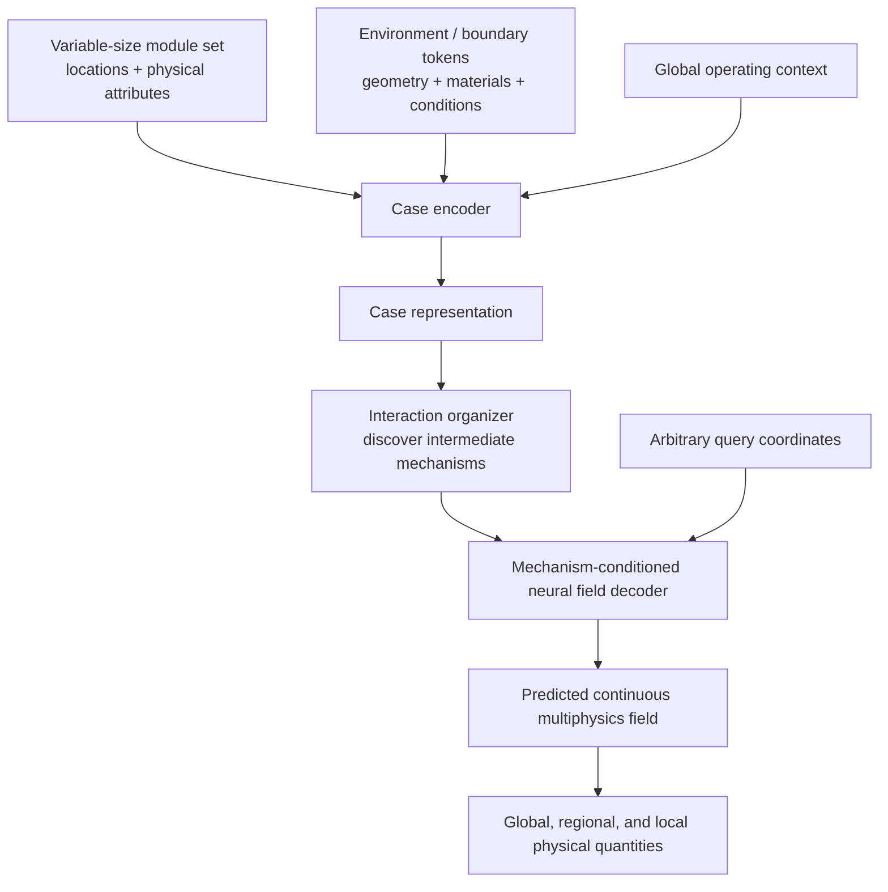
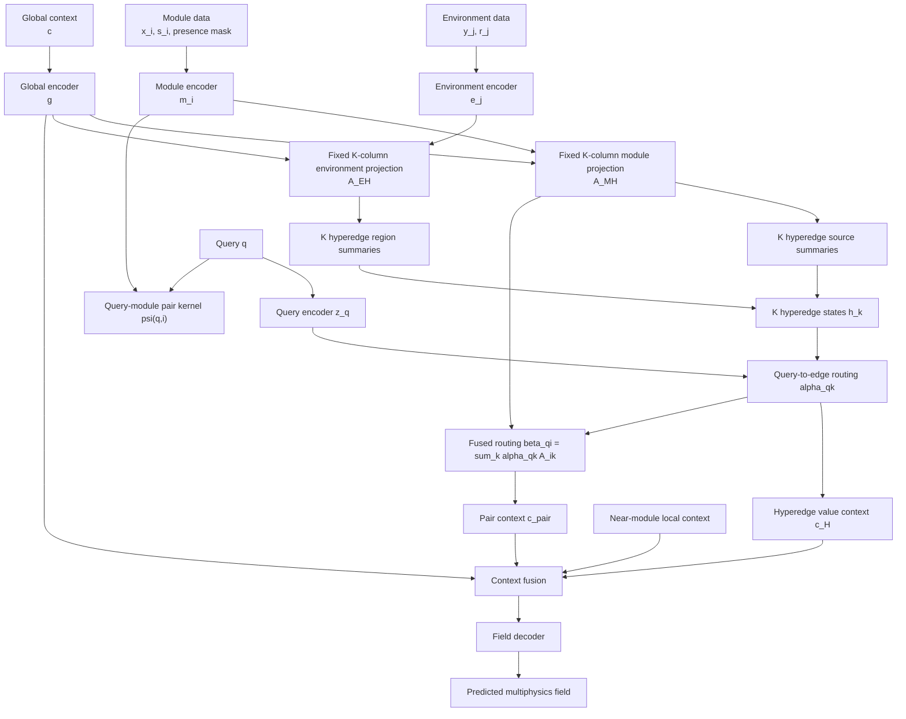
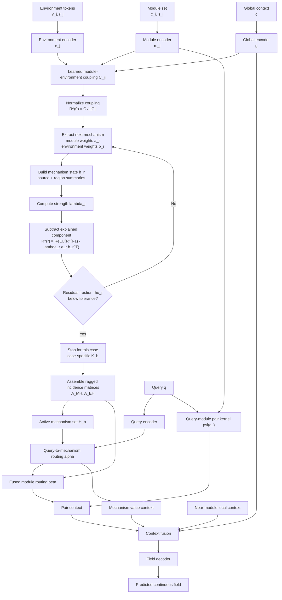
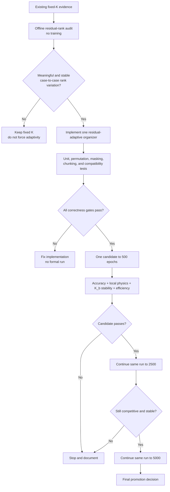

# HONF Forward Model: From Fixed-Rank Organization to Case-Adaptive Residual Mechanisms

## Purpose

This document explains, in one place:

1. the general forward modular-design problem;
2. the formulation of the current HONF model;
3. the proposed case-adaptive HONF formulation;
4. a focused plan for upgrading and testing the model.

The presentation combines mathematical definitions with vertical block-flow charts. The intended audience includes both researchers who want the mathematical structure and collaborators who need an intuitive picture of the data flow.

The current implementation being reinterpreted is the maintained `HONF_Proj` code, especially:

- `src/honf_forward_core/model.py`;
- `src/honf_forward_core/organizer.py`;
- `src/honf_forward_core/decoder.py`;
- `src/honf_forward_core/decoding/pairwise.py`;
- `src/config_core/forward/stage7_structured_context.json`.

The proposed model is not yet implemented. It is a design specification for the next HONF development round.

---

# 1. Notation and symbols

We consider one physical case \(b\). The case index is omitted when no confusion is possible.

## 1.1 Physical inputs

| Symbol | Meaning | Shape |
|---|---|---:|
| \(M\) | Number of active physical modules in the case | scalar |
| \(E\) | Number of environment tokens | scalar |
| \(Q\) | Number of queried field locations | scalar |
| \(F\) | Number of predicted physical fields | scalar |
| \(H\) | Hidden neural feature width | scalar |
| \(K\) | Current model's globally fixed number of hyperedges | scalar |
| \(K_b\) | Proposed model's case-specific number of mechanisms | scalar |
| \(x_i\) | Coordinate of module \(i\) | \(\mathbb R^d\) |
| \(s_i\) | Physical attributes of module \(i\) | \(\mathbb R^{D_M}\) |
| \(y_j\) | Coordinate of environment token \(j\) | \(\mathbb R^d\) |
| \(r_j\) | Environment or boundary attributes at token \(j\) | \(\mathbb R^{D_E}\) |
| \(c\) | Case-level operating and material context | \(\mathbb R^{D_C}\) |
| \(q_\ell\) | Field query coordinate | \(\mathbb R^d\) |
| \(u(q_\ell)\) | True physical field at query \(q_\ell\) | \(\mathbb R^F\) |

Here \(d=2\) for the current ThermalChannel example, but the mathematical formulation is intended to extend to \(d=3\).

The module set is

\[
\mathcal M
=
\left\{
(x_i,s_i)
\right\}_{i=1}^{M},
\]

the environment set is

\[
\mathcal E
=
\left\{
(y_j,r_j)
\right\}_{j=1}^{E},
\]

and the requested query set is

\[
\mathcal Q
=
\left\{
q_\ell
\right\}_{\ell=1}^{Q}.
\]

## 1.2 Learned representations

| Symbol | Meaning | Shape |
|---|---|---:|
| \(m_i\) | Encoded module token | \(\mathbb R^H\) |
| \(e_j\) | Encoded environment token | \(\mathbb R^H\) |
| \(g\) | Encoded global case token | \(\mathbb R^H\) |
| \(h_k\) | Current model's hyperedge state | \(\mathbb R^H\) |
| \(h_r\) | Proposed model's extracted mechanism state | \(\mathbb R^H\) |
| \(A^{MH}_{ik}\) | Module-to-hyperedge incidence | scalar |
| \(A^{EH}_{jk}\) | Environment-to-hyperedge incidence | scalar |
| \(\alpha_{\ell k}\) | Query-to-hyperedge routing weight | scalar |
| \(\beta_{\ell i}\) | Query-conditioned module-routing weight | scalar |
| \(\psi(q_\ell,i)\) | Learned query-module pair response | \(\mathbb R^H\) |

## 1.3 Proposed residual-topology symbols

| Symbol | Meaning | Shape |
|---|---|---:|
| \(C_{ij}\) | Learned module-environment coupling strength | scalar |
| \(\widetilde C\) | Normalized coupling matrix | \(\mathbb R^{M\times E}\) |
| \(R^{(r)}\) | Unexplained coupling after extracting \(r\) mechanisms | \(\mathbb R^{M\times E}\) |
| \(a_{ir}\) | Module membership of mechanism \(r\) | scalar |
| \(b_{jr}\) | Environment membership of mechanism \(r\) | scalar |
| \(\lambda_r\) | Strength of mechanism \(r\) | scalar |
| \(\rho_r\) | Fraction of unexplained coupling after mechanism \(r\) | scalar |
| \(\varepsilon_{\text{edge}}\) | Stopping tolerance for unexplained coupling | scalar |
| \(\tau\) | Soft-stop temperature used during training | scalar |

All incidence and routing weights are nonnegative unless explicitly stated otherwise.

---

# 2. The general forward modular-design problem

## 2.1 Problem statement

A modular physical system contains a variable-size set of discrete physical entities. Examples include:

- burners in a furnace;
- cylinders or bluff bodies in a flow;
- turbines in a wind farm;
- injection or production wells in a geothermal field;
- heat-generating components in a cooling channel.

Each module has:

- a location \(x_i\);
- physical attributes \(s_i\);
- interactions with boundaries, materials, operating conditions, and other modules.

The forward problem is to learn the operator

\[
\mathcal F:
\left(
\mathcal M,\mathcal E,c,\mathcal Q
\right)
\mapsto
\left\{
u(q_\ell)
\right\}_{\ell=1}^{Q}.
\]

Equivalently,

\[
\widehat u(q_\ell)
=
\mathcal F_\theta
\left(
q_\ell;
\mathcal M,\mathcal E,c
\right),
\qquad
\ell=1,\ldots,Q.
\]

The output is a continuous neural field: after the case has been encoded, the field can be queried at arbitrary coordinates.

## 2.2 Why the problem is difficult

The model must handle several kinds of variability simultaneously:

\[
M
\quad\text{varies between cases,}
\]

\[
Q
\quad\text{depends on the requested output resolution,}
\]

\[
\mathcal M
\quad\text{is unordered,}
\]

and the physical interaction complexity is not determined by module count alone.

Two cases with the same \(M\) may have very different interaction complexity because of:

- module spacing;
- clustering;
- module-property heterogeneity;
- distance to walls or boundaries;
- flow direction and operating condition;
- long-range coupling.

The desired model should therefore satisfy:

1. **set invariance** with respect to module ordering;
2. **continuous field reconstruction** at arbitrary queries;
3. **case-specific organization** of module and environment interactions;
4. **scalable execution** when \(Q\), \(M\), or \(E\) is large;
5. **stable gradients** for later inverse design.

## 2.3 General data-flow chart



Plain-text fallback:

```text
MODULE SET
    │
ENVIRONMENT / BOUNDARIES
    │
GLOBAL OPERATING CONTEXT
    ▼
ENCODER
    ▼
CASE REPRESENTATION
    ▼
INTERACTION ORGANIZER
    ▼
MECHANISM-CONDITIONED FIELD DECODER
    ▲
QUERY COORDINATES
    ▼
CONTINUOUS PHYSICAL FIELD
```

---

# 3. The current HONF formulation

The current accepted HONF follows:

\[
\boxed{
\text{Encoder}
\rightarrow
\text{fixed-}K\text{ organizer}
\rightarrow
\text{query-conditioned decoder}.
}
\]

The main scientific reference uses \(K=6\).

---

## 3.1 Encoder

The encoder maps raw physical inputs to a common hidden space:

\[
m_i
=
E_M
\left(
s_i,\Phi(x_i),g
\right)
\in\mathbb R^H,
\]

\[
e_j
=
E_E
\left(
r_j,\Phi(y_j),g
\right)
\in\mathbb R^H,
\]

\[
g
=
E_G(c)
\in\mathbb R^H.
\]

Here \(\Phi(\cdot)\) denotes positional or Fourier features.

The encoded objects are:

\[
M_{\text{tok}}
=
[m_1,\ldots,m_M]
\in\mathbb R^{M\times H},
\]

\[
E_{\text{tok}}
=
[e_1,\ldots,e_E]
\in\mathbb R^{E\times H}.
\]

The encoder already solves the previous fixed-\(N_{\max}\) problem by supporting a padded module tensor together with a module-presence mask. The active number \(M\) may vary case by case.

---

## 3.2 Fixed-\(K\) organizer

### Module assignment

The current fixed organizer contains a learned projection

\[
W_M:
\mathbb R^H
\rightarrow
\mathbb R^K.
\]

For each module,

\[
z^{M}_{ik}
=
\left(
W_M m_i
\right)_k,
\]

and

\[
A^{MH}_{ik}
=
\frac{
\exp(z^{M}_{ik})
}{
\sum_{\ell=1}^{K}
\exp(z^{M}_{i\ell})
}.
\]

Thus every active module distributes one unit of assignment mass over the same globally defined \(K\) hyperedge columns:

\[
\sum_{k=1}^{K}
A^{MH}_{ik}
=
1.
\]

### Environment assignment

Similarly, the environment projection is

\[
W_E:
\mathbb R^H
\rightarrow
\mathbb R^K.
\]

The current code also adds a geometry bias based on the distance between environment token \(y_j\) and the hyperedge's module-weighted source center:

\[
z^{E}_{jk}
=
\left(
W_E e_j
\right)_k
+
b_{\text{geo}}(y_j,k).
\]

Then

\[
A^{EH}_{jk}
=
\frac{
\exp(z^{E}_{jk})
}{
\sum_{\ell=1}^{K}
\exp(z^{E}_{j\ell})
},
\]

with

\[
\sum_{k=1}^{K}
A^{EH}_{jk}
=
1.
\]

### Hyperedge geometry

The source center of hyperedge \(k\) is

\[
s_k
=
\frac{
\sum_{i=1}^{M}
A^{MH}_{ik}x_i
}{
\sum_{i=1}^{M}
A^{MH}_{ik}
+\epsilon
}.
\]

The response-region center is

\[
r_k
=
\frac{
\sum_{j=1}^{E}
A^{EH}_{jk}y_j
}{
\sum_{j=1}^{E}
A^{EH}_{jk}
+\epsilon
}.
\]

Similar weighted formulas produce source and region scales.

### Hyperedge state

The module summary is

\[
\bar m_k
=
\frac{
\sum_i
A^{MH}_{ik}
W_{M\rightarrow H}m_i
}{
\sum_i A^{MH}_{ik}+\epsilon
},
\]

and the environment summary is

\[
\bar e_k
=
\frac{
\sum_j
A^{EH}_{jk}
W_{E\rightarrow H}e_j
}{
\sum_j A^{EH}_{jk}+\epsilon
}.
\]

The hyperedge state is

\[
h_k
=
H_{\text{mix}}
\left(
\bar m_k+\bar e_k
\right).
\]

The organizer therefore compresses the complete case into

\[
H_{\text{edge}}
=
[h_1,\ldots,h_K]
\in\mathbb R^{K\times H}.
\]

---

## 3.3 Query-to-hyperedge routing

Each query is encoded:

\[
z_q
=
E_Q
\left(
\Phi(q)
\right)
\in\mathbb R^H.
\]

The query-to-hyperedge logit is

\[
\ell_{qk}
=
\frac{
\left(
W_Q z_q
\right)^\top
\left(
W_H h_k
\right)
}{
\sqrt H
}
+
b_{\text{query-geo}}(q,k).
\]

The routing distribution is

\[
\alpha_{qk}
=
\frac{
\exp(\ell_{qk})
}{
\sum_{\ell=1}^{K}
\exp(\ell_{q\ell})
}.
\]

Therefore,

\[
\sum_{k=1}^{K}
\alpha_{qk}
=
1.
\]

The hyperedge value context is

\[
c_H(q)
=
\sum_{k=1}^{K}
\alpha_{qk}
V_H h_k.
\]

---

## 3.4 Query-module pair context

The pairwise kernel evaluates the influence of module \(i\) at query \(q\):

\[
\psi(q,i)
=
P_\theta
\left[
\Phi(q-x_i),
m_i,
s_i,
\text{presence}_i
\right]
\in\mathbb R^H.
\]

Define the edge-normalized module incidence

\[
\bar A^{MH}_{ik}
=
\frac{
A^{MH}_{ik}
}{
\sum_{i'}A^{MH}_{i'k}
+\epsilon
}.
\]

The historical edge-explicit expression is

\[
c_{\text{pair}}(q)
=
g_{\text{pair}}
\sum_{k=1}^{K}
\alpha_{qk}
\sum_{i=1}^{M}
\bar A^{MH}_{ik}
\psi(q,i).
\]

The accepted fused executor rearranges the same sum.

Define

\[
\boxed{
\beta_{qi}
=
\sum_{k=1}^{K}
\alpha_{qk}
\bar A^{MH}_{ik}
}
\]

or in matrix form,

\[
\boxed{
\beta_{QM}
=
A_{QK}A_{KM}.
}
\]

Then

\[
\boxed{
c_{\text{pair}}(q)
=
g_{\text{pair}}
\sum_{i=1}^{M}
\beta_{qi}
\psi(q,i).
}
\]

This formulation is algebraically equivalent to the historical edge-explicit expression at full support.

---

## 3.5 Final field reconstruction

The full context is

\[
c(q)
=
c_H(q)
+
c_{\text{pair}}(q)
+
c_{\text{global}}(q)
+
c_{\text{near}}(q).
\]

The final field prediction is

\[
\widehat u(q)
=
D_\theta
\left[
\operatorname{Norm}
\left(
c(q)
\right)
\right]
\in\mathbb R^F.
\]

The global path retains case-wide information. The near-module path helps preserve local high-gradient structure that should not be forced entirely through the hyperedge bottleneck.

---

## 3.6 What \(K\) means in the current network

The fused routing matrix satisfies

\[
\beta_{QM}
=
A_{QK}A_{KM},
\]

therefore

\[
\operatorname{rank}(\beta_{QM})
\le
\min(Q,K,M).
\]

This gives the most precise interpretation:

\[
\boxed{
K
=
\text{maximum rank of the learned query-to-module routing bottleneck}.
}
\]

It is useful to compare this with Proper Orthogonal Decomposition, but the current HONF is not exactly POD because:

- the hyperedges are not orthogonal;
- they are not ordered by covariance eigenvalues;
- there is no exact energy spectrum;
- the basis changes with the physical case;
- the field decoder is nonlinear;
- global and near-module paths bypass the \(K\)-factorization.

It is also not a strict Galerkin projection because no PDE residual is projected onto test functions.

A careful description is:

\[
\boxed{
\text{HONF is a case-conditioned nonlinear low-rank routing factorization.}
}
\]

---

## 3.7 Limitation of global fixed \(K\)

The current layers

\[
W_M:\mathbb R^H\rightarrow\mathbb R^K
\]

and

\[
W_E:\mathbb R^H\rightarrow\mathbb R^K
\]

make the \(K\) hyperedge columns persistent learned parameter identities.

Every case must use the same \(K\), even though cases may have very different interaction complexity.

This creates two regimes.

### Simple case

If the intrinsic interaction complexity is low,

\[
K_{\text{needed}}
<
K,
\]

then several edge channels may become redundant or correlated.

### Complex case

If the intrinsic interaction complexity is high,

\[
K_{\text{needed}}
>
K,
\]

then the fixed bottleneck may compress local or high-gradient effects too aggressively.

The K-scaling audit suggests that a smaller K can preserve or improve bulk-field accuracy while reducing query/pairwise diversity and weakening some localized near-interface physics. This supports the view that K controls organizational richness more than raw parameter count or runtime.

---

## 3.8 Current model block-flow chart



Plain-text fallback:

```text
MODULES ──► MODULE ENCODER ──► FIXED K-COLUMN ASSIGNMENT ─┐
                                                          │
ENVIRONMENT ─► ENV ENCODER ─► FIXED K-COLUMN ASSIGNMENT ─┼─► K HYPEREDGE STATES
                                                          │
GLOBAL CONTEXT ────────────────────────────────────────────┘
                                                                  │
QUERY ─► QUERY ENCODER ─► QUERY-TO-EDGE ROUTING alpha ─────────────┤
                                                                  ▼
                                                       beta(q,module)
                                                                  │
QUERY + MODULE ─► PAIR KERNEL psi(q,module) ───────────────────────┤
                                                                  ▼
                                                        CONTEXT FUSION
                                                                  ▼
                                                           FIELD DECODER
                                                                  ▼
                                                          PHYSICAL FIELD
```

---

# 4. Proposed new model: Case-Adaptive Residual-Basis HONF

## 4.1 Core idea

The new model should not predict one global \(K\), and it should not begin every case with a globally sized anonymous slot pool that must later be pruned.

Instead:

\[
\boxed{
\text{extract one interaction mechanism}
\rightarrow
\text{remove what it explains}
\rightarrow
\text{continue only if necessary}.
}
\]

The case-specific mechanism count is

\[
K_b
=
K
\left(
\mathcal M_b,
\mathcal E_b,
c_b
\right).
\]

The model uses shared parameters at every extraction step. No trainable parameter is tied to "edge 0", "edge 1", or a global edge index.

---

## 4.2 What remains unchanged

The first implementation should retain:

- the current module encoder;
- the current environment encoder;
- the current global encoder;
- the current query encoder;
- the current query-module pair kernel;
- the current global context path;
- the current near-module context path;
- the current fused \(\beta\)-based execution;
- the current physical losses and case-plugin structure.

The major redesign is concentrated in the organizer.

---

## 4.3 Step 1: Construct a learned coupling matrix

For every module-environment pair, define a nonnegative coupling strength:

\[
C_{ij}
=
P_i
\,
\operatorname{softplus}
\left(
f_C
\left[
m_i,
e_j,
\Phi(y_j-x_i),
g
\right]
\right)
\chi_{ij}.
\]

Here:

- \(P_i\in\{0,1\}\) is the module-presence mask;
- \(f_C\) is a shared neural interaction function;
- \(\chi_{ij}\in[0,1]\) is an optional locality factor;
- \(C\in\mathbb R_+^{M\times E}\).

Normalize the matrix:

\[
\widetilde C
=
\frac{
C
}{
\|C\|_F+\epsilon
}.
\]

The normalized matrix represents the interaction structure that the organizer must explain.

It is not claimed to be physical energy. It is a learned nonnegative interaction measure.

Initialize the residual:

\[
R^{(0)}
=
\widetilde C.
\]

---

## 4.4 Step 2: Extract one mechanism from the residual

At extraction step \(r\), the model finds:

\[
a_r
=
[a_{1r},\ldots,a_{Mr}]^\top,
\]

\[
b_r
=
[b_{1r},\ldots,b_{Er}]^\top,
\]

where

\[
a_{ir}\ge0,
\qquad
\sum_i a_{ir}=1,
\]

and

\[
b_{jr}\ge0,
\qquad
\sum_j b_{jr}=1.
\]

### Module-anchor distribution

A simple initialization is

\[
a^{(0)}_{ir}
=
\operatorname{softmax}_i
\left[
u_\theta(m_i,g)
+
\log
\left(
\sum_j
R^{(r-1)}_{ij}
+\epsilon
\right)
\right].
\]

Modules with more unexplained interaction mass receive more attention.

### Environment distribution

Using the current module weights,

\[
b_{jr}
=
\operatorname{softmax}_j
\left[
v_\theta(e_j,h_r,g)
+
\log
\left(
\sum_i
R^{(r-1)}_{ij}
a_{ir}
+\epsilon
\right)
+
b_{\text{geo}}(y_j,s_r)
\right].
\]

### Refined module distribution

Then refine the module weights:

\[
a_{ir}
=
\operatorname{softmax}_i
\left[
u'_\theta(m_i,h_r,g)
+
\log
\left(
\sum_j
R^{(r-1)}_{ij}
b_{jr}
+\epsilon
\right)
\right].
\]

Two or three shared refinement rounds are sufficient for the initial model.

---

## 4.5 Step 3: Build the mechanism state

The source center is

\[
s_r
=
\sum_i
a_{ir}x_i.
\]

The response-region center is

\[
r_r
=
\sum_j
b_{jr}y_j.
\]

The module summary is

\[
\bar m_r
=
\sum_i
a_{ir}
W_Mm_i.
\]

The environment summary is

\[
\bar e_r
=
\sum_j
b_{jr}
W_Ee_j.
\]

The mechanism state is

\[
h_r
=
H_\theta
\left[
\bar m_r,
\bar e_r,
s_r,
r_r,
g
\right].
\]

The same network \(H_\theta\) is used for every mechanism and every case.

---

## 4.6 Step 4: Measure and subtract the explained component

The mechanism explains a nonnegative rank-one component:

\[
\widehat R_r
=
\lambda_r
a_rb_r^\top.
\]

Choose the component strength analytically:

\[
\lambda_r
=
\frac{
\left\langle
R^{(r-1)},
a_rb_r^\top
\right\rangle
}{
\|a_rb_r^\top\|_F^2+\epsilon
}.
\]

Update the residual:

\[
\boxed{
R^{(r)}
=
\operatorname{ReLU}
\left[
R^{(r-1)}
-
\lambda_r
a_rb_r^\top
\right].
}
\]

Because all entries are nonnegative,

\[
0
\le
R^{(r)}_{ij}
\le
R^{(r-1)}_{ij},
\]

therefore

\[
\boxed{
\|R^{(r)}\|_F
\le
\|R^{(r-1)}\|_F.
}
\]

This gives the organizer a monotonic progress measure.

It also discourages duplicate mechanisms naturally: after one mechanism explains a pattern, less of that pattern remains in the residual.

---

## 4.7 Step 5: Determine the case-specific mechanism count

Define the unresolved fraction

\[
\rho_r
=
\frac{
\|R^{(r)}\|_F^2
}{
\|R^{(0)}\|_F^2+\epsilon
}.
\]

Then define

\[
\boxed{
K_b
=
\min
\left\{
r:
\rho_r
\le
\varepsilon_{\text{edge}}
\right\}.
}
\]

Interpretation:

- if the case is simple, the residual falls quickly and \(K_b\) is small;
- if the case contains complex coupled interactions, more mechanisms are extracted;
- no global K is assigned to all cases.

A natural safety cap is

\[
K_b
\le
M_b,
\]

because the coupling matrix has shape \(M_b\times E_b\), so its matrix rank cannot exceed \(M_b\).

This cap is case-dependent and follows from the physical input size. It is not a globally fixed scientific K.

---

## 4.8 Soft stopping during training

Hard stopping changes the computation graph discontinuously.

During training, use a soft survival weight

\[
s_r
=
\sigma
\left(
\frac{
\rho_{r-1}
-
\varepsilon_{\text{edge}}
}{
\tau
}
\right),
\]

where:

- \(\sigma\) is the logistic sigmoid;
- \(\tau>0\) controls transition smoothness.

When the residual is large,

\[
s_r\approx1.
\]

After the stopping tolerance is reached,

\[
s_r\approx0.
\]

During evaluation, use the hard rule based on \(K_b\).

This gives smooth gradients without returning to an epoch-based global sparsity schedule.

---

## 4.9 Assemble the final incidence matrices

The extracted module factors are column-normalized across modules. The decoder requires each module to distribute participation across mechanisms.

Define

\[
A^{MH}_{ir}
=
\frac{
s_r\lambda_r a_{ir}
}{
\sum_{\ell=1}^{K_b}
s_\ell\lambda_\ell a_{i\ell}
+\epsilon
}.
\]

Similarly,

\[
A^{EH}_{jr}
=
\frac{
s_r\lambda_r b_{jr}
}{
\sum_{\ell=1}^{K_b}
s_\ell\lambda_\ell b_{j\ell}
+\epsilon
}.
\]

Then

\[
\sum_r A^{MH}_{ir}=1
\]

for every active module, and

\[
\sum_r A^{EH}_{jr}=1
\]

for every environment token.

The final mechanism set is

\[
\mathcal H_b
=
\left\{
h_r
\right\}_{r=1}^{K_b}.
\]

---

## 4.10 Query routing and field decoding

The decoder uses only the active mechanisms for that case:

\[
\alpha_{qr}
=
\operatorname{softmax}_{r\le K_b}
\left[
\frac{
(W_Qz_q)^\top(W_Hh_r)
}{
\sqrt H
}
+
b_{\text{query-geo}}(q,r)
\right].
\]

The hyperedge value context is

\[
c_H(q)
=
\sum_{r=1}^{K_b}
\alpha_{qr}V_Hh_r.
\]

The query-conditioned module routing is

\[
\boxed{
\beta_{qi}
=
\sum_{r=1}^{K_b}
\alpha_{qr}
\bar A^{MH}_{ir}.
}
\]

The pairwise context remains

\[
c_{\text{pair}}(q)
=
g_{\text{pair}}
\sum_i
\beta_{qi}
\psi(q,i).
\]

The field is reconstructed exactly as before:

\[
\widehat u(q)
=
D_\theta
\left[
\operatorname{Norm}
\left(
c_H(q)
+
c_{\text{pair}}(q)
+
c_{\text{global}}(q)
+
c_{\text{near}}(q)
\right)
\right].
\]

Thus the new organizer is case-adaptive, while the validated fused decoder remains largely unchanged.

---

## 4.11 Batched computation

A minibatch may contain different case-specific counts:

\[
K_1,
K_2,
\ldots,
K_B.
\]

For storage, use

\[
K_{\text{batch}}
=
\max_b K_b.
\]

Pad the mechanism tensors to \(K_{\text{batch}}\) and carry

\[
\text{edge\_active\_mask}
\in
\{0,1\}^{B\times K_{\text{batch}}}.
\]

This does not restore a globally fixed scientific K. It is only a tensor-packing convention.

---

## 4.12 New model block-flow chart



Plain-text fallback:

```text
MODULES ───────► MODULE ENCODER ──┐
                                  │
ENVIRONMENT ───► ENV ENCODER ─────┼─► LEARNED COUPLING MATRIX C
                                  │
GLOBAL CONTEXT ► GLOBAL ENCODER ──┘
                                              ▼
                                      NORMALIZED RESIDUAL R
                                              ▼
                                  EXTRACT ONE MECHANISM
                                   a_r, b_r, h_r, lambda_r
                                              ▼
                                  SUBTRACT EXPLAINED PART
                                              ▼
                                    RESIDUAL BELOW TOLERANCE?
                                     │                  │
                                    NO                 YES
                                     │                  │
                                     └──── REPEAT ◄─────┘
                                                        ▼
                                             CASE-SPECIFIC K_b
                                                        ▼
                                          ACTIVE INCIDENCE MATRICES
                                                        ▼
QUERY ─► QUERY ROUTING ───────────────────────────────► beta(q,module)
MODULE + QUERY ─► PAIR KERNEL ──────────────────────────────┤
                                                            ▼
                                                    CONTEXT FUSION
                                                            ▼
                                                     FIELD DECODER
                                                            ▼
                                                    PHYSICAL FIELD
```

---

# 5. What the redesign changes

| Question | Current model | Proposed model |
|---|---|---|
| How is K chosen? | One global configuration value | Per-case residual stopping |
| Are edge parameters index-specific? | Yes, fixed output columns | No, shared extraction network |
| How are mechanisms generated? | Simultaneously | Sequentially |
| How is redundancy handled? | Learned correlation or external selection | Explained structure is subtracted |
| How is stopping controlled? | Global K or scheduled selection | Case-specific residual tolerance |
| Is a detached greedy count decision needed? | In the previous adaptive path, yes | No |
| Does module count equal mechanism count? | No | No, but \(K_b\le M_b\) is a natural cap |
| Does the decoder need a full rewrite? | — | No; retain fused \(\beta\)-routing |
| Does lower K guarantee large speedup? | No | No; main query cost still depends on selected module pairs |
| What controls representation adaptivity? | Fixed K | Case-specific \(K_b\) |
| What controls execution sparsity? | Gathered \(\beta\)-routing | Gathered \(\beta\)-routing |

---

# 6. Focused upgrade plan

The upgrade should avoid a long chain of intermediate model variants. The goal is to test the central scientific claim directly:

\[
\boxed{
\text{Can one shared organizer extract a different number of useful mechanisms for different cases?}
}
\]

---

## Phase 0: No-training feasibility audit

Before changing the model:

1. Use existing encoded module and environment data.
2. Construct an offline nonnegative module-environment coupling matrix.
3. Apply a simple sequential rank-one residual decomposition.
4. Measure the implied

\[
K_b(\varepsilon_{\text{edge}})
\]

for several tolerances.
5. Compare \(K_b\) with:
   - active module count;
   - module spacing;
   - cluster density;
   - property heterogeneity;
   - wall proximity;
   - current query effective rank;
   - K=4 versus K=6 prediction disagreement;
   - near-interface difficulty.

### Required conclusion

Proceed only if:

- the estimated \(K_b\) distribution is not trivially constant;
- variation is stable across reasonable tolerance choices;
- higher inferred complexity has a defensible physical relationship to geometry or error.

This phase requires no formal training run.

---

## Phase 1: Implement one new organizer mode

Add one new configuration mode:

```text
organizer_mode = "case_adaptive_residual"
```

Keep all historical modes unchanged.

The new organizer should implement:

- coupling construction;
- shared sequential extraction;
- residual subtraction;
- soft training survival;
- hard evaluation stopping;
- per-case active-edge masks;
- padded batch output;
- residual and count diagnostics.

Do not include:

- split/merge heuristics;
- entropy schedules;
- detached greedy selection;
- count supervision;
- edge-balancing losses;
- module-to-edge labels.

### Correctness tests

Prove:

1. residual norm is non-increasing;
2. hard stopping is case-specific;
3. padded inactive edges contribute exactly zero;
4. module-order permutation does not change the physical output;
5. one-shot and chunked query decoding match;
6. historical Run-1401 checkpoints still load and replay through the old mode;
7. fused \(\beta\)-execution remains valid.

---

## Phase 2: One 500-epoch candidate

Train exactly one initial candidate from scratch.

Keep:

- the current encoders;
- the current decoder;
- the current legacy pair kernel;
- fused dense training execution;
- the current losses;
- the current optimizer policy;
- the current data and seed.

Change only the organizer.

### Evaluate five central effects

#### 1. Accuracy

Compare:

\[
\text{whole-field MSE},
\]

\[
\text{near-interface MSE},
\]

\[
\text{channel-specific MSE}.
\]

The new model should not gain global accuracy by sacrificing localized physics.

#### 2. Adaptivity

Measure the distribution of

\[
K_b.
\]

The target is not "more variation is always better." The target is:

- stable;
- case-dependent when justified;
- not collapsed to one value because of an optimization shortcut.

#### 3. Stability

For the same physical case, perturb:

- environment-token subsampling;
- query sampling;
- module padding;
- module ordering.

The inferred \(K_b\) and mechanism summaries should remain stable.

#### 4. Representation quality

Report:

- residual fraction \(\rho_r\);
- marginal explained fraction;
- module/environment incidence diversity;
- query-routing effective rank;
- mechanism spatial separation;
- mechanism-count distribution.

#### 5. Efficiency

Measure:

- organizer time;
- prepared-decoder time;
- full-forward time;
- peak allocated memory;
- selected module pairs under gathered execution.

A smaller \(K_b\) may reduce organizer and query-routing work, but the dominant large-\(Q\) acceleration should still come from sparse \(\beta\)-based module execution.

### Decision at epoch 500

Continue the same run only if:

- accuracy is within the pre-defined matched-budget band;
- near-interface fidelity is acceptable;
- no structural collapse is present;
- \(K_b\) is stable and physically interpretable;
- the model is not simply reproducing one constant count.

---

## Phase 3: Conditional continuation and promotion

If the candidate passes epoch 500:

1. continue the same run to 2500;
2. evaluate again;
3. continue to 5000 only if the accuracy and structural evidence remain competitive.

No second adaptive architecture should be launched before the first candidate is understood.

Promotion requires:

\[
\boxed{
\text{competitive field accuracy}
+
\text{stable case-specific }K_b
+
\text{preserved local physics}
+
\text{clean execution behavior}.
}
\]

---

## 6.1 Upgrade-plan flow chart



---

# 7. Minimal evidence table for the new model

| Claim | Evidence required |
|---|---|
| K is genuinely case-specific | Non-degenerate \(K_b\) distribution on held-out cases |
| Variation is meaningful | Correlation with interaction-complexity descriptors or localized difficulty |
| Count is stable | Similar \(K_b\) under module order, token sampling, and query resampling |
| Residual extraction works | Monotonic \(\rho_r\) and diminishing marginal explained mass |
| No mechanism collapse | Distinct incidence/region summaries and nontrivial query use |
| Bulk accuracy is preserved | Complete-split field MSE |
| Local physics is preserved | Near-interface and high-gradient metrics |
| Old model is not broken | Golden replay and strict checkpoint compatibility |
| Dynamic K helps representation | Better accuracy/structure tradeoff than fixed K |
| Execution remains scalable | Prepared/full runtime, memory, and gathered pair count |

---

# 8. What should not be changed in the same round

To isolate the effect of case-specific topology, the first upgrade should not simultaneously change:

- the pairwise kernel architecture;
- the final field head;
- the loss formulation;
- the query encoder;
- the Stage-A/local-module model;
- the environment-token resolution;
- the physical dataset;
- the inverse model.

The scientific comparison should be:

\[
\boxed{
\text{same encoder}
+
\text{same decoder}
+
\text{different organizer}.
}
\]

---

# 9. Final side-by-side summary

## Current HONF

\[
\mathcal M,\mathcal E,c
\rightarrow
\left\{
h_k
\right\}_{k=1}^{K}
\rightarrow
\alpha_{qk}
\rightarrow
\beta_{qi}
\rightarrow
\widehat u(q),
\]

where \(K\) is fixed globally.

The model is a nonlinear low-rank routing factorization whose rank ceiling is globally configured.

## Proposed HONF

\[
\mathcal M,\mathcal E,c
\rightarrow
R^{(0)}
\rightarrow
(h_1,R^{(1)})
\rightarrow
(h_2,R^{(2)})
\rightarrow
\cdots
\rightarrow
(h_{K_b},R^{(K_b)})
\rightarrow
\alpha_{qr}
\rightarrow
\beta_{qi}
\rightarrow
\widehat u(q),
\]

where

\[
K_b
=
\min
\left\{
r:
\rho_r
\le
\varepsilon_{\text{edge}}
\right\}.
\]

The model becomes a case-adaptive residual mechanism extractor followed by the validated fused neural-field decoder.

The central change is therefore:

\[
\boxed{
\text{from a globally fixed latent rank}
\quad\longrightarrow\quad
\text{a case-specific residual stopping criterion}.
}
\]

The key architectural principle is:

\[
\boxed{
K_b\text{ adapts the representation,}
\qquad
\beta_{qi}\text{ adapts the query-time execution.}
}
\]
