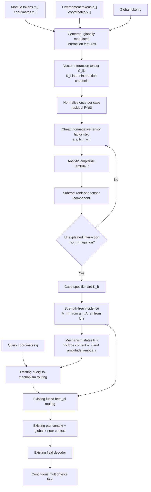

# HONF Case-Adaptive Forward Revision Plan — Phase 2

## Tensor-Residual Interaction Mechanisms

## 0. Purpose, evidence base, and execution boundary

This document defines the second controlled revision of the case-adaptive HONF organizer.

Repository state at planning time:

- repository: `cosmos2w/ModularDT`;
- branch: `agent/honf-core-next`;
- inspected branch head: `508b2a4771efec73a123b1412fc8d2dd89ce20cb`;
- project root: `HONF_Proj/`;
- current adaptive organizer: `organizer_mode="case_adaptive_residual"`;
- established fixed reference: Run 1401, best-field checkpoint at epoch 4585;
- Phase-1 adaptive diagnostic reference: Run 1700, best-field checkpoint at epoch 4888 and final checkpoint at epoch 5000.

The Phase-1 result is scientifically useful but not promotable. It proves that case-specific hard mechanism counts are operational, but it also exposes four coupled defects:

1. the learned scalar module-environment coupling is almost rank one;
2. mechanism amplitude is mixed into incidence membership and suppresses later mechanisms;
3. training uses soft support while evaluation uses hard support, producing different forward functions;
4. the sequential loop repeatedly performs hidden-width neural attention and dominates latency.

The strongest evidence is:

| Diagnostic | Run 1700 | Run 1401 or target |
|---|---:|---:|
| Complete-test pooled normalized fluid MSE | `4.9677e-3` | Run 1401: `9.5379e-4` |
| Far-field pooled normalized MSE | `6.1994e-3` | Run 1401: `6.1045e-4` |
| Scalar coupling effective-rank median | `1.018` | must be clearly above rank one |
| Environment effective rank | `1.49` | Run 1401: `4.79` |
| Environment edge-column cosine | `0.749` | Run 1401: `0.106` |
| Normalized region separation | `0.0466` | Run 1401: `0.282` |
| Soft/hard field discrepancy, mean / p95 | `0.0398 / 0.0728` | should be zero in the new forward pass |
| Full-forward latency ratio | `3.05x` | Phase-2 target `<=1.5x` Run 1401 |
| Prepared-decoder latency ratio | `1.02x` | decoder is not the bottleneck |

The Phase-2 scientific objective is therefore narrow:

> Replace the scalar coupling matrix with a compact vector-valued interaction tensor, perform lightweight shared residual factorization, keep mechanism strength separate from incidence membership, and make training and evaluation use the same hard forward support while retaining a smooth surrogate gradient.

This is one coherent organizer redesign. It is **not** a collection of regularizers, extra experts, physical constraints, or decoder changes.

### Formal-run boundary

Codex may implement and validate the new mode, then launch exactly one managed formal run:

- Run ID: **1701**;
- device: **`cuda:0`**;
- initial endpoint: **epoch 500**;
- initialization: **from scratch**;
- no second formal candidate;
- no automatic continuation beyond epoch 500.

Run 1701 is both the first full Phase-2 candidate and the final formal run authorized in this goal. After the user later resumes the same run to epoch 5000, Codex may be asked in a separate goal to execute the full three-model comparison and complete the final report specified in Section 9.

---

# 1. Non-negotiable compatibility and design boundaries

## 1.1 Preserve all established modes

The following modes must continue to coexist and retain their current behavior:

- `fixed_projection`;
- `exchangeable_slots`;
- `case_adaptive_residual` (Run-1700 / Phase-1 behavior);
- the new `case_adaptive_tensor_residual` mode.

Do not rewrite Phase 1 in place. The new implementation must live behind a new organizer attribute and a new organizer mode. Historical state-dict names, profile semantics, golden replay, and strict loading must remain intact.

Recommended parameter ownership:

```text
organizer.module_score.*                         # existing fixed organizer
organizer.exchangeable.*                        # existing exchangeable organizer
organizer.case_adaptive_residual.*               # existing Phase-1 organizer
organizer.case_adaptive_tensor_residual.*        # new Phase-2 organizer
```

This separation makes later cleanup straightforward: a rejected experimental mode can be removed by deleting one focused implementation, one delegation branch, mode-specific configuration fields, tests, and one profile.

## 1.2 Preserve the established forward model around the organizer

Keep unchanged:

- module, environment, global, and query encoders;
- ThermalChannel input adapter and environment builder;
- frozen Stage-A local surrogate;
- one-pass local/global interaction refinement;
- context-fusion field assembly;
- legacy four-layer pairwise MLP;
- fused query-module contraction;
- global and near-module context paths;
- field, internal, interface, port, and consistency losses;
- optimizer family and base learning rate;
- dataset, split, normalization, point sampling, and environment-token resolution.

The scientific comparison remains:

\[
\boxed{
\text{same encoder}
+\text{same decoder}
+\text{same physical training procedure}
+\text{new organizer only}.
}
\]

## 1.3 Do not add symptom-level controls

Phase 2 must not add:

- a learned count head;
- count labels or a target-K loss;
- entropy, diversity, orthogonality, balance, or region-separation losses;
- a fixed one-edge-per-module rule;
- hard environment clusters or manually prescribed advection cones;
- a new pair kernel, field head, Transformer, or expert network;
- epoch-dependent topology schedules;
- detached CPU selection;
- split/merge heuristics;
- distillation from Run 1401;
- a second formal architecture trial.

Dynamic K remains an emergent consequence of residual stopping, not a quantity to force.

---

# 2. Phase-2 model overview

The new organizer is named:

```text
organizer_mode = "case_adaptive_tensor_residual"
```

Its vertical data flow is:



The four defining changes are:

\[
\boxed{
C_{ij}\in\mathbb R_+
\quad\longrightarrow\quad
C_{ij:}\in\mathbb R_+^{D_I}
}
\]

\[
\boxed{
A\propto \lambda\times\text{membership}
\quad\longrightarrow\quad
A\propto\text{membership only}
}
\]

\[
\boxed{
\text{soft training forward / hard evaluation forward}
\quad\longrightarrow\quad
\text{hard-identical forward with soft surrogate gradient}
}
\]

\[
\boxed{
\text{hidden-width neural work inside every extraction step}
\quad\longrightarrow\quad
\text{one learned tensor construction + cheap algebraic deflation}
}
\]

---

# 3. Mathematical formulation

## 3.1 Symbols and tensor shapes

For case \(b\):

| Symbol | Meaning | Shape |
|---|---|---:|
| \(B\) | batch size | scalar |
| \(M_b\) | active module count in case \(b\) | scalar |
| \(M_{\mathrm{pack}}\) | packed module width in the batch | scalar |
| \(E\) | environment-token count | scalar |
| \(H\) | established HONF hidden width | scalar |
| \(D_I\) | Phase-2 interaction-content width | scalar |
| \(x_{bi}\) | module coordinate | \(\mathbb R^2\) |
| \(y_{bj}\) | environment coordinate | \(\mathbb R^2\) |
| \(m_{bi}\) | encoded module token | \(\mathbb R^H\) |
| \(e_{bj}\) | encoded environment token | \(\mathbb R^H\) |
| \(g_b\) | encoded global token | \(\mathbb R^H\) |
| \(P_{bi}\) | active-module mask | \(\{0,1\}\) |
| \(C_{bijc}\) | nonnegative interaction tensor | scalar |
| \(\mathcal R^{(r)}_{bijc}\) | residual after mechanism \(r\) | scalar |
| \(a_{bir}\) | module factor of mechanism \(r\) | scalar |
| \(b_{bjr}\) | environment factor of mechanism \(r\) | scalar |
| \(w_{bcr}\) | interaction-content factor | scalar |
| \(\lambda_{br}\) | mechanism amplitude | scalar |
| \(\rho_{br}\) | unexplained interaction fraction | scalar |
| \(z^{H}_{br}\) | hard mechanism support | \(\{0,1\}\) |
| \(s_{br}\) | soft survival used only for gradient construction | \([0,1]\) |
| \(K_b\) | hard case-specific mechanism count | scalar |

Use

\[
D_I=32
\]

for the first Phase-2 candidate. This is an interaction-feature width, analogous to an internal hidden width. It is not a hyperedge count.

## 3.2 Centered vector-valued interaction tensor

### 3.2.1 Remove the shared additive shortcut

The core encoder may already add the global token to every environment token. The Phase-2 organizer must not add another shared global vector to all module and environment tokens as Phase 1 did.

First remove the environment-wide common component:

\[
\bar e_b
=
\frac{1}{E}\sum_{j=1}^{E}e_{bj},
\]

\[
e^{\circ}_{bj}
=
\operatorname{LN}(e_{bj}-\bar e_b).
\]

Normalize module content independently:

\[
m^{\circ}_{bi}=\operatorname{LN}(m_{bi}).
\]

Global context modulates channels multiplicatively:

\[
u_{bi}
=
W_Mm^{\circ}_{bi}
\odot
\left[1+\tanh \Gamma_M(g_b)\right],
\]

\[
v_{bj}
=
W_Ee^{\circ}_{bj}
\odot
\left[1+\tanh \Gamma_E(g_b)\right],
\]

where

\[
u_{bi},v_{bj}\in\mathbb R^{D_I}.
\]

The final layers of \(\Gamma_M\) and \(\Gamma_E\) should be zero-initialized so the initial multiplicative scale is one. This retains global conditioning without introducing a spatially constant dot-product term.

### 3.2.2 Geometry contribution

Use the existing periodic/nonperiodic relative-coordinate convention:

\[
\Delta_{bij}=\operatorname{relative}(y_{bj}-x_{bi}).
\]

Let \(\Phi_\Delta\) be the configured Fourier feature map. A small shared geometry network produces

\[
d_{bij}
=
G_\Delta\!\left(\Phi_\Delta(\Delta_{bij})\right)
\in\mathbb R^{D_I}.
\]

### 3.2.3 Signed interaction content and zero-baseline energy

Construct a signed vector score:

\[
L_{bij:}=u_{bi}\odot v_{bj}+d_{bij}.
\]

Remove the environment mean separately for every module and content channel:

\[
L^{\circ}_{bijc}
=
L_{bijc}
-
\frac{1}{E}\sum_{t=1}^{E}L_{bitc}.
\]

Define the nonnegative interaction-energy tensor

\[
\boxed{
C_{bijc}
=
P_{bi}\left(L^{\circ}_{bijc}\right)^2.
}
\]

This choice is deliberate:

- it is vector-valued rather than scalar;
- it has zero baseline when the signed interaction is zero;
- it does not introduce the ubiquitous positive floor of `softplus(0)`;
- it retains both positive and negative signed deviations through their magnitude;
- it remains nonnegative, allowing monotone residual subtraction.

The model must describe \(C\) as a learned latent interaction-energy tensor, not physical energy and not a PDE residual.

### 3.2.4 Normalization and module-environment context

Normalize once per case using total nonnegative mass:

\[
\mathcal R^{(0)}_{bijc}
=
\frac{C_{bijc}}
{\sum_{i,j,c}C_{bijc}+\epsilon}.
\]

Thus

\[
\|\mathcal R^{(0)}_b\|_1=1
\]

for a nonzero case.

Derive the established module-to-environment map from the same tensor:

\[
S^{ME}_{bij}=\sum_{c=1}^{D_I}C_{bijc},
\]

\[
A^{ME}_{bij}
=
\frac{S^{ME}_{bij}}
{\sum_tS^{ME}_{bit}+\epsilon},
\]

\[
c^{ME}_{bi}=\sum_jA^{ME}_{bij}e_{bj}.
\]

The familiar organizer token remains

\[
m^{\mathrm{org}}_{bi}
=
\left(m_{bi}+0.25W_{ME}c^{ME}_{bi}\right)P_{bi}.
\]

Do not compute a second unrelated module-environment attention map.

## 3.3 Lightweight residual tensor extraction

The Phase-1 loop repeatedly evaluates hidden-width neural attention. Phase 2 moves learned feature construction outside the loop. Each extraction step uses only reductions and elementwise products in the compact \(D_I\)-dimensional tensor.

Initialize the normalized tensor residual

\[
\mathcal R^{(0)}
=
\frac{C}{\|C\|_1+\epsilon}.
\]

For mechanism \(r\), compute an initial module factor from residual mass:

\[
\widetilde a_{bir}
=
P_{bi}
\sum_{j,c}\mathcal R^{(r-1)}_{bijc},
\]

\[
a_{bir}
=
\frac{\widetilde a_{bir}}
{\sum_t\widetilde a_{btr}+\epsilon}.
\]

Perform one algebraic nonnegative factor-refinement round:

\[
\widetilde b_{bjr}
=
\sum_{i,c}a_{bir}\mathcal R^{(r-1)}_{bijc},
\qquad
b_{bjr}
=
\frac{\widetilde b_{bjr}}
{\sum_t\widetilde b_{btr}+\epsilon},
\]

\[
\widetilde w_{bcr}
=
\sum_{i,j}a_{bir}b_{bjr}\mathcal R^{(r-1)}_{bijc},
\qquad
w_{bcr}
=
\frac{\widetilde w_{bcr}}
{\sum_t\widetilde w_{btr}+\epsilon},
\]

\[
\widetilde a_{bir}
=
P_{bi}
\sum_{j,c}b_{bjr}w_{bcr}\mathcal R^{(r-1)}_{bijc},
\qquad
 a_{bir}
=
\frac{\widetilde a_{bir}}
{\sum_t\widetilde a_{btr}+\epsilon}.
\]

Then recompute \(b_r\) and \(w_r\) once from the refined \(a_r\).

The initial candidate uses one refinement round:

\[
T_R=1.
\]

No hidden-width attention, MLP, step embedding, module-specific parameter, or edge-specific parameter is permitted inside this loop.

## 3.4 Analytic amplitude and residual deflation

Define the normalized rank-one tensor pattern

\[
P^{(r)}_{bijc}
=
a_{bir}b_{bjr}w_{bcr}.
\]

Compute its nonnegative least-squares amplitude:

\[
\lambda_{br}
=
\frac{
\langle \mathcal R_b^{(r-1)},P_b^{(r)}\rangle
}{
\|P_b^{(r)}\|_F^2+\epsilon
}.
\]

Update the residual:

\[
\boxed{
\mathcal R_b^{(r)}
=
\operatorname{ReLU}\left(
\mathcal R_b^{(r-1)}
-
\lambda_{br}P_b^{(r)}
\right).
}
\]

Because the tensors are nonnegative,

\[
0\le\mathcal R_b^{(r)}\le\mathcal R_b^{(r-1)}
\]

entrywise. Therefore both the \(L_1\) mass and Frobenius norm are non-increasing.

Use the remaining interaction-mass fraction as the stopping quantity:

\[
\boxed{
\rho_{br}
=
\frac{
\|\mathcal R_b^{(r)}\|_1
}{
\|\mathcal R_b^{(0)}\|_1+\epsilon
}.
}
\]

Since \(\|\mathcal R_b^{(0)}\|_1=1\), this is simply the unexplained fraction of learned interaction energy. Define the marginal explained fraction

\[
\Delta\rho_{br}=\rho_{b,r-1}-\rho_{br}.
\]

## 3.5 Case-dependent extraction cap and hard K

Phase 1 imposed

\[
K_{\mathrm{cap},b}=M_b,
\]

which prevents a three-module case from expressing more than three mechanisms. A vector interaction tensor can support more than one interaction-content mode for one physical module, so Phase 2 uses a case-dependent compute cap

\[
\boxed{
K_{\mathrm{cap},b}
=
\max\left(
K_{\min,b},
\left\lceil\kappa M_b\right\rceil
\right),
}
\]

with

\[
\kappa=1.5,
\qquad
K_{\min,b}=\min(M_b,K_{\min}),\qquad K_{\min}=1.
\]

Examples:

- \(M_b=3\Rightarrow K_{\mathrm{cap},b}=5\);
- \(M_b=5\Rightarrow K_{\mathrm{cap},b}=8\);
- \(M_b=12\Rightarrow K_{\mathrm{cap},b}=18\).

This cap is not the selected K and is not a global scientific rank. It is a bounded case-size-dependent safety budget.

For batch storage,

\[
K_{\mathrm{pack}}=\max_bK_{\mathrm{cap},b}.
\]

The hard support is

\[
z^{H}_{br}
=
\mathbf 1[r\le K_{\mathrm{cap},b}]
\left(
\mathbf 1[r\le K_{\min,b}]
\lor
\mathbf 1[\rho_{b,r-1}>\varepsilon_{\mathrm{edge}}]
\right).
\]

The hard case count is

\[
\boxed{
K_b=\sum_rz^{H}_{br}.
}
\]

The Phase-2 profile uses the stricter tolerance

\[
\varepsilon_{\mathrm{edge}}=0.01.
\]

This threshold is evaluated only after changing the interaction representation. Do not perform a trained threshold sweep.

During evaluation, stop the loop early when every case in the current batch has reached its stopping condition. During training, compute the packed candidate sequence so the surrogate-gradient path remains available, but keep all learned high-dimensional transforms outside the loop.

## 3.6 Hard-identical forward support with a soft surrogate gradient

The forward function used during training must be identical to the hard evaluation function.

Define a soft survival value for gradient construction:

\[
s_{br}
=
\begin{cases}
1, & r\le K_{\min,b},\\[3pt]
\sigma\!\left(
\dfrac{\rho_{b,r-1}-\varepsilon_{\mathrm{edge}}}{\tau}
\right), & r>K_{\min,b},
\end{cases}
\]

with

\[
\tau=0.002.
\]

Define the straight-through operator

\[
\operatorname{ST}(z,s)
=
s+\operatorname{stopgrad}(z-s).
\]

Its forward value is exactly \(z\), while its backward derivative follows \(s\).

Do **not** rely on multiplying one straight-through scalar into the current decoder and then applying boolean masks, because a later `clamp` or hard mask can destroy the surrogate gradient. Construct hard and soft normalized objects explicitly and blend their outputs.

### Incidence straight-through blend

For module factors:

\[
A^{MH,\mathrm{hard}}_{bir}
=
\frac{z^H_{br}a_{bir}}
{\sum_tz^H_{bt}a_{bit}+\epsilon},
\]

\[
A^{MH,\mathrm{soft}}_{bir}
=
\frac{s_{br}a_{bir}}
{\sum_ts_{bt}a_{bit}+\epsilon},
\]

\[
\boxed{
A^{MH}_{bir}
=
A^{MH,\mathrm{soft}}_{bir}
+
\operatorname{stopgrad}\left(
A^{MH,\mathrm{hard}}_{bir}-A^{MH,\mathrm{soft}}_{bir}
\right).
}
\]

Use the identical construction for \(A^{EH}\) with \(b_{bjr}\).

The forward values of \(A^{MH}\) and \(A^{EH}\) are hard-supported in both training and evaluation. Their training gradients retain information from the soft survival boundary.

### Query-attention straight-through blend

Let \(\ell_{bqr}\) be the established content-plus-geometry query logit.

Hard attention is

\[
\alpha^{\mathrm{hard}}_{bqr}
=
\operatorname{masked\_softmax}_r
\left(\ell_{bqr},z^H_{br}\right).
\]

Soft attention is

\[
\alpha^{\mathrm{soft}}_{bqr}
=
\operatorname{softmax}_r
\left[
\ell_{bqr}+\log(s_{br}+\epsilon)
\right].
\]

During training use

\[
\boxed{
\alpha_{bqr}
=
\alpha^{\mathrm{soft}}_{bqr}
+
\operatorname{stopgrad}\left(
\alpha^{\mathrm{hard}}_{bqr}-\alpha^{\mathrm{soft}}_{bqr}
\right).
}
\]

During evaluation use \(\alpha^{\mathrm{hard}}\).

The training and evaluation forward values must agree to numerical tolerance for identical weights and inputs. The previous Run-1700 soft/hard prediction discrepancy must become zero by construction.

The decoder should enter this new branch only when the organizer explicitly exports both:

```text
hard_case_edge_mask
edge_survival_soft
```

The Phase-1 `case_adaptive_residual` branch retains its current behavior for reproducibility.

## 3.7 Keep mechanism amplitude separate from topology membership

Phase 1 formed incidence support from

\[
s_r\lambda_r.
\]

Phase 2 must not multiply \(a_r\) or \(b_r\) by \(\lambda_r\) before row normalization. Incidence answers **where and which entities participate**. Amplitude answers **how much interaction content the mechanism explains**.

Therefore:

\[
\boxed{
A^{MH}\text{ is constructed from }a_r\text{ and survival only},
}
\]

\[
\boxed{
A^{EH}\text{ is constructed from }b_r\text{ and survival only}.
}
\]

Retain \(\lambda_r\) in:

- `residual_mechanism_strength`;
- the mechanism state;
- residual/explained-fraction diagnostics;
- visualization.

Do not use \(\lambda_r\) to suppress later mechanism membership.

## 3.8 Mechanism state

After all factors are extracted, form states in one batched operation rather than running a hidden-width mixer inside each residual step.

For mechanism \(r\):

\[
\bar m_{br}=\sum_i a_{bir}W_V^Mm^{\mathrm{org}}_{bi},
\]

\[
\bar e_{br}=\sum_j b_{bjr}W_V^Ee_{bj},
\]

\[
\bar c_{br}=W_Cw_{br}\in\mathbb R^H.
\]

Source and region centers are

\[
x^{\mathrm{src}}_{br}=\sum_i a_{bir}x_{bi},
\qquad
x^{\mathrm{reg}}_{br}=\sum_j b_{bjr}y_{bj}.
\]

Build

\[
h_{br}
=
H_{\mathrm{mix}}
\left[
\bar m_{br},
\bar e_{br},
\bar c_{br},
\Phi(x^{\mathrm{src}}_{br}),
\Phi(x^{\mathrm{reg}}_{br}),
\lambda_{br},
\rho_{b,r-1},
\Delta\rho_{br},
 g_b
\right].
\]

The same `H_mix` is shared by all steps and cases. No step-index embedding is permitted. Extraction order already carries meaning through diminishing residual gain.

For compatibility, export the standard organizer contract:

- `A_mh`, `A_eh`, `A_me`;
- `hyper_state`;
- source/region coordinates and scales;
- module/environment masses and purities;
- active/effective masks;
- mechanism descriptors;
- module/environment tokens and context.

Also export Phase-2 diagnostics:

- `residual_interaction_tensor` only when explicitly requested for diagnostics;
- `residual_content_factor` \([B,D_I,K]\);
- `residual_module_factor`;
- `residual_environment_factor`;
- `residual_mechanism_strength`;
- `residual_fraction_trace`;
- `residual_marginal_explained_fraction`;
- `hard_case_edge_mask`;
- `edge_survival_soft`;
- `case_adaptive_edge_count`;
- `case_adaptive_edge_cap`;
- `case_adaptive_stop_reached`;
- `case_adaptive_cap_hit`.

Do not return the full interaction tensor in ordinary training or inference outputs.

## 3.9 Existing fused field decoder

The validated decoder remains:

\[
\bar A^{MH}_{ir}
=
\frac{A^{MH}_{ir}}
{\sum_tA^{MH}_{tr}+\epsilon},
\]

\[
\beta_{qi}
=
\sum_r\alpha_{qr}\bar A^{MH}_{ir},
\]

\[
c_{\mathrm{pair}}(q)
=
 g_{\mathrm{pair}}
\sum_i\beta_{qi}\psi(q,i),
\]

\[
\widehat u(q)
=
D_\theta\!\left[
\operatorname{Norm}\left(
 c_H(q)+c_{\mathrm{pair}}(q)+c_{\mathrm{global}}(q)+c_{\mathrm{near}}(q)
\right)
\right].
\]

No new decoder, pair kernel, or output head is part of Phase 2.

## 3.10 Expected complexity

Phase 1 repeatedly executes hidden-width operations inside the extraction loop, approximately scaling with

\[
O(K_{\mathrm{pack}}MEH).
\]

Phase 2 computes learned features once and performs compact tensor reductions inside the loop:

\[
O(MED_I)
+
O(K_{\mathrm{pack}}MED_I),
\qquad
D_I=32\ll H=256.
\]

The asymptotic dependence on the number of extracted mechanisms remains sequential, because residual deflation is inherently ordered. The goal is not to pretend the algorithm is one-shot; the goal is to make each step cheap and permit evaluation-time early stopping.

---

# 4. Concrete code revision plan

## 4.1 New, isolated implementation

Add:

```text
src/honf_forward_core/organization/residual_tensor_adaptive.py
```

with one class:

```text
CaseAdaptiveTensorResidualOrganizer
```

This file should own:

- environment centering;
- global FiLM modulation;
- vector interaction tensor construction;
- one-time normalization;
- lightweight nonnegative factor extraction;
- residual subtraction;
- hard count and soft survival;
- hard/soft incidence construction and straight-through blending;
- parallel mechanism-state construction;
- standard organizer output contract;
- Phase-2 diagnostic tensors and scalars.

Do not subclass the Phase-1 implementation. Sharing generic geometry/statistics helpers is acceptable, but the Phase-2 mathematics should be readable in one file.

## 4.2 Minimal facade change

In `src/honf_forward_core/organizer.py`:

- import the new class;
- register it only for `organizer_mode="case_adaptive_tensor_residual"`;
- delegate in `forward`;
- do not alter existing parameter registration or arithmetic paths.

## 4.3 Configuration

In `src/honf_forward_core/config.py` and the JSON schema:

Add the new mode and only two new mode-specific scientific fields:

```text
residual_interaction_dim
residual_mechanism_cap_multiplier
```

Reuse:

```text
residual_stop_fraction
residual_soft_stop_temperature
residual_factor_refinement_steps
residual_coupling_fourier_frequencies
minimum_active_edges
```

Mode-specific validation must require:

- `num_hyperedges == 0`;
- `edge_capacity == 0`;
- `residual_interaction_dim > 0`;
- `residual_mechanism_cap_multiplier >= 1.0`;
- `0 < residual_stop_fraction < 1`;
- `residual_soft_stop_temperature > 0`;
- `residual_factor_refinement_steps >= 1`;
- context fusion;
- fused query-module pair aggregation.

Do not reinterpret these fields for older modes.

## 4.4 Decoder support

In `src/honf_forward_core/decoder.py`:

- preserve the existing fixed, exchangeable, and Phase-1 paths;
- when `edge_survival_soft` and `hard_case_edge_mask` are present, construct hard attention, soft attention, and their straight-through blend as specified in Section 3.6;
- return hard forward attention in both training and evaluation;
- keep inactive mechanisms exactly zero in forward routing;
- do not change full-support fused beta arithmetic for established profiles.

The pairwise implementation should require no architectural change.

## 4.5 Training diagnostics

Extend the current scalar diagnostics with cheap quantities only:

- hard K mean, min, max;
- cap mean and cap-hit fraction;
- stop-reached fraction;
- final residual fraction mean and p95;
- first three marginal explained fractions when available;
- hard/soft support probability gap as a diagnostic value;
- empty/fallback support counts;
- residual monotonicity violation.

Do **not** calculate tensor SVDs inside every training batch. Tensor-unfolding ranks belong in the evaluation tool.

The organizer regularization loss remains disabled for Run 1701.

## 4.6 Evaluation diagnostics

Extend `tools/diagnostics/evaluate_case_adaptive_residual.py` rather than creating a parallel evaluator. It should recognize both adaptive modes and add Phase-2 measurements:

### Interaction-tensor rank

For explicitly requested diagnostic tensors, unfold

\[
C^{(M)}\in\mathbb R^{M\times(ED_I)},
\]

\[
C^{(E)}\in\mathbb R^{E\times(MD_I)},
\]

\[
C^{(I)}\in\mathbb R^{D_I\times(ME)}.
\]

Calculate singular-value effective ranks for each unfolding. Report mean, median, p05, and p95 across cases.

### Support consistency

For the same checkpoint and input, compare:

- training-mode hard-forward support;
- evaluation-mode hard support.

With dropout zero, normalized field discrepancy should be at numerical noise level.

### Topology and count

Report:

- hard K histogram;
- K by module count;
- K / cap ratio;
- stop and cap-hit fractions;
- residual traces and marginal gains;
- environment effective rank and column cosine;
- region separation;
- query and pairwise effective ranks;
- content-factor usage and inter-mechanism cosine.

### Efficiency

Reuse the maintained checkpoint benchmark. Separate:

- encode/organize/prepare time;
- prepared decoder time;
- complete forward time;
- peak allocated/reserved CUDA memory;
- parameter count and checkpoint size.

## 4.7 Visualization

Extend the existing organizer visualization, not create a second plotting package.

For Phase 2, the residual summary should show:

1. residual waterfall \(\rho_r\);
2. marginal explained fraction and \(\lambda_r\);
3. active source-to-region mechanisms;
4. content-factor heatmap \(w_{cr}\);
5. initial tensor summarized over content channels;
6. selected rank-one mechanism components and final residual summarized over content channels.

The standard assignment matrix figure should continue to show only hard-active mechanisms by default. Inactive packed candidates may appear only in an explicit debug view.

Create the matched presentation views for cases 0273 and 0653 at epoch 500.

## 4.8 Reporting and compatibility

Update:

- profile registry: register Phase 2 as an experimental candidate, not recommended;
- forward experiment/config documentation;
- model explanation only where needed to describe the additional mode;
- tests and schemas.

Do not modify the inverse topology schema in Phase 2. Extra tensor-content factors are evaluation diagnostics until a forward model is promoted.

---

# 5. Minimal step-by-step implementation and verification

The plan deliberately avoids a long ladder of trials.

## Step 1 — Implement the new mode

Implement configuration, the isolated organizer, the delegation branch, the optional decoder straight-through route, diagnostics, profile, and visualization support.

## Step 2 — Run focused correctness tests

Use CPU unless the test requires CUDA. Required focused checks are:

1. vector interaction tensor has shape `[B,M,E,D_I]`, is finite, nonnegative, and exactly zero on inactive modules;
2. zero signed interaction gives zero coupling rather than a positive common floor;
3. residual is entrywise non-increasing and \(\rho_r\) is monotone;
4. analytic \(\lambda_r\), factors, states, and gradients are finite;
5. module permutation and trailing-padding invariance hold;
6. a synthetic case can select more mechanisms than modules when residual content requires it and the case-dependent cap permits it;
7. hard forward support in training and evaluation agrees numerically;
8. inactive mechanisms have exactly zero forward incidence and query attention;
9. one-shot and prepared/chunked decoding agree;
10. old organizer modes and golden fixtures remain unchanged.

Do not add broad test permutations beyond these failure modes.

## Step 3 — One real-data GPU smoke on `cuda:0`

Before the formal run:

- perform `--dry-run` configuration validation;
- execute one real batch forward/backward;
- execute two optimizer steps at most;
- verify finite loss/gradients and nonzero gradients in tensor construction, factor extraction, mechanism state, and decoder routing;
- benchmark cases 0273 and 0653 once to ensure no obvious latency or memory defect;
- produce one debug visualization from the untrained/smoke model only if needed to validate tensor shapes.

Do not launch a separate 20-, 50-, or 500-epoch trial. Run 1701 is the only managed training run.

## Step 4 — Full relevant test suite and compatibility

Before launch:

- all focused Phase-2 tests pass;
- full repository tests pass, allowing only the existing expected optional-artifact skip;
- Run-1000 and Run-1401 golden replay pass when local checkpoints are available;
- Run-1700 checkpoint strict-loading and evaluator compatibility pass;
- JSON schemas and profiles validate;
- `git diff --check` passes;
- branch is clean after committing and pushing the implementation.

## Step 5 — Launch Run 1701 to epoch 500

Launch once from a clean implementation commit. Do not initialize from Run 1401 or Run 1700.

Use the low-cost Luna sub-agent, when available, only for passive monitoring of:

- process/manifest health;
- NaN/Inf;
- validation field and temperature trajectories;
- hard K, cap-hit, stop-reached, and residual metrics;
- epoch time and obvious memory growth.

Luna must not alter code, tune settings, restart the run, or launch alternatives. Summaries at epochs 100, 250, and 500 are sufficient.

Stop early only for a hard correctness failure: persistent NaN/Inf, zero/invalid routing, missing gradients, OOM, corrupt checkpointing, or a reproducible implementation defect. Poor but finite accuracy is not a reason to modify the running model mid-run.

## Step 6 — Bounded epoch-500 evaluation

After epoch 500, do only the evidence needed for a continuation decision:

- matched training-trajectory comparison with Runs 1401 and 1700 at epoch 500;
- 20 matched held-out cases for field/channel/near/far accuracy;
- the same 20 cases for topology, tensor rank, K distribution, residuals, and support consistency;
- case 0273 timing/memory benchmark, with checkpoint order reversed once;
- organizer/tensor visualization for cases 0273 and 0653.

Do not run the full 90-case final evaluation in this goal unless the bounded evaluator naturally reuses already computed predictions at negligible cost.

Write a preliminary local report:

```text
Run_1701_Phase2_500_Evaluation.md
```

It must be clearly labeled preliminary and must not claim final promotion.

---

# 6. Epoch-500 continuation gates

The epoch-500 decision should use matched budget, not Run-1401 final accuracy.

Run-1401 trailing-50 references at epoch 500 are:

\[
\mathrm{MSE}_{\mathrm{field}}=2.298699\times10^{-2},
\]

\[
\mathrm{MSE}_{T}=1.508924\times10^{-2}.
\]

Run-1700 references are:

\[
3.688658\times10^{-2}
\quad\text{and}\quad
1.913150\times10^{-2}.
\]

A strong Phase-2 continuation case requires all hard-correctness gates and most scientific gates below.

## 6.1 Hard correctness gates

- no NaN/Inf in canonical metrics;
- residual monotonicity violation exactly zero within numerical tolerance;
- empty/fallback active support exactly zero;
- training/evaluation hard-forward discrepancy `<=1e-6` normalized RMS;
- strict checkpoint load and optimizer resume pass;
- module permutation, padding, and chunking tests pass.

Failure of any item blocks continuation.

## 6.2 Matched accuracy gates

Target:

\[
\mathrm{field\ MSE}_{1701,500}
\le
1.25\times\mathrm{field\ MSE}_{1401,500}
=
2.8734\times10^{-2},
\]

\[
\mathrm{temperature\ MSE}_{1701,500}
\le
1.20\times\mathrm{temperature\ MSE}_{1401,500}
=
1.8107\times10^{-2}.
\]

On the matched 20-case evaluation:

- far-field error should no longer show the order-of-magnitude separation seen in Run 1700;
- no channel should be catastrophically worse than the matched Run-1401 checkpoint;
- near-interface accuracy must not be purchased by sacrificing the far field.

## 6.3 Representation gates

These are evaluation gates, not losses:

- module-unfolding interaction-tensor effective-rank median `>=1.35`;
- content-unfolding effective-rank median `>=2.0`;
- selected environment-rank / hard-K ratio `>=0.60` on average;
- environment edge-column cosine `<=0.55`;
- normalized region separation `>=0.12`;
- at least two hard K values appear in the matched held-out set;
- stop-reached fraction `>=90%`;
- cap-hit fraction `<=10%`;
- no requirement that K increase monotonically with module count.

## 6.4 Efficiency and size gates

Using the same hardware and case:

- full-forward median `<=1.5x` Run 1401;
- prepared-decoder median `<=1.1x` Run 1401;
- peak allocated memory `<=1.15x` Run 1401;
- total parameters `<=` Run 1700 and preferably `<=1.10x` Run 1401.

A model slightly outside one scientific gate may still merit user review if it shows a clear tradeoff, but Codex must not automatically continue it beyond epoch 500.

---

# 7. Run 1701 configuration

Create one complete profile:

```text
src/config_core/forward/case_adaptive_tensor_residual_context.json
```

Keep all unspecified physical, data, decoder, and loss settings identical to `case_adaptive_residual_context.json` / the Run-1700 matched setup.

## 7.1 Required model settings

| Field | Value |
|---|---|
| `profile_name` | `case_adaptive_tensor_residual_context` |
| `organizer_mode` | `case_adaptive_tensor_residual` |
| `num_hyperedges` | `0` |
| `edge_capacity` | `0` |
| `minimum_active_edges` | `1` |
| `residual_interaction_dim` | `32` |
| `residual_mechanism_cap_multiplier` | `1.5` |
| `residual_stop_fraction` | `0.01` |
| `residual_soft_stop_temperature` | `0.002` |
| `residual_factor_refinement_steps` | `1` |
| `residual_coupling_fourier_frequencies` | `4` |
| `field_assembly_mode` | `context_fusion` |
| `pairwise_aggregation_mode` | `fused_query_module` |
| `pairwise_kernel_mode` | `legacy_mlp` |
| `routing_execution` | `dense` |
| `query_module_retained_mass_floor` | `1.0` |
| `hidden_dim` | `256` |
| `dropout` | `0.0` |
| environment tokens | `24 x 8` |
| organizer regularization | disabled |

## 7.2 Required training settings

| Field | Value |
|---|---|
| seed | `0` |
| device | CLI `cuda:0` |
| initial epoch endpoint | `500` |
| learning rate | `3e-4` |
| organizer learning rate | `null` / shared |
| weight decay | `1e-5` |
| AMP | `false` |
| gradient clipping | `1.0` |
| port mode | unchanged predicted mode |
| dataset/splits | unchanged 600 train / 90 test |
| initialization | none |
| resume | none for initial launch |

Checkpoint milestones:

```json
[100, 250, 500, 1000, 2500, 5000]
```

The profile default `training.epochs` must be `500` to prevent accidental long execution. Later continuation requires an explicit `--epochs 5000` override.

## 7.3 Launch commands

Dry run:

```bash
cd /home/wanglz/Desktop/src/ModularDT/HONF_Proj

conda run --no-capture-output -n ModularDT \
  python train.py \
  --config project://src/config_core/forward/case_adaptive_tensor_residual_context.json \
  --workflow forward \
  --device cuda:0 \
  --epochs 500 \
  --run-id 1701 \
  --run-name case_adaptive_tensor_residual_v2 \
  --dry-run
```

Formal launch, only after validation and confirmation that Run 1701 is free:

```bash
conda run --no-capture-output -n ModularDT \
  python train.py \
  --config project://src/config_core/forward/case_adaptive_tensor_residual_context.json \
  --workflow forward \
  --device cuda:0 \
  --epochs 500 \
  --run-id 1701 \
  --run-name case_adaptive_tensor_residual_v2 \
  --yes
```

Do not silently substitute another Run ID. If 1701 is occupied, stop and report.

---

# 8. End state of the current Phase-2 goal

The current Codex goal ends after:

1. implementation is committed and pushed on `agent/honf-core-next`;
2. compatibility and focused tests pass;
3. Run 1701 reaches epoch 500 or terminates on a documented hard failure;
4. epoch-500 bounded evaluation is complete;
5. `Run_1701_Phase2_500_Evaluation.md` is written locally;
6. the exact continuation command is provided;
7. no 5000-epoch continuation is launched.

The continuation command should follow this pattern:

```bash
conda run --no-capture-output -n ModularDT \
  python train.py \
  --config project://src/config_core/forward/case_adaptive_tensor_residual_context.json \
  --workflow forward \
  --device cuda:0 \
  --epochs 5000 \
  --resume-checkpoint <RUN_1701_DIR>/latest_model.pt \
  --yes
```

The resumed process must continue the same optimizer, scaler, RNG, normalization, run directory, metric history, and model configuration. It must not create a new run ID.

---

# 9. Evaluation required after the user extends Run 1701 to epoch 5000

After Run 1701 is completed through 5000, execute one comprehensive comparison among:

1. Run 1401 best-field, epoch 4585;
2. Run 1401 epoch 5000;
3. Run 1700 best-field, epoch 4888;
4. Run 1700 epoch 5000;
5. Run 1701 best-field;
6. Run 1701 epoch 5000.

The report filename should be:

```text
Run_1701_vs_Run_1700_vs_Run_1401_5K_Comparative_Evaluation.md
```

## 9.1 Run integrity and provenance

Report:

- source commit and clean/dirty status;
- resolved config hash;
- dataset and local-surrogate hashes;
- run manifest status and exit code;
- exact checkpoint epochs and SHA-256 values;
- metric row count and non-finite scan;
- state-dict key count and strict loading;
- optimizer resume validation.

## 9.2 Matched training convergence

Use trailing-50 medians at:

```text
100, 250, 500, 1000, 2500, 5000
```

for:

- total validation loss;
- field MSE;
- temperature MSE;
- local/interface losses;
- hard K and residual statistics;
- epoch time when available.

Do not select a model from total loss alone.

## 9.3 Complete 90-case accuracy

For best-field checkpoints, report:

- mean, median, p95, worst-case and pooled normalized fluid MSE;
- physical-space relative L2;
- per-channel `u`, `v`, `p`, `omega`, and temperature MSE;
- near-interface and far-field pooled errors;
- whole-domain metrics with the same caveat used in the Run-1700 report;
- case-level paired differences and win fractions;
- worst cases with field plots.

## 9.4 Adaptive representation quality

For all 90 Run-1701 cases report:

- hard K histogram and summary;
- K stratified by active module count;
- cap and K/cap distribution;
- stop-reached and cap-hit fractions;
- residual final fraction and marginal-gain curves;
- tensor unfolding effective ranks for module, environment, and content modes;
- content-factor cosine and effective rank;
- mechanism strength distribution;
- stability under module permutation and trailing padding;
- hard training/evaluation forward discrepancy.

For a matched topology subset of at least 20 cases report:

- module, environment, query, and pairwise effective ranks;
- edge-column cosines;
- dominant occupancy;
- source and region separation;
- environment physical maps;
- organizer reliance ablations.

## 9.5 Threshold sensitivity, evaluation only

On a fixed 20-case subset, reuse the trained factors and evaluate hard stopping at:

\[
\varepsilon_{\mathrm{edge}}
\in
\{0.02,0.01,0.005\}.
\]

Report K, cap hits, accuracy, and latency. Do not retrain separate thresholds. The purpose is to determine whether the promoted behavior is stable rather than tuned to one knife-edge value.

## 9.6 Efficiency and model size

On one fixed device, benchmark all three best-field checkpoints in both checkpoint orders:

- complete forward;
- encode/organize/prepare;
- prepared decoder;
- peak allocated and reserved CUDA memory;
- parameter count;
- model-state and optimizer storage;
- checkpoint file size;
- query throughput.

Use case 0273 with 8192 queries for direct continuity, and include case 0653 if the mechanism count materially changes the organizer cost.

## 9.7 Required visualizations

For cases 0273 and 0653, produce matched Run-1701 views:

- standard organizer assignment matrices;
- physical mechanism map;
- residual waterfall;
- interaction-content factors;
- initial tensor, extracted components, and final residual summarized over content channels;
- global field/error quicklook against Run 1401 and Run 1700.

## 9.8 Final promotion gates

Run 1701 may replace Run 1401 only if it meets the hard correctness gates and is competitive on the primary complete-test criteria.

Primary numerical targets:

| Gate | Threshold |
|---|---:|
| Pooled normalized fluid MSE | `<=1.049e-3` (`1.10x` Run 1401) |
| Case p95 fluid MSE | `<=3.013e-3` (`1.10x` Run 1401) |
| Far-field pooled MSE | `<=6.715e-4` (`1.10x` Run 1401) |
| Per-channel degradation | no channel worse than `1.25x` Run 1401 without a compelling physical tradeoff |
| Hard train/eval forward discrepancy | `<=1e-6` normalized RMS |
| Stop-reached fraction | `>=95%` |
| Cap-hit fraction | `<=5%` |
| Empty/fallback support | exactly zero |
| Full-forward median | `<=1.5x` Run 1401 |
| Prepared decoder | `<=1.1x` Run 1401 |

Representation targets:

- interaction tensor is not close to rank one;
- selected environment effective-rank / hard-K ratio `>=0.65`;
- environment edge-column cosine `<=0.30`;
- normalized region separation `>=0.18`;
- K varies when warranted but is stable under storage/order perturbations;
- no promotion is granted merely because the K histogram is nonconstant.

The final decision must be one of:

1. promote Run 1701 and retain Run 1401 as historical reference;
2. retain Run 1401 and keep Run 1701 as a research result;
3. retain Run 1401 but promote a limited Phase-2 component only if an exact, independently demonstrated benefit exists;
4. reject the tensor-residual hypothesis for this dataset.

---

# 10. Artifact and repository hygiene

- Maintained source and reusable evaluation code remain tracked.
- Generated runs, checkpoints, arrays, and plots remain in managed local output directories and ignored by Git.
- Extend existing diagnostics rather than create `*_v2.py` duplicates unless the new organizer implementation itself requires a new class file.
- Use the canonical evaluation layout and manifests.
- Do not copy checkpoints or full arrays into comparison folders.
- Do not commit generated evidence.
- Keep `case_adaptive_residual_context.json` unchanged for Run-1700 reproducibility.
- Register `case_adaptive_tensor_residual_context.json` as a candidate, not recommended.
- Do not change the recommended forward profile before the 5000-epoch comparison.

---

# 11. Definition of done

Phase 2, as authorized in the current goal, is complete when:

- `case_adaptive_tensor_residual` exists as one clean isolated organizer mode;
- all prior organizer modes and checkpoints remain compatible;
- the vector interaction tensor, lightweight residual extraction, strength-free incidence, and hard-identical support are implemented as one coherent design;
- focused tests and one real-data GPU smoke pass;
- the complete relevant test suite and golden replay pass;
- implementation is committed and pushed;
- Run 1701 is launched once from scratch on `cuda:0` and reaches epoch 500 unless a hard failure is documented;
- Luna monitoring produces only concise checkpoints at 100, 250, and 500;
- the bounded epoch-500 comparison and two requested case visualizations are complete;
- a preliminary report and exact 5000-epoch resume command are delivered;
- no automatic continuation beyond epoch 500 is launched.
