# Stage 7 matched-budget evaluation: Runs 1000, 1304, and 1401

## Technical summary

Run 1401 is already a successful Stage-7 forward model at the 5,000-epoch budget. It recovers the defining Run-1000 organization—regional environment roles, spatially varying query routes, and non-rank-one pairwise maps—while matching Run 1000's 5K validation convergence and fixed/context-fusion efficiency class.

The strongest evidence is consistent across the complete 90-case test split:

- Run 1401 best (epoch 4585) passes every stated environment and query gate. Its environment profile cosine/effective rank are **0.122/4.73**, and its query profile cosine/effective rank are **0.419/3.72**.
- Run 1401's trailing-50 validation field MSE at epoch 5000 is **2.1983e-3**, 2.6% below Run 1000's matched-history **2.2566e-3** and 15.4% below Run 1304's **2.5974e-3**.
- Run 1401 best has complete-split pooled normalized fluid MSE **9.5379e-4**. This is statistically/practically tied to Run 1304 best (**+0.17%**) but remains 30.5% above Run 1000's epoch-9655 absolute best. The latter is not a matched-budget checkpoint comparison.
- Run 1401 has exactly Run 1000's parameter counts and incremental peak memory. In one controlled process its full-forward median is **25.83 ms**, 2.9% faster than Run 1000's **26.60 ms** and well inside the 1.10x gate.
- Run 1401's topology remains differentiated from epoch 500 through epoch 5000. Environment differentiation strengthens; query differentiation declines moderately as accuracy improves but stays above every Stage-7 target. Run 1304 follows the opposite trajectory toward rank one.

The correct checkpoint to freeze is **Run 1401 best-by-field at epoch 4585**, not epoch 5000/latest. Continuation to 10K is not scientifically required merely to match Run 1000's historical duration.

## Contents

1. [Scope and comparison rules](#1-scope-and-comparison-rules)
2. [Provenance and comparability](#2-provenance-and-comparability)
3. [Model classes](#3-model-classes)
4. [Matched-budget convergence](#4-matched-budget-convergence)
5. [Complete-split accuracy](#5-complete-split-accuracy)
6. [Organizer and routing quality](#6-organizer-and-routing-quality)
7. [Topology evolution](#7-topology-evolution)
8. [Representative physical-order cases](#8-representative-physical-order-cases)
9. [Controlled GPU efficiency](#9-controlled-gpu-efficiency)
10. [Robustness, caveats, and decision gates](#10-robustness-caveats-and-decision-gates)
11. [Reproducibility](#11-reproducibility)
12. [Final decision](#12-final-decision)

## 1. Scope and comparison rules

This is a frozen-checkpoint, evaluation-only comparison. No training, model, routing, optimizer, or checkpoint code was changed.

- Frozen-checkpoint accuracy and topology use the complete **90-case test split**.
- Accuracy is reported in checkpoint-owned normalized output space with channel order `u, v, p, omega, temperature`.
- Matched-history values use a **trailing 50-epoch median**, evaluated at epochs 500, 1000, 2500, and 5000.
- Run 1000 has no genuine frozen epoch-5000 checkpoint. Its matched-budget comparison therefore uses recorded validation history only; its complete-split absolute reference is the best-field checkpoint at epoch 9655.
- Run 1304 epoch-5000 and latest files contain bitwise-identical model tensors. Run 1401 epoch-5000 and latest do too. They are each evaluated once under the epoch-5000 label rather than double-counted.
- Run 1304's additive `pred_field_by_edge` diagnostics remain useful historical evidence, but their absence from context-fusion Runs 1000/1401 is not treated as a failure.

## 2. Provenance and comparability

### 2.1 Run and source provenance

| Run | Run directory | Recorded source SHA | Resolved config | Config SHA-256 |
|---|---|---|---|---|
| 1000 | `Run_1000_20260817_214356_enhanced_honf_pairwise` | `2afa84759858931a236321e0086750734466dcec` | `config_resolved.json` in run directory | `7b9b3efbd49788b608290f40b92da414c46e6ab8461dceb3aa5b3c544d6b7e2c` |
| 1304 | `Run_1304_20260822_232649_stage5_fixed_residual_concat_uniform_lr3e4` | `422c19531cc759917ffffac86509c24554117a14` | `config_resolved.json` in run directory | `1488d8723322ee3cc67a8c394515ab0b504af26ff43158884000932a786df715` |
| 1401 | `Run_1401_20260823_151126_stage7_modern_structured_context` | `aa89abff8ae802c39f6941e8e85177d3acbf9c37` | `config_resolved.json` in run directory | `71f21f8f2b2d1914c7d2fbed5b1a80a21877b3eedb181d48a98a307e45c56db2` |

All three manifests record a dirty worktree at launch (changed-path counts 51, 6, and 9 respectively). The commit SHA alone is therefore not a complete reconstruction. The resolved-config and frozen-checkpoint hashes below are the authoritative numerical provenance.

### 2.2 Checkpoint inventory

| Label | Epoch | Checkpoint SHA-256 | Size |
|---|---:|---|---:|
| Run 1000 best-field | 9655 | `69914d9eeb0cae69e098e018e116764ce2d7e867fa1f260db0bbee7034729fc1` | 31,628,894 B |
| Run 1000 latest | 10000 | `335f25e7345351c227233ac6cf697e2b2c43ae1127eae920393fd754cf75dff5` | 31,622,802 B |
| Run 1304 best-field | 4793 | `3b1db1b7395e79e8802c6492f087bde08e04d3f303d9c8ef678b3fde0b546d76` | 37,570,813 B |
| Run 1304 epoch 5000 | 5000 | `1eda156ee86daa2bd7e43ba4e76ddf8eebe7f63425937a1b6d26da0b47910ba1` | 37,566,584 B |
| Run 1304 latest | 5000 | `e5ad04137241a0671d1b6e1a023de7b98d7406e385e49c7f39538bca4d5968a5` | 37,564,140 B |
| Run 1401 epoch 500 | 500 | `a6013c397a3e465fed61d1fa7e59451296cf4fa4dde2e6548f09d0152a39c661` | 31,643,874 B |
| Run 1401 epoch 1000 | 1000 | `bb8d7982df130324979a46905799b4aea5c6713926cbc80dfca23dfa6ae7e06f` | 31,643,874 B |
| Run 1401 epoch 2500 | 2500 | `ddd467d8d53db3c4cd311ccce71ed8d13ed79d5c9d04e1c56b5386625abb6ae9` | 31,643,874 B |
| Run 1401 best-field | 4585 | `5be150bd6b4fc79599af62c767fba84490ba50edcc8cc8ce85026ae27a1846b3` | 31,647,774 B |
| Run 1401 epoch 5000 | 5000 | `cee978f0461db928b72c3b6b66cb0ef56647674f82d6ef2660a8380754a829d6` | 31,643,874 B |
| Run 1401 latest | 5000 | `54d4fe6d321caa5a9498131d79a85df185acb1862f01b5b660626bcf25d739a0` | 31,641,682 B |

Different full-file hashes for epoch-5000 versus latest reflect non-model checkpoint payload differences. Tensor-by-tensor checks confirm identical `model_state_dict` contents for both Run 1304 and Run 1401 pairs.

### 2.3 Dataset, Stage-A, channels, and normalization

| Item | Run 1000 | Run 1304 | Run 1401 | Comparable? |
|---|---|---|---|---|
| Dataset ID | `thermal_channel_global_v1` | same | same | Yes |
| Packed dataset SHA-256 | `4224093c22a67af4adfecc8b21d53548e4263ec2254c230dc83c89526b36da05` | same | same | Yes |
| Split | 600 train / 90 test | same | same | Yes |
| Channel order | `u,v,p,omega,temperature` | same | same | Yes |
| Normalization hash | `ec125804dc49199d641b2249faf419625d2d2905ad45f9aa0c29bb0f292f963b` | same | same | Yes |
| Stage-A file | `latest_model.pt`, epoch 6357 | `best_model.pt`, epoch 5050 | `best_model.pt`, epoch 5050 | 1304/1401 exact; 1000 caveat |
| Stage-A SHA-256 | `44f5cb486dccc9d4ff8f7c9b644e40af378d7f357b8f27fd10de8a441767dbaf` | `1981fac0abbbe27f0521dd17d90d5b7deccb31e3e980a620dcbb9bf8b297988a` | same | Explicitly recorded |

The global normalization arrays are bitwise identical across the three evaluated best checkpoints. In channel order `u,v,p,omega,temperature`:

- field mean: `[0.64036483, -1.8973e-05, 0.05561833, -1.6442e-04, 5.05771208]`
- field standard deviation: `[0.47565559, 0.02468797, 0.11587751, 0.65762061, 7.31930733]`

There is therefore no silent dataset, channel, or normalization mismatch. The Stage-A difference is the main provenance caveat for interpreting Run 1000 as a pure architecture control.

## 3. Model classes

| Setting | Run 1000 | Run 1304 | Run 1401 |
|---|---|---|---|
| Organizer | fixed projection, K=6 | fixed projection, K=6 | fixed projection, K=6 |
| Module/environment/query normalization | softmax / softmax / softmax | same | same |
| Mechanism state | `residual_concat` | `residual_concat` | `residual_concat` |
| Hyper-mechanism encoder | false | true | false |
| Field assembly | `context_fusion` | `edge_additive` | `context_fusion` |
| Execution | dense | dense | dense |
| Learning rate | 3e-4 | 3e-4 | 3e-4 |
| Organizer LR | shared / null | 3e-4, numerically same | shared / null |

Runs 1000 and 1401 occupy the same fixed/context-fusion parameter class. Run 1304 is the strongest modern additive comparator, not an equivalent decoder.

## 4. Matched-budget convergence

All values below are trailing medians over epochs `E-49 ... E`.

| Epoch | Run 1000 val field MSE | Run 1304 | Run 1401 | Run 1401 / Run 1000 |
|---:|---:|---:|---:|---:|
| 500 | 2.4780e-2 | 2.0296e-2 | 2.2987e-2 | 0.928 |
| 1000 | 1.0902e-2 | 9.4685e-3 | 1.1217e-2 | 1.029 |
| 2500 | 3.2473e-3 | 4.1434e-3 | 3.4105e-3 | 1.050 |
| 5000 | 2.2566e-3 | 2.5974e-3 | **2.1983e-3** | **0.974** |

| Epoch | Run 1000 val temperature MSE | Run 1304 | Run 1401 |
|---:|---:|---:|---:|
| 500 | 1.6424e-2 | 1.4965e-2 | 1.5089e-2 |
| 1000 | 8.6216e-3 | 8.4856e-3 | 8.3802e-3 |
| 2500 | 3.7364e-3 | 4.1240e-3 | 3.7403e-3 |
| 5000 | 2.7958e-3 | 2.6171e-3 | **2.2895e-3** |

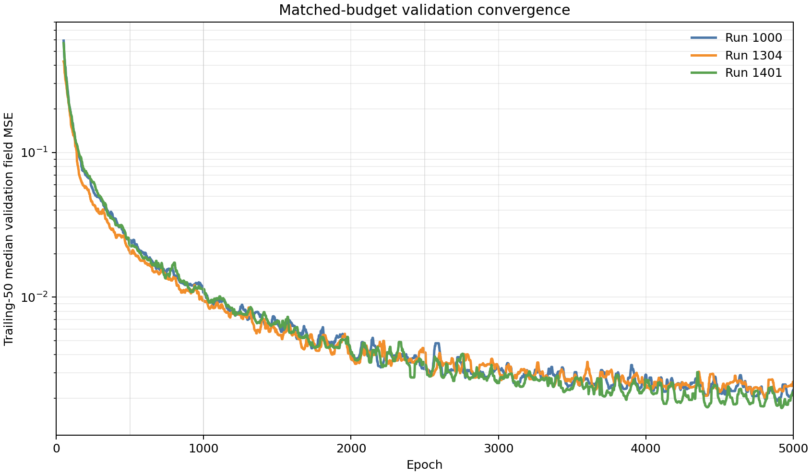

The rolling curves overlap through much of training, but Run 1401 separates favorably after roughly epoch 2500 and ends with the lowest trailing field and temperature MSE. This directly meets the preferred `<=1.10x` Run-1000 matched-5K target. Run 1401 is not waiting for a delayed accuracy phase that can only appear after 5K.

## 5. Complete-split accuracy

### 5.1 Aggregate normalized accuracy

| Frozen checkpoint | Pooled fluid MSE | Relative L2 | Median case MSE | Case p95 MSE |
|---|---:|---:|---:|---:|
| Run 1000 best, e9655 | **7.3099e-4** | **0.02810** | **3.8598e-4** | **2.5755e-3** |
| Run 1304 best, e4793 | 9.5214e-4 | 0.03207 | 7.9730e-4 | 2.5972e-3 |
| Run 1304 e5000/latest | 1.1757e-3 | 0.03564 | 1.0282e-3 | 3.0188e-3 |
| Run 1401 best, e4585 | 9.5379e-4 | 0.03210 | 7.0590e-4 | 2.7392e-3 |
| Run 1401 e5000/latest | 1.2950e-3 | 0.03740 | 1.0401e-3 | 3.7651e-3 |

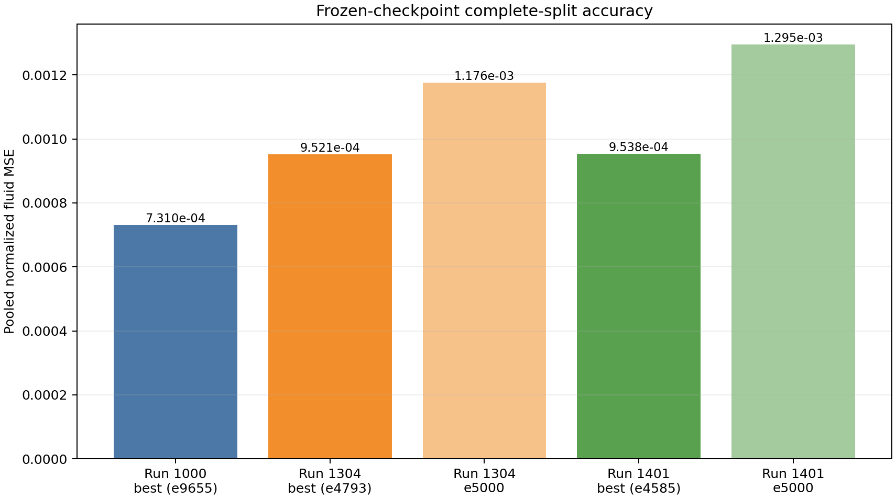

Run 1401 best is essentially tied with Run 1304 best in pooled MSE (1.0017x) while having an 11.5% lower median case error; its p95 is 5.5% higher. Against Run 1000 absolute best it is 1.3048x in pooled MSE. That absolute gap is real, but Run 1000's reference checkpoint had 4,655 additional epochs and a different Stage-A checkpoint. It cannot override the favorable matched-5K history comparison.

The epoch-5000 snapshots are worse than their run-owned best checkpoints for both Runs 1304 and 1401. This validates best-field selection and is not evidence that the Stage-7 bridge failed.

### 5.2 Per-channel normalized fluid MSE

| Checkpoint | u | v | p | omega | temperature |
|---|---:|---:|---:|---:|---:|
| Run 1000 best | **2.0187e-4** | **1.8109e-4** | 6.8354e-4 | **1.1763e-3** | **1.4122e-3** |
| Run 1304 best | **1.7976e-4** | 2.7226e-4 | **4.8519e-4** | 2.0275e-3 | 1.7960e-3 |
| Run 1304 e5000 | 3.2261e-4 | 3.9573e-4 | 5.4605e-4 | 2.6849e-3 | 1.9292e-3 |
| Run 1401 best | 3.2905e-4 | 2.6979e-4 | 7.9535e-4 | 1.6461e-3 | 1.7287e-3 |
| Run 1401 e5000 | 4.2040e-4 | 3.3217e-4 | 1.7059e-3 | 1.8562e-3 | 2.1606e-3 |

Relative to Run 1304 best, Run 1401 best trades weaker `u` and pressure for better vorticity and temperature. Relative to Run 1000 absolute best, its largest gaps are in `u`, `v`, and vorticity; no channel is catastrophically degraded.

### 5.3 Near-interface normalized MSE

The maintained evaluator defines `near_interface_fluid` as fluid points with nonnegative surface distance no greater than 0.25.

| Checkpoint | u | v | p | omega | temperature |
|---|---:|---:|---:|---:|---:|
| Run 1000 best | 2.0179e-4 | 7.6455e-4 | **1.0055e-3** | **1.2483e-2** | **2.6249e-3** |
| Run 1304 best | 4.3965e-4 | 1.1729e-3 | 1.2954e-3 | 2.2349e-2 | 2.6628e-3 |
| Run 1304 e5000 | 6.0482e-4 | 1.4918e-3 | 1.3235e-3 | 2.7819e-2 | 2.9889e-3 |
| Run 1401 best | 3.4374e-4 | 1.1573e-3 | 1.3768e-3 | 1.6273e-2 | 2.8412e-3 |
| Run 1401 e5000 | 3.9989e-4 | 1.4732e-3 | 2.7152e-3 | 1.5958e-2 | 3.0375e-3 |

Run 1401 best is materially better than Run 1304 best for near-interface `u` and vorticity, approximately equal for `v`, and moderately worse for pressure and temperature. This mixed result is consistent with decoder differences rather than a general Stage-7 failure.

## 6. Organizer and routing quality

Values are medians across all 90 cases, using the final organizer and selected representation. All models select all six fixed edges; these metrics measure learned role differentiation, not sparsity.

### 6.1 Module and environment organization

| Metric | Run 1000 best | Run 1304 best | Run 1401 best | Run 1401 e5000 | Preferred band |
|---|---:|---:|---:|---:|---:|
| Module edge-profile cosine | 0.942 | 0.959 | **0.928** | 0.933 | lower is more differentiated |
| Module effective rank | 1.217 | 1.071 | **1.287** | 1.270 | higher is more differentiated |
| Environment edge-profile cosine | **0.094** | 0.373 | 0.122 | 0.120 | <0.20 |
| Environment effective rank | **5.244** | 1.590 | 4.733 | 4.794 | >3.5 |
| Largest dominant environment occupancy | **0.292** | 0.844 | 0.318 | 0.323 | <0.50 |
| Environment neighbor L1 variation | 0.442 | 0.244 | **0.559** | 0.558 | descriptive |
| Normalized region separation | **0.304** | 0.128 | 0.261 | 0.261 | >0.20 |

Run 1401 substantially recovers Run-1000-like environment organization. It uses five to six meaningful environment profiles rather than Run 1304's one-to-two-dimensional organization. Its region separation is 86% of Run 1000's and more than twice Run 1304's. Module assignment remains soft for all models, but Run 1401 is slightly more differentiated than Run 1000 under both module metrics.

### 6.2 Query and pairwise mechanisms

| Metric | Run 1000 best | Run 1304 best | Run 1401 best | Run 1401 e5000 | Preferred band |
|---|---:|---:|---:|---:|---:|
| Query edge-profile cosine | 0.436 | 0.951 | **0.419** | 0.418 | <0.55 |
| Query effective rank | 3.702 | 1.175 | **3.717** | 3.716 | >3.0 |
| Query normalized entropy | 0.763 | 0.947 | 0.747 | 0.746 | descriptive |
| Query per-edge spatial std. | 0.155 | 0.030 | **0.160** | 0.160 | clear spatial variation |
| Largest dominant-query occupancy | **0.218** | 0.981 | 0.233 | 0.233 | lower is more distributed |
| Global-route deviation L1 | 0.769 | 0.153 | **0.796** | 0.799 | higher indicates spatial departure from global mean |
| Pairwise-map cosine | 0.462 | 0.914 | **0.437** | 0.442 | lower is more differentiated |
| Pairwise effective rank | 2.797 | 1.248 | **2.862** | 2.837 | higher is more differentiated |

Run 1401 does more than merely pass thresholds: its query and pairwise metrics are essentially Run-1000-quality and slightly stronger on several median measures. Run 1304's largest dominant-query occupancy of 0.981 and pairwise rank 1.25 quantitatively confirm the earlier visual diagnosis of an almost global rank-one route.

Organizer-pass consistency is also close to Run 1000. For Run 1401 best, median provisional-to-final environment/module assignment L1 changes are 0.00090/0.00368, compared with Run 1000's 0.00052/0.00270. These are small refinements rather than topology rewrites.

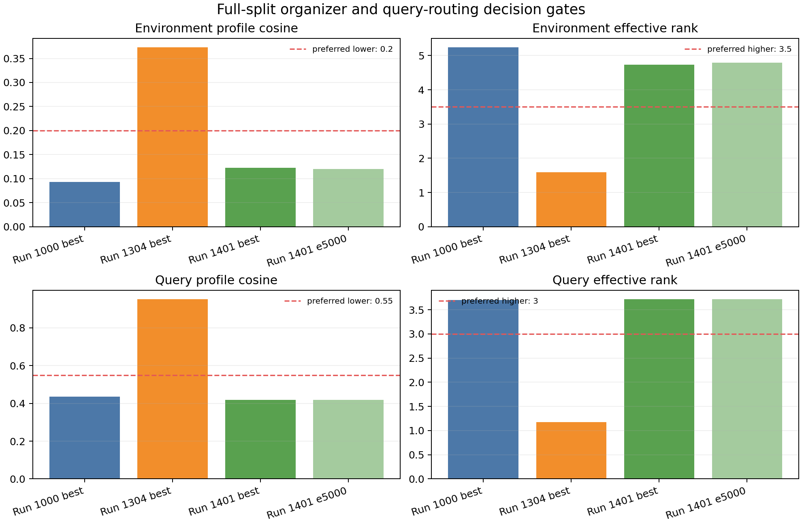

The plot shows the central Stage-7 result directly: Run 1401 is on the passing side of all four primary organizer/query gates and close to Run 1000, while Run 1304 fails all four.

## 7. Topology evolution

### 7.1 Run 1401

| Epoch | Environment rank | Environment cosine | Query rank | Query cosine |
|---:|---:|---:|---:|---:|
| 500 | 4.129 | 0.155 | 4.525 | 0.301 |
| 1000 | 4.052 | 0.141 | 4.255 | 0.332 |
| 2500 | 4.539 | 0.131 | 3.917 | 0.385 |
| 5000 | 4.794 | 0.120 | 3.716 | 0.418 |

Environment roles strengthen as validation accuracy improves. Query rank decreases and profile cosine rises, but the change is gradual and ends comfortably inside the Stage-7 targets. The epoch-4585 best and epoch-5000 checkpoints have nearly identical topology, so best-field selection does not select an anomalous structural state.

### 7.2 Run 1304 trajectory from maintained Stage-5 milestone artifacts

| Epoch | Environment rank | Environment cosine | Query rank | Query cosine |
|---:|---:|---:|---:|---:|
| 500 | 1.321 | 0.580 | 1.867 | 0.764 |
| 1000 | 1.365 | 0.503 | 1.568 | 0.832 |
| 2500 | 1.415 | 0.439 | 1.242 | 0.930 |
| 5000 | 1.649 | 0.373 | 1.162 | 0.956 |

Run 1304's environment organization improves slowly, but its query routing becomes progressively more rank one. Run 1401 therefore answers the key Stage-7 question: context fusion supplies an optimization demand that naturally preserves structured routes while accuracy improves.

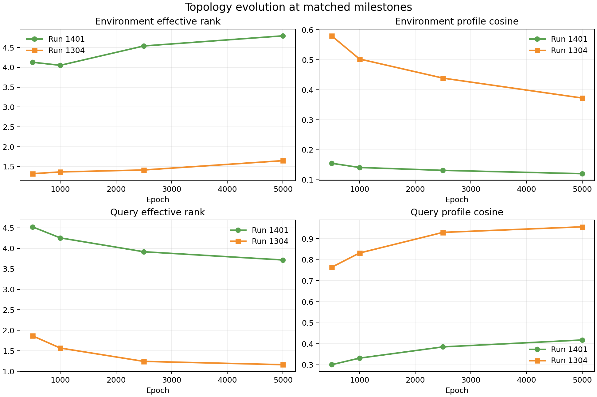

## 8. Representative physical-order cases

The evaluator rendered the same cases for Run 1000 best, Run 1304 best, Run 1401 best, and Run 1401 epoch 5000. Case 0653 is the previously used challenging representative; case 0273 is the ordinary first test case and is also used by the efficiency benchmark.

### Case 0653

| Run 1000 best | Run 1304 best | Run 1401 best |
|---|---|---|
| 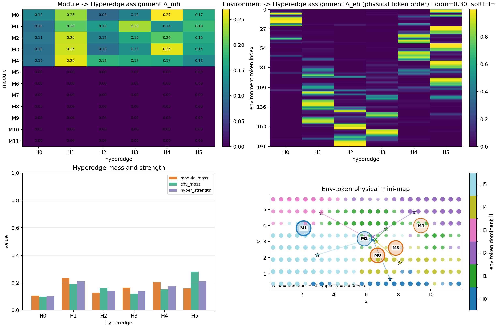 | 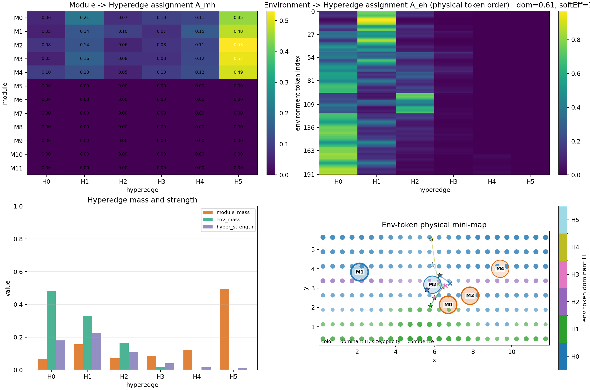 | 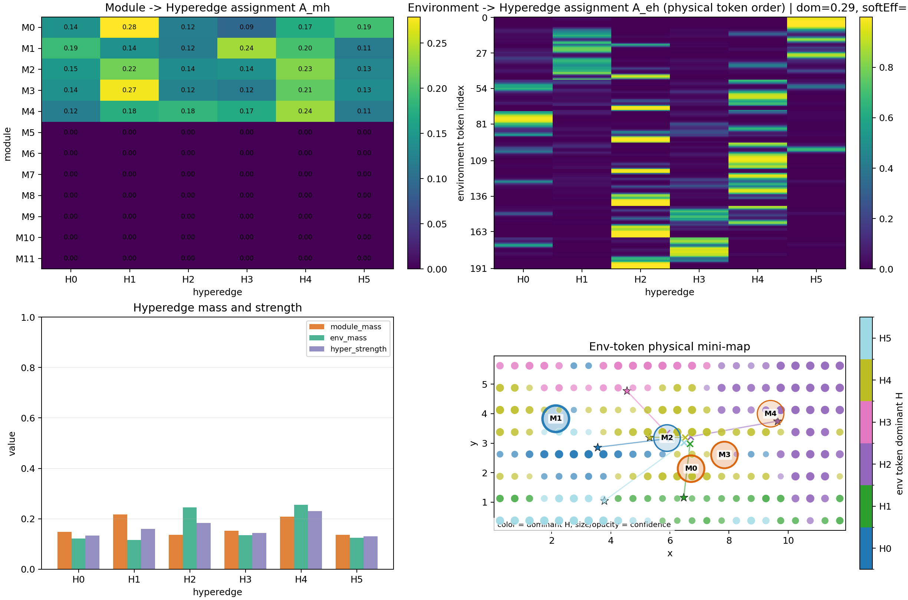 |

In physical token order, Run 1000 and Run 1401 both form multiple sharply localized environment bands with comparable edge masses. Run 1304 instead assigns most environment mass to a small subset of broad/global profiles. This agrees with the 90-case rank, cosine, occupancy, and region-separation metrics; the conclusion is not based on a sorted visualization artifact.

### Case 0273

| Run 1000 best | Run 1304 best | Run 1401 best |
|---|---|---|
| 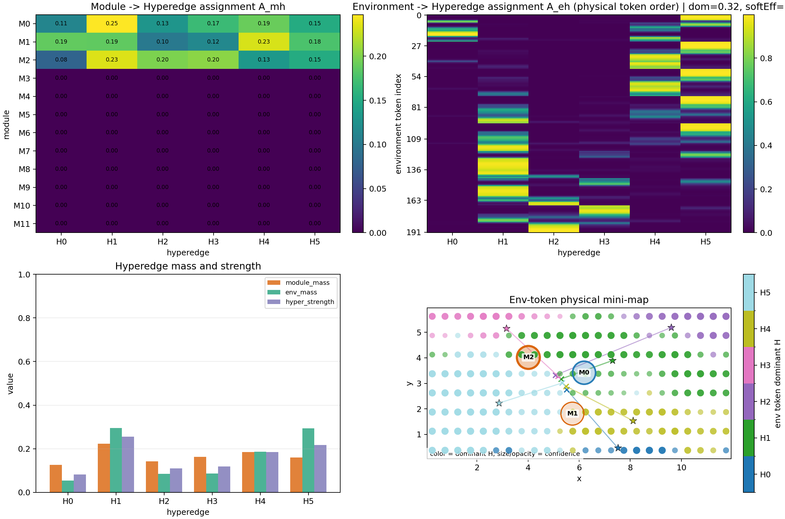 | 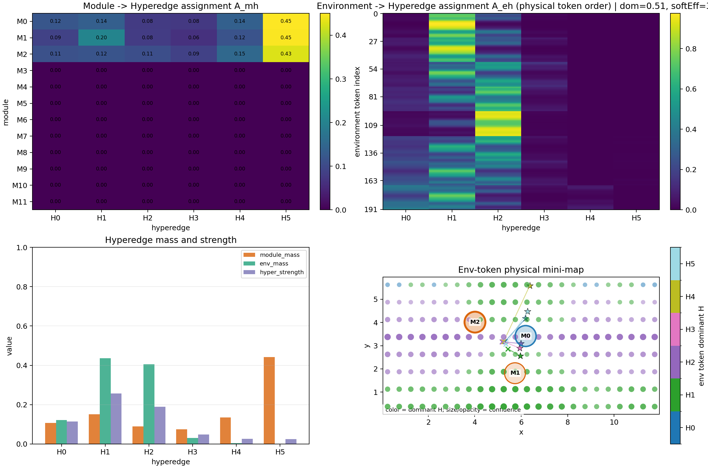 | 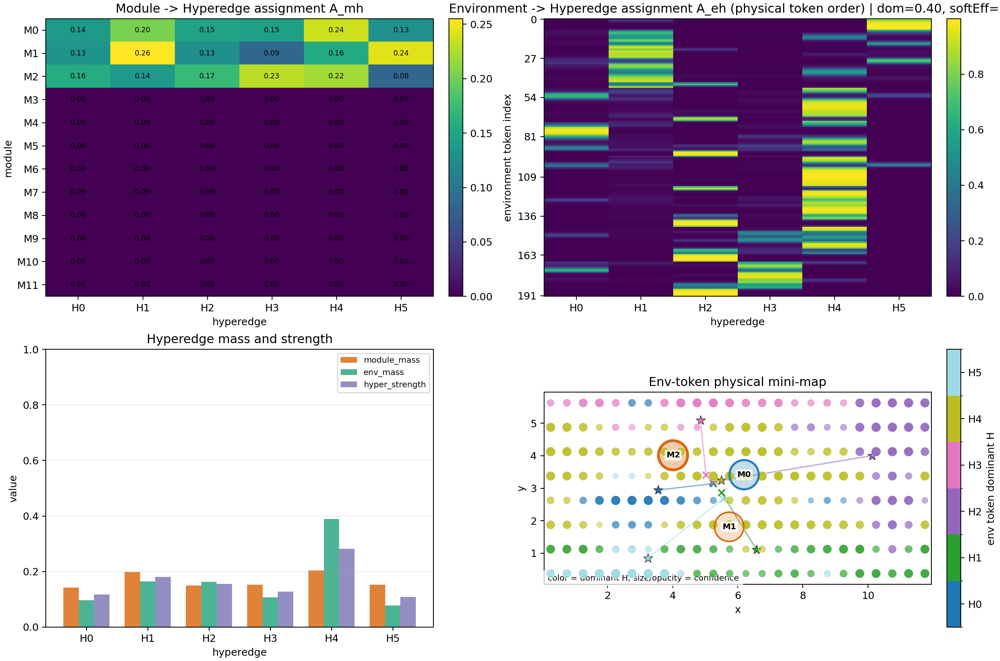 |

The ordinary case gives the same qualitative result: Run 1401 preserves several physical environment regions and meaningful query routes. Complete routing attention, dominant-edge, margin, pairwise, and topology-signature figures are stored beside each matrix.

## 9. Controlled GPU efficiency

All entries were measured in one process on GPU 0 with case 0273, 8,192 queries, 10 warmups, and 40 synchronized iterations.

| Checkpoint | Total params | Trainable params | File size | Prepared decoder median | Full-forward median | Incremental peak allocated |
|---|---:|---:|---:|---:|---:|---:|
| Run 1000 best | 3,508,649 | 2,473,510 | 30.16 MiB | **6.507 ms** | 26.605 ms | **362.41 MiB** |
| Run 1304 best | 3,913,154 | 2,878,015 | 35.83 MiB | 9.173 ms | 29.307 ms | 391.15 MiB |
| Run 1401 best | 3,508,649 | 2,473,510 | 30.18 MiB | 6.651 ms | **25.827 ms** | **362.41 MiB** |
| Run 1401 e5000 | 3,508,649 | 2,473,510 | 30.18 MiB | 6.580 ms | 25.835 ms | **362.41 MiB** |

Run 1401's full-forward ratio to Run 1000 is **0.971**, well below the 1.10 limit. Its prepared decoder is 2.2% slower, within normal benchmark-scale variation and outweighed by the full-forward result. Its parameter count and incremental peak memory are exactly the Run-1000 class and lower than Run 1304.

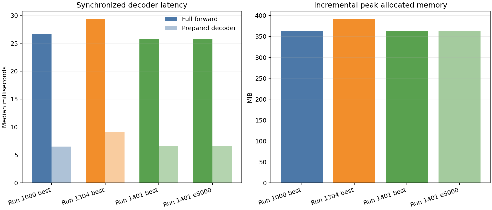

## 10. Robustness, caveats, and decision gates

### 10.1 Gate inventory

| Decision aid | Run 1401 best | Target | Result |
|---|---:|---:|---|
| Environment profile cosine | 0.122 | <0.20 | Pass |
| Environment effective rank | 4.733 | >3.5 | Pass |
| Largest environment occupancy | 0.318 | <0.50 | Pass |
| Normalized region separation | 0.261 | >0.20 | Pass |
| Query profile cosine | 0.419 | <0.55 | Pass |
| Query effective rank | 3.717 | >3.0 | Pass |
| Matched-5K history ratio to Run 1000 | 0.974 | <=1.10 | Pass |
| Full-forward ratio to Run 1000 | 0.971 | <=1.10 | Pass |
| Parameter count | equal | fixed/context class | Pass |

### 10.2 Limitations and interpretation

- Run 1000's complete-split checkpoint is an epoch-9655 absolute best, not a 5K snapshot. Its stronger 7.31e-4 frozen-checkpoint MSE remains the long-budget accuracy ceiling, not evidence that Run 1401 fails at 5K.
- Run 1000 used a different frozen Stage-A checkpoint. Because Runs 1304 and 1401 share the same Stage-A best checkpoint, their direct comparison is more tightly controlled.
- The manifests record dirty source states. Exact checkpoint/config hashes make this evaluation numerically auditable, but reconstructing the launch solely from a Git SHA would be insufficient.
- Casewise uncertainty is represented by median and p95 values, not only pooled MSE. Run 1401's p95 remains somewhat worse than Run 1304 best even though its median is better.
- The benchmark characterizes inference on one fixed case/query shape. It is the requested common-process architecture comparison, not a claim about complete training-loop throughput.
- Run 1304 milestone topology values are reused from the maintained full-split Stage-5 evaluator output. The Run 1401 trajectory and all primary checkpoint comparisons were regenerated for this evaluation.

Taken together, these caveats affect how much superiority can be claimed; they do not overturn the Stage-7 pass. The structural recovery is large, present on all 90 cases, visible in physical token order, stable across late checkpoints, and obtained without an efficiency penalty.

## 11. Reproducibility

### 11.1 Maintained evaluator commands

All commands were run from `HONF_Proj` in the `ModularDT` Conda environment. Paths below are abbreviated only for readability; the machine-readable provenance stores absolute paths.

```bash
conda run -n ModularDT python diagnostics/evaluate_stage5_accuracy.py \
  --checkpoint run1000_best=<Run1000>/best_by_field_mse_model.pt \
  --checkpoint run1304_best=<Run1304>/best_by_field_mse_model.pt \
  --checkpoint run1304_e5000=<Run1304>/epoch_5000_model.pt \
  --checkpoint run1401_best=<Run1401>/best_by_field_mse_model.pt \
  --checkpoint run1401_e5000=<Run1401>/epoch_5000_model.pt \
  --device cuda:0 --split test --query-batch-size 8192 --max-cases 90 \
  --output-dir diagnostics/stage7_5k_accuracy
```

```bash
conda run -n ModularDT python diagnostics/evaluate_topology_quality.py \
  --checkpoint run1000_best=<Run1000>/best_by_field_mse_model.pt \
  --checkpoint run1304_best=<Run1304>/best_by_field_mse_model.pt \
  --checkpoint run1304_e5000=<Run1304>/epoch_5000_model.pt \
  --checkpoint run1401_e500=<Run1401>/epoch_0500_model.pt \
  --checkpoint run1401_e1000=<Run1401>/epoch_1000_model.pt \
  --checkpoint run1401_e2500=<Run1401>/epoch_2500_model.pt \
  --checkpoint run1401_best=<Run1401>/best_by_field_mse_model.pt \
  --checkpoint run1401_e5000=<Run1401>/epoch_5000_model.pt \
  --device cuda:0 --split test --query-batch-size 8192 --max-cases 90 \
  --organizer-passes --output-dir diagnostics/stage7_5k_topology
```

```bash
conda run -n ModularDT python diagnostics/evaluate_topology_quality.py \
  --checkpoint run1000_best=<Run1000>/best_by_field_mse_model.pt \
  --checkpoint run1304_best=<Run1304>/best_by_field_mse_model.pt \
  --checkpoint run1401_best=<Run1401>/best_by_field_mse_model.pt \
  --checkpoint run1401_e5000=<Run1401>/epoch_5000_model.pt \
  --device cuda:0 --split test --query-batch-size 8192 \
  --case-id 0273 --case-id 0653 --render-case-id 0273 --render-case-id 0653 \
  --output-dir diagnostics/stage7_5k_representative_cases
```

```bash
conda run -n ModularDT python diagnostics/benchmark_stage5_checkpoints.py \
  --checkpoint run1000_best=<Run1000>/best_by_field_mse_model.pt \
  --checkpoint run1304_best=<Run1304>/best_by_field_mse_model.pt \
  --checkpoint run1401_best=<Run1401>/best_by_field_mse_model.pt \
  --checkpoint run1401_e5000=<Run1401>/epoch_5000_model.pt \
  --device cuda:0 --case-id 0273 --queries 8192 --warmup 10 --iterations 40 \
  --output diagnostics/stage7_5k_benchmark.json
```

```bash
conda run -n ModularDT python -m py_compile diagnostics/analyze_stage7_5k.py
conda run -n ModularDT python diagnostics/analyze_stage7_5k.py
```

### 11.2 Machine-readable and figure artifacts

- `diagnostics/stage7_5k_accuracy/accuracy_summary.json`
- `diagnostics/stage7_5k_accuracy/accuracy_per_case_channel_region.csv`
- `diagnostics/stage7_5k_topology/topology_quality_summary.json`
- `diagnostics/stage7_5k_topology/topology_quality_per_case.csv`
- `diagnostics/stage7_5k_topology/topology_quality_per_case_edge.csv`
- `diagnostics/stage7_5k_representative_cases/topology_quality_summary.json`
- `diagnostics/stage7_5k_representative_cases/figures/`
- `diagnostics/stage7_5k_benchmark.json`
- `diagnostics/stage7_5k_comparison/comparison_summary.json`
- `diagnostics/stage7_5k_comparison/matched_budget_convergence.csv`
- `diagnostics/stage7_5k_comparison/*.png`
- `diagnostics/analyze_stage7_5k.py`

## 12. Final decision

### A. ACCEPT RUN 1401 AT 5K

Run-1000-like environment/query organization is substantially recovered, matched-budget accuracy is competitive, and efficiency is at least as good as the classic fixed/context-fusion reference. Freeze/select Run 1401's best-by-field checkpoint at epoch 4585 and proceed to repository cleanup. Do not continue to 10K merely because Run 1000 historically did so.
