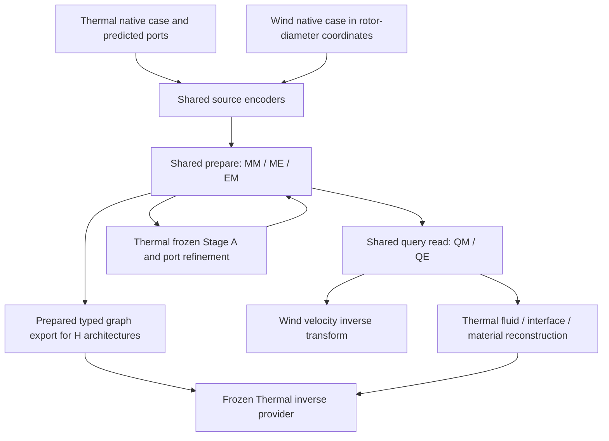

# Shared Thermal/Wind core and physical interfaces

ThermalChannel and WindFarm share the learned interaction implementation. Their
case adapters retain different physical coordinates, targets, normalization and
coupling. Compatibility checks establish that these interfaces execute correctly;
they do not establish physical equivalence or trained-weight transfer accuracy.

## Core families

Every row below uses `honf_forward_core.interface_fields.InterfaceFieldCore`.
The names of the context and backend objects matter: sharing a facade does not
make Dense and the three-term families the same network.

| Reference or campaign arm | Architecture identifier | Context and backend | Active core paths |
| --- | --- | --- | --- |
| Thermal Run1804 / fresh B-native; retained Wind Run2103 | `dense_pairwise_field` | `SharedInterfaceContext`; `AdaptiveCoverPairwiseField` with its historical Dense path and no attached policy | Fine MM/ME/EM/QM/QE, historical coarse bank and local-neighbor branch |
| B-fine | `three_term_full_access_honf` | `ThreeTermInterfaceContext`; `DensePairwiseField` | Background plus fine module/environment terms; full eligible access |
| H-tree | `adaptive_receiver_hypergraph_honf` | `ThreeTermInterfaceContext`; `TypedHypergraphField` | Five typed routes with learned receiver tree/frontier, source permissions and group controls |
| H-overlap | `overlap_control_hypergraph_honf` | Same three-term context/backend family | Learned overlapping source/receiver memberships and controls |
| H-local | `local_overlap_hypergraph_honf` | Same three-term context/backend family | Overlap far access plus protected physical near access and recorded admission rescue |

MM/ME/EM name module/environment preparation interactions; QM/QE name query
reads. Source measures, validity, permitted pairs and density/control values
remain separate. The three H architectures are registered for dimensions 2 and
3 in [capabilities.py](../../src/honf_forward_core/interface_fields/capabilities.py).
The historical Wind sparse-incidence 2-D construction exception stays restricted
to its historical architecture; these new profiles use direct dimension validation.

## Physical adapters and call sequence

| Interface | ThermalChannel | WindFarm |
| --- | --- | --- |
| Wrapper | `ChannelThermalHONFModel` | `WindFarmForwardModel` |
| Native input adaptation | `ChannelThermalBatchCollator`, `make_model_inputs`, `ChannelThermalEnvironmentBuilder`, wrapper coupling | `WindFarmNativeView`, `case_batch`/native collation, wrapper `_as_batch` |
| Coordinates / channels | 2-D channel coordinates; core scale [12, 6]; fluid [u,v,p,omega,T] | 3-D rotor-diameter coordinates; retained scale [50, 38, 6.25]; three standardized velocity channels |
| Source metadata | Module presence/features/IDs and environmental physical lengths; uniform cell-area weights use the retained core fallback | Turbine presence/features/IDs; adapter-supplied environmental volume measures in D³ and physical lengths in D |
| Physical length | Environmental sqrt(cell area), independent of normalized weights | Environmental cube-root(cell volume), independent of normalized weights |
| Case-specific physics | Predicted ports, frozen Stage-A local surrogate, interface/material reconstruction and repeated port refinement | Fitted velocity transform and physical velocity reconstruction |
| Normalization | Saved global and local target statistics, with native output transforms | Saved `VelocityNormalizer`: mean, safe standard deviation and reference velocity |
| Phase / freshness | Fresh prepared state at P0/P1/P2 as local module state changes; final prepared state supports query chunks | One native preparation, represented as P0 for campaign graph diagnostics; repeated query chunks reuse that state |
| Inverse interface | Differentiable caller-owned heat tensors; prepared decode, final organizer export and frozen public observation provider | `prepare_case`, standardized prediction and explicit physical velocity transform; no Wind inverse training in this campaign |

The loop occurs only in the Thermal wrapper. The retained coarse/local Dense
paths and the Thermal Stage-A local solver are different components: removing
the former in B-fine/H leaves the latter attached and frozen.
Thermal supplies no explicit `env_weights` in its native `BatchData`; the core
preserves the uniform domain-area/E measure. Wind supplies explicit cell-volume
weights. Neither interface infers physical length from normalized attention mass.

## Measured Thermal parameter allocation

The saved [native parameter inventory](../../diagnostics/generated/shared_core_campaign_20261002/parameter_inventory.json)
materializes one real train case 0001 with Q17. Counts are distinct named
parameters, not FLOPs, executor rows or active-gradient counts. All five arms
use H256, message128, four heads and relative/query Fourier frequency4, with
24×8 environmental tokens. Every arm retains 109 frozen Stage-A parameter
tensors containing 1,035,139 scalars.

| Trainable scalars by component | B-native | B-fine | H-tree | H-overlap | H-local |
| --- | ---: | ---: | ---: | ---: | ---: |
| Source encoders | 282,368 | 282,368 | 282,368 | 282,368 | 282,368 |
| Historical Dense coarse/local | 1,531,648 | 0 | 0 | 0 | 0 |
| Fine QM/QE and field head | 726,153 | 790,665 | 790,665 | 790,665 | 790,665 |
| Fine MM/ME/EM | 1,074,944 | 1,074,944 | 1,074,944 | 1,074,944 | 1,074,944 |
| Organizer | 0 | 0 | 324,315 | 30,507 | 30,507 |
| Interaction controls | 0 | 0 | 204 | 204 | 204 |
| Thermal coupling/fallback heads | 780,296 | 780,296 | 780,296 | 780,296 | 780,296 |
| Total trainable scalars | 4,395,409 | 2,928,273 | 3,252,792 | 2,958,984 | 2,958,984 |
| Allocated trainable tensors | 201 | 140 | 205 | 223 | 223 |
| Tensors with saved AdamW state | 181 | 120 | 185 | 203 | 203 |

Allocated capacity includes native task-unused fallback heads. A single parity
probe's defined gradients can be fewer than the union of parameters receiving
optimizer state over training. Tree's saved model state contains 316 tensors/
4,287,933 scalars, and Overlap/Local contain 334/3,994,148; these totals include
persistent buffers as well as frozen and trainable parameters.

## Retained and fresh compatibility evidence

The [retained native replay receipt](../../diagnostics/generated/shared_core_campaign_20261002/logs/retained_native_alignment_cpu1_ports/execution_receipt.json)
records two passed tests, no skips, and natural exit 0 on ModularDT CPU1 from
clean source `b5fd919`, during 2026-10-03 21:30:25.678–21:30:30.089 UTC.
Thermal loads Run1804 field-selected4738 on case0001/Q17; Wind loads Run2103
field-selected 2475 on `gen_0000_wd270`/Q4. All six Thermal field/interface/
material/final-port/raw-port/used-port outputs and Wind's field replay have
maximum absolute difference 0. Prepared chunk errors are 9.536743e-7 for Thermal
and 4.023314e-7 for Wind, below unchanged rtol/atol 2e-5/2e-5. Nine original
assertions execute; the repaired test requires all three actual port keys rather
than silently skipping a nonexistent `used_port_tokens` key.

Both genuine disposable AdamW steps change the field head and have finite loss.
Thermal's 109 frozen parameters and all 22 named buffers remain bitwise unchanged;
Wind has zero frozen parameters (a vacuous parameter check) and all five named
buffers remain bitwise unchanged. Historical checkpoint SHA/stat, current
source bytes and historical wrapper/core blobs stay unchanged. Neither file's
original mode 0664 is changed or described as an immutable snapshot. The initial
[narrow replay](../../diagnostics/generated/shared_core_campaign_20261002/logs/retained_native_alignment_cpu1/execution_receipt.json)
is retained separately; it executed six comparisons before the port-test repair.

The retained Thermal model has 201 trainable tensors/4,395,409 scalars plus the
109 frozen/1,035,139 Stage-A scalars. Wind has 147 trainable tensors/3,628,551
scalars, with H256/d3/field3. Its explicit3-D coordinate scale controls encoding;
the legacy unused domain_length_x/y defaults 12/4 are not its 3-D scale.
All 22 Thermal and five Wind named buffers were checked, including nonpersistent
normalization/Fourier buffers; this is distinct from checkpoint state-dict counts.

These steps use temporary weights only. The Wind squared-output update checks
native differentiability/execution, not supervised accuracy or scientific
training. No Wind checkpoint is resumed or rewritten.

The completed [fresh H256 Wind receipt](../../diagnostics/generated/shared_core_campaign_20261002/logs/native_wind_3d_h256_alignment_e21b538.json)
covers all three H architectures on real 3-D case `gen_0000_wd270` with
M11/E512/Q4. It reports bitwise agreement for 98 physical first gradients,
nonzero organizer gradients, one optimizer step per architecture, unchanged
physical buffers and 13,477 executed fine rows/five calls per hard or soft P0
forward. This checks source/wrapper execution with fresh weights, not transfer
of a trained Thermal predictor to Wind. Wind scientific training stays paused.

Historical replay replaces the declared wrapper/core methods while leaving
unchanged fine dependencies shared. Its tolerance and measured errors must be
reported with that scope; it is not an isolated historical dependency checkout.
