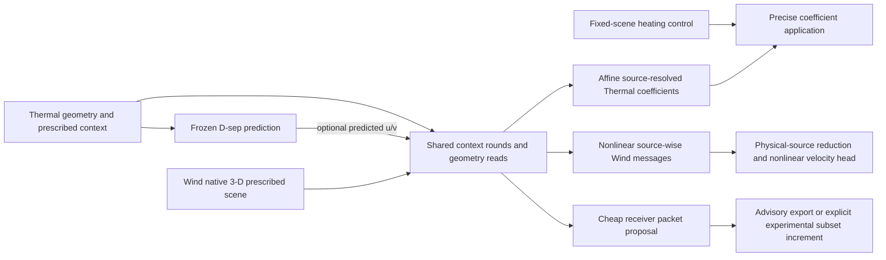

# Shared source-resolved interaction core and receiver packets

ThermalChannel and the opt-in WindFarm family execute the same `InteractionContextCore` context rounds, geometry encoding and receiver/source feature builders. `SourceResponseOperator` inherits that implementation without nesting or renaming checkpoint tensors; `NonlinearFieldReadout` inherits it with a separate source-message MLP and nonlinear field head. Each dataset owns its inputs, dependency law, coordinates, measures, units, output transform and weights. This shares implementation and contracts; it does not share trained weights or establish transfer accuracy.

The compatibility path keeps the original two source/source and source/environment context rounds and direct/group near/far arithmetic. Environment is global upstream ancestry through prepared context, rather than an independently actuated source. New code contains no fixed Thermal domain, grid, rotor diameter, environmental donor count, heat-column convention or output-channel count. Legacy case defaults remain in the legacy case adapters.

## Dataset-owned dependencies

| Capability | ThermalChannel | New WindFarm family |
| --- | --- | --- |
| Configuration | Module geometry, material coefficients, prescribed boundary/flow context | Turbine geometry, wind direction, native support, environmental geometry/measures and reference inflow |
| Separately applicable control | Scalar native heating rate at fixed geometry | None; changed configuration rebuilds context |
| Output law | Qualified affine temperature coefficients with zero benchmark boundary offset | Source-wise nonlinear messages before reduction, then nonlinear three-velocity head |
| Optional edge | Frozen predicted D-sep physical u/v at existing environment donors to thermal context | Wind-owned 3-D source/environment context to velocity field |
| Environment read | Two prepared context rounds; no target-flow input | Two prepared context rounds and global representation; no dense query/environment fine read |
| Physical output | Native fluid/surface/material temperatures and qualified derived proxies; frozen flow composed separately | Native velocity transform in m/s |
| Derivative | Exact heating kernel and precise fixed-scene increment; live geometry graph | Local AD JVP at the declared scene; no exact affine finite increment |

`InteractionScene` accepts only named prescribed tensors. `DependencySpec` separates configuration inputs from separately applicable controls and declares output roles, units and prepared dependency nodes. It rejects cyclic coupled dependencies and a separately applicable affine control that reaches prepared context. Changing configuration, receiver ownership or a bound input tensor invalidates prepared requests. No iterative coupled solver is supplied by this interface.

The new Wind bridge is selected by `windfarm.model.build_windfarm_model` with `forward_architecture="source_resolved_nonlinear"` and a TRAIN-fitted `VelocityNormalizer`. Historical `WindFarmForwardModel` families retain their dispatch and checkpoint paths. The new head is a fresh dataset-specific model, not the old Dense wrapper relabeled.

## Preparation and fixed-scene consumers

`prepare(scene)` builds shared context with explicit scene ownership. Prepared state records parameter identities and versions as well as input tensor versions, so an optimizer update, parameter replacement or checkpoint reload requires a fresh preparation. Thermal composition also binds the TRAIN field normalization values used by context and physical output transforms; both endpoint reads and record increments reject changed normalization or frozen-flow weights. The affine `predict(prepared, receivers, controls)` prepares source-resolved coefficients and applies physical scalar controls. Existing `prepare_receivers`, `apply_forcing`, `apply_increment`, `dense_kernel` and native Thermal extraction remain available; FP64 accumulation provides precise prepared increments without changing learned FP32 coefficients or physical accuracy. The nonlinear `predict` has no separate scalar forcing argument, and `linearize` returns a labeled local JVP for centers, source descriptors, context or receivers. Wind's adapter-aware linearization also differentiates its receiver support features and physical output transform.

The optional Thermal branch adds a zero-initialized three-to-hidden linear projection after the environment encoder. It consumes predicted u/v standardized by the existing TRAIN scales plus a valid-fluid bit. Solid environment donors retain their original geometry and quadrature weights; only their optional flow feature is zero/invalid. Public composed inference recomputes the frozen flow in the live geometry graph and reuses its preparation for both context and output reads. The fixed-input fitting cache binds the D-sep checkpoint, development manifest and geometry/context signatures; it rejects differentiable geometry and changed inputs. Stored TRAIN flow is used only by the retained supervision-side discrete residual.

## Receiver packet semantics and execution

Packets bind immutable physical source and receiver IDs, receiver coordinates, scene/context ownership, output/control types, units, a declared action box and full environment ancestry. Whole-catalogue and subset reads validate coordinates against their ordered physical IDs; moved coordinates cannot reuse an exact baseline under an unchanged binding. `propose_receiver_packets` exports calibrated learned proposals from cheap frozen prepared states and receiver geometry. It does not execute the full thermal kernel. Exact sensitivity/certification calls use explicitly supplied full coefficients and must be priced separately. Raw sensitivity and action-radius-weighted importance remain separate exports.

Overlapping packets admit the union of sources at each receiver, with each physical pair evaluated once. `full` remains the default; `packet_advisory` exports a proposal and executes full access; partial `packet_experimental` gathers admitted receiver/source pairs before the fine MLP while protecting all original near reads. Upstream context remains full. Uncalibrated, stale, unsupported or out-of-domain proposals fall back to full access. A changed scene requires a newly bound exact baseline before a fixed-scene increment can be reused.

The initial affine packet consumer supports direct physical-source operators and geometry-defined receivers with `query_width=0`. Grouped representations and feature-dependent receiver kernels require additional baseline/cache bindings and are rejected by this consumer. Native prepared geometry/context fingerprints and an explicit alias-to-native-source-ID map are checked against the actual prepared tensors; a packet's tensor mask is checked against its immutable donor metadata before execution.

The subset prototype approximates increments added to an exact baseline. It has no absolute-field omission capability and no physical-error certificate. Learned margins are TRAIN-calibrated empirical coverage estimates; only a paid full-kernel verifier supplies the exact learned-model omission bound. Neither packet count, retained donor count nor response rank is a latent-bank capacity or a claim of physical causality.

## Maintained entry points and evidence boundaries

| Entry point | Purpose |
| --- | --- |
| `tools/thermal_source_response_flow_context_fit.py` | Seal and continue the single matched fixed25_v1 development pair from development e2500 parents, with original AdamW moments and one new zero projection |
| `tools/receiver_packet_study.py` | Build TRAIN-only teacher tables, fit one capped pair scorer, verify exact/equal-K controls and execute fixed-baseline model-only consumers |
| `tools/wind_shared_interaction_pilot.py` | Freeze native Wind layout subsets, fit TRAIN-only transforms and run the bounded update-based nonlinear pilot |
| `tests/test_shared_interaction_core.py` | Shared execution, capability rejection, ownership, chunk equality and local derivatives |
| `tests/test_receiver_packets.py` | Union/fallback, action bounds, TRAIN-only calibration, pre-MLP execution and stale baseline rejection |

Generated configurations, memberships, checkpoints, numerical arrays, plots and one-time campaign drivers belong in ignored local paths. The study report records exact checkpoint/manifest/source hashes, measured GPU process allocation, field/response errors and executor rows separately. Development metrics remain repeatedly exposed validation evidence; no new formal fit, physical solve or inverse design campaign is implied by these APIs.
