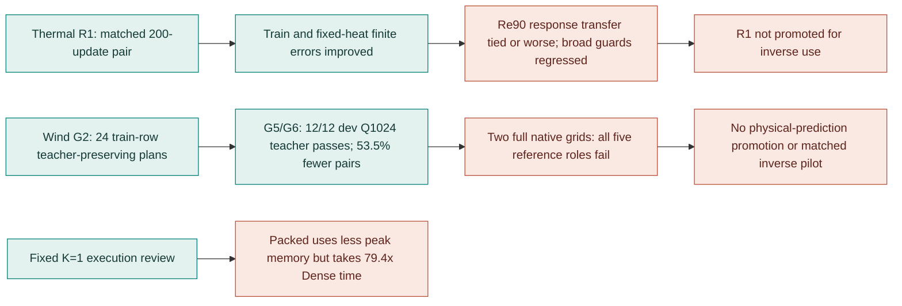
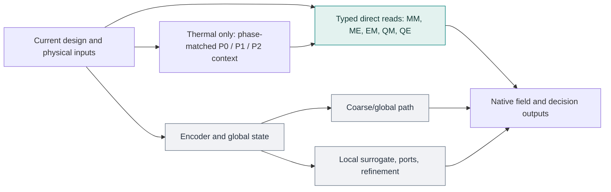

# HONF Receiver-Local Interface and Decision Recovery Study

As of 2026-09-27. The matched R1 response pair, 24-row directed G2 search, two bounded G5 fits and their frozen-split G6 reviews are complete. A conditional two-layout native-grid check and the packed-control execution review are recorded below.

## 1. Question and result

The study asks whether a typed receiver-local interface can organize meaningful parts of the intact native forward models, preserve the finite responses needed for inverse decisions, and execute more economically. The reviewed baseline is commit 6394e546dd2bc7a39548b8aa52dead239c3efd16 on agent/honf-core-next. The preserved incumbents are ThermalChannel Run 1804, epoch 4738, and WindFarm Run 2103, epoch 2475.

The evidence supports a narrower result than a learned physical interface:

- **Native contract:** explicit P0 initial-port, P1 refinement, and P2 final-field contexts and phase-matched fixed-plan reads are implemented. The typed all-access inverse replay matched Dense on its four baseline decision quantities. These are native integration results; a complete learned Thermal interface has not passed its empirical review.
- **Receiver-local organization:** the corrected G2 search yielded 24 teacher-preserving partial plans across eight training layouts and three directions each. Only QE support changed; its exact valid-pair reduction ranged from 5.588% to 9.446%. A fresh 650-update input-only fit passed the Q1024 teacher gate on all 12 frozen development rows while using 53.5% fewer exact native pairs than all access. Its final QE packet count was K=2 on every development row. Both conditional complete native-grid layouts failed the separate five-role reference guard. Useful adaptive K and physical prediction sufficiency are not established.
- **Finite response and inverse use:** both R1 arms completed 200 updates. The response arm improved train and fixed-heat finite errors, but Re90 finite-response transfer was tied or worse, and several broad training field/pressure guards regressed. R1 stopped at u200 and was not promoted for inverse use. The completed stored-reference replay showed a small pressure transport change with no change to selected rows or per-module peak increments. Baseline correction reduces value bias but does not fix finite-slope errors.
- **Execution:** the final interleaved matrix found the saved K=1, E=480 partial at Q=40,960 took 15,040 ms packed, 4,736 ms rectangular subset and 4,637 ms dense-masked, versus 189 ms policy-free Dense. Packed reduced measured peak allocation but increased complete-call time. A 6.25% QE source omission cannot pay for that overhead. Learned-plan formation and inverse backward timing remain unmeasured.
- **Physical scope:** local reference responses exist for a few families, but they are family-specific and sometimes grid-sensitive. No CFD or Navier–Stokes reference was used, and no new reference solve was launched in this round.

Three evidence scopes are kept distinct throughout. “Reference” means stored outputs from the local NumPy analytic-wake flow and numerically advanced shared-grid thermal solver; it is not CFD. “Teacher” means prediction from an intact learned checkpoint, especially Run 2103 for WindFarm support labels; teacher preservation does not establish physical fidelity. “Synthetic/control” means a deliberately specified software or generator control, such as deterministic parity or the analytic-wake fixed-geometry heat null; it tests that control only.

### Visual reading guide

The gate sequence matters more than any single successful score. Green boxes below are measured progress within the named scope; red boxes are failed or withheld promotion gates. A teacher result and a local physical-reference result are separate observations.

The numerical maps and charts below are **local evidence figures** rendered from saved artifacts into ignored `HONF_Proj/diagnostics/generated/receiver_local_study_visuals_20260927/`. They are intentionally absent from Git upload under the repository artifact rule; their relative image links display in this workspace. The Mermaid diagrams, captions, and numeric tables remain in the committed report. Figure scripts and source hashes are retained beside the local images. None of these plots launched a model, optimizer, GPU evaluation, or new physical solve.

## 2. Native nonlinear response pair

R1 starts from the intact Run 1804 epoch-4738 checkpoint. Measured scope is 547,081 trainable parameters and 4,883,467 frozen parameters: every layer of core.common.field_head, local_coupling.port_head, and local_coupling.port_refinement_head is trainable; encoders, fine transport kernels, coarse and local context builders, the local surrogate, and all other tensors and buffers are frozen.

R1 uses eight train stencil families plus one historical training case per family with equal family weighting. R_value uses value objectives. R_response adds finite field responses, finite per-module peak changes, continuous pressure value and response terms, and the generator-supported fixed-geometry heat controls for pressure/velocity nulls and retained thermal response. Feasibility BCE and mixed-response loss are excluded; the mixed-response numerical floor remains unknown.

Both arms completed exactly 200 attempted and 200 completed updates from equal u0 states (310 matching state keys and 22 unchanged buffers). The saved value checkpoint SHA256 is b4d7496596b0033b6fe1bc8b087074d5289ec8a3140832c6d445051f1bb5274a; the saved response checkpoint SHA256 is 234f69910925eb360d06e414cb2712b4900f74f0120756e2547121f618b42863. R_response uses frozen train-only weights: value 1.0, finite 0.05104565, finite_peak 12.06451, pressure_value 0.5887329, pressure_response 0.1542578, fixed_heat_null 0.1166573, and fixed_heat_thermal 0.1013166. It had ten value-only warm-up updates, ramped added terms at updates 11–50 and kept them active through u200. Feasibility BCE and mixed-response loss were excluded because the training boundary has only six infeasible states and the mixed-response numerical floor remains unknown.

The paired training call completed the updates but its subsequent fixed-heat evaluation failed when it combined an atlas baseline with raw controls whose physical quadrature weights differed. Its failed manifest and complete checkpoints were preserved. A separate checkpoint-only review safely loaded the exact u200 states, rehydrated the original raw reference baseline without a solve, and paired it with the four raw fixed-heat controls under the strict stencil contract. The raw baseline matched atlas values, pressure and peaks; only atlas solid coordinates differed at float32 serialization scale (maximum 2.84e-8). The review made zero optimizer calls, created zero optimizers, and made zero reference-solver calls. It evaluated the incumbent and both arms on all eight training families, four Re90 development neighborhoods, four fixed-heat controls and 30 broad historical training cases, with 170 model forwards per model plus two setup forwards. Its measured monotonic wall was 318.407 seconds on physical GPU 2.

The next table averages each metric within a stencil and then equally across the listed stencils. Temperature values are in dataset temperature units and pressure values in dataset pressure units. Finite solid and interface columns are weighted RMSE; per-ID peak and pressure increment columns are mean absolute error. The four Re90 neighborhoods are development/calibration, not fresh-layout validation.

| Panel / model | Finite solid T RMSE | Finite interface T_surface RMSE | Per-ID peak-change MAE | Pressure-increment MAE | Baseline hard-peak MAE | Baseline pressure MAE |
| --- | ---: | ---: | ---: | ---: | ---: | ---: |
| Train 8 / incumbent | 0.196057 | 0.209353 | 0.132976 | 0.0002240 | 0.491408 | 0.0004634 |
| Train 8 / R_value | 0.195476 | 0.208443 | 0.132863 | 0.0002215 | 0.493447 | 0.0008237 |
| Train 8 / R_response | 0.182245 | 0.197825 | 0.120757 | 0.0000615 | 0.527596 | 0.0004747 |
| Re90 4 / incumbent | 0.186987 | 0.202075 | 0.141558 | 0.0001640 | 0.507506 | 0.0009813 |
| Re90 4 / R_value | 0.187826 | 0.201982 | 0.139627 | 0.0001587 | 0.483381 | 0.0009102 |
| Re90 4 / R_response | 0.187672 | 0.201954 | 0.140341 | 0.0001639 | 0.447912 | 0.0013948 |
| Fixed heat 4 / incumbent | 0.120327 | 0.184033 | 0.108386 | 0.0006882 | 0.062777 | 0.0009155 |
| Fixed heat 4 / R_value | 0.108261 | 0.172926 | 0.090313 | 0.0006254 | 0.051533 | 0.0003745 |
| Fixed heat 4 / R_response | 0.082855 | 0.141606 | 0.060449 | 0.0000667 | 0.004818 | 0.0000134 |

**Figure 1 — Where the response fit helped, and where it did not.** Each cell is `R_response / R_value` for an error metric, computed first within each stored family and then averaged equally across families; below 1 means lower error. The blue fixed-heat row is generator-specific. Re90 pressure increments and baseline pressure turn red, while finite-field gains nearly vanish. The plot does not replace the 30-case broad guard, whose pressure MAE also worsened. Source: the R1 u200 checkpoint-only review identified in Section 8; the ignored `summary/render_summary.py` and `summary/plot_manifest.json` record extraction and SHA256.

Against R_value, R_response improved train per-ID peak-change MAE by 9.1% and pressure-increment MAE by 72.2%; finite solid T RMSE improved 6.8%. On Re90, the same response errors were essentially tied or worse: peak-change MAE rose 0.5%, pressure-increment MAE rose 3.3%, and baseline pressure MAE rose 53.2%. Re90 finite solid T RMSE improved only 0.08%, well below the preregistered approximate 5% development target. Family behavior was uneven: Re90/0310 finite solid T RMSE increased from 0.182208 to 0.186253; Re90/0325 peak-change MAE increased from 0.277906 to 0.281546 and pressure-increment MAE from 0.000135 to 0.000205. Re90/0340 improved peak-change MAE from 0.094189 to 0.089628, but its physical peak-sign screen is mesh-sensitive. The fixed-heat gain is generator-specific and cannot stand in for moving-layout transfer.

The 30-case broad historical training guard also worsened on several roles against R_value:

| Model | Solid T RMSE | Interface T_surface RMSE | Near-interface fluid T RMSE | Fluid u RMSE | True hard-peak MAE | Pressure MAE |
| --- | ---: | ---: | ---: | ---: | ---: | ---: |
| Incumbent | 0.264329 | 0.374608 | 0.222026 | 0.005219 | 0.393236 | 0.001192 |
| R_value | 0.245596 | 0.276180 | 0.243770 | 0.005455 | 0.380340 | 0.001384 |
| R_response | 0.255735 | 0.300576 | 0.256869 | 0.005932 | 0.361522 | 0.002244 |

R_response reduced broad true hard-peak MAE by 4.9% relative to R_value, but broad pressure MAE rose 62.1%, interface T_surface RMSE 8.8%, near-interface fluid T RMSE 5.4% and u RMSE 8.8%. This is train fitting with development non-transfer and a broad guard regression, so R1 stopped at u200. No u500, u1000 or 5,000-epoch continuation was launched. Its finite response is not promoted for inverse use. Zero false-feasible classifications in these panels are descriptive: the Re90 panel contains no reference-infeasible states and the train panel has only six, so these counts do not establish reliable boundary classification.

The preserved failed paired-run directory is diagnostics/generated/native_recovery_20260927/native_nonlinear_interface_R1_matched_u200_20260927/. The successful zero-update review is diagnostics/generated/native_recovery_20260927/native_nonlinear_interface_R1_u200_checkpoint_review_raw_fixedheat_retry02_20260927/checkpoint_review_result.json. Its four Re90 paths were explicitly supplied because the failed source manifest omitted them. The current R0 diagnostic digest was recorded but cannot be claimed as byte-attested by the source run. Two brief review startup failures (one mistyped path, one JSON serialization error) remain in separate ignored directories and contributed no optimizer or reference calls.

A separate R0 nonlinear-scope train-only probe completed 80/80 updates, recovered read-only without rerunning optimization. Its equal-family response objective changed from 0.01463898 to 0.00955071 (−34.8%), and its value objective changed from 0.00374474 to 0.00326533 (−12.8%). This is training-objective progress only; there are no development, broad, fixed-heat, or inverse-selection results for that probe. The completed R1 comparison supplies the subsequent development and guard evidence.

The R0 recovery record is diagnostics/generated/native_recovery_20260927/native_nonlinear_interface_R0_missing_nonlinear_u80_20260927/fit/read_only_u80_recovery.json.

The earlier terminal-head-only pair is another distinct experiment. It changed 2,313 parameters while 5,428,235 remained frozen, used 100 updates per arm, and applied finite-response terms only during updates 21–100. Decision and pressure objectives were not active. Its results do not answer whether the current broader nonlinear scope can learn inverse-relevant responses.

R0 parity diagnosis is a software-repeatability result, not a physical error floor. The first invocation stopped after 2.819 seconds at update zero with no optimizer attempts because copied M10 role outputs differed by up to about 6.3e-5. Default-kernel M10 repeats varied by up to 7.34e-5. With CUBLAS_WORKSPACE_CONFIG=:4096:8 and deterministic Torch algorithms, source and copy outputs were bitwise equal, including the checked M10 finite trials. Stored M10 finite peak changes of -1.526e-5 and +4.005e-5 remain sign-unresolved at default-kernel resolution. A deterministic R0 retry passed parity but stopped before calibration on a missing import, also with zero optimizer attempts and zero reference calls; that wiring was repaired for the separate recovered u80 probe.

## 3. Directed support search

Four corrected G2 shards used cumulative proposals that removed one physical-module source or a small environmental source block from one receiver child and one typed mechanism; previously accepted omissions remained. Each proposal was run through the complete native model and checked on protected receiver roles. The flow-frame split used global 4-by-4 quantile cells as an index, not as a physical-causality threshold. The eight frozen training layouts each contributed three stored directions (270°, 285°, 300°). The four development layouts supplied no search labels.

| Train layout / M | Rows | Selected QE pair counts by direction | Total valid native-pair reduction | Largest protected-role teacher distortion |
| --- | --- | --- | ---: | ---: |
| 4 / 14 | 12–14 | 492,992 / 493,376 / 476,992 | 5.588–8.550% | 0.03595 |
| 24 / 6 | 72–74 | 491,904 / 475,904 / 476,768 | 6.035–9.017% | 0.02228 |
| 70 / 27 | 210–212 | 476,832 / 490,176 / 490,304 | 5.856–8.178% | 0.04273 |
| 88 / 7 | 264–266 | 473,408 / 476,064 / 475,840 | 8.952–9.446% | 0.03811 |
| 115 / 18 | 345–347 | 487,552 / 490,368 / 490,176 | 6.041–6.543% | 0.02606 |
| 119 / 8 | 357–359 | 493,248 / 477,792 / 476,224 | 5.740–8.889% | 0.02501 |
| 174 / 29 | 522–524 | 489,984 / 489,600 / 488,640 | 5.869–6.099% | 0.02380 |
| 177 / 30 | 531–533 | 488,512 / 487,680 / 488,320 | 6.099–6.241% | 0.03523 |

All 24 selected plans passed disjoint Q1024 teacher verification without an identity fallback. Their canonical nonredundant packet counts were MM/ME/EM/QM/QE = 1/1/1/1/2. Only QE had an actual native pair reduction; MM/ME/EM/QM retained their full native pair counts even when a tree contained two identical-support children. QE source unions were 512 except four rows with 480. Variation in support across stored directions is an input-conditioned direct-transport observation, while constant K gives no adaptive-K result. A globally retained source can still be absent from one receiver child. Neither an omitted direct message nor these teacher checks establish physical-source irrelevance. The exact environmental tensor-column supports remain in the ignored selected-plan files; the adapter does not assign independent immutable IDs to quadrature atoms.

For these two QE packets, each child carried 416–512 environmental source slots, the child supports overlapped on 416–448 slots, and their union covered 480–512. Thus a source could enter both child packets, only one child, or neither; this is a receiver-local omission rather than universal source deletion. The exact QE incidence was 473,408–493,376 native query/source pairs over Q1024, or 462.3–481.8 selected sources per query receiver on average. Query receivers can participate in both child actions where tree access overlaps; the saved work summaries do not establish a separate empirical packet-degree histogram for individual queries. The other four mechanisms retained full valid source degree.

The search-probe frontier is an aggregate over the 24 observed training rows, not held-out coverage or a physical-error bound:

| Maximum protected-role teacher distortion | Qualifying candidate observations | Best observed total valid native pairs |
| ---: | ---: | ---: |
| 0.01 | 275 | 507,358 |
| 0.05 | 1,367 | 487,786 |
| 0.10 | 1,592 | 487,786 |

At the frozen 0.10 teacher gate, the executed local candidates passed as follows: MM 120/216, ME 425/425, EM 350/350, QM 92/324 and QE 605/605. A further 358 generated proposals were skipped before a full call because they did not lower exact valid native-pair work. The 328 evaluated teacher failures were 96 MM and 232 QM candidates; the recorded failing protected roles were volume (198), downstream envelope (53), near turbine (53), hub slab (17) and background (7). These counts describe search probes, including overlapping beam states; they do not mean all passing omissions can be combined. The selected coherent endpoint in each row remained QE-only.

The corrected shards executed 1,920 candidate forwards, 2,092 complete native calls/decodes, 2,044 prepare-case calls and 24 disjoint selected-plan verifications. Their internal elapsed-time sum was 1,838.758 seconds. Another 576 candidate forwards in retry02 are charged to the new-round budget but excluded from labels, support and fidelity claims because that retry used an incorrect native ME cost axis. Thus all G2 attempts used 2,496 of the allowed 4,096 candidate forwards. The report field `total_panel_reference_forward_calls` counts dense *teacher model* forwards, not physical reference-solver calls. No new physical solve or optimizer update occurred in G2.

The label scope is deliberately narrow: every selected omission is QE-only, and no train pair shares the same M across distinct layouts. The frozen development panel includes layout 103 at M=6 and layout 81 at M=29 for same-M held-out comparison with train layouts 24 and 174, respectively. Its outcomes belong to the later fitted-organizer review, not to G2 search. Structural teacher preservation at Q1024 is established for these 24 training rows; full native-grid physical-reference sufficiency and deployment speed remain separate questions.

The ignored merged report is Case_WindFarm/diagnostics/generated/native_cover_organizer/run2103_e2475/typed_incremental_search_merged_corrected01/typed_search_report.json (SHA256 44a43a99f4c74459ad6e1ad8a47640f076e09ca0248a5d8e0fab4aeab02d612a). Its 24 selected-plan paths, serialized documents, canonical plan hashes, and recomputed supervision agree with the four corrected shard reports. The frozen split SHA256 is 110fb5ce0a03322a942823ddb64a4a72076b84bb5364a4c07eb554cc18f7d266.

## 4. Fitted organizer

The prior G0 six-label fit is useful as a bounded teacher-learning diagnosis, not as the result of G5. It made 100 optimizer attempts and 100 completed updates on physical GPU 2; recorded training loss fell from 0.649745 to 0.045835. Its initial streamed native-grid review hit the 1,800-second wall cap and exited 124 without durable per-row results. A separate checkpoint-only Q1024 disjoint review used six training rows, 30 complete hard-plan/control calls, 24 panel decodes, and 12 prepares, with zero additional optimizer updates.

All six G0 learned hard plans were K=1 and failed the protected 0.10 normalized teacher-distortion gate. Complete calls took 267–275 ms, compared with 9.5–10.4 ms for policy-free Dense. The verified oracle K=1, E=480 partial passed the teacher gate on all six checked rows but remained slower than Dense. These observations cover two training layouts and three stored directions; they establish neither physical reference sufficiency nor unseen-layout generalization.

The disjoint Q1024 evaluation record is Case_WindFarm/diagnostics/generated/native_cover_organizer/run2103_e2475/six_label_hard_evaluation_u100_gpu2/disjoint_q1024/disjoint_evaluation_report.json.

The corrected G2 shards and merge supplied all 24 training directions to a new formal G5 input-only organizer. Its plan scorer used current-case pre-interaction encoded module, environment and global tokens and the receiver-anchor tree. It did not read dense prepared module states, teacher outputs or targets when forming a plan. Duplicate environmental quadrature atoms with identical coordinates and adapter features were aggregated into a stable support-measure feature; the native executor kept their original individual weights. The fixed-tree split-weight tests cover support and native action invariance. They do not certify an unchanged learned tree when duplication changes the receiver-anchor catalogue.

Focused formation tests also check that query order, query chunking and target poisoning do not change the learned hard plan on a fixed case, and that source permutation preserves equivariant support. These are code-contract checks on constructed cases; the native G6 rows below provide the empirical fit and held-out teacher evidence.

The first bounded G5 gate completed 150 supervised and one hard-forward native predictive optimizer updates, all 151 attempted and completed, in 80.85 seconds outer wall on physical GPU 2. The 24-row all-access initialization was native-identical to policy-free Dense (maximum field delta zero). Supervised loss on its sampled training rows fell from 0.460261 to 0.172134. The actual hard native predictive step used teacher, native-reference, coherent-label and logical-work terms; its total loss was 0.058224 on one training row. A pre-update all-access predictive gradient probe and the later hard-forward step both had nonzero protected-output gradients. At the hard step, the sum of the five typed pair-head gradient norms was 0.005748; each mechanism's protected-output gradient was nonzero, and the logical-work gradient was nonzero. This demonstrates reachability through the native hard path with a straight-through topology gradient. One predictive update is insufficient to establish a predictive-learning trend. Exactly 171 complete native forwards and zero physical solves were counted.

The postfit training Q1024 replay produced the following deterministic hard-plan summary. Counts are true nonredundant packets after equivalent actions are merged. Environment supports are stored tensor-column identities; they are not independently catalogued physical atoms.

| Mechanism | Hard nonredundant K across 24 train directions | Source union | Native pair result |
| --- | --- | --- | --- |
| MM, ME, EM, QM | 1 on all 24 for each mechanism | Full valid native source set | No pair reduction. |
| QE | K=2 on 18; K=3 on 3; K=4 on 1; K=5 on 2 | 338–504 of 512 environment slots | 242,122–311,756 Q1024 query/source pairs. |

The learned QE packets therefore vary with input, but they omit far more than the G2 teacher-verified QE labels (whose unions were 480 or 512). Mean observed QE positive-label accuracy was 0.46. Nineteen of 24 train-direction hard plans passed the 0.10 protected-role teacher gate. The five failures were rows 211, 212, 522, 523 and 532, with largest normalized distortion 0.116150. Train query probes reuse the G2 disjoint verification set and are in-sample organizer diagnostics; they are not a held-out generalization result. The frozen development comparison follows. No physical or speed promotion follows from this first fit alone.

The ignored fit report is Case_WindFarm/diagnostics/generated/native_cover_organizer/run2103_e2475/typed_g5_fit_150sup_1pred_review02/typed_organizer_report.json (SHA256 44eb0afeb6e77dc2fee55e287dbe78e0bce0e314eb7b5298966aeea8313bc757). Its saved organizer state SHA256 is 420ad73c62328c1e72ba627705b3bf3f39f0c959f3a0c6e56dcbda3c354c5831. The separate G0 fit and G2 oracle-search labels are controls, not claims that this learned model passes development or deployment gates.

The checkpoint-only G6 review of that state completed all 24 train and 12 frozen development directions, with 337 complete native forwards, 192 of them variant calls, in 205.39 seconds outer wall on physical GPU 2. It made zero optimizer or physical-solver calls. The development layouts supplied no G2 labels to plan formation, fit or control construction. All access matched the intact teacher and passed 36/36 protected-role gates. The two G2-derived oracle/collapsed-root controls are train-only and unavailable on development rows. The following development values are equal means across 12 direction rows; the reference RMSE is a stratified Q1024 exact native-cell gather diagnostic, not a native-grid sufficiency estimate. Pair sums include all five mechanisms at Q1024.

| Development variant | Teacher gate | Exact native pair sum | Mean volume reference RMSE (m/s) | Mean downstream reference RMSE (m/s) | Mean near-turbine reference RMSE (m/s) |
| --- | ---: | ---: | ---: | ---: | ---: |
| All access | 12/12 | 6,682,152 | 0.012010 | 0.021585 | 0.041975 |
| Learned input-only | 8/12 | 3,841,509 | 0.028987 | 0.039620 | 0.044392 |
| Artificial slot-indexed population-fixed support | 9/12 | 6,564,408 | 0.051024 | 0.100830 | 0.111116 |
| Ungrouped geometry-ranked direct pairs at the learned pair count | 0/12 | 3,841,509 | 0.309679 | 0.330739 | 0.156250 |

The learned plan used 42.5% fewer exact native pairs than all access on these probes, but missed the teacher gate on four development rows and increased reference volume and downstream errors. The matched-pair-count direct control failed every direction, so pair count alone did not preserve this teacher. Its source choice is geometry ranked and its dense-mask executor differs from the grouped implementation; it is a structural control, not a fair complete-latency comparison. The fixed support is an intentionally slot-indexed, non-equivariant control built from train G2 source unions; its near-full pair work and variable-M cropping are disclosed in the ignored report. At equal M=6, train layout 24 and held-out layout 103 each passed 3/3; at equal M=29, train layout 174 and held-out layout 81 each passed only 1/3. Same-layout direction changes in K/support are visible, but this split has no repeated M among different training layouts, so it cannot separately estimate within-train same-M layout adaptation. G6 uses a single synchronized call per row/variant and excludes organizer plan formation from that saved-plan timing; no deployment speed claim follows.

The completed ignored G6 report is Case_WindFarm/diagnostics/generated/native_cover_organizer/run2103_e2475/typed_g6_q1024_review04/typed_checkpoint_disjoint_evaluation_report.json (SHA256 72865d20d533cbf2733fcf60c0c315d918269a1a02e85cd609e7996af371d454). Its row-level `role_metrics` contain the sampled reference errors. The report's redundant `native_reference_rmse_mps_by_protected_role` fields are empty because the current serializer conditioned them on a physical-sufficiency flag that is correctly unresolved at Q1024; the table above was calculated from `role_metrics`. The first two G6 startup attempts are preserved separately: review02 stopped before native forwards due a split-hash field mismatch (4.61 seconds), and review03 stopped after 145 panel forwards due a variable-M fixed-control array shape (17.47 seconds). Neither used optimizer or physical solves. Both implementation errors were corrected before review04.

Because the first formal fit had a nonzero native hard-forward gradient, nontrivial support and a manageable but failed development gate, one already-bounded predictive review was executed as a **fresh**, separately charged run. It repeated 150 supervised updates and added 500 native hard-forward predictive updates; all 650 optimizer calls completed in 736.77 seconds outer wall on physical GPU 2, with 670 complete native forwards and zero physical solves. It was not an optimizer/RNG resume. The common saved u150 supervised-prefix states from the two fits matched bitwise across 40 model keys (maximum tensor difference zero), while the fresh u151 state was not separately saved and cannot be claimed bitwise identical.

The longer fit's train-only Q1024 postfit gate improved to 22/24, but every QE hard plan now had K=2, source union only 196–275 of 512, and mean positive-label accuracy 0.456. MM/ME/EM/QM remained full and K=1. On the same complete set of 24 training rows in predictive cycles 151–174 and 607–630, mean total loss decreased from 0.054287 to 0.039596 and logical-work fraction from 0.604466 to 0.471834, while protected teacher loss rose from 0.002869 to 0.004141 and sampled native-reference loss from 0.011771 to 0.014168. These are search-probe training objectives, whereas the 22/24 teacher gate uses disjoint verification probes; neither can replace development and full-grid evidence. The longer fit report SHA256 is a904db4a51d7bbd902a768071c8863618252b467f0cd60baa023272263983928, and its saved organizer state SHA256 is 06b5da4194077669caa048da2af3eb2917ce96fe1d3230f7fe745a3b31393f43. A selected-source fingerprint after process import is retained locally; it is not a complete source-tree identity.

The checkpoint-only G6 review of the longer state completed all 24 training and 12 clean development directions: 337 complete native forwards, including 192 variant calls, in 204.01 seconds outer wall, with zero optimizer and physical-solver calls. Its learned deterministic hard plans passed the protected 0.10 normalized teacher gate on 22/24 training and **12/12 development** rows. The two training failures were rows 266 and 531, both in the near-turbine role. All 12 development QE plans had nonredundant K=2. The same-M M=6 training layout 24 and held-out layout 103 each passed 3/3 directions; M=29 training layout 174 and held-out layout 81 also each passed 3/3. At M=29, the train QE source unions were 240/249/244 and held-out unions 268/270/269 out of 512; the corresponding M=6 unions were 214/210/203 and 188/193/188. This is input-conditioned support variation across layouts and directions under constant K; it is not an estimate of within-training same-M adaptation, because the training split has no repeated M. The development split provided no G2 search labels or targets to fitting or plan formation.

| Development variant at Q1024 after 650 updates | Teacher gate | Exact native pair sum | Mean volume reference RMSE (m/s) | Mean downstream reference RMSE (m/s) | Mean near-turbine reference RMSE (m/s) |
| --- | ---: | ---: | ---: | ---: | ---: |
| All access | 12/12 | 6,682,152 | 0.012010 | 0.021585 | 0.041975 |
| Learned input-only | 12/12 | 3,107,888 | 0.025108 | 0.034718 | 0.047760 |
| Artificial slot-indexed population-fixed support | 9/12 | 6,564,408 | 0.051024 | 0.100830 | 0.111116 |
| Ungrouped geometry-ranked direct pairs at matched exact work | 0/12 | 3,107,888 | 0.385039 | 0.391996 | 0.202736 |

The learned plan removed 53.5% of the five-mechanism native pairs on the development probes relative to all access. Its mean reference volume RMSE was 2.09 times the incumbent and its downstream RMSE was 1.61 times the incumbent; near-turbine RMSE was 1.14 times. These are equal means of rowwise stratified exact-cell Q1024 errors. A teacher-gate pass therefore did **not** satisfy the separate native-reference guard or show full-grid prediction quality. The direct-pair control matched logical pairs exactly but used geometry-ranked independent pairs and a different dense-mask path; the fixed support used train-derived source slots and nearly full work. Neither is a physically validated population baseline. Single saved-plan call medians of 441.5 ms learned and 427.5 ms all-access are descriptive only, omit plan formation, and cannot establish deployment speed.

The fresh longer-state G6 report is Case_WindFarm/diagnostics/generated/native_cover_organizer/run2103_e2475/typed_g6_q1024_650_review01/typed_checkpoint_disjoint_evaluation_report.json (SHA256 4015a48ab445e2b13bb706bc2abe68d80eb89e379e40ec9a329323ce49496173). It records `development_labels_used=false` and `reference_sufficient=unknown`. Across the 12 held-out rows, the two QE root-child supports had 174–238 and 177–270 environment slots; their intersections were 174–238 and unions 188–270, giving support Jaccard 0.859–0.981. The large overlap makes the two packets distinct but not two independently isolated physical factors. The stored integer IDs are positions on each case's environment tensor axis, not canonical physical-atom IDs shared across layouts. The first short fit exhibited variable QE K from 2 to 5 on train directions, but the stronger teacher-preserving longer state settled to constant K=2; deterministic adaptive K is not demonstrated by the final learned interface. The measured result is input-conditioned receiver source support that preserves this teacher gate under a partial direct-transport cover; physical and computational limits remain separate.

The predeclared conditional complete native-grid review selected first-direction row 72 on training layout 24 and row 309 on the held-out same-M=6 development layout 103, because both corresponding Q1024 learned plans passed the frozen teacher gate. It loaded no development G2 labels, made zero optimizer or new reference-solver calls, and completed 1,201 native forwards/decodes, including 1,192 grid-chunk decodes, in 755.64 seconds outer wall on physical GPU 2. The train grid had 2,001,920 cells and 490 decodes; the held-out grid had 2,873,728 cells and 702 decodes at native chunk size 8,192. The following values are complete-grid equal-layout vector RMSE in m/s against the stored local analytic-wake reference. The comparative research guard allows at most 10% additional error relative to intact all-access Run 2103 for **each** protected role, plus 1e-5 m/s numerical parity allowance.

| Layout / role | All-access RMSE (m/s) | Learned RMSE (m/s) | Learned / all access |
| --- | ---: | ---: | ---: |
| Train 24 / background | 0.004396 | 0.012985 | 2.95 |
| Train 24 / downstream | 0.014579 | 0.023303 | 1.60 |
| Train 24 / hub slab | 0.010778 | 0.014772 | 1.37 |
| Train 24 / near turbine | 0.023550 | 0.028914 | 1.23 |
| Train 24 / volume | 0.006647 | 0.014289 | 2.15 |
| Held-out 103 / background | 0.005951 | 0.013392 | 2.25 |
| Held-out 103 / downstream | 0.014808 | 0.025686 | 1.73 |
| Held-out 103 / hub slab | 0.011250 | 0.017374 | 1.54 |
| Held-out 103 / near turbine | 0.027455 | 0.033121 | 1.21 |
| Held-out 103 / volume | 0.007516 | 0.014890 | 1.98 |

**Figure 2 — The teacher-preserving partial plan misses the physical-reference guard.** Bars are learned/all-access complete-grid vector RMSE ratios, with the dashed line at the approximate 1.10 relative-error boundary; the exact role guard also adds 1e-5 m/s. All ten bars fail. The 12/12 sampled teacher pass and 53.5% exact-pair reduction refer to Q1024 development probes, whereas these bars use two complete native grids against the stored local analytic-wake reference. No CFD or new physical solve is represented. Source: the G6 conditional full-grid review identified in Section 8; extraction and source SHA256 are in the ignored summary figure manifest.

The G6 review retained per-role complete-grid metrics, not per-cell reference and candidate field arrays. A spatial WindFarm reference-minus-learned residual map cannot be reconstructed from those aggregates; Figure 2 shows the measured role errors rather than an invented wake image.

Every listed role fails the guard on both layouts. The stored analytic-wake streamwise-velocity residual relative L2 rose from 0.03565 to 0.05723 on training layout 24 and from 0.03910 to 0.06806 on held-out layout 103. These are complete native-cell comparisons with the local generator, not CFD and not finite design-response evidence. The development row was predeclared by same-M layout and first direction, not selected by its reference errors. This failure blocks physical-prediction promotion and the conditional matched physical inverse pilot. The ignored full-grid report is Case_WindFarm/diagnostics/generated/native_cover_organizer/run2103_e2475/typed_g6_fullgrid_dev103_train24_650_review01/typed_checkpoint_full_grid_evaluation_report.json (SHA256 a231ada717bfad90297063b69e294c93947b95918db20b7f4cecac728c5b2373).

## 5. Physical interpretation

### Reference responses and grid limits

The local physical-reference generator is a NumPy analytic-wake flow coupled to a numerically advanced shared-grid thermal solver. The following observations concern that generator and its stored outputs, not CFD.

The prior train-exposed M3/0001 four-corner panel resolved a mixed temperature response at two moved material receivers at both grid scales. Interface T_surface mixed RMS was 0.018565 on the coarse grid and 0.016300 on the fine grid, against a 0.003220 cross-grid discrepancy. Solid-temperature mixed RMS was 0.015874 and 0.013578, against a 0.002692 discrepancy. Temperature values are in dataset units, not kelvin. The hottest spectator retained the global maximum and its mixed response was unresolved. This supports a receiver-local response question for this family; it does not label learned edges or show improvement in the peak objective.

**Figure 3 — What the local physical response looks like.** The first image shows the stored M3/0001 coarse-grid reference temperature, the `+0.15 x` move of module 0 and `+0.15 y` move of module 1, their separate field changes, and the anchored mixed field `I_ij = T_11 − T_10 − T_01 + T_00` on the 7,919-cell common-fluid mask. The second image compares mixed RMS at the moved receivers with the unchanged hottest spectator, whose response is below the pooled float32 output-quantization indicator and remains unresolved. The spatial maps use the 128×64 grid; the 256×128 check above is an aggregate material-response comparison, not a second spatial map. These are saved outputs of the local analytic-wake-plus-thermal reference generator, not CFD or learned-edge evidence. Source: the ignored `physical_response_atlas_20260926/families/train_0001_responses.npz` (SHA256 `c34bc219daff2a1ebb02174b8c5e1498c96286460582e445286cceaff5499432`); the ignored `field/manifest.json` records state paths, data extraction, and image hashes.

The distinct M3/0304 pilot failed its cross-grid mixed-signal and peak-stability gates. M7/0340 showed finite-move peak-sign reversals after grid doubling despite a similar anchored mixed peak. These are family-specific resolution limits, not a pooled tolerance. The train-0318 joint inverse move is a negative control: the nominated pressure-improving and peak-improving coordinates work together, while anchored mixed pressure is approximately zero and mixed peak is about -0.000710 dataset temperature units. Its group was stencil-nominated, not learned. Useful decision coordination therefore does not by itself establish a non-additive physical interaction.

The analytic-wake fixed-geometry heat control has exact pressure, velocity, and vorticity nulls with nonzero thermal response. That is a generator-supported control for this input change; it is not a universal multiphysics law. It is kept separate from both Run 2103 teacher fidelity and the completed R1 learned-response metrics.

### What the typed cover controls

The five direct routes are module-to-module (MM), environment-to-module (ME), module-to-environment (EM), query-to-module (QM), and query-to-environment (QE). A missing typed key compiles to recorded full access. Thermal execution supplies separate P0, P1, or P2 context at each native prepare/read; a fixed-plan read with a mismatched phase is rejected.

The cover is a partial transport organization. Module positions and heat also enter the encoder and port/local-surrogate paths. core.common.prepare_coarse and core.common.read_coarse retain coarse/global access outside the cover, as do active local-surrogate and downstream port, refinement, and field heads. Multihop paths can carry source effects after a direct edge is removed. Thus an omitted message is evidence about that direct transport route, not complete independence of that source from the receiver or objective.

**Figure 4 — Scope of a direct-transport omission.** A typed mask changes the named direct read while current inputs still enter the other native paths. P0/P1/P2 phase matching applies to Thermal execution. This is why a teacher-preserving missing QE message cannot be read as a complete physical dependency or causal hyperedge.

WindFarm's fixed-plan replay now rejects a changed receiver-tree topology, anchor geometry/measure, module count, or environment source coordinate order before binding a saved plan to a query batch. The current search, disjoint probe and full-grid reviews use the same case catalogue; this guard prevents accidental cross-layout reuse. Thermal inverse trial replay uses the separate core fixed-topology contract: combinatorial source IDs stay frozen inside an anchor trust region while encoded numerical states, receiver coordinates and physical quantities are recomputed live at each trial. This does not turn the graph into a complete physical dependency map.

In the stored inverse replay, the hand-declared P2 mask removed 32 of 192 environmental quadrature atoms from one child of the QE read; the opposite-child omission was the fixed-structure control. Both are model interventions. The mask changed pressure increments slightly but left every per-module peak increment unchanged, so it does not establish physical hyperedge causality or a useful inverse grouping.

## 6. Execution

The measured matrix used intact WindFarm Run 2103 epoch 2475 and its saved disjoint-verified K=1, E=480 partial on the M14/layout-4 training geometry. It preserved checkpoint-native receiver chunks of 512. Q=1,024 and Q=40,960 were timed separately with diagnostics off; Q=40,960 used 80 receiver chunks. Each main condition had one warm-up and five interleaved synchronized complete-call repetitions.

| Q | Policy-free Dense median (ms) | Typed full-access median (ms) | Partial dense-masked median (ms) | Partial rectangular-subset median (ms) | QE rows: Dense / masked / subset | Peak allocation MB: Dense / masked / subset |
| ---: | ---: | ---: | ---: | ---: | --- | --- |
| 1,024 | 13.16 | 169.06 | 372.74 | 433.91 | 524,288 / 524,288 / 491,520 | 336.4 / 345.5 / 322.5 |
| 40,960 | 193.47 | 1,934.35 | 4,912.56 | 4,810.12 | 20,971,520 / 20,971,520 / 19,660,800 | 389.4 / 397.3 / 376.4 |

The 68 planned calls all completed in 101.053 seconds on physical GPU 2, with no optimizer or reference calls. At Q=40,960, rectangular subset improved by only 2.1% over dense-masked partial execution and remained about 24.9 times slower than Dense. At Q=1,024 the subset path was slower than dense-masked. Dense-masked kept the full rectangular row count; at Q=40,960 it masked or padded 1,310,720 rows. The subset path removed that padding but still ran much slower than Dense. The 20.9 MB memory decrease at Q=40,960 is a separate result from latency. The ignored run summary is diagnostics/x1_x4_native_cover_benchmark/run_20260927T055821Z/summary.json.

The 32-of-512 environment-source omission is 6.25% of QE pairs. It is a logical-work reduction, not a speed estimate. The first 68-call matrix did not include packed execution. A fresh, bounded packed-control review then used the same saved six-plan K=1/M-all/E=480 cohort, identical row-12 inputs and Q1024/Q40960 query sets across five variants, native receiver chunks of 512, one warm-up per variant and five interleaved synchronized repeats. It completed all 80 planned complete calls on physical GPU 2 in 176.89 seconds internal wall (180.17 seconds outer). Q40960 here is an evenly spaced native-cell timing query set, not the learned full-grid validation above.

| Q | Policy-free Dense median (ms) | Typed full median (ms) | Partial dense-masked median (ms) | Partial rectangular-subset median (ms) | Partial packed median (ms) |
| ---: | ---: | ---: | ---: | ---: | ---: |
| 1,024 | 9.33 | 116.69 | 243.30 | 250.98 | 495.07 |
| 40,960 | 189.49 | 1,721.81 | 4,637.02 | 4,735.68 | 15,040.32 |

**Figure 5 — Logical sparsity, memory, and time are different measurements.** Lower left is better. At Q40,960, packed execution lowered median peak allocation to 311 MB while its complete-call median rose to 15.04 seconds, versus 0.189 seconds for policy-free Dense. Points are synchronized five-repeat medians for the *saved K=1, E=480 control*, not deployment measurements of the learned K=2 organizer; plan formation and backward cost were not timed. Source: the packed-control benchmark summary and its linked calls JSONL; both hashes are listed in Section 8, and exact extraction is in the ignored summary figure script and manifest.

At Q40960, packed was 79.4 times slower than policy-free Dense and 3.18 times slower than rectangular subset, even though both partial methods executed 19,660,800 QE rows versus 20,971,520 for dense-masked or Dense. At Q1024, the respective QE row counts were 491,520 and 524,288. Dense-masked actually evaluated the full rectangle and masked its permissions; subset and packed omitted those rows in the measured execution counter. The Q40960 median peak allocation was 384.7 MB Dense, 405.3 MB partial dense-masked, 385.0 MB partial subset and 311.0 MB partial packed; at Q1024 it was 335.8, 346.1, 322.2 and 112.2 MB respectively. Memory reduction is separate from the adverse time result. The partial executors' first-repetition prediction checksums agreed within approximately 2.2e-4 at Q40960; separate contract tests check field parity for identical masks.

At Q1024, one cold same-geometry call took 9.22 ms Dense, 146.90 ms explicit full, 266.08 ms masked and 279.59 ms subset. One fresh-geometry row-72 call took 9.72, 145.52, 270.35 and 299.25 ms in that order. With diagnostics on, the two-repeat medians were 9.54, 457.03, 484.47 and 521.30 ms. Packed was timed only in the two main matrices; diagnostics-on Q40960, fresh-geometry Q40960, a small inverse objective/backward call, and learned-organizer scoring were not run under this 80-call cap. The measured benchmark replays fixed plans and excludes the learned K=2 organizer's formation and complete-call cost. Neither benchmark measured deployed learned-plan speed. GPU-before/after snapshots and interleaving limit but do not prove absence of contention during every repetition. The ignored final benchmark summary is diagnostics/x1_x4_native_cover_benchmark/run_20260927_packed_control_final/summary.json (SHA256 e6a19c66a8a0ff6a594045b37c46c028f3477c92a4aca035aaba5266571ec15c).

## 7. Inverse

The completed deterministic stored-reference replay at diagnostics/generated/native_recovery_20260927/stored_inverse_replay_results.json used Run 1804 epoch 4738, four previously opened final-review anchors, and only their original first-step u00 trials. It completed in 727.040 seconds on physical GPU 2 with zero new reference attempts. There were nine recorded rows per family and 8/5/9/9 unique trial designs at M=10/3/5/7. The historical policy-generated candidate pools differ; this union supports retrospective finite-pool selection and regret, not a new matched policy trial or learned-grouping result.

The four baseline decision quantities matched between typed all-access and intact Dense. Each trial recomputed live continuous states with a frozen combinatorial plan. Trial-anchor recapture matched the decision quantities for one checked trial per family. The partial plan was hand-declared, not produced by R1 or G5.

| Family | Dense raw / corrected true-peak MAE (dataset temperature units) | Dense raw / corrected pressure MAE (stored output scale) | Selected actual peak change (dataset temperature units) | Fully observed pool regret (dataset temperature units) |
| --- | ---: | ---: | ---: | ---: |
| M3 | 0.7145 / 0.2902 | 0.000835 / 0.000162 | -0.2025 | 0.6213 |
| M5 | 0.2084 / 0.1577 | 0.002291 / 0.000131 | -0.0031 | 0.1497 |
| M7 | 0.6316 / 0.3798 | 0.000130 / 0.000099 | -0.3204 | 0.7723 |
| M10 | 9.5567 / 0.1860 | 0.007067 / 0.000248 | +0.1150 | 0.2764 |

Temperature values above are dataset values, not kelvin; no conversion is available in this replay artifact. Pressure errors retain the artifact’s stored output scale. Errors are means of absolute errors over nine rows, not independent-layout confidence intervals. Correcting each module against its own reference anchor reduces absolute peak bias, especially at M10, but does not correct the finite slope: the M10 model predicted a -0.0557 temperature-unit peak change while the stored reference warmed by +0.1150. M5’s 0.0031-unit nominal-grid improvement has no new-grid resolution check. M3 and M7 selected moves improved their nominal-grid peaks, but other observed candidates in the historical union did better. All four selected trials met their original fixed reference-pressure limits.

**Figure 6 — The physical setting and actual first-step design trails.** The first image shows the *baseline* M5 local-reference pressure and fluid-temperature fields, with markers at evaluated trial module centers; it does not show trial-specific field solutions. The second image shows exact per-module center displacements recomputed from the saved trial `case_config.json` files. Rows are M3/M5/M7/M10 and columns are the independently generated graph-guided, size-matched-random and ungrouped-local pools. `c00/c01/c02` identify candidates only within one policy pool; they do not mark matched designs across columns. Stars identify the Dense-corrected retrospective selected row, and diamonds the best feasible observed row in each finite union. These are stored local-generator trials, not CFD or new solves. Source: the stored inverse replay, historical final-inverse result and M5 response atlas listed in Section 8; the ignored `design/visual_manifest.json` records case-level geometry checks and image hashes.

**Figure 7 — Why lower value bias did not recover the decision slope.** Each filled circle is a stored reference trial; an open triangle is its paired baseline-corrected Dense prediction. Pressure is normalized by that family’s reference anchor, and the dashed line is its original 1.05-times-anchor feasibility limit. The star is the model-ranked retrospective union choice; the diamond is the lowest-peak feasible observed union row. M10 illustrates the sign error: the selected trial was predicted to cool but actually warmed. Nine recorded rows per family include duplicate designs; the historical policy-generated pools differ, so the plotted regret is finite-pool retrospective evidence, not a matched policy comparison or a confidence interval. Source: the stored inverse replay and historical final-inverse result in Section 8; extraction and output hashes are in the ignored design manifest.

The P2 mask changed no per-module peak increment in any of 36 rows. Its largest pressure-increment change was 3.0831e-5 in the stored output scale; the opposite-child control reached 5.4061e-5. Dense, partial, and opposite-child controls chose the same row in every family and had identical retrospective regret. These results show a small live pressure-transport intervention with no decision effect in this pool. They do not show graph-guided inverse advantage, physical hyperedge causality, or grid-resolved design improvement. The conditional 16-call physical pilot remains withheld because the useful response/organization gate has not passed.

A separate train-exposed M5/0318 stored-output decision control held the two-coordinate radius (0.1), four signed joint model candidates per policy, reference baseline correction and original pressure limit (0.09518744 dataset pressure units) fixed. The receiver-response additive selector suggested the `-1/-1` joint move and predicted pressure 0.094766, but its stored reference pressure was 0.096265: a false-feasible choice under the original limit. The historically selected graph move `+1/-1` had reference pressure 0.086780 and peak 24.1873 dataset temperature units. Size-matched random and ungrouped controls each had one historically selected reference outcome, with pressures 0.091939 and 0.091867 and peaks 24.5449 and 24.5538, respectively. All three model-side candidate pools had four signed combinations, but the random and ungrouped physical pools were not fully observed. Therefore these numbers are a train-exposed negative control, not matched common-pool physical regret or held-out graph advantage. The selector's finite-coordinate inputs were reconstructed from saved joint predictions, not independent single-coordinate native trials, and the saved predictions were full-native rather than fixed-topology scores. The ignored replay is diagnostics/generated/native_recovery_20260927/train0318_decision_replay.json.

**Figure 8 — A concrete false-feasible design recommendation.** The left panel locates the four sign combinations for the two nominated coordinates. In the right panel the additive selector’s saved full-native `−1/−1` pressure prediction lies below the original limit, but the stored physical-reference pressure lies above it. Other markers pair baseline-corrected Dense predictions with one historically selected reference outcome per policy. The coordinate modules and physically observed candidate pools differ across policies; this train-exposed control cannot rank graph-guided design against matched alternatives. Source: the M5/0318 stored-output replay in Section 8 and the ignored design figure manifest. No new model or physical calls were made.

## 8. Resource and provenance

### Reconciled reference accounting

The standing physical ledger at diagnostics/generated/interactions/physical_response_atlas_20260926/physical_attempt_ledger_reconciled_20260927.jsonl reconciles 222 unique converged raw directories and 78 disjoint completed final-inverse/common-pool trial directories. The earlier 286 total already included those 78; 14 later native calls bring the standing total to 300 of 320, leaving 20 uncommitted calls. All 300 final frames and raw configurations were present and converged. Ten final-inverse calls were recovered from raw output after an adapter error without re-solving. No separate failed physical solve was found. Seventeen per-call elapsed times are unknown; the 1,369.247810-second sum is only the available per-call timing, not a total or bound for all 300.

M0 used a separate 84 of 160 attempts and is not added to the standing 320-call trajectory. Its corrected ledger is diagnostics/generated/baseline_decision_m0_20260926/physical_coverage_attempts_reconciled_20260927_v2.jsonl. Two original per-call CPU times remain unknown, including a serialization failure whose raw output was recovered. Its available process-CPU sum is 450.523135 seconds, not the earlier phase aggregate. No new reference solve was launched for this study. New external WindFarm CFD solves: zero.

### Counted work

| Work item | Counted evidence |
| --- | --- |
| Completed optimizer updates before R1 | 280, per the experiment resource audit. |
| R0 nonlinear-scope probe | 80/80 completed updates; recovered read-only without rerunning. Included in the broader pre-R1 tally, not added a second time. |
| G0 six-label organizer | 100 attempted and 100 completed updates; included in the broader pre-R1 tally, not added a second time. |
| R1 R_value | 200/200 completed updates with finite state. |
| R1 R_response | 200/200 attempted and completed updates; finite u200 checkpoint, all response/control terms active by u50 and through u200. The arm stopped at the u200 review. |
| Four corrected G2 shards and merge | 1,920 candidate forwards, 2,092 complete calls, 24 disjoint checks, 1,838.758 seconds summed internal shard elapsed; 0 optimizer updates and 0 physical solves. |
| All G2 search attempts | 2,496 candidate forwards of 4,096 budgeted; invalid retry02 adds 576 charged forwards but contributes no labels. |
| Native execution matrix | 68 calls completed in 101.053 seconds; no optimizer or reference calls. |
| Stored inverse replay | 727.040 seconds; 0 new reference attempts. |
| Measured GPU-associated experiment wall | 3,328.47 seconds in the available audit; some job wall records are missing, so this is not a complete aggregate. |
| G5 first formal gate | 151/151 attempted and completed updates (150 supervised, one hard native predictive), 171 complete native forwards and 80.85 seconds outer wall. |
| G5 fresh longer fit | 650/650 attempted and completed updates (150 supervised, 500 hard native predictive), 670 complete native forwards and 736.77 seconds outer wall. This was a fresh run, so all 650 calls count again. |
| G6 first checkpoint-only review | Successful review04: 337 complete forwards, 192 variant calls, 205.39 seconds outer wall, zero optimizer/physical calls. Startup review02: 4.61 seconds and zero native forwards; review03: 17.47 seconds and 145 panel forwards. All are charged as executed. |
| G6 longer-state checkpoint-only review | 337 complete forwards, 192 variant calls, 204.01 seconds outer wall, zero optimizer/physical calls. |
| G6 conditional complete native-grid review | Two same-M layouts, 4,875,648 reference cells over their two cases, 1,192 grid-chunk decodes plus nine panel/materialization forwards, 755.64 seconds outer wall; zero optimizer or new reference-solver calls. Both five-role reference guards failed. |
| Packed-control execution review | 80/80 complete calls, 176.89 seconds internal wall and 180.17 seconds outer wall; zero optimizer or physical calls. Fixed-plan execution only. |

The **known completed optimizer-update lower bound is 1,481**: 280 before R1 per the prior audit, 200 per R1 arm, 151 in the first G5 fit and 650 in the fresh G5 fit. Historical G0 plus both G5 fits account for **901/1,500** allowed organizer updates. Each R1 arm stopped at 200/1,000 allowed updates. The plan-wide ceiling is 5,000 *attempted* optimizer calls, including failed or unsaved calls; a complete independent reconciliation of every early failed attempt is unavailable, so 1,481 is not presented as the exact aggregate attempt count. There was no automatic 5,000-epoch continuation. Missing job-wall records also prevent a complete measured GPU-associated wall total or formal certification against the plan's 12-hour aggregate ceiling. The available partial audit of 3,328.47 seconds predates several separately listed jobs and is neither the final total nor an upper bound.

### Stable hashes and delivery identity

The execution manifests do not record a complete per-run source-tree hash. Stable model, run, and evidence-artifact hashes are listed below. The reviewed source baseline is 6394e546dd2bc7a39548b8aa52dead239c3efd16 on branch agent/honf-core-next. The delivered maintained-code revision is the branch commit that contains this report; its Git identity must be read from that commit, since embedding a commit's own hash in its contents would be self-referential. Some experiments ran before final reporting/guard edits, and their manifests identify models and selected source bytes rather than a complete source tree.

An ignored machine-readable outcome record with independently named response, organizer, adaptive-K, teacher, reference, dependency, speed and inverse statuses is diagnostics/generated/native_recovery_20260927/receiver_local_decision_recovery_status.json. Its statuses retain the negative reference and inverse decisions; it is local evidence, not a committed output.

| Model or evidence artifact | SHA256 |
| --- | --- |
| Run 1804 epoch-4738 best_field checkpoint | 71ed480ff0396813491c650dd11d887195174019b373fbd9a1fb25505142c066 |
| Run 2103 epoch-2475 best_field checkpoint | e5cfcc1487b20b749ce2bf5e0ddaab295b0f6f5acd35244ba8ba5a39e1c811d4 |
| G2 corrected stage-1 typed_search_report.json | a5d1eeea98469938cd5156385d5e88458a272b10afd87298360a5c8a8d382fee |
| G2 frozen split-lock manifest | d42651a1ac68fc8a3d654818dcfb167eca9974ebde0843eaa831eeaefedc4274 |
| R0 recovered u80 scope manifest | 6a9ce2e4cc9cdfd4aceb108ee22d864f0bf3bd323c6382531a5099b5c6f2fd9a |
| R0 recovered u80 read-only record | 5c1e7834cc5b772c7544d968d8be4525d7b4fee6709c65f726ad010154761cd8 |
| Stored inverse replay results | 6e921d7f8159e5752a094cd08861ccaa8a01cedd29ca715cc302a0cf1c76208d |
| Historical final-inverse selected results | 9de1bd1c8e6b05b70b760ec23529d8999300b6994993e9aa2662a6890d7050b0 |
| M5/0318 stored decision replay | 7c16446ae6850b20fd2a28f7f6a132ac41a6b23f75355dbb4d46b764d8c314a9 |
| M3/0001 reference response atlas NPZ | c34bc219daff2a1ebb02174b8c5e1498c96286460582e445286cceaff5499432 |
| M5 generated-family reference response atlas NPZ | 773d7941fdd8e97d12bdef21465ee061d3d91f3e4bfeab5271924ea3ec81abbd |
| Native executor benchmark summary | 6a5ce2057088dad16129da3548776ec9b47da1f37fb6927c93dd9e36e7cc5ca3 |
| R1 paired-run manifest | 3b6641a9eb33a727a84ae4500e51a356689be759cdaedf67b9f847e3e0549eb7 |
| R1 nonlinear-interface recipe config | d6a4c4b2e81aceb2b45101e9c92b834bfc1bfba081ab2fcff9eb1974b7dc04f5 |
| R1 R_value update-200 checkpoint | b4d7496596b0033b6fe1bc8b087074d5289ec8a3140832c6d445051f1bb5274a |
| R1 R_response update-200 checkpoint | 234f69910925eb360d06e414cb2712b4900f74f0120756e2547121f618b42863 |
| R1 u200 checkpoint-only review | 825defdd1c4ff19b6bea4746407c77c59d8acb6945ba533c86e16d58db4efeff |
| G2 corrected merged 24-row report | 44a43a99f4c74459ad6e1ad8a47640f076e09ca0248a5d8e0fab4aeab02d612a |
| G5 longer fresh-fit report | a904db4a51d7bbd902a768071c8863618252b467f0cd60baa023272263983928 |
| G5 longer saved organizer state | 06b5da4194077669caa048da2af3eb2917ce96fe1d3230f7fe745a3b31393f43 |
| G6 longer Q1024 review | 4015a48ab445e2b13bb706bc2abe68d80eb89e379e40ec9a329323ce49496173 |
| G6 conditional full-grid review | a231ada717bfad90297063b69e294c93947b95918db20b7f4cecac728c5b2373 |
| Packed-control benchmark summary | e6a19c66a8a0ff6a594045b37c46c028f3477c92a4aca035aaba5266571ec15c |
| Packed-control benchmark calls JSONL | c0155acd975ff57e2c7bdab961fdabb5dcaefc0a004e95004eb97d330de4f79f |
| R1 train-scale artifact | e1c4253958bbb9ba68849dc4f132bdbecfc32a3b9d7b3f73587e870a3c7571bc |
| Standing reconciled physical ledger | 9337683d9e7fd947890155e84dc094d22d8246273f020ebf0abc4c065021ff51 |
| Separate M0 reconciled physical ledger | d795d074aeca484b44f763db2132e7ee7a19507216f4926564a47c39b287afdc |
