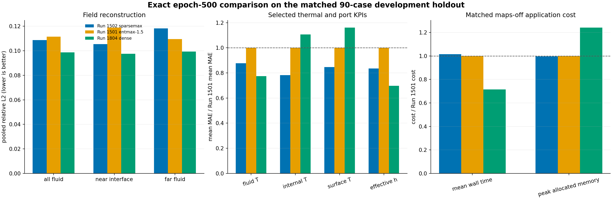
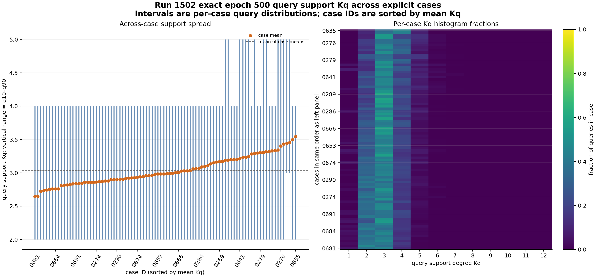
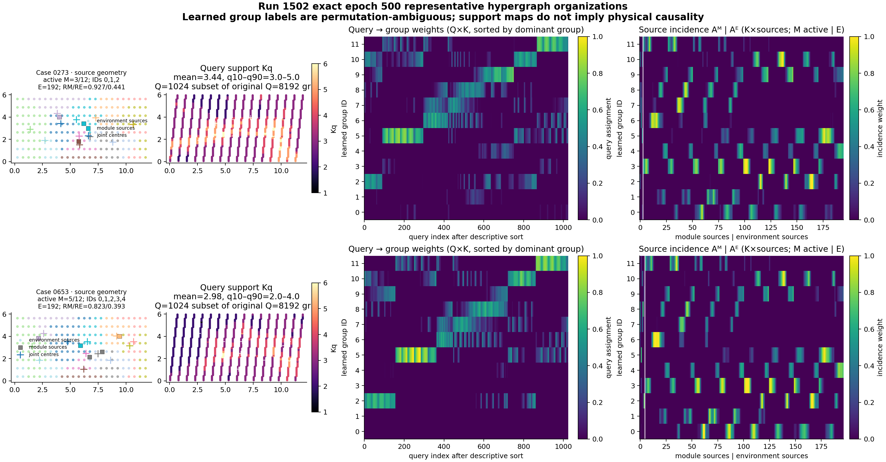
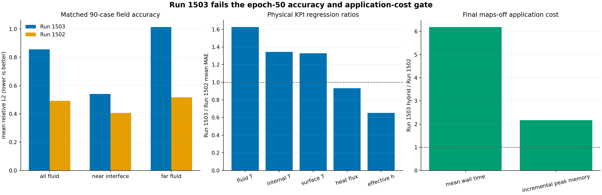
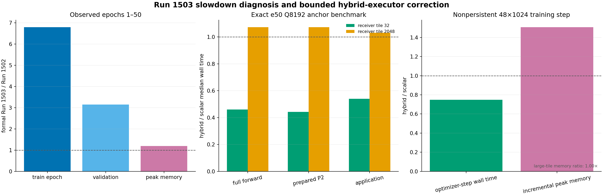
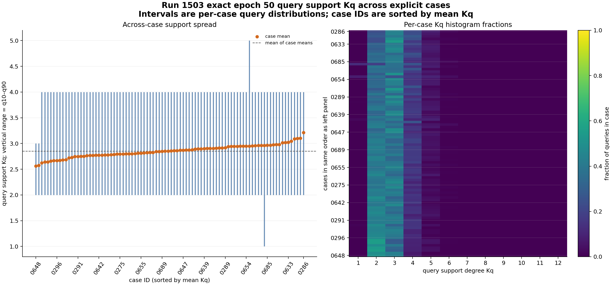
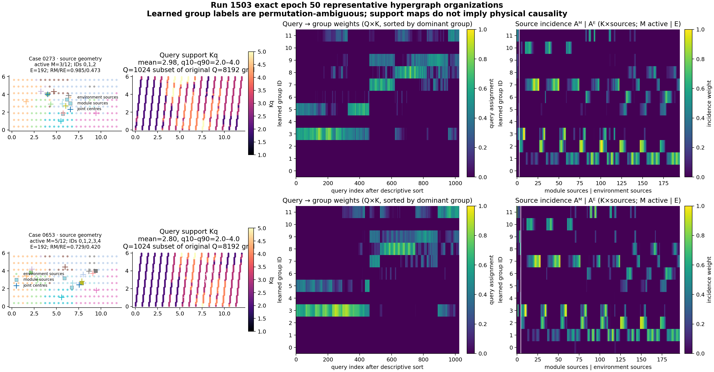

# HONF Run 1501 executor, Run 1502 development, and Run 1503 epoch-50 gate

## Decision summary

This task used only the fixed Run-1501 saved-best-total epoch-444 and exact epoch-500 checkpoints. Run 1501 maturation continued independently; this Goal-mode task did not wait for or monitor epoch 5000.

The Run-1501 accounting path is corrected from the backend through evaluator reduction. The exact support-union block executor preserves the learned operator and tested first derivatives, but its measured benefit is decided by latency and memory rather than logical row counts; the historical rectangular reader remains the default. The sole Run-1502 change is final environmental source refinement from entmax-1.5 to masked sparsemax. Its frozen eight-case gate materially reduced environmental overlap without empty-support pathology, so exactly one matched Run 1502 was launched to the epoch-50 review stop. The epoch-50 learning/evaluation gate initially rejected continuation. Subsequent explicit user instructions authorized the same run first to epoch 500 and later to epoch 5000 from its exact optimizer state. The epoch-500 milestone completed normally and was evaluated; the later continuation was startup-verified once in `Wang-3:0` and then deliberately left unattended, so this report does not claim its current epoch or completion.

At exact epoch 500, Run 1502 is a targeted tradeoff, not a new dominant baseline. Against Run 1501 it improves pooled and near-interface field error and several temperature/port metrics while regressing far-field, heat-flux, and outlet-temperature metrics, with effectively unchanged latency. Dense Run 1804 remains better in overall field accuracy and latency, although Run 1502 is better on internal and interface-surface temperature MAE.

Run 1503 is rejected at its exact epoch-50 gate. The formal implementation was 6.80x slower per training epoch and 3.15x slower per validation pass than Run 1502 over epochs 1--50. A bounded hybrid executor removes much of the scalar-loop overhead on small receiver tiles without changing checkpoint or operator semantics, but the corrected 90-case application path remains 6.19x slower and uses 2.17x the incremental peak allocation of Run 1502. Its principal field and temperature errors also regress substantially. No epoch-150 or epoch-500 continuation is launched.

The 90-case split remains a development holdout, not an untouched final benchmark. Learned incidence is surrogate-model organization, not physical causality, and group labels are permutation-ambiguous.

## 1. Evidence and accounting corrections

### Corrected contracts

- Module rectangular work is `Q * M_pad`; registered group capacity `K=12` is not its denominator. Valid module rows and padding are reported separately.
- Scalar work ledgers and padded rows are summed across inner receiver chunks; query-local arrays are concatenated, including equal-width chunks.
- `predict_case` now aggregates Run-1501 ledgers across outer evaluator chunks.
- Rectangular QE geometry rows are the executed `Q * E` rectangle, not the positive-support mask. Content-dot rows are geometry rows times the four attention heads.
- Timed physical forwards keep routing maps and detailed ledgers off. Untimed parity reads retain them. Prepared-P2 GPU decode, full GPU forward, and application evaluator scopes remain distinct.
- Population artifacts retain `M_active`, `M_pad`, active source IDs, original query-grid indices and bounds, and explicit full-grid versus deterministic subset provenance.

The focused synthetic contract has `M_pad=5`, `K=12`, `Q=11`, and inner chunks `[3,3,3,2]`. Chunked and unchunked predictions and ledgers agree, so the test would fail if `Q*K` were substituted for `Q*M_pad`.

### Real Q1024/Q8192 cross-check

The exact e500 checkpoint was evaluated on cases 0273 and 0653. The Q1024 pass used unequal outer chunks (`333,333,333,25`); the Q8192 pass used eight outer chunks of 1024, while the model retained its native inner chunk of 128.

| Pooled mean over two cases | Q1024 subset | Q8192 original grid |
|---|---:|---:|
| Mean query degree Kq | 3.38916 | 3.36609 |
| Module support RM | 0.84447 | 0.84206 |
| Environment support RE | 0.66580 | 0.66500 |
| Module rectangular rows | 12,288 | 98,304 |
| Module padded rows | 8,192 | 65,536 |
| QE geometry rows | 196,608 | 1,572,864 |
| QE content-dot rows | 786,432 | 6,291,456 |

Every executed-row ledger scales exactly by eight. The small support-statistic difference is the measured difference between the deterministic Q1024 subset and the full original grid, not a chunk-accounting inconsistency.

Representative e500 boards use all 8192 original grid coordinates, hide padded module slots, list active module IDs, use one physical coordinate frame, and separate dominant group from exact Kq. The maintained renderer emits both PNG previews and vector PDFs.

## 2. Exact support-union block executor

For each observed query support signature, the executor packs positive group support into one integer word, gathers queries with that signature, forms the unique physical-source union once, and evaluates one smaller rectangular QM or QE block. It never enumerates `2^12` masks, normalizes per group, or duplicates a physical pair through multiple groups. Numeric `alpha`, source memberships, `rho`, group controls, source measures, geometry, K/V values, and output biases remain live. Empty source-type support returns exactly zero.

`rectangular_reference` remains the historical default. `support_blocks` is an explicit evaluation-time policy; no Run-1501 training process or checkpoint is modified. The implementation deliberately has no custom kernel or detached cross-step cache.

### Exactness evidence

Focused tests cover multiple signatures, shared sources, zero support for one source type, mixed batch sizes and coordinate scales, maps-on/maps-off forward parity, and connected first gradients. On real predicted-port batches with 32 queries per anchor, the maximum field difference was `1.43e-6`, maximum query gradient difference `7.15e-7`, and maximum group-code gradient difference `1.34e-7` across e444/e500 and cases 0273/0653.

### Q8192 benchmark decision

The matched benchmark used GPU 1, receiver chunks of 128, three warmups and ten synchronized repetitions per scope. Times below are median wall milliseconds; ratios are `support_blocks / rectangular`.

| Checkpoint / case | Full GPU forward rect / blocks (ratio) | Prepared P2 rect / blocks (ratio) | Evaluator rect / blocks (ratio) | Max output difference |
|---|---:|---:|---:|---:|
| e444 / 0273 | 227.47 / 1479.82 (6.51x) | 169.50 / 1324.53 (7.81x) | 272.85 / 1527.19 (5.60x) | 5.72e-6 |
| e444 / 0653 | 222.39 / 1667.82 (7.50x) | 178.61 / 1505.91 (8.43x) | 263.35 / 1706.93 (6.48x) | 8.34e-6 |
| e500 / 0273 | 226.40 / 1517.03 (6.70x) | 170.21 / 1434.06 (8.43x) | 270.79 / 1575.24 (5.82x) | 9.36e-6 |
| e500 / 0653 | 236.36 / 1684.24 (7.13x) | 167.31 / 1507.34 (9.01x) | 268.25 / 1674.10 (6.24x) | 1.67e-5 |

CUDA-event medians closely matched wall medians. Peak incremental allocation was also higher for support blocks in every matched scope, by approximately 2.0x--2.6x. This occurred despite the intended row reduction: for example, e500/0273 reduced QM rows from 98,304 to 22,609 and QE rows from 1,572,864 to 1,108,279; e500/0653 reduced them to 31,300 and 983,631. The exact support-union algorithm is therefore retained as a tested, opt-in reference implementation, not selected as the production executor. The rectangular executor remains the Run-1501/1502 default. No custom-kernel work is justified by this task.

## 3. Frozen Run 1502 diagnostic

The fixed panel was 0273, 0653, 0644, 0686, 0277, 0291, 0680, and 0281, with Q1024 predicted-port queries on GPU 2. Only final environmental refinement was recomputed with masked sparsemax. Environmental proposal, module proposal and final assignment, and query routing retained their Run-1501 normalizers.

| Checkpoint | Parent RE | Candidate RE | Relative RE reduction | Parent / candidate RM | Parent / candidate Kq | Mean output relative RMS |
|---|---:|---:|---:|---:|---:|---:|
| e444 saved best | 0.63966 | 0.44224 | 30.86% | 0.75081 / 0.74995 | 3.27344 / 3.23328 | 0.03049 |
| e500 exact | 0.64621 | 0.45082 | 30.24% | 0.76549 / 0.76532 | 3.28772 / 3.24146 | 0.02949 |

Both checkpoints had zero empty phase groups, empty environment rows, empty query rows, and nonfinite cases. This is a structural gate, not a retrained accuracy forecast. The approximately 30% RE reduction with no obvious support failure justified one managed Run 1502; the roughly 3% frozen output change was not interpreted as either physical improvement or rejection.

## 4. Run 1502 training evidence

Identity:

```text
run-id: 1502
run-name: sparse_incidence_environment_sparsemax
architecture: sparse_incidence_group_control_honf
sole change: interface_model.environment_refinement_normalizer=sparsemax
device: cuda:2 with ordinary CUDA visibility
```

The run started from scratch with the Run-1501 seed, data, optimizer, losses, K=12, D=16, geometry, fine kernels, and rectangular executor. It was initially bounded to epoch 50. No parent warm start, distillation, second candidate, or normalizer/sparsity sweep was used.

At epoch 10 all recorded losses and 280 floating checkpoint tensors were finite. Validation total loss was 3.07310 and the parameter update norm was 0.17115, confirming that the requested path was learning rather than merely loading. The NaN update/gradient cells at unsampled epochs are intentional: those diagnostics were scheduled only at epochs 1, 2, 5, 10, 20, and 50.

The managed run completed epoch 50 with validation total loss 0.69815, field MSE 0.38435, temperature MSE 0.21141, parameter update norm 0.17834, and peak CUDA memory 24,168.6 MiB. The fixed 8-case x 1024-query population comparison against static Run-1501 epoch 50 was:

| Epoch-50 population measure | Run 1501 entmax-1.5 | Run 1502 sparsemax |
|---|---:|---:|
| Environment support RE | 0.7231 | 0.3985 |
| Module support RM | 0.6951 | 0.7423 |
| Mean query degree Kq | 2.9349 | 3.0050 |
| Mean environment degree | 5.9766 | 2.7995 |

Run 1502 had zero active-module, environment, or query empty supports. Its singleton fractions were 0% for active modules, 0.065% for environment tokens, and 0.903% for queries. Thus the structural objective persisted through training without a support-collapse failure.

The maintained GPU-2 fixed-panel comparison nevertheless failed the original learning and cost gate. Candidate/reference fluid-field relative L2 was 0.4857/0.4560, fluid-temperature physical MAE 2.2319/2.1112, effective-h MAE 1.9178/1.3970, and mean evaluation time 0.3273/0.2811 seconds per case. Near-interface relative L2 was effectively tied (0.4105/0.4093), while surface temperature MAE (2.1193/2.1293) and heat-flux MAE (5.6936/5.7487) improved only slightly. Peak memory was effectively unchanged. Therefore the exact decision at that review was `stop_before_epoch_150`: the sparse structure was real, but the then-available field/thermal and timing evidence did not justify an autonomous continuation. That historical decision is retained rather than rewritten using later evidence.

A subsequent explicit user instruction superseded that experiment gate and authorized continuation of this same run to epoch 500. Before resuming, the epoch-50 checkpoint was audited as the exact Run-1502 architecture, config, dataset, normalization, optimizer, and RNG state. It contained one optimizer group with 151 finite parameter states and three CUDA RNG states. The run was therefore resumed with ordinary GPU visibility on physical `cuda:2`; no device remapping, parent warm start, optimizer reset, second seed, or second Run 1502 was used.

| Training point | Train total | Validation total | Validation field MSE | Validation temperature MSE | Update norm | Peak CUDA MiB |
|---|---:|---:|---:|---:|---:|---:|
| Epoch 150 | 0.135669 | 0.124260 | 0.067827 | 0.033932 | 0.064728 | 24,254.22 |
| Epoch 500 | 0.050751 | 0.041733 | 0.019280 | 0.013060 | 0.092451 | 24,164.74 |

The managed manifest records `completed`, last epoch 500, and exit code 0. All 500 training rows and the epoch-150/500 parameter and optimizer tensors are finite. Best validation total through 500 was 0.037861 at epoch 473, best field MSE was 0.016280 at epoch 497, and best temperature MSE was 0.010094 at epoch 469. These mutable best selectors are reported only as training diagnostics; the comparative endpoint below uses the exact epoch-500 checkpoint. Its SHA256 is `32bee900d7435f5ed4eef4d82db6795e78ad61c9a4884ea35fa52f8c3f80bf79`.

## 5. Exact epoch-500 comparison: Run 1502, Run 1501, and Run 1804

The maintained comparison evaluated each explicit `epoch_0500_model.pt` on the same 90-case `test` development holdout, all 8192 grid queries per case, predicted port conditions, query batch 32768, and physical `cuda:1`. Routing maps and figures were disabled in the timed application path. The completed job contains 270 per-case metric rows and 270 cost rows; no best-checkpoint fallback or checkpoint selector was used.



**Figure 1.** Matched exact-epoch-500 comparison. The left panel reports pooled field errors, the middle panel normalizes selected mean physical MAEs to Run 1501, and the right panel normalizes maps-off application time and peak allocated memory to Run 1501. Values below one are improvements relative to Run 1501, but ratios across different physical KPIs are not combined into a score.

### Accuracy and physical KPIs

| Exact e500 model | Pooled fluid relative L2 | Pooled near-interface relative L2 | Pooled far-fluid relative L2 | Fluid-temperature MAE | Internal-temperature MAE | Surface-temperature MAE | Interface heat-flux MAE |
|---|---:|---:|---:|---:|---:|---:|---:|
| Run 1502 sparsemax | 0.10867 | 0.10539 | 0.11829 | 0.55688 | 0.49723 | 0.57145 | 2.58708 |
| Run 1501 entmax-1.5 | 0.11149 | 0.11895 | 0.10950 | 0.63428 | 0.63551 | 0.67536 | 2.48650 |
| Run 1804 dense | **0.09874** | **0.09759** | **0.09940** | **0.49139** | 0.70345 | 0.78448 | 2.55983 |

Against Run 1501, Run 1502 lowers pooled fluid relative L2 by 2.53% and near-interface relative L2 by 11.40%, winning 53/90 and 74/90 paired cases, respectively. It lowers fluid-temperature MAE by 12.20%, internal-temperature MAE by 21.76%, and surface-temperature MAE by 15.39%. The final environmental port temperature and effective-h MAEs improve by 38.43% and 16.45%, with 88/90 and 69/90 paired wins. These gains are not uniform: far-fluid relative L2 rises 8.03%, heat-flux MAE rises 4.04%, and mean outlet-temperature absolute error rises 41.82%.

Run 1804 remains the stronger field endpoint: Run-1502 pooled fluid relative L2 is 10.05% higher and loses 71/90 paired cases; its near- and far-field relative L2 values are 7.99% and 19.00% higher. Run 1502 nevertheless has 29.32% lower internal-temperature MAE and 27.16% lower surface-temperature MAE than Run 1804, winning 71/90 and 73/90 paired cases. Run 1804 is better on fluid-temperature, heat-flux, environmental-port-temperature, and effective-h MAEs. These are learned-surrogate errors on the development holdout, not claims of physical causality.

### Matched application cost

| Exact e500 model | Mean wall s/case | Median wall s/case | P95 wall s/case | Mean queries/s | Incremental peak allocated MiB | Peak allocated MiB |
|---|---:|---:|---:|---:|---:|---:|
| Run 1502 sparsemax | 0.28407 | 0.27789 | 0.30810 | 29,095 | 43.28 | 66.55 |
| Run 1501 entmax-1.5 | 0.27989 | 0.27680 | 0.30499 | 29,313 | 43.19 | 66.81 |
| Run 1804 dense | **0.20011** | **0.20057** | **0.21365** | **41,006** | 53.58 | 82.96 |

Run 1502 is 1.50% slower than Run 1501 in mean wall time, which is not a meaningful executor-cost improvement. It uses 19.78% less peak allocated memory than dense Run 1804 but is 41.96% slower. This comparison measures the retained rectangular application executor; sparse logical support is not claimed as executed computational sparsity.

### Sparse-incidence organization

The separate CPU population uses the same 90 cases but a deterministic Q1024 query subset. It characterizes learned organization only and is not substituted for the Q8192 accuracy or timing evidence.

| Q1024 population mean | Run 1502 sparsemax | Run 1501 entmax-1.5 | Change 1502 vs 1501 |
|---|---:|---:|---:|
| Query degree Kq | 3.03265 | 3.16733 | -4.25% |
| Module support RM | 0.76026 | 0.74966 | +1.41% |
| Environment support RE | 0.38455 | 0.62774 | -38.74% |
| Environment source degree | 2.37847 | 4.69248 | -49.31% |
| Environment logical paths | 99,413.56 | 230,466.69 | -56.86% |
| Environment unique pairs | 75,605.53 | 123,419.63 | -38.74% |



**Figure 2.** Query-support degree across the 90 explicit cases. Case means span 2.6426 (case 0681) to 3.5430 (case 0635), while each vertical interval is that case's query-level q10--q90 range. The heatmap retains the full per-case Kq histogram rather than reducing each case to its mean; Kq is measured occupied query support, not registered capacity K=12 and not a Kplan.



**Figure 3.** Representative learned organizations for cases 0273 and 0653. From left to right, each row shows source geometry and dominant learned group, spatial Kq, query-to-group weights after a descriptive sort, and module/environment source incidence. Case 0273 has three active modules, mean Kq 3.4434, RM 0.9274, and RE 0.4411; case 0653 has five active modules, mean Kq 2.9824, RM 0.8230, and RE 0.3931. Group IDs are permutation-ambiguous and the displayed support is learned surrogate organization, not physical causality.

The intended environmental sparsemax refinement therefore persists after 500 epochs without empty query support: environmental overlap and path multiplicity are much lower, while module incidence is nearly unchanged. Run-1804 sparse-support fields are unavailable, not zero. The retained Run-1501 population artifact predates the corrected receiver-chunk padded-row and geometry/content ledger, so those execution-ledger fields are marked unavailable and are not compared. Group labels remain permutation-ambiguous.

### Epoch-500 decision

Run 1502 demonstrates a real targeted structural and near-interface/thermal tradeoff over Run 1501, but it does not dominate Run 1501 across physical KPIs and does not surpass dense Run 1804 in overall field accuracy or latency. Epoch 500 was therefore the evidence milestone rather than evidence for autonomous extension. A later explicit instruction independently authorized this same run to continue to epoch 5000 with key checkpoints; it was startup-verified once in `Wang-3:0` and left unattended, with no second seed or sweep.

## 6. Run 1503 design and bounded epoch-50 gate

Run 1503 tested adaptive hyperedge opening on top of the retained grouped organization. For registered capacity `K=12`, the masked coarse allocation and opening fraction are

`p_qk = softmax_masked(l_qk + log(m_k + eps))`, `b_qk = clamp(alpha_qk / (p_qk + eps), 0, 1)`, and `y_q = sum_k p_qk [(1 - b_qk) C_qk + b_qk F_qk]`.

Here `C_qk` is the coarse group response and `F_qk` is a fine source-attention response over the learned union of module and environment sources assigned to group `k`. The learned query support degree `Kq` controls how many groups can contribute, but it does not make the fine path free: every open group still performs source projection, attention-score/value work, activation storage or recomputation, and scatter accumulation. The design therefore adds a coarse `Q x K` path plus fine work, rather than selecting one cheap block from a fixed bank.

The exact formal run is `Run_1503_20260923_120333_Run_1503_adaptive_hyperedge_opening`. Earlier receiver chunks of 128 and 64 exhausted memory; chunk 32 plus full fine-block activation checkpointing enabled training, but the original executor still invoked a scalar fine block for every active group in every receiver tile. With 8192 application queries this meant 256 receiver tiles and approximately one thousand scalar block calls per representative case, so launch and checkpoint-recomputation overhead compounded the architectural fine work.

The run completed normally at exact epoch 50 with train total loss 1.24602, validation total loss 1.26299, train/validation field MSE 0.75062/0.82900, gradient norm 4.86501, update norm 0.13152, and maximum recorded CUDA memory 29,137.61 MiB. The exact checkpoint SHA256 is `b002aec83c81bda9ec04fe163259f97dce468177188fd091e9cedafb2073f78a`.

### Formal training-time diagnosis

| Mean over epochs 1--50 | Run 1502 | Run 1503 formal | Run-1503 / Run-1502 |
|---|---:|---:|---:|
| Training wall seconds / epoch | 8.3975 | 57.0575 | 6.80x |
| Validation wall seconds / pass | 1.0213 | 3.2152 | 3.15x |
| Recorded peak CUDA MiB / epoch | 24,168.62 | 28,759.34 | 1.19x |

These traces establish that the slowdown is not measurement noise. The asymmetric 6.80x training and 3.15x validation ratios are also consistent with activation-checkpoint recomputation amplifying the scalar fine-block launch structure during backpropagation.

### Exact epoch-50 accuracy and application cost

The matched 90-case comparison used each exact epoch-50 checkpoint, all 8192 original grid queries, predicted port conditions, and physical `cuda:1`. The final Run-1503 row uses the hybrid executor described below; output parity checks show that this is an implementation substitution, not a different trained model.

| Exact e50 model | Fluid relative L2 | Near-interface relative L2 | Far-fluid relative L2 | Fluid-temperature MAE | Internal-temperature MAE | Surface-temperature MAE | Heat-flux MAE | Port-temperature MAE | Effective-h MAE |
|---|---:|---:|---:|---:|---:|---:|---:|---:|---:|
| Run 1502 sparsemax | **0.49269** | **0.40684** | **0.51670** | **2.28332** | **2.02401** | **2.29696** | 5.85766 | **2.28302** | 1.75156 |
| Run 1503 adaptive opening | 0.85589 | 0.54037 | 1.01422 | 3.71321 | 2.71873 | 3.05145 | **5.46597** | 3.15974 | **1.14319** |

| Exact e50 maps-off application cost | Mean s/case | Median s/case | P95 s/case | Incremental peak allocated MiB |
|---|---:|---:|---:|---:|
| Run 1502 sparsemax | **0.26287** | -- | -- | **42.90** |
| Run 1503 hybrid | 1.62696 | 1.60388 | 1.74089 | 93.16 |
| Run-1503 / Run-1502 | 6.19x | -- | -- | 2.17x |

As a contextual Run-1501 reference, the earlier exact-e500 90-case maps-off application mean was 0.27989 s/case, making the final Run-1503 hybrid 5.81x slower. This comparison is appropriate for the observed application-cost envelope but is not presented as a matched learning-stage accuracy comparison; the Run-1501 training process was not inspected.



**Figure 4.** Exact epoch-50 evidence. Run 1503 regresses all three pooled field measures and the principal temperature measures; only interface heat-flux and effective-h MAE improve. The right panel uses the final maps-off hybrid timing and shows that the implementation correction does not make the architecture competitive.

The accuracy gate fails independently of the speed gate: relative to Run 1502, Run 1503 increases pooled fluid error by 73.7%, near-interface error by 32.8%, far-fluid error by 96.3%, fluid-temperature MAE by 62.6%, internal-temperature MAE by 34.3%, and surface-temperature MAE by 32.8%. The isolated improvements in heat flux and effective h do not offset the broad field/temperature collapse.

## 7. Run 1503 executor correction and remaining architectural cost

The bounded correction keeps checkpoint parameters, optimizer state, losses, routing probabilities, opening rule, and output equation unchanged. Receiver tiles with `Q_tile <= 128` use one padded K-batched score/value computation, one query projection, phase-prepared source projections, and a flattened scatter. Larger tiles retain the original scalar per-group executor because an always-batched Q2048 path raised incremental memory from roughly 130--146 MiB to 2.1--2.5 GiB without a stable latency benefit. The scalar path remains the reference, mixed tail tiles are supported, and no custom kernel or new configuration surface was added.

| Matched GPU-1 diagnostic | Scalar reference | Final hybrid | Hybrid / scalar |
|---|---:|---:|---:|
| Q8192, chunk 32, full forward mean over cases 0273/0653 | 3,101.64 ms | 1,428.38 ms | 0.46x |
| Q8192, chunk 32, prepared P2 mean | 2,643.85 ms | 1,167.38 ms | 0.44x |
| Q8192, chunk 32, application evaluator mean | 3,320.46 ms | 1,794.19 ms | 0.54x |
| One matched training step, wall time | 3,533.81 ms | 2,640.55 ms | 0.75x |
| One matched training step, incremental allocated | 7.052 GiB | 10.631 GiB | 1.51x |
| Q8192, chunk 2048, full forward mean | 104.36 ms | 111.95 ms | 1.07x |
| Q8192, chunk 2048, incremental allocated mean | 138.71 MiB | 138.77 MiB | 1.00x |



**Figure 5.** The formal trace identifies the original performance failure; the Q8192 anchors isolate the scalar-loop correction; and the training-step panel exposes its time/memory tradeoff. Small-tile batching reduces wall time by 46--56%, but checkpointed padded batches increase training allocation by 51%, while large tiles correctly stay on the scalar path.

Forward differences are small and inside the focused regression-test tolerances: the Q8192 prepared/full microbenchmarks have zero prepared-versus-full difference, and the matched training-step comparison has field relative L2 `3.46e-7` with maximum absolute difference `2.74e-6`. The interface tensor has relative L2 `2.31e-6` and maximum absolute difference `6.38e-6`; its stricter per-element diagnostic `allclose` flag at `atol=2e-6` is false, so that exception is reported explicitly rather than described as bitwise or strict elementwise parity.

The correction is accepted as a narrow implementation improvement, but it cannot rescue Run 1503. The full 90-case path remains 6.19x slower than Run 1502 because mean fine work is 52.3% of the dense `Q x E` logical rectangle and is executed in addition to the coarse path; the architecture also introduces batched padding, group-wise control, and scatter work. This is the central design flaw for the current problem size: adaptive opening changes how work is organized but does not reduce enough source-attention work to compensate for its control and execution overhead.

## 8. Run 1503 learned organization

The full-population structural pass used the same 90 cases and a deterministic Q1024 subset per case on CPU. It records learned support and executor work without substituting those Q1024 values for the Q8192 accuracy or timing evidence.

| Q1024 population statistic | Mean or total | Across-case range |
|---|---:|---:|
| Mean query support Kq | 2.8529 | 2.5615--3.2129 |
| Module support RM | 0.8206 | 0.6025--1.0000 |
| Environment support RE | 0.4401 | 0.3904--0.4933 |
| Active groups | 10.58 | 9--12 |
| Active modules / padded modules | 5.83 / 12 | 3--10 / 12 |
| Opening fraction | 0.2153 | 0.1956--0.2380 |
| Fine-work ratio | 0.5229 | 0.4447--0.6006 |
| Empty groups | 128 total | 0--3 per case |
| Empty query supports | 0 total | 0 for every case |
| Empty environment sources | 0 total | 0 for every case |

Across all 92,160 sampled queries, the exact Kq histogram is `{1: 254, 2: 36,142, 3: 37,109, 4: 14,531, 5: 3,811, 6: 310, 7: 3}`. Thus Kq is concentrated at two and three even though 9--12 groups remain active per case; this distinction between registered capacity, case-active groups, and query-occupied support is essential to interpreting the organization.



**Figure 6.** Per-case Kq means and query-level spread for the complete 90-case population. All queries retain support, but the observed Kq variation does not imply proportional compute reduction because each opened group can attend a different learned source union and batched execution introduces padding.

| Representative case | Mean Kq | Active groups | RM | RE | Fine-work ratio | Empty groups |
|---|---:|---:|---:|---:|---:|---:|
| 0273 | 2.9766 | 10 | 0.9847 | 0.4730 | 0.5472 | 2 |
| 0653 | 2.8008 | 12 | 0.7289 | 0.4204 | 0.4979 | 0 |



**Figure 7.** Representative learned organizations for cases 0273 and 0653. Each row shows source geometry and dominant group, spatial Kq, sorted query-to-group allocation/opening, and module/environment incidence. The contrast exposes real case-dependent organization, but group IDs are permutation-ambiguous and learned support is not a physical-causality claim.

### Epoch-50 decision

Run 1503 fails both required gates. Its exact e50 accuracy is broadly worse than Run 1502, and the best bounded executor correction still leaves whole-application latency and memory far outside the established Run-1501/1502 envelope. The formal candidate remains stopped at epoch 50; no resume to epoch 150 or 500, second seed, sweep, custom kernel, or altered loss is justified.

## 9. Deferred work

Mature Run-1501 epoch-5000 evaluation is explicitly out of scope. When that training eventually finishes, no automatic evaluation, checkpoint selection, executor benchmark, restart, or process action should occur. A later 90-case mature comparison requires a new explicit user request.

Run 1502 has a separately authorized continuation target of epoch 5000. Its startup and checkpoint policy were verified once, after which it was intentionally left unattended; no status or completion claim is made here. No custom kernel, monitoring infrastructure, new provenance/security contract, second normalizer, temperature sweep, top-k rule, sparsity loss, or historical architecture change was added.

## 10. Reproducible artifacts

- Accounting Q1024: `diagnostics/generated/run1501_executor_run1502_development/accounting_e500_q1024`
- Accounting Q8192 and full-grid figures: `diagnostics/generated/run1501_executor_run1502_development/accounting_e500_q8192`
- Frozen Run-1502 diagnostic: `diagnostics/generated/run1501_executor_run1502_development/frozen_run1502_q1024`
- Q8192 support-block benchmark: `diagnostics/generated/run1501_executor_run1502_development/run1501_support_blocks_benchmark_q8192.json` (`sha256 a3e294e02b804297c65c135023bd713248510db432a7b3d3549a8329fa799417`)
- Run-1502 epoch-50 review: `diagnostics/generated/run1501_executor_run1502_development/run1502_epoch0050/epoch0050_review.json` (`sha256 55088eb6cda8d288d1f7afd58ea167c642c38074ec24b55240ea9c8de70ef8fa`)
- Run-1502 managed output: `Trained_Results/ThermalChannel/HONF_Forward_Runs/Run_1502_20260923_004751_sparse_incidence_environment_sparsemax`
- Matched exact-e500 evaluator: `Trained_Results/ThermalChannel/HONF_Forward_Runs/Run_1502_20260923_004751_sparse_incidence_environment_sparsemax/evaluations/matched_epoch0500_90case`
- Run-1502 Q1024 structure evidence: `Trained_Results/ThermalChannel/HONF_Forward_Runs/Run_1502_20260923_004751_sparse_incidence_environment_sparsemax/evaluations/sparse_incidence_population_epoch0500_q1024/evidence.json`
- Validated reduction tables: `Trained_Results/ThermalChannel/HONF_Forward_Runs/Run_1502_20260923_004751_sparse_incidence_environment_sparsemax/evaluations/matched_epoch0500_reduction`
- Reproducible report-figure renderer: `tools/diagnostics/render_run1502_epoch500_report_figures.py`
- Report figures and vector companions: `docs/reports/figures/honf_run1502_epoch500`
- Run-1503 exact epoch-50 checkpoint: `Trained_Results/ThermalChannel/HONF_Forward_Runs/Run_1503_20260923_120333_Run_1503_adaptive_hyperedge_opening/epoch_0050_model.pt`
- Run-1503 exact 90-case hybrid evaluation: `Trained_Results/ThermalChannel/HONF_Forward_Runs/Run_1503_20260923_120333_Run_1503_adaptive_hyperedge_opening/evaluations/epoch0050_gate/hybrid_accuracy`
- Run-1503 scalar, always-batched, and final-hybrid Q8192 executor anchors: `Trained_Results/ThermalChannel/HONF_Forward_Runs/Run_1503_20260923_120333_Run_1503_adaptive_hyperedge_opening/evaluations/epoch0050_gate`
- Run-1503 Q1024 full-population organization evidence: `Trained_Results/ThermalChannel/HONF_Forward_Runs/Run_1503_20260923_120333_Run_1503_adaptive_hyperedge_opening/evaluations/epoch0050_gate/organization_population_q1024/evidence.json`
- Run-1503 diagnostic tools: `tools/diagnostics/run_run1503_diagnostics.py`, `tools/diagnostics/run_run1503_selected_executor_benchmark.py`, and `tools/diagnostics/run_run1503_organization_evidence.py`
- Run-1503 report-figure renderer: `tools/diagnostics/render_run1503_epoch50_report_figures.py`
- Run-1503 report figures and vector companions: `docs/reports/figures/honf_run1503_epoch50`

Throughout this work, Run 1501 training was neither monitored nor modified, restarted, interrupted, or awaited. Only its already-existing exact epoch-500 checkpoint and retained static evidence were read for the requested comparison. Run 1502 was likewise not monitored after its separately authorized epoch-5000 continuation was startup-verified.
