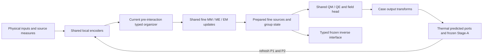

# Shared-core alignment for the Thermal strategy campaign

The Thermal and Wind wrappers share the interaction implementation while
retaining their different physical interfaces. Thermal still predicts ports,
runs its frozen local surrogate, and refreshes the global state through
P0/P1/P2. Wind supplies its native three-dimensional source fields and one
preparation phase. This alignment does not imply transfer accuracy.

## Architecture map

| Assembly | Wrapper / adapter | Shared mathematics | Organized paths | Physical ownership |
|---|---|---|---|---|
| Run1804 e4738; fresh B-native | ChannelThermalHONFModel / native Thermal environment and coupling adapter | InterfaceFieldCore, dense_pairwise_field, SharedInterfaceContext | Dense MM/ME/EM/QM/QE; native coarse and local contexts active | Predicted ports and frozen Stage-A local surrogate in Thermal wrapper |
| B-fine | Same Thermal wrapper and adapter | three_term_full_access_honf, ThreeTermInterfaceContext, native fine reader | Full MM/ME/EM/QM/QE; no coarse/local field branch | Same Thermal coupling, normalization and local surrogate |
| H-tree | Same Thermal wrapper and adapter | adaptive_receiver_hypergraph_honf, shared typed fine reader and adaptive receiver tree | Typed MM/ME/EM/QM/QE plans from current pre-interaction inputs | Same Thermal physical assembly; depth-three receiver indexes are input-only |
| H-overlap | Same Thermal wrapper and adapter | overlap_control_hypergraph_honf, shared typed fine reader | Eight provisional proposals; conditional admission/source/access/control on five mechanisms | Same Thermal physical assembly; no Dense interaction bypass |
| H-local | Same Thermal wrapper and adapter | local_overlap_hypergraph_honf, same overlap and fine equations | Five mechanisms with explicit near access and far controls | Adapter supplies physical lengths; deterministic near work counted separately |
| Wind retained and disposable compatibility models | WindFarmForwardModel / NativeCase and BatchData adapter | Same InterfaceFieldCore; new architectures registered centrally for 3-D | Native retained Dense, or all five typed paths in new disposable models | Wind field transforms and rotor-diameter coordinates remain in case package |

The Thermal profiles use H256/message128/four heads, two spatial coordinates,
Fourier order four, 192 environment tokens and five fluid channels
[u,v,p,omega,temperature]. The new control width is 16. Thermal coordinates
are the benchmark's physical xy units, with coordinate scale [12,6];
Wind coordinates are xyz in rotor diameters. Axis-preserving geometry features
include explicit absent-axis flags. Source measures and physical lengths are
separate: Thermal lengths are sqrt(token-cell area), Wind lengths cube-root
token-cell volume. Normalized quadrature weights are never interpreted as
physical lengths.

The global background uses the maintained prescribed context and input
layout summaries. The H models preserve fine source states and a single
source-union environmental softmax. Their group controls modulate fine
messages; they do not replace those messages with decoded group averages.
MM excludes self and padded modules; positive environment measures determine
eligibility. Full-access/control-identity parity uses the audited native
MM/ME/EM/QM denominators and environmental attention normalization.

The optimizer inventory at the initial native launches contains 201 tensors /
4,395,409 scalars for B-native and 140 tensors / 2,928,273 scalars for B-fine.
The capacity difference is intentional and must remain visible in accuracy
and efficiency comparisons. The H models copy 249 compatible physical/local
initial state tensors from a freshly materialized B-fine; their additional
organizer parameters are materialized before optimizer construction. Final
component inventories will be reported at the trained versions.

The materialized native five-arm inventory now measures the following scalar
counts (the same architecture counts apply at later checkpoints):

| Component | B-native | B-fine | H-tree | H-overlap / H-local |
|---|---:|---:|---:|---:|
| Shared source encoders | 282,368 | 282,368 | 282,368 | 282,368 |
| Fine MM/ME/EM | 1,074,944 | 1,074,944 | 1,074,944 | 1,074,944 |
| QM/QE and field head | 726,153 | 790,665 | 790,665 | 790,665 |
| Thermal coupling/fallback | 780,296 | 780,296 | 780,296 | 780,296 |
| Dense coarse/local contexts | 1,531,648 | 0 | 0 | 0 |
| Organizer | 0 | 0 | 324,315 | 30,507 |
| Collective modulation | 0 | 0 | 204 | 204 |
| Total trainable | 4,395,409 | 2,928,273 | 3,252,792 | 2,958,984 |
| Frozen Stage-A | 1,035,139 | 1,035,139 | 1,035,139 | 1,035,139 |

The reusable inventory tool measures parameters after native materialization;
its component sum equals the actual optimizer parameter population. The
Thermal-owned coupling parameters remain present in all arms. Parameter
count is not executed work or a latency measurement.

Allocated trainable tensors also differ from active optimizer state. At exact
B-fine e200, 120 of 140 tensors have AdamW state, all at step 2,600. A genuine
native B2/Q17 backward and the checkpoint's parameter registration mapping
both identify the other 20 tensors (104,451 scalars) as
`fallback_heads.internal_head` and `fallback_heads.interface_head`. This
configuration uses frozen Stage-A local outputs and bypasses those global
fallback heads; all shared backend/encoder/native coupling parameters have
gradients. Their weights remain bitwise unchanged from e100 to e200. The
legitimate fallback branches remain available for other case configurations.

## Executed checks

Retained Thermal Run1804 e4738 and Wind Run2103 e2475 replayed through the
current wrappers and the retained 0076b28 implementation at tolerance 2e-5.
Prepared uneven-chunk decode and disposable actual optimizer steps passed
for both. Thermal's frozen Stage-A tensors remained bitwise unchanged.
The recorded disposable losses were 0.00620195 for Thermal and 0.504522 for
Wind; these are execution checks, not retraining results.

Fresh Thermal tree/overlap/local models completed real hard/soft forward,
backward and optimizer steps on native case 0001. Organizer gradient L1
totals were 0.0015223, 0.0207976 and 0.0231584. Their frozen Stage-A state was
unchanged. A native epoch-101 response-pair smoke also completed its combined
value/response backward and optimizer step; no response family substitutes
for the full 600-case value epoch. Fresh disposable Wind models passed real
3-D hard/soft forward, optimizer and typed-export checks for all three new
architectures. No Wind scientific training was launched.

Focused tests exercise 2-D/3-D construction, source permutation and padding,
query order and uneven chunks, phase freshness, empty source types,
all-access physical first-gradient parity, omitted-source shadow gradients,
axis flags, fixed-total heat gradients and exported-state stability. The
canonical intentionally identical Thermal/Wind adapter example produces
bitwise identical common encoded/read quantities. Whole Thermal and Wind
outputs are not equated.

The focused CPU invocation passed 107 tests with five optional native-resource
tests skipped there and executed separately against local resources. The
combined native alignment/campaign suite passed 15 tests using the actual
retained checkpoints and geometry. Six heat-inference tests passed; a native
Run1804 smoke completed real heat updates on two cases. Five older native
joint-shadow CUDA checks also passed on an explicitly authorized GPU before
the training launches. Three historical cover-ledger assertions fail
identically on unchanged 0d1f57c; they were not hidden by rewriting historical
interaction equations.

## Reproducible checks and limits

Run focused tests with the ModularDT environment and the shared-core and
both case source directories in PYTHONPATH. Set CUDA_VISIBLE_DEVICES explicitly
to 1, 2, or empty for CPU. Native replay tests accept retained checkpoint and
dataset paths through the documented environment variables in
tests/test_wrapper_alignment_native.py; absent resources are reported as
skips. No historical checkpoint is modified.

The initial executor is the dense masked reference. Saved positive support
counts represent logical access; they do not establish saved rows or latency.
The hard-value/continuous-shadow gradient is a biased organizer estimator;
only the hard operator is used for reported inference. Alignment establishes
reusable mathematics and physical-interface preservation, not graph utility,
physical causality, or a completed scientific campaign.
