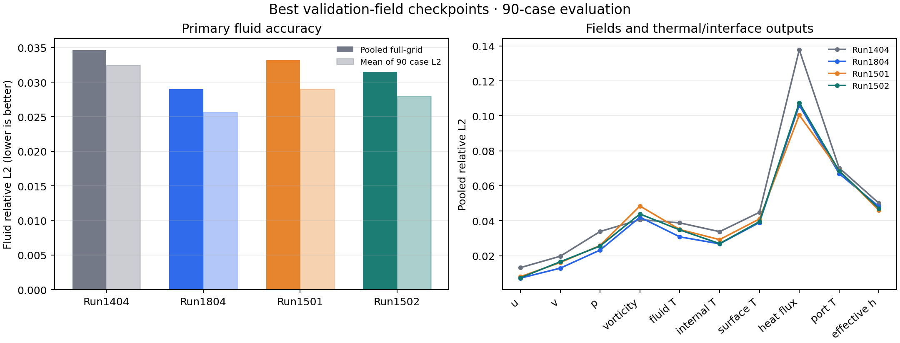

# HONF milestone review: better evidence, useful thermal gains, and the remaining fast-forward and inverse gap

**Review period: 22 September–6 October 2026.** The work over these two weeks changed the question from “can fewer hyperedges reproduce the field?” to “can an organized forward model preserve the physical changes that an inverse decision needs?” It introduced real source-pair accounting, response references, stronger controls, a fairer development budget, representation and derivative audits, and explicit source–receiver interaction controls. Several of these are durable advances. They have not yet produced a broadly accurate, demonstrably fast replacement for the established forward models or a trustworthy continuous inverse model.

This review synthesizes **20 current top-level reports**, the September mature comparison, and relevant archived method studies. It is a retrospective of saved measurements; no training, inverse search, checkpoint conversion, or reference solve was performed for this review. The [report directory index](README.md) supplies the consecutive reading order. Original reports remain intact. The long shared-core campaign status is a historical execution log; its [500-epoch conclusions](HONF_Shared_Core_Thermal_500_Epoch_Conclusions.md) control the completed five-arm comparison.

## What to retain from the two weeks

**Predictor — useful thermal learning, no general replacement.** Mature Dense **1804** remains the principal broad-field reference; **1401** remains the historical fast HONF anchor. Sparsity-oriented mature 1501/1502 improve some fields over 1404 but lose to Dense on both pooled accuracy and complete inference latency. Later Tree and Tensor models improve selected thermal quantities against matched controls, while flow, ports, difficult-case tails, or cost deteriorate. The latest Add/Joint refinement lowers all five reported main field means relative to its parents and contextual quarter-data references, including fluid-temperature RMSE **0.770312/0.779114**, but initial-port temperature worsens about **21%**. These last results do not establish a win over mature 1804.

**Organizer — better mathematical and execution evidence, limited unique grouping value.** The work now distinguishes group count, exact support, deduplicated pairs, executed fine rows, and complete runtime. Tree-Lite achieves a measured **54.20%** high-M wrapper reduction against its former implementation, but remains **2.25×** the direct Pair control in that benchmark. Fine physical sources remain densely evaluated in the newer native-context and residual-control families. Useful controls do not necessarily require the learned spatial grouping: uniform or geometry-matched replacements often preserve almost all the benefit.

**Inverse — stronger diagnostics and finite reuse, unresolved physical directions.** Frozen inverse trails, stable bounded sampling, observation Jacobians, and already solved finite-pool rankings are measured. The latest models choose the correct candidate in all four small stored heat pools, with zero realized pool regret. However, both predict the wrong mean fluid-temperature direction for the two signs of the **0291** heat transfer, and neither meets any of the **90% heat-to-flow null-reduction targets**. Correct rankings in a tiny exposed pool do not establish valid new designs, reliable continuous gradients, or calibrated feasibility.

**Next investment.** Preserve these measured references and investigate the case-owned heat/flow dependency contract and its actual information paths. Another automatic organizer portfolio or a longer unchanged run would not resolve the demonstrated response failures. Any new comparison should retain the matched separable control, the fixed data selection, measured complete cost, and the response-direction/null checks.

## 1. The two anchors and the comparisons that must stay separate

### 1.1 What 1401 and 1804 actually establish

The historical full-data comparison used the same **90 exposed development cases**, complete **8,192-point** query grids, predicted ports, checkpoint-owned normalization, and fluid masks. Pooled normalized fluid relative L2 is

$$
\epsilon_{\mathrm{pool}}
=\sqrt{\frac{\sum_c\sum_{q,a}\omega_{cq}\,[\widehat f_{cqa}-f_{cqa}]^2}
                    {\sum_c\sum_{q,a}\omega_{cq}\,f_{cqa}^2}}.
$$

Here $c$ is a case, $q$ a receiver, $a$ a channel, and $\omega$ represents the evaluation mask/weight. This is different from the arithmetic mean of casewise relative errors, native-unit RMSE, or sampled trainer validation MSE. Normalized and physical relative errors can differ when normalization subtracts a nonzero offset.

| Historical full-data policy | 1401 Legacy | 1804 Dense | What it supports |
| --- | ---: | ---: | --- |
| Exact epoch 500 pooled fluid L2 | 0.117148 | **0.098741** | Dense learns broad fields faster at this measured age. |
| Exact epoch 2,500 | **0.045285** | 0.048835 | An intermediate ranking can reverse. |
| Exact epoch 5,000 | 0.037401 | **0.029661** | Dense is 20.70% lower; wins 80/90 paired cases. |
| Saved best-field through 5,000 | 0.032097 at 4,585 | **0.028960 at 4,738** | Selector policy materially changes the numbers. |
| Exact 5,000 near-interface pooled L2 | **0.033693** | 0.035086 | Dense does not win every region. |
| Exact 5,000 far-fluid pooled L2 | 0.041778 | **0.026495** | Dense's broad-field advantage includes the far field. |

Sources: [exact-5,000 comparison](_bk/HONF_Epoch5000_Comparison_Report.md) and [five-model comparison](_bk/HONF_Five_Model_Epoch5000_Comparison_Report.md), checked against saved [endpoint reductions](../../diagnostics/generated/interface_operator_study/five_model_epoch5000/reduction/headline.csv) and [best-selected reductions](../../diagnostics/generated/interface_operator_study/five_model_epoch5000/reduction/best_selected_headline.csv). These are reused historical measurements, not a new checkpoint evaluation.

There is one important qualification to “Dense is strongest”: historical Regional **1806** reaches **0.028192** under its saved-best policy, slightly below Dense's **0.028960**, while its exact-5,000 result **0.031188** trails Dense and its physical metrics are mixed. Thus 1804 is the broad reference, not a claim that no architecture has ever beaten one Dense score. Likewise, routing-only **1404** improves the exact-endpoint pooled score to about **0.03549** versus 1401's **0.03740**, but does not establish a uniformly better fast model across checkpoint policies, regions, physical outputs, and anchors. The separate [1404 endpoint reduction](../../diagnostics/generated/run1404_1406_1407_1804_best5000_accuracy_20260920/accuracy_summary.json) supplies that comparison.

The speed claim also needs its original workload. A prior controlled GPU0 benchmark on **two real cases**, Q8192 and inner receiver chunk 2048, measures full forward **26.00 ms for 1401 versus 35.44 ms for 1804**, and prepared decode **6.52 versus 13.01 ms**. Separate B48/Q1024 optimizer boundaries measure **0.303/0.591 s** for 1401 at M1/M12 versus **0.991/2.187 s** for Dense. The [routing cost report](_bk/HONF_Routing_Epoch2500_Comparative_Evaluation.md) owns these measurements. They must not be spliced into a later native-chunk or different-GPU latency table. The recent studies do not provide a new common benchmark showing a candidate both broadly better and as fast as 1401.

### 1.2 Four evidence families, rather than one universal leaderboard

| Evidence family | Membership and budget | Correct interpretation |
| --- | --- | --- |
| Mature historical Thermal | Original 600-case training; historical 90-case development comparison; exact or saved-best checkpoints through 5,000 | Anchors reconstruction, checkpoint sensitivity, and historical cost. The 90-case compatibility population later has a known input duplicate. |
| September bounded Thermal/Wind adaptation | Update-limited refits, small exposed response families, role panels, and native stored references | Tests a method and its stated gates; update counts are not full epochs. Teacher agreement is not physical agreement. |
| October full-data shared-core campaign | 600 unique train visits/epoch, 13 updates, Q1024; 90 compatibility validation, canonical 89 excluding 0273; five fresh arms at 500 | Within-campaign exact-age comparisons are meaningful. Mature 1804 is an unequal-age contextual reference. |
| October fixed-quarter development | Frozen input-only **150 train / 22 validation**, four updates/epoch, Q1024; validation M3/M5/M7/M10 counts **6/6/6/4** | Repeatedly exposed development evidence. Retained Dense-D25 is freshly trained Run3101, not mature Run1804. |

The fixed-quarter semantic manifest is `933b0138ba2f8447a1ecadfe31fd0bb2cb4a05607d3ac3d9f0dc79419f196044`. Selected-training normalization, seed, case/query streams, losses, and the declared absolute schedule bind a comparison. One development epoch contributes **150 case visits, four optimizer updates, and 153,600 primary fluid queries**. A 500-epoch arm therefore contributes **75,000 visits, 2,000 updates, and 76.8 million primary queries**; response and null wrappers are extra work. The [development protocol](../guides/Thermal_Model_Development_Protocol.md) defines these identities. Its original preparation-only verification paragraph is a historical record; the later reports contain actual training.

The latest response refinement explicitly adds three original-TRAIN response families outside the primary 150 cases, alongside selected case 0348. Its primary reconstruction population remains unchanged, but its auxiliary supervision is broader. This is disclosed additional response exposure, not strict identical training against the retained Dense-D25 control.

## 2. The mathematical question that connects the methods

### 2.1 Keep the native physical assembly in view

For Thermal, the forward map includes more than a field decoder:

$$
\text{physical inputs}
\longrightarrow P0\ \text{organization and provisional ports}
\longrightarrow \text{frozen Stage-A local response}
\longrightarrow P1\ \text{refinement}
\longrightarrow P2\ \text{final organization and field read}.
$$

Frozen Stage-A **parameters** remain protected; its computation can still transmit derivatives from heat and predicted ports. An intervention in a query control can change ports and thereby alter later states. Coarse/global/local paths and input-only planning can remain information paths even when one displayed fine route excludes a donor.

### 2.2 1401: compress global information and retain a query–module kernel

Let $m_i$ be module tokens, $e_j$ environment tokens, and $h_k$ the learned group state. In the established six-group architecture, dense softmax incidences aggregate modules and environment into $h_k$, and query attention $\alpha_{qk}$ selects their mixture. The two distinctive contexts are

$$
c_H(q)=\sum_{k=1}^{6}\alpha_{qk}W_vh_k,
\qquad
c_{\mathrm{pair}}(q)=g\sum_i\beta_{qi}\psi(q,i),
\quad
\beta_{qi}=\sum_k\alpha_{qk}\bar A^{MH}_{ik}.
$$

$\bar A^{MH}$ is column-normalized module incidence, $\psi$ the shared nonlinear module-pair MLP, and $g$ its learned scalar gate. Global and near-module contexts also enter the field head. The efficient fused contraction reuses the same $\psi(q,i)$ across groups; it does not require a separate expensive nonlinear response for every query–group–module path. Dense softmax support over six groups is not learned exact sparsity.

This is why 1401 remains a useful speed anchor. Its mature model also depends strongly on the direct $c_H$ branch: simply removing that branch or replacing its module token after training does not recover its predictions. Routing-only 1404 required retraining, and its usefulness/speed conclusions remain distinct. The equations and implementation are in [Model_Explain](../../Model_Explain.md), [the decoder](../../src/honf_forward_core/decoder.py), and [the pairwise kernel](../../src/honf_forward_core/decoding/pairwise.py).

### 2.3 1804: preserve fine collective messages before reading the field

Dense uses typed **MM, ME, EM, QM, QE** interactions: module-to-module, environment-to-module, module-to-environment, module-to-query, and environment-to-query. With $\mu_j$ the environment quadrature mass, its preparation can be summarized as

$$
a_i^{MM}=\frac{\sum_{\ell\ne i}\psi_{MM}(m_i,m_\ell,x_i-x_\ell)}{1+M},
\quad
a_i^{ME}=\frac{\sum_j\mu_j\psi_{ME}(m_i,e_j,x_i-y_j)}{\sum_j\mu_j},
$$

$$
\widetilde m_i=m_i+U_M(m_i,a_i^{MM},a_i^{ME},g_0),
\qquad
a_j^{EM}=\frac{\sum_i\psi_{EM}(e_j,m_i,y_j-x_i)}{1+M},
\quad
\widetilde e_j=e_j+U_E(e_j,a_j^{EM},g_0).
$$

All three message types use the same pre-update module state in this simultaneous pass; EM is not silently fed the newly updated $\widetilde m$. Active/self masks are omitted above for readability. The query read retains individual prepared sources:

$$
c_M(q)=W_o\frac{\sum_i\psi_{QM}(\widetilde m_i,q-x_i,g_0)}{1+M},
\qquad
c_E(q)=\sum_j
\operatorname{softmax}_j\!\left[\ell(q,\widetilde e_j)+b(q-y_j)+\log\mu_j\right]
V\widetilde e_j.
$$

The original native coarse and local contexts also contribute. These are descriptive equations for the maintained Dense implementation, not an exact reproduction of a published neural-integral model. They follow [dense_pairwise.py](../../src/honf_forward_core/interface_fields/dense_pairwise.py). The naive pair budget scales like $M^2+2ME+QM+QE$ per relevant pass, before chunking and shared projections. Parameter count, this algebraic budget, and measured runtime are different quantities.

### 2.4 What the new organizers are trying to change

The strongest common idea in the newer HONF methods is to **organize access and collective control while retaining fine nonlinear source responses**. A group can specify who contributes and how its message is modulated, without replacing every physical source by one decoded centroid value.

For route $r$, a schematic controlled reduction is

$$
c_r(q)=\sum_{s\in\mathcal S_r}w_s\,p_r(q,s)
\,[1+\tanh u_r(q,s)]\,\psi_r(q,s),
$$

with source weights $w_s$, effective permission $p_r$, and learned control $u_r$. QE uses its native attention normalization over unique physical sources rather than this simple unnormalized sum. This equation locates the experimental choices: source groups, receiver access, source–receiver controls, and execution of the retained fine values.

Four separate tests follow: Does this improve physical prediction? Does its specific organization add value against a strong simple control? Does the executor actually do less work? Does the resulting response support the inverse decision? Much of the apparent churn is the gradual separation of those questions.

## 3. First milestone: exact zeros and fewer groups did not guarantee less work

**22–25 September.** Case-budgeted K, sparse incidence, reversible coalescence, continuous fusion, and source-conditioned controls tested progressively different forms of compression. The useful result is the failure diagnosis, not a new accepted fast model.

The accounting vocabulary now separates

$$
K_{\max},\quad K_{\mathrm{admitted}},\quad
K_q=\#\{k:\alpha_{qk}>0\},\quad
P_{\mathrm{unique}}=\left|\bigcup_k P_k\right|,\quad
N_{\mathrm{fine,executed}},\quad t_{\mathrm{complete}}.
$$

A routing rank or entropy-based effective K is another statistic. It is neither exact support nor the physical response rank. Merging access classes can reduce the number of distinct receiver permission rows while leaving the union of physical sources unchanged. A dense masked reader can execute the entire rectangle despite many exact zeros.

| Method/result | What was measured | What it ruled out |
| --- | --- | --- |
| Case-budgeted 1409, exact 50 | Every one of 90 cases deploys K=1; pooled L2 **0.54911** versus parent1406 **0.42440**; loses all 90 paired cases. Fine rows stay dense and matched optimizer cost does not fall. | Learned count collapse is not case-specific useful capacity or a speedup. A separate rescue rerun also failed its 50 gate; its different numbers are not merged here. |
| Mature1501→1502 | Environmental unique supported pairs fall **33.3%**, about 0.963M→0.643M/case; executed QE rows remain **1,572,864/case** and QM rows **98,304/case**. | Sparsemax improves logical incidence without changing the rectangular fine reader's work. |
| Adaptive opening1503 | Coarse work remains and fine work is added. Its early gate regresses both field error and cost. | “Open only selected groups” need not remove the original computation. |
| Continuous/coalesced1504–1507 | Access-class merging is distinguished from physical-source pruning;1506 does not realize useful mergers;1507 chooses all-closed/R=1. | An unused adaptive/query controller cannot be credited for a useful static predictor. |
| Source-conditioned1508 | Removing unused machinery gives a same-weight implementation benefit, but no adaptive organization and a near-interface tradeoff. | A simpler static surrogate can be useful without validating conditional coalescence. |

Two early gains deserve to survive the stop decisions. Run1505 e500 achieves real case-dependent mergers and reduces pooled field L2 **0.10867→0.09789** against same-age1502, about 9.9%. However, final-port error rises 21.2%, a narrow geometry switch produces a3.05% output jump, and complete application costs 4.97× its parent. Run1508 then specializes Run1507's universally all-closed operation: same-weight native-chunk128 application falls **267.17→162.63 ms on M3** and **273.60→165.17 ms on M10**, with numerical output parity and unchanged fine-source rows. Fresh1508e496 remains a mixed predictor, including worse near-interface error than1502e500. Neither establishes adaptive topology or a matched win over fast1401. Sources: [1505 identity-preserving coalescence](_bk/HONF_Run1503_v3_Converged_Identity_Preserving_Coalescence.md) and [1508 static specialization](_bk/HONF_Source_Conditioned_Core_Diagnostics.md).

The coalescence mathematics preserves source moments when compressing repeated access functions. For a class $C_r$ of $m_r$ constituents, let $b_{qr}=a_{qr}/m_r$, $\bar A_{sr}=\sum_{k\in C_r}A_{sk}$, and $B_{sr}=\sum_{k\in C_r}A_{sk}h_k$. Then $\rho_{qs}=\sum_r b_{qr}\bar A_{sr}$ and $n_{qs}=\sum_r b_{qr}B_{sr}$ match the virtual repeated **fused-function** reader. This identity does not guarantee that fusion preserves the original parent prediction, nor that any fine source disappears. It explains how the number of access classes can shrink while physical-source work remains dense.

The mature comparison provides a clean field-and-cost check within one application protocol:

| Saved best-field model | Pooled fluid L2 | Complete application ms/case | Decision |
| --- | ---: | ---: | --- |
| 1404 classic | 0.03460 | **29.88** | Recent fast comparator; not literally1401. |
| 1804 dense | **0.02896** | 158.87 | Dominates1501/1502 in this accuracy/latency plane. |
| 1501 | 0.03321 | 231.33 | Better some physical quantities, slower broad application. |
| 1502 | 0.03153 | 231.09 | Useful fidelity/incidence change, no application speed gain. |

These are all 90 Q8192 cases on one RTX6000Ada GPU, maps off, one warmup and three synchronized repetitions, checkpoint-native inner chunks. Incremental allocation and recorded historical training totals have separate meanings. See [the mature comparison](run1501_1502_comparison/HONF_1404_1804_1501_1502_Mature_Comparison.md), its [accuracy table](run1501_1502_comparison/accuracy/accuracy_summary.csv), and [cost measurements](run1501_1502_comparison/cost/inference_cost_cuda2.csv).

**Figure 1 — retain the field tradeoffs, not just a sparsity headline.** Saved-best full-grid90-case evidence gives 1502 pooled L2 **0.03153**, an improvement over1501 **0.03321** but worse than Dense **0.02896**.1502 beats1501 on 49/90 cases and Dense on 21/90. Pooled improvement is not universal per-case or per-field improvement. [PDF master](run1501_1502_comparison/accuracy/accuracy_comparison.pdf).

**Milestone lesson:** exact support needs an executor that avoids work, and saved work needs a complete-call timing benefit. Neither follows from a smaller K, an attractive graph, or a lower memory peak.

## 4. Second milestone: field accuracy and physical response fidelity are different objectives

**26–29 September.** The interaction/response studies introduced anchored changes, physical receiver joins, native reference recovery, typed cover choices, and frozen inverse experiments. This is the conceptual turning point of the two weeks.

The selected figures follow the decision chain: identify the physical change, test response-fit transfer, distinguish teacher preservation from physical fidelity, then inspect candidate ranking and constraint failure. They reuse the [receiver-local study's saved visual evidence](HONF_Receiver_Local_Interface_and_Decision_Recovery_Study.md); no model evaluation or physical solve is added by this review.

### 4.1 What changes when a design changes?

For design/input vector $d$, model response and its error are

$$
\Delta\widehat F(d;h)=\widehat F(d+h)-\widehat F(d),
\qquad
e_\Delta=\Delta\widehat F-\Delta F.
$$

A model can approximate the baseline field and still get this difference's amplitude or sign wrong. A two-source mixed response is

$$
\Delta_{ij}F=F(d+h_i+h_j)-F(d+h_i)-F(d+h_j)+F(d).
$$

This measures non-additivity under the specified perturbations; it is not a learned hyperedge weight. Tiny true mixed signals require absolute error and numerical/reference sensitivity, rather than interpreting a huge ratio divided by a near-zero denominator. Agreement between automatic differentiation and finite differences of **the model** establishes local numerical consistency, not agreement with $\Delta F$ from a physical reference.

**Figure 2 — the response target is a spatial change, not the original temperature field.** Train-exposed M3/0001 at Re50: module 0 moves +0.15 in x, module 1 +0.15 in y, while heat, context and module 2 remain fixed. Panel (a) is absolute reference temperature; (c–e) are individual/combined changes; (f) subtracts the two individual changes from the combined change. Saved 128×64 reference states share a 7,919-cell common-fluid mask. Fluid mixed-response RMS is **0.008584**, with maximum absolute **0.070752**, in dataset temperature units; the change and mixed panels deliberately use different scales. This identifies the signal a response model must reproduce, not a HONF prediction or learned causal edge. The unchanged hottest module's material response remains numerically unresolved. Reference: local analytic-wake/shared-grid thermal generator, not CFD or kelvin. [PDF master](../../diagnostics/generated/receiver_local_study_visuals_20260927/field/m3_0001_reference_temperature_and_mixed_field_128x64.pdf); [source/state and image manifest](../../diagnostics/generated/receiver_local_study_visuals_20260927/field/manifest.json).

### 4.2 Better values and better responses must both be checked

The [baseline decision replay](_bk/baseline_decision.md) gives the sharpest illustration. Across four exposed Re90 families and 16 finite transitions, mature1804 has baseline pressure/peak mean relative errors **1.38%/1.70%**, but median finite pressure/peak change errors **73.3%/69.4%**. Fluid-temperature finite-response relative error is **0.4407**, surface **0.4481**, and solid **0.5192**. Therefore “use the strongest reconstruction baseline for inverse” is a starting control, not a response-validity certificate. This response replay does not include1401, so no physical-response ranking against 1401 is inferred.

| Mature1804 decision quantity | Baseline relative error, four-family mean | Finite-change relative error, 16-transition median |
| --- | ---: | ---: |
| Pressure drop | 1.38% | 73.3% |
| Maximum active-module material-temperature peak | 1.70% | 69.4% |

The columns use different denominators and aggregations: the first concerns the original value, the second its change. They are not a percentage-point deterioration on one metric. The selected original exports do not contain a dedicated chart of this mature1804 comparison; the table preserves its direct evidence rather than using a refit chart as a substitute.

**Figure 3 — response supervision helped locally, but did not transfer cleanly.** The matched native R1 arms start from intact1804 and stop at **200 optimizer updates**, not 200 dataset epochs. Each cell is equal-family mean error for `R_response` divided by `R_value`; below 1 is better. On eight training families, solid finite RMSE and pressure-increment MAE ratios are **0.9323/0.2779**. On four exposed Re90 development neighborhoods, they are **0.9992/1.0334**, while baseline pressure MAE rises to **1.5324×**. Four fixed-heat controls show local gains but are generator-specific; they do not establish moving-layout transfer. This is a comparison of two refit objectives, distinct from the mature checkpoint replay above. Ratios are dimensionless; underlying thermal/pressure errors use dataset units. [Original Figure 1 and numerical table](HONF_Receiver_Local_Interface_and_Decision_Recovery_Study.md); [saved extraction, source hash and raster hash](../../diagnostics/generated/receiver_local_study_visuals_20260927/summary/plot_manifest.json). No PDF master exists for this original raster export.

### 4.3 Preserve physical roles, not only a learned teacher

Several important controls were added:

- **Physical-reference limits:** the Thermal atlas uses analytic-wake/shared-grid benchmark states, with material-coordinate joins and an explicit q-normal proxy. Its repeated tolerance/grid pilot finds appreciable flux-proxy mesh sensitivity; it is not independent CFD or a portable numerical floor. Wind uses stored native OpenFOAM fields, but teacher-only sparse tests still require their own physical comparison.
- **Fidelity versus omitted work:** a cover is chosen to minimize work subject to role-specific fidelity, rather than merely minimize K. In schematic form, $\min_{\mathcal C}W(\mathcal C)$ subject to $E_r(\mathcal C)\le\tau_r$ for every protected role. Full access is a recorded fallback; oracle cover success is an upper bound, not learned-selector success.
- **Teacher versus physical truth:** one Wind sparse result preserves its teacher on 12/12 cases and saves53.5% pair work, yet fails all 10 full-grid physical-role guards. Later joint forward maturation improves five aggregate roles but selects full access and achieves zero exact pair savings. These are different scientific verdicts.
- **Inverse evidence:** frozen observed-only heat trials and Wind layout sampling expose conditioning and observability. Improved observations, hidden heat recovery, held-sensor fit, native support, and solver-validated designs are separate outcomes.

**Figure 4 — a sparse teacher pass did not protect physical fidelity.** The 650-update G5 organizer passes its Q1024 teacher gate on **12/12 development rows**, with **53.5% fewer exact native pairs**; those are separate from this G6 complete-grid check. Here each bar divides learned-plan vector RMSE against stored OpenFOAM by all-access RMSE against the same physical reference. On training row72/layout24 and exposed development row309/layout103, **all ten role guards fail**; background ratios are **2.9540/2.2503**, and volume ratios **2.1498/1.9811**. The exact guard allows `1.10 × all-access RMSE + 1e-5 m/s`; the dashed ratio line is its approximate 1.10 view. Ratios are dimensionless and underlying errors are m/s. This supports the need for physical-reference budgets, not a claim about response derivatives or runtime savings. Saved candidate cell predictions were not retained, so no candidate residual map is inferred from these aggregate bars. [Original Figure 3 and full-grid contract](HONF_Receiver_Local_Interface_and_Decision_Recovery_Study.md); [source and raster hashes](../../diagnostics/generated/receiver_local_study_visuals_20260927/summary/plot_manifest.json). No PDF master exists for this original raster export; no new CFD solve was made.

Sources in order: [interaction/response](HONF_Interaction_Response_and_Inverse_Design_Study.md), [decision-aware K](HONF_Decision_Aware_Dynamic_K_Study.md), [native recovery](HONF_Native_Recovery_and_Adaptive_Interaction_Study.md), [receiver-local recovery](HONF_Receiver_Local_Interface_and_Decision_Recovery_Study.md), [joint maturation](HONF_Fidelity_Budgeted_Joint_Forward_Maturation_Study.md), and [active organization/inverse reuse](HONF_Active_Organization_and_Frozen_Inverse_Reuse_Study.md).

### 4.4 Check actual choices and constraint errors

Completed inverse trials also carry negative evidence. The first factor-only study completes **72 policy reference trials across four new layouts plus six common-pool trials**, without a consistent graph-guided advantage; its chosen common-pool candidate is predicted feasible but exceeds the actual pressure limit. Later frozen Thermal completion produces fixed-total heat samples, but eight preselected local-reference checks give mean held-sensor RMSE **13.684 for graph versus 10.442 for Dense**. These are local analytic-wake/shared-grid benchmark checks, not CFD validation of new designs.

**Figure 5 — correcting baseline bias does not correct candidate slopes or ranking.** Frozen1804 e4738 is replayed on stored first-step trials from four previously opened generated families. Circles are physical-reference outcomes, triangles their paired baseline-corrected Dense predictions; vertical position is peak change, horizontal position pressure divided by the reference anchor. The dashed **1.05** line is the original feasibility limit. Each family has nine recorded rows, including duplicate designs. In M10, the retrospectively selected trial is predicted to cool but actually warms by **0.1150 dataset temperature units**; observed finite-union regret is **0.2764**. The four regrets are **0.6213/0.1497/0.7723/0.2764** for M3/M5/M7/M10. Baseline correction reduces value bias without securing the decision. Historical policy pools differ: this is paired prediction/reference and retrospective finite-union evidence, not a matched policy ranking or a confidence interval. Reference is the local Thermal generator, not CFD. [PDF master](../../diagnostics/generated/receiver_local_study_visuals_20260927/design/fig3_inverse_pool_predictions_and_feasibility.pdf); [trial identities, selection and source hashes](../../diagnostics/generated/receiver_local_study_visuals_20260927/design/visual_manifest.json).

**Figure 6 — constraints can fail even when the predicted candidate is feasible.** This separate **train-exposed M5/0318** negative control is not the six-candidate generated-M3 common pool mentioned above. The left panel identifies the nominated module-2 x and module-3 y moves. For the additive selector's **−1/−1** choice, saved full-native predicted pressure is **0.094766**, below the original limit **0.095187**, while stored reference pressure is **0.096265**, above it. Pressure and peak temperature use dataset units, with no SI conversion. This is a concrete constraint-classification failure; other policies used different coordinate modules and incomplete, unmatched physical pools, so the figure cannot establish graph superiority. It reuses saved predictions and local-reference outcomes, with no new model or solver calls. [PDF master](../../diagnostics/generated/receiver_local_study_visuals_20260927/design/fig4_m5_0318_false_feasible_control.pdf); [exact values and source hashes](../../diagnostics/generated/receiver_local_study_visuals_20260927/design/visual_manifest.json).

**Milestone lesson:** sparse teacher preservation can preserve the teacher's mistakes. Inverse readiness needs correct changes on aligned physical receivers, not merely a good baseline field or a differentiable program.

## 5. Third milestone: diagnose physical-weight drift before blaming access

**29 September–2 October.** Controlled maturation, focused diagnosis, and directed packets separated stronger physical models from stronger grouping claims. They also fixed a real inverse representation problem without confusing stable numerics with good conditioning.

The focused Thermal diagnosis writes a restricted model error as

$$
e_B=F_B(\mathrm{full})-y,\quad
d=F_G(\mathrm{full})-F_B(\mathrm{full}),\quad
h=F_G(\mathrm{restricted})-F_G(\mathrm{full}).
$$

The exact same-mask squared-error decomposition is

$$
\|e_B+d+h\|^2-\|e_B\|^2
=\underbrace{2\langle e_B,d\rangle+\|d\|^2}_{\text{adapted physical weights}}
+\underbrace{2\langle e_B+d,h\rangle+\|h\|^2}_{\text{restricted access}}.
$$

Signed cross terms must remain. These are not additive RMSE differences or a causal decomposition of training ingredients. Each physical channel retains its own units and mask. The saved closure residual is at most **1.33e-15**. G-u1300 at full access loses mature1804 in **all 16 development absolute channel/case cells**; restricted access additionally raises squared error in 12/16. Thus some deficit is already present before pruning.

**Figure 7 — identify which approximation needs repair.** Saved aligned baseline/i-plus responses on two training and two exposed Re90 development families distinguish changed physical weights from changed access. Full-access adaptation loses1804 on 16/16 development absolute cells; restricted access harms12/16. Field/residual scales are dataset-native; interface flux is a proxy. This supports diagnosis of both contributions, not attribution to one training mechanism. [PDF master](../../diagnostics/generated/focused_diagnosis_20261002/figures/figure03_thermal_attribution.pdf).

The subsequent matched value4→value8 correction improves **32/32** absolute Thermal calibration cells but only **23/32** finite-response cells, and still misses 1804's channel means. Wind full-access directional co-adaptation improves volume RMSE **0.008363→0.007938 m/s** and all five role means against its adapted parent; the simpler trained-summary control is similarly strong. Under sparse access, directional grouping has **0/50** primary all-role wins against degree/weight-matched geometry, and conservative selection falls back on **10/12** layouts while retaining one false-safe choice. MM is the newly restricted route; QE/ME/EM/QM and coarse/local paths remain information paths. The packed executor does not support these direct-MM plans, so permission savings are not measured executor savings.

For Wind inverse sampling, bounded clean coordinates and velocity prediction avoid the old sigmoid corner behavior: **8/8** trails are finite and **0/16** terminal xy coordinates need projection. With $z_t=a z_0+b\epsilon$, $a=\cos(\pi t/2)$ and $b=\sin(\pi t/2)$, predict $v=a\epsilon-bz_0$ and recover $z_0=a z_t-bv$. This avoids dividing by a near-zero $a$ at the noisy endpoint. Nevertheless, six generated candidates fail native support, and a changed observed velocity moves the generated position by only about **1e-6–8e-6D**, without resolved fit benefit. A stable sampler exposes weak conditioning; it does not repair it. No generated-layout CFD validation was performed.

Sources: [controlled maturation](HONF_Controlled_Maturation_and_Action_Aware_Organization_Report.md), [focused diagnosis](HONF_Focused_Organizer_Utility_and_Predictor_Diagnosis_Report.md), and [directed packets/stable inverse](HONF_Directed_Packets_and_Stable_Inverse_Implementation_Report.md).

**Milestone lesson:** improve the physical model and measure whether grouping adds something over equally trained simple controls. Architectural complexity and sampler stability are insufficient evidence of that added value.

## 6. Fourth milestone: the five-arm native campaign provides a real fresh-model comparison

**2–4 October.** This campaign moves from interventions on inherited models to a five-arm fresh-training comparison inside the complete Thermal wrapper. The important result is a stronger comparison, rather than a new overall winner: fresh Native leads the principal physical errors, Tree is the strongest new H candidate, and reduced executed fine rows still do not deliver faster complete calls.

### 6.1 What the five names mean

Two baselines separate the prediction architecture from the organizer. Three H arms then test different organizations of the same fine-source reader. B means baseline; H denotes a hypergraph-organized arm. Native means the case's original complete Dense architecture, Fine means individual-source reading, Tree means a receiver hierarchy, Overlap means groups may share members, and Local means explicitly protected near access with far controls.

| Arm / run | Concrete structure | Question tested |
| --- | --- | --- |
| **Native / B-native / 2201** | Fresh Dense architecture in the Run1804 family, retaining coarse and local field contexts alongside fine interactions; no learned H organizer. | What can the original complete architecture learn at the same fresh training horizon? |
| **Fine / B-fine / 2202** | Full-access fine-source reader with the three-term field context; removes Native's coarse/local field branches. | Can individual-source detail replace the richer native context without adding an organizer? |
| **Tree / H-tree / 2203** | Fine reader plus an input-conditioned, depth-three receiver tree that creates typed source-access and group-control plans. | Does organizing receivers hierarchically provide useful access/control decisions? |
| **Overlap / H-overlap / 2204** | Fine reader plus eight provisional group proposals, conditional admission, source membership, access and controls; groups may overlap. | Can flexible shared membership organize interactions more effectively? |
| **Local / H-local / 2205** | The overlap/fine equations with explicit near-access protection and far controls, using physical lengths supplied by the case adapter. | Does protecting nearby information make learned organization more reliable? |

Fine and the H arms retain

$$
C(q)=C_g(q)+C_M(q)+C_E(q).
$$

Here $C_g$ supplies the global/background context and $C_M,C_E$ read individual module and environment source states. H group controls modulate those fine messages; decoded group averages do not replace the individual physical values. Fine is not a finer spatial mesh, and Local's near-access protection is different from Native's removed local-context branch. Overlap is permitted shared membership, not necessarily a disjoint partition. A Tree is a computational receiver organization, not an inferred physical causal tree.

The five typed routes are **MM** (module receivers reading modules), **ME** (module receivers reading environment), **EM** (environment receivers reading modules), **QM** (field queries reading modules), and **QE** (field queries reading environment). Plans are formed from current pre-interaction inputs and refreshed within **P0/P1/P2**, the Thermal coupling stages. All arms preserve predicted ports and the same frozen Stage-A local surrogate. The [shared-core alignment](HONF_Shared_Core_Alignment.md) maps these shared interactions to the case-owned Thermal and Wind wrappers; shared implementation does not establish cross-case transfer accuracy.

Native has **4,395,409** trainable scalars, Fine **2,928,273**, Tree **3,252,792**, and Overlap/Local **2,958,984** each. The common frozen Stage-A contains another **1,035,139** scalars. The H arms inherit compatible physical/local **initial** tensors from freshly materialized Fine, not trained mature1804 weights. Capacity differs intentionally: this is a common-horizon architecture comparison, not an equal-parameter ablation that identifies the sole effect of removing one branch.

### 6.2 What the fresh comparison establishes

All five complete 500 full-data epochs: **300,000 primary case visits and 6,500 updates per arm**. Field selection is predeclared within the first500, giving Native456/Fine493/Tree467/Overlap292/Local388. Exact500 and these selected ages must be shown separately. The authoritative canonical89-case means are:

| Field-selected arm | Fluid-T RMSE | u RMSE | Surface-T RMSE | Material-peak RMSE | Section-pressure AE |
| --- | ---: | ---: | ---: | ---: | ---: |
| Native456 | **0.560723** | **0.022163** | **0.672854** | **0.569771** | **0.003687** |
| Fine493 | 0.714392 | 0.025453 | 0.804033 | 0.649535 | 0.007407 |
| Tree467 | 0.892862 | 0.030216 | 0.730441 | 0.658864 | 0.006965 |
| Overlap292 | 3.147519 | 0.082642 | 2.864735 | 2.508833 | 0.013362 |
| Local388 | 1.370173 | 0.057135 | 1.121311 | 1.008235 | 0.015787 |
| Mature1804 at 4738, contextual | 0.218656 | 0.005721 | 0.448389 | 0.346587 | 0.001014 |

The canonical89 panel excludes 0273; the compatibility90 panel is retained separately. Both are previously exposed development data. Native456 and Tree467 identify selected epochs, not new architecture names. Selection minimizes sampled validation field MSE, so it need not improve every physical functional or tail.

These native-unit means are not the pooled normalized L2 scores in Section1. Native is the strongest fresh control on these main measures; Tree is the strongest new H candidate, with mixed selector effects. Successful logged train+validation totals are Native **4.345 h**, Fine **1.916 h**, Tree **16.763 h**, Overlap **9.608 h**, Local **10.615 h**. Contention, interruptions, and engineering changes prevent an isolated architecture speed ranking from those historical totals.

**Figure 8 — see the spatial fidelity gap behind the means.** Previously exposed case0692 has **M10/Re140**, with **7,464 common fluid cells**. Columns compare the stored reference, five field-selected fresh parents and mature1804 e4738; paired rows show T/u/p and absolute prediction-minus-reference residuals. Shared channel scales are unclipped, so brighter residual regions indicate larger errors rather than a rescaled color range. Selected Native/Fine/Tree/Overlap/Local fluid-T RMSEs are **0.64588/0.70688/0.90267/2.0917/1.5266**, versus mature1804 **0.17473**, in dataset temperature units. This example makes the field deficits spatially visible; it does not replace the canonical89 population table or constitute an equal-age mature comparison. White disks are solid modules. Stored analytic/shared-grid benchmark, predicted ports and frozen Stage-A; no new physical solves or verified SI conversion. [Original Figure 2](HONF_Shared_Core_Thermal_500_Epoch_Conclusions.md); [PDF master](../../diagnostics/generated/shared_core_campaign_20261002/figures/final_stage500_conclusions/02_physical_case0692.pdf).

Native wins these principal population measures; removing its extra contexts has not preserved its accuracy. Tree has a mixed comparison with Fine: better mean surface temperature (**0.730441 versus 0.804033**), worse fluid temperature (**0.892862 versus 0.714392**), and slightly worse material peak (**0.658864 versus 0.649535**). Local improves substantially over Overlap but remains behind the controls. The distinct capacities and nonlinear training prevent attributing these outcomes uniquely to a single branch or protection mechanism.

Responses remain a separate test. Every exact and field-selected parent completes eight existing families, **88 absolute states and 80 correlated perturbations**. These are previously exposed calibration/final-review records, not 80 independent experiments.

**Figure 9 — accurate field values do not guarantee faithful changes or nulls.** C3/C5/C7/C10 denote the four stored calibration families and R3/R5/R7/R10 the four final-review families; their numbers are module counts. Upper panels compare finite-response RMSEs for fluid/surface/material temperature and normal heat-flux proxy; lower errors are better, and gray marks show a zero-change predictor. Middle panels include heat-transfer variants whose stored velocity/pressure changes are exactly zero, plus pressure and module-peak increment errors. Bottom maps use stored 0310 `heat_transfer_plus` on **7,918 common fluid cells**: reference temperature change, then signed predicted-change-minus-reference-change errors for mature1804/Tree/Local, with one common scale. Mean fluid-T response RMSE is **0.137524/0.146574/0.185696/0.260419/0.215254** for selected Native/Fine/Tree/Overlap/Local, versus **0.116739** mature1804 and **0.274135** zero-change. All arms retain spurious flow or pressure changes on the heat-null variants. This demonstrates response and dependency misses, not derivative accuracy, resolved response floors or inverse-design quality. Dataset-native units, q-normal proxy, stored analytic/shared-grid references; no new independent solves. [Original Figure 5](HONF_Shared_Core_Thermal_500_Epoch_Conclusions.md); [PDF master](../../diagnostics/generated/shared_core_campaign_20261002/figures/final_stage500_conclusions/05_responses.pdf).

Field selection improves temperature-response RMSE for Overlap/Local but worsens it for Native/Fine/Tree relative to exact 500. Thus a better selected absolute field is not a response guarantee; heat-null fidelity must be measured explicitly.

### 6.3 Useful group actions and actual row savings, with slower execution

On a strict four-case same-weight panel, normal Tree actions beat fixed-access zero controls and full access retaining learned controls on **24/24 role means**. This establishes conditional reliance on the organizer. Geometry-matched controls have mixed effects; it does not establish unique grouping superiority over simpler organizations or better complete models than Native.

Actual rectangular subset execution reduces rows, but **every H500 complete-wrapper timing contrast is slower** than its dense execution mode. For selected Tree, dense→subset full-Q medians are **0.474446→0.516765 s at M3**, **0.478300→0.520595 s at M10**. Native parity precedes timing; narrower prepared-only exceptions do not overturn complete-call results.

**Figure 10 — useful organization and a slower executor can coexist.** Actual selected Tree467/Local388 plans on 0692 show measured memberships and protected near permissions. Tree has eight active QE groups at each phase; Local has one active group with 93/93/94 environment donors. Subset rows are reduced, yet the complete-wrapper timings above worsen. Group actions are computational controls, not physical causal regions. [PDF master](../../diagnostics/generated/shared_core_campaign_20261002/figures/final_stage500_conclusions/04_graph_utility_work.pdf).

The representation contract also has a concrete miss: splitting an environment atom into colocated atoms with the same total measure passes with preparation fixed, but fails **all four case/parent checks when the organizer is rebuilt**. The physical input is equivalent, yet the computed hidden context changes. This motivates the next milestone's rebuilt measure/derivative faithfulness checks; it is not a temperature-error measurement.

### 6.4 Inverse readiness and the remaining decision

The campaign's inverse boundary is modest: **12 public tasks ×1 start ×1 update ×3 modes**, or36 readiness trials per evaluated parent, plus rank diagnostics. Nine fixed-total observation Jacobians are full-rank; three M10 tasks have rank6 in nine free heat directions. Feasibility and differentiability do not establish identifiability or design quality. Tree467 reduces mean observed error after one update but worsens held-sensor error; Local388 improves both, with mixed differences against ungrouped controls. These one-step trials demonstrate working graph updates, not a matched multi-start inverse-quality study. There is no newly solver-validated design claim.

The later Native/Fine/Local1000 results are supplementary; Tree intentionally stops at 666 after its repair history. No5,000-epoch campaign was launched.

Source: [authoritative shared-core500 conclusions](HONF_Shared_Core_Thermal_500_Epoch_Conclusions.md), including exact/selected tables, response/null results, strict controls and inverse scope.

**Milestone lesson:** removing native context and adding an organizer are separate model changes. Tree's controlled usefulness cannot be promoted into a broad fidelity or speed win over the fresh Native control.

## 7. Fifth milestone: representation faithfulness and runtime become testable properties

**3–5 October.** Fixed-quarter Tree-F versus Pair-F then tests stronger physical and representation contracts. A receiver tree should depend on the physical measure, rather than arbitrary enumeration of quadrature atoms. Splitting one source $(y,w)$ into colocated sources $(y,w_1),(y,w_2)$ with $w_1+w_2=w$ should preserve the operator, with correctly pulled-back derivatives. Permuting physical source order should also preserve it.

These tests are stronger than holding an already prepared plan fixed: the organizer must be rebuilt. They expose all-source planning, both module/environment control donors, eligibility and phase ancestry. At the original200 stage, Tree-F passes all 22 rebuilt physical/effective-representation checks and **64/64** detailed derivative checks. Original failed derivatives and legacy failures remain documented; tolerance passes are not silently widened.

**Figure 11 — a genuine mathematical contract improvement.** Fixed25 Tree-F200 uses actual saved atoms, measures, rebuilds, and derivative directions. The all 22 representation checks and 64/64 detailed derivative checks pass after the declared repairs. This establishes the measured representation contract at that state; it does not establish correct held physical responses or sparsity. [PDF master](../../diagnostics/generated/tree_faithfulness_20261004/figures/03_equivalent_representation_and_derivatives.pdf).

Tree-F200 improves fluid/material/surface temperature means **30.4%/35.0%/32.1%** versus equally trained Pair-F200. Pair retains better flow/pressure-functional/effective-h results. Geometry-matched replacement changes representative fluid-T error only **0.119%**, so trained control reliance is stronger than evidence for unique grouping. The heat-null behavior worsens from 100→200 and no held positive response truth is available within that stage's data. The reviewed stop200 is a scientific boundary, not an assertion that more epochs cannot learn.

Tree-Lite later reduces repeated projection/diagnostic work and uses local soft organizer reductions around a hard physical pass. Its linear lowering projects the small group controls before receiver/source expansion:

$$
W\!\left[\frac{\sum_k a_{qk}b_{ks}h_k}{\rho_{qs}}\right]+b_0
=\frac{\sum_k a_{qk}b_{ks}(Wh_k)}{\rho_{qs}}+b_0,
\qquad \rho_{qs}=\sum_k a_{qk}b_{ks}.
$$

The eligible positive-density path retains the declared safe normalization. This algebra avoids a larger hidden control tensor; it does not remove the physical fine values. The local training shadow has the forward form $c=c_{\mathrm{hard}}+c_{\mathrm{soft}}-\operatorname{stopgrad}(c_{\mathrm{soft}})$, with physical values/parameters/inputs detached in the local soft branch. Hard inference is preserved at the tested tolerances, but the organizer derivative intentionally changes; full training-gradient equivalence is not claimed. See [typed control lowering](../../src/honf_forward_core/interface_fields/typed_hypergraph_state.py) and [shadow training](../../src/honf_forward_core/training/hypergraph_shadow.py).

Tree and Pair complete 1000; saved-cadence field selection picks900 for both. Selected Tree900 improves fluid/material/interface temperature means **17.62%/6.41%/5.95%** against Pair900, but velocity/vorticity, material median, and high-M material/interface comparisons miss. Dense-D25 remains better on all eight core means at this milestone.

**Figure 12 — real implementation savings, with the remaining cost visible.** Original/lowered exact e200 weights are compared on the actual M1/M12 native Q8192 panels; this is distinct from selected 900 predictor evidence. Native hard-output/input-derivative checks precede interleaved timing. Training-boundary savings include the intentional switch from whole-wrapper to local organizer shadow derivatives. High-M wrapper latency falls **54.20%**, the training boundary **18.78%**, and training allocated peak **40.63%**, **12.10→7.18 GiB**. Tree remains2.25× Pair in the wrapper benchmark. Profiler kernel activities79780→28744 explain removed work but are not uninstrumented runtime or learned source pruning. [PDF master](../../diagnostics/generated/tree_lite_20261004/figures/figure4_runtime.pdf).

Do not transfer the earlier faithfulness pass to every later artifact. The retained Lite state has **eight whole-rebuild physical q-proxy tolerance failures**. A historical hook-restoration guard failure is later explained by 14 self-removing LazyLinear initialization prehooks; post-materialization normal and exception exits preserve the hook inventory and output. This resolves that guard explanation, not the eight physical tolerance misses. QE fine support is100%; physical fine rows are not pruned.

Its **32 bounded ten-attempt inverse trails** use four cases, two input-only starts, and four modes. The frozen heat inverse minimizes observed-sensor error subject to a capped fixed-sum simplex:

$$
\min_q\ \|\widehat F_{\mathrm{obs}}(q)-y_{\mathrm{obs}}\|^2,
\qquad q_{\min}\le q_i\le q_{\max},\qquad \sum_iq_i=H_{\mathrm{supplied}}.
$$

Held sensors and hidden true heats are evaluation-only. The fixed-sum tangent space has $M-1$ directions; an observation Jacobian of rank6 for nine free directions cannot uniquely identify every heat. Graph block updates further restrict the proposal directions; their dimension is not observation rank or saved executor work. Pair improves observed error in 8/8 joint trails; Tree's lower absolute mean final held error begins from different initial errors. Pair better fits observations and hidden heats, graph blocks show no clear advantage, and Tree incurs 320 charged topology-invalid forwards. These are important failures to preserve in a milestone review.

**Figure 13 — retain the complete inverse trails, including attempted work.** All32 trails, caps, sum residuals, hidden-heat misses, and initial rank limits are saved. Charged invalid calls remain in work accounting. Observed and held temperatures come from stored benchmark references on exposed layouts; proposed heat allocations are scored with frozen surrogates and have no independent physical solve. There are no held nonzero physical perturbation labels or independently validated new designs. [PDF master](../../diagnostics/generated/tree_lite_20261004/figures/inverse_final_panel.pdf).

Sources: [faithful Tree development](HONF_Tree_Faithfulness_Fixed25_Development_Report.md) and [Tree-Lite](HONF_Tree_Lite_Execution_and_Maturation_Report.md).

**Milestone lesson:** physical-measure invariance, correct derivatives, and reduced runtime are valuable on their own. They do not automatically transfer to a later trained state or settle inverse response validity.

## 8. Sixth milestone: restore native context, then distinguish global calibration from joint interaction

**5 October.** Native-context Tree-C3401 and Global-C3402 restore the same Dense coarse/local paths and share344 initial tensors, selected cases, and training conditions. At500, Tree improves six of eight core means: fluid/surface/material temperature **1.225661/1.267046/1.113201** versus Global **1.463663/1.477138/1.240953**, and u **0.040268** versus **0.054536**. Pressure and omega worsen **8.00%/5.87%**. Both lose to contextual Dense-D25 on all eight core means.

A same-weight test sharpens the interpretation. Tree's normal fixed-four fluid-T error is **1.121235**; identity controls worsen it to **2.472006**, but uniformized Tree actions give **1.121075**. The controller is useful, while its receiver-specific arrangement has little demonstrated added value. Both arms execute **43,972,896 fine rows in 3,542 calls** across their all 22 native evaluation.

Formal native Tree3501 and Global3502 were subsequently started and interrupted. Tree completes 97 epochs without a saved monitoring checkpoint; Global completes 431 with durable checkpoint400. The older “prepared but unlaunched” text is superseded by the [Lean report](HONF_Lean_Interaction_Reset_Development_Report.md). These histories remain protected and are not completed5,000 runs.

### 8.1 G-fast removes redundant arithmetic, not physical sources

For a source-constant gain $g$, linear reduction permits

$$
\sum_s w_s\,g\,v_s=g\sum_s w_s v_s.
$$

The gain must stay on the correct side of a biased output affine. A source-constant score also cancels in environmental softmax. G-fast specializes this one-group Global arithmetic; it preserves fine source values. Representative effective48 physical FIELD-update savings are only **2.24% at M1 /5.11% at M12**, excluding the scheduled response callback. Five strict high-M FP32 VJP tolerance misses against the generic Global implementation remain disclosed; later own-parent attachment checks do not erase them.

### 8.2 Tensor-H adds a once-wrapper group residual

Tensor-H3602 and G-fast3601 inherit the same Global-C500 physical state and optimizer history, then receive500 additional epochs. The input plan is built once and reused through P0/P1/P2, while phase-current content refreshes. Module/background proposals, donor densities, admission and receiver access are distinct. For source reference measure $\mu_s$, donor **density** $b_{ks}$ satisfies $\sum_s\mu_s b_{ks}\simeq1$; actual donor mass is $\mu_s b_{ks}$. This distinction protects representation invariance.

The old residual constructs

$$
U(q,s)=\sum_k a_{qk}b_{ks}\gamma_k,
\qquad
r(q,s)=\tanh[U(q,s)-c],
$$

where $c$ is a weighted grand mean over the declared fixed receiver/source reference and eligibility mask. Removing that grand mean does **not** isolate the genuinely joint source–receiver term; source-only modulation can dominate. Tensor1000 improves fluid/surface/material T **19.95%/12.05%/11.26%** against matched G-fast1000, but all four flow means worsen, pressure by **21.26%**, M10 material mean by 8%, and initial-port temperature by 60.88%. Complete development epochs cost **12.40 versus 9.79 s**, about 26.63% more. Learned exact K spans 1–4, but fine rows are unchanged.

**Figure 14 — donor sparsity is separate from a receiver-dependent interaction.** Exact1000 fixed-quarter exports show two admitted groups on each displayed case, from 4/6/8/11 valid proposals. Selected M/E donor counts are2/109,3/121,5/112,4/101. Receiver access varies weakly; every admitted group has positive access at eligible receivers. Fine physical values remain dense, and planning/centering/coarse/local/phase paths still carry information. [Two-page PDF master](../../diagnostics/generated/lean_reset_20261005/figures/04_organizer.pdf).

Replacing receiver access by its reference mean changes fixed-four core metrics by at most0.003%. The later direct decomposition shows the old source-only term dominates, and removing its small query joint term slightly improves the two tested truth errors. This is the reason to test an explicit joint interface rather than infer a physical interaction from Tensor-H's formula or picture.

Sources: [100-epoch native review](HONF_Native_Context_100_Epoch_Review.md), [500-epoch organizer confirmation](HONF_Native_Context_Organizer_Confirmation_Report.md), and [Lean reset](HONF_Lean_Interaction_Reset_Development_Report.md).

## 9. Seventh milestone: explicitly identify joint control and obtain real changed-heat references

### 9.1 A fairer mathematical question: S+R versus S+R+I

On frozen G-fast1000, H-add3701 and H-joint3702 each train only **38 interface tensors /120,557 scalars**. Let $\nu_q$ be the declared receiver-catalogue measure, $\mu_s$ the source measure, $a_{qk}$ access, $b_{ks}$ donor density, and $\gamma_k$ phase-content control. Define measured means

$$
\bar a_k=\sum_q\nu_q a_{qk},\qquad
\bar b_k=\sum_s\mu_s b_{ks}.
$$

The raw action decomposes exactly as

$$
\begin{aligned}
C=\sum_k\bar a_k\bar b_k\gamma_k,\qquad
S(s)=\sum_k\bar a_k(b_{ks}-\bar b_k)\gamma_k,\\
&R(q)=\sum_k(a_{qk}-\bar a_k)\bar b_k\gamma_k,\\
&I(q,s)=\sum_k(a_{qk}-\bar a_k)(b_{ks}-\bar b_k)\gamma_k,\\
&U(q,s)=C+S(s)+R(q)+I(q,s).
\end{aligned}
$$

The explicit $I$ has zero source and receiver weighted marginals **before tanh**, under this declared product measure. It is a learned interaction contrast, not interaction energy or physical causality. The receiver catalogue is1036 original anchors with five role groups of equal total reference mass, distinct from the 8192 fluid grid and mask. Measured $\bar b$, rather than assumed exact floating-point unity, is used.

Add executes `base + tanh(S+R)`; Joint executes `base + tanh(S+R+I)`, followed by the native outer `1+tanh(action)` gain. Add is separable at the control preactivation only: downstream nonlinearities, fine readers, and physical coupling still allow interactions. An I-removal intervention runs the whole wrapper, including altered later states; it is not a linear decomposition of final P2 output. See [tensor_query_interaction.py](../../src/honf_forward_core/interface_fields/tensor_query_interaction.py).

Both complete 500 fit epochs on a **frozen 1000-epoch physical backbone**. At matched 500, Joint improves u/v/p means **6.41%/1.48%/1.16%** against Add, but fluid/material T worsen **0.125%/0.155%**; surface improves 0.641%. Saved field selection picks **Add300 exact controls versus Joint100 soft controls**. Those unequal selected ages/stages are useful deployment candidates, not a matched-stage joint-value claim. All fine physical work remains dense. I-removal worsens three representative thermal cases and improves 0291; zero-correction recovery retains three q-proxy tolerance misses on 0687.

### 9.2 What the physical audit adds

Twelve counted reference attempts produce **11 converged states**;0277's fresh baseline fails and is not retried. The cumulative authorized attempt count becomes **326/326**. All models read the same saved states: three primary layouts0291/0294/0687, one heat-transfer direction each, two signs per direction (**six correlated comparisons**), plus a separately labelled0277 minus-to-plus span. Neither twelve attempts nor six signed comparisons mean twelve independent layouts or a complete response Jacobian.

**Figure 15 — response supervision is judged against changed physical states.** On the six primary transfers, selected Add300/Joint100 fluid/surface/material response RMSEs are **0.046788/0.068408/0.067737** and **0.043707/0.058247/0.057535**. Retained Tensor-H is stronger at **0.027871/0.033235/0.034309**. Both selected interfaces get both 0291 fluid mean directions wrong. Exact-null flow errors are absolute leakage, not relative error to zero. These exposed benchmark states do not certify CFD fidelity, new inverse designs, or module-position responses. [PDF master](../../diagnostics/generated/receiver_interaction_20261005/figures/05_physical_response.pdf).

This audit supplies the previously missing positive changed-heat truth for these exposed layouts. Earlier statements that no such fixed-four reference had been executed are historical preparation status and are now superseded. The missing0277 baseline remains missing: its ordinary H5 field cannot be substituted for the failed counted-response baseline.

Source: [receiver interaction and physical audit](HONF_Receiver_Interaction_Identification_and_Physical_Audit_Report.md), controlling [reference outcomes](/data/wanglz/ModularDT/thermal_development/receiver_interaction_20261005/reference/reference_outcome_summary.json) and [model comparison](/data/wanglz/ModularDT/thermal_development/receiver_interaction_20261005/physical_audit/model_evaluation/comparison.json).

## 10. Latest milestone: co-adaptation improves reconstruction, while the response/dependency gate still misses

**5–6 October.** Refinement3801/3802 starts from each arm's **fit 100**, not the former selected Add300. It trains the 38 organizer tensors at 1e-4 and **80 fine-physical/field/port tensors** at 1e-5;264 inherited tensors, source encoders, native coarse/local context, normalizers, and frozen Stage-A remain unchanged. Membership is explicitly soft; input plans remain once-wrapper and refresh for changed endpoints.

Both complete **500 new epochs** and select500 under the same saved-cadence field criterion. Their prior history is physical1000 + interface100; refinement age is a new age, not a fresh matched 1000 run. The bundled objective adds absolute supervision of response endpoints, positive thermal response learning, and a heat-to-flow null penalty:

$$
\mathcal L=\mathcal L_{\mathrm{native}}
+\mathcal L_{\mathrm{aux\ absolute}}
+\lambda_{\mathrm{resp}}\mathcal L_{\mathrm{thermal\ change}}
+\lambda_{\mathrm{null}}\mathcal L_{\mathrm{heat\ flow\ null}}.
$$

This is a schematic summary; role weights, q-proxy weighting, fit-only scales, and exact reductions belong to the [refinement methods](HONF_Response_Competent_Forward_Refinement_Report.md#methods-and-scientific-identity). Fixed coefficients **0.0175691/0.255686** are calibrated on initial pooled training gradients; they are not guaranteed ongoing gradient proportions. Four original-TRAIN heat families0001/0318/0333/0348 train positive changes; response-withheld DEV0304/0320/0335/0350 is excluded from these gradients/scales/calibration but historically exposed. No ablation isolates the causal contribution of the three bundled changes.

### 10.1 Predictor: real field gains, with ports and reference identity retained

| All22 equal-case native RMSE | Add500 | Joint500 | Dense-D25 retained1000 | G-fast retained1000 | Tensor-H retained1000 |
| --- | ---: | ---: | ---: | ---: | ---: |
| Fluid temperature | **0.770312** | 0.779114 | 0.949971 | 1.174510 | 0.940162 |
| Surface temperature | **0.788326** | 0.794336 | 0.974319 | 1.239660 | 1.090300 |
| Material temperature | **0.663080** | 0.669472 | 0.865606 | 1.048960 | 0.930890 |
| u | 0.022037 | **0.021736** | 0.028457 | 0.030690 | 0.031772 |
| Pressure | **0.012222** | 0.012247 | 0.013981 | 0.014345 | 0.017395 |

Both improve these five means and p90 s against their own parents. Fluid/surface/material gains are about 29.43%/30.10%/27.37% Add and 26.45%/27.78%/25.64% Joint. However, initial outside-port temperature worsens **21.75%/20.91%**, with worse means in every M stratum; final effective-h and refined outside-temperature remain worse than some retained controls. The eight-core/24-role dashboard and per-M tails remain relevant even when the headline five fields improve.

Dense-D25 uses `padding_invariant_v2`; the native candidate lineages use `source_local_v3`. Cohort, masks, denominators, and normalization are audited, but features, age, auxiliary labels, optimizer policy, and architecture differ. Therefore the table demonstrates current exposed-validation performance, **not a controlled superiority claim against mature1804 or equal-history Dense training**.

**Figure 16 — the absolute field improvement is visible.** Saved all 22 statistics and fixed0277/0291/0294/0687 Q8192 fields use original coordinates and masks, with shared unclipped per-case field/residual scales. Add/Joint fluid-T mean RMSE is0.770312/0.779114 in dataset temperature units. The ordinary0277 H5 field is available here; its fresh counted-response baseline is still unavailable. Better absolute fields do not establish correct heat-response directions. [Four-page physical-field PDF](../../diagnostics/generated/response_refinement_20261005/figures/02_native_fields.pdf).

### 10.2 Organizer: small joint effects, unchanged fine work

The independently co-adapted Joint improves DEV fluid/material response error over Add by only **1.40%/1.30%**; surface is effectively tied. Same-weight I-removal increases fixed-four fluid/surface/material response errors **0.72%/0.21%/0.13%**, while slightly improving q-proxy. This establishes limited local thermal utility, not a decisive broad joint advantage. Both fine readers remain dense, and no physical source-row savings are demonstrated.

**Figure 17 — inspect the actual response-producing computation.** Selected Joint500 on the counted0291 baseline has five module sources and 192 environment sources. Donor integrals are1.000000/0.99999994; signed I is shown separately from nonnegative membership. The receiver map covers only the first128 P2 QM receivers along the lower boundary, not the full fluid grid. On0291 plus, I-removal worsens response RMSE **0.078612→0.078849**, yet both means remain negative against positive truth. Thus small operational utility can coexist with the wrong physical direction. [PDF master](../../diagnostics/generated/response_refinement_20261005/figures/04_organizer_response_utility.pdf).

Complete measured cost is also explicit. For actual B8/Q1024 M1/M12, inference overhead against G-fast is about **21–22%**, passing the predeclared1.5× scope. B1/Q8192 full-grid inference is **1.63–1.68×** and input forward+VJP **1.75–1.88×**, failing that bound if generalized to full-grid. The new arms are not a speedup, and no current matched 1401/mature1804 timing was run. Summed train+validation is about **1.553 h per arm**, excluding inherited prefit, startup, and standalone evaluation.

### 10.3 Inverse: the response directions and nulls control the verdict

Fixed-four primary fluid/surface/material response RMSE improves to **0.037067/0.050119/0.049496** Add and **0.036901/0.049822/0.049184** Joint. Those are still about **32–51% worse than retained Tensor-H**, despite better absolute fields.

| 0291 mean fluid-T change, dataset units | Minus | Plus |
| --- | ---: | ---: |
| Counted reference | **−0.028919** | **+0.028914** |
| Add refinement 500 | +0.010420 | −0.015508 |
| Joint refinement 500 | +0.009844 | −0.015100 |

**Figure 18 — a substantial sign failure survives improved fields.** Identical saved native receivers and selected 500 checkpoints show both signs of one heat-transfer direction. The reference and prediction means above have opposite signs in both arms; this is not explained by a tiny response denominator. The comparisons are exposed local benchmark responses, not an independent test or a full fixed-sum Jacobian. [Five-page response PDF](../../diagnostics/generated/response_refinement_20261005/figures/03_finite_responses.pdf).

Under this **specific analytic-wake Thermal generator**, a heat-only perturbation has true $\Delta(u,v,p,\omega)=0$. A correct dependency response therefore requires

$$
\widehat F_{\mathrm{flow}}(d+\delta_{\mathrm{heat}})
-\widehat F_{\mathrm{flow}}(d)\simeq0.
$$

Relative error to zero is undefined. Report native absolute leakage or leakage scaled by a fixed TRAIN standard deviation. Across the all 22 Q256 null panel, Add/Joint leakage reductions are **12.80%/11.33% for u**, **4.32%/4.02% for v**, **8.34%/8.10% for p**; omega worsens **10.19%/11.82%**. **Every 90% reduction target misses.** The sampled panel does not certify full-grid invariance. Its 8%-band false pressure-response functional is different from the boundary-edge field pressure diagnostic, and no pool with genuinely pressure-changing designs exists to calibrate a false-feasible rate.

Finally, finite-pool use is correctly modest. For already solved candidate pool $\mathcal D$, choose $\widehat d=\arg\min_{d\in\mathcal D}\widehat J(d)$ and measure

$$
\mathrm{regret}=J(\widehat d)-\min_{d\in\mathcal D}J(d),
\qquad J=\text{maximum sampled native material temperature}.
$$

**Figure 19 — useful finite reuse, without a validated continuous inverse claim.** Both new arms choose plus for 0291/0294/0687 and minus for secondary0277, with zero realized regret in the existing pools. Primary best-to-next reference gaps are **0.390348/0.235369/0.028889** dataset temperature units;0277's two-point gap is0.092199. Older G-fast/Tensor already make the same choices. Biased absolute maxima remain visible, there is no new candidate or search, and the failed0277 baseline cannot be recovered from this ranking. [PDF master](../../diagnostics/generated/response_refinement_20261005/figures/05_stored_heat_choices.pdf).

The STOP500 decision and checkpoint selection were sealed before the final fixed-four replay. No1000 extension followed, and no additional solver attempt was made;326/326 remains the count. This is an evidence-based stop on the specific unresolved dependency question, not proof of a universal learning plateau or exhausted capacity.

Source: [response-competent refinement](HONF_Response_Competent_Forward_Refinement_Report.md), [all 24 roles](../../diagnostics/generated/response_refinement_20261005/report_inputs/refinement500/all24_role_statistics.csv), [paired DEV/null review](../../diagnostics/generated/response_refinement_20261005/report_inputs/paired_refinement500_review_primary.json), [final finite comparison](../../diagnostics/generated/response_refinement_20261005/report_inputs/final_counted_comparison.json), [complete cost](../../diagnostics/generated/response_refinement_20261005/evaluation/selected_complete_native_cost/cost.json), and [sealed stop](../../diagnostics/generated/response_refinement_20261005/report_inputs/refinement500_horizon_decision.json).

## 11. What is successful, what is intermediate, and what should guide the next decision

| Retain as a useful milestone | What it now makes possible | Boundary to preserve |
| --- | --- | --- |
| Mature1401/1804 anchors plus exact/selected policies | A stable accuracy/speed reference and visibility of checkpoint reversals | No cross-protocol latency mixing or universal single-score winner. |
| Unique-pair and actual-row ledgers | Detect sparsity that does not reach execution | Groups, access classes, control donors, attention cells and fine rows are different units. |
| Native response atlas and counted-reference joins | Judge amplitude/sign on actual changed-input references | Exposed benchmark data, finite directions, missing0277 baseline, q-proxy/mesh limits. |
| Role-constrained covers and matched simple controls | Separate oracle potential, learned choice, grouping, and full fallback | Teacher preservation and permission savings do not prove physical fidelity or runtime. |
| Weight/access squared-error attribution | Locate whether adaptation or restriction creates error | Signed same-mask arithmetic, not causal training attribution. |
| Fixed-quarter manifest and complete-epoch accounting | Affordable repeatable comparison of selected candidates | Development validation remains exposed; auxiliary labels and history must be stated. |
| Measure/derivative faithfulness and Tree-Lite implementation | Test representation contracts and remove real overhead | Later tolerance misses persist; no physical source pruning follows. |
| Native Global versus Tree and explicit S/R/I controls | Test whether receiver-specific joint organization adds useful information | Control reliance is stronger than evidence for unique learned grouping. |
| Limited matched response co-adaptation | Better five-field means and positive-response fit/DEV results | Initial-port deterioration, sign failures, null leakage, and full-grid cost remain. |
| Bounded inverse trails and finite-pool regret | Inspect conditioning, observability, failure work, and modest reuse | No independently validated new designs or continuous feasibility certification. |

The unsuccessful branches are worth keeping as evidence: count collapse, unused coalescence, sparse masks on dense readers, slow subset execution, teacher-only fidelity, geometry controls matching learned grouping, stable but unconditioned generative sampling, and response-null objectives that do not achieve invariance. They need not all remain in the main reading path. Their detailed reports and checkpoints retain their original identity.

**Predictor next step:** compare a specifically chosen candidate against the appropriate1401/1804 or fresh Dense control with matched history and labels, retaining initial-port errors, all 24 roles, per-M tails, and complete latency. Better five-field means alone should not select the next formal model.

**Organizer next step:** separate donor grouping from global calibration and explicit joint I utility using the equally trained Add/simple controls. Preserve representation and derivative checks, actual fine-row accounting, full fallback, and measured full-grid overhead; do not reward a smaller K without these results.

**Inverse next step:** audit the case-owned heat/flow dependency and information paths, then address the substantial0291 direction and null-leakage misses before claiming continuous inverse readiness. Keep finite-pool regret and observed-only trails as the current measured reuse results.

For a future model decision, require a declared common comparison: identical primary membership and normalization, matched inherited/fresh histories and auxiliary labels, saved-cadence selection, per-field/port/stratum metrics, full-wrapper and prepared cost, actual fine rows with full fallback separately, and aligned physical response directions/nulls. Retain Add as the separable control and Tensor-H as the currently stronger small-panel thermal-response reference. An audit of legitimate heat/flow dependence and global/local/port information paths is the most direct next question. It must not simply hard-code this generator's assumption into a model intended for different coupled physics without reviewing that intended domain.

## 12. Short figure and evidence index

The nineteen figures above are selected existing exports; this review creates no duplicate scientific images. Available PDF masters remain the retained detailed view and existing PNG exports support direct Markdown display. Figures 3 and 4 reuse original raster-only summary exports; no PDF master was saved for those two charts. Figures were visually inspected during the review; all image and master links were checked. Generated figures, numerical arrays, checkpoints and audit/preview helpers stay local and ignored. A bare Git clone contains the review and source-report index but requires the preserved scientific artifact roots to show its figures.

| Figure | Question answered | Primary evidence owner |
| --- | --- | --- |
| 1 | Do mature sparse-incidence models improve the field? | Mature1501/1502 comparison, saved-best90-case tables |
| 2 | What physical change must a response model reproduce? | Train0001 four-corner reference states, common-fluid mask and mixed field |
| 3 | Do response-fit gains transfer beyond their training neighborhood? | Matched R1 u200, train/Re90/fixed-heat checkpoint review |
| 4 | Does teacher-preserving sparsity retain physical fidelity? | G5 sampled teacher gate versus G6 two-layout full-grid OpenFOAM role guards |
| 5 | Does baseline correction repair inverse choices? | Frozen1804 stored paired trials and retrospective finite-union selection |
| 6 | Can a predicted-feasible recommendation violate its constraint? | Train0318 exact saved −1/−1 pressure prediction and local reference |
| 7 | Does physical adaptation or access cause the deficit? | Focused diagnosis, aligned absolute/finite vectors |
| 8 | Where do the five fresh models miss the physical field? | Shared-core selected case0692 aligned T/u/p and absolute residuals |
| 9 | Do fresh field gains preserve finite responses and heat-null behavior? | Eight stored response families, null controls and0310 signed maps |
| 10 | Do useful group actions save complete-call time? | Shared-core canonical89/compatibility90 and same-arm executor controls |
| 11 | Is the organizer invariant to equivalent source measures? | Tree-F200 rebuilt22 and detailed derivative audit |
| 12 | What real overhead did Lite remove? | Same-weight native parity and interleaved cost/profiler evidence |
| 13 | What happened on every bounded inverse attempt? | Tree/Pair selected 900 frozen trails and charged native work |
| 14 | Are sparse control donors a genuinely joint receiver interaction? | Tensor-H1000 actual plans, densities and access |
| 15 | Which model predicts the changed-heat truth best? | Counted326 audit, six primary responses and null controls |
| 16 | Are the latest absolute field gains spatially credible? | Refinement selected 500 all 22 and fixed-four native arrays |
| 17 | Does the actual counted-response joint control add utility? | Counted0291 graph provenance and same-state I-removal |
| 18 | Are physical response directions now correct? | Both signs of 0291 on exact aligned receivers |
| 19 | Are stored candidate choices useful? | Common solved pools, native material maxima and regret |

The [directory index](README.md) lists all 20 current reports in storyline order and separates conclusions, historical status, supporting math, and older baselines. Where earlier reports say an experiment is scheduled, prepared, or unexecuted, use its dated result only; later completion/stop receipts control current status. No proposed recipe in those documents is an authorization to launch it.
