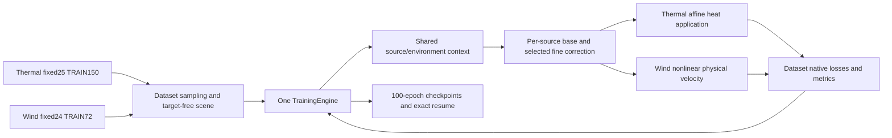

# Unified training and adaptive source-preserving interaction refinement

**Completed bounded development, 7–8 October 2026.** One real `TrainingEngine` now trains Thermal and Wind through the same contextualization and source-preserving refinement code. Every active source retains a cheap read; a reconstruction-trained receiver/source organizer adds selected fine corrections. Thermal retains heat-independent affine coefficients and precise heating application; Wind retains its nonlinear physical velocity readout and separate weights. Original all-fine execution remains recoverable. The optional predicted-flow Thermal fit is stopped, with its completed evidence preserved.

**Predictor:** both datasets completed one shared 500-new-epoch warmup and matched Full/Adaptive arms through 1000 and 2500 total-new epochs. Thermal’s selected Adaptive2000 field score improves matched Full2000 by 0.79%; its response-development guard passes, while Full’s field selector fails the guard and its response selector remains 800. Counted Adaptive heating-response errors nevertheless worsen 12.06%/25.22%/27.33% for fluid/surface/material versus the preserved parent. Wind Adaptive2500 improves matched Full’s field score 23.95% and near-turbine component RMS 14.96%, but v/w wake errors stall and the retained full-data reference remains much better under its different history. Keep useful Thermal prediction and the common workflow; classify Wind’s base predictor as not yet adequate for faithful wake work.

**Organizer:** the gates execute during learning and deployment, retain physical source IDs, protect near interactions and keep full environmental ancestry. Wind reduces active fine rows 51.87% across DEV24 and beats equal-row nearest/upstream/shuffle on both fixed native planes. Thermal’s fixed M10 learned route is worse than nearest on fluid/material fidelity and saves only 8.04% active fine rows. Complete M10 Thermal and M30 Wind calls are about 49% and 97% slower than matched Full at Q8192; deployed row savings do not establish sparse-training speed. Retain the measured Wind organizing signal as a research direction, defer deployment, and classify Thermal as a useful full model whose organizer is not yet useful.

**Inverse:** precise Thermal increments and heat VJPs, rebuilt local geometry AD/FD, guarded differentiable packet consumption and nonlinear Wind JVP/VJP are implemented and measured. They support reuse of forward interfaces; no observation fit, inverse generator, new design or independent finite Wind layout-response validation is completed.

**A/B/C:** A, added organizing value, is supported on the fixed Wind equal-work panels and mixed in Thermal; B, actual information flow, is verified by exported coarse/fine paths and removal/restoration interventions, including a harmful Wind correction; C, response generalization, remains limited by exposed stored families, Thermal amplitude/sign defects and absent independent Wind response labels. These are computational relevance results, not physical causal identification. Retain the source-resolved family and application repairs; the next bounded investment should address Wind transverse fidelity and measured hot-path overhead, while Thermal keeps its parent response reference. Neither dataset earns formal promotion in this round. No next fit is launched.

| Decision | Thermal fixed25 DEV22 | Wind fixed24 DEV24 |
| --- | --- | --- |
| Exact new fit age | Full2500 / Adaptive2500; shared warmup500 | Full2500 / Adaptive2500; shared warmup500 |
| Selected field checkpoint | Full2000 / Adaptive2000 | Full2500 / Adaptive2500 |
| Response selection | Full800 / Adaptive2000; counted transfer fails | No independent finite-response guard |
| Matched predictor gain | Adaptive field score0.79% lower | Adaptive field score23.95% lower |
| Organizing value | Mixed; nearest beats learned in M10 cost panel | Equal-work advantage on both fixed native planes |
| Complete Q8192 price | M10:14.167→21.048ms | M30:14.451→28.415ms |
| Retain / next decision | Useful full model; organizer not yet useful | Base predictor not yet adequate; retain organizing signal |
| Physical/inverse scope | Stored analytic-flow/shared-grid references; model-only local interface | Stored OpenFOAM references; model-only local interface |

## Executed model and workflow

Both adapters execute the same source/environment contextualization and the same `SourceRefinement` base/router. The common engine owns epoch visitation, deterministic query keys, macro-update denominators, backward/AdamW/clipping, absolute schedules, stage transitions, monitoring, checkpoint selection and exact resume. Dataset providers construct target-free scenes, sample supervision, apply their output laws and return native losses and metrics. There is no second dataset optimizer loop inside either provider. The [development guide](../guides/Unified_Interaction_Training_and_Refinement.md) describes the maintained interfaces, and the [manual full-data guide](../guides/Unified_Interaction_Manual_5000.md) gives existing prepare/dry-run/start/status/clean-stop/resume commands.

For each receiver q and physical source i, the executed interaction is `B(q,i) + g(q,i) [F(q,i) − B(q,i)]`. Unselected sources retain B and whole-scene contextual ancestry; they are not deleted or merged. Original near interactions remain fine. The all-base control therefore means coarse reads with original near support still protected, rather than a pure coarse read at every pair. Thermal refines heat-independent coefficients before separately contracting physical heating. Wind refines individual 64-dimensional messages before physical-measure source reduction and its nonlinear field head. Message norms are latent quantities, not physical velocity contributions. Environment records remain explicit contextual ancestry and are not independently sparsified.

The low-width base has width 16 and the router width 32. Wind uses one predeclared H64/message64 model with eight geometry-only environmental records. Thermal retains the qualified development R-direct architecture and inherits its fine parameters and 52 named AdamW moments. The router is initialized open; its target-free scene inputs exclude stored temperature, velocity and current heating. The initial all-fine warmup trains F with native objectives and B against detached F. The Adaptive arm trains its organizer during native reconstruction, with an open stage through 600, soft refinement through 800, hard deployment thereafter, a 25% all-fine replay contribution and one TRAIN-only expected-work calibration. Its training still pays for the full fine read. Deployed inference row savings therefore do not establish sparse-training savings.

The diagram shows executed software ownership. Thermal and Wind use different provider data, objectives, normalization and trained parameters; common code does not establish cross-dataset transfer.

## Selected physical evidence

### 1. What field do we predict?

Thermal DEV0291(M5), selected Full/Adaptive2000,4096 identical stored fluid receivers: unweighted temperature RMSE is 0.972512/0.973946 and maximum absolute residual3.54197/3.55062 in packed native temperature units, with shared physical scales and±2.85010 signed-residual display clipping at the combined 99th percentile. Both capture the broad heated plume but retain local amplitude errors; this unfavorable fixed analytic-flow/shared-grid example does not contradict the small weighted all 22 average gain. [PDF master](../../diagnostics/generated/unified_refinement_20261007/figures_1/final/native_fields_thermal_0291.pdf), [unclipped numerical source receipt](../../diagnostics/generated/unified_refinement_20261007/figures_1/final/native_fields_thermal_source.json).

Wind DEV row69(M8), WD270°, native z70.9m, selected Full/Adaptive2500: streamwise plane RMSE is 0.203706/0.196277m/s and maximum absolute error 1.60866/1.50293m/s, using identical stored receivers and shared physical/residual scales. Both reconstruct wakes, with a small Adaptive gain and substantial sharp near-turbine misses; the ±0.647783m/s residual display clips the combined extreme1% while metrics remain unclipped. [PDF master](../../diagnostics/generated/unified_refinement_20261007/figures_1/final/native_fields_wind_row69.pdf).

Wind DEV row426(M30), WD270°, native z70.9m, selected Full/Adaptive2500: streamwise plane RMSE is 0.356412/0.281635m/s and maximum absolute error 2.14885/1.66508m/s; the shared residual display uses±1.13374m/s with the same declared 1% clipping. Adaptive improves broad wake structure and reduces Full’s stripes, but neither faithfully resolves all local wake deficits. [PDF master](../../diagnostics/generated/unified_refinement_20261007/figures_1/final/native_fields_wind_row426.pdf), [unclipped figures’ numerical source receipt](../../diagnostics/generated/unified_refinement_20261007/figures_1/final/native_fields_wind_source.json).

On the same M30 plane, Adaptive v/w RMSE is 0.091498/0.009223m/s versus Full0.091956/0.010074; Adaptive maximum absolute v/w error is 1.14545/0.060462m/s. The nearly zero v prediction misses the local cross-stream structure, and w misses coherent patterns; whole-plane averages are smaller than the near-turbine role errors and cannot erase those misses. [PDF master](../../diagnostics/generated/unified_refinement_20261007/figures_1/final/native_fields_wind_row426_transverse.pdf).

### 2. Where does information actually travel?

Thermal DEV0291, Adaptive2000: all five physical donors remain present, with 192 environmental records in contextual ancestry. At native receiver 856, exactly joined to neural row1647, the protected-near-aware per-source fine correction contracted with nominal heating sums to 0.49041438 native temperature versus 0.49041367 in the full-minus-base field, an FP32 export discrepancy of 7.16e-7. Signed contributions are computational influence, including a negative contribution, and do not identify physical donors or causal transport. [PDF master](../../diagnostics/generated/unified_refinement_20261007/figures_2_3_4/final_selected_2500/figure2_thermal_interactions.pdf), [corrected export receipt](../../diagnostics/generated/unified_refinement_20261007/figures_2_3_4/final_selected_2500/thermal_export_correction_receipt.json).

Wind DEV426(M30), Adaptive2500: all 30 physical source IDs retain base paths; eight environment records project to four XY locations. At native receiver 49874, removal of selected source 10 changes velocity by 0.123m/s and improves the stored CFD vector error 0.21204→0.08906m/s; restoration returns 0.21204. This verifies an executed nonlinear information path and exposes a harmful correction. The figure's23.98/10.44ms comparison is core-only Adaptive.50/all-fine on the same Adaptive weights; complete matched-model timings appear in family5. [PDF master](../../diagnostics/generated/unified_refinement_20261007/figures_2_3_4/final_selected_2500/figure2_wind_interactions.pdf).

### 3. Does the receiver or scene change the route?

Thermal DEV0291, Adaptive2000, geometry-selected neural receiver rows 144/3222/17: the displayed receivers choose 1/5/4 fine donors while retaining all five physical IDs. Across the combined 3223-neural-receiver catalogue,15,316/16,115 active pairs are fine; receiver-specific variation therefore coexists with only 4.96% active fine savings on this representative. Selection uses inputs and trained gates; the graph is not an error-selected or physical-causality claim. [PDF master](../../diagnostics/generated/unified_refinement_20261007/figures_2_3_4/final_selected_2500/figure3_thermal_receiver_adaptation.pdf).

Wind fixed24 TRAIN layout 2(M23), direction rows 6/7 at 270°/285°, Adaptive2500: a measured15.00000012° coordinate rotation preserves source IDs and closes source/receiver XY to 7.52e-7/4.69e-7 rotor diameters. The displayed receiver selects 14/13 fine donors; all nine input-selected receivers pay63/207 and 64/207 active fine pairs. Their adaptive vector RMSE is 0.13152/0.10179m/s versus same-weight all-fine 0.20477/0.16336, with mixed individual residuals. These are previously exposed TRAIN illustrations of scene-dependent computation, not held-out Wind response generalization. [PDF master](../../diagnostics/generated/unified_refinement_20261007/figures_2_3_4/final_selected_2500/figure3_wind_scene_pair_adaptation.pdf).

### 4. What changes under an existing physical response?

Existing response-development families0320/0304, Adaptive2000: fluid increment RMSE is 0.058047/0.057116 native temperature for adaptive execution versus 0.058022/0.057378 with the same checkpoint's all-fine route. Each row shares stored receivers, physical response and residual scales. This is a route intervention on one set of weights; the matched Full2000 checkpoint is a different model. Broad signed response structure is captured, with coherent amplitude misses that the route barely changes. The four fixed families are ordered for presentation, with the larger errors on this page. [Two-page PDF master](../../diagnostics/generated/unified_refinement_20261007/figures_2_3_4/final_selected_2500/figure4_existing_response_change.pdf).

On the remaining fixed response-development families0350/0335, Adaptive2000 fluid increment RMSE is 0.045027/0.043040 versus same-weight all-fine 0.046237/0.043601 native temperature. These small improvements support limited route usefulness on already exposed responses; they do not establish transfer to new geometries or qualify inverse designs. [Saved family and source receipt](../../diagnostics/generated/unified_refinement_20261007/figures_2_3_4/final_selected_2500/figure_families_2_3_4_receipt.json).

Previously exposed counted0291 transfer-minus, selected Full/Adaptive2000: fixed geometry and heating transfer m4→m1,8192 stored queries and 7837 valid fluid-temperature rows. Unweighted response residual RMSE is 0.03023/0.02942 and maximum absolute error 0.10897/0.10735 native temperature, with identical query IDs, masks and shared scales. Both capture the signed plume but retain structured residuals. Across the primary counted directions the child responses worsen against the parent despite the DEV guard, as quantified below; this panel is neither a new solve nor a response-development selector. [PDF master](../../diagnostics/generated/unified_refinement_20261007/figures_2_3_4/final_selected_2500/figure4_counted_thermal_0291_transfer_minus.pdf), [saved-array receipt](../../diagnostics/generated/unified_refinement_20261007/figures_2_3_4/final_selected_2500/figure4_counted_thermal_0291_transfer_minus_receipt.json).

### 5. What is the price?

Thermal DEV0687(M10), selected Full/Adaptive2000, requested Q8192 plus 64 surface/32 material receivers per padded module: Adaptive.50 executes 31,432/34,180 active fine pairs(91.96%), costs 21.048 versus Full14.167ms, and allocates31.33 versus 35.25MiB; unweighted fluid/material RMSE is 0.785397/0.643173 versus equal-row nearest0.778169/0.551878. The modest row reduction misses the20% decision band and is slower; the.75 route halves active fine work but raises fluid RMSE to 1.061068, so this scene supplies an unfavorable frontier. [PDF master](../../diagnostics/generated/unified_refinement_20261007/figures_5/final/cost_thermal_native_frontier.pdf), [saved source](../../diagnostics/generated/unified_refinement_20261007/figures_5/final/cost_thermal_source.json).

Thermal factory/CUDA initialization/both checkpoint loading cost 4236.3/119.5/38.8ms; M10 Q8192 paid preparation plus 100 reads is 171.40/182.03ms for matched Full/Adaptive.50, while actual state-restored 48-case macro-update medians are 328.573/357.778ms. Q8192 samples with replacement from 4096 stored fluid receivers, yielding3594 distinct requested indices and 3418 combined neural grid receivers on this scene; all-active and learned bars share the complete guarded extraction/host-output scope, and the prepared read reuses bound coefficients. [PDF master](../../diagnostics/generated/unified_refinement_20261007/figures_5/final/cost_thermal_scopes.pdf), [complete native receipt](../../diagnostics/generated/unified_refinement_20261007/thermal_cost/thermal_complete_native_cost_receipt.json).

Wind DEV row426(M30), Q8192, selected Full/Adaptive2500: the learned.50 route executes 96,362/245,760 fine pairs(39.21%), gives near-turbine vector RMSE 0.461462m/s versus same-weight all-fine 0.522931 and equal-row nearest/upstream0.530521/0.496948, and costs 28.415ms versus matched Full14.451ms; peak allocated40.12 versus 35.62MiB, reserved226MiB for both. The organizer improves this fixed scene’s native error at fewer fine rows, but misses the complete-latency and memory target; this representative panel is not an all 24 estimate. [PDF master](../../diagnostics/generated/unified_refinement_20261007/figures_5/final/cost_wind_native_frontier.pdf), [saved source and normalized price rows](../../diagnostics/generated/unified_refinement_20261007/figures_5/final/cost_wind_source.json).

Actual Wind factory/TRAIN calibration costs 66.070s, native role catalogues cost 1.609/10.936s at M8/M30, and M30 Q8192 prepared100-read means are 10.895/24.590ms per call for matched Full/Adaptive.50; separately priced state-restored 24-case macro-update medians are 145.689/140.755ms. Prepared reads include ownership/input checks, receiver features, physical conversion and CPU output; the all-active bars deliberately retain their smaller core-only scope. Sparse deployed fine rows do not make full-replay training sparse, and initialization/catalogue costs must not be called repeated scene latency. [PDF master](../../diagnostics/generated/unified_refinement_20261007/figures_5/final/cost_wind_scopes.pdf), [complete native receipt](../../diagnostics/generated/unified_refinement_20261007/wind_cost/wind_complete_api_cost_receipt.json), [separate lower-level receipt](../../diagnostics/generated/unified_refinement_20261007/wind_cost/wind_native_cost_receipt.json).

### 6. Did the common workflow train both datasets?

Every arm reached2500 new epochs: Thermal lineages each visited 375,000 primary cases and made10,000 new updates, with 3626.55/3702.62 training-loop seconds for Full/Adaptive; Wind each visited 180,000 direction rows and made7500 updates, with 1587.95/1764.92 seconds. The same engine produces both curves, with shared warmup500 counted once in campaign totals; the full fine evaluations paid during organizer learning are visibly larger than deployed selected rows, and training-loop time includes sampling but excludes outer initialization, validation, saves and waits. [PDF master](../../diagnostics/generated/unified_refinement_20261007/figures/common_workflow_learning.pdf), [history-derived exposure receipt](../../diagnostics/generated/unified_refinement_20261007/figures/common_workflow_learning_source.json).

### Figure index

| Family | Question | Selected PDF masters |
| --- | --- | --- |
| 1 | Native fields and signed physical residuals | [Thermal0291](../../diagnostics/generated/unified_refinement_20261007/figures_1/final/native_fields_thermal_0291.pdf); Wind [M8](../../diagnostics/generated/unified_refinement_20261007/figures_1/final/native_fields_wind_row69.pdf), [M30](../../diagnostics/generated/unified_refinement_20261007/figures_1/final/native_fields_wind_row426.pdf), [transverse](../../diagnostics/generated/unified_refinement_20261007/figures_1/final/native_fields_wind_row426_transverse.pdf) |
| 2 | Actual source/base/fine/environment information paths | [Thermal](../../diagnostics/generated/unified_refinement_20261007/figures_2_3_4/final_selected_2500/figure2_thermal_interactions.pdf); [Wind](../../diagnostics/generated/unified_refinement_20261007/figures_2_3_4/final_selected_2500/figure2_wind_interactions.pdf) |
| 3 | Receiver and same-layout direction adaptation | [Thermal](../../diagnostics/generated/unified_refinement_20261007/figures_2_3_4/final_selected_2500/figure3_thermal_receiver_adaptation.pdf); [Wind](../../diagnostics/generated/unified_refinement_20261007/figures_2_3_4/final_selected_2500/figure3_wind_scene_pair_adaptation.pdf) |
| 4 | Stored responses, residuals and counted transfer | [Response-development, two pages](../../diagnostics/generated/unified_refinement_20261007/figures_2_3_4/final_selected_2500/figure4_existing_response_change.pdf); [counted0291](../../diagnostics/generated/unified_refinement_20261007/figures_2_3_4/final_selected_2500/figure4_counted_thermal_0291_transfer_minus.pdf) |
| 5 | Fidelity versus actual work and complete price | Thermal [frontier](../../diagnostics/generated/unified_refinement_20261007/figures_5/final/cost_thermal_native_frontier.pdf), [scopes](../../diagnostics/generated/unified_refinement_20261007/figures_5/final/cost_thermal_scopes.pdf); Wind [frontier](../../diagnostics/generated/unified_refinement_20261007/figures_5/final/cost_wind_native_frontier.pdf), [scopes](../../diagnostics/generated/unified_refinement_20261007/figures_5/final/cost_wind_scopes.pdf) |
| 6 | Common learning, exposure, updates and selected work | [Both datasets](../../diagnostics/generated/unified_refinement_20261007/figures/common_workflow_learning.pdf) |

## Appendix: fixed development identities and comparison scope

Thermal uses fixed25_v1 with 150 primary TRAIN cases and 22 exposed DEV cases, semantic SHA256 `933b0138ba2f8447a1ecadfe31fd0bb2cb4a05607d3ac3d9f0dc79419f196044`, seed 0, microbatch8/effective48 and four optimizer updates per complete epoch. The last macro-update contains six cases and uses its actual denominator. Its sealed native budget is 1024 fluid queries per case,16 surface and 32 material receivers per active module, and 128 discrete-operator rows per case; monitoring uses the same declared native role budget on all 22 DEV cases. The separate complete-cost matrix uses 64 surface receivers per padded module and explicitly prices that larger extraction scope. Four original-TRAIN fitted response addenda0001/0318/0333/0348 are distinct from response-development0304/0320/0335/0350 and the previously exposed counted audit. No development model is initialized from formal3902. The fine parent is the preserved development R-direct2500, SHA256 `05974d2fbc367bad8f2092063818ce9073c21783131753b3648fb3ea11a870aa`; the frozen development D-sep2500 flow binding is `914fe0b4e07c2b805a4f1df1e0d1e54a53180165d61349278acff05c335abdda`. Current thermal inference uses prescribed geometry only, with no target-flow or predicted-flow injection. Frozen flow roles are unchanged rather than newly learned by this fit.

Thermal normal-route fluid metrics apply the native nonuniform point weights within each case, then aggregate cases equally. Every native fixed25 DEV fluid point has finite temperature and positive weight: across90,112 points the magnitudes are 45,056×1,22,528×1.5 and 22,528×3. The saved sampled1024-per-case residual tails and representative4096-point maps are unweighted point summaries; they are different estimands from the weighted equal-case RMSE board. This distinction is explicit in the evaluator metadata and captions.

Wind uses wind_shared_fixed24_v1 with 24 TRAIN layouts/72 direction rows and eight exposed DEV layouts/24 direction rows, semantic SHA256 `b223e174d7262682a7e1ac1977cb38f721993e14c0340b2dc0f5fb5f95bfa715`, seed 42, microbatch4/effective24 and three updates per epoch. All 270°/285°/300° directions remain present for each selected layout. The frozen input-only selection omits the available TRAIN M18 category; it is not a full-population result. Normalization and the height profile are fitted on the selected TRAIN rows. The height profile is an empirical TRAIN-target-fitted background, not prescribed physical inflow. Each direction-row samples 1024 total native role queries:205 each for volume/hub/downstream/near-turbine and 204 background. The split and uncertainty grouping unit is the layout, not individual grid points.

Wind's five role-loss scales are inherited objective constants from the preserved Run2111 Stage-A configuration, SHA256 `102628bf3f03a6d1df8ef6eaf10c4d19aa231b689ae725d21b07049e89f3879e`; they were not freshly fitted from fixed24 targets. They are background0.00645346785, downstream0.02094316675, hub0.01664349329, near-turbine0.03333675447 and volume0.01018451709m/s. The fresh model's TRAIN-only pre-fit source-message RMS is 0.216244204059; it uses 12 direction rows from four fixed layouts and no target reads. The new eight-record environment differs from the actual 512-record default executed by the old H32 pilot; that historical receipt's eight-record description was incorrect. The preserved pilot factory constructs `WindFarmNativeView` without a token-shape override, so its data path uses `(16,8,4)`; the checkpoint does not serialize that count. The older pilot is therefore an unequal-architecture, unequal-environment and unequal-history contextual reference, not a routing ablation.

Both matched arms branch from one immutable literal 500-new-epoch checkpoint per dataset, preserving model tensors, optimizer moments, RNG and absolute query streams. Full and Adaptive have the same corresponding parameter learning rates and effective case/update budgets. Thermal fine learning rate warms3e-6→5e-5 during new epochs1–20, holds through 1000 and decays to 3e-6 by 2500; its new base/router uses 3e-4. Fresh Wind groups use3e-4 through 1000 and the same final endpoint. Shared warmup is counted once in campaign totals. Per-arm lineage totals include that common500; inherited Thermal fine/flow ages remain separately labelled. Equal epochs across datasets are not a fairness claim.

All 22/all 24 normal-route monitoring metrics come from the bound development panels. Detailed fields and same-weight interventions use only fixed representatives: Thermal 0277(M3)/0291(M5)/0294(M7)/0687(M10), and Wind DEV direction rows 69(M8)/426(M30), both270°. These scenes are selected by input geometry and membership, not error. Whole-panel normal metrics, fixed-scene controls, point residual tails and layout/case dispersion are different estimands. Literal1000 and 2500 are distinct from the field-only and Thermal response-guarded selectors. The guard admits at most10% mean response-development RMSE deterioration relative to the starting development parent, with fixed TRAIN near-zero floors; counted outcomes do not select checkpoints.

| Sealed one-time TRAIN calibration | Thermal | Wind |
| --- | ---: | ---: |
| Router parameters |737 |1025 |
| Native router gradient norm |0.00142742449 |20.44556767 |
| Unit expected-work gradient norm |0.60050836225 |0.77513233471 |
| Target work-gradient share |5% |5% |
| Uncapped coefficient |0.00011885134 |1.318843684 |
| Sealed coefficient; cap0.1 |0.00011885134 |0.1 |
| Actual work-gradient share |5.000% |0.37912% |

Thermal calibration uses TRAIN0006/0002/0348/0231 at the transition to 601, with epoch 600 sampling keys and no stored u/v calibration inputs. Wind calibration uses twelve direction rows from TRAIN layouts2/10/25/46 at the end of 600. Wind hits the predeclared coefficient cap and therefore does not achieve the target5% gradient share; the coefficient remains frozen rather than retuned from DEV. Neither calibration reads validation values.

The Wind model has 182,532 trainable parameters in65 named tensors, with a separate scalar `residual_scale` buffer. Fine/context has 177,667 parameters/52 tensors and base/readout3,840/9; their named AdamW steps are 7500 in both terminal arms. The router has 1025/4, no Full moments and Adaptive step 6000, matching its2000 post-warmup epochs×3 updates. Counting the buffer as a parameter would incorrectly give182,533/66.

Thermal has 205,244 trainable parameters in 65 named tensors: fine/context 202,026 in 52, base 2,481 in nine, and router 737 in four; the residual-scale buffer adds one state tensor and one scalar. Literal Full 2500 preserves the fine parent’s 10,000 AdamW steps and adds 10,000 new updates, giving fine step 20,000; base tensors reach step 10,000, while the Full router has no optimizer state. Adaptive has the same fine/base ages and router step 8000. The fine predictor’s accumulated training history is parent2500 plus new 2500, and the separately frozen D-sep flow remains at 2500. New base/router ages and inherited fine/flow ages are distinct histories. Each Thermal lineage visits375,000 cases and executes 10,000 new updates; summing both arms with the shared warmup counted once gives 675,000 visits and 18,000 new updates. Wind lineages each visit180,000 direction rows and execute7,500 updates; its corresponding campaign total is 324,000 visits and 13,500 updates.

The independent [Thermal matched-history closeout](../../diagnostics/generated/unified_refinement_20261007/accounting/thermal_matched_history_closeout_receipt.json) verifies every501–2500 branch row: identical case/query hashes and corresponding learning rates,150 visits/four updates/19 microbatches per epoch, a final six-case macro-update, and matching100-open/200-soft/1700-hard stages. The common engine checks each observed summed loss denominator against the target-only macro prepass before stepping. Recorded `train_losses` are equal means of update-normalized losses, so the six-case update has the same display weight as a48-case update; those logged summaries are not case-weighted epoch means. The reported predictor boards use the separately defined native validation estimands.

## Appendix: contracts and bounded correctness repair

Retained Thermal all-fine outputs, heat/geometry VJPs and the four fixed DEV outputs were bitwise identical in the actual GPU0 compatibility preflight. A real complete150-case development epoch visited 19 microbatches and performed four updates, with finite reconstruction/response/operator/base objectives. Exact two-epoch/resumed common-engine Wind weights, counters, case order and query sampling matched bitwise on real native data. These checks establish implementation compatibility and lifecycle correctness, not mature scientific fidelity.

The first Thermal 100→500 resume exposed a metadata bug: a digest of nested AdamW state used NumPy object-array bytes, which included process-dependent pointers. The repair hashes nested state recursively with typed, sorted content while preserving the existing flat normalization digest. The original e100 artifacts were backed up locally; only the bad nested moment identity metadata was migrated after exact recursive comparison of weights, moments, RNG, sampler/history and counters. No weights or optimizer age changed. The migrated e100 then resumed under the strict identity check. Failed GPU-visible launches, including a base-Python CUDA incompatibility and the rejected digest resume, are charged in the final resource ledger.

Final lifecycle review reproduced three code gaps on CPU: an older same-identity checkpoint could rewind an output’s history, `start` could overwrite an existing run, and a failed fit could leave a stale running receipt. The common engine now requires the current latest checkpoint for exact resume, rejects existing history on a new start, holds a process-owned output lock and writes failure/PID/start-identity receipts. Status checks process liveness without changing historical receipts; repeated clean-stop preserves the pending request. These safeguards change lifecycle behavior, not predictor weights, losses, schedules, membership or optimizer clocks, and the already loaded running fit was not restarted.

The packet path compiles physical source/receiver joins and masks at a request boundary, then executes tensorized consumption with row-local fail-closed fallback. Unsupported rows use full reads; qualified rows keep their own packet route. A separate fixed-route consumer retains autograd and precise contraction, while the historical value-only helper remains identifiable. Mutation/replacement of geometry, source order, receiver support, parameters, fixed masks, unit metadata or normalization invalidates the prepared ownership binding. Wind normalization mutation was reproduced before repair: changing the mean by 0.25 silently shifted physical u by 2.25m/s and still allowed linearization. The maintained adapter now binds transform identity, scalar values, array contents/dtypes/shapes and background-profile ownership, and rejects stale endpoint/linearization use.

The balanced-action packet guard now computes the balance check in float64 and caps inferred roundoff at float32 precision for float16/bfloat16 inputs. A reproduced bfloat16 action with a 2.5% net contribution previously passed through an inflated dtype tolerance; the value and compiled consumers now refuse that qualified route and retain full-access fallback. The same check also rejects a 2.564% imbalance at tiny action scales using relative L1 roundoff, while retaining explicitly declared absolute slack; valid float32/float64 balanced allocations remain accepted. This is a guard repair with no checkpoint or fit change.

The native compiled-packet GPU0 prototype used the preserved historical R-geom1200/scorer without refitting. On TRAIN0097(M4)/0231(M12), Q8192, row-local oracle/compiled guarded medians were657.5/19.7ms and 699.7/19.7ms. The masks matched; FP32 rebatching gave maximum output differences8.3e-9–1.76e-7 and factor differences2.98e-7–2.15e-6, so this is tolerance-compatible rather than bitwise identity. Active-pair omissions were only about 4.6–5.2%; most of the execution improvement is compilation and padding/fallback handling. Historical global fallback has different semantics and is reported separately. This engineering result does not certify the new task-trained organizer's scientific frontier.

## Appendix: physical-reference, inverse and history boundaries

Thermal reference fields are stored analytic-flow/shared-grid benchmark outputs in packed native units. They are not newly solved independent CFD. The counted panel contains11 existing states in four fixed families; the failed0277 baseline is not fabricated, and only its qualified minus/plus span can be compared. Existing geometry perturbations are a challenge panel with prior exposure, not independent new-geometry validation. Negative single-heater coefficient norms and nominal negative contribution mass are measured without clipping; valid signed balanced transfers are distinguished from conditional positive single-heater response assumptions. Wind references are stored OpenFOAM fields in m/s; no independent finite Wind layout-response labels are supplied.

The inverse-facing demonstration uses six geometry-selected observed receivers and three held receivers, precise fixed-route Thermal endpoints/increments/heat VJPs and local Wind physical JVP/VJP. Geometry derivatives rebuild context and exact baseline, compare AD with finite differences only under unchanged route/protection, and report transitions. Wind’s nonlinear readout rejects exact affine increment requests; only its declared local AD/JVP/VJP capability applies. These are reusable software interfaces and model-only perturbations. No observation fit, denoiser, inverse generator, recovered-design claim or new physical solve is executed.

Wind selected 2500 local center JVP/VJP dot products close to 9.09e-11 absolute at fixed DEV M8 and 8.73e-11 at M30, as recorded in the selected native summary. This is an AD consistency check under a fixed hard route, not a finite-difference or physical-layout-response validation. Correction removal is genuinely executed and restored: at M8 q26122, removing source 6 increases CFD vector error 0.36127→0.41832m/s; at M30 q49874, removing source 10 reduces error 0.21204→0.08906m/s, and restoring returns 0.21204. The latter selected correction harms local physical fidelity, so a live information path is not uniformly useful and is not physical causal identification.

The same-layout Wind illustration uses fixed24 TRAIN rows 6/7 of layout 2(M23), WD270°/285°, with physical source IDs0–22 retained. The fitted15.00000012° CCW coordinate map closes to 7.519e-7D for source XY and 4.693e-7D for nine mapped receiver XY coordinates. Nine-point all-fine/all-base/adaptive vector RMSE is 0.20477/0.40986/0.13152m/s at row6 and 0.16336/0.32306/0.10179 at row7; all-nine executed fine rows are 63/207 and 64/207, whereas the displayed q4 receiver selects 14/13 IDs. This input-only receiver illustration reads stored CFD only after prediction and contributes no DEV population statistic.

Completed formal3901/3902, classics, development parents, old children, response records and histories remain protected. The solver allowance remains 326/326. Manual5000 capability checks are CUDA-hidden metadata-only preparation/dry-run, not full-data transform fitting, formal optimizer startup or a startup benchmark. Any future formal model uses a new full-data binding, fresh fine/base/router weights and moments, and the actual common runner. The commands do not silently promote quarter-data checkpoints.

All generated maps, arrays, timing receipts, one-off renderers and checkpoints remain in ignored local evidence directories. Durable code, focused tests, guides and this report are the push scope. The full outgoing history is audited, including files added and subsequently deleted, before the repository pre-push artifact gate and remote-tip verification.

## Appendix: Wind native development measurements

These are normal-route equal-direction-row statistics on all 24 exposed fixed24 DEV rows, grouped into eight layouts. Each row has 1024 native role queries and physical units m/s. Component RMS here is the per-row root mean square across u/v/w errors, subsequently averaged across rows; vector RMSE and individual component means are separately exported. The field score is the inherited role-scaled objective and has no physical unit. Both field selectors chose literal 2500; they do not introduce a second checkpoint age.

| Arm / total-new epoch | Field score | Volume component RMS | Hub | Downstream | Near turbine | Background |
| --- | ---: | ---: | ---: | ---: | ---: | ---: |
| Full /1000 | 97.306848 | 0.094152 | 0.201708 | 0.205991 | 0.372845 | 0.036715 |
| Adaptive /1000 | 77.899246 | 0.083744 | 0.177351 | 0.183381 | 0.330602 | 0.037251 |
| Full /2500 | 51.470915 | 0.069906 | 0.142774 | 0.151072 | 0.262693 | 0.030628 |
| Adaptive /2500 | 39.142407 | 0.061310 | 0.122854 | 0.132784 | 0.223384 | 0.028779 |

| Literal2500 arm / role | Mean u /v /w RMSE (m/s) | Row p95 u /v /w | Worst u /v /w | Mean vector RMSE |
| --- | --- | --- | --- | ---: |
| Full /volume | 0.105561 /0.039007 /0.028712 | 0.152671 /0.060286 /0.050410 | 0.178206 /0.080211 /0.051596 | 0.117444 |
| Full /hub_slab | 0.216122 /0.079187 /0.059395 | 0.313574 /0.110396 /0.108032 | 0.347042 /0.115503 /0.120010 | 0.239831 |
| Full /downstream_envelope | 0.233942 /0.084932 /0.061191 | 0.306690 /0.107375 /0.089215 | 0.378300 /0.135426 /0.096904 | 0.257874 |
| Full /near_turbine | 0.375024 /0.203697 /0.133533 | 0.518640 /0.233885 /0.159746 | 0.554483 /0.243854 /0.169736 | 0.449851 |
| Full /background | 0.042992 /0.018336 /0.019488 | 0.053978 /0.026596 /0.037124 | 0.054801 /0.032779 /0.075941 | 0.051826 |
| Adaptive /volume | 0.090288 /0.039085 /0.028525 | 0.128875 /0.060040 /0.050195 | 0.146210 /0.080645 /0.051725 | 0.103806 |
| Adaptive /hub_slab | 0.179254 /0.079019 /0.059470 | 0.261518 /0.110732 /0.108750 | 0.275089 /0.115619 /0.119895 | 0.206859 |
| Adaptive /downstream_envelope | 0.200748 /0.084746 /0.061137 | 0.255364 /0.107124 /0.089051 | 0.289650 /0.135273 /0.096660 | 0.227896 |
| Adaptive /near_turbine | 0.294542 /0.204068 /0.133769 | 0.393356 /0.234881 /0.159943 | 0.397002 /0.244227 /0.169290 | 0.384605 |
| Adaptive /background | 0.039102 /0.018296 /0.019206 | 0.048346 /0.026237 /0.036532 | 0.056498 /0.032507 /0.076041 | 0.048478 |

| DEV layout / M | Full near component RMS | Adaptive near component RMS | Adaptive volume component RMS |
| --- | ---: | ---: | ---: |
| 23 /8 | 0.241112 | 0.225412 | 0.052724 |
| 42 /21 | 0.237345 | 0.207555 | 0.056378 |
| 43 /13 | 0.236928 | 0.207605 | 0.056190 |
| 57 /27 | 0.306151 | 0.244203 | 0.069613 |
| 142 /30 | 0.335745 | 0.268271 | 0.074993 |
| 154 /18 | 0.250423 | 0.206716 | 0.057936 |
| 160 /11 | 0.219879 | 0.197869 | 0.041975 |
| 182 /24 | 0.250187 | 0.218785 | 0.069650 |

The Adaptive field score is 23.95% below matched Full at 2500. Near-turbine component RMS falls to 0.223384m/s, about 2.02 times lower than the previous pilot’s0.451953m/s, but remains 5.08 times the retained0.043943m/s same-role contextual reference. The previous pilot and retained model have different architectures, environment records, histories and query protocols; this is directional context rather than a matched ranking. Most near-turbine improvement is in u: Adaptive2500 u/v/w means are 0.294542/0.204068/0.133769m/s, while shared warmup500 gave0.743418/0.205320/0.135689. Transverse v/w error barely moves. The actual warmup100 values were0.848714/0.208102/0.136964; the e500 numbers must not be attributed to e100.

The preserved preceding native-plane evaluation also reports retained-reference u/v/w RMSE 0.025785/0.004654/0.001212m/s at M8 and 0.036856/0.007931/0.001729 at M30. On those same stored z70.9m planes, new Adaptive streamwise RMSE 0.196277/0.281635 is about 7.61/7.64 times the retained value; its transverse errors remain large as well. These reused historical measurements strengthen the warning about wake fidelity, but their full-data model/history and environment differ from the new fixed24 arms. They are contextual evidence, not a fair routing ablation.

The retained Run2103 reference has selected epoch 2475, history2500,67500 updates, batch16, Qtrain8192,512 environment records and the420/90/90 full split. Its old full-volume32768-query equal-case u/v/w means0.018126/0.003423/0.003073m/s are a different estimand from the near-role figures. The frozen TRAIN-fitted height profile scores403.001 on the present DEV24 panel; beating it does not demonstrate sharp wake fidelity.

| Selected2500 arm / role | Pooled vector RMSE (m/s) | Vector-error p95 | p99 | Maximum |
| --- | ---: | ---: | ---: | ---: |
| full /volume | 0.121080 | 0.233701 | 0.511209 | 2.009338 |
| full /hub_slab | 0.247292 | 0.495271 | 0.928723 | 2.211774 |
| full /downstream_envelope | 0.261664 | 0.516183 | 0.840099 | 1.924829 |
| full /near_turbine | 0.454998 | 0.936838 | 1.404637 | 2.141186 |
| full /background | 0.053050 | 0.102225 | 0.186994 | 1.075863 |
| adaptive /volume | 0.106193 | 0.203130 | 0.428879 | 1.769482 |
| adaptive /hub_slab | 0.212790 | 0.427147 | 0.783766 | 2.181063 |
| adaptive /downstream_envelope | 0.229988 | 0.458457 | 0.758874 | 1.391278 |
| adaptive /near_turbine | 0.386913 | 0.773472 | 1.206049 | 1.975363 |
| adaptive /background | 0.049846 | 0.089073 | 0.172846 | 1.081359 |

These pooled point residual tails use the fresh all 24 selected-checkpoint normal route and differ from the equal-row means above. Adaptive executes 224,747 fine rows of 466,944 active source/receiver pairs(48.13%); its cheap/gate paths execute577,536 padded rows, and 29,193 original near pairs remain protected. Padded full fine work is 577,536 rows, so its61.09% reduction relative to that full implementation contains padding removal as well as51.87% active fine-detail reduction. Environmental context remains full. The raw all 24 rows, component tails, exact input/checkpoint identities and representative arrays are bound by the [selected Adaptive summary](../../diagnostics/generated/unified_refinement_20261007/evaluation/wind/selected_adaptive/evaluation_summary.json) and [selected Full summary](../../diagnostics/generated/unified_refinement_20261007/evaluation/wind/selected_full/evaluation_summary.json).

## Appendix: complete Wind cost and matched-work controls

| Scene / native role queries | Matched Full ms | Adaptive .50 ms | Active fine fraction | Full / Adaptive allocated MiB |
| --- | ---: | ---: | ---: | ---: |
| M8 / Q1024 | 5.982 | 7.883 | 49.15% | 17.100 / 17.453 |
| M8 / Q8192 | 14.391 | 28.048 | 48.18% | 17.456 / 18.399 |
| M30 / Q1024 | 5.960 | 7.962 | 38.40% | 34.637 / 34.841 |
| M30 / Q8192 | 14.451 | 28.415 | 39.21% | 35.617 / 40.121 |

These five alternating complete calls include `prepare_case`, stale-input/weight/transform guards, source/environment context, receiver features, actual fine/base/router work, physical velocity conversion and requested CPU output. CUDA reserved memory is 226 MiB at the M30/Q8192 comparison; allocator peaks are distinct from process residency. Static native catalogues and one-time factory/calibration are paid separately. The .50 operating point was sealed before DEV; .25/.75 are predeclared same-weight numerical controls rather than additional fits.

| Fixed native plane | Learned .50 | Nearest, equal rows | Upstream, equal rows | Shuffle, equal rows | Actual fine / active pairs | Protected near pairs |
| --- | ---: | ---: | ---: | ---: | ---: | ---: |
| M8 / DEV row69 | 0.208596 | 0.272782 | 0.257718 | 0.311855 | 89,787 / 420,384 | 25,926 |
| M30 / DEV row426 | 0.296268 | 0.350726 | 0.338058 | 0.422204 | 664,274 / 2,992,500 | 97,412 |

The plane values are vector RMSE in m/s at the selected Adaptive 2500 weights. Every control has exactly the same number of fine rows and the same protected near pairs within its scene; omitted fine pairs retain the cheap source read. The learned route outperforms these three controls on both fixed planes, supporting receiver-specific organizing value on these representatives. This is neither an all 24 route-control result nor a physical-causality claim; the fresh cost panel has separately sampled role queries and must not be mixed with these plane metrics.

## Appendix: complete physical derivative prices and residency

| Wind scene / input | Operation | Matched Full ms | Adaptive .50 ms |
| --- | --- | ---: | ---: |
| M8 / centers | JVP | 15.927 | 22.132 |
| M8 / centers | VJP | 11.041 | 12.913 |
| M8 / receivers | JVP | 10.629 | 13.621 |
| M8 / receivers | VJP | 8.794 | 11.193 |
| M30 / centers | JVP | 17.656 | 19.527 |
| M30 / centers | VJP | 10.806 | 14.776 |
| M30 / receivers | JVP | 11.221 | 14.391 |
| M30 / receivers | VJP | 8.465 | 10.586 |

These are five alternating matched prices per cell at both selected 2500 checkpoints, using nine input-only receivers hash-bound to the first nine coordinates of the frozen Q1024 role panel. Every timed call pays `prepare_case`, rebuilt source/environment context, physical input support, required guards, deployed hard-route computation, physical normalization/background transformation, the requested local AD operation and CPU derivative output. Center/receiver inputs are in rotor diameters D; outputs are physical m/s and derivative units follow those inputs. The hard route is piecewise fixed for AD; no finite layout response or physical validation is inferred. All 80 calls are finite and both checkpoint files retain their exact SHA256. Catalogue construction, pre-fit calibration, checkpoint loading and warmups are separately charged in the85.053-second outer process.

Own-PID samples taken outside the timed calls report GPU process residency 732–740 MiB, host RSS 3004.3–3175.3 MiB and PSS 2876.8–3042.4 MiB. These are snapshots from one reused process with both checkpoint payloads and native catalogues resident, not per-route peaks or an exclusive model-footprint claim. CUDA allocated/reserved peaks remain separate fields for every operation. No target value, optimizer update or solver call is used. The [complete derivative and residency receipt](../../diagnostics/generated/unified_refinement_20261007/wind_cost/wind_complete_derivative_cost_receipt.json) preserves raw repeats, input hashes, transform binding, timing and memory scope.

## Appendix: Thermal native development measurements

These are saved normal-route monitoring results on all 22 exposed fixed25 DEV cases at 1024 fluid,16 surface and 32 material queries per active module. Fluid RMSE is natively weighted within cases; the board averages cases equally, with case p90 separately stated. Temperatures use packed benchmark native units, q proxy has its packed native definition, and module-peak error is over the fixed32 material samples per module, not a guaranteed continuous or full-grid maximum. All per-case values and identities remain in the [monitor board](../../diagnostics/generated/unified_refinement_20261007/accounting/thermal_native_monitor_board.json).

| Arm / new epoch and selection | Field score | Fluid mean / p90 | Surface mean / p90 | Material mean / p90 | Sampled module peak mean / p90 | Response DEV max ratio |
| --- | ---: | --- | --- | --- | --- | ---: |
| Full / 800; guarded | 0.009149541 | 0.763174 / 1.135417 | 0.696067 / 1.144176 | 0.692199 / 1.046648 | 0.797238 / 1.190085 | 1.050802 |
| Full / 1000 | 0.009547948 | 0.769932 / 1.165795 | 0.715788 / 1.168422 | 0.695761 / 1.007220 | 0.811984 / 1.239752 | 1.038263 |
| Full / 2000; field | 0.009127038 | 0.740531 / 1.065147 | 0.701164 / 1.178248 | 0.695657 / 1.004491 | 0.811488 / 1.221039 | 1.110251 |
| Full / 2500 | 0.009203226 | 0.739384 / 1.064871 | 0.704998 / 1.168396 | 0.696720 / 1.044973 | 0.817112 / 1.178091 | 1.122313 |
| Adaptive / 1000 | 0.009459022 | 0.765819 / 1.175583 | 0.710295 / 1.187100 | 0.697472 / 1.007609 | 0.811545 / 1.242096 | 1.029539 |
| Adaptive / 2000; field; guarded | 0.009054906 | 0.736275 / 1.051349 | 0.698966 / 1.176813 | 0.689894 / 0.994171 | 0.801684 / 1.222868 | 1.077443 |
| Adaptive / 2500 | 0.009092943 | 0.734163 / 1.065144 | 0.700123 / 1.141288 | 0.691294 / 1.037508 | 0.808482 / 1.184349 | 1.087265 |

Both field selectors choose 2000; Adaptive score 0.009054906 improves matched Full0.009127038 by 0.79%, with weighted fluid RMSE 0.736275 versus 0.740531. Fullfield2000 exceeds the declared 1.10 response-development guard at 1.11025, so its response-use selector remains 800; Adaptive2000 qualifies at 1.07744 and literal 2500 also qualifies at 1.08727, but has a higher field score. Selector identities are sealed before counted replay and are not selected using counted-audit outcomes.

## Appendix: complete Thermal cost and work controls

| DEV scene / requested fluid Q | Matched Full ms | Adaptive .50 ms | Active fine / active pairs | Full / Adaptive allocated MiB | Full / Adaptive complete precise heat VJP ms |
| --- | ---: | ---: | --- | --- | --- |
| 0277 M3 / 1024 | 11.031 | 13.932 | 2,922 / 3,195 | 24.251 / 13.435 | 12.343 / 15.183 |
| 0277 M3 / 8192 | 12.636 | 17.336 | 6,683 / 7,191 | 34.559 / 22.598 | 14.104 / 19.432 |
| 0687 M10 / 1024 | 11.727 | 16.129 | 16,559 / 17,750 | 35.105 / 30.143 | 13.560 / 16.884 |
| 0687 M10 / 8192 | 14.167 | 21.048 | 31,432 / 34,180 | 35.248 / 31.329 | 14.910 / 23.065 |

These five alternating repetitions use selected Full/Adaptive2000 with identical requested query indices. The complete call includes stale-state/input checks, source/environment context, target-free route, shared-grid coefficient prediction, native64-surface/32-material extraction and CPU output. Heating is applied separately; complete precise heat VJPs rebuild that path with float64 heating and accumulation for the sum of mean requested fluid temperature and mean active-module surface temperature. Targets join only after prediction. Original all-fine dispatch and the forced all-active refinement control are separately priced; the latter still pays cheap/gate overhead and can differ at FP32 rebatching tolerance.

At M10/Q8192, native neural grid deduplication gives 3418 receivers; full pays 41,016 padded fine rows, all-active pays 34,180 fine rows, and learned.50 pays 31,432. Cheap/gate work remains 41,016 rows; two context rounds retain 12 source slots and 192 environment slots, with 144 source/source and 2304 source/environment padded pairs per round. These counts distinguish genuine active fine savings from padding removal. The.50 route reduces active fine work8.04%, complete latency rises48.57%, and nearest equal-work improves fluid/material accuracy on this representative; the.75 operating point reduces active fine work49.59% but worsens native fluid/surface/material/q errors. No automatic retuning or new fit follows this failure.

The state-restored 48-case native update includes reconstruction, response and operator objectives, full fine replay, cheap approximation/router work, backward, clipping and AdamW at declared absolute schedule1000. Its six disposable updates per arm retain no optimizer change; five timed repeats after the first have medians 328.573/357.778ms, excluding query sampling and state restoration. Own-process residency after these reads/updates is 1746MiB and host peak RSS1729.81MiB, a reused-process snapshot rather than a per-route footprint; allocated/reserved operation peaks are separately stored. Both checkpoint SHA256 values remain unchanged, and the complete process finishes in48.559s with zero solves.

## Appendix: unclipped Thermal coefficient signs

| Selected arm / TRAIN case and M | Negative coefficients / all | Negative L2 / total L2 | Negative nominal heat-contribution mass | Fraction of absolute contribution mass |
| --- | --- | ---: | ---: | ---: |
| full_detail e2000 / 0006 M1 | 2,374 / 8,121 | 3.804% | 250.739 | 3.175% |
| full_detail e2000 / 0097 M4 | 11,292 / 31,592 | 3.923% | 1515.892 | 4.738% |
| full_detail e2000 / 0337 M7 | 14,888 / 53,830 | 5.650% | 2135.869 | 4.225% |
| full_detail e2000 / 0231 M12 | 29,128 / 87,888 | 6.513% | 5101.422 | 5.696% |
| adaptive_detail e2000 / 0006 M1 | 2,362 / 8,121 | 3.830% | 252.645 | 3.186% |
| adaptive_detail e2000 / 0097 M4 | 11,069 / 31,592 | 3.756% | 1374.452 | 4.330% |
| adaptive_detail e2000 / 0337 M7 | 16,851 / 53,830 | 5.394% | 1990.123 | 3.990% |
| adaptive_detail e2000 / 0231 M12 | 29,133 / 87,888 | 5.884% | 4232.925 | 4.806% |

This four-case fixed TRAIN audit uses original source IDs, native extracted fluid/surface/material coefficients, nominal heating and selected 2000 checkpoints. It audits Full in all-fine mode and Adaptive in its deployed route, with no clipping; raw near/far counts and coefficient magnitude quantiles remain in the [sign receipt](../../diagnostics/generated/unified_refinement_20261007/accounting/sign_audit_selected2000.json). Negative norm shares of 3.76–6.51% are not merely roundoff. The stored steady stencil has no positive off-diagonal entries or negative diagonal entries, nonnegative forcing columns and near-zero row-sum defects up to 2.38e-6; those qualified steady-generator conditions do not establish the same positivity claim for every finite-time benchmark field. Signed balanced heating transfers can be valid even when a positive single-heater coefficient is physically expected under the qualified assumptions. Keep the parent response reference and investigate a separately qualified head before treating these terms as identified physical donor columns; no positivity-head portfolio was launched.

## Appendix: selected Thermal tails, native work and local derivatives

| Adaptive2000 normal DEV22 role | Pooled rows | Unweighted RMSE | Absolute p95 | p99 | Maximum |
| --- | ---: | ---: | ---: | ---: | ---: |
| downstream/temperature | 4,267 | 0.894925 | 1.843791 | 2.455057 | 3.107393 |
| fluid_temperature | 22,528 | 0.783003 | 1.675563 | 2.503007 | 4.156758 |
| interface | 2,080 | 0.811634 | 1.783827 | 2.674868 | 3.626278 |
| material_temperature | 4,160 | 0.785523 | 1.745911 | 2.520188 | 3.383716 |
| near/temperature | 10,419 | 0.805452 | 1.750263 | 2.664412 | 4.156758 |

These fresh selected-checkpoint normal-route tails pool points without native point-weight magnitudes, with geometry-defined near/downstream regions. They remain exposed DEV evidence; fluid22×1024 samples,2080 surface samples and 4160 material samples have different supports from the native full-grid representative exports. Raw all 22 case results, module-count dispersion, work and coordinate/data bindings remain in the [selected Adaptive summary](../../diagnostics/generated/unified_refinement_20261007/evaluation/thermal_adaptive_selected_2500/thermal/adaptive_selected2000/evaluation_summary.json) and [selected Full summary](../../diagnostics/generated/unified_refinement_20261007/evaluation/thermal_final_selected_2500/thermal/full_field2000/evaluation_summary.json).

| Fixed Thermal representative | Precise increment max closure error | Heat VJP versus coefficient max error |
| --- | ---: | ---: |
| 0277 M3 | 1.89e-15 | 0 |
| 0291 M5 | 4.02e-15 | 0 |
| 0294 M7 | 4.36e-15 | 0 |
| 0687 M10 | 1.35e-14 | 0 |

A geometry-selected six-observed/three-held receiver interface is exported alongside the model-only 1% single-source heating increment check; observations are not optimized. Float64 endpoint differences close to directly contracted increments within1.35e-14, heat VJPs equal the extracted kernel exactly, zero heating gives zero temperature, and changing heat leaves prepared coefficients unchanged. Frozen D-sep is heat independent and no predicted or target flow enters thermal preparation. These establish affine software contracts rather than physically accurate response amplitudes or inverse designs.

At DEV0291, moving source ID0 in x by±0.00045 native units rebuilds source/environment context, native receiver maps, baseline and route. The complete route and near-protection masks remain unchanged at both endpoints: AD0.2757006 versus central FD0.2754083 gives 0.1060% relative difference. This single local float32 geometry check is qualified away from route transitions; the evaluator tests and records transitions rather than presenting a discrete gate switch as a smooth derivative. Wind’s separate local physical AD checks have their own nonlinear semantics and lack independent finite-layout labels.

| Fixed Thermal native scene | Learned .50 fluid RMSE | Nearest equal rows | Upstream equal rows | Shuffle equal rows | Fine / active neural-grid pairs | Protected near pairs |
| --- | ---: | ---: | ---: | ---: | --- | ---: |
| 0277 M3 | 0.368624 | 0.375391 | 0.375355 | 0.378046 | 7,542 / 8,115 | 2,047 |
| 0291 M5 | 0.973946 | 0.973700 | 0.974186 | 0.972680 | 15,316 / 16,115 | 3,763 |
| 0294 M7 | 0.605880 | 0.605759 | 0.612656 | 0.652298 | 22,787 / 24,850 | 4,701 |
| 0687 M10 | 0.778227 | 0.770817 | 0.790331 | 0.818522 | 37,587 / 40,770 | 7,414 |

These selected Adaptive2000 controls use4096 native fluid receivers,16 surface receivers per module and all 3096 native material receivers per module; their quoted work covers the resulting deduplicated combined neural grid. Each learned/geometry/shuffle comparison keeps exactly the same fine count and original near support for its scene. This differs from the complete-cost 32-material/64-surface scope, and the learned route does not consistently beat geometry in Thermal. Normal all 22 selected inference pays 208,089 fine rows over236,804 active pairs(12.13% reduction), with 309,092 padded cheap/gate rows and 47,732 protected near pairs; environmental context remains full.

## Appendix: counted Thermal heating responses and guard transfer

The four existing counted families contain11 stored states:0291/0294/0687 each have baseline and signed transfer endpoints;0277 has only the valid minus/plus pair, while its failed baseline stays absent. All four checkpoint summaries share the same physical query/role IDs, quadrature, source IDs, directions, stored references and request fingerprint. This audit was previously exposed; it is distinct from fitted TRAIN addenda and response-development selection. Inputs contain only declared geometry/material/boundary, query metadata and physical heating; stored role values join after predictions. The [counted index](../../diagnostics/generated/unified_refinement_20261007/evaluation/thermal_counted_selected_2000_rerun2/evaluation_index.json) links the full arrays and comparisons.

| Model / literal selected age | Primary fluid T mean RMSE | Surface T | q-normal proxy | Solid T |
| --- | ---: | ---: | ---: | ---: |
| r_direct_parent2500 | 0.01158726 | 0.01486770 | 0.04388496 | 0.01676723 |
| full_guard800 | 0.01234838 | 0.01669990 | 0.04582964 | 0.01919122 |
| full_field2000 | 0.01341834 | 0.01884515 | 0.04928735 | 0.02150900 |
| adaptive_selected2000 | 0.01298437 | 0.01861798 | 0.04898269 | 0.02134908 |

The primary board averages six baseline-relative signed directions across three complete families, using each role’s native quadrature-weighted RMSE; q-normal retains its distinct packed proxy unit. Relative to parent, Fullguard800 worsens fluid/surface/q/solid by 6.57%/12.32%/4.43%/14.46%; Fullfield2000 by 15.80%/26.75%/12.31%/28.28%; Adaptive2000 by 12.06%/25.22%/11.62%/27.33%. The four-family response-development guard limits do not transfer to this exposed counted cohort, and even the guarded Full800 does not preserve parent response fidelity. Keep the original R-direct response reference; neither selector is a physical certificate.

| Secondary0277 minus-to-plus span | Fluid T RMSE | Surface T | q-normal proxy | Solid T |
| --- | ---: | ---: | ---: | ---: |
| r_direct_parent2500 | 0.02223494 | 0.02113667 | 0.11589774 | 0.02537465 |
| full_guard800 | 0.02074940 | 0.02253659 | 0.11680647 | 0.02727137 |
| full_field2000 | 0.01963530 | 0.02362489 | 0.12012880 | 0.02798682 |
| adaptive_selected2000 | 0.01957836 | 0.02388583 | 0.12188918 | 0.02843740 |

This secondary two-point span is kept separate and cannot reconstruct a missing baseline response. Frozen D-sep predicts exactly zero finite heating changes in u/v/p/omega for every evaluated pair, matching the stored heat-null references and unchanged pressure-drop functional; no flow quantity is newly learned. Saved pool decisions are replay comparisons over the same tiny observed alternatives, not search results or valid new designs.

| Counted0291 numerical direction/amplitude, fluid T | State | Reference signed mean | Predicted signed mean | Reference RMS | Predicted RMS |
| --- | --- | ---: | ---: | ---: | ---: |
| r_direct_parent2500 | transfer_minus | -0.0289189 | -0.0369188 | 0.0944530 | 0.1041228 |
| r_direct_parent2500 | transfer_plus | 0.0289138 | 0.0369188 | 0.0944541 | 0.1041228 |
| full_field2000 | transfer_minus | -0.0289189 | -0.0436693 | 0.0944530 | 0.1111870 |
| full_field2000 | transfer_plus | 0.0289138 | 0.0436693 | 0.0944541 | 0.1111870 |
| adaptive_selected2000 | transfer_minus | -0.0289189 | -0.0425652 | 0.0944530 | 0.1106917 |
| adaptive_selected2000 | transfer_plus | 0.0289138 | 0.0425652 | 0.0944541 | 0.1106917 |

Signed means are numerical observations without a certified physical sign/grid-error floor; the native amplitudes and localized residuals remain the relevant fidelity check. Among32 primary unchanged-own-heat module rows, mean absolute material-peak response error is 0.014101/0.018592/0.018479 for parent/Fullfield/Adaptive in packed native temperature units. The change reaches modules whose own heating is fixed, establishing a modeled interaction response while retaining the amplitude miss.

## Appendix: nominal parent replay and frozen flow roles

The fresh factory reloads all 52 preserved parent fine tensors exactly and runs all-fine before loading either child. This replay uses the same fixed25 DEV22 membership, deterministic1024-fluid/16-surface/32-material query recipe and native provider as selected Full/Adaptive2000, with query SHA256 `1c29b303460b85cfaf73cdb3aea350c3e38ba2050093a8bf0984d5aaffad1aa7`. It adds no optimization. The parent has 2500 inherited fine epochs; children add2000 new epochs at their selected checkpoints, so this is a continuation tradeoff rather than an equal-training-budget model ranking. [Matched parent board](../../diagnostics/generated/unified_refinement_20261007/accounting/thermal_parent_all22_matched_board.json).

| Model | Field score | Fluid T mean / p90 | Surface T mean / p90 | Material T mean / p90 | Module peak mean / p90 | q-normal proxy mean / p90 |
| --- | ---: | --- | --- | --- | --- | --- |
| r_direct_parent2500 | 0.009627955 | 0.795927 / 1.172483 | 0.712949 / 1.115380 | 0.683331 / 1.043449 | 0.777845 / 1.189986 | 2.462131 / 3.375279 |
| full_field2000 | 0.009127038 | 0.740531 / 1.065147 | 0.701164 / 1.178248 | 0.695657 / 1.004491 | 0.811488 / 1.221039 | 2.354874 / 3.225310 |
| adaptive_selected2000 | 0.009054906 | 0.736275 / 1.051349 | 0.698966 / 1.176813 | 0.689894 / 0.994171 | 0.801684 / 1.222868 | 2.365438 / 3.296976 |

Adaptive improves parent field score 5.95% and weighted fluid mean 7.49%, but material mean worsens 0.96% and module-peak mean 3.06%; field-score p90 worsens 9.36% and surface p90 worsens 5.51%. Nominal fluid gains therefore do not establish uniform field fidelity or faithful heating response. Full has the same directional tradeoff.

Frozen D-sep2500 checkpoint SHA256 `914fe0b4e07c2b805a4f1df1e0d1e54a53180165d61349278acff05c335abdda` is unchanged. Its existing native full-grid flow evidence is reused and rehashed for all 22 fixed25 DEV cases, with up to 8192 requested fluid grid points per case and 170,825 valid pooled points; no new flow inference or fit is needed. These unweighted native-grid role summaries differ from the new sampled weighted temperature board. They describe the heat-independent composed flow output only; predicted flow is not injected into Thermal context. Units remain benchmark physical scales without a new dimensional calibration. [Frozen flow source receipt](../../diagnostics/generated/unified_refinement_20261007/accounting/frozen_flow_roles_reuse.json).

| Frozen flow role/channel | Equal-case RMSE mean | Case p90 | Case maximum | Pooled valid rows |
| --- | ---: | ---: | ---: | ---: |
| fluid/u | 0.0170684 | 0.0208044 | 0.0229582 | 170,825 |
| fluid/v | 0.0017125 | 0.0022202 | 0.0025466 | 170,825 |
| fluid/p | 0.0090926 | 0.0111285 | 0.0142451 | 170,825 |
| fluid/omega | 0.1314624 | 0.1648180 | 0.1701533 | 170,825 |
| near/u | 0.0341367 | 0.0368755 | 0.0402244 | 26,717 |
| near/v | 0.0029301 | 0.0035319 | 0.0039948 | 26,717 |
| near/p | 0.0138137 | 0.0147079 | 0.0172851 | 26,717 |
| near/omega | 0.3207513 | 0.3426855 | 0.3938693 | 26,717 |

## Appendix: existing geometry challenge and response direction

Four existing original-TRAIN geometry atlases are replayed at fixed heating:0001/0348 were response-fit exposed, while0304/0350 were geometry-development exposed. Each supplies baseline plus i-minus/i-plus/j-minus/j-plus, giving16 finite geometry directions per model; common validity intersects all 11 stored atlas states before native positive quadrature is normalized per channel. The following RMSE/cosine/amplitude entries are equal means across directions, with undefined zero-vector ratios excluded and their counts retained in the receipt. Neither exposure subgroup is independent geometry validation. [Geometry measurements, raw hashes and exposure summaries](../../diagnostics/generated/unified_refinement_20261007/accounting/thermal_geometry_selected_aggregate.json).

| Geometry role/channel | Parent RMSE / cosine / RMS ratio | Full2000 | Adaptive2000 |
| --- | --- | --- | --- |
| fluid_fields/u | 0.005264 / 0.9271 / 0.9102 | 0.005264 / 0.9271 / 0.9102 | 0.005264 / 0.9271 / 0.9102 |
| fluid_fields/v | 0.000411 / 0.9898 / 0.9765 | 0.000411 / 0.9898 / 0.9765 | 0.000411 / 0.9898 / 0.9765 |
| fluid_fields/p | 0.002128 / 0.9751 / 0.9706 | 0.002128 / 0.9751 / 0.9706 | 0.002128 / 0.9751 / 0.9706 |
| fluid_fields/omega | 0.047401 / 0.8496 / 0.8851 | 0.047401 / 0.8496 / 0.8851 | 0.047401 / 0.8496 / 0.8851 |
| fluid_fields/temperature | 0.129969 / 0.6590 / 0.9369 | 0.123215 / 0.6722 / 0.9369 | 0.121813 / 0.6729 / 0.9378 |
| interface/T_surface | 0.178991 / 0.5803 / 0.6964 | 0.175066 / 0.6089 / 0.7123 | 0.173447 / 0.6188 / 0.7034 |
| interface/q_normal | 0.933225 / 0.5727 / 0.8446 | 0.916351 / 0.5842 / 0.8708 | 0.919952 / 0.5750 / 0.8689 |
| solid_temperature/temperature | 0.178515 / 0.4772 / 0.6780 | 0.176558 / 0.5084 / 0.7010 | 0.176384 / 0.5072 / 0.6915 |

Adaptive geometry-response fluid/surface/q/material mean errors improve parent by 6.28%/3.10%/1.42%/1.19%, but material-response cosine remains 0.507 and RMS ratio0.692, exposing weak direction and amplitude fidelity. All 104 module-peak rows keep their own heating fixed: mean absolute peak-change error rises0.107660→0.112857/0.111900 for Full/Adaptive. Frozen u/v/p/omega geometry-response results are identical across all three models; they are the separately composed flow operator’s response. These finite stored perturbations complement the one local geometry AD/FD check and do not validate new designs.

| Primary counted role/channel | Parent cosine / RMS ratio | Full2000 | Adaptive2000 |
| --- | --- | --- | --- |
| fluid_fields/temperature | 0.98258 / 0.98354 | 0.98224 / 0.98895 | 0.98351 / 0.99037 |
| interface/T_surface | 0.99423 / 0.98988 | 0.99281 / 1.00482 | 0.99273 / 1.00620 |
| interface/q_normal | 0.98175 / 0.99548 | 0.97799 / 0.98951 | 0.97842 / 0.98900 |
| solid_temperature/temperature | 0.99572 / 0.99087 | 0.99401 / 0.99971 | 0.99386 / 1.00079 |

These descriptive means cover the six counted signed heating directions with FP64 paired subtraction and each role’s positive native quadrature. Good aggregate cosine does not erase localized signed or amplitude misses and the worse native RMSE board. Heat-null flow channels have zero responses and undefined cosine/RMS ratios, rather than an invented perfect score. [Direction/amplitude method and source hashes](../../diagnostics/generated/unified_refinement_20261007/accounting/thermal_counted_direction_amplitude_aggregate.json).

## Appendix: export verification and retained evidence

Final figure review found a diagnostic export mismatch: the original fine-minus-base export used a pure coarse B even on protected near pairs, although deployed all-base correctly retains their F. The predictor was unchanged. The maintained evaluator now exports the protected-near-aware control; original numerical evidence is preserved, and saved-array corrected copies join exact native/neural coordinates without new model calls. Reconstructed all-base errors are 1.31e-6–4.34e-6 native temperature and full-minus-base source-sum discrepancies1.41e-6–6.85e-6, consistent with exported FP32 factors. Missing Thermal gate-row/selected-row metadata is also repaired and derived from the saved paid rows:309,092 cheap/gate/padded capacity,208,089 selected fine rows,236,804 active pairs and 47,732 protected near pairs. Corrected source graphs display only active physical IDs while actual padded work remains counted. [Correction receipt](../../diagnostics/generated/unified_refinement_20261007/figures_2_3_4/final_selected_2500/thermal_export_correction_receipt.json).

Both terminal campaigns retain declared 100-epoch monitoring milestones, best-field and latest aliases; response selection is a hashed JSON pointer to its retained milestone, with no duplicate response-selector checkpoint copy. Exact e100 provenance backups remain local. Numerical arrays, PDF masters and the small PNG companions needed by this Markdown are retained; superseded current-round review exports are removed only after final figure validation, with an exact local receipt. Prior-round scientific artifacts are untouched.

## Appendix: verification and resource closeout

The final Markdown contains 16 directly embedded, visually inspected scientific panels across six figure families and 15 readable PDF masters, including the two-page response-development figure. All local figure and evidence links resolve; every prose paragraph and caption remains on one continuous source line. Firefox renders all 16 images and 23 native tables, with no horizontal page overflow at 1280px; wide tables scroll within their containers. Six superseded current-round PDF/PNG exports were removed, preserving numerical sources and prior-round evidence. [Source/link audit](../../diagnostics/generated/unified_refinement_20261007/accounting/report_source_link_audit.json), [rendered preview check](../../diagnostics/generated/unified_refinement_20261007/accounting/rendered_preview_receipt.txt), [exact curation receipt](../../diagnostics/generated/unified_refinement_20261007/accounting/figure_curation_receipt.json).

Final CUDA-hidden ModularDT verification passes 149 focused tests covering the common engine, exact resume and lifecycle, manual formal CLI, optimizer-moment identity, shared source-preserving routes and controls, packet ownership/fallback/autograd, native evaluator and both dataset adapters. Ruff passes all changed maintained Python, and `git diff --check` is clean. An earlier broader CPU sweep recorded 2533 passed/49 skipped/37 failed:31 core and six Thermal failures involve CUDA-hidden legacy execution, retired diagnostic scripts, historical deadlines, incompatible fixtures and inherited expectations; Wind had 206 passed/three skipped/no failures. A clean baseline was not established, and this report does not claim a green repository-wide suite. [Verification scope receipt](../../diagnostics/generated/unified_refinement_20261007/accounting/focused_verification.json).

The sealed actual outer-process ledger charges all GPU-visible imports, setup, validation, saves, review waits and failed attempts, without double-counting nested training clocks. GPU0 accounts 6766.082s and GPU2 accounts 4641.764s:11,407.846s, or 3.169 aggregate GPU-associated hours. At evidence reconciliation the Goal had used 3.515 elapsed hours, below the authorized 16 aggregate/10 elapsed limits; no owned CUDA process remained on either device. CPU-only report verification and upload follow this timestamp. [Every outer launch and budget](../../diagnostics/generated/unified_refinement_20261007/accounting/process_ledger.json).

Final SHA256/path/mtime rechecks preserve all 18 protected historical checkpoint bindings, all four authoritative solver records and all 78 prior-round child/pilot checkpoint bindings. Some aliases identify the same checkpoint, so these are binding counts rather than unique-file counts. Formal3901/3902, classics, parents, histories and prior-round evidence remain intact; allowance remains 326/326 with zero new solves. No formal optimizer, full-data transform fitting, startup benchmark or inverse campaign was executed. [Protected closeout](../../diagnostics/generated/unified_refinement_20261007/accounting/protected_end.json).
