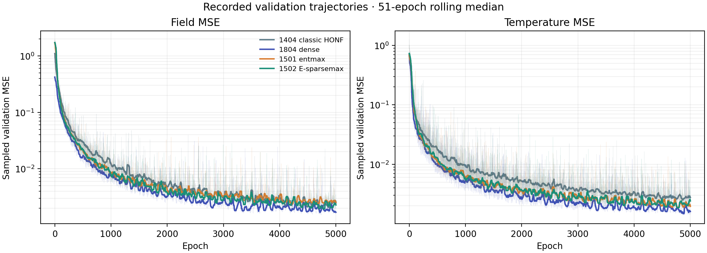
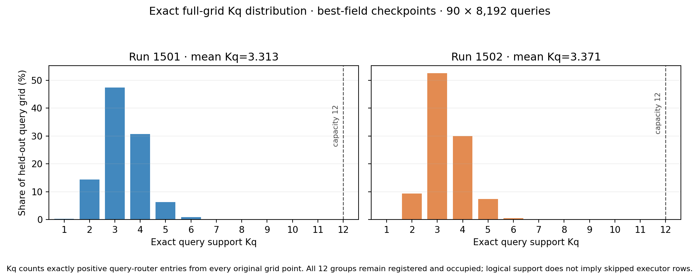
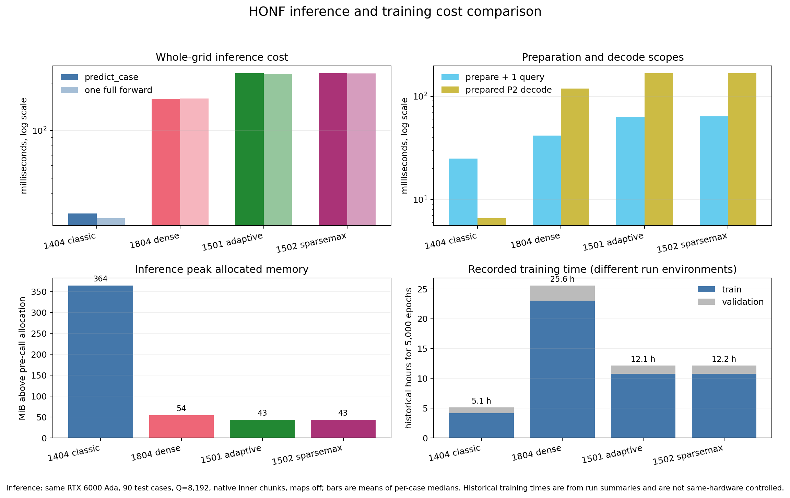

# Mature ThermalChannel comparison: classic HONF, dense, and sparse-incidence HONF

## Executive assessment

Runs 1501 and 1502 completed 5,000 epochs. Their **saved validation-best checkpoints**, rather than their epoch-5,000 endpoints, are the primary evidence here. Both improve the 90-case pooled fluid-field relative L2 over classic Run 1404, and Run 1502 has the lower pooled error of the two sparse-incidence runs. The improvement is not uniform across cases or physical outputs. Dense Run 1804 remains the best of these four on pooled fluid error, while Run 1404 remains strong near interfaces. The new runs establish query-dependent **logical group support**, but their registered group capacity remains 12 and their maintained fine reader still executes rectangular source rows. Consequently, these runs do not yet deliver adaptive physical computation.

The decision is to retain Run 1502's final environmental sparsemax refinement as an **optional, evidence-backed branch**, rather than replace Run 1501's entmax-1.5 setting universally. At maturity it reduces environmental source overlap and improves pooled fluid error, but its per-case field wins are close to even against Run 1501 and it does not make the rectangular evaluator cheaper. Run 1503's epoch-50 failure reinforces the need to budget actual fine work and complete application cost before expanding the model core.

## 1. Evidence contract and model identities

| Run | Architecture | Registered groups | Selected checkpoint | Selection basis | Trainable / total parameters |
|---|---|---:|---|---|---:|
| 1404 | Classic `legacy_honf` fixed projection | 6 | `best_by_field_mse_model.pt`, epoch 4890 | minimum logged sampled validation field MSE | 2.474 / 3.509 M |
| 1804 | Dense pairwise field | not applicable | `best_by_field_mse_model.pt`, epoch 4738 | minimum logged sampled validation field MSE | 4.395 / 5.431 M |
| 1501 | Phase-local sparse-incidence group control, final E entmax-1.5 | 12 | `best_by_field_mse_model.pt`, epoch 4689 | minimum logged sampled validation field MSE | 2.952 / 3.987 M |
| 1502 | Same registered architecture, final E masked sparsemax | 12 | `best_by_field_mse_model.pt`, epoch 4794 | minimum logged sampled validation field MSE | 2.952 / 3.987 M |

All four configurations point to the same packed ThermalChannel dataset fingerprint `4224093c22a67af4adfecc8b21d53548e4263ec2254c230dc83c89526b36da05`, with 600 training and 90 `test` cases. The `test` split is also used for sampled validation during training, so the 90-case full-grid comparison is a **development-set comparison**, not an untouched final test. There is one training seed per run. The headline selects each run's saved validation optimum for the fluid-field metric; all four happen to use a best-field file under that common criterion, but the analysis does not require a common checkpoint type or epoch. Run 1502 was an intended one-setting change from Run 1501, but their recorded source snapshots differ and were dirty; the comparison supports an observed structural/performance difference, not a clean causal estimate of the normalizer alone.

The full-grid evaluator uses all 8,192 original spatial queries per case, predicted local port conditions, and the same target normalization. It computes pooled relative L2 as

\[
L_{2,\mathrm{pool}}=\sqrt{\frac{\sum_c\|\hat y_c-y_c\|_2^2}{\sum_c\|y_c\|_2^2}}.
\]

This weights cases by their target energy; equal-case mean and paired wins are reported separately. The 1404/1804 full-grid tables were produced by the same maintained evaluator and settings as the new pass. Across the seven headline physical metrics, all four tables have the same 90 case IDs, identical per-case target counts, and exactly equal per-case target sums of squares. Saved checkpoint epochs were read from checkpoint metadata. Run 1502's saved best-total and best-field files at epoch 4794 have identical model weights; a duplicate forward pass would add no information. Run 1501's epoch-4877 saved best-total is evaluated separately as checkpoint sensitivity.

Run 1804's resumed root `metrics.csv` contains malformed late rows, including `NaN` values that contradict its finite resume log and saved best metadata. Its late validation trajectory below is reconstructed from the finite epoch-501–5000 resume log; epochs 1–500 come from the original CSV. The figure is **sampled validation history**, not the full-grid accuracy table.

**Figure 1.** Raw per-epoch traces are faint; colored lines are 51-epoch rolling medians. Both new runs continue improving late in training, and the saved minima occur before the exact epoch-5,000 endpoint. The figure supports checkpoint selection from the recorded validation history, not from an arbitrary final epoch.

## 2. Accuracy at saved checkpoints

| Run | Pooled normalized fluid L2 ↓ | Equal-case fluid L2 ↓ | Near-interface fluid L2 ↓ | Far-fluid L2 ↓ | Fluid T physical L2 ↓ | Internal T physical L2 ↓ | Surface T physical L2 ↓ | Interface heat-flux physical L2 ↓ |
|---|---:|---:|---:|---:|---:|---:|---:|---:|
| 1404 | 0.03460 | 0.03244 | **0.03337** | 0.03839 | 0.03879 | 0.03377 | 0.04482 | 0.13784 |
| **1804 dense** | **0.02896** | **0.02562** | 0.03504 | **0.02537** | **0.03078** | **0.02680** | **0.03898** | 0.10615 |
| 1501 | 0.03321 | 0.02897 | 0.04051 | 0.02899 | 0.03499 | 0.02922 | 0.04101 | **0.10051** |
| 1502 | 0.03153 | 0.02795 | 0.03687 | 0.02903 | 0.03476 | 0.02694 | 0.03948 | 0.10750 |

**Figure 2.** Pooled and equal-case fluid error on the left; normalized field, temperature, interface, and port errors on the right. Lower is better. The right-hand categories are distinct outputs, not terms of a combined score.

These are pooled relative L2 values except the explicitly labeled equal-case column. The aggregate fluid columns use the dataset-normalized field; the temperature and interface columns use dataset-native physical quantities. The table keeps outputs separate; adding them into one unweighted score would hide their different scales and practical roles. Run 1501's saved best-total at epoch 4877 gives pooled fluid L2 **0.03307**, slightly below its best-field checkpoint's 0.03321. This sensitivity is small relative to the model ordering: 1502 remains below 1501 in the pooled field metric and 1804 remains below both. The primary row uses the prespecified validation-field checkpoint policy.

| Run | Fluid u physical L2 ↓ | Fluid v physical L2 ↓ | Fluid pressure physical L2 ↓ | Fluid vorticity physical L2 ↓ | Final port T physical L2 ↓ | Final effective h physical L2 ↓ |
|---|---:|---:|---:|---:|---:|---:|
| 1404 | 0.01318 | 0.01970 | 0.03385 | **0.04064** | 0.07025 | 0.05001 |
| 1804 | **0.00717** | **0.01287** | **0.02322** | 0.04203 | **0.06699** | 0.04813 |
| 1501 | 0.00799 | 0.01610 | 0.02584 | 0.04844 | 0.06882 | **0.04595** |
| 1502 | 0.00738 | 0.01653 | 0.02555 | 0.04387 | 0.06857 | 0.04696 |

The new runs improve several channel and port quantities over 1404, but no one run leads every output. The relative-L2 denominator is computed separately for each named quantity; rows are not interchangeable physical-unit errors or a combined score.

On casewise fluid relative L2, Run 1501 beats Run 1404 in 75/90 cases; Run 1502 beats Run 1404 in 73/90 and dense Run 1804 in only 21/90. Run 1502 beats Run 1501 in 49/90. Thus the 1502 pooled gain reflects the **size and distribution** of case improvements, not a broadly consistent per-case win. The new runs improve the far-field error relative to 1404, while 1404 retains the lowest near-interface pooled error. Run 1501 is best on interface heat-flux relative L2. These qualifications matter when deciding whether 1502 is a general replacement.

| Paired Run 1502 − Run 1501 fluid error | Observed difference | 95% paired-case bootstrap interval |
|---|---:|---:|
| Pooled relative L2 | −0.001683 | [−0.003263, −0.000162] |
| Equal-case mean relative L2 | −0.001015 | [−0.002272, +0.000171] |

The 10,000 bootstrap replicates resample the same 90 case IDs in pairs. The pooled interval favors Run 1502 for this development population; the equal-case interval includes zero. These intervals quantify **case sampling only**. They do not cover training-seed variation, checkpoint-selection uncertainty, or an independent physical test population.

## 3. What “adaptive K” achieved

For 1404, `K=6` is a fixed hyperedge bank and its source/query softmax assignments have positive support on all six groups. Its effective-edge entropy diagnostic is a different statistic from an exact nonzero count. For 1501/1502, `K=12` is registered capacity; there is **no case-level K plan**. The adaptive quantity here is query support

\[
K_q(x)=\#\{k:\alpha_{qk}(x)>0\},
\]

plus phase-local source incidence. Source-group occupancy, the entropy-based effective group count, unique supported source pairs, and executed fine rows are separate measurements. Group labels can permute across models and cases; the visualizations show learned surrogate organization, not physical causal domains.

| Checkpoint | Registered K | Query Kq min–max | Mean Kq | Range of case-mean Kq | Effective-group diagnostic (not Kq) | Source groups occupied per case | Environmental source support |
|---|---:|---:|---:|---:|---:|---:|---:|
| 1404 best-field | 6 | 6–6 exact positive softmax support | 6.000 | 6–6 | Shannon `exp(H)` mean 4.621 (range 3.793–5.370) | 6 fixed | dense positive support |
| 1501 best-field | 12 | **1–8** | **3.313** | 3.020–3.716 | inverse-Simpson mean 2.373 (Q1,024) | 12/12 | 0.613 (Q1,024) |
| 1502 best-field | 12 | **1–7** | **3.371** | 3.009–3.759 | inverse-Simpson mean 2.370 (Q1,024) | 12/12 | 0.408 (Q1,024) |

The exact Kq distribution below was streamed across all 8,192 original queries in each of the 90 development cases (737,280 queries per checkpoint), reducing each route tensor to per-case support counts without retaining full route maps. Run 1502 has **slightly higher mean Kq** at maturity, despite materially sparser environmental source incidence. The environmental support fraction falls by about one third; the module support fraction rises from 0.798 to 0.835. The effective-group diagnostics use different definitions: Run 1404 reports `exp(Shannon entropy)`, while Runs 1501/1502 report inverse-Simpson concentration from the richer Q1,024 organization pass. They are not exact support counts and should not be compared as though they were Kq. Source incidence and case-level clustering summaries use the deterministic Q1,024 sample; only Kq below uses full Q8,192.

| Exact Kq | Run 1501 queries | Run 1501 share | Run 1502 queries | Run 1502 share |
|---:|---:|---:|---:|---:|
| 1 | 1,758 | 0.238% | 200 | 0.027% |
| 2 | 106,121 | 14.394% | 69,439 | 9.418% |
| 3 | 349,273 | 47.373% | 387,411 | 52.546% |
| 4 | 226,805 | 30.762% | 221,204 | 30.003% |
| 5 | 46,687 | 6.332% | 54,626 | 7.409% |
| 6 | 6,498 | 0.881% | 4,357 | 0.591% |
| 7 | 129 | 0.017% | 43 | 0.006% |
| 8 | 9 | 0.001% | 0 | 0.000% |

**Figure 3.** Exact positive query-support histograms over all 90 × 8,192 original grid queries per selected best-field checkpoint. Most queries use three or four of the twelve registered groups. Run 1502's environmental incidence can shrink while this query degree remains comparable or rises.

**Figure 4.** One representative five-module geometry at each selected best-field checkpoint. Upper panels color the dominant learned route; lower panels show exact nonzero group support per query. The 1404 upper panel is its dominant routed **pairwise contribution**, whereas 1501/1502 show query-router group argmax, so the colors are descriptive within each model and cannot be matched by group ID across models. White circles mark module locations; neither routes nor clusters identify physical causality.

**Figure 5.** Source assignment weights for the same physical modules. Run 1404's softmax weights spread over six groups; the new runs have concentrated, overlapping incidences over twelve registered groups. Black M5–M11 rows are inactive padded module slots, not empty physical modules. Group indices can permute across runs.

For a second geometry and more detailed source/query views, see the selected-checkpoint boards for cases 0273 and 0653 in [Run 1501](routing/population_run1501_best_field_e4689_q1024/figures/representative_hypergraph_organization__0273__0653.png) and [Run 1502](routing/population_run1502_best_field_e4794_q1024/figures/representative_hypergraph_organization__0273__0653.png). The [case-level Kq/error scatter](routing/figures/case_mean_kq_vs_fluid_error.png) uses exact per-case Q8,192 mean Kq and the same full-grid fluid error; it remains descriptive and does not imply Kq causes either accuracy or runtime.

## 4. Computation cost and efficiency

The historical trainer summaries record the following 5,000-epoch time and peak CUDA allocation. These are logged totals from distinct training runs and devices/code snapshots, useful for resource context; they do not isolate an architectural speedup.

| Run | Training time | Validation time | Total logged epoch time | Recorded peak CUDA allocation (MiB) |
|---|---:|---:|---:|---:|
| 1404 | 4.14 h | 0.98 h | 5.12 h | 24,841 |
| 1804 | 23.02 h | 2.53 h | 25.55 h | 27,210 |
| 1501 | 10.77 h | 1.38 h | 12.15 h | 24,280 |
| 1502 | 10.76 h | 1.40 h | 12.15 h | 24,273 |

The direct inference comparison uses one RTX 6000 Ada GPU, all 90 cases, and all 8,192 queries per case. Each case/phase has one warmup and three synchronized repeats; the table averages the 90 per-case median wall times. Maps are off during timing and an untimed maps-on pass captures execution ledgers. The evaluator outer query batch is 32,768; the saved native inner receiver tile is 128 for 1804/1501/1502 and is not overridden. Incremental peak allocation is measured above each loaded-model baseline, so these numbers are execution footprints, not total device residency. This matched **application** path includes preparation, full-grid prediction, and CPU transfer.

| Run | Complete application ms/case ↓ | Application throughput queries/s ↑ | Preparation + one query ms/case ↓ | Prepared P2 decode ms/case ↓ | Application incremental peak allocation MiB ↓ |
|---|---:|---:|---:|---:|---:|
| **1404 classic** | **29.88** | **274,200** | **24.92** | **6.58** | 364.27 |
| 1804 dense | 158.87 | 51,560 | 41.54 | 118.49 | 53.58 |
| 1501 | 231.33 | 35,410 | 63.63 | 167.88 | **43.19** |
| 1502 | 231.09 | 35,450 | 64.18 | 168.14 | **43.19** |

**Figure 6.** Measured mature-checkpoint inference cost under the common GPU protocol. Preparation and prepared P2 are separate calls with different baselines, so their means are diagnostic and should not be added to reconstruct the end-to-end application time.

Run 1502 is effectively tied with 1501 in application time: its 0.24 ms/case difference is about 0.11%, below a useful architectural claim. Relative to dense 1804, 1502 takes **1.45×** the application time despite lower fluid error than 1404; relative to classic 1404 it takes **7.73×** the time. Both new runs train in about half the logged total time of dense 1804, but about 2.37× the total time of 1404. The large 1404 incremental inference allocation reflects its different unchunked evaluator; lower allocation in a chunked run does not by itself show fewer total operations.

For the joint objective of pooled fluid error and complete inference latency, 1804 dominates both new runs at these checkpoints: it is more accurate and faster. Run 1404 is the latency winner and has the strongest near-interface fluid metric. The new runs occupy a different resource tradeoff, with lower incremental inference allocation and lower logged training time than dense 1804; their physical-output advantages must be judged output by output rather than inferred from pooled fluid error.

The untimed P2 ledger makes the logical-versus-executed distinction concrete. Across 90 cases, 1501 has a mean **0.963 million** unique supported query–environment pairs and 1502 **0.643 million**, a **33.3%** reduction. Yet both execute **1.573 million environmental fine rows** and **98,304 module fine rows per case** in their rectangular reader. Both also register 12 groups, with all 12 occupied in every case. Thus the sparsemax change improves logical sparsity and field accuracy on this population without reducing the current physical row budget or measured inference time. The detailed per-case timings and ledgers are in [the cost data](cost/inference_cost_cuda2.csv); the [benchmark script](cost/benchmark_inference_cost.py) retains the protocol.

## 5. Run 1503 failure and design implications

Run 1503 tested adaptive hyperedge opening with a coarse group response and a fine environmental source-attention response. Its route-dependent opening did **not** remove the coarse work; opened groups added fine source work. At its exact epoch-50 review, the formal trainer averaged 57.06 seconds per training epoch versus 8.40 seconds for Run 1502 (6.80×), and 3.22 versus 1.02 seconds per validation pass (3.15×). The corrected hybrid executor reduced scalar-loop overhead, but its matched 90-case application path was still 6.19× slower and used 2.17× the incremental peak allocation of Run 1502. Its epoch-50 pooled fluid relative L2 was 0.85589 versus 0.49269 for Run 1502, a broad early accuracy regression. The candidate was stopped at epoch 50, so this is a failed **gate**, not evidence about its unobserved epoch-5,000 potential.

**Figure 7.** Previously recorded matched epoch-50 comparison of Run 1503 and Run 1502. It is a separate learning-stage gate and is not mixed with the mature best-checkpoint ranking above.

The key implementation lesson is that a small `Kq` or fewer logical source pairs does not guarantee fewer physical operations. Run 1503's population mean fine work remained about 52.3% of the dense query-by-environment rectangle **in addition to** the coarse path, with group packing, launch, checkpoint-recomputation, and scatter overhead. The same distinction applies to Run 1501/1502: their maintained rectangular reader executes its full source rectangles even where masks are sparse.

## 6. Actionable upgrade priorities

### Changes that preserve the trained model core

1. **Prespecify the metric and checkpoint policy.** Use validation field MSE for the fluid-field headline and retain the saved total/temperature checkpoints for sensitivity or their own physical outputs. Add a separate untouched test population or a new split before treating small model differences as generalization gains. Keep exact endpoint results as trajectory context.
2. **Make every cost table scope explicit.** Report complete `predict_case`, preparation, prepared P2 decode, synchronized wall time, memory allocation, outer query batch, and native inner receiver tile independently. Keep maps-on ledgers out of timed forwards. Validate case/target identities before combining old and new tables.
3. **Keep 1502's normalizer opt-in.** Its lower environmental overlap is observed across the 90 development cases at maturity, while casewise accuracy and cost are mixed. Preserve both checkpoints and config identities, and compare a second seed or a new holdout before making sparsemax the default.
4. **Diagnose failures by region and case complexity.** Pair error with module count, gaps, boundary distance, source overlap, and query `Kq`, using learned-route language. This can localize the near-interface regression and identify whether a future change needs more representation or more accurate physical data.
5. **Profile the retained implementation before changing it.** The present rectangular executor is the correctness reference. Existing support-selected alternatives reduced logical rows but previously lost on latency and memory. A future implementation-only optimization must win whole-application time and memory, not just row counts.

### Core changes requiring a new experiment contract

1. **Decide what should adapt.** Case-level active capacity, query-level support, source incidence, and actual fine computation are distinct. A genuine adaptive-compute design needs an explicit bounded workload, a stable identity for any case-level plan, and measured skipped physical rows; simply varying `Kq` is insufficient.
2. **Avoid additive coarse and fine work without a budget.** A future coarse/fine reader should show that expensive fine attention replaces work or operates on a sufficiently small selected union. Its break-even condition must include source projection, gathers/scatters, padding, kernel launches, and backward recomputation at the real 8,192-query application size.
3. **Engineer the sparse executor around the hardware.** Only after a parity-preserving prototype should grouped blocks, fused kernels, or compiled dispatch be considered. Compare forward outputs and gradients against the rectangular reference, then benchmark preparation, P2, complete inference, and an optimizer step across small and large module cases. Keep a dense fallback where sparse dispatch loses.
4. **Protect multi-objective physical quality.** Changes targeting pooled field error must be checked against near-interface fields, internal/surface temperatures, heat flux, and predicted ports. The mature four-run comparison has different winners on these outputs, so a single aggregate cannot justify replacing the existing branches.

## 7. Limits and reproducibility

The comparison uses one training seed and a development split also used for validation. It measures a learned surrogate against dataset targets, not physical causality or independent CFD truth. Group IDs are permutation-ambiguous. Checkpoints came from differing dirty source snapshots, and the old Run 1804 CSV issue prevents naive late-history reduction. Full-grid accuracy and application timing use 8,192 queries; K-population measurements use a fixed 1,024-query subset. Logical support and executed fine rows are never interchanged.

The primary machine-readable summaries are [accuracy/comparison.json](accuracy/comparison.json), [cost/model_cost_summary.csv](cost/model_cost_summary.csv), [cost/execution_ledger_summary.csv](cost/execution_ledger_summary.csv), and [routing/fullgrid_kq_summary.json](routing/fullgrid_kq_summary.json). The [accuracy commands](accuracy/commands.md), [cost benchmark](cost/benchmark_inference_cost.py), [cost summarizer](cost/summarize_cost_evidence.py), [routing extractor](routing/extract_fullgrid_kq.py), and [routing renderer](routing/render_routing_comparison.py) document regeneration. The validation figure can be rebuilt with `python docs/reports/run1501_1502_comparison/render_validation_curves.py` from the HONF project root.
