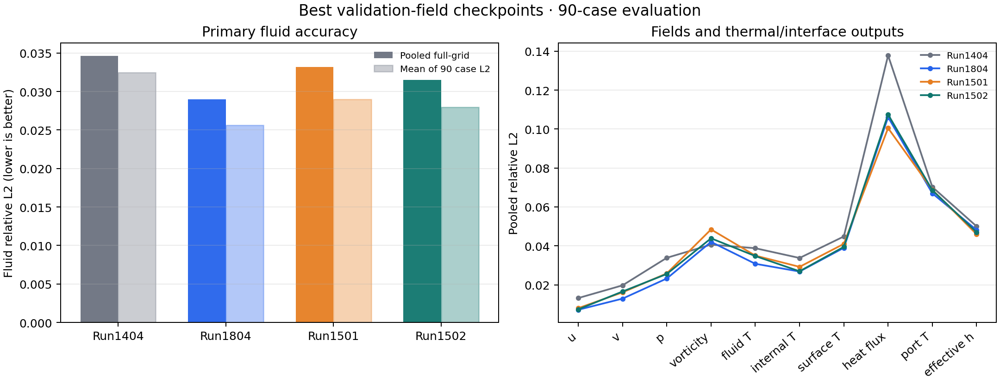

# Accuracy comparison: Runs 1404, 1804, 1501, and 1502

## Protocol and checkpoint selection

The primary score is pooled full-grid fluid relative L2, computed as
`sqrt(sum(case fluid SSE) / sum(case fluid target SSE))`. I selected each run's
`best_by_field_mse_model.pt` from its logged sampled-validation field-MSE
criterion before comparing any full-grid results. This gives epochs 4890, 4738,
4689, and 4794 for Runs 1404, 1804, 1501, and 1502. The checkpoints are not
required to share an epoch or checkpoint type; here, the same field-aligned
validation policy is available for all four.

The evaluation has 90 matched cases, 8,192 grid queries per case (737,280 per
model), query batch size 32,768, predicted port conditions, and the same packed
dataset. The artifacts label these rows `test`; the 90-case set overlaps the
project validation/development split, so treat it as a comparative development
set rather than an independent final test. No checkpoint was chosen from these
full-grid results.

| Run | Architecture | Selected checkpoint | Validation field MSE | Pooled fluid relative L2 | Case mean | Case median | Case P95 |
|---|---|---|---:|---:|---:|---:|---:|
| 1404 | Classic HONF (`legacy_honf`) | best field, e4890 | 0.0018713 | 0.034601 | 0.032440 | 0.028111 | 0.060278 |
| 1804 | Dense pairwise baseline | best field, e4738 | 0.0015210 | **0.028960** | **0.025616** | **0.020748** | **0.052812** |
| 1501 | Adaptive-K sparse-incidence HONF, entmax15 | best field, e4689 | 0.0022935 | 0.033209 | 0.028969 | 0.022077 | 0.065450 |
| 1502 | Adaptive-K sparse-incidence HONF, sparsemax | best field, e4794 | 0.0018399 | 0.031526 | 0.027954 | 0.022408 | 0.058897 |

The dense baseline has the lowest full-grid fluid error. Relative to Run 1804,
Run 1501's pooled error is 14.66% higher and Run 1502's is 8.86% higher. Both
adaptive runs improve on classic Run 1404: pooled fluid error is lower by 4.02%
for 1501 and 8.89% for 1502. Run 1502 improves on Run 1501 by 5.07% in pooled
fluid relative L2.

## Field and thermal metrics

All entries are pooled relative L2 in the model's dataset-normalized space for
the fluid regions, and in dataset-native physical units for physical field,
interface, and port quantities. Lower is better.

| Run | Near-interface fluid | Far fluid | u | v | Pressure | Vorticity | Fluid T | Internal T | Surface T | Interface heat flux | Port T | Effective h |
|---|---:|---:|---:|---:|---:|---:|---:|---:|---:|---:|---:|---:|
| 1404 | **0.033367** | 0.038385 | 0.013175 | 0.019697 | 0.033853 | **0.040636** | 0.038789 | 0.033769 | 0.044822 | 0.137840 | 0.070245 | 0.050014 |
| 1804 | 0.035043 | **0.025369** | **0.007165** | **0.012872** | **0.023217** | 0.042034 | **0.030784** | **0.026805** | **0.038985** | 0.106147 | **0.066986** | 0.048127 |
| 1501 | 0.040506 | 0.028992 | 0.007992 | 0.016099 | 0.025842 | 0.048438 | 0.034990 | 0.029217 | 0.041009 | **0.100508** | 0.068818 | **0.045951** |
| 1502 | 0.036872 | 0.029025 | 0.007384 | 0.016526 | 0.025547 | 0.043873 | 0.034762 | 0.026941 | 0.039482 | 0.107499 | 0.068571 | 0.046961 |

The adaptive runs improve several outputs over classic HONF: velocity,
pressure, fluid temperature, and effective heat-transfer coefficient. Run 1501
has the lowest interface heat-flux error; Run 1502 improves the vorticity and
internal-temperature scores over 1501, while its interface heat-flux error
increases. Run 1804 remains strongest on bulk fluid error and most velocity
and temperature metrics, with Run 1501/1502 competitive on selected interface
quantities.

## Paired comparisons and sensitivity

Paired case wins for pooled-fluid per-case L2 are: 1804 beats 1404 in 80/90
cases; 1804 beats each of 1501 and 1502 in 69/90; 1501 beats 1404 in 75/90;
1502 beats 1404 in 73/90; and 1502 beats 1501 in 49/90 (1501 wins 41, no ties).
The 10,000-draw paired case bootstrap estimates `1502 - 1501` pooled fluid
relative L2 as -0.001683, 95% CI [-0.003263, -0.000162]. The case-mean
difference is -0.001015, 95% CI [-0.002272, 0.000171], which includes zero.
Against Run 1804, the pooled error differences are +0.004249 for Run 1501
(95% CI [+0.002302, +0.006161]) and +0.002566 for Run 1502
(95% CI [+0.001285, +0.003894]).

These intervals describe resampling uncertainty across these 90 cases only;
they do not address overlap with validation/development data, checkpoint
selection, or run-to-run seed variation. Runs 1501 and 1502 are one-seed runs
from different recorded source states, so the comparison is suggestive rather
than a clean causal estimate of changing entmax15 to sparsemax.

As an explicitly exploratory sensitivity, Run 1501's best-total checkpoint at
e4877 gives pooled fluid relative L2 0.033067 versus 0.033209 for the
preselected best-field e4689 checkpoint (about 0.43% lower after evaluation).
It does not replace the headline. Run 1502's best-total and best-field files
are at the same epoch and have bit-identical model weights, so only one
full-grid inference was necessary for those variants.

## Validation and provenance issues

The 5,000-epoch endpoint is context only. The saved best-field checkpoints
above are the headline results. Endpoint validation values are in
`validation_endpoint_context.csv`. Run 1804's two `metrics.csv` files have
corrupted post-resume validation entries (including NaNs and zero temperature
values): a naive finite scan suggests a field minimum of 0.004114 at e4050,
which conflicts with the saved best-field checkpoint metadata and run summary
(0.001521 at e4738). The saved checkpoint and summary were used for selection;
the continuation log supplies the finite e5000 context values. The corrupted
CSV is not a valid post-resume trajectory or checkpoint selector.

The September 20 baseline evaluator and the current evaluator use the same
`compare_models.py` implementation; that file has no changes since the
baseline evaluation. The shared prediction helper changes since then retain
additional routing/interaction diagnostics across query chunks. Changes in
`interface_field_coupling.py` and the interface core add branches for newer
opt-in architectures; Run 1404 defaults to `legacy_honf`, and Run 1804 records
`dense_pairwise_field`, so neither enters those new branches. A general
coordinate-scale broadcast normalization change in the interface core is
equivalent for the baseline tensor shapes. The outputs also reconcile exactly
on case IDs, target counts, and target SSE for all 13 reported metrics. I
therefore reuse the September 20 baseline predictions, with that code audit
and exact target reconciliation as the provenance check.

## Reusable artifacts

- `accuracy_summary.csv`: pooled and per-case summaries for all headline metrics.
- `per_case_accuracy.csv`: matched case-level metric values for the four
  selected checkpoints and the exploratory Run 1501 best-total checkpoint.
- `paired_case_wins.csv`, `paired_bootstrap_ci.csv`: paired comparisons.
- `target_count_reconciliation.csv`, `query_count_reconciliation.csv`: target
  and query count checks.
- `checkpoint_selection.csv`, `validation_endpoint_context.csv`: validation
  selection candidates and endpoint-only context.
- `comparison.json`: case IDs, policies, source paths, and reconciliation
  status. Rerun `summarize_accuracy.py` to rebuild these summaries and figures
  from the recorded evaluation tables.
- `commands.md`: inference and report regeneration commands.
