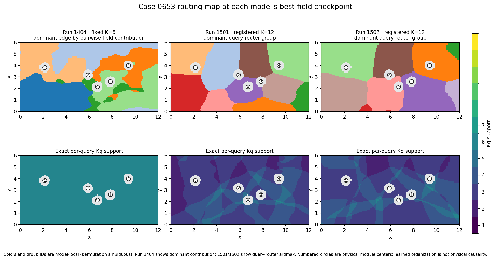
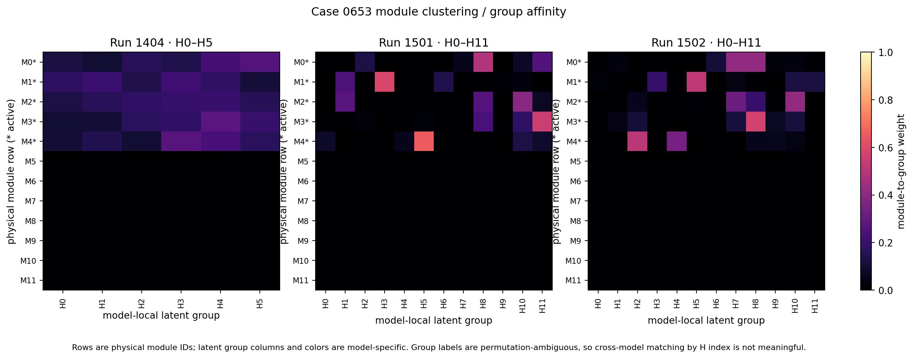
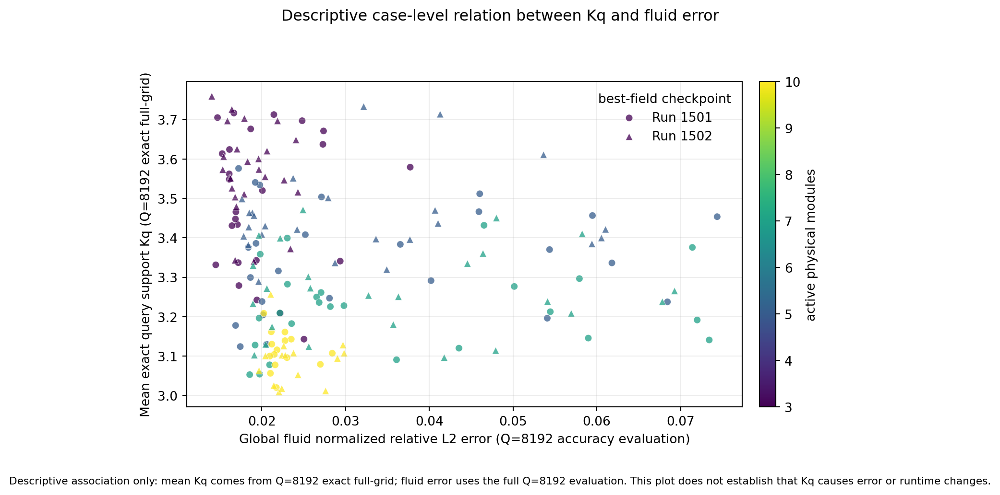

# Routing and adaptive-K findings

## Checkpoints and meaning of K

This analysis uses the selected best-field checkpoints: Run 1404 e4890, Run 1501 e4689, and Run 1502 e4794. Exact Kq counts for Runs 1501/1502 were streamed over all 8,192 original query points in all 90 held-out cases. The richer source-incidence and organization statistics use deterministic Q=1,024 samples per case.

| Run | Routing design | Registered capacity | What Kq means | K distribution evidence |
|---|---|---:|---|---|
| 1404 | Classic fixed projection; softmax query routing | 6 | Positive query softmax support is all six registered groups; no adaptive support selection | Fixed K=6; full 90-case best-field table reports six active edges in every case. Entropy-effective edge count is separately 4.621 mean (range 3.793–5.370), and is not exact support. |
| 1501 | Sparse-incidence group control; sparsemax query routing | 12 | Exact number of positive entries in each query’s 12-way router output; there is no case-level Kplan | Q8192 across 90 held-out cases: Kq min/max/mean = 1/8/3.313; per-case mean Kq spans 3.020–3.716. |
| 1502 | Same registered capacity and query router; sparsemax environmental refinement | 12 | Same exact query support definition as 1501 | Q8192 across 90 held-out cases: Kq min/max/mean = 1/7/3.371; per-case mean Kq spans 3.009–3.759. |

For Runs 1501 and 1502, all 12 registered source groups are occupied in every test case. Physical active-module count is a separate variable: both populations have 3–10 physical modules per case, mean 5.833. Thus the two new runs do have query-dependent support, but Kq is the number of latent groups contributing to a query, not the count of physical modules. A support count also does not promise an equivalent reduction in executed rows: the current evaluator still executes the rectangular fine-source path.

### Full-grid Kq histograms

| Kq | Run 1501 queries | Run 1501 share | Run 1502 queries | Run 1502 share |
|---:|---:|---:|---:|---:|
| 1 | 1,758 | 0.238% | 200 | 0.027% |
| 2 | 106,121 | 14.394% | 69,439 | 9.418% |
| 3 | 349,273 | 47.373% | 387,411 | 52.546% |
| 4 | 226,805 | 30.762% | 221,204 | 30.003% |
| 5 | 46,687 | 6.332% | 54,626 | 7.409% |
| 6 | 6,498 | 0.881% | 4,357 | 0.591% |
| 7 | 129 | 0.017% | 43 | 0.006% |
| 8 | 9 | 0.001% | 0 | 0.000% |

Each full-grid histogram contains 737,280 query assignments (90 × 8,192). The pass used `predict_case` on GPU2 with receiver batches of 2,048, reduced each route tensor immediately to integer positive-support counts, and wrote only case and histogram CSVs plus a summary JSON. No full routing arrays or case boards were written. Figure: [full-grid Kq distribution](routing/figures/kq_distribution_fullgrid_q8192.png). The sampled Q1024 histogram remains available in `kq_histogram.csv` for auditing the source-organization pass.

## Spatial decomposition and module grouping

Figure 1 compares the best-field case 0653 maps in one coordinate system. The first row shows the strongest learned association at each query: Run 1404’s dominant pairwise field-contribution edge, and Runs 1501/1502’s dominant query-router group. The second row is exact per-query support Kq; the fixed Run 1404 softmax has Kq=6 everywhere. Circles label physical module centers. Color and group indices are local to each model and cannot be matched across runs because latent groups are permutation-ambiguous. These maps summarize learned organization and do not establish physical causality.

Figure 2 gives the physical-module-by-latent-group assignment matrix. Run 1404 has six fixed softmax groups; Runs 1501/1502 have twelve registered groups and sparse incidence. Asterisks mark active physical modules. The sparse heatmaps show that a module can link to multiple latent groups while many candidate links are zero. H labels are model-local.

Detailed sampled organization boards for cases 0273 and 0653 are retained under each population’s `figures/` directory. Run 1404’s best-field case-0653 organization overview and source plan are in `routing/run1404_best_field_0653/0653_20260923_232059/`. The detailed population boards expose query weights, source incidence, source centers, and the distinction between group argmax and Kq; they should be read with the permutation caveat above.

## Run 1501 to Run 1502: what changed in the learned organization

| Organization statistic (Q=1,024 source pass, except full-grid Kq) | Run 1501 | Run 1502 | 1502 vs 1501 |
|---|---:|---:|---:|
| Full-grid query support Kq | 3.3128 | 3.3714 | +1.77% |
| Physical-module source support RM | 0.7984 | 0.8349 | +4.57% |
| Environmental-source support RE | 0.6126 | 0.4085 | −33.32% |
| Mean environment source degree | 4.1645 | 2.0229 | −51.43% |
| Environment unique pairs per case | 120,448 | 80,309 | −33.32% |
| Environment logical paths per case | 227,546 | 109,631 | −51.82% |
| Actual rectangular environment rows per case at Q=1024 | 196,608 | 196,608 | unchanged |

The most consistent organization change is on the environmental source side: Run 1502 has substantially lower exact support, degree, pair count, and logical paths. Query Kq changes little and slightly increases at the selected checkpoints. The module-support ratio changes only modestly. However, the measured environment row count remains the full `Q × E` rectangle, so the structural support reduction did not make this implementation execute proportionally fewer source rows.

Figure 3 joins exact per-case full-grid mean Kq to the same full-grid best-field fluid error. It is descriptive only and does not establish that Kq causes accuracy or cost differences.

### Should the sparsemax environmental-refinement change be kept?

Keep it as an explicit experimental option for the next controlled comparison. The observed change is aligned with the central sparsity goal: the environmental support fraction falls from 0.613 to 0.408, with a much lower average environment source degree, while all source groups remain occupied and every query retains support. On the evidence in this report, it should not become a universal default or be credited as the sole cause of the final model deltas.

The Run 1502 experiment overlay names exactly one intended model change: final environmental source refinement moves from entmax-1.5 to masked sparsemax; module proposal, query router, and training/data settings are retained. Yet run provenance is not a clean matched intervention: Run 1501 records commit `924607ea264f5ace74b2187eb747b24b9c691be3` with 22 dirty paths, while Run 1502 records commit `cf0c3c53a5b2b58daeeb7d94b436f58daaf0a57e` with one dirty path from a different temporary source checkout. The comparison is a single-seed, best-checkpoint association. A follow-up that preserves the change should use the same source snapshot, seed, data order, training settings, and checkpoint-selection rule, changing only the environmental-refinement normalizer.

## Run 1503: why the attempted adaptive opening did not pass

Run 1503 completed its formal 50 epochs with finite losses; the failure was the measured fidelity-and-cost gate, not a training crash. Its opening rule combined a coarse per-group response with a fine per-group source-attention response. Every opened group still paid for fine projection, attention, activation storage or recomputation, and scatter in addition to the coarse `Q × K` path. At Q=8192, chunk size 32 created 256 receiver tiles and roughly one thousand scalar fine-block calls per representative case. Chunk sizes 64 and 128 exhausted memory; checkpointing with chunk 32 enabled the run but amplified the backward cost.

The saved report records 6.80× training seconds per epoch, 3.15× validation time, 1.19× training peak memory, 6.19× final application latency, and 2.17× incremental application memory relative to Run 1502. Mean fine work was 52.3% of the dense Q×E rectangle and remained additive to the coarse route. The exact e50 90-case fluid relative-L2 regressed from 0.49269 to 0.85589; near-interface and far-fluid errors also regressed, though heat-flux and effective-h MAE improved. A bounded batched-executor correction reduced small-tile time but did not rescue full-application cost or accuracy. These measurements make the compute pathology clear; one 50-epoch seed does not isolate the cause of the fidelity regression.

See `docs/reports/HONF_Run1501_Executor_and_Run1502_Development.md`, sections 6–9, for the per-epoch trace, full accuracy table, timing correction, and Run 1503 support population.

## Artifact and cleanup record

Reproducible code and compact tables are in this directory: `extract_fullgrid_kq.py`, `render_routing_comparison.py`, `fullgrid_kq_summary.json`, `fullgrid_kq_histogram.csv`, `fullgrid_kq_cases.csv`, `kq_population_summary.csv`, `kq_histogram.csv`, and `case_kq_vs_fluid_error.csv`. The `fullgrid_kq_*` files provide the exact all-query Kq population; `kq_histogram.csv` and source-incidence tables retain the deterministic Q=1,024 organization pass. Population-level source arrays and CSV/JSON summaries remain in each `population_run...` directory. To keep the report focused, 352 generated non-representative case-board PNG/PDF files were removed (176 from each new-run Q1,024 population). Case arrays and per-case CSV/JSON data were not deleted. Boards for 0273 and 0653, summary figures, and representative organization figures were retained.
