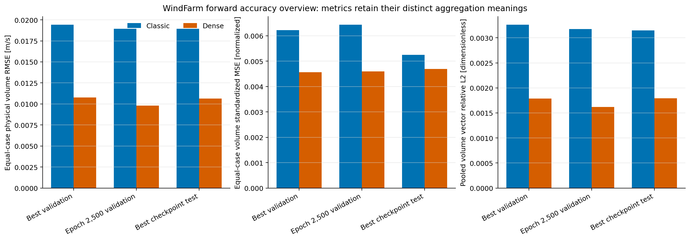
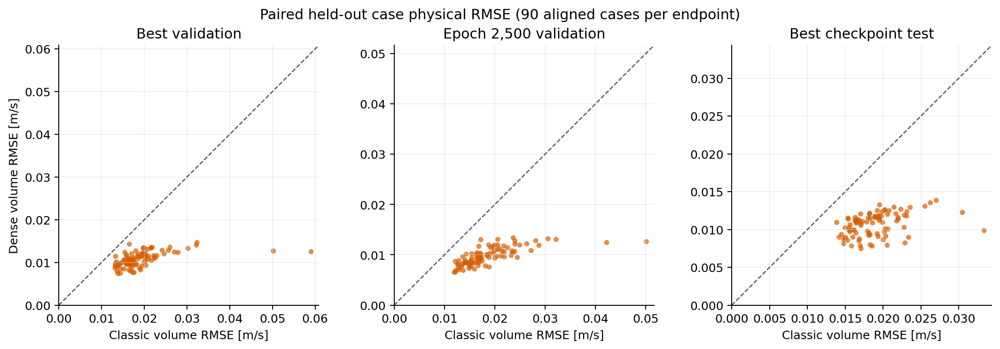
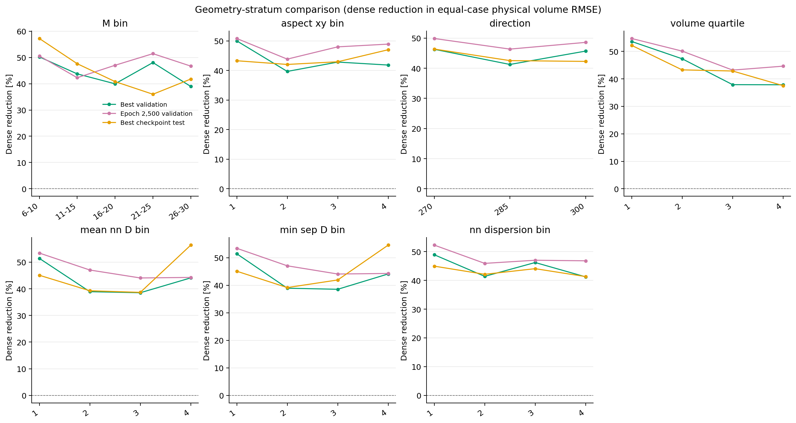
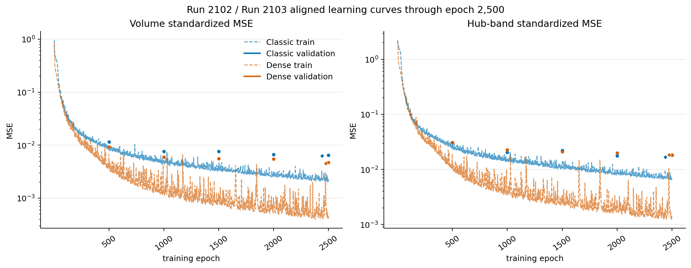
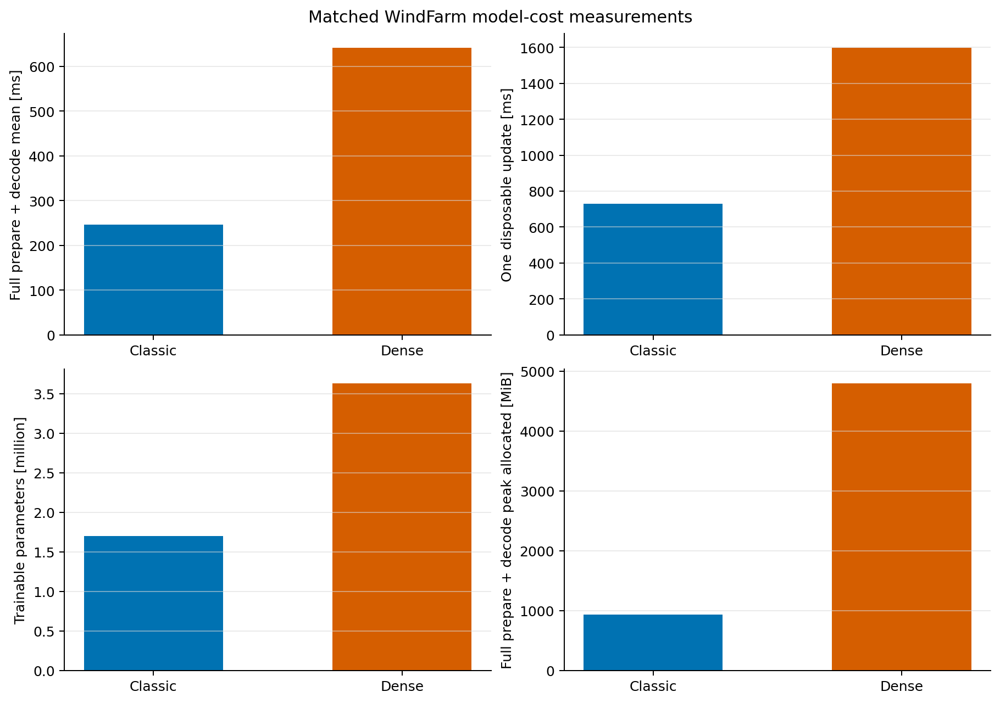
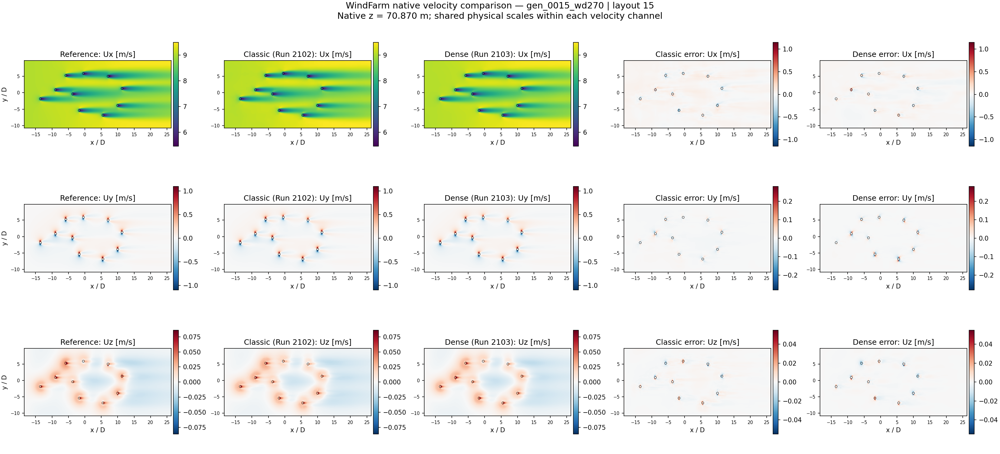
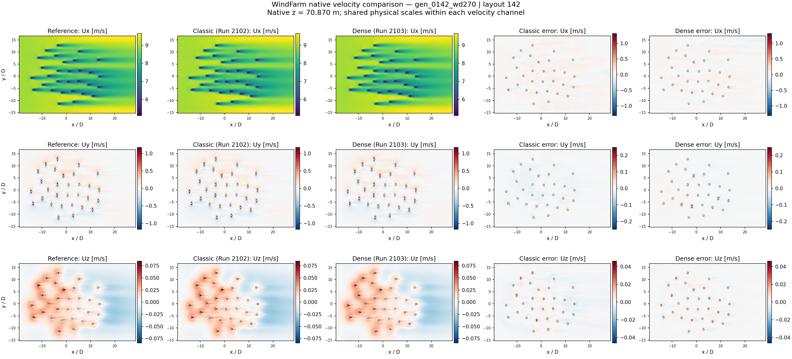
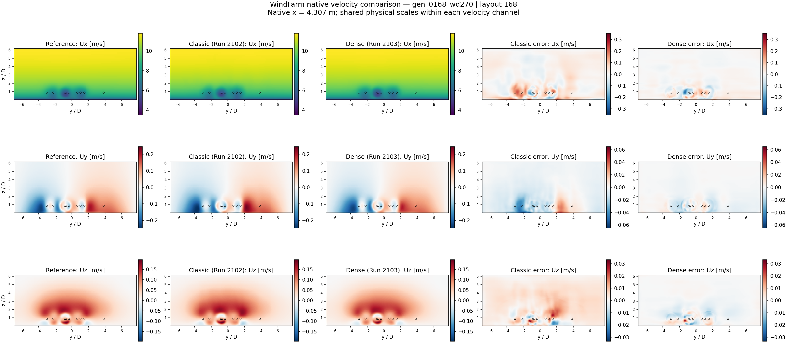
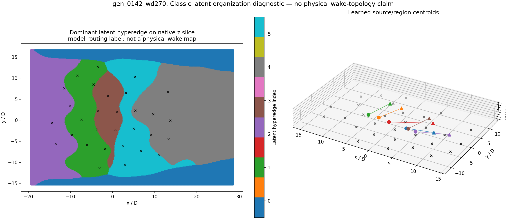

# WindFarm Forward Velocity: 2,500-Epoch Comparative Study

## Decision summary

The Run-1804-style dense pairwise backend is the stronger model for the present field-only objective. At the validation-selected checkpoints, it reduces equal-case physical velocity RMSE by **44.5% on validation** and **43.8% on the reserved test set** relative to the Run-1401-style classic fixed-K=6 backend. Its pooled vector relative L2 is also about 45% lower. Dense has lower physical whole-volume RMSE for every one of the 90 paired validation cases and every one of the 90 paired test cases.

That gain has a material cost. Dense has 2.14 times as many trainable parameters, took 2.19 times as long per training update and per completed training run, and used 5.17 times as much peak memory for matched B=16 inference. Activation checkpointing changes the training-memory result: at the matched B=16, Q=8192 update, Dense used about 25% less peak allocated memory than Classic while taking 2.19 times as long.

The result is specific to one seed-42 layout-grouped split and one training seed. It supports choosing Dense when physical velocity accuracy, especially `Ux`, is the primary criterion and the additional time and inference memory are acceptable. Classic remains useful where lower latency, parameter count, and inference memory matter. These velocity predictions do not establish exact turbine power, solver-grade physical gradients, or physical meaning for learned latent edges.

## Runs and checkpoint policy

Both runs started from scratch, used the same native WindFarm view, and completed 2,500 epochs and 67,500 optimizer updates. Shared settings were logical batch 16, 8,192 sampled queries per case (6,144 volume plus 2,048 rotor/downstream band), 512 environmental tokens, receiver chunk 512, AdamW with learning rate `3e-4` and weight decay `1e-5`, seed 42, no AMP, no dropout, and no learning-rate schedule.

| Model | Run | Validation-selected checkpoint | Terminal checkpoint |
|---|---|---:|---:|
| Classic fixed-K=6 | `Run_2102_20260913_135849_windfarm_classic_k6_b16_q8192` | epoch 2,440 | epoch 2,500 |
| Dense pairwise | `Run_2103_20260913_135849_windfarm_dense_pairwise_b16_q8192` | epoch 2,475 | epoch 2,500 |

The selected checkpoints minimize validation standardized field MSE. The reserved test split was run once with those selected checkpoints. Exact epoch 2,500 was assessed on validation only and did not influence model selection. This distinction matters: the terminal checkpoints have slightly worse standardized validation MSE but slightly better physical RMSE than their selected checkpoints, so neither checkpoint policy dominates every metric.

## Comparison protocol

The assessment preserves the documented seed-42 split: 140/30/30 layouts and 420/90/90 rows for train/validation/test, with all three wind directions from a layout kept together. Each comparative endpoint uses all 90 rows and 30 layouts in its split, fixed query sampling, `Q_volume=32768`, `Q_band=8192`, sample seed 42, and receiver chunk 512. Case identities and order match across models and validation endpoints.

Three complementary volume metrics are reported separately:

- **Equal-case standardized MSE** is the mean training-space MSE after each case receives equal weight.
- **Equal-case physical RMSE** is the mean per-case vector-component RMSE in m/s.
- **Pooled vector relative L2** pools squared physical errors and target energy over the sampled field.

The held-out-layout bootstrap averages the three directions within each layout before resampling 30 layouts. Its interval is descriptive for these held-out layouts; it is not a population-generalization confidence interval.

## Accuracy results

| Endpoint | Model | Standardized MSE | Physical RMSE (m/s) | Pooled vector relative L2 |
|---|---|---:|---:|---:|
| Selected validation | Classic | 0.006225 | 0.019421 | 0.003262 |
| Selected validation | Dense | **0.004570** | **0.010773** | **0.001789** |
| Exact epoch 2,500 validation | Classic | 0.006436 | 0.018945 | 0.003175 |
| Exact epoch 2,500 validation | Dense | **0.004593** | **0.009788** | **0.001621** |
| Selected-checkpoint test | Classic | 0.005244 | 0.018937 | 0.003147 |
| Selected-checkpoint test | Dense | **0.004692** | **0.010644** | **0.001791** |

At the selected checkpoints, Dense reduces validation standardized MSE by 26.6%, physical RMSE by 44.5%, and pooled vector relative L2 by 45.2%. On the reserved test set, the corresponding reductions are 10.5%, 43.8%, and 43.1%. The paired mean Dense-minus-Classic physical RMSE is -0.00865 m/s on validation (10,000-bootstrap interval -0.01045 to -0.00718) and -0.00829 m/s on test (-0.00928 to -0.00741).

### Channel and region tradeoffs

The gain is led by the streamwise component. At selected validation, Dense changes pooled channel RMSE by -46.2% for `Ux`, -23.9% for `Uy`, and +8.1% for `Uz`. On test, the changes are -44.3%, -16.5%, and +13.4%, respectively. Dense therefore improves the dominant physical velocity error while modestly worsening `Uz`.

The standardized regional metric is more mixed. At selected validation, Dense is 6.2% worse in the rotor-height band and 2.0% better downstream; on test it is 25.0% worse in the band and 18.1% worse downstream. The physical pooled vector relative L2 remains lower for Dense in both regions and splits. This occurs because normalization gives the low-variance crossflow channels much greater relative influence than their physical magnitude. Both views are valid and are retained rather than collapsed into one score.

Dense also has lower physical RMSE in every reported validation and test geometry stratum, including turbine-count, aspect-ratio, spacing, dispersion, domain-volume, and wind-direction groups. Several individual strata contain only one layout, so this is consistency evidence rather than a precise estimate of stratum-level generalization.

## Learning behavior

Both selected epochs occur near the end of the 2,500-epoch runs. Exact epoch 2,500 slightly improves physical RMSE but slightly worsens the validation selection metric for each model. This shows continued local movement in the objective and does not demonstrate universal convergence. Extending these same single-seed runs would have weak evidential value without a predeclared objective and additional seeds; no continuation was launched.

The figure reads the complete saved `metrics.csv` histories and marks both the validation-selected and terminal epochs. The per-run legacy figures remain in each run's `plots/loss_history.png`; the current code writes future per-run loss figures under `plots/training/`.

## Model and execution cost

| Measure | Classic | Dense | Dense / Classic |
|---|---:|---:|---:|
| Trainable parameters | 1,696,286 | 3,628,551 | 2.14x |
| Selected checkpoint size | 18.03 MiB | 41.74 MiB | 2.32x |
| Total training time | 44,414 s | 97,060 s | 2.19x |
| Training plus validation time | 45,462 s | 99,457 s | 2.19x |
| Historical time per optimizer update | 656 ms | 1,435 ms | 2.19x |
| Matched full inference, B=16/Q=8192, mean | 245.7 ms | 641.1 ms | 2.61x |
| Matched full-inference peak allocation | 927 MiB | 4,794 MiB | 5.17x |
| Matched disposable update, B=16/Q=8192 | 729 ms | 1,597 ms | 2.19x |
| Matched update peak allocation | 34,435 MiB | 25,778 MiB | 0.75x |

The matched GPU 0 probe used the same 16 rows, query count, query chunk, environmental tokens, warm-up policy, and repetition count for both models. Full inference includes preparation and decode. The disposable updates produced finite nonzero losses, gradients, and parameter changes. Dense's lower update-memory peak comes from recomputation through activation checkpointing; it should not be interpreted as lower overall computational cost.

## Streaming native-volume checks

Three geometrically diverse validation layouts were reconstructed over every native cell using streaming chunks and the adapter's quadrature. No full prediction volume was saved or resampled onto a shared cube.

| Native case | Cells | Model | Channel RMSE `Ux/Uy/Uz` (m/s) | Vector relative L2 |
|---|---:|---|---|---:|
| layout 168, wd300 | 1,739,904 | Classic | 0.05010 / 0.00553 / 0.00418 | 0.004798 |
| layout 168, wd300 | 1,739,904 | Dense | **0.02073** / **0.00443** / **0.00415** | **0.002049** |
| layout 15, wd300 | 4,161,024 | Classic | 0.02353 / 0.00229 / **0.00149** | 0.002250 |
| layout 15, wd300 | 4,161,024 | Dense | **0.01380** / **0.00208** / 0.00185 | **0.001338** |
| layout 142, wd270 | 6,384,000 | Classic | 0.03371 / 0.00444 / **0.00228** | 0.003233 |
| layout 142, wd270 | 6,384,000 | Dense | **0.02076** / **0.00357** / 0.00280 | **0.002016** |

The native checks agree with the sampled evaluation: Dense substantially improves `Ux` and total physical error, while `Uz` can be slightly worse. Their machine-readable evidence is stored under each run's ignored `evaluations/native_best_geometry3_gpu0/native_evidence.json`.

## Representative native-field reconstructions

The representative layouts were selected using geometry only with deterministic farthest-point sampling across turbine count, native-domain volume, aspect ratio, and minimum turbine spacing. Model errors and solved fields did not enter selection. Each panel uses an exact native x, y, or z plane and shared physical color limits within a channel. The visualizer samples only the displayed planes on demand.

Layout 15 has 10 turbines and a broad native domain:

Layout 142 has 30 turbines and the largest selected native support:

Layout 168 has 9 tightly spaced turbines and the smallest selected support:

All nine x/y/z comparison figures and their case-level JSON evidence are in [`figures/native_fields`](figures/native_fields/). The Classic latent visualization below shows normalized module assignment mass and dominant assignment for the six learned edge modules. It is a diagnostic of model routing, not a physical wake graph or interpretable turbine connection network.

## Scope and limitations

- The study predicts only `[Ux, Uy, Uz]` from geometry, native coordinates, and allowed case-support features. No solved field, wake-loss target, or hidden per-case target statistic enters model inputs.
- The vertical-profile baseline used in the evaluation is the training-profile baseline. It is not a no-turbine physical inflow solution. Its equal-case physical RMSE is about 0.202 m/s on validation and 0.202 m/s on test, versus 0.0108 and 0.0106 m/s for selected Dense.
- One split and one optimization seed cannot establish variance across retraining. The layout bootstrap quantifies paired variation inside the held-out sets only.
- Velocity-field accuracy alone does not validate exact power, engineering loads, thermal losses, or gradients for physical refinement.
- Latent assignments are learned internal organization. They have no supplied physical edge labels.

## Reproducibility and artifacts

Run roots:

- `HONF_Proj/Trained_Results/WindFarm/HONF_Forward_Runs/Run_2102_20260913_135849_windfarm_classic_k6_b16_q8192`
- `HONF_Proj/Trained_Results/WindFarm/HONF_Forward_Runs/Run_2103_20260913_135849_windfarm_dense_pairwise_b16_q8192`

The reusable report builder is `Case_WindFarm/src/windfarm/forward_analysis_figures.py`; the native-plane and latent visualizer is `Case_WindFarm/src/windfarm/comparative_visualization.py`. Both require explicit run/evaluation paths and fail on mismatched case identities, sampling contracts, or checkpoint roles.

Report evidence is stored in [`evidence`](evidence/), including the six-endpoint accuracy table, paired case table, 10,000-replicate layout bootstrap, geometry-stratum table, cost table, manifest, and validation audit. The larger raw evaluation and cost artifacts remain in the existing ignored structured stores:

- `Case_WindFarm/diagnostics/generated/forward_velocity_2500_comparison/`
- `Case_WindFarm/diagnostics/generated/forward_velocity_cost_2102_2103/`
- each run's `evaluations/accuracy_2500_q32768_b8192_seed42/`
- each run's `evaluations/native_best_geometry3_gpu0/`

The exact successful endpoint and cost commands are recorded in the two ignored diagnostics directories. A malformed dense path was rejected before evaluation; the corrected command completed and no extra reserved-test evaluation was performed.

Focused tests cover artifact alignment, checkpoint-policy enforcement, metric identities, grouped-layout bootstrap behavior, geometry-only selection, native-plane construction, quadrature-aware evaluation, and figure generation. The analysis commands also executed both real checkpoints against the real native dataset, completed real backward/update probes, and streamed up to 6.38 million native cells per representative case.
